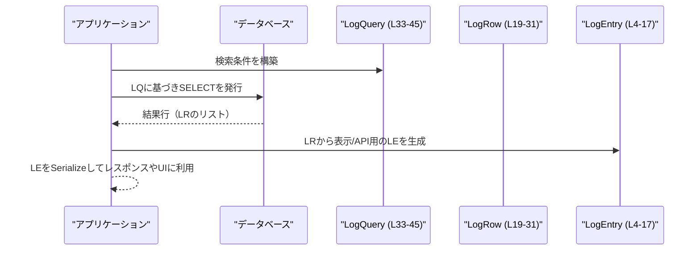

state/src/model/log.rs

---

## 0. ざっくり一言

このファイルは、アプリケーションのログに関する **データモデル（構造体）** を定義するモジュールです。  
ログ1件分の表現、データベース行の表現、ログ検索条件の表現を提供します（`log.rs:L4-17`, `log.rs:L19-31`, `log.rs:L33-45`）。

---

## 1. このモジュールの役割

### 1.1 概要

- このモジュールは、ログ機能で扱うデータを型安全に表現するための **構造体定義** を提供します。
- ログエントリのシリアライズ可能な表現（`LogEntry`）、SQLxで取得するDB行の表現（`LogRow`）、ログ検索条件（`LogQuery`）を定義しています（`log.rs:L4-17`, `log.rs:L19-31`, `log.rs:L33-45`）。

### 1.2 アーキテクチャ内での位置づけ

このチャンクから分かる依存関係は、主に外部クレート `serde` と `sqlx` に対するものです。

```mermaid
graph TD
    subgraph "state::model::log (log.rs L1-46)"
        LE["LogEntry (L4-17)"]
        LR["LogRow (L19-31)"]
        LQ["LogQuery (L33-45)"]
    end

    LE -->|derive Serialize (L4)| Serde["serde::Serialize"]
    LR -->|derive FromRow (L19)| Sqlx["sqlx::FromRow"]
```

- `LogEntry` は `serde::Serialize` を derive しており、シリアライズ（JSONなど）に使える型になっています（`log.rs:L1`, `log.rs:L4`）。
- `LogRow` は `sqlx::FromRow` を derive しており、SQLx の `query_as` 等から DB 行として読み出すことを想定した型です（`log.rs:L2`, `log.rs:L19`）。
- `LogQuery` は外部トレイトには依存せず、ログ検索を表現するプレーンな構造体です（`log.rs:L33-45`）。

### 1.3 設計上のポイント

コードから読み取れる設計上の特徴は次の通りです。

- **責務の分離**（`log.rs:L4-17`, `log.rs:L19-31`, `log.rs:L33-45`）
  - 表示・シリアライズ用のログ表現 `LogEntry`
  - DB からの取得結果表現 `LogRow`
  - 検索条件を表す `LogQuery`
  の3種類が明確に分けられています。
- **オプションフィールドの多用**（`log.rs:L10-16`, `log.rs:L26-30`, `log.rs:L35-43`）
  - ログには存在しないことがあるメタデータ（メッセージ、スレッドID、ファイル名など）を `Option<T>` や `Vec<T>` で表現し、「ない」状態を型で表現しています。
- **状態を持たないデータキャリア**
  - いずれの構造体もメソッドを持たず、純粋なデータ保持用（いわゆる DTO 的）な設計です。
- **トレイト derive による利用想定**
  - `Clone`, `Debug` をすべての構造体で derive（`log.rs:L4`, `log.rs:L19`, `log.rs:L33`）。
  - これにより、ログデータを容易に複製・デバッグ出力できます。
- **並行性**
  - フィールド型はいずれも `i64`, `String`, `Option`, `Vec`, `bool`, `usize` で構成されており（`log.rs:L6-16`, `log.rs:L21-30`, `log.rs:L35-45`）、Rust の規則から、これらの構造体は自動的に `Send + Sync` になります。  
    そのため、スレッド間で安全に共有できます（所有権や借用のルールを守る前提）。

---

## 2. 主要な機能一覧

※このファイルには関数はなく、「機能」はすべて構造体レベルで提供されています。

- `LogEntry`: 1件のログエントリをシリアライズ可能な形で表現する（`log.rs:L4-17`）。
- `LogRow`: SQLx を用いて DB から取得するログ行を表現する（`log.rs:L19-31`）。
- `LogQuery`: ログ検索・取得のための条件（レベル・期間・モジュール名・スレッドIDなど）を表現する（`log.rs:L33-45`）。

---

## 3. 公開 API と詳細解説

### 3.1 型一覧（構造体）

このモジュールの構造体（コンポーネント）インベントリーです。

| 名前        | 種別   | 役割 / 用途                                                                 | 定義位置              |
|-------------|--------|------------------------------------------------------------------------------|-----------------------|
| `LogEntry`  | 構造体 | ログ1件の内容とメタデータを、シリアライズ可能な形で保持する                 | `log.rs:L4-17`        |
| `LogRow`    | 構造体 | SQLx による DB 行マッピング用のログ表現                                     | `log.rs:L19-31`       |
| `LogQuery`  | 構造体 | ログ検索の条件（フィルタ・並び順・件数制限など）を表現する                  | `log.rs:L33-45`       |

#### `LogEntry` フィールド一覧（インベントリー）

| フィールド名          | 型                  | 説明（名前から読み取れる用途）                        | 定義位置        |
|-----------------------|---------------------|-------------------------------------------------------|-----------------|
| `ts`                  | `i64`              | ログ時刻のタイムスタンプ                              | `log.rs:L6`     |
| `ts_nanos`            | `i64`              | ナノ秒単位の補助タイムスタンプ                        | `log.rs:L7`     |
| `level`               | `String`           | ログレベル（"INFO" などの文字列表現）                | `log.rs:L8`     |
| `target`              | `String`           | ログのターゲット（ロガー名やカテゴリ）               | `log.rs:L9`     |
| `message`             | `Option<String>`   | ログメッセージ本体                                    | `log.rs:L10`    |
| `feedback_log_body`   | `Option<String>`   | フィードバック用に付加されるログ本文の可能性         | `log.rs:L11`    |
| `thread_id`           | `Option<String>`   | ログ出力元スレッドの識別子                           | `log.rs:L12`    |
| `process_uuid`        | `Option<String>`   | プロセスを区別する UUID 的な値                        | `log.rs:L13`    |
| `module_path`         | `Option<String>`   | Rust のモジュールパス                                 | `log.rs:L14`    |
| `file`                | `Option<String>`   | ソースファイル名                                      | `log.rs:L15`    |
| `line`                | `Option<i64>`      | ソースコードの行番号                                  | `log.rs:L16`    |

#### `LogRow` フィールド一覧

| フィールド名    | 型                | 説明（名前から読み取れる用途）             | 定義位置      |
|-----------------|-------------------|--------------------------------------------|---------------|
| `id`            | `i64`            | DB 上の主キー／ID                          | `log.rs:L21`  |
| `ts`            | `i64`            | ログ時刻のタイムスタンプ                   | `log.rs:L22`  |
| `ts_nanos`      | `i64`            | ナノ秒単位の補助タイムスタンプ             | `log.rs:L23`  |
| `level`         | `String`         | ログレベル                                  | `log.rs:L24`  |
| `target`        | `String`         | ログのターゲット                           | `log.rs:L25`  |
| `message`       | `Option<String>` | ログメッセージ本体                         | `log.rs:L26`  |
| `thread_id`     | `Option<String>` | スレッドID                                  | `log.rs:L27`  |
| `process_uuid`  | `Option<String>` | プロセスUUID                               | `log.rs:L28`  |
| `file`          | `Option<String>` | ファイル名                                  | `log.rs:L29`  |
| `line`          | `Option<i64>`    | 行番号                                      | `log.rs:L30`  |

#### `LogQuery` フィールド一覧

| フィールド名        | 型                 | 説明（名前から読み取れる用途）                          | 定義位置      |
|---------------------|--------------------|---------------------------------------------------------|---------------|
| `level_upper`       | `Option<String>`   | 指定したレベル以下（または以上）のフィルタ用レベル上限 | `log.rs:L35`  |
| `from_ts`           | `Option<i64>`      | 検索開始時刻                                           | `log.rs:L36`  |
| `to_ts`             | `Option<i64>`      | 検索終了時刻                                           | `log.rs:L37`  |
| `module_like`       | `Vec<String>`      | モジュールパスに対する LIKE 検索用パターン群           | `log.rs:L38`  |
| `file_like`         | `Vec<String>`      | ファイル名に対する LIKE 検索用パターン群               | `log.rs:L39`  |
| `thread_ids`        | `Vec<String>`      | 対象とするスレッドIDのリスト                           | `log.rs:L40`  |
| `search`            | `Option<String>`   | メッセージなどに対する全文検索キーワード               | `log.rs:L41`  |
| `include_threadless`| `bool`             | スレッドIDがないログを含めるかどうか                   | `log.rs:L42`  |
| `after_id`          | `Option<i64>`      | 指定ID以降のログだけを取得するためのカーソル           | `log.rs:L43`  |
| `limit`             | `Option<usize>`    | 取得する最大件数                                       | `log.rs:L44`  |
| `descending`        | `bool`             | 時刻やIDで降順ソートするかどうか                       | `log.rs:L45`  |

### 3.2 関数詳細

このファイルには関数・メソッド定義が存在しないため、詳細解説対象の関数はありません（`log.rs:L1-46` 全体を確認）。

### 3.3 その他の関数

なし（このチャンクには関数が現れません）。

---

## 4. データフロー

このモジュール単体には処理ロジックがないため、**実際のアプリケーション内での流れはコードからは読み取れません**。  
ただし、構造体名とフィールド構成から、一般的なログシステムでの典型的なデータフロー例を示します（あくまで利用イメージです）。

1. アプリケーションがログを出力し、DB に `LogRow` 形式で保存される（`log.rs:L19-31`）。
2. クライアントからの要求やUI操作に応じて、`LogQuery` で検索条件を構築する（`log.rs:L33-45`）。
3. `LogQuery` をもとに SQL を組み立て、SQLx で `LogRow` のリストとして取得する。
4. 表示やAPIレスポンス用に `LogRow` から `LogEntry` を組み立て、シリアライズして返す（`log.rs:L4-17`）。

これをシーケンス図で表すと、次のような形が想定されます。



> 注: このフローは「構造体がどのように使われうるか」の一般的な例であり、  
> 実際の実装がこの通りであるかは、このチャンクからは分かりません。

---

## 5. 使い方（How to Use）

### 5.1 基本的な使用方法

#### 例1: `LogQuery` で検索条件を組み立てる

`LogQuery` は `Default` を derive しているので（`log.rs:L33`）、`LogQuery::default()` から必要なフィールドだけを上書きして使う形が自然です。

```rust
use state::model::log::LogQuery; // パス名は仮。実際のクレート構成に依存する

fn build_error_query() -> LogQuery {
    let mut q = LogQuery::default();                  // すべてのフィールドをデフォルト値で初期化（log.rs:L33）
    q.level_upper = Some("ERROR".to_string());        // ERROR 以上を対象にする（log.rs:L35）
    q.from_ts = Some(1_700_000_000);                  // 開始時刻を指定（log.rs:L36）
    q.to_ts = None;                                   // 終了時刻は指定しない（log.rs:L37）
    q.descending = true;                              // 新しいものから取得したい（log.rs:L45）
    q.limit = Some(100);                              // 最大100件（log.rs:L44）
    q
}
```

この例では、未設定のフィールドは `Default` による値（`None` や空の `Vec`、`false`）になります。

#### 例2: SQLx で `LogRow` を取得する

`LogRow` が `FromRow` を derive しているため（`log.rs:L19`）、SQLx の `query_as` などで直接マッピングできます。

```rust
use sqlx::{PgPool, Result};
use state::model::log::LogRow; // パス名は仮

// 非同期で最新のログを数件取得する例
pub async fn fetch_latest_logs(pool: &PgPool, limit: i64) -> Result<Vec<LogRow>> {
    let rows = sqlx::query_as::<_, LogRow>(           // LogRow にマッピング（log.rs:L19-31）
        "SELECT id, ts, ts_nanos, level, target, message, \
                thread_id, process_uuid, file, line \
         FROM logs ORDER BY id DESC LIMIT $1"
    )
    .bind(limit)
    .fetch_all(pool)
    .await?;
    Ok(rows)
}
```

> SQL 文のカラム順・型は `LogRow` のフィールド（`log.rs:L21-30`）と一致する必要があります。

#### 例3: `LogRow` から `LogEntry` を組み立てる

`LogEntry` は `Serialize` を実装しているため（`log.rs:L4`）、API レスポンスなどで使うために `LogRow` から変換するパターンが考えられます。

```rust
use serde_json;
use state::model::log::{LogRow, LogEntry}; // パス名は仮

fn row_to_entry(row: LogRow) -> LogEntry {
    LogEntry {
        ts: row.ts,                                   // log.rs:L6, L22
        ts_nanos: row.ts_nanos,                       // log.rs:L7, L23
        level: row.level,                             // log.rs:L8, L24
        target: row.target,                           // log.rs:L9, L25
        message: row.message,                         // log.rs:L10, L26
        feedback_log_body: None,                      // log.rs:L11（LogRow には対応フィールドなし）
        thread_id: row.thread_id,                     // log.rs:L12, L27
        process_uuid: row.process_uuid,               // log.rs:L13, L28
        module_path: None,                            // log.rs:L14（DB に無い場合は None）
        file: row.file,                               // log.rs:L15, L29
        line: row.line,                               // log.rs:L16, L30
    }
}

fn serialize_entry(entry: &LogEntry) -> serde_json::Result<String> {
    serde_json::to_string(entry)                      // Serialize により JSON 化可能（log.rs:L4）
}
```

### 5.2 よくある使用パターン

- **期間＋レベルでの絞り込み**
  - `from_ts`, `to_ts`, `level_upper` を組み合わせて、一定期間の WARN 以上のログなどを取得する（`log.rs:L35-37`）。
- **モジュール／ファイル単位のフィルタ**
  - `module_like`, `file_like` にワイルドカードパターンや前方一致文字列を入れて、特定コンポーネントのログだけを見る（`log.rs:L38-39`）。
- **ストリーミング的なページング**
  - `after_id` と `limit` を使い、前回取得した最後の `id` 以降のログだけを取得することで、疑似ストリーミングを行う（`log.rs:L21`, `log.rs:L43-44`）。

### 5.3 よくある間違い（起こりうる誤用）

このファイルから推測される典型的な注意点です。実際のクエリビルド実装に依存する部分については推測を含みます。

```rust
// 誤りの例: limit を全く設定しないまま大量のログを取得しようとする
let mut q = LogQuery::default();
q.level_upper = Some("INFO".into());
// q.limit = None のまま（デフォルト）       // log.rs:L44

// 大量データが返ってパフォーマンスやメモリに影響する可能性

// より安全な例: 適切な limit を付けておく
let mut q = LogQuery::default();
q.level_upper = Some("INFO".into());
q.limit = Some(1000);                                // 上限件数を明示（log.rs:L44）
```

### 5.4 使用上の注意点（まとめ）

- **Option / Vec フィールドの取り扱い**
  - `LogEntry` / `LogRow` / `LogQuery` には多数の `Option<T>` や `Vec<T>` があり（`log.rs:L10-16`, `log.rs:L26-30`, `log.rs:L38-43`）、  
    None や空リストを前提にしない処理を書くことが重要です。
- **並行性**
  - 型は自動的に `Send + Sync` になる構成であり、スレッド間共有は可能ですが、  
    `String` や `Vec` のクローンはコストがかかるため、大量のログを頻繁にコピーしない設計が望ましいです。
- **シリアライズ**
  - `LogEntry` は `Serialize` ですが、`LogRow`, `LogQuery` は derive していません（`log.rs:L4`, `log.rs:L19`, `log.rs:L33`）。  
    そのため、外部インターフェースで使うのは `LogEntry` を基本にする方が自然です。
- **安全性（Security）**
  - `message` や `feedback_log_body` には任意の文字列が入る可能性があり（`log.rs:L10-11`）、  
    それを HTML などに埋め込む際は、XSS 対策を別途行う必要があります。このファイル内ではエスケープ処理は行っていません。

---

## 6. 変更の仕方（How to Modify）

### 6.1 新しい機能を追加する場合

- **ログメタデータを増やす**
  - 例: ホスト名 `host` を追加したい場合
    1. `LogEntry` に `pub host: Option<String>` を追加（`log.rs:L4-17` 付近）。
    2. DB に保存したい場合は `LogRow` にも対応フィールドを追加し（`log.rs:L19-31`）、テーブル定義と SQL を変更する。
    3. 検索条件で利用したい場合は `LogQuery` にフィルタ用フィールドを追加（`log.rs:L33-45`）。
- **検索条件の拡張**
  - 例: プロセスUUIDでフィルタしたい場合
    1. `LogQuery` に `process_uuids: Vec<String>` のような新フィールドを追加（`log.rs:L33-45`）。
    2. クエリビルド側でそのフィールドを読み取り、WHERE 句に反映させる（別ファイルの実装）。

### 6.2 既存の機能を変更する場合

- **影響範囲**
  - フィールド名や型を変更すると、その構造体を利用しているすべてのコード（SQLxクエリ、シリアライズ、APIレスポンスなど）に波及します。
- **前提条件・契約**
  - `LogRow` のフィールド構成は、DBテーブルのカラム構成と 1:1 であることが前提になっていると考えられます（`log.rs:L21-30`）。
  - `LogQuery` の各フィールドは「指定されればフィルタに使われる／指定されなければ無視される」という契約である可能性が高いですが、これはクエリビルド実装側を確認する必要があります。
- **テスト**
  - 構造体にフィールドを追加・削除した場合、関連するシリアライズ／デシリアライズテスト、SQLx のクエリテストを更新する必要があります（このファイルにはテストコードは存在しません）。

---

## 7. 関連ファイル

このチャンクには他の自作モジュールへの参照が現れないため、内部ファイルとの関係は不明です（`log.rs:L1-46`）。

外部依存のみ、参考として列挙します。

| パス / クレート       | 役割 / 関係                                          |
|------------------------|-----------------------------------------------------|
| `serde::Serialize`     | `LogEntry` をシリアライズ可能にするためのトレイト（`log.rs:L1`, `log.rs:L4`） |
| `sqlx::FromRow`        | `LogRow` を SQLx で DB 行から生成するためのトレイト（`log.rs:L2`, `log.rs:L19`） |

> 内部の関連ファイル（例: 実際にクエリを発行するサービス層や API ハンドラ）は、このチャンクからは特定できません。
