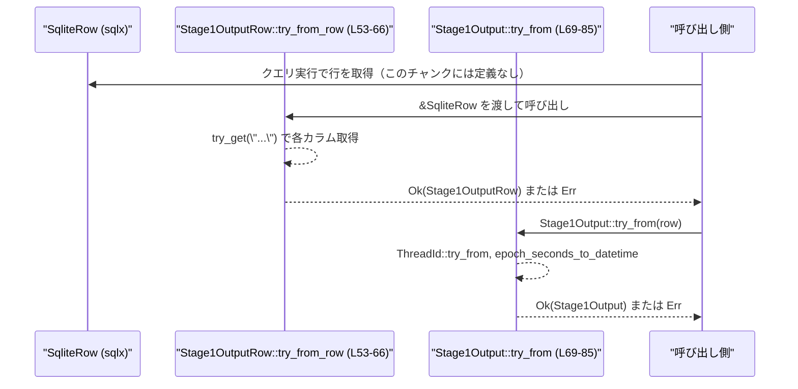
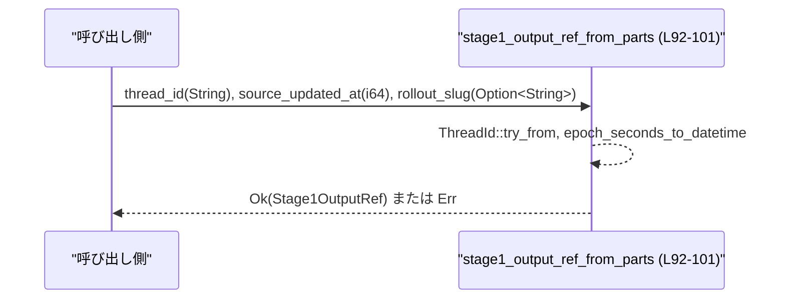

# state/src/model/memories.rs

---

## 0. ざっくり一言

stage-1/phase-2 の「メモリ抽出ジョブ」の結果やジョブクレーム状態を表す **ドメインモデル用の構造体・enum と、SQLite 行からの変換ヘルパ** を定義するモジュールです。  
永続層（sqlx/SQLite）と上位ロジックの間で、型安全にデータを受け渡しする役割があります。  
（根拠: `Stage1Output` の doc コメントと定義、`Stage1JobClaimOutcome` の doc コメントなど  
`memories.rs:L11-22`, `memories.rs:L104-117`, `memories.rs:L40-85`）

---

## 1. このモジュールの役割

### 1.1 概要

- stage-1 メモリ抽出の出力を保持する `Stage1Output` と、その軽量版 `Stage1OutputRef` を定義します。  
  （`memories.rs:L11-30`）
- phase-2（メモリ統合）の入力選択結果を保持する `Phase2InputSelection` を定義します。  
  （`memories.rs:L32-38`）
- SQLite の結果行から内部行型 `Stage1OutputRow` を作成し、さらにドメイン型 `Stage1Output` / `Stage1OutputRef` へ変換する関数を提供します。  
  （`memories.rs:L40-51`, `memories.rs:L53-66`, `memories.rs:L69-85`, `memories.rs:L92-101`）
- stage-1 / phase-2 ジョブのクレーム（ロック取得）結果と、そのパラメータを表す enum/struct を提供します。  
  （`memories.rs:L104-149`, `memories.rs:L119-134`）

### 1.2 アーキテクチャ内での位置づけ

このモジュール内と、確認できる外部依存の関係を示します。

```mermaid
flowchart TD
    subgraph DB層
        SqliteRow["SqliteRow (sqlx)"]
    end

    subgraph モデル層（このファイル）
        S1Row["Stage1OutputRow (L40-51)"]
        S1Out["Stage1Output (L11-22)"]
        S1OutRef["Stage1OutputRef (L25-30)"]
        P2Sel["Phase2InputSelection (L32-38)"]
        S1Outcome["Stage1JobClaimOutcome (L104-117)"]
        S1Claim["Stage1JobClaim (L119-124)"]
        S1Params["Stage1StartupClaimParams (L126-134)"]
        P2Outcome["Phase2JobClaimOutcome (L136-149)"]
    end

    subgraph 外部ドメイン
        ThreadId["ThreadId (codex_protocol)"]
        ThreadMeta["ThreadMetadata (super)"]
    end

    SqliteRow -->|"try_from_row (L53-66)"| S1Row
    S1Row -->|"TryFrom impl (L69-85)"| S1Out
    ThreadId --> S1Out
    ThreadId --> S1OutRef
    ThreadMeta --> S1Claim

    S1Out & S1OutRef --> P2Sel

    %% ジョブクレーム関連（このチャンクではロジック不明）
    S1Params --> S1Outcome
    S1Params --> P2Outcome
```

上図のうち、矢印の「どの関数が呼ばれるか」はこのチャンク内で定義されていますが、  
`Stage1JobClaimOutcome` / `Phase2JobClaimOutcome` を実際に生成するロジックは **このチャンクには現れません**。

### 1.3 設計上のポイント

- **永続層とドメイン層の分離**  
  - SQLite の行は `Stage1OutputRow`（全フィールド `String` や `i64`）に読み込み、  
    そこから `Stage1Output` へ変換する二段階構造になっています。  
    （`memories.rs:L40-51`, `memories.rs:L69-85`）
- **時間表現の統一**  
  - DB 側は Unix エポック秒 `i64`、ドメイン側は `DateTime<Utc>` とし、  
    `epoch_seconds_to_datetime` で変換します。  
    （`memories.rs:L40-51`, `memories.rs:L87-90`）
- **エラーハンドリング**  
  - 変換処理はすべて `anyhow::Result` / `anyhow::Error` で失敗を表現し、  
    無効なタイムスタンプ・不正な `ThreadId`・DB スキーマ不一致などをエラーとして返します。  
    （`memories.rs:L1`, `memories.rs:L53-66`, `memories.rs:L69-85`, `memories.rs:L87-90`, `memories.rs:L92-101`）
- **ジョブクレーム状態の明示**  
  - stage-1 / phase-2 ジョブのクレーム結果を enum で明示し、  
    呼び出し側が `match` で分岐しやすい形にしています。  
    （`memories.rs:L104-117`, `memories.rs:L136-149`）
- **状態を持たない**  
  - このモジュールはグローバル状態や内部可変状態を持たず、  
    構造体と純粋な変換関数のみで構成されています。  
    並行実行時にもこのモジュール単体では共有可変状態を扱いません（このチャンクから確認できる範囲）。  

---

## 2. 主要な機能一覧

- stage-1 出力モデル `Stage1Output`: 1 スレッド分のメモリ抽出結果とメタデータを保持する。  
  （`memories.rs:L11-22`）
- 軽量参照モデル `Stage1OutputRef`: `thread_id` と更新時刻・slug のみを保持する参照用データ。  
  （`memories.rs:L25-30`）
- phase-2 入力選択結果 `Phase2InputSelection`: phase-2 で使用する/しない `Stage1Output` の集合をまとめる。  
  （`memories.rs:L32-38`）
- DB 行型 `Stage1OutputRow`: SQLite の 1 行を表す内部構造体。  
  （`memories.rs:L40-51`）
- `Stage1OutputRow::try_from_row`: `SqliteRow` から `Stage1OutputRow` への変換。  
  （`memories.rs:L53-66`）
- `Stage1Output` の `TryFrom<Stage1OutputRow>` 実装: DB 型からドメイン型への変換。  
  （`memories.rs:L69-85`）
- `epoch_seconds_to_datetime`: Unix エポック秒 `i64` を `DateTime<Utc>` に変換。  
  （`memories.rs:L87-90`）
- `stage1_output_ref_from_parts`: プリミティブ値から `Stage1OutputRef` を生成。  
  （`memories.rs:L92-101`）
- `Stage1JobClaimOutcome` / `Phase2JobClaimOutcome`: ジョブクレームの結果状態を表現。  
  （`memories.rs:L104-117`, `memories.rs:L136-149`）
- `Stage1JobClaim`: クレームされた stage-1 ジョブと、そのスレッドメタデータをまとめる。  
  （`memories.rs:L119-124`）
- `Stage1StartupClaimParams`: スタートアップ時のジョブスキャン/クレームのパラメータセット。  
  （`memories.rs:L126-134`）

---

## 3. 公開 API と詳細解説

### 3.1 型一覧（構造体・列挙体など）

| 名前 | 種別 | 公開範囲 | 役割 / 用途 | 定義位置 |
|------|------|----------|-------------|----------|
| `Stage1Output` | 構造体 | `pub` | 1 スレッドの stage-1 メモリ抽出結果と、ロールアウトに関するメタデータを保持する。 | `memories.rs:L11-22` |
| `Stage1OutputRef` | 構造体 | `pub` | `thread_id` と `source_updated_at`、`rollout_slug` だけを持つ軽量参照。差分/削除などの処理で利用される想定。 | `memories.rs:L25-30` |
| `Phase2InputSelection` | 構造体 | `pub` | phase-2 統合で使用する `Stage1Output` の選択結果（追加・維持・削除）をまとめるコンテナ。 | `memories.rs:L32-38` |
| `Stage1OutputRow` | 構造体 | `pub(crate)` | SQLite 行を一旦受ける内部表現。すべて `String`/`i64` で、DB スキーマに近い形。 | `memories.rs:L40-51` |
| `Stage1JobClaimOutcome` | enum | `pub` | stage-1 メモリ抽出ジョブのクレーム（ロック取得）結果を表現する。 | `memories.rs:L104-117` |
| `Stage1JobClaim` | 構造体 | `pub` | 実際にクレームされた stage-1 ジョブと、その `ThreadMetadata` と所有トークンを束ねる。 | `memories.rs:L119-124` |
| `Stage1StartupClaimParams<'a>` | 構造体 | `pub` | スタートアップ時にどのジョブ候補をスキャン/クレームするかを制御するパラメータ群。 | `memories.rs:L126-134` |
| `Phase2JobClaimOutcome` | enum | `pub` | phase-2 統合ジョブ（グローバル）のクレーム結果を表現する。 | `memories.rs:L136-149` |

### 3.2 関数詳細（4 件）

#### `Stage1OutputRow::try_from_row(row: &SqliteRow) -> Result<Stage1OutputRow>`

**概要**

`sqlx` の `SqliteRow` から、内部行型 `Stage1OutputRow` を構築します。  
DB カラム名と型に基づいて `try_get` を行い、失敗した場合は `anyhow::Error` を返します。  
（`memories.rs:L53-66`）

**引数**

| 引数名 | 型 | 説明 |
|--------|----|------|
| `row` | `&SqliteRow` | `sqlx` が返した 1 行分の結果。SQLite 用。 |

**戻り値**

- `Result<Stage1OutputRow>` (`anyhow::Result` のエイリアス)  
  - `Ok(Stage1OutputRow)` : すべてのカラム取得に成功した場合。  
  - `Err(anyhow::Error)` : カラムが存在しない、型が不一致などで `try_get` が失敗した場合。

**内部処理の流れ**

1. 各フィールドごとに `row.try_get("<column_name>")?` を呼び出す。  
   （例: `thread_id`, `rollout_path`, `source_updated_at` など  
   `memories.rs:L56-64`）
2. 取得した値を使って `Stage1OutputRow { ... }` を構築し、`Ok(Self { ... })` で返す。  
   （`memories.rs:L55-65`）
3. いずれかの `try_get` が失敗した場合、そのエラーが `?` 演算子により呼び出し元へ伝播する。

**Examples（使用例）**

```rust
use anyhow::Result;
use sqlx::{Row, sqlite::SqliteRow};
use state::model::memories::Stage1OutputRow; // モジュールパスは実際のクレート構成に依存する

async fn load_row_example(row: SqliteRow) -> Result<Stage1OutputRow> {
    // SqliteRow から Stage1OutputRow を構築する
    Stage1OutputRow::try_from_row(&row)
}
```

このコードでは、SQL クエリで取得した `SqliteRow` を `Stage1OutputRow` に変換し、  
変換時の失敗（カラム名の誤りなど）は `Result` の `Err` として呼び出し元へ返されます。

**Errors / Panics**

- `Errors`  
  - `row.try_get("thread_id")` など各 `try_get` が失敗すると `sqlx::Error` が発生し、  
    `anyhow::Error` にラップされて `Err` となります。  
    （`memories.rs:L56-64`）
- `Panics`  
  - この関数内部に `panic!` を呼ぶコードはなく、`unwrap` なども使用していないため、  
    **このチャンクのコード上は panic しません**。

**Edge cases（エッジケース）**

- 対象のカラムが DB に存在しない場合  
  - `sqlx::Error::ColumnNotFound` などとなり `Err` になります。
- カラムの型が期待と異なる場合（例: `source_updated_at` が `TEXT` の場合など）  
  - `sqlx::Error::ColumnDecode` となり `Err` になります。
- `NULL` カラム  
  - 非 `Option<T>` フィールドに対する `NULL` はデコードエラーになります。  
    一方、`rollout_slug` や `git_branch` のように `Option<String>` のフィールドは  
    `NULL` を `None` として扱える想定です。  
    （`memories.rs:L47`, `memories.rs:L49`）

**使用上の注意点**

- **DB スキーマとカラム名の整合性が前提**  
  - カラム名を文字列で指定しているため、スキーマ変更時はこの関数も更新する必要があります。  
- **型の整合性**  
  - `source_updated_at` / `generated_at` は `i64` で取得される前提です。  
    ミリ秒 / マイクロ秒ではなく「秒」で格納されている必要があります（関数名 `epoch_seconds_to_datetime` からの推測）。  
    DB 側の型・単位は別途確認が必要です。

---

#### `impl TryFrom<Stage1OutputRow> for Stage1Output`

```rust
fn try_from(row: Stage1OutputRow) -> std::result::Result<Stage1Output, anyhow::Error>
```

**概要**

内部行型 `Stage1OutputRow` から、ドメインモデル `Stage1Output` へ変換します。  
`ThreadId` と `DateTime<Utc>` への変換を行い、変換失敗時は `anyhow::Error` を返します。  
（`memories.rs:L69-85`）

**引数**

| 引数名 | 型 | 説明 |
|--------|----|------|
| `row` | `Stage1OutputRow` | SQLite 行を表す内部構造体。所有権をムーブして受け取ります。 |

**戻り値**

- `Result<Stage1Output, anyhow::Error>`  
  - `Ok(Stage1Output)` : すべての変換に成功した場合。  
  - `Err(anyhow::Error)` : `ThreadId::try_from` か `epoch_seconds_to_datetime` のいずれかが失敗した場合。

**内部処理の流れ**

1. `row.thread_id`（文字列）を `ThreadId::try_from` でドメイン型に変換します。  
   （`memories.rs:L74`）
2. パス系フィールドは `PathBuf::from(row.rollout_path)` / `PathBuf::from(row.cwd)` として所有型に変換します。  
   （`memories.rs:L75`, `memories.rs:L80`）
3. `source_updated_at` / `generated_at`（エポック秒 `i64`）は  
   `epoch_seconds_to_datetime` を通じて `DateTime<Utc>` に変換します。  
   （`memories.rs:L76`, `memories.rs:L82`, `memories.rs:L87-90`）
4. `raw_memory`, `rollout_summary`, `rollout_slug`, `git_branch` はそのままムーブします。  
   （`memories.rs:L77-81`）

**Examples（使用例）**

```rust
use anyhow::Result;
use state::model::memories::{Stage1OutputRow, Stage1Output};

fn convert_row(row: Stage1OutputRow) -> Result<Stage1Output> {
    // TryFrom 実装があるので、`Stage1Output::try_from(row)` を呼び出す
    Stage1Output::try_from(row)
}
```

この例では、DB から読み込んだ `Stage1OutputRow` から `Stage1Output` を生成します。  
`ThreadId` 文字列が不正な場合や、タイムスタンプが範囲外の場合は `Err` になります。

**Errors / Panics**

- `Errors`  
  - `ThreadId::try_from(row.thread_id)` が失敗した場合。  
    （`memories.rs:L74`）  
  - `epoch_seconds_to_datetime(row.source_updated_at)` / `epoch_seconds_to_datetime(row.generated_at)` が  
    `Err` を返した場合。  
    （`memories.rs:L76`, `memories.rs:L82`, `memories.rs:L87-90`）
- `Panics`  
  - panic を発生させるコードは含まれていません。

**Edge cases（エッジケース）**

- `row.thread_id` が不正な形式の文字列  
  - `ThreadId::try_from` の仕様に依存しますが、この関数からは `Err(anyhow::Error)` が返されます。  
- `source_updated_at` / `generated_at` が `DateTime::<Utc>::from_timestamp` の範囲外  
  - `epoch_seconds_to_datetime` で `Err(anyhow!("invalid unix timestamp: {secs}"))` となります。  
    （`memories.rs:L87-90`）
- 非 ASCII のパス文字列  
  - `PathBuf::from` は OS 依存の文字列処理ですが、ここでは単にラップするだけで検証は行っていません。

**使用上の注意点**

- 呼び出し側は `Result` を必ずハンドリングする必要があります。`unwrap` などで落とす場合は、  
  上記エッジケースでプロセスが終了することになります。
- `Stage1OutputRow` のフィールド型/意味と `Stage1Output` が 1:1 対応しているため、  
  スキーマ変更時は両方を同時に更新する必要があります。

---

#### `epoch_seconds_to_datetime(secs: i64) -> Result<DateTime<Utc>>`

**概要**

Unix エポック秒（1970-01-01 00:00:00 UTC からの経過秒）を `DateTime<Utc>` に変換します。  
範囲外の秒数の場合は `Err(anyhow::Error)` を返します。  
（`memories.rs:L87-90`）

**引数**

| 引数名 | 型 | 説明 |
|--------|----|------|
| `secs` | `i64` | Unix エポックからの秒数。 |

**戻り値**

- `Result<DateTime<Utc>>` (`anyhow::Result` の型引数)  
  - `Ok(DateTime<Utc>)` : 妥当な範囲の秒数だった場合。  
  - `Err(anyhow::Error)` : 範囲外で `from_timestamp` が `None` を返した場合。

**内部処理の流れ**

1. `DateTime::<Utc>::from_timestamp(secs, 0)` を呼び出し、  
   秒数とナノ秒 0 の組み合わせから `Option<DateTime<Utc>>` を得る。  
   （`memories.rs:L88`）
2. `ok_or_else` で `Option` を `Result` に変換し、`None` の場合は  
   `anyhow::anyhow!("invalid unix timestamp: {secs}")` を生成して `Err` にする。  
   （`memories.rs:L88-90`）

**Examples（使用例）**

```rust
use anyhow::Result;
use chrono::{Utc, TimeZone};
use state::model::memories::epoch_seconds_to_datetime;

fn convert_example() -> Result<()> {
    // 1970-01-01 00:00:00 UTC
    let dt = epoch_seconds_to_datetime(0)?; // エポック秒 0 を DateTime<Utc> に変換
    assert_eq!(dt, Utc.timestamp_opt(0, 0).single().unwrap());
    Ok(())
}
```

**Errors / Panics**

- `Errors`  
  - `secs` が `chrono` のサポート範囲外で、`from_timestamp` が `None` を返した場合に  
    `Err(anyhow!("invalid unix timestamp: {secs}"))` となります。  
    （`memories.rs:L88-90`）
- `Panics`  
  - 関数内に panic を起こすコードはありません。

**Edge cases（エッジケース）**

- 非常に大きな正の値/負の値（遠い未来/過去）  
  - `chrono` が扱える範囲外の値は `Err` になります。
- 負の値  
  - `from_timestamp` 自体は負の秒数も扱えますが、範囲外の場合のみ `Err` になります。  
    具体的な閾値は `chrono` の実装に依存します。

**使用上の注意点**

- この関数は秒単位を前提にしており、ミリ秒・マイクロ秒をそのまま渡すと  
  誤った日時に変換されます（例: 1,600,000,000,000 を秒として扱うなど）。  
  呼び出し側で単位を確認する必要があります。
- エラー内容は文字列メッセージのみで、エラー種別の enum ではありません。  
  より細かな分類が必要な場合は、上位層でラップし直す設計が考えられます（あくまで設計上の選択の話であり、このコード自体はそのようなラップを行っていません）。

---

#### `stage1_output_ref_from_parts(thread_id: String, source_updated_at: i64, rollout_slug: Option<String>) -> Result<Stage1OutputRef>`

**概要**

プリミティブ値（`String` と `i64`）から `Stage1OutputRef` を構築するヘルパ関数です。  
`ThreadId::try_from` と `epoch_seconds_to_datetime` を使って、型安全な `Stage1OutputRef` を生成します。  
（`memories.rs:L92-101`）

**引数**

| 引数名 | 型 | 説明 |
|--------|----|------|
| `thread_id` | `String` | 文字列として取得したスレッド ID。 |
| `source_updated_at` | `i64` | Unix エポック秒として表現された source 更新時刻。 |
| `rollout_slug` | `Option<String>` | ロールアウトに紐づく slug（存在しない場合は `None`）。 |

**戻り値**

- `Result<Stage1OutputRef>`  
  - `Ok(Stage1OutputRef)` : `ThreadId` と `DateTime<Utc>` への変換が成功した場合。  
  - `Err(anyhow::Error)` : いずれかの変換が失敗した場合。

**内部処理の流れ**

1. `ThreadId::try_from(thread_id)` を呼び出し、文字列から `ThreadId` へ変換します。  
   （`memories.rs:L98`）
2. `epoch_seconds_to_datetime(source_updated_at)` を呼び出し、  
   エポック秒から `DateTime<Utc>` へ変換します。  
   （`memories.rs:L99`）
3. `rollout_slug` はそのままフィールドへムーブし、`Stage1OutputRef` を構築して `Ok` を返します。  
   （`memories.rs:L97-101`）

**Examples（使用例）**

```rust
use anyhow::Result;
use state::model::memories::stage1_output_ref_from_parts;

fn build_ref_example() -> Result<()> {
    let thread_id = "thread-123".to_string();   // スレッドID文字列
    let source_updated_at = 1_700_000_000;      // 例: エポック秒
    let rollout_slug = Some("rollout-xyz".to_string());

    let s1_ref = stage1_output_ref_from_parts(thread_id, source_updated_at, rollout_slug)?;
    // s1_ref.thread_id は ThreadId 型、source_updated_at は DateTime<Utc> 型になっている

    Ok(())
}
```

**Errors / Panics**

- `Errors`  
  - `ThreadId::try_from(thread_id)` が失敗した場合。  
    （`memories.rs:L98`）  
  - `epoch_seconds_to_datetime(source_updated_at)` が `Err` を返した場合。  
    （`memories.rs:L99`）
- `Panics`  
  - panic を起こすコードは含まれていません。

**Edge cases（エッジケース）**

- `thread_id` に不正フォーマットの文字列が渡された場合  
  - `ThreadId::try_from` の仕様に従い `Err` になります。  
- `source_updated_at` が範囲外のエポック秒  
  - `epoch_seconds_to_datetime` が `Err` を返します。  
- `rollout_slug` が `None`  
  - 正常に `Stage1OutputRef` が作られ、`rollout_slug` フィールドは `None` のままです。

**使用上の注意点**

- 引数の `thread_id` と `source_updated_at` は **検証済みである保証がありません**。  
  呼び出し側で検証するか、この関数の `Result` を必ず確認する必要があります。
- `ThreadId` 型やタイムスタンプの意味付けはこのチャンクには現れないため、  
  それらの仕様に依存する部分は別ファイルのドキュメントを参照する必要があります。

---

### 3.3 その他の関数

このファイルに定義されている関数は、すべて上記 4 件に含まれています。  
追加のヘルパー関数やラッパーは **このチャンクには現れません**。

---

## 4. データフロー

### 4.1 stage-1 出力のロードフロー

`SqliteRow` から `Stage1Output` を得るまでの代表的なフローです。  
実際の DB クエリや I/O は他ファイルにありますが、このチャンクで確定的に分かる部分のみを図示します。



- ここでのエラーパスはすべて `Result<_, anyhow::Error>` を通じて呼び出し側へ返されます。  
- 並行性に関して、このフローは **共有可変状態を持たない純粋な変換** であり、  
  複数スレッドから同時に呼び出しても、このモジュール内でデータ競合は発生しません。

### 4.2 軽量参照 `Stage1OutputRef` の構築フロー



この関数も状態を持たず、完全に純粋な変換関数として振る舞います。

### 4.3 ジョブクレーム結果の利用イメージ

`Stage1JobClaimOutcome` / `Phase2JobClaimOutcome` の生成ロジックはこのチャンクにありませんが、  
生成後の利用は典型的に次のような `match` になると解釈できます（enum 定義の内容に基づく）。

```mermaid
flowchart TD
    A["クレーム処理（他モジュール）"] --> B["Stage1JobClaimOutcome (L104-117)"]
    B -->|Claimed { ownership_token }| C["ジョブ実行開始"]
    B -->|SkippedUpToDate| D["何もしない / ログのみ"]
    B -->|SkippedRunning| E["他ワーカーが処理中と判断"]
    B -->|SkippedRetryBackoff| F["バックオフ後に再試行予定"]
    B -->|SkippedRetryExhausted| G["自動再試行を終了"]
```

---

## 5. 使い方（How to Use）

### 5.1 基本的な使用方法

#### 5.1.1 DB 行から `Stage1Output` を得る

```rust
use anyhow::Result;
use sqlx::{SqlitePool, Row};
use state::model::memories::{Stage1OutputRow, Stage1Output};

async fn load_stage1_outputs(pool: &SqlitePool) -> Result<Vec<Stage1Output>> {
    // 1. SQL を実行して行を取得する
    let rows = sqlx::query("SELECT * FROM stage1_outputs")  // 対象テーブル名は仮
        .fetch_all(pool)
        .await?; // I/O エラーなどはここで Err になる

    let mut outputs = Vec::new();

    for row in rows {
        // 2. SqliteRow -> Stage1OutputRow
        let row = Stage1OutputRow::try_from_row(&row)?;     // memories.rs:L53-66

        // 3. Stage1OutputRow -> Stage1Output
        let output = Stage1Output::try_from(row)?;          // memories.rs:L69-85

        outputs.push(output);
    }

    Ok(outputs)
}
```

### 5.2 よくある使用パターン

#### 5.2.1 ジョブクレーム結果の分岐

```rust
use state::model::memories::Stage1JobClaimOutcome;

// outcome はどこかのジョブクレーマから返される想定（このチャンクには実装なし）
fn handle_stage1_outcome(outcome: Stage1JobClaimOutcome) {
    match outcome {
        Stage1JobClaimOutcome::Claimed { ownership_token } => {
            // ownership_token を使ってジョブを続行する
        }
        Stage1JobClaimOutcome::SkippedUpToDate => {
            // 出力が最新なので何もしない
        }
        Stage1JobClaimOutcome::SkippedRunning => {
            // 別ワーカーが処理中。ログ出力などを行う
        }
        Stage1JobClaimOutcome::SkippedRetryBackoff => {
            // バックオフ中。次回まで待つ
        }
        Stage1JobClaimOutcome::SkippedRetryExhausted => {
            // リトライ上限。アラートなどの運用対応に切り替える
        }
    }
}
```

同様に `Phase2JobClaimOutcome` も `match` で分岐して利用するのが基本的なパターンです。  
（`memories.rs:L136-149`）

#### 5.2.2 `Phase2InputSelection` の利用イメージ

`Phase2InputSelection` は単なるデータコンテナであり、このチャンクには操作関数がありません。  
基本的には、phase-2 の統合ロジックが次のように構築する形になります。

```rust
use state::model::memories::{Phase2InputSelection, Stage1Output, Stage1OutputRef};

fn build_selection(
    newly_selected: Vec<Stage1Output>,
    previously_selected: Vec<Stage1Output>,
    removed_refs: Vec<Stage1OutputRef>,
    retained_ids: Vec<codex_protocol::ThreadId>,
) -> Phase2InputSelection {
    Phase2InputSelection {
        selected: newly_selected,
        previous_selected,
        retained_thread_ids: retained_ids,
        removed: removed_refs,
    }
}
```

### 5.3 よくある間違い

```rust
use state::model::memories::epoch_seconds_to_datetime;

// 間違い例: ミリ秒をそのまま渡してしまう
fn wrong_time() {
    let millis = 1_700_000_000_000_i64;
    // コンパイルは通るが、chrono の範囲外になり Err になる可能性がある
    let _ = epoch_seconds_to_datetime(millis);
}

// 正しい例: 事前に秒に変換してから渡す
fn correct_time() {
    let millis = 1_700_000_000_000_i64;
    let secs = millis / 1000;
    let _ = epoch_seconds_to_datetime(secs);
}
```

- `epoch_seconds_to_datetime` は「秒」単位前提であり、ミリ秒などをそのまま渡すと  
  不正なタイムスタンプとしてエラーになる可能性があります。  
  （`memories.rs:L87-90`）

### 5.4 使用上の注意点（まとめ）

**エラー・契約（contracts）**

- すべての変換関数は `Result` で失敗を返すため、呼び出し側は必ず `match` / `?` などで処理する必要があります。  
- `ThreadId` や Unix 時刻の妥当性検証は、このモジュールでは一切行っていません。  
  妥当でない入力を渡すと `Err` が返る前提です。  
- `Stage1JobClaimOutcome` / `Phase2JobClaimOutcome` の各バリアントは、  
  「その状態のときに新たなジョブを実行してはいけない」などの意味を暗黙に持っていると考えられますが、  
  具体的な契約内容はこのチャンクからは分かりません。コメント上はスキップ理由を説明しています。  
  （`memories.rs:L107-116`, `memories.rs:L139-148`）

**並行性**

- このモジュールの関数はすべて **純粋関数**（外部状態を変更しない）であり、  
  静的な `mut` 変数やグローバル状態は存在しません。  
  よって、このモジュール単体ではスレッド間のデータ競合は発生しません。  
- 並行ジョブの調整は enum で表現されますが、実際のロック機構や Lease の実装は他ファイルにあります。

**セキュリティ / バグになりうる点**

- `Stage1Output` は `PathBuf` や `raw_memory` を生の文字列として保持しますが、  
  その内容のサニタイズ・検証は行っていません。  
  ファイルアクセスやコマンド実行に利用する場合は、上位層での検証が必要です。  
- DB スキーマ変更（カラム名変更・型変更）がこのモジュールに反映されないと、  
  `Stage1OutputRow::try_from_row` が実行時エラーとなります。  
  コンパイル時には検出されないため、マイグレーション時の注意が必要です。

**パフォーマンスの観点**

- ここで行っている処理は文字列コピー・`PathBuf`/`DateTime` の構築程度で、  
  I/O に比べれば軽量な処理です。  
- 大量のレコードを一度に処理する場合は、`Stage1Output` や文字列が多くのメモリを消費する可能性はありますが、  
  このモジュール単体からは具体的なボトルネックは読み取れません。

---

## 6. 変更の仕方（How to Modify）

### 6.1 新しい機能を追加する場合

例: `Stage1Output` に新しいメタデータフィールドを追加するケース。

1. **ドメインモデルの追加**  
   - `Stage1Output` にフィールドを追加します。  
     （`memories.rs:L13-22`）
2. **DB 行型の追従**  
   - 該当情報を DB に保存するなら、`Stage1OutputRow` に対応フィールドを追加し、  
     `try_from_row` で `try_get` を行うカラムを増やします。  
     （`memories.rs:L40-51`, `memories.rs:L53-66`）
3. **変換ロジックの更新**  
   - `impl TryFrom<Stage1OutputRow> for Stage1Output` 内で、新フィールドの値をセットします。  
     （`memories.rs:L69-85`）
4. **phase-2 入力選択への影響確認**  
   - `Phase2InputSelection` が `Stage1Output` を保持するため、  
     新フィールドを利用するロジック（別ファイル）への影響を確認します。  
5. **テストの追加/更新**  
   - 単体テスト（このチャンクには記載がありません）で  
     新フィールドを含む round-trip（DB -> モデル）の検証を追加することが望ましいです。

### 6.2 既存の機能を変更する場合

**影響範囲の確認**

- `Stage1Output` / `Stage1OutputRef` / `Phase2InputSelection` を変更する場合  
  - これらをフィールドとして持つ構造体、関数の呼び出し箇所をすべて検索する必要があります。  
- `Stage1JobClaimOutcome` / `Phase2JobClaimOutcome` にバリアントを追加・削除する場合  
  - すべての `match` 式がコンパイルエラーで知らせてくれるため、  
    呼び出し元の網羅性を保ちやすい設計になっています。

**契約（前提条件・返り値）の変更時の注意**

- `epoch_seconds_to_datetime` の振る舞いを変えると、  
  `Stage1Output` / `Stage1OutputRef` の生成ロジック全体に影響します。  
  ここでのエラー種別やメッセージは、ログやユーザー向けメッセージにそのまま出る可能性があるため、  
  その影響も考慮する必要があります。  
  （`memories.rs:L87-90`, `memories.rs:L69-85`, `memories.rs:L92-101`）

**テストに関する注意**

- このチャンクにはテストコードは含まれていませんが、  
  変更後は少なくとも以下のケースをテストすることが実務上有効です。  
  - 正常系: 妥当な行から `Stage1Output` を取得できる。  
  - タイムスタンプ範囲外: `epoch_seconds_to_datetime` が `Err` を返す。  
  - 不正な `thread_id`: `ThreadId::try_from` が `Err` を返す。  
  - ジョブクレーム enum: すべてのバリアントが `match` で処理されている。

---

## 7. 関連ファイル

このモジュールと密接に関係すると考えられる型・モジュールです。  
（ただし、このチャンクにはファイルパスまでは記載されていないため、推測を含まない範囲での列挙に留めます。）

| パス/型 | 役割 / 関係 |
|--------|------------|
| `super::ThreadMetadata` | stage-1 ジョブに紐づくスレッドのメタデータ。`Stage1JobClaim` のフィールドとして利用されます。`memories.rs:L9`, `memories.rs:L119-124` |
| `codex_protocol::ThreadId` | スレッド ID のドメイン型。`Stage1Output` / `Stage1OutputRef` のフィールドに使用され、文字列からの `TryFrom` が呼ばれます。`memories.rs:L4`, `memories.rs:L14`, `memories.rs:L27`, `memories.rs:L36`, `memories.rs:L74`, `memories.rs:L98` |
| `sqlx::sqlite::SqliteRow` | SQLite の結果行を表す型。`Stage1OutputRow::try_from_row` の入力として使用されます。`memories.rs:L6`, `memories.rs:L54` |
| `chrono::DateTime<Utc>` | タイムスタンプの型。エポック秒 `i64` からの変換に使用されます。`memories.rs:L2-3`, `memories.rs:L16`, `memories.rs:L22`, `memories.rs:L28`, `memories.rs:L87-90` |
| `anyhow` クレート | `Result` / `Error` を通して変換エラーを表現します。`memories.rs:L1`, `memories.rs:L69-71`, `memories.rs:L87-90`, `memories.rs:L92-101` |

このチャンク内にはテストモジュール（`mod tests` 等）は定義されていません。  
テストコードが存在するかどうかは別ファイルを見ないと分かりません。
