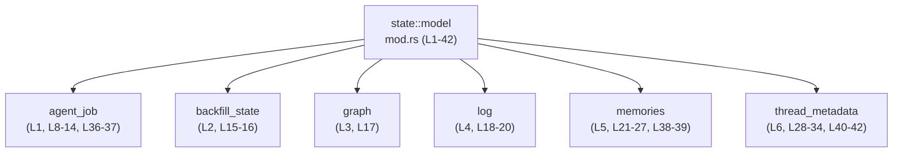

# state/src/model/mod.rs コード解説

## 0. ざっくり一言

- `state` クレートの「model」層にあるサブモジュールから、ドメインモデルらしき型やアイテムをまとめて再エクスポートする“窓口”モジュールです（`mod` と `pub use` / `pub(crate) use` のみで構成されています）。（`state/src/model/mod.rs:L1-42`）

---

## 1. このモジュールの役割

### 1.1 概要

- このモジュールは、`agent_job`・`backfill_state`・`graph`・`log`・`memories`・`thread_metadata` という 6 つのサブモジュールを定義しています。（`state/src/model/mod.rs:L1-6`）
- 各サブモジュール内で定義されたアイテムを `pub use` で外部 API として公開し、`pub(crate) use` でクレート内部向けに再エクスポートしています。（`state/src/model/mod.rs:L8-34, L36-42`）
- このファイル自身には `struct` / `enum` / `fn` などの定義は存在せず、**公開 API の集約と名前の整理のみ**を行っています。（`state/src/model/mod.rs:L1-42` に定義宣言がないことから）

### 1.2 アーキテクチャ内での位置づけ

このファイルを中心としたモジュール依存関係は、次のように整理できます。



- 外部コードは通常、`state::model::AgentJob` のように **`model` モジュール経由で型にアクセス**することが想定されます（クレート名はこのチャンクからは不明）。  
- クレート内部では、`pub(crate) use` された `AgentJobRow` や `ThreadRow` などを `crate::model::AgentJobRow` のように参照できる構造になっています。（`state/src/model/mod.rs:L36-42`）

※ 実際のクレート名（`state` かどうか）は `Cargo.toml` がこのチャンクにないため不明です。

### 1.3 設計上のポイント

コードから読み取れる設計上の特徴は次の通りです。

- **責務の分割**
  - 機能ごとに `agent_job`・`backfill_state`・`log` などのサブモジュールに分割され、それらをこの `mod.rs` が束ねる構造になっています。（`state/src/model/mod.rs:L1-6`）
- **ファサード（窓口）としての再エクスポート**
  - 外部公開用には `pub use`、クレート内部用には `pub(crate) use` が使い分けられており、公開範囲を明示的に制御しています。（`state/src/model/mod.rs:L8-34, L36-42`）
- **状態やログに関するモデル群**
  - 再エクスポートされている名前には `AgentJobStatus`、`BackfillState`、`LogEntry`、`ThreadMetadata` などが含まれており、ジョブ管理やバックフィル、ログ、スレッドメタデータに関連するモデル群を扱っていることが分かりますが、詳細な構造や挙動はこのチャンクには現れません。（`state/src/model/mod.rs:L8-34`）
- **安全性・エラー処理・並行性**
  - このファイル内には実行ロジックやエラー処理、並行処理に関するコードは存在せず、Rust 特有の所有権やエラーハンドリングの方針は、サブモジュール側の実装に委ねられています。（`state/src/model/mod.rs:L1-42`）

---

## 2. 主要な機能一覧

このファイル自身は「機能」よりも「型・アイテムの公開窓口」としての役割が中心です。  
モジュール単位で見ると、次のように整理できます（役割は名前から分かる範囲にとどめています）。

- **AgentJob 関連アイテムの公開**（`state/src/model/mod.rs:L8-14, L36-37`）
  - `AgentJob` / `AgentJobStatus` など、エージェントジョブ関連のモデルおよびクレート内部向けの `AgentJobRow` などを公開。
- **Backfill 状態モデルの公開**（`state/src/model/mod.rs:L15-16`）
  - `BackfillState` / `BackfillStatus` を公開。
- **スレッド生成グラフ状態の公開**（`state/src/model/mod.rs:L17`）
  - `DirectionalThreadSpawnEdgeStatus` を公開。
- **ログクエリ・ログ行モデルの公開**（`state/src/model/mod.rs:L18-20`）
  - `LogEntry` / `LogQuery` / `LogRow` を公開。
- **memories 関連のステージ別ジョブ・出力モデルの公開**（`state/src/model/mod.rs:L21-27, L38-39`）
  - `Stage1Output` や `Stage1JobClaim` など各ステージのアイテムと、クレート内部向けの `Stage1OutputRow` や `stage1_output_ref_from_parts` を公開。
- **スレッドメタデータとアンカー情報の公開**（`state/src/model/mod.rs:L28-34, L40-42`）
  - `ThreadMetadata` や `Anchor` などの型と、クレート内部向けの `ThreadRow`・`anchor_from_item`・`datetime_to_epoch_seconds` を公開。

具体的なロジックやデータ構造は、各サブモジュールのコードがこのチャンクには含まれていないため不明です。

---

## 3. 公開 API と詳細解説

### 3.1 型一覧（およびその他の公開アイテム）

このファイルから **クレート外部に公開されているアイテム**（`pub use`）を一覧にします。  
種別（構造体 / 列挙体 / 関数等）は、このファイル単体からは判断できないため「不明」としています。

| 名前 | 種別（mod.rsから判定可能か） | 公開範囲 | 元モジュール | 根拠行 |
|------|-----------------------------|----------|--------------|--------|
| `AgentJob` | 不明（定義は `agent_job` 側） | `pub` | `agent_job` | `state/src/model/mod.rs:L8` |
| `AgentJobCreateParams` | 不明 | `pub` | `agent_job` | `state/src/model/mod.rs:L9` |
| `AgentJobItem` | 不明 | `pub` | `agent_job` | `state/src/model/mod.rs:L10` |
| `AgentJobItemCreateParams` | 不明 | `pub` | `agent_job` | `state/src/model/mod.rs:L11` |
| `AgentJobItemStatus` | 不明 | `pub` | `agent_job` | `state/src/model/mod.rs:L12` |
| `AgentJobProgress` | 不明 | `pub` | `agent_job` | `state/src/model/mod.rs:L13` |
| `AgentJobStatus` | 不明 | `pub` | `agent_job` | `state/src/model/mod.rs:L14` |
| `BackfillState` | 不明 | `pub` | `backfill_state` | `state/src/model/mod.rs:L15` |
| `BackfillStatus` | 不明 | `pub` | `backfill_state` | `state/src/model/mod.rs:L16` |
| `DirectionalThreadSpawnEdgeStatus` | 不明 | `pub` | `graph` | `state/src/model/mod.rs:L17` |
| `LogEntry` | 不明 | `pub` | `log` | `state/src/model/mod.rs:L18` |
| `LogQuery` | 不明 | `pub` | `log` | `state/src/model/mod.rs:L19` |
| `LogRow` | 不明 | `pub` | `log` | `state/src/model/mod.rs:L20` |
| `Phase2InputSelection` | 不明 | `pub` | `memories` | `state/src/model/mod.rs:L21` |
| `Phase2JobClaimOutcome` | 不明 | `pub` | `memories` | `state/src/model/mod.rs:L22` |
| `Stage1JobClaim` | 不明 | `pub` | `memories` | `state/src/model/mod.rs:L23` |
| `Stage1JobClaimOutcome` | 不明 | `pub` | `memories` | `state/src/model/mod.rs:L24` |
| `Stage1Output` | 不明 | `pub` | `memories` | `state/src/model/mod.rs:L25` |
| `Stage1OutputRef` | 不明 | `pub` | `memories` | `state/src/model/mod.rs:L26` |
| `Stage1StartupClaimParams` | 不明 | `pub` | `memories` | `state/src/model/mod.rs:L27` |
| `Anchor` | 不明 | `pub` | `thread_metadata` | `state/src/model/mod.rs:L28` |
| `BackfillStats` | 不明 | `pub` | `thread_metadata` | `state/src/model/mod.rs:L29` |
| `ExtractionOutcome` | 不明 | `pub` | `thread_metadata` | `state/src/model/mod.rs:L30` |
| `SortKey` | 不明 | `pub` | `thread_metadata` | `state/src/model/mod.rs:L31` |
| `ThreadMetadata` | 不明 | `pub` | `thread_metadata` | `state/src/model/mod.rs:L32` |
| `ThreadMetadataBuilder` | 不明 | `pub` | `thread_metadata` | `state/src/model/mod.rs:L33` |
| `ThreadsPage` | 不明 | `pub` | `thread_metadata` | `state/src/model/mod.rs:L34` |

### 3.2 関数詳細（最大 7 件）

- この `mod.rs` ファイルには `fn` による関数定義が存在しません。（`state/src/model/mod.rs:L1-42`）
- `pub(crate) use memories::stage1_output_ref_from_parts;` や  
  `pub(crate) use thread_metadata::anchor_from_item;`  
  `pub(crate) use thread_metadata::datetime_to_epoch_seconds;`  
  は名前から関数である可能性がありますが、**定義本体がこのチャンクには含まれていないため、署名・エラー型・内部処理などの詳細は不明**です。（`state/src/model/mod.rs:L39, L41-42`）

そのため、関数詳細テンプレートを適用できる公開 API は、このファイル単体からは特定できません。

### 3.3 その他のアイテム（クレート内部向け）

`pub(crate) use` によりクレート内部だけに公開されているアイテムです。

| 名前 | 種別（mod.rsから判定可能か） | 公開範囲 | 元モジュール | 根拠行 |
|------|-----------------------------|----------|--------------|--------|
| `AgentJobItemRow` | 不明 | `pub(crate)` | `agent_job` | `state/src/model/mod.rs:L36` |
| `AgentJobRow` | 不明 | `pub(crate)` | `agent_job` | `state/src/model/mod.rs:L37` |
| `Stage1OutputRow` | 不明 | `pub(crate)` | `memories` | `state/src/model/mod.rs:L38` |
| `stage1_output_ref_from_parts` | 不明 | `pub(crate)` | `memories` | `state/src/model/mod.rs:L39` |
| `ThreadRow` | 不明 | `pub(crate)` | `thread_metadata` | `state/src/model/mod.rs:L40` |
| `anchor_from_item` | 不明 | `pub(crate)` | `thread_metadata` | `state/src/model/mod.rs:L41` |
| `datetime_to_epoch_seconds` | 不明 | `pub(crate)` | `thread_metadata` | `state/src/model/mod.rs:L42` |

- これらのアイテムは、クレート外からは見えず、**内部実装の共有**や **重複記述の排除**に使われていると考えられますが、その具体的な用途はこのチャンクからは分かりません。

---

## 4. データフロー

このファイルは **実行時の処理やデータ変換を持たず**、あくまで「名前解決の中継点」です。  
ここでは「型名や関数名がどのように到達するか」という意味でのフローを示します。

```mermaid
sequenceDiagram
    participant User as "ユーザコード<br/>(クレート外)"
    participant Model as "state::model<br/>mod.rs (L1-42)"
    participant AgentJobMod as "agent_job モジュール"
    participant ThreadMetaMod as "thread_metadata モジュール"

    User->>Model: `use <crate>::model::AgentJob;`
    Note right of User: クレート名はこのチャンクでは不明

    Model->>AgentJobMod: `pub use agent_job::AgentJob;`<br/>(L8)
    AgentJobMod-->>Model: `AgentJob` 定義を提供（定義内容は別ファイル）

    User->>Model: `use <crate>::model::ThreadMetadata;`
    Model->>ThreadMetaMod: `pub use thread_metadata::ThreadMetadata;`<br/>(L32)
    ThreadMetaMod-->>Model: `ThreadMetadata` 定義を提供
```

- 実際の **フィールド値の流れ・メモリ操作・エラー処理** はすべてサブモジュール側 (`agent_job`, `thread_metadata` など) にあり、このチャンクには現れません。
- Rust の所有権やスレッド安全性がどのように扱われているかも、サブモジュールの定義を見ないと判断できません。

---

## 5. 使い方（How to Use）

### 5.1 基本的な使用方法

クレート外から利用する場合は、`model` モジュール経由で型をインポートする形になります。  
クレート名を仮に `state` とした例を挙げます（実際のクレート名はこのチャンクからは不明です）。

```rust
// クレート名を state と仮定した場合の例
use state::model::{AgentJob, ThreadMetadata}; // mod.rs の pub use を通じて型をインポート（L8, L32）

// AgentJob と ThreadMetadata を引数に取る処理を定義する
fn handle_job(job: AgentJob, thread_meta: ThreadMetadata) { // ここで所有権を受け取るかどうかは型定義次第（このチャンクでは不明）
    // job や thread_meta のフィールド・メソッドを使った処理を書く
    // 具体的な API は agent_job.rs / thread_metadata.rs 側の定義に依存する
}
```

- 上記のように、ユーザコードは **`state::model` だけを意識すればよく、サブモジュール階層を意識せずにすむ**構造になっています。（`state/src/model/mod.rs:L8-34`）

### 5.2 よくある使用パターン

このファイルから推測できる、一般的な利用パターンは次の通りです（実際の型内容は不明）。

1. **複数のモデルをまとめてインポート**

```rust
use state::model::{
    AgentJob,
    AgentJobStatus,
    BackfillState,
    ThreadMetadata,
}; // すべて mod.rs の pub use 経由（L8-16, L32）

fn process(job: AgentJob, state: BackfillState, meta: ThreadMetadata) {
    // 各モデルを組み合わせた業務処理
}
```

1. **クレート内部から `pub(crate)` アイテムを利用**

```rust
// クレート内部（同一クレート内の別モジュール）からの例
use crate::model::{AgentJobRow, ThreadRow}; // pub(crate) use により利用可能（L37, L40）

fn load_rows() -> (AgentJobRow, ThreadRow) {
    // DB などから行データを取得し、Row 型にマッピングする処理が想定されるが、
    // 実際の構造・処理はこのチャンクには現れない
    unimplemented!()
}
```

### 5.3 よくある間違い（想定されるもの）

このチャンクだけから判断できる範囲で、起こりうる誤用例を挙げます。

```rust
// （誤りになりうる例）サブモジュールを直接参照してしまう
// use state::model::agent_job::AgentJob; // mod agent_job の可視性はこのチャンクからは不明

// 正しい（安定した）使い方の例: mod.rs の再エクスポート経由で使用する
use state::model::AgentJob; // (L8)

fn main() {
    // AgentJob を利用する処理 …
}
```

- `mod agent_job;` は同一クレート内でサブモジュールとして有効ですが、**クレート外からは `state::model::agent_job::AgentJob` が使えるとは限りません**。  
  `mod` 宣言の公開レベルは `pub mod` ではなく単なる `mod` なので、このチャンクだけを見るとサブモジュール自体は外部に公開されていない可能性があります。（`state/src/model/mod.rs:L1-6`）

### 5.4 使用上の注意点（まとめ）

- **API の入口は `model` を優先**
  - 外部コードからは、`model` モジュールの `pub use` 経由でアイテムを利用するのが前提になります。（`state/src/model/mod.rs:L8-34`）
- **内部実装への依存を避ける**
  - クレート内部でも、可能な限り `pub(crate)` の再エクスポートを使い、`agent_job` などのサブモジュール構造に直接依存しない方が構造変更に強くなります。（`state/src/model/mod.rs:L36-42`）
- **エラー処理・並行性の挙動は各型の定義側を確認**
  - このファイルにはエラー型や非同期処理に関する定義が一切現れないため、`Result` 型や `async` の有無、スレッド安全性 (`Send`/`Sync`) などは、各サブモジュールのコードを参照する必要があります。

---

## 6. 変更の仕方（How to Modify）

### 6.1 新しい機能（モデル）を追加する場合

新しいモデルを追加する一般的な手順は次のようになります。

1. **サブモジュールを追加**
   - 例: `state/src/model/new_feature.rs` を作成し、そこに新しい型や関数を定義する（このチャンクには new_feature は現れないのであくまでパターンの説明です）。
   - `mod new_feature;` を `mod.rs` に追加するのが自然です。（`state/src/model/mod.rs:L1-6` のパターンに倣う）

2. **公開範囲を決めて再エクスポート**
   - 外部 API にしたいものは `pub use new_feature::NewType;` のように追加します。
   - クレート内部専用にしたいものは `pub(crate) use` を使います。（`state/src/model/mod.rs:L36-42` のパターン）

3. **利用側コードのパスを整理**
   - 利用側では `crate_name::model::NewType` のように `model` 経由で参照できるようになります。

### 6.2 既存の機能を変更する場合

- **型名やモジュール名の変更**
  - 例: `AgentJob` の定義を別モジュールに移動した場合、`mod.rs` の `pub use` もそれに合わせて変更する必要があります。（`state/src/model/mod.rs:L8-14`）
  - `pub` → `pub(crate)` に変更すると、クレート外から利用できなくなるため、外部 API 互換性が壊れる点に注意が必要です。

- **内部専用アイテムの変更**
  - `AgentJobRow` や `ThreadRow` など `pub(crate)` のアイテムは、クレート内の他モジュールからも利用されている可能性が高いため、名前変更や削除時には参照元のコンパイルエラーを確認する必要があります。（`state/src/model/mod.rs:L36-42`）

- **エラー処理・並行性の契約**
  - これらはサブモジュール側の実装契約に依存するため、型の意味やメソッドのシグネチャを変更する際は、その契約（例えば「このメソッドは I/O エラーを `Result` で返す」など）を確認する必要があります。このチャンクにはその情報は含まれていません。

---

## 7. 関連ファイル

このモジュールと密接に関係するファイル・ディレクトリは、`mod` 宣言と `use` から次のように整理できます。

| パス（推定） | 役割 / 関係 | 根拠 |
|-------------|------------|------|
| `state/src/model/agent_job.rs` または `state/src/model/agent_job/mod.rs` | `AgentJob` や `AgentJobStatus`、`AgentJobRow` などの定義を持つサブモジュール。`mod agent_job;` および複数の `pub use agent_job::...` により参照されている。 | `state/src/model/mod.rs:L1, L8-14, L36-37` |
| `state/src/model/backfill_state.rs` または `.../backfill_state/mod.rs` | `BackfillState` / `BackfillStatus` の定義を持つサブモジュール。 | `state/src/model/mod.rs:L2, L15-16` |
| `state/src/model/graph.rs` または `.../graph/mod.rs` | `DirectionalThreadSpawnEdgeStatus` の定義を持つサブモジュール。 | `state/src/model/mod.rs:L3, L17` |
| `state/src/model/log.rs` または `.../log/mod.rs` | `LogEntry` / `LogQuery` / `LogRow` の定義を持つサブモジュール。 | `state/src/model/mod.rs:L4, L18-20` |
| `state/src/model/memories.rs` または `.../memories/mod.rs` | `Stage1Output` など memories 関連アイテムと `Stage1OutputRow`・`stage1_output_ref_from_parts` などの定義を持つサブモジュール。 | `state/src/model/mod.rs:L5, L21-27, L38-39` |
| `state/src/model/thread_metadata.rs` または `.../thread_metadata/mod.rs` | `ThreadMetadata`・`ThreadsPage` などと、`ThreadRow`・`anchor_from_item`・`datetime_to_epoch_seconds` の定義を持つサブモジュール。 | `state/src/model/mod.rs:L6, L28-34, L40-42` |

※ 具体的なファイル名（`xxx.rs` か `xxx/mod.rs` か）は Rust のモジュール規約に基づく一般的な推定であり、このチャンク単体からは断定できません。

---

### Bugs / Security / Edge Cases / Tests / パフォーマンスに関する補足

- **Bugs / Security**
  - この `mod.rs` はロジックを持たないため、直接的なバグやセキュリティ問題はほぼありません。
  - ただし、意図しないアイテムを `pub` で再エクスポートすると、外部 API として公開されてしまうため、「公開範囲の誤設定」が設計上のリスクになります。（`state/src/model/mod.rs:L8-34`）
- **Contracts / Edge Cases**
  - 各型や関数の契約（不変条件・エラー発生条件・並行アクセス時の前提など）は、このチャンクには一切現れません。エッジケースや契約を確認するには、各サブモジュール側の定義を見る必要があります。
- **Tests**
  - このファイル内にはテストコード（`#[cfg(test)]` や `mod tests` 等）は存在しません。（`state/src/model/mod.rs:L1-42`）
- **Performance / Scalability**
  - このファイルはコンパイル時の名前解決にのみ関与し、実行時のパフォーマンスやスケーラビリティに直接の影響を与える処理は含んでいません。

このチャンクでは、公開 API の“一覧性”と公開範囲の制御という観点が主であり、コアロジックや Rust 特有の安全性・エラー処理・並行性の詳細は、すべてサブモジュール側のコードに委ねられている点が重要です。
