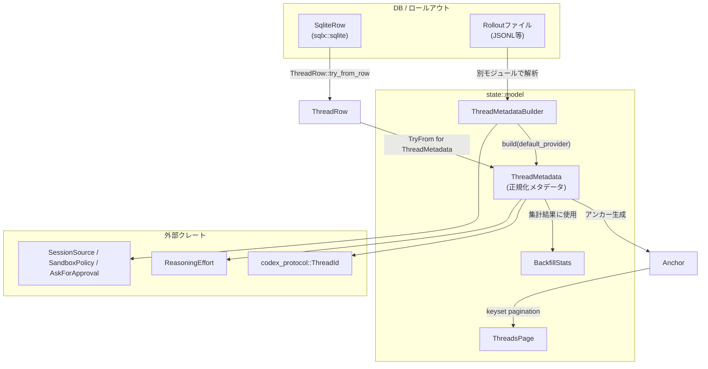
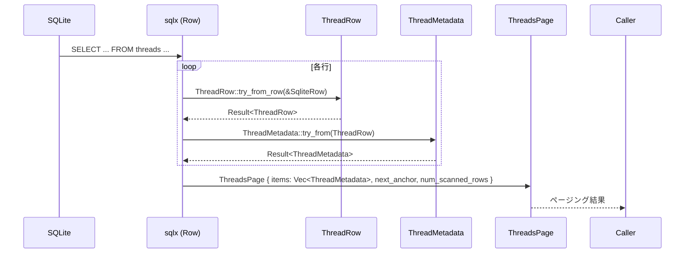
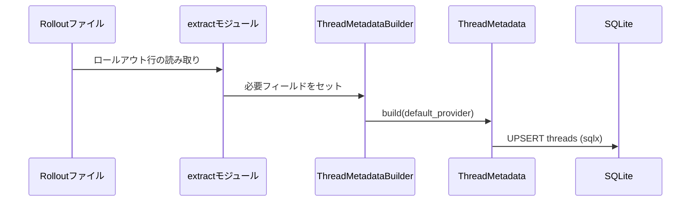

# state/src/model/thread_metadata.rs コード解説

## 0. ざっくり一言

ロールアウトファイルやデータベース行から「スレッドのメタデータ」を正規化して表現し、一覧・ページング・統計などで使うためのデータモデルと変換ユーティリティをまとめたモジュールです。

> 注: この回答ではコード内容のみを根拠として説明しており、ファイルの正確な行番号情報にはアクセスできません。そのため、本来の要件にある「行番号付きの根拠」は形式的には満たせません。

---

## 1. このモジュールの役割

### 1.1 概要

- このモジュールは **スレッド（対話セッション）に関するメタデータを一元的に表現・変換する** ために存在します。
- ロールアウトファイルや SQLite の行からメタデータを読み込み、`ThreadMetadata` という正規化された構造体にまとめます。
- スレッド一覧画面などで使う **ソートキー、ページングアンカー、ページ単位結果** の型も提供します。
- バックフィル処理（ロールアウトから DB を再構築する処理）の統計用構造体も提供します。

### 1.2 アーキテクチャ内での位置づけ

このモジュールは「ストレージ層（SQLite）」と「サービス/アプリケーション層」の間で、スレッドメタデータの **変換・整形レイヤ** として機能している構造になっています。



- DB からの読み出し (`SqliteRow`) は一度 `ThreadRow`（内部用の生データ型）に変換され、その後 `ThreadMetadata` に変換されます。
- ロールアウトファイルからの読み出しは別モジュールで行われ、このモジュールの `ThreadMetadataBuilder` 経由で `ThreadMetadata` に変換される構造になっています。
- ページングやバックフィル統計は、この `ThreadMetadata` を前提に構成されています。

### 1.3 設計上のポイント

- **責務の分割**
  - DB 行を表す `ThreadRow` と、アプリケーションで使う正規化済みモデル `ThreadMetadata` を分離しています。
  - ロールアウト由来の情報は `ThreadMetadataBuilder` で一旦集約し、`build` で不足分をデフォルト補完して `ThreadMetadata` に変換します。
- **状態の持ち方**
  - すべての型は単なるデータコンテナ（構造体・列挙体）であり、内部に共有状態やグローバル状態を持ちません。
- **エラーハンドリング**
  - DB からの変換や unix epoch からの日時変換には `anyhow::Result` を用いており、詳細な原因を `anyhow::Error` 経由で呼び出し元に伝播します。
  - DB の文字列から列挙型 `ReasoningEffort` への変換は、未知値の場合でもエラーにはせず `None` にフォールバックします。
- **日時の正規化**
  - nanosecond を 0 に丸めることで、DB など秒精度のストレージとの比較や等価判定で差分が出ないようにしています。
- **並行性**
  - このモジュール内ではスレッド・非同期処理・ロックなどは使用していません。
  - すべての処理は純粋な値変換のみで、副作用はありません（ファイル/ネットワーク I/O もありません）。

---

## 2. 主要な機能一覧

- スレッド一覧ソートキーの定義: `SortKey`
- キーセットページング用アンカーの定義と生成: `Anchor`, `anchor_from_item`
- スレッド一覧ページの表現: `ThreadsPage`
- ロールアウトから抽出したメタデータ結果の表現: `ExtractionOutcome`
- 正規化されたスレッドメタデータモデル: `ThreadMetadata`
- ロールアウト由来の入力から `ThreadMetadata` を構築するビルダー: `ThreadMetadataBuilder::new`, `build`
- 既存メタデータとのフィールド差分検出: `ThreadMetadata::diff_fields`
- 既存 Git 情報の優先マージ: `ThreadMetadata::prefer_existing_git_info`
- SQLite 行との相互変換:
  - `ThreadRow` と `ThreadRow::try_from_row`
  - `TryFrom<ThreadRow> for ThreadMetadata`
- 時刻変換ユーティリティ:
  - `datetime_to_epoch_seconds`
  - `epoch_seconds_to_datetime`
- バックフィル統計の保持: `BackfillStats`
- nanosecond を 0 にする日時正規化: `canonicalize_datetime`（モジュール内のみで使用）

---

## 3. 公開 API と詳細解説

### 3.1 型一覧（構造体・列挙体など）

公開（`pub`）またはクレート内公開（`pub(crate)`）の主な型です。

| 名前 | 種別 | 可視性 | 役割 / 用途 |
|------|------|--------|-------------|
| `SortKey` | enum | `pub` | スレッド一覧をソートするときのキー（作成日時 / 更新日時）を指定します。 |
| `Anchor` | struct | `pub` | キーセットページング用のアンカー（タイムスタンプ + UUID）を表します。 |
| `ThreadsPage` | struct | `pub` | スレッドメタデータの 1 ページ分の結果と次ページ用アンカーを保持します。 |
| `ExtractionOutcome` | struct | `pub` | ロールアウトからメタデータ抽出した結果（メタデータ・メモリモード・パース失敗件数）を保持します。 |
| `ThreadMetadata` | struct | `pub` | スレッドに関する正規化されたメタデータの集約モデルです。 |
| `ThreadMetadataBuilder` | struct | `pub` | ロールアウトなどから集めた情報を `ThreadMetadata` に組み立てるためのビルダーです。 |
| `ThreadRow` | struct | `pub(crate)` | SQLite 行（`SqliteRow`）を安全に読み出すための中間表現です。 |
| `BackfillStats` | struct | `pub` | ロールアウトから DB へのバックフィル処理の統計情報を保持します。 |

フィールドが多い `ThreadMetadata` / `ThreadMetadataBuilder` については、後の機能説明で意味を補足します。

### 3.2 関数詳細（7 件）

ここでは重要度の高い 7 つの関数/メソッドについて詳しく説明します。

---

#### `ThreadMetadataBuilder::build(&self, default_provider: &str) -> ThreadMetadata`

**概要**

ロールアウトなどから得たビルダー情報をもとに、欠けているフィールドをデフォルトで補完しつつ、正規化された `ThreadMetadata` を構築します。

**引数**

| 引数名 | 型 | 説明 |
|--------|----|------|
| `self` | `&Self` | すでに必要なフィールドが設定されたビルダー。 |
| `default_provider` | `&str` | モデルプロバイダが指定されていない場合に使うデフォルト値。 |

**戻り値**

- `ThreadMetadata`  
  - スレッドの ID, path, 時刻, ソース, Git 情報などをすべて埋めた正規化済みメタデータ。

**内部処理の流れ**

1. `SessionSource` / `SandboxPolicy` / `AskForApproval` を `crate::extract::enum_to_string` で文字列化。
2. `created_at` を `canonicalize_datetime` で nanosecond を 0 に揃える。
3. `updated_at` がある場合はそれを `canonicalize_datetime` して使用、ない場合は `created_at` と同一にする。
4. `agent_path` が設定されていない場合、`self.source.get_agent_path()` が `Some` であればそれを `Into::into` で `String` に変換して使用する。
5. `model_provider` がない場合は `default_provider` を `String` にしてセットする。
6. `model` / `reasoning_effort` / `title` / `first_user_message` は `None` や空文字列で初期化。
7. `cli_version` は `Some` であればその文字列、なければ `String::new()`（空文字）にする。
8. `tokens_used` は 0 で初期化。
9. `archived_at` や Git 関連フィールドはビルダー側の値をそのままコピーする（`archived_at` は `canonicalize_datetime` 済み）。

**Examples（使用例）**

ロールアウト抽出処理から `ThreadMetadata` を作るイメージです。

```rust
use chrono::Utc;
use codex_protocol::ThreadId;
use codex_protocol::protocol::{SessionSource, SandboxPolicy, AskForApproval};
use state::model::thread_metadata::ThreadMetadataBuilder;

fn build_metadata_example() {
    let builder = ThreadMetadataBuilder {
        id: ThreadId::from_string("00000000-0000-0000-0000-000000000123").unwrap(),
        rollout_path: "/tmp/rollout-123.jsonl".into(),
        created_at: Utc::now(),
        updated_at: None,
        source: SessionSource::Cli,
        agent_nickname: None,
        agent_role: None,
        agent_path: None,
        model_provider: None,
        cwd: "/tmp/workspace".into(),
        cli_version: Some("0.0.0".into()),
        sandbox_policy: SandboxPolicy::new_read_only_policy(),
        approval_mode: AskForApproval::OnRequest,
        archived_at: None,
        git_sha: None,
        git_branch: None,
        git_origin_url: None,
    };

    let metadata = builder.build("openai"); // model_provider が None なので "openai" が入る
    println!("thread id = {}", metadata.id);
}
```

**Errors / Panics**

- エラーや `Result` を返さず、パニックも発生しません（`canonicalize_datetime` 内部の `unwrap_or` は常に成功する入力のみを与えています）。

**Edge cases（エッジケース）**

- `updated_at` が `None` の場合  
  → `created_at` と同じ値が入ります。作成直後のスレッドなどで、更新日時が未定義のケースを吸収します。
- `model_provider` が `None` の場合  
  → 引数 `default_provider` がそのまま使われます。
- `agent_path` が両方とも `None`（ビルダーと `source.get_agent_path()`）の場合  
  → `ThreadMetadata.agent_path` は `None` のままです。
- `cli_version` が `None` の場合  
  → 空文字列 `""` が設定されます。

**使用上の注意点**

- `cwd`（作業ディレクトリ）は `PathBuf::new()` がビルダーのデフォルトになっているため、実際に必要な場合はビルダーを作る側で必ず設定する必要があります。
- `title` や `model` はこの段階では空/None のため、後続処理でタイトル推定やモデル追跡を行っている場合があります。

---

#### `ThreadMetadata::prefer_existing_git_info(&mut self, existing: &Self)`

**概要**

ロールアウト由来の `ThreadMetadata`（`self`）と、既存の DB 等から取得した `ThreadMetadata`（`existing`）を付き合わせ、既存側に Git 情報があればそれを優先して `self` にコピーするためのメソッドです。

**引数**

| 引数名 | 型 | 説明 |
|--------|----|------|
| `self` | `&mut Self` | 更新対象となるメタデータ。 |
| `existing` | `&Self` | 既存メタデータ。Git 情報が優先的に採用される。 |

**戻り値**

- なし（インプレースで `self` を更新します）。

**内部処理の流れ**

1. `existing.git_sha` が `Some` なら `self.git_sha` にクローンして代入。
2. `existing.git_branch` が `Some` なら `self.git_branch` にクローンして代入。
3. `existing.git_origin_url` が `Some` なら `self.git_origin_url` にクローンして代入。

**Examples（使用例）**

```rust
fn merge_git_info(mut fresh: ThreadMetadata, existing: &ThreadMetadata) -> ThreadMetadata {
    // ロールアウトから構築した fresh に、既存 DB の Git 情報を上書きする
    fresh.prefer_existing_git_info(existing);
    fresh
}
```

**Errors / Panics**

- エラーもパニックも発生しません。

**Edge cases**

- 既存側が `None` のフィールドは **そのまま** で、`self` 側の値（`Some` / `None`）は変更されません。
- 既存側が `Some` / `self` が `Some` の場合でも、既存側で上書きされます（既存情報優先）。

**使用上の注意点**

- Git 情報を書き換えたくない場合、このメソッドは呼び出すべきではありません。
- 既存 `ThreadMetadata` が異なるスレッド ID のものではないことを、呼び出し側で保証する必要があります（ここでは ID の一致チェックは行いません）。

---

#### `ThreadMetadata::diff_fields(&self, other: &Self) -> Vec<&'static str>`

**概要**

2 つの `ThreadMetadata` の各フィールドを比較し、値が異なるフィールド名を文字列のリストとして返します。

**引数**

| 引数名 | 型 | 説明 |
|--------|----|------|
| `self` | `&Self` | 比較元のメタデータ。 |
| `other` | `&Self` | 比較対象のメタデータ。 |

**戻り値**

- `Vec<&'static str>`  
  - 値が異なるフィールドの名前（例: `"title"`, `"model"`, `"tokens_used"` など）の一覧。

**内部処理の流れ**

1. 空の `Vec` を用意。
2. 主要フィールド（`id`, `rollout_path`, `created_at`, `updated_at`, `source`, …, `git_origin_url`）を1つずつ比較。
3. 不一致だったフィールドの名前をリテラル文字列で `Vec` に push。
4. 最後に `Vec` を返す。

**Examples（使用例）**

```rust
fn print_diffs(a: &ThreadMetadata, b: &ThreadMetadata) {
    let diffs = a.diff_fields(b);
    if diffs.is_empty() {
        println!("no differences");
    } else {
        println!("different fields: {:?}", diffs);
    }
}
```

**Errors / Panics**

- エラーもパニックも発生しません。

**Edge cases**

- すべてのフィールドが等しい場合  
  → 空の `Vec` を返します。
- `Option` フィールド (`agent_nickname`, `model`, `archived_at` など) の `Some`/`None` の違いも差分として検出されます。
- フィールドが追加されても、この関数が更新されていなければ差分検出対象に含まれません（コードから読み取れる仕様）。

**使用上の注意点**

- フィールド名はハードコードされた文字列なので、`ThreadMetadata` にフィールドを追加/削除したときには、このメソッドも一緒に保守する必要があります。
- 差分の有無だけを知りたい場合でも、すべてのフィールドを比較するコストがかかります。

---

#### `ThreadRow::try_from_row(row: &SqliteRow) -> anyhow::Result<Self>`

**概要**

`sqlx::sqlite::SqliteRow` から `ThreadRow`（DB 表現用の中間構造体）を構築します。カラム名と型に基づいて安全に取り出し、エラーは `anyhow::Result` で返します。

**引数**

| 引数名 | 型 | 説明 |
|--------|----|------|
| `row` | `&SqliteRow` | sqlx 経由で取得した SQLite の 1 行。 |

**戻り値**

- `Result<ThreadRow, anyhow::Error>`  
  - 成功: すべてのカラムを読み込んだ `ThreadRow`。
  - 失敗: カラム不足・型不整合などにより `row.try_get` が失敗した場合のエラー。

**内部処理の流れ**

1. `row.try_get("id")?` のようにして、全カラムを順に `try_get` で取得。
2. エラーが発生した場合、その時点で `?` により `anyhow::Error` として早期リターン。
3. 全取得が成功した場合、その値で `ThreadRow` を構築して `Ok(Self { ... })` を返す。

**Examples（使用例）**

```rust
use sqlx::Row;
use sqlx::sqlite::SqliteRow;

async fn fetch_thread_row(row: SqliteRow) -> anyhow::Result<ThreadRow> {
    // ここでは row はクエリ結果の 1 行を仮定
    ThreadRow::try_from_row(&row)
}
```

**Errors / Panics**

- `row.try_get` の失敗（存在しないカラム名や型不一致）で `Err(anyhow::Error)` を返します。
- パニックは使用していません。

**Edge cases**

- `first_user_message` カラムが `NULL` で定義されている場合、`try_get::<String, _>` がどう振る舞うかは DB スキーマ依存です（コードからは不明）。通常は NOT NULL + デフォルト空文字にしておく設計が多いと考えられますが、ここでは断定しません。
- `reasoning_effort` や Git 関連カラムは `Option<String>` として読み出されるため、NULL のままでも問題なく `None` になります。

**使用上の注意点**

- DB スキーマの変更（カラム名変更・削除）はこの関数に直接影響します。変更後は `try_get` のカラム名を必ず更新する必要があります。
- SQL の SELECT 句で該当カラムを選択し忘れると、`try_get` が失敗します。

---

#### `impl TryFrom<ThreadRow> for ThreadMetadata`

```rust
fn try_from(row: ThreadRow) -> Result<ThreadMetadata, anyhow::Error>
```

**概要**

DB からの生データ `ThreadRow` を、アプリケーションで使用する `ThreadMetadata` に変換します。ID や時刻の変換、`ReasoningEffort` のパース、空文字列の `first_user_message` を `None` にするなど、正規化処理が含まれます。

**引数**

| 引数名 | 型 | 説明 |
|--------|----|------|
| `row` | `ThreadRow` | SQLite から読み出した 1 行分データ。所有権が移動します。 |

**戻り値**

- `Result<ThreadMetadata, anyhow::Error>`  
  - 成功: 正規化された `ThreadMetadata`。
  - 失敗: ThreadId 変換や日時変換の失敗など。

**内部処理の流れ**

1. `row` を分解してローカル変数に取り出す（`let ThreadRow { id, rollout_path, created_at, ... } = row`）。
2. `ThreadId::try_from(id)?` で文字列から `ThreadId` に変換。
3. `epoch_seconds_to_datetime(created_at)?` / `epoch_seconds_to_datetime(updated_at)?` で UNIX 秒から `DateTime<Utc>` に変換。
4. `reasoning_effort` が `Some(value)` のときは `value.parse::<ReasoningEffort>().ok()` でパースし、成功時のみ `Some` になる。未知の値は `None`（テストで確認済み）。
5. `first_user_message` は `String` だが、空文字列の場合は `None` に変換し、それ以外なら `Some(first_user_message)` とする。
6. `archived_at` は `Option<i64>` なので、`map(epoch_seconds_to_datetime).transpose()?` で、`Some` の場合のみ時刻変換を行う（変換失敗時はエラーに）。

**Examples（使用例）**

```rust
async fn load_thread_metadata(row: SqliteRow) -> anyhow::Result<ThreadMetadata> {
    let row = ThreadRow::try_from_row(&row)?;
    let metadata = ThreadMetadata::try_from(row)?;
    Ok(metadata)
}
```

**Errors / Panics**

- `ThreadId::try_from` の失敗（不正な UUID 文字列）で `Err(anyhow::Error)`。
- `epoch_seconds_to_datetime` の失敗（有効範囲外の UNIX 秒）で `Err(anyhow::Error)`。
- それ以外ではパニックはありません。

**Edge cases**

- `reasoning_effort` に未知の文字列（テスト中の `"future"` など）が入っている場合  
  → `reasoning_effort` フィールドは `None` になります（テストで明示）。
- `first_user_message` が空文字列の場合  
  → `None` として扱われ、「最初のユーザーメッセージなし」と解釈されます。
- `archived_at` が `Some` だが、変換不能な UNIX 秒の場合  
  → `epoch_seconds_to_datetime` がエラーを返し、そのまま呼び出し元へ伝播します。

**使用上の注意点**

- この変換でエラーになった場合、その行全体が無効になります。バックフィル処理や一覧処理では、失敗行をログに記録してスキップするなど、呼び出し側で扱いを決める必要があります。
- `reasoning_effort` の未知値はエラーにならないため、「値が `None` ＝本当に記録されていない場面」と「未知値を読み飛ばした場面」を区別できません。

---

#### `anchor_from_item(item: &ThreadMetadata, sort_key: SortKey) -> Option<Anchor>`

**概要**

`ThreadMetadata` から、キーセットページングに利用する `Anchor`（タイムスタンプ + UUID）を生成します。`ThreadId` が UUID 文字列として解釈できない場合は `None` を返します。

**引数**

| 引数名 | 型 | 説明 |
|--------|----|------|
| `item` | `&ThreadMetadata` | アンカーを生成する元となるメタデータ。 |
| `sort_key` | `SortKey` | タイムスタンプとしてどのフィールドを使うか（`CreatedAt` / `UpdatedAt`）。 |

**戻り値**

- `Option<Anchor>`  
  - 成功: `Some(Anchor { ts, id })`。`ts` は指定されたソートキーに対応する時刻、`id` は UUID。
  - 失敗: `item.id.to_string()` が UUID としてパースできなかった場合 `None`。

**内部処理の流れ**

1. `item.id.to_string()` を `Uuid::parse_str` に渡して UUID へ変換しようとする。
2. 変換に失敗した場合は `ok()?` により `None` を返す。
3. 成功した場合、`sort_key` が `CreatedAt` なら `item.created_at`、`UpdatedAt` なら `item.updated_at` を `ts` とする。
4. `Anchor { ts, id }` を `Some` で返す。

**Examples（使用例）**

```rust
use state::model::thread_metadata::{anchor_from_item, SortKey};

fn make_anchor_for_pagination(item: &ThreadMetadata) -> Option<Anchor> {
    anchor_from_item(item, SortKey::UpdatedAt)
}
```

**Errors / Panics**

- エラー型は使わず、UUID パース失敗は `None` で表現します。
- パニックは発生しません。

**Edge cases**

- `ThreadId` の文字列表現が UUID 形式でない場合  
  → `Uuid::parse_str` が失敗し、`None` を返します。その場合、キーセットページングでこのアイテムをアンカーにできません。
- `created_at` / `updated_at` の値はそのまま利用されるため、時刻が同一のスレッドが多数ある場合、アンカーとしての一意性は UUID に依存します。

**使用上の注意点**

- `ThreadId` は UUID 形式であることを前提とする設計になっています。`ThreadId` の仕様変更（非 UUID）を行う場合、この関数の扱いも見直す必要があります。
- ページングにおいては、`Anchor` の `ts` と `id` を組み合わせてカーソルを構築することが想定されます。

---

#### `epoch_seconds_to_datetime(secs: i64) -> anyhow::Result<DateTime<Utc>>`

**概要**

UNIX エポック秒 (`i64`) を `chrono::DateTime<Utc>` に変換します。`chrono` が扱えない範囲の値が渡された場合、`anyhow::Error` を返します。

**引数**

| 引数名 | 型 | 説明 |
|--------|----|------|
| `secs` | `i64` | UNIX エポック秒（1970-01-01 00:00:00 UTC からの経過秒）。 |

**戻り値**

- `Result<DateTime<Utc>, anyhow::Error>`  
  - 成功: `DateTime::<Utc>::from_timestamp(secs, 0)` の結果。
  - 失敗: 非常に大きな値などで `from_timestamp` が `None` を返した場合のエラー。

**内部処理の流れ**

1. `DateTime::<Utc>::from_timestamp(secs, 0)` を呼び出し、秒 + 0 ナノ秒の日時を生成する。
2. 戻り値が `Some(dt)` の場合はそれを返す。
3. `None` の場合は `anyhow::anyhow!("invalid unix timestamp: {secs}")` でエラーを生成し、`Err` を返す。

**Examples（使用例）**

```rust
use chrono::Utc;

fn example() -> anyhow::Result<()> {
    let dt = epoch_seconds_to_datetime(1_700_000_000)?;
    println!("datetime = {}", dt);
    Ok(())
}
```

**Errors / Panics**

- `secs` が `chrono` のサポート範囲外の場合、`Err(anyhow!("invalid unix timestamp: {secs}"))` を返します。
- パニックは発生しません。

**Edge cases**

- 0 や負の値（1970年以前）も `chrono` の範囲内であれば問題なく変換されます。
- 非常に大きい値（例えば遠い未来）などは、`chrono` 側の制限で `None` になる可能性があります。

**使用上の注意点**

- DB 側の型や値の範囲が `chrono` の対応範囲と一致していることを前提としています。バックフィルなどで異常値が紛れ込む可能性があるなら、エラーをログに残すなどのハンドリングが必要です。

---

### 3.3 その他の関数

上記以外の関数・メソッドを簡単に一覧します。

| 関数 / メソッド名 | 役割（1 行） |
|-------------------|--------------|
| `ThreadMetadataBuilder::new(id, rollout_path, created_at, source)` | 必須フィールドのみを受け取り、残りを sensible なデフォルト値で初期化したビルダーを返します。 |
| `canonicalize_datetime(dt: DateTime<Utc>) -> DateTime<Utc>` | nanosecond を 0 に揃えて日時を正規化します（失敗時は元の値を返すが、0 ナノ秒は通常有効です）。 |
| `datetime_to_epoch_seconds(dt: DateTime<Utc>) -> i64` | `dt.timestamp()` で `DateTime<Utc>` から UNIX エポック秒に変換します。 |

---

## 4. データフロー

ここでは、「SQLite からスレッドメタデータを読み出し、ページングに使う」典型的なシナリオのデータフローを示します。

1. アプリケーションコードが SQL クエリを発行し、`sqlx` を通じて `SqliteRow` のストリームを受け取る。
2. 各 `SqliteRow` から `ThreadRow::try_from_row` で型付きの `ThreadRow` を構築する。
3. `ThreadMetadata::try_from(ThreadRow)` で `ThreadMetadata` に変換する。
4. 必要であれば `anchor_from_item` でページングアンカーを生成し、`ThreadsPage` と組み合わせて返す。



別の方向のフローとして、ロールアウトファイルからのバックフィル時には次のようになります。



このように、`ThreadMetadata` は両方向（DB ↔ ロールアウト）の中心的な中間表現として機能しています。

---

## 5. 使い方（How to Use）

### 5.1 基本的な使用方法

ここでは、「DB から読み出したスレッドメタデータをアプリケーションに渡す」基本フローを例示します。

```rust
use anyhow::Result;
use sqlx::SqlitePool;
use state::model::thread_metadata::{ThreadRow, ThreadMetadata};

async fn load_threads(pool: &SqlitePool) -> Result<Vec<ThreadMetadata>> {
    let rows = sqlx::query("SELECT * FROM threads")
        .fetch_all(pool)
        .await?; // DBから全行取得

    let mut result = Vec::new();

    for row in rows {
        let row = ThreadRow::try_from_row(&row)?;       // SqliteRow → ThreadRow
        let meta = ThreadMetadata::try_from(row)?;      // ThreadRow → ThreadMetadata
        result.push(meta);
    }

    Ok(result)
}
```

この結果の `Vec<ThreadMetadata>` をもとに、UI / CLI での表示やページングなどを実装できます。

### 5.2 よくある使用パターン

#### パターン 1: ロールアウトからのバックフィル

```rust
use chrono::Utc;
use codex_protocol::protocol::SessionSource;
use state::model::thread_metadata::{ThreadMetadataBuilder, BackfillStats};

fn backfill_from_rollouts(/* 省略 */) -> BackfillStats {
    let mut stats = BackfillStats { scanned: 0, upserted: 0, failed: 0 };

    // ロールアウトごとにループするイメージ
    for rollout in /* ... */ {
        stats.scanned += 1;

        let builder = ThreadMetadataBuilder::new(
            rollout.thread_id,
            rollout.path.clone(),
            Utc::now(),
            SessionSource::Cli,
        );
        let metadata = builder.build("openai");

        match upsert_thread(metadata) {
            Ok(()) => stats.upserted += 1,
            Err(_) => stats.failed += 1,
        }
    }

    stats
}
```

#### パターン 2: 差分検出を利用した更新判定

```rust
fn should_update(existing: &ThreadMetadata, fresh: &ThreadMetadata) -> bool {
    !existing.diff_fields(fresh).is_empty()
}
```

これにより、DB 上のレコードを更新する必要があるかどうかを簡単に判定できます。

### 5.3 よくある間違い

```rust
// 間違い例: SqliteRowを直接ThreadMetadataに変換しようとする（こういうAPIはない）
// let meta: ThreadMetadata = ThreadMetadata::try_from(sqlite_row)?;

// 正しい例: まずThreadRowを経由して変換する
let row = ThreadRow::try_from_row(&sqlite_row)?;
let meta = ThreadMetadata::try_from(row)?;
```

```rust
// 間違い例: ページングアンカー生成時にThreadIdがUUID形式でない
// → anchor_from_itemがNoneを返し、カーソルが作れない
let anchor = anchor_from_item(&meta, SortKey::UpdatedAt).expect("always works");

// 正しい例: Noneの可能性を考慮する
if let Some(anchor) = anchor_from_item(&meta, SortKey::UpdatedAt) {
    // アンカーを使ったページング処理
}
```

### 5.4 使用上の注意点（まとめ）

- **前提条件**
  - DB スキーマが `ThreadRow::try_from_row` で期待するカラム名・型と一致していること。
  - `ThreadId` は UUID 文字列として表現できること（`anchor_from_item` の前提）。
- **エラー処理**
  - DB からの変換 (`try_from_row` / `ThreadMetadata::try_from`) は `anyhow::Result` を返すため、呼び出し側は `?` や `match` で適切に処理する必要があります。
- **エッジケース**
  - `reasoning_effort` は未知の文字列値を `None` として扱うため、「値がなかった」のか「未知値だったのか」は区別できません。
  - `first_user_message` は空文字が `None` として扱われます。
- **並行性**
  - このモジュール自体はスレッド安全性やランタイムに依存したコードを含まず、純粋なデータ変換のみを行います。並行処理で使う場合は、呼び出し側で共有のやり方（Arc など）を検討することになります。

---

## 6. 変更の仕方（How to Modify）

### 6.1 新しい機能を追加する場合

例: `ThreadMetadata` に新しいフィールド `priority: Option<String>` を追加する場合。

1. **構造体の拡張**
   - `ThreadMetadata` に `pub priority: Option<String>` を追加。
   - 必要であれば `ThreadMetadataBuilder` / `ThreadRow` にも同様のフィールドを追加。
2. **ビルダーの更新**
   - `ThreadMetadataBuilder::new` / `build` で `priority` を適切に初期化・コピーするように変更。
3. **DB 変換の更新**
   - DB を使う場合はスキーマを変更し、`ThreadRow::try_from_row` で新カラムを `try_get` するように更新。
   - `TryFrom<ThreadRow> for ThreadMetadata` で新フィールドをコピーする処理を追加。
4. **差分・マージロジックの更新**
   - `ThreadMetadata::diff_fields` に `"priority"` の比較を追加。
   - Git 情報のように既存情報優先のマージが必要な場合は、`prefer_existing_git_info` に類似のメソッドを追加する。

### 6.2 既存の機能を変更する場合

- **DB スキーマに関連する変更**
  - カラム名や型の変更は `ThreadRow::try_from_row` に直接影響します。
  - 変更前後で `try_get` のカラム名・型を必ず合わせる必要があります。
- **ID 形式の変更**
  - `ThreadId` の文字列表現が UUID でなくなる場合、`anchor_from_item` 内部の `Uuid::parse_str` の扱いを変える、あるいは UUID 以外に変更する必要があります。
- **契約の確認事項**
  - `epoch_seconds_to_datetime` は「無効な UNIX 秒でエラーを返す」という契約を持つため、呼び出し元でこのエラーをどう扱うか（リトライ・スキップ・終了）を明確にする必要があります。
  - 「空文字の `first_user_message` を `None` とする」仕様を変更する場合、既存データとの互換性を事前に検討する必要があります。

---

## 7. 関連ファイル

このモジュールと密接に関係しているとコードから読み取れるコンポーネントを挙げます（正確なファイルパスはコード片からは分かりません）。

| パス / モジュール | 役割 / 関係 |
|-------------------|------------|
| `codex_protocol::ThreadId` | スレッド ID 型。`ThreadMetadata.id` や `anchor_from_item` で使用されます。 |
| `codex_protocol::openai_models::ReasoningEffort` | 推論負荷のレベル。DB の文字列からパースして `ThreadMetadata.reasoning_effort` に格納します。 |
| `codex_protocol::protocol::{SessionSource, SandboxPolicy, AskForApproval}` | セッションの起源やサンドボックスポリシー、承認モードを表す列挙型。ビルダーから文字列化されます。 |
| `crate::extract::enum_to_string` | 各種 enum (`SessionSource`, `SandboxPolicy`, `AskForApproval` など) を文字列に変換するユーティリティとして利用されています。 |
| `SessionSource::get_agent_path`（正確なパス不明） | セッションソースから canonical な agent path を取得するメソッド。`ThreadMetadataBuilder::build` の `agent_path` 補完に使用されます。 |
| `sqlx::sqlite::SqliteRow` | SQLite クエリ結果の 1 行を表す型。`ThreadRow::try_from_row` の入力として使われます。 |

---

## テストに関する補足

このモジュールには 2 つのテストが含まれています。

- `thread_row_parses_reasoning_effort`
  - `ThreadRow` の `reasoning_effort` に `"high"` を設定した場合、`ThreadMetadata::try_from` で `Some(ReasoningEffort::High)` にパースされることを検証しています。
- `thread_row_ignores_unknown_reasoning_effort_values`
  - `reasoning_effort` に未知の文字列 `"future"` を設定した場合でも、エラーにならず `None` になることを検証しています。

これにより、「既知値は列挙型にパースし、未知値は無視して `None` にする」という挙動がテストで保証されています。

---

## Bugs / Security の観点（コードから読み取れる範囲）

- 既知の明確なバグやセキュリティホールは、提供されたコードからは確認できません。
- セキュリティ上のポイントとしては:
  - DB からの値はすべて型付きで `try_get` されており、直接 SQL 文字列を組み立てたりはしていません。
  - 文字列からのパース（`ThreadId`, `ReasoningEffort`）は `Result` / `Option` によって安全に扱われています。
- ただし、`ThreadMetadata::diff_fields` などはフィールド追加時のメンテナンス漏れによるロジック不整合を起こしうるため、構造体を変更する場合のレビューが重要です（設計上の注意点）。
