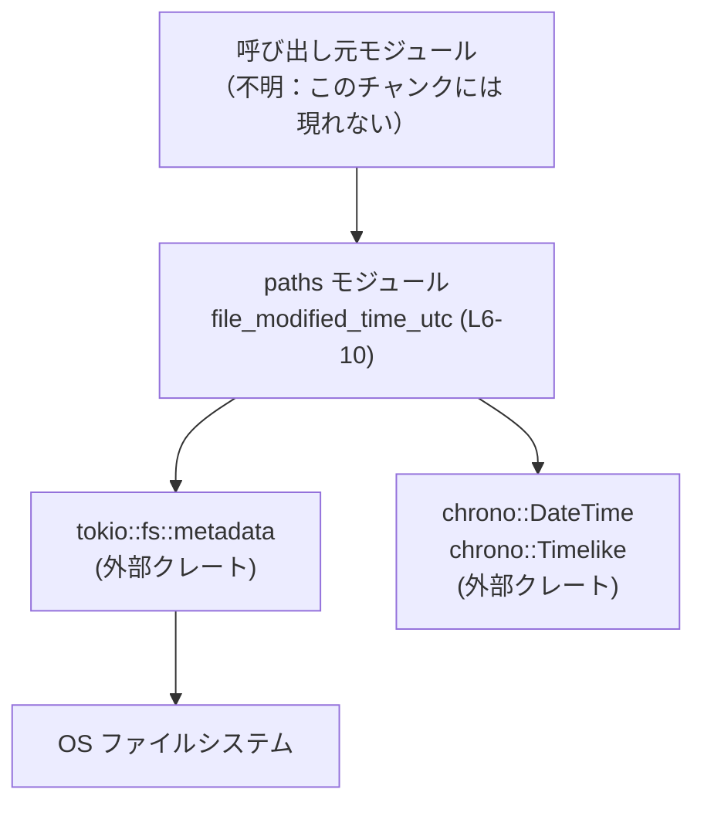
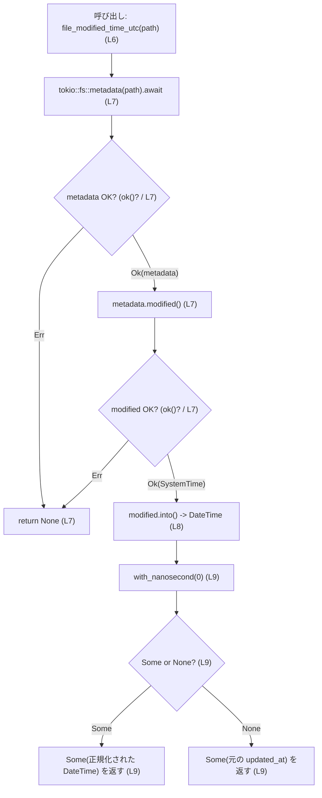
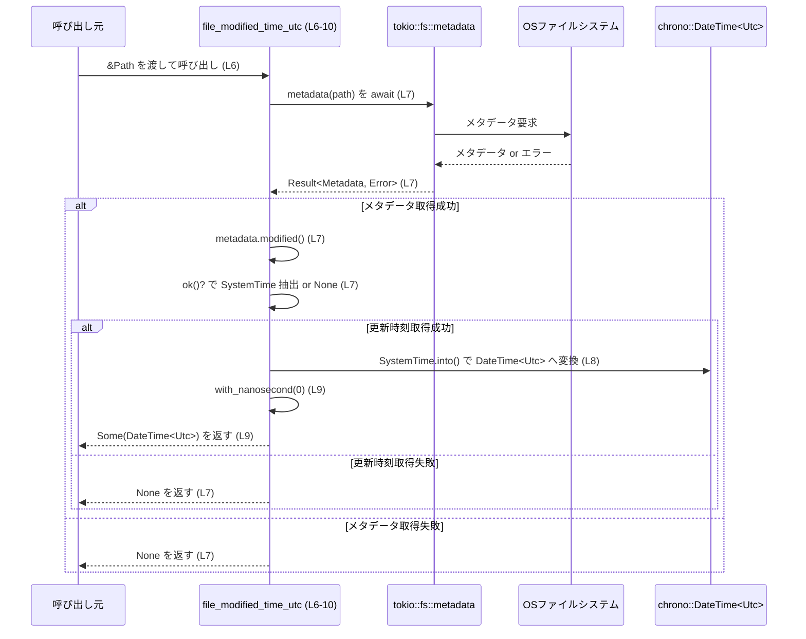

# state/src/paths.rs

## 0. ざっくり一言

ファイルパスから非同期にファイルメタデータを取得し、その最終更新時刻（UTC）を秒精度に丸めて `Option<DateTime<Utc>>` として返すユーティリティ関数を 1 つ提供するモジュールです（`state/src/paths.rs:L6-10`）。

---

## 1. このモジュールの役割

### 1.1 概要

- このモジュールは、ファイルの最終更新時刻を UTC タイムゾーンの `DateTime` 型で取得する処理をまとめたものです（`state/src/paths.rs:L6-10`）。
- OS のファイルメタデータを非同期に参照しつつ、サブ秒（ナノ秒）を 0 に揃えることで秒精度に正規化された時刻を返すようになっています（`state/src/paths.rs:L7-9`）。
- エラーはすべて `None` として吸収し、呼び出し側からは「取得できたかどうか」だけを判定できる API になっています（`state/src/paths.rs:L7` の `ok()?`）。

### 1.2 アーキテクチャ内での位置づけ

このモジュールは、アプリケーション内部（crate 内）から呼び出され、外部クレート `tokio` と `chrono` に依存してファイル更新時刻を取得します。



- `file_modified_time_utc` は `pub(crate)` であり、同一 crate 内の他モジュールから利用される内部 API です（`state/src/paths.rs:L6`）。
- ファイル I/O は `tokio::fs::metadata` に委譲され、時刻表現は `chrono::DateTime<Utc>` に変換しています（`state/src/paths.rs:L7-8`）。

### 1.3 設計上のポイント

- **非同期 I/O を利用**  
  `async fn` と `tokio::fs::metadata` を用いて、メタデータ取得を非同期で行う設計です（`state/src/paths.rs:L6-7`）。  
- **エラー情報を隠蔽して `Option` で返却**  
  `Result` を `ok()?` と `?` で連鎖的に処理し、失敗時は単に `None` を返すことで、呼び出し側のインターフェースを簡素化しています（`state/src/paths.rs:L7`）。
- **秒精度への正規化**  
  `with_nanosecond(0)` によりナノ秒部分を 0 に揃えており、サブ秒精度を切り捨てる挙動になっています（`state/src/paths.rs:L9`）。
- **スレッドセーフ・ステートレス**  
  グローバル状態や内部可変状態を持たず、引数と返り値だけで完結する純粋なユーティリティ関数です（`state/src/paths.rs:L6-10`）。

---

## 2. 主要な機能一覧

- ファイル更新時刻取得: 指定パスのファイルメタデータから更新時刻を UTC の `DateTime` として取得し、秒精度に丸めて `Option` で返す（`state/src/paths.rs:L6-10`）。

---

## 3. 公開 API と詳細解説

### 3.1 型一覧（構造体・列挙体など）

このファイル内で新たに定義されている型はありません（`state/src/paths.rs` 全体）。

参考として、この関数で使用している主な外部型をまとめます。

| 名前 | 種別 | 定義元 | 根拠 | 役割 / 用途 |
|------|------|--------|------|-------------|
| `Path` | 構造体 | `std::path` | `state/src/paths.rs:L4` | ファイルパスを表現する標準ライブラリの型。引数として使用。 |
| `DateTime<Utc>` | 構造体 | `chrono` クレート | `state/src/paths.rs:L1,L3,L8-9` | UTC タイムゾーンの日時を表す。返り値の型として使用。 |

### 3.2 関数詳細

#### 関数インベントリー

| 関数名 | シグネチャ（簡略） | 可視性 | 根拠行 |
|--------|---------------------|--------|--------|
| `file_modified_time_utc` | `async fn (&Path) -> Option<DateTime<Utc>>` | `pub(crate)` | `state/src/paths.rs:L6-10` |

#### `file_modified_time_utc(path: &Path) -> Option<DateTime<Utc>>`

**概要**

- 指定されたパスのファイルメタデータを非同期に取得し、その最終更新時刻を UTC の `DateTime` として返します（`state/src/paths.rs:L6-8`）。
- 戻り値は `Option<DateTime<Utc>>` で、取得に失敗した場合は `None` を返します（`state/src/paths.rs:L7`）。
- 正常時には、サブ秒（ナノ秒）部分を 0 にした値（秒精度）を返します（`state/src/paths.rs:L9`）。

**引数**

| 引数名 | 型 | 説明 |
|--------|----|------|
| `path` | `&Path` | 対象となるファイルまたはディレクトリのパス参照（所有権は呼び出し側に残る）（`state/src/paths.rs:L6`）。 |

**戻り値**

- 型: `Option<DateTime<Utc>>`（`state/src/paths.rs:L6`）
- 内容:
  - `Some(DateTime<Utc>)`: 更新時刻の取得に成功した場合。ナノ秒は 0 に正規化されています（`state/src/paths.rs:L9`）。
  - `None`: メタデータの取得、更新時刻の取得、またはそれ以降の処理のどこかで失敗した場合（`state/src/paths.rs:L7`）。

**内部処理の流れ（アルゴリズム）**

1. `tokio::fs::metadata(path).await` で非同期にファイルメタデータを取得します（`state/src/paths.rs:L7`）。  
   - 戻り値は `Result<Metadata, Error>` です（tokio の API 仕様）。
2. `.ok()?` で `Result` を `Option` に変換し、エラー時には `None` を返して関数を早期終了します（`state/src/paths.rs:L7`）。
3. 成功時は `Metadata::modified()` を呼び出してファイルの更新時刻（`SystemTime`）を取得します（`state/src/paths.rs:L7`）。
4. 再度 `.ok()?` により、更新時刻取得の失敗も `None` として早期リターンします（`state/src/paths.rs:L7`）。
5. 取得した `SystemTime` を `DateTime<Utc>` に変換します（`let updated_at: DateTime<Utc> = modified.into();`、`state/src/paths.rs:L8`）。
6. `with_nanosecond(0)` でナノ秒部分を 0 にした日時を生成し、もし `None`（失敗）なら元の `updated_at` を使います（`unwrap_or(updated_at)`、`state/src/paths.rs:L9`）。
7. その結果を `Some(...)` でラップして返します（`state/src/paths.rs:L9`）。

**フローチャート（概念）**



**Examples（使用例）**

> モジュールパスはプロジェクト構成によって異なるため、ここでは仮に `crate::paths` にあるものとして記述します。この点はこのチャンクだけでは確定できません。

1. 基本的な呼び出し例（更新時刻を表示）

```rust
use std::path::Path;                             // Path 型を使うためにインポート
use chrono::DateTime;                            // 表示用に DateTime をインポート
use chrono::Utc;                                 // UTC タイムゾーン
// use crate::paths::file_modified_time_utc;     // 実際のモジュールパスに合わせてインポート

#[tokio::main]                                   // tokio ランタイムを起動
async fn main() {
    let path = Path::new("data/example.txt");    // 調べたいファイルのパスを作成

    match file_modified_time_utc(path).await {   // 非同期関数なので .await が必要
        Some(dt_utc) => {
            // 成功時: UTC の更新時刻（ナノ秒は 0 に正規化済み）
            println!("Modified at (UTC, sec precision): {}", dt_utc);
        }
        None => {
            // 失敗時: パスが存在しない・権限がないなどの理由で取得できない
            eprintln!("modified time could not be retrieved");
        }
    }
}
```

1. `Option` を `Result` に変換して上位に伝播させる例

```rust
use std::path::Path;
// use crate::paths::file_modified_time_utc;

async fn required_mtime(path: &Path) -> Result<chrono::DateTime<chrono::Utc>, &'static str> {
    // None のときにエラー文字列に変換する
    file_modified_time_utc(path)
        .await
        .ok_or("failed to get modified time")   // Option -> Result に変換
}
```

**Errors / Panics**

- **戻り値 `None` になる条件（早期リターン）**  
  いずれかのステップでエラーが発生すると `ok()?` によって `None` が返ります（`state/src/paths.rs:L7`）。
  - `tokio::fs::metadata(path).await` が `Err` を返した場合  
    （例: パスが存在しない／アクセス権がない等。詳細は tokio/std の仕様による）
  - 取得した `Metadata` に対する `modified()` が `Err` を返した場合  
    （ファイルシステムが更新時刻をサポートしていないなどのケース）

- **panic の可能性**
  - このファイル内には `unwrap()` や `expect()` は存在せず（`state/src/paths.rs:L1-10`）、`unwrap_or` は `Option` に対して安全にデフォルト値を返すため、ここで panic は発生しません（`state/src/paths.rs:L9`）。
  - ただし、`modified.into()` による `SystemTime` → `DateTime<Utc>` 変換の実装は `chrono` クレート側に依存します（`state/src/paths.rs:L8`）。  
    2024年時点の `chrono` のドキュメントでは、範囲外の `SystemTime` に対して `From<SystemTime>` が panic しうることが明記されています。したがって、極端なタイムスタンプが返される環境では panic のリスクがあります。

**Edge cases（エッジケース）**

- **存在しないパス**  
  `tokio::fs::metadata(path)` がエラーになり、関数は `None` を返します（`ok()?` により、`state/src/paths.rs:L7`）。
- **アクセス権限がないパス**  
  同様にメタデータ取得でエラーとなり、`None` が返ります（`state/src/paths.rs:L7`）。
- **更新時刻を持たないファイルシステム**  
  `metadata.modified()` がエラーを返すと `None` になります（`state/src/paths.rs:L7`）。
- **ナノ秒を 0 にできない場合**  
  `with_nanosecond(0)` は `Option<DateTime<Utc>>` を返し、もし `None` の場合には `unwrap_or(updated_at)` により元の値が採用されるので、この段階で `None` が返ることはありません（`state/src/paths.rs:L9`）。
- **極端な日時値（非常に遠い過去・未来）**  
  `SystemTime` から `DateTime<Utc>` への変換が `chrono` の表現範囲外の場合、`From<SystemTime>` が panic する可能性があります（`state/src/paths.rs:L8`。挙動は外部クレート仕様）。

**使用上の注意点**

- **非同期コンテキストが必須**  
  関数は `async fn` であり、`tokio::fs::metadata(path).await` を含むため、`tokio` などの非同期ランタイム上で `.await` する必要があります（`state/src/paths.rs:L6-7`）。
- **エラーが `None` に集約される**  
  失敗理由（存在しないのか、権限がないのか等）が失われるため、詳細なエラー処理やログ出力が必要な場合には、この関数だけでは情報が不足します（`ok()?` を連続使用している設計、`state/src/paths.rs:L7`）。
- **UTC 固定・秒精度固定**  
  返り値は UTC であり、ナノ秒は 0 に揃えられます（`state/src/paths.rs:L3,L9`）。ローカルタイムやサブ秒精度が必要な場合は、呼び出し側で変換が必要です。
- **並行呼び出し**  
  関数自身はステートレスであり、複数のタスクから同時に呼び出しても Rust のメモリ安全性の観点では問題ありません（`state/src/paths.rs:L6-10`）。  
  ただし、ファイルシステムへの I/O が多重に発生するため、スケーラビリティは基盤ストレージの性能に依存します。

### 3.3 その他の関数

- このファイルには `file_modified_time_utc` 以外の関数は存在しません（`state/src/paths.rs:L1-10`）。

---

## 4. データフロー

この関数が呼び出されてから結果が返るまでの典型的なデータフローを示します。

1. 呼び出し元から `&Path` が渡されます（`state/src/paths.rs:L6`）。
2. `tokio::fs::metadata(path)` により OS からメタデータが取得されます（`state/src/paths.rs:L7`）。
3. `Metadata::modified()` が更新時刻（`SystemTime`）を返します（`state/src/paths.rs:L7`）。
4. `SystemTime` が `DateTime<Utc>` に変換されます（`state/src/paths.rs:L8`）。
5. `with_nanosecond(0)` でナノ秒が 0 に正規化され、`Some(...)` として返されます（`state/src/paths.rs:L9`）。
6. 中間のどこかでエラーが発生した場合は `None` が返されます（`state/src/paths.rs:L7`）。



---

## 5. 使い方（How to Use）

### 5.1 基本的な使用方法

- 典型的なフローは「パスを用意 → 非同期に `file_modified_time_utc` を呼び出す → `Option` をパターンマッチで処理する」という形になります。

```rust
use std::path::Path;
// use crate::paths::file_modified_time_utc;  // 実際のモジュールパスに合わせてインポート

#[tokio::main]
async fn main() {
    let path = Path::new("/var/log/app.log");           // 対象ファイルのパス

    if let Some(modified) = file_modified_time_utc(path).await {
        // 正常に取得できた場合
        println!("Log file updated at (UTC): {}", modified);
    } else {
        // 取得に失敗した場合
        eprintln!("Could not read modified time for {:?}", path);
    }
}
```

### 5.2 よくある使用パターン

1. **更新されているかどうかの判定のみ行う**

```rust
use std::path::Path;
// use crate::paths::file_modified_time_utc;

async fn has_been_updated_after(path: &Path, since: chrono::DateTime<chrono::Utc>) -> bool {
    match file_modified_time_utc(path).await {
        Some(mtime) => mtime > since,   // 取得した更新時刻がしきい値より新しいかどうか
        None => false,                  // 取得できない場合は「更新無し」とみなすポリシー
    }
}
```

1. **取得できない場合はエラーとして扱う（`Result` に変換）**

```rust
use std::path::Path;
// use crate::paths::file_modified_time_utc;

async fn strict_mtime(path: &Path) -> Result<chrono::DateTime<chrono::Utc>, String> {
    file_modified_time_utc(path)
        .await
        .ok_or_else(|| format!("failed to get modified time for {:?}", path))
}
```

### 5.3 よくある間違い

```rust
// 間違い例: 非同期コンテキスト外で await しようとしている
// fn main() {
//     let path = Path::new("data.txt");
//     let time = file_modified_time_utc(path).await;  // コンパイルエラー: await は async コンテキスト内でのみ使用可
// }

// 正しい例: tokio ランタイム上の async 関数内で呼び出す
#[tokio::main]
async fn main() {
    let path = std::path::Path::new("data.txt");
    let time = file_modified_time_utc(path).await;    // OK
    println!("{:?}", time);
}
```

```rust
// 間違い例: None を考慮しない（unwrap で強制的に Some と仮定している）
async fn bad_usage(path: &std::path::Path) {
    let mtime = file_modified_time_utc(path).await.unwrap();   // 取得失敗時に panic する可能性
}

// 正しい例: None をケースとして扱う
async fn good_usage(path: &std::path::Path) {
    match file_modified_time_utc(path).await {
        Some(mtime) => println!("mtime = {}", mtime),
        None => eprintln!("mtime not available"),
    }
}
```

### 5.4 使用上の注意点（まとめ）

- 非同期関数であるため、`tokio` 等のランタイム上の `async` コンテキストで `.await` する必要があります（`state/src/paths.rs:L6-7`）。
- 失敗時に `None` を返す設計のため、呼び出し側で `None` を常にハンドリングする前提が必要です（`state/src/paths.rs:L7`）。
- 返り値は UTC 固定・秒精度であるため、ローカル時刻やミリ秒以下の精度が必要な場合は追加の変換が必要です（`state/src/paths.rs:L3,L9`）。
- 取得失敗の理由は分からないため、詳細なトラブルシュートには元の `tokio::fs::metadata` を直接使う等の手段が必要になる場合があります。

---

## 6. 変更の仕方（How to Modify）

### 6.1 新しい機能を追加する場合

例として、「ナノ秒を切り捨てずにそのまま返す関数」を追加する場合の方針です。

1. 同じファイル `state/src/paths.rs` に、新しい関数（例えば `file_modified_time_utc_full_precision`）を追加する。
2. `file_modified_time_utc` と同様に `tokio::fs::metadata(path).await.ok()?.modified().ok()?` までを共通化し、`with_nanosecond(0)` を呼ばずに `Some(updated_at)` を返すようにする（`state/src/paths.rs:L7-9` を参考）。
3. 既存関数への影響はないため、呼び出し側の変更は不要。

### 6.2 既存の機能を変更する場合

1. **返り値の型を `Result` に変えたい場合**  
   - `Option<DateTime<Utc>>` を `Result<DateTime<Utc>, E>`（`E` は適切なエラー型）に変更し、`ok()?` を `?` に置き換えるなど、エラー情報を保持するように修正する必要があります（`state/src/paths.rs:L6-7`）。
   - その際、プロジェクト内で `file_modified_time_utc` を呼び出している箇所をすべて検索し、`Option` 前提のコードを `Result` 前提に書き換える必要があります（呼び出し元はこのチャンクには現れません）。
2. **UTC ではなくローカルタイムを返したい場合**  
   - `DateTime<Utc>` をローカルタイム用の型（例えば `DateTime<Local>`）に変換する処理を `updated_at` の後に追加します（`state/src/paths.rs:L8-9`）。
3. **秒精度への正規化をやめたい場合**  
   - `with_nanosecond(0).unwrap_or(updated_at)` を単に `updated_at` に置き換えます（`state/src/paths.rs:L9`）。
4. いずれの場合も、変更前に `ripgrep` 等で `file_modified_time_utc` の呼び出し箇所を列挙し、インターフェース変更による影響範囲を確認することが推奨されます。

---

## 7. 関連ファイル

このチャンクから分かる範囲での関連コンポーネントを示します。

| パス / クレート | 役割 / 関係 |
|-----------------|------------|
| `tokio::fs::metadata` | ファイルメタデータを非同期に取得する API。`file_modified_time_utc` 内で使用（`state/src/paths.rs:L7`）。 |
| 標準ライブラリ `std::path::Path` | 関数引数として使用されるファイルパス型（`state/src/paths.rs:L4,L6`）。 |
| `chrono::DateTime`, `chrono::Utc`, `chrono::Timelike` | 更新時刻の表現とナノ秒操作に使用（`state/src/paths.rs:L1-3,L8-9`）。 |
| テストコード | このチャンクにはテストコードは現れません。どのファイルにテストがあるかは不明です。 |

テストやこの関数の呼び出し元がどこにあるかは、このファイルだけからは分かりません。「`file_modified_time_utc`」という名前でプロジェクト全体を検索することで、利用箇所や振る舞いの前提条件をさらに把握できる可能性があります。
