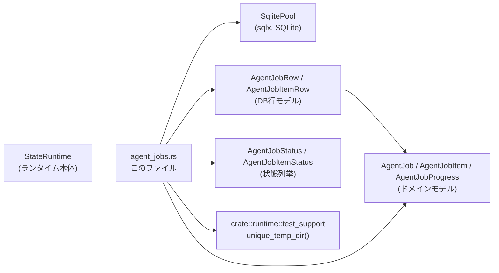
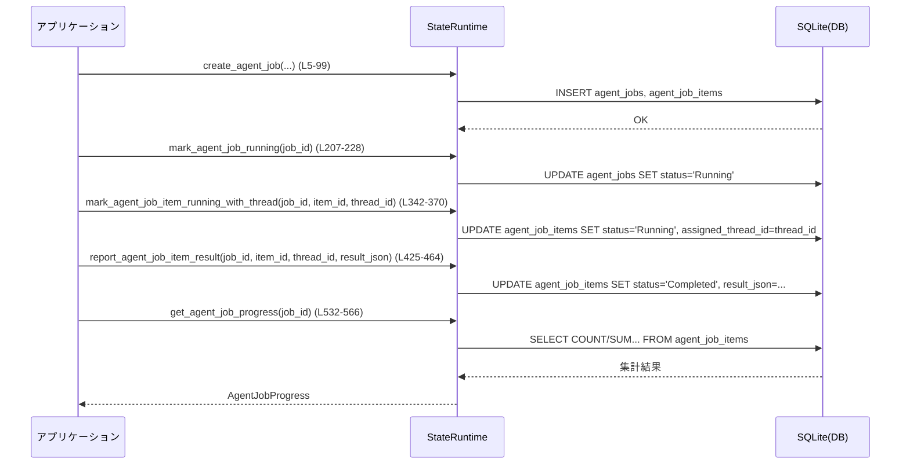

# state/src/runtime/agent_jobs.rs

## 0. ざっくり一言

`StateRuntime` に対して、エージェントジョブとそのジョブアイテム（行単位のタスク）の作成・状態遷移・進捗集計を行う非同期DBアクセス関数群を提供するモジュールです（`state/src/runtime/agent_jobs.rs:L4-566`）。

---

## 1. このモジュールの役割

### 1.1 概要

- このモジュールは **「エージェントが処理するバッチジョブ」** と、そのジョブを構成する **個々のアイテム（行）** の状態管理を行います。
- SQLite + `sqlx` を用いて、ジョブとジョブアイテムの
  - 作成（トランザクション）
  - 状態更新（Pending/Running/Completed/Failed/Cancelled）
  - 進捗集計
  を行うAPIを `StateRuntime` のメソッドとして実装しています。
- 並行処理時の競合を避けるため、SQLの `WHERE` 条件と更新件数（`rows_affected`）を使った **楽観的ロックに近い制御** を行っています。

### 1.2 アーキテクチャ内での位置づけ

このモジュールの周辺関係を簡略化した図です。



- `StateRuntime` 本体の定義は別モジュールですが、そのメソッド実装の一部として、本ファイルの `impl StateRuntime` が載っています（`agent_jobs.rs:L4-566`）。
- DBスキーマとしては、`agent_jobs` と `agent_job_items` の2テーブルを前提にしています（INSERT / UPDATE / SELECT 文から読み取れます）。

### 1.3 設計上のポイント

- **責務の分割**
  - ジョブ単位の操作（作成・状態変更・キャンセル）と、ジョブアイテム単位の操作（状態変更・結果報告）を明確に関数レベルで分離しています。
- **状態管理と並行性**
  - アイテムの状態更新系は `WHERE ... AND status = ?` などの条件付き UPDATE を用い、`rows_affected() > 0` を bool で返すことで、他スレッド/プロセスとの競合を検知する設計です（例: `report_agent_job_item_result` の WHERE 条件, `agent_jobs.rs:L436-449`）。
- **エラーハンドリング**
  - すべて `anyhow::Result<T>` を返し、DBエラー・JSONシリアライズエラー・ステータスパースエラーなどを `?` で伝播します。
  - 「ビジネス上の衝突」(既に他の状態になっている等) はエラーではなく `Ok(false)` で表現し、呼び出し側で分岐する契約になっています（例: `mark_agent_job_cancelled`, `agent_jobs.rs:L271-294`）。
- **トランザクション**
  - ジョブ本体とジョブアイテム群の作成は単一のトランザクションで実行され、一部だけ作成されることがないようになっています（`create_agent_job`, `agent_jobs.rs:L22-57,59-90,93`）。
- **時間の扱い**
  - すべてのタイムスタンプに `Utc::now().timestamp()`（秒単位の `i64`）を利用しています（複数箇所, 例: `agent_jobs.rs:L10,208,231,253,...`）。

---

## 2. 主要な機能一覧

このモジュールが提供する主な機能です。

- エージェントジョブの作成（ジョブレコード + アイテムレコードの一括INSERT）
- ジョブの取得（`id` 指定）
- ジョブアイテム一覧・単体取得（ジョブID + オプションでステータス/上限件数）
- ジョブの状態変更（Running/Completed/Failed/Cancelled への更新）
- ジョブのキャンセル状態判定
- ジョブアイテムの状態遷移（Pending → Running → Completed/Failed など）
- ジョブアイテムへの実行スレッド（thread_id）の割り当て/解除
- ジョブアイテムの結果報告（結果JSON + 完了タイムスタンプの保存）
- ジョブアイテム進捗の集計（Pending/Running/Completed/Failed 件数）

---

## 3. 公開 API と詳細解説

### 3.1 型一覧（構造体・列挙体など）

このファイル内には新しい型定義はなく、他モジュールからの型を利用しています（`use super::*`, `use crate::model::AgentJobItemRow`）。

| 名前 | 種別 | 役割 / 用途 | 根拠 |
|------|------|-------------|------|
| `StateRuntime` | 構造体 | アプリケーションの状態管理・DB接続などをまとめたランタイム。ここではエージェントジョブ関連メソッドの `impl` だけが定義されている。 | `impl StateRuntime { ... }`（`state/src/runtime/agent_jobs.rs:L4-566`）|
| `AgentJobCreateParams` | 構造体 | ジョブ作成に必要なパラメータ（id, name, instruction, input/output パスなど）。 | フィールド使用箇所から（`agent_jobs.rs:L6-8,44-55,81`）|
| `AgentJobItemCreateParams` | 構造体 | ジョブアイテム作成に必要なパラメータ（item_id, row_index, source_id, row_json）。 | 使用箇所（`agent_jobs.rs:L8,59-60,82-85`）|
| `AgentJobStatus` | 列挙体 | ジョブの状態。文字列表現への変換・解析に使われる。 | `Pending/Running/Completed/Failed/Cancelled` の `as_str` 利用と `parse`（`agent_jobs.rs:L46,221,239,261,284,289,290,311`）|
| `AgentJobItemStatus` | 列挙体 | ジョブアイテムの状態。 | `Pending/Running/Completed/Failed` 表現の `as_str` 利用（`agent_jobs.rs:L86,332,361,390,419,452,487,520,545-548`）|
| `AgentJobRow` | 構造体 | `agent_jobs` テーブルの行を表すDBモデル。`AgentJob` への変換に使われる。 | `sqlx::query_as::<_, AgentJobRow>`（`agent_jobs.rs:L102-126`）|
| `AgentJobItemRow` | 構造体 | `agent_job_items` テーブルの行を表すDBモデル。`AgentJobItem` への変換に使われる。 | `use crate::model::AgentJobItemRow;` と `query_as`（`agent_jobs.rs:L2,167-171,179-204`）|
| `AgentJob` | 構造体 | ジョブのドメインモデル。DB行からの変換に `TryFrom<AgentJobRow>` を実装している。 | `AgentJob::try_from` 使用（`agent_jobs.rs:L127`）|
| `AgentJobItem` | 構造体 | ジョブアイテムのドメインモデル。 | `AgentJobItem::try_from` 使用（`agent_jobs.rs:L171,204`）|
| `AgentJobProgress` | 構造体 | 進捗サマリ（total/pending/running/completed/failed 件数）を保持。 | フィールド初期化箇所（`agent_jobs.rs:L558-565`）|
| `Value` | 型エイリアス | `serde_json::Value`。アイテムの結果JSONとして保存される。 | `report_agent_job_item_result` 引数と `serde_json::to_string`（`agent_jobs.rs:L430,433`）|

#### 3.1.1 関数インベントリー（行番号付き）

このファイルで定義されている関数の一覧です。

| 名前 | 種別 | 行範囲 | 役割（1行） |
|------|------|--------|-------------|
| `create_agent_job` | `StateRuntime` メソッド | `agent_jobs.rs:L5-99` | ジョブとジョブアイテムをトランザクションで作成し、作成されたジョブを返す。 |
| `get_agent_job` | メソッド | `agent_jobs.rs:L101-128` | ジョブIDから `AgentJob` を1件取得。存在しない場合は `Ok(None)`。 |
| `list_agent_job_items` | メソッド | `agent_jobs.rs:L130-172` | ジョブIDとオプション条件でジョブアイテムを一覧取得。 |
| `get_agent_job_item` | メソッド | `agent_jobs.rs:L174-205` | ジョブID + item_id で単一アイテム取得。 |
| `mark_agent_job_running` | メソッド | `agent_jobs.rs:L207-228` | ジョブを Running 状態にし、開始時刻を設定。 |
| `mark_agent_job_completed` | メソッド | `agent_jobs.rs:L230-246` | ジョブを Completed 状態にし、完了時刻を設定。 |
| `mark_agent_job_failed` | メソッド | `agent_jobs.rs:L248-269` | ジョブを Failed 状態にし、エラーメッセージと完了時刻を設定。 |
| `mark_agent_job_cancelled` | メソッド | `agent_jobs.rs:L271-294` | Pending/Running なジョブを Cancelled 状態にする（それ以外は変更されない）。 |
| `is_agent_job_cancelled` | メソッド | `agent_jobs.rs:L296-312` | ジョブIDから、Cancelled 状態かどうかを bool で返す。 |
| `mark_agent_job_item_running` | メソッド | `agent_jobs.rs:L314-340` | Pending アイテムを Running に変更し、attempt_count をインクリメント。 |
| `mark_agent_job_item_running_with_thread` | メソッド | `agent_jobs.rs:L342-370` | `thread_id` を設定しつつ Pending → Running に変更。 |
| `mark_agent_job_item_pending` | メソッド | `agent_jobs.rs:L372-399` | Running アイテムを Pending に戻し、エラーを保存（リトライ用）。 |
| `set_agent_job_item_thread` | メソッド | `agent_jobs.rs:L401-423` | Running アイテムに thread_id を後から設定。 |
| `report_agent_job_item_result` | メソッド | `agent_jobs.rs:L425-464` | Running + 対応thread_id のアイテムに結果JSONをセットし Completed にする。 |
| `mark_agent_job_item_completed` | メソッド | `agent_jobs.rs:L466-496` | Running かつ result_json があるアイテムを Completed にする。 |
| `mark_agent_job_item_failed` | メソッド | `agent_jobs.rs:L498-530` | Running アイテムを Failed にし、エラーメッセージを保存。 |
| `get_agent_job_progress` | メソッド | `agent_jobs.rs:L532-566` | ジョブIDごとのアイテム進捗サマリを集計して返す。 |
| `create_running_single_item_job` | テスト補助関数 | `agent_jobs.rs:L576-613` | テスト用に1アイテムの Running ジョブを作成。 |
| `report_agent_job_item_result_completes_item_atomically` | テスト | `agent_jobs.rs:L615-653` | 結果報告が1ステップで完了することを検証。 |
| `report_agent_job_item_result_rejects_late_reports` | テスト | `agent_jobs.rs:L655-683` | 既に Failed になった後の遅いレポートを拒否することを検証。 |

---

### 3.2 関数詳細（最大 7 件）

以下では特に重要と思われる7つの関数について詳しく説明します。

#### 3.2.1 `create_agent_job(&self, params: &AgentJobCreateParams, items: &[AgentJobItemCreateParams]) -> anyhow::Result<AgentJob>`

**概要**

- ジョブ本体 (`agent_jobs` テーブル) と、そのジョブに紐づく複数のジョブアイテム (`agent_job_items` テーブル) を一つのトランザクション内で作成します（`agent_jobs.rs:L5-99`）。
- 作成後、DBからジョブを再読み込みし、`AgentJob` として返します。

**引数**

| 引数名 | 型 | 説明 |
|--------|----|------|
| `params` | `&AgentJobCreateParams` | ジョブID、名前、指示文、入出力パス、スキーマなどのメタ情報。 |
| `items` | `&[AgentJobItemCreateParams]` | このジョブに含めるアイテム（行）定義の配列。 |

**戻り値**

- `Ok(AgentJob)`：作成されたジョブのドメインモデル。
- `Err(anyhow::Error)`：JSONシリアライズ失敗、数値変換失敗、DBエラー、作成後の再読み込み失敗など。

**内部処理の流れ**

根拠: `state/src/runtime/agent_jobs.rs:L10-22,24-57,59-90,93-98`

1. 現在時刻（UTC秒）を取得し、`now` として保持。
2. `params.input_headers` を JSON 文字列にシリアライズして `input_headers_json` とする。
3. オプションの `output_schema_json` を、存在する場合のみ JSON 文字列にシリアライズ（`Option` をネストして `transpose()`）。
4. オプションの `max_runtime_seconds` を `i64` に変換。変換できない場合は `"invalid max_runtime_seconds value"` でエラーにする。
5. DBトランザクション `tx` を開始。
6. `agent_jobs` テーブルに1レコード INSERT。`status` は `Pending` 固定、`started_at`, `completed_at`, `last_error` は `NULL` で初期化。
7. `items` の各要素についてループし、`row_json` を JSON 文字列にシリアライズした上で `agent_job_items` テーブルへ INSERT。`status` は `Pending`、`attempt_count` は 0、`result_json`, `last_error`, `completed_at`, `reported_at` は `NULL` で初期化。
8. トランザクションを `commit`。
9. 最後に `self.get_agent_job(job_id)` で作成したジョブを読み込み、`Ok(Some(job))` であれば `Ok(job)` として返し、`None` の場合は `"failed to load created agent job {job_id}"` のエラーにする。

**Examples（使用例）**

```rust
// ジョブと単一アイテムを作成する例
async fn create_sample_job(runtime: &StateRuntime) -> anyhow::Result<AgentJob> {
    // ジョブ作成パラメータ                       // ジョブのメタ情報
    let params = AgentJobCreateParams {
        id: "job-1".to_string(),
        name: "example".to_string(),
        instruction: "Process rows".to_string(),
        auto_export: true,
        max_runtime_seconds: Some(600),          // 10分
        output_schema_json: None,
        input_headers: vec!["path".to_string()],
        input_csv_path: "/tmp/in.csv".to_string(),
        output_csv_path: "/tmp/out.csv".to_string(),
    };

    // ジョブアイテムを1件定義                     // CSV1行分に相当するタスク
    let items = vec![AgentJobItemCreateParams {
        item_id: "item-1".to_string(),
        row_index: 0,
        source_id: None,
        row_json: serde_json::json!({"path": "file-1"}),
    }];

    // ジョブを作成し、作成された AgentJob を取得   // DBにINSERT & 再読み込み
    let job = runtime.create_agent_job(&params, &items).await?;
    Ok(job)
}
```

**Errors / Panics**

- **Errors**
  - `serde_json::to_string` が失敗した場合（不正な値など）にエラー（`agent_jobs.rs:L11,60,433`）。
  - `max_runtime_seconds` の `i64` への変換に失敗した場合 `"invalid max_runtime_seconds value"` を返す（`agent_jobs.rs:L17-21`）。
  - DBトランザクション開始/INSERT/COMMIT で `sqlx::Error` が起きた場合。
  - `get_agent_job` で `Ok(None)` だった場合、明示的に `anyhow!("failed to load created agent job {job_id}")` でエラー（`agent_jobs.rs:L95-98`）。
- **Panics**
  - この関数内に `unwrap` はなく、panic するコードはありません。

**Edge cases（エッジケース）**

- `items` が空スライスの場合でもエラーにはならず、アイテムのないジョブが作成されます（ループが1回も回らないだけです, `agent_jobs.rs:L59-91`）。
- `output_schema_json` が `None` の場合、DBには `NULL` ではなく `None` の直列化結果ではなく、「未設定」として処理されます（`transpose()` により `Option<String>` として None/Some を分けて扱い, `agent_jobs.rs:L12-16,49`）。
- `max_runtime_seconds` が `None` の場合、DBの `max_runtime_seconds` フィールドには `NULL` が入ります（`agent_jobs.rs:L17-21,49`）。

**使用上の注意点**

- 事前に `params.id` が一意である前提で動作します。重複IDがあればDB側で一意制約違反エラーが発生する可能性があります（スキーマ次第ですが、このファイルからは制約は分かりません）。
- 大量の `items` を一度に渡すと、一つのトランザクション内で多くのINSERTが行われるため、トランザクション時間が伸びます。
- 作成後に必ず `get_agent_job` で再読み込みしているため、ジョブ作成直後の状態を取得したい場合はこの関数の返り値を流用するとよいです。

---

#### 3.2.2 `get_agent_job(&self, job_id: &str) -> anyhow::Result<Option<AgentJob>>`

**概要**

- `agent_jobs` テーブルから単一ジョブを読み込み、`AgentJob` に変換して返します（`agent_jobs.rs:L101-128`）。

**引数**

| 引数名 | 型 | 説明 |
|--------|----|------|
| `job_id` | `&str` | 取得したいジョブのID。 |

**戻り値**

- `Ok(Some(AgentJob))`：該当IDのジョブが存在する。
- `Ok(None)`：該当IDのジョブが存在しない。
- `Err(anyhow::Error)`：DBエラー、または `AgentJob::try_from` が失敗した場合。

**内部処理の流れ**

根拠: `agent_jobs.rs:L101-127`

1. `sqlx::query_as::<_, AgentJobRow>` を用いて `agent_jobs` から1件SELECT。
2. `fetch_optional` により0件または1件の結果を取得。
3. 結果が `Some(row)` の場合 `AgentJob::try_from(row)` を実行し、変換失敗時はエラー。
4. `Option<Result<AgentJob>>` を `transpose()` で `Result<Option<AgentJob>>` に変換し、そのまま返す。

**Examples（使用例）**

```rust
async fn load_and_print_job(runtime: &StateRuntime, job_id: &str) -> anyhow::Result<()> {
    // ジョブを取得                                   // job_id で検索
    if let Some(job) = runtime.get_agent_job(job_id).await? {
        println!("Job {} status = {:?}", job.id, job.status); // 取得した情報を利用
    } else {
        println!("Job {} not found", job_id);                 // 見つからなかったケース
    }
    Ok(())
}
```

**Errors / Panics**

- SELECT自体のDBエラー（接続不良など）。
- `AgentJob::try_from` が何らかの理由で失敗した場合（DB行とドメインモデルの整合性が取れないなど）。

**Edge cases**

- 該当ジョブがない場合でも、エラーではなく `Ok(None)` として扱います。
- `SELECT` のカラムはリテラルで列挙されているため、DBスキーマ変更時に不足カラムがあると `sqlx` のコンパイル／実行時チェックでエラーとなる可能性があります（`agent_jobs.rs:L104-119`）。

**使用上の注意点**

- ジョブの存在チェックをしたい場合は、戻り値が `Ok(Some(_))` かどうかを見るのが基本です。
- ステータスだけ見たい場合でも、現状は `AgentJob` 全体を取り出す必要があります（このファイルではステータスだけを取得する専用関数は `is_agent_job_cancelled` を除き存在しません）。

---

#### 3.2.3 `list_agent_job_items(&self, job_id: &str, status: Option<AgentJobItemStatus>, limit: Option<usize>) -> anyhow::Result<Vec<AgentJobItem>>`

**概要**

- 指定したジョブIDのアイテムを、オプションで状態と件数上限を指定して取得します（`agent_jobs.rs:L130-172`）。
- 行番号（`row_index`）昇順でソートされます。

**引数**

| 引数名 | 型 | 説明 |
|--------|----|------|
| `job_id` | `&str` | 対象ジョブのID。 |
| `status` | `Option<AgentJobItemStatus>` | 絞り込みたいステータス。`None` なら全ステータス。 |
| `limit` | `Option<usize>` | 最大取得件数。`None` なら制限なし。 |

**戻り値**

- `Ok(Vec<AgentJobItem>)`：0件も含め、正常に取得できた場合。
- `Err(anyhow::Error)`：DBエラー、または `AgentJobItem::try_from` が失敗した場合。

**内部処理の流れ**

根拠: `agent_jobs.rs:L136-171`

1. `QueryBuilder::<Sqlite>::new` で SELECT 文のベースを構築。
2. `job_id` をバインド（WHERE `job_id = ?`）。
3. `status` が `Some` なら `AND status = ?` を追加し、その値をバインド。
4. `ORDER BY row_index ASC` を追加。
5. `limit` が `Some` なら `LIMIT ?` を追加し、`i64` にキャストしてバインド。
6. クエリを `build_query_as::<AgentJobItemRow>()` で最終化し、`fetch_all` で全件取得。
7. 各 `AgentJobItemRow` を `AgentJobItem::try_from` で変換し、ベクタにして返却。

**Examples（使用例）**

```rust
async fn list_pending_items(runtime: &StateRuntime, job_id: &str) -> anyhow::Result<Vec<AgentJobItem>> {
    // Pending 状態のアイテムを最大10件取得             // ジョブIDと状態・上限でフィルタ
    let items = runtime
        .list_agent_job_items(
            job_id,
            Some(AgentJobItemStatus::Pending),
            Some(10),
        )
        .await?;
    Ok(items)
}
```

**Errors / Panics**

- DBの SELECT エラー。
- `AgentJobItem::try_from` の変換エラー。

**Edge cases**

- 指定ジョブIDにアイテムが1件もない場合、空ベクタ `Vec::new()` が返されます。
- `limit` に非常に大きい値を渡した場合でも、SQLの LIMIT にそのまま渡されるだけです（DBやメモリへの影響は呼び出し側で考慮する必要があります）。

**使用上の注意点**

- この関数は単に読み出しを行うだけであり、並行性制御（ロック・状態遷移条件）は行いません。アイテムの取得と状態変更の間に、他のワーカーが同じアイテムを更新しうることに注意が必要です。
- アイテムを「取得してすぐに実行キューに載せる」用途では、後述の `mark_agent_job_item_running*` と組み合わせて、楽観的ロック的に使うのが典型です。

---

#### 3.2.4 `mark_agent_job_cancelled(&self, job_id: &str, reason: &str) -> anyhow::Result<bool>`

**概要**

- 指定ジョブを `Cancelled` 状態に更新しますが、元の状態が `Pending` または `Running` の場合にのみ有効です（`agent_jobs.rs:L271-294`）。
- そのほかの状態（Completed/Failed/Cancelled）では更新されず、`Ok(false)` を返します。

**引数**

| 引数名 | 型 | 説明 |
|--------|----|------|
| `job_id` | `&str` | キャンセルしたいジョブのID。 |
| `reason` | `&str` | キャンセル理由。`last_error` カラムに保存される。 |

**戻り値**

- `Ok(true)`：1件以上更新された（= Pending または Running だったジョブが Cancelled になった）。
- `Ok(false)`：該当ジョブが存在しないか、既に Pending/Running 以外の状態だった。
- `Err(anyhow::Error)`：DBエラー。

**内部処理の流れ**

根拠: `agent_jobs.rs:L276-293`

1. 現在時刻を取得し `now` とする。
2. `UPDATE agent_jobs` を実行し、以下をセット:
   - `status = 'Cancelled'`
   - `updated_at = now`
   - `completed_at = now`
   - `last_error = reason`
3. WHERE 条件は `id = ? AND status IN ('Pending','Running')`。
4. `rows_affected() > 0` を bool として返す。

**Examples（使用例）**

```rust
async fn cancel_job_if_running(runtime: &StateRuntime, job_id: &str) -> anyhow::Result<()> {
    // Pending/Running であればキャンセルする              // それ以外なら何もしない
    let cancelled = runtime
        .mark_agent_job_cancelled(job_id, "user requested")
        .await?;
    if !cancelled {
        println!("Job {} was not cancellable", job_id);
    }
    Ok(())
}
```

**Errors / Panics**

- UPDATEのDBエラーのみ。`rows_affected` が0でも、それはエラーではありません。

**Edge cases**

- ジョブが存在しない場合も `Ok(false)` で区別されません（存在しない／既にCompletedなどを区別しない設計）。
- すでに `Cancelled` 状態のジョブに対して呼び出しても更新されず、`Ok(false)` です。

**使用上の注意点**

- 呼び出し側は `Ok(false)` を「キャンセルできなかった」ことを意味すると理解する必要があります。存在しないジョブか、既に完了している可能性があります。
- `Completed` や `Failed` に対してはキャンセルしないというビジネスルールが、この WHERE 条件に埋め込まれています（`agent_jobs.rs:L281`）。

---

#### 3.2.5 `mark_agent_job_item_running_with_thread(&self, job_id: &str, item_id: &str, thread_id: &str) -> anyhow::Result<bool>`

**概要**

- 指定ジョブアイテムを `Pending` → `Running` に変更し、そのアイテムを担当する実行スレッドIDをセットします（`agent_jobs.rs:L342-370`）。
- WHERE 条件で `status = 'Pending'` をチェックしているため、他のワーカーとの競合を検知できます（`rows_affected() == 0`）。

**引数**

| 引数名 | 型 | 説明 |
|--------|----|------|
| `job_id` | `&str` | 対象ジョブのID。 |
| `item_id` | `&str` | 対象アイテムのID。 |
| `thread_id` | `&str` | このアイテムを処理するスレッドやワーカーの識別子。 |

**戻り値**

- `Ok(true)`：この呼び出しで Pending → Running に変更できた（アイテムを獲得した）。
- `Ok(false)`：条件に一致する行がなかった（アイテムが既に別の状態か存在しない）。
- `Err(anyhow::Error)`：DBエラー。

**内部処理の流れ**

根拠: `agent_jobs.rs:L348-369`

1. 現在時刻 `now` を取得。
2. `UPDATE agent_job_items` で以下をセット:
   - `status = 'Running'`
   - `assigned_thread_id = thread_id`
   - `attempt_count = attempt_count + 1`
   - `updated_at = now`
   - `last_error = NULL`
3. WHERE 条件は `job_id = ? AND item_id = ? AND status = 'Pending'`。
4. `rows_affected() > 0` を返す。

**Examples（使用例）**

```rust
async fn try_claim_item(
    runtime: &StateRuntime,
    job_id: &str,
    item_id: &str,
    worker_id: &str,
) -> anyhow::Result<bool> {
    // Pending アイテムを Running にしつつ、担当workerをセット
    let claimed = runtime
        .mark_agent_job_item_running_with_thread(job_id, item_id, worker_id)
        .await?;
    Ok(claimed)
}
```

**Errors / Panics**

- UPDATEのDBエラーのみ。

**Edge cases**

- すでに別のワーカーが `Running` にしている場合、ここでは一切更新されず `Ok(false)` になります。
- `attempt_count` は Pending に戻してまた Running にした場合にも増えるため、リトライ回数として利用可能です（`agent_jobs.rs:L355-356`）。

**使用上の注意点**

- ワーカーは `Ok(false)` の場合、「このアイテムは他のワーカーに取られた、または既に終了している」と解釈する必要があります。
- `thread_id` は後続の `report_agent_job_item_result` の WHERE 条件でも利用されるため、一貫性のある値を渡すことが重要です。

---

#### 3.2.6 `report_agent_job_item_result(&self, job_id: &str, item_id: &str, reporting_thread_id: &str, result_json: &Value) -> anyhow::Result<bool>`

**概要**

- 実行中（Running）のジョブアイテムに対し、結果JSONを報告すると同時に `Completed` 状態へ遷移させます（`agent_jobs.rs:L425-464`）。
- WHERE 条件には `assigned_thread_id = reporting_thread_id` が含まれており、「担当スレッドだけが結果を報告できる」という制約があります。
- テストが、この関数が「アイテム完了と結果保存を原子的（1 SQLステートメントで）に行う」ことを検証しています（`agent_jobs.rs:L615-653`）。

**引数**

| 引数名 | 型 | 説明 |
|--------|----|------|
| `job_id` | `&str` | ジョブID。 |
| `item_id` | `&str` | アイテムID。 |
| `reporting_thread_id` | `&str` | 結果を報告するスレッドのID。`assigned_thread_id` と一致している必要がある。 |
| `result_json` | `&Value` | 保存したい結果JSON。 `serde_json::to_string` でシリアライズされる。 |

**戻り値**

- `Ok(true)`：条件に一致する1件以上の行が更新され、結果が保存・Completed 状態になった。
- `Ok(false)`：条件に一致する行がなかった（ステータスや thread_id が不一致、あるいは存在しない）。
- `Err(anyhow::Error)`：JSONシリアライズエラーまたはDBエラー。

**内部処理の流れ**

根拠: `agent_jobs.rs:L432-463`

1. `result_json` を `serde_json::to_string` で文字列化。
2. 現在時刻 `now` を取得。
3. `UPDATE agent_job_items` を実行し、以下をセット:
   - `status = 'Completed'`
   - `result_json = serialized`
   - `reported_at = now`
   - `completed_at = now`
   - `updated_at = now`
   - `last_error = NULL`
   - `assigned_thread_id = NULL`
4. WHERE 条件:
   - `job_id = ?`
   - `AND item_id = ?`
   - `AND status = 'Running'`
   - `AND assigned_thread_id = reporting_thread_id`
5. `rows_affected() > 0` を bool として返す。

**Examples（使用例）**

```rust
async fn finish_item_success(
    runtime: &StateRuntime,
    job_id: &str,
    item_id: &str,
    worker_id: &str,
) -> anyhow::Result<bool> {
    // 結果JSONを構築                             // 実際には処理結果から生成する
    let result = serde_json::json!({"ok": true});

    // Running かつこのworker_idを担当者とする      // アイテムにだけ成功として反映される
    let accepted = runtime
        .report_agent_job_item_result(job_id, item_id, worker_id, &result)
        .await?;
    Ok(accepted)
}
```

**Errors / Panics**

- `serde_json::to_string(result_json)` の失敗。
- UPDATE のDBエラー。

**Edge cases**

- `reporting_thread_id` が `assigned_thread_id` と一致しない場合や、すでに `Failed` に遷移している場合は `rows_affected == 0` となり、`Ok(false)` が返ります。
  - テスト `report_agent_job_item_result_rejects_late_reports`（`agent_jobs.rs:L655-683`）で、`mark_agent_job_item_failed` を呼んだ後の「遅いレポート」が拒否されることが検証されています。
- 結果JSONが非常に大きい場合、DBのTEXTカラムサイズや性能に影響しますが、ここからは制約値は分かりません。

**使用上の注意点**

- 呼び出し側は `Ok(false)` を「このレポートは採用されなかった（状態/担当者が一致しない）」と解釈する必要があります。エラーとは区別されます。
- `assigned_thread_id` が `NULL` の状態（例えば別のAPIで解除された後）では、この関数は成功しません（WHERE 条件に `assigned_thread_id = ?` があるため）。
- テスト `report_agent_job_item_result_completes_item_atomically`（`agent_jobs.rs:L615-653`）で、「結果保存」「ステータス Completed」「報告時刻/完了時刻セット」「thread_id解除」「last_error クリア」が1回のUPDATEで一貫して行われることが確認されています。

---

#### 3.2.7 `get_agent_job_progress(&self, job_id: &str) -> anyhow::Result<AgentJobProgress>`

**概要**

- 指定ジョブに属するアイテムの総数と、各ステータスごとの件数（Pending/Running/Completed/Failed）を集計して返します（`agent_jobs.rs:L532-566`）。

**引数**

| 引数名 | 型 | 説明 |
|--------|----|------|
| `job_id` | `&str` | 対象ジョブのID。 |

**戻り値**

- `Ok(AgentJobProgress)`：集計サマリ。
- `Err(anyhow::Error)`：DBエラー、または `row.try_get` の取得失敗時。

**内部処理の流れ**

根拠: `agent_jobs.rs:L533-565`

1. `SELECT` で以下を取得:
   - `COUNT(*) AS total_items`
   - ステータスごとの件数を `SUM(CASE WHEN status = ? THEN 1 ELSE 0 END)` で計算（4つ）。
2. `job_id` と各ステータス文字列（Pending/Running/Completed/Failed）を bind して実行。
3. 結果行から
   - `total_items: i64`
   - 各ステータス件数: `Option<i64>` として取得。
4. それぞれを `usize::try_from` で `usize` に変換。変換失敗時（非常に大きい値など）は `unwrap_or_default()` により 0 にフォールバック。
5. `AgentJobProgress` 構造体を組み立てて返す。

**Examples（使用例）**

```rust
async fn print_job_progress(runtime: &StateRuntime, job_id: &str) -> anyhow::Result<()> {
    let progress = runtime.get_agent_job_progress(job_id).await?; // 進捗取得
    println!(
        "total={}, pending={}, running={}, completed={}, failed={}",
        progress.total_items,
        progress.pending_items,
        progress.running_items,
        progress.completed_items,
        progress.failed_items,
    );
    Ok(())
}
```

**Errors / Panics**

- SELECTのDBエラー。
- `row.try_get` が失敗した場合（列名不一致など）。

**Edge cases**

- `job_id` に紐づくアイテムが一件もない場合でも、`COUNT(*)` は0を返すため `total_items = 0` となります。
- ステータス件数の `SUM` は、SQLの仕様上「行が0件」の場合に `NULL` になり得ますが、ここでは `Option<i64>` に取り出した上で `unwrap_or_default()` で 0 に変換しています（`agent_jobs.rs:L554-557,560-565`）。
- 件数が `usize::MAX` を超えるような極端な場合、`usize::try_from` がエラーになるため `unwrap_or_default()` により 0 になります。件数が非常に多いケースで値がサイレントに0になることがあります。

**使用上の注意点**

- この関数は「アイテムが存在しない」「ジョブIDが無効」な場合もエラーにせず、0件として扱います。存在チェックをしたい場合は別途 `get_agent_job` の結果を確認する必要があります。
- `usize::try_from(...).unwrap_or_default()` によって桁あふれが 0 に潰される可能性がある点は、極端なスケールでだけ影響しますが、仕様として把握しておく必要があります。

---

### 3.3 その他の関数

3.2で詳細説明しなかった関数の概要です。

| 関数名 | 行範囲 | 役割（1 行） |
|--------|--------|--------------|
| `mark_agent_job_running` | `agent_jobs.rs:L207-228` | ジョブのステータスを `Running` にし、`started_at` を初回実行時に設定、`completed_at` と `last_error` をクリア。 |
| `mark_agent_job_completed` | `agent_jobs.rs:L230-246` | ジョブを `Completed` にし、`completed_at` を現在時刻で更新。 |
| `mark_agent_job_failed` | `agent_jobs.rs:L248-269` | ジョブを `Failed` にし、`last_error` にメッセージを保存。 |
| `is_agent_job_cancelled` | `agent_jobs.rs:L296-312` | `SELECT status` して `AgentJobStatus::Cancelled` と比較し、Cancelled かどうかを返す。ジョブ未存在時は `false`。 |
| `mark_agent_job_item_running` | `agent_jobs.rs:L314-340` | thread_id をセットせず、Pending → Running への遷移と `attempt_count` 増加を行う。 |
| `mark_agent_job_item_pending` | `agent_jobs.rs:L372-399` | Running → Pending に戻し、`assigned_thread_id` をクリアし、`last_error` にオプションのメッセージを保存。 |
| `set_agent_job_item_thread` | `agent_jobs.rs:L401-423` | Running 状態のアイテムに対し、`assigned_thread_id` を後付けで設定。 |
| `mark_agent_job_item_completed` | `agent_jobs.rs:L466-496` | Running かつ `result_json IS NOT NULL` なアイテムを `Completed` にする別経路の完了API。 |
| `mark_agent_job_item_failed` | `agent_jobs.rs:L498-530` | Running → Failed に変更し、エラーメッセージを `last_error` に保存。 |
| `create_running_single_item_job` | `agent_jobs.rs:L576-613` | テスト用に、1件の Pending アイテムを含むジョブを作成し、ジョブ・アイテム・thread_id を返す。 |
| `report_agent_job_item_result_completes_item_atomically` | `agent_jobs.rs:L615-653` | `report_agent_job_item_result` が1回でCompleted + result + 各種タイムスタンプを設定することを検証。 |
| `report_agent_job_item_result_rejects_late_reports` | `agent_jobs.rs:L655-683` | `mark_agent_job_item_failed` 後の遅延レポートが無視される（`accepted == false`）ことを検証。 |

---

## 4. データフロー

### 4.1 代表的な処理シナリオ

代表的なシナリオとして、「ジョブを作成し、アイテムをワーカーが取得して実行し、結果を報告して進捗を確認する」流れを示します。



この図から読み取れる要点は次のとおりです。

- ジョブ作成はトランザクションで行われ、ジョブ本体とアイテムが同時に作成されます（`create_agent_job`, `agent_jobs.rs:L22-57,59-90,93`）。
- ジョブアイテムの状態更新（Pending → Running → Completed）は、各ステップで単一のUPDATE文により行われ、WHERE 条件で競合を検知します。
- 進捗集計は、アイテムテーブルへの SELECT + 集約で得られます（`get_agent_job_progress`, `agent_jobs.rs:L535-542`）。

---

## 5. 使い方（How to Use）

### 5.1 基本的な使用方法

テストコード `create_running_single_item_job`（`agent_jobs.rs:L576-613`）を参考にした、一連の典型フローの例です。

```rust
async fn end_to_end_example(runtime: &StateRuntime) -> anyhow::Result<()> {
    // 1. ジョブとアイテムを作成                           // create_agent_job を利用
    let job_id = "job-1".to_string();
    let item_id = "item-1".to_string();
    let thread_id = "worker-1".to_string();

    let params = AgentJobCreateParams {
        id: job_id.clone(),
        name: "test-job".to_string(),
        instruction: "Return a result".to_string(),
        auto_export: true,
        max_runtime_seconds: None,
        output_schema_json: None,
        input_headers: vec!["path".to_string()],
        input_csv_path: "/tmp/in.csv".to_string(),
        output_csv_path: "/tmp/out.csv".to_string(),
    };

    let items = vec![AgentJobItemCreateParams {
        item_id: item_id.clone(),
        row_index: 0,
        source_id: None,
        row_json: serde_json::json!({"path": "file-1"}),
    }];

    let _job = runtime.create_agent_job(&params, &items).await?; // ジョブ作成

    // 2. ジョブを実行状態にする                             // mark_agent_job_running
    runtime.mark_agent_job_running(job_id.as_str()).await?;

    // 3. ワーカーがアイテムを獲得する                       // mark_agent_job_item_running_with_thread
    let claimed = runtime
        .mark_agent_job_item_running_with_thread(
            job_id.as_str(),
            item_id.as_str(),
            thread_id.as_str(),
        )
        .await?;
    if !claimed {
        // 既に他で処理中・完了など
        return Ok(());
    }

    // 4. 処理結果を報告し、アイテムをCompletedにする          // report_agent_job_item_result
    let result = serde_json::json!({"ok": true});
    let accepted = runtime
        .report_agent_job_item_result(
            job_id.as_str(),
            item_id.as_str(),
            thread_id.as_str(),
            &result,
        )
        .await?;
    if !accepted {
        // 状態・thread_id が一致しなかった（遅延レポート等）
        return Ok(());
    }

    // 5. 進捗を確認する                                     // get_agent_job_progress
    let progress = runtime.get_agent_job_progress(job_id.as_str()).await?;
    println!("Completed items = {}", progress.completed_items);

    Ok(())
}
```

### 5.2 よくある使用パターン

1. **実行開始前にキャンセルチェックを行う**

```rust
async fn worker_loop(runtime: &StateRuntime, job_id: &str, item_id: &str, worker_id: &str) -> anyhow::Result<()> {
    // ジョブがキャンセルされていないか確認            // is_agent_job_cancelled の利用
    if runtime.is_agent_job_cancelled(job_id).await? {
        return Ok(());
    }

    // アイテムを獲得                                   // mark_agent_job_item_running_with_thread
    if !runtime
        .mark_agent_job_item_running_with_thread(job_id, item_id, worker_id)
        .await?
    {
        return Ok(());
    }

    // ... 処理を行う ...

    // 結果報告                                        // report_agent_job_item_result
    let result = serde_json::json!({"ok": true});
    let _ = runtime
        .report_agent_job_item_result(job_id, item_id, worker_id, &result)
        .await?;
    Ok(())
}
```

1. **一時的なエラーでリトライキューに戻す**

```rust
async fn handle_transient_error(
    runtime: &StateRuntime,
    job_id: &str,
    item_id: &str,
    error_msg: &str,
) -> anyhow::Result<()> {
    // Running → Pending に戻し、last_error に記録       // mark_agent_job_item_pending
    let reset = runtime
        .mark_agent_job_item_pending(job_id, item_id, Some(error_msg))
        .await?;
    if !reset {
        // 状態が既に変わっている可能性
    }
    Ok(())
}
```

1. **致命的なエラーでアイテムをFailedにする**

```rust
async fn handle_fatal_error(
    runtime: &StateRuntime,
    job_id: &str,
    item_id: &str,
    error_msg: &str,
) -> anyhow::Result<()> {
    // Running → Failed に変更し、last_error に保存      // mark_agent_job_item_failed
    let failed = runtime
        .mark_agent_job_item_failed(job_id, item_id, error_msg)
        .await?;
    if !failed {
        // 状態が変わっている（例: 既にCompleted）
    }
    Ok(())
}
```

### 5.3 よくある間違い

```rust
// 間違い例: bool 戻り値を無視している
async fn wrong_usage(runtime: &StateRuntime, job_id: &str, item_id: &str, worker_id: &str) -> anyhow::Result<()> {
    // 競合が起きても分からない
    runtime
        .mark_agent_job_item_running_with_thread(job_id, item_id, worker_id)
        .await?; // ← 戻り値を見ていない

    // ...処理...

    // ここでも戻り値を無視
    runtime
        .report_agent_job_item_result(job_id, item_id, worker_id, &serde_json::json!({"ok": true}))
        .await?;
    Ok(())
}

// 正しい例: Ok(false) を明示的に扱う
async fn correct_usage(runtime: &StateRuntime, job_id: &str, item_id: &str, worker_id: &str) -> anyhow::Result<()> {
    let claimed = runtime
        .mark_agent_job_item_running_with_thread(job_id, item_id, worker_id)
        .await?;
    if !claimed {
        // 既に他のワーカーが扱っているので処理しない
        return Ok(());
    }

    // ...処理...

    let accepted = runtime
        .report_agent_job_item_result(job_id, item_id, worker_id, &serde_json::json!({"ok": true}))
        .await?;
    if !accepted {
        // 状態が変わった（例: Failed になった）ため、結果は無視された
    }
    Ok(())
}
```

**よくある間違いのポイント**

- `mark_*` 系や `report_agent_job_item_result` の `bool` 戻り値を無視すると、並行更新の競合を検知できず、後続ロジックが「処理したつもり」で動いてしまう可能性があります。
- `report_agent_job_item_result` を、`assigned_thread_id` を設定していない（`mark_agent_job_item_running` で開始した）アイテムに対して使うと、WHERE 条件が一致せず常に `false` になります。

### 5.4 使用上の注意点（まとめ）

- **並行性と状態遷移**
  - 状態更新系関数は、すべて `WHERE ... AND status = '期待する状態'` を持つ UPDATE 文を使用しています（例: `agent_jobs.rs:L329-336,L358-366,L387-395,L481-492,L515-526`）。
  - そのため、「期待する状態からの遷移に成功したかどうか」を bool 戻り値で必ず確認する必要があります。
- **キャンセル関連**
  - `mark_agent_job_cancelled` は Pending/Running のみを対象にし、それ以外は無視します。
  - `is_agent_job_cancelled` は、ジョブ未存在時にも `false` を返す点に注意が必要です（`agent_jobs.rs:L307-309`）。
- **エラー・ログ**
  - エラーメッセージ（`last_error`）には `error_message` や `reason` の文字列がそのまま保存されます。外部入力を直接渡す場合は、必要に応じておおまかなメッセージにするなど情報漏洩に注意すべきです。
- **数値変換**
  - `get_agent_job_progress` での `usize::try_from(...).unwrap_or_default()` により、極端に大きい件数は0として扱われる可能性があります。

### 5.5 テストコードの概要

- `report_agent_job_item_result_completes_item_atomically`（`agent_jobs.rs:L615-653`）
  - 1アイテムのRunningジョブを作成。
  - `report_agent_job_item_result` を呼ぶと、ステータスが `Completed`、`result_json` が設定され、`assigned_thread_id` と `last_error` が `None` になり、`reported_at`/`completed_at` が `Some` になることを検証。
  - `get_agent_job_progress` の結果が `completed_items=1` となることも確認。
- `report_agent_job_item_result_rejects_late_reports`（`agent_jobs.rs:L655-683`）
  - 同様にRunningジョブを作成後、`mark_agent_job_item_failed` で `Failed` に変更。
  - その後の `report_agent_job_item_result` が `accepted == false` を返し、状態が `Failed` のまま・`result_json` が `None` であることを検証。

これらのテストは、**結果報告の一貫性（原子的更新）** と **遅延レポートの拒否** が正しく動作していることを保証します。

---

## 6. 変更の仕方（How to Modify）

### 6.1 新しい機能を追加する場合

例として「ジョブアイテムに追加のステータスを導入する」ケースを考えます。

1. **モデル・列挙体の拡張**
   - 親モジュールで `AgentJobItemStatus` に新しいバリアントを追加する（このファイルには定義がないため、場所はこのチャンクからは不明）。
2. **DBスキーマ**
   - `agent_job_items.status` が新ステータスを取りうることを前提に、必要ならマイグレーションを行う。
3. **状態遷移APIの追加/変更**
   - 状態遷移ロジックを追加したい場合、本ファイルの `impl StateRuntime` に新しいメソッドを追加します。
   - 既存関数を流用する場合、WHERE 条件に新しいステータスを追加するなどの調整を行います（例: `status IN (?, ?)` の引数を増やすなど）。
4. **呼び出し元への公開**
   - `StateRuntime` の公開APIとして利用されるなら、上位モジュールやサービス層から新メソッドを呼び出すように変更します。
5. **テストの追加**
   - 既存のテスト（`report_agent_job_item_result_*`）にならい、状態遷移が意図通りか検証するテストを追加します（テスト用ヘルパ `create_running_single_item_job` を流用可能）。

### 6.2 既存の機能を変更する場合

- **影響範囲の確認**
  - 状態遷移関数を変更する場合、そのステータスを前提にしている他の関数や呼び出し元を確認する必要があります。
  - 例: `report_agent_job_item_result` のWHERE 条件を変更すると、テスト `report_agent_job_item_result_*` や他のワーカー処理ロジックに影響します。
- **契約の維持**
  - 多くの関数が「期待する前状態」と「bool 戻り値で成功/失敗を表す」契約を持っています。この契約（前提条件と戻り値の意味）を変える場合は、呼び出し側のロジックも同時に更新すべきです。
  - 例えば `mark_agent_job_cancelled` が Completed ジョブにも作用するようにすると、上位層の「Completedはキャンセル不可」という暗黙の前提を破る可能性があります。
- **テストの更新**
  - テストコードは特に `report_agent_job_item_result` の挙動に強く依存しているため、この関数の振る舞いを変える際は必ずテストを更新または追加する必要があります。
- **並行性の考慮**
  - WHERE 条件にステータスや `assigned_thread_id` を含める設計は、並行実行環境での衝突検知の要です。これを弱めたり削除したりすると、同じアイテムを複数のワーカーが処理してしまうリスクが増えます。

---

## 7. 関連ファイル

このモジュールと密接に関係すると思われるモジュール／型です（ファイルパス自体はこのチャンクからは分からないため、モジュールパスで記載します）。

| パス / モジュール | 役割 / 関係 |
|-------------------|------------|
| `crate::runtime::StateRuntime` | 本ファイルで `impl` が定義されているランタイム構造体。DBプールなどを保持し、他の状態管理メソッドもここに実装されていると推測できます。 |
| `crate::model`（具体的なサブモジュールはこのチャンクには現れない） | `AgentJobRow`, `AgentJobItemRow`, `AgentJob`, `AgentJobItem`, `AgentJobProgress`, `AgentJobStatus`, `AgentJobItemStatus` 等のモデル・列挙体定義が存在すると考えられます。`AgentJobItemRow` は明示的に `use crate::model::AgentJobItemRow;` されています（`agent_jobs.rs:L2`）。 |
| `crate::runtime::test_support` | テスト用のユーティリティ。`unique_temp_dir` がここから提供されており、テストで一時ディレクトリを準備するのに使われます（`agent_jobs.rs:L572`）。 |
| `tokio` | 非同期テスト用に `#[tokio::test]` アトリビュートが使われています（`agent_jobs.rs:L615,655`）。 |
| `sqlx` | SQLiteへの非同期クエリ実行ライブラリ。このファイルでは `query`, `query_as`, `QueryBuilder`, `Sqlite` などが利用されています。 |
| `serde_json` | 入出力ヘッダや行データ、結果JSONのシリアライズ/デシリアライズに利用されています（`agent_jobs.rs:L11,60,433,599,626,670`）。 |

以上が `state/src/runtime/agent_jobs.rs` の公開APIとコアロジック、および並行性・エラー処理を中心とした解説です。
