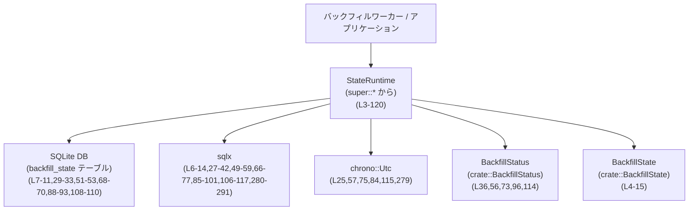
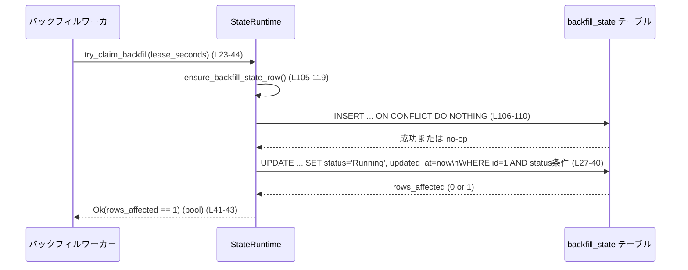
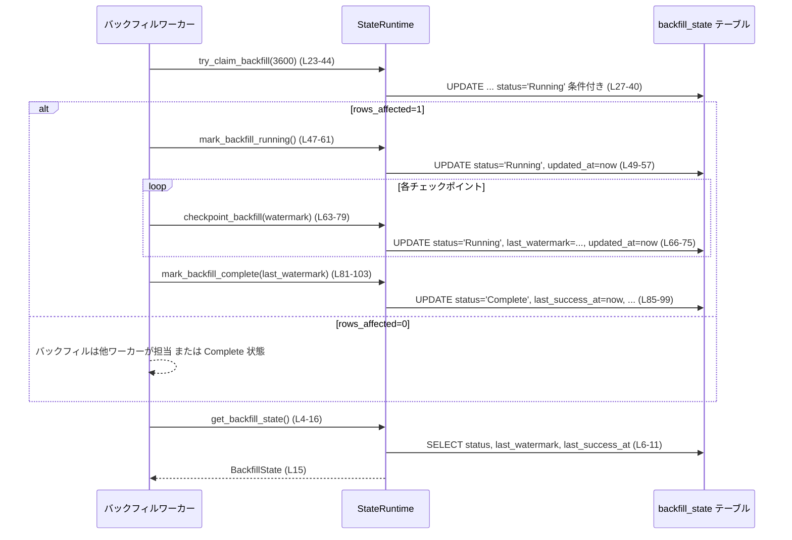

# state/src/runtime/backfill.rs

## 0. ざっくり一言

バックフィル処理（過去データの再取り込み）の **進捗・ロック状態を SQLite 上で管理するための `StateRuntime` メソッド群と、その振る舞いを検証するテスト**が定義されているファイルです（`StateRuntime` 自体は別ファイル定義）。  

---

## 1. このモジュールの役割

### 1.1 概要

- このモジュールは、バックフィル処理の状態を 1 行のレコードとしてデータベースに保持し、  
  - 現在の状態の取得  
  - 実行権限（ロック）の獲得  
  - 実行中マーク、進捗チェックポイント、完了マーク  
  を行う機能を提供します（`StateRuntime` 実装部、L3-120）。
- 併せて、SQLite ファイル名のマイグレーションとバックフィル状態管理のテストを提供します（`mod tests`、L122-311）。

### 1.2 アーキテクチャ内での位置づけ

- `StateRuntime` は、状態 DB（おそらく SQLite）へのアクセスを一元化するランタイムです（`use super::*;` より、上位モジュールから型を取り込んでいます, L1）。
- このファイルでは、`StateRuntime` にバックフィル状態に関するメソッドを追加し、`sqlx` 経由で DB にアクセスします（例: `sqlx::query(...).execute(self.pool.as_ref())`, L27-42, L49-59 等）。
- バックフィル状態には `crate::BackfillState` 構造体と `crate::BackfillStatus` 列挙体を利用します（例: L4, L36, L56, L73, L96, L114）。

依存関係の概要を Mermaid 図で示します。



### 1.3 設計上のポイント

- **単一行での状態管理**  
  `backfill_state` テーブルの `id = 1` 行だけを使い、バックフィル全体の状態を管理します（例: `WHERE id = 1`, L9-10, L31, L53, L70, L93, L109, L283-284）。
- **ロックとリース（lease）による単一ワーカー制御**  
  `try_claim_backfill` により、`status` と `updated_at` を用いたリース機構で、「同時に 1 ワーカーのみがバックフィルを担当する」ことを DB レベルで保証しようとしています（L23-43）。
- **Row の存在保証**  
  すべてのパブリックメソッドは最初に `ensure_backfill_state_row` を呼び出し、対象行が存在しない場合に `INSERT ... ON CONFLICT DO NOTHING` で作成します（L4-5,24,48,65,83 → L105-119）。
- **エラーハンドリング方針**  
  各メソッドは `anyhow::Result<T>` を返し、`?` 演算子で `sqlx` 経由の DB エラーや変換エラーを上位に伝播します。パニックは使用していません（例: `.await?;`, L14,42,59,77,101,117）。
- **非同期・並行性**  
  すべての操作は `async fn` で非同期に実行され、`StateRuntime` 内部のコネクションプール（`self.pool.as_ref()`）を通じてスレッドセーフに DB にアクセスしていると解釈できます（定義は他ファイル、L13,41,58,76,100,116）。

---

## 2. 主要な機能一覧

- バックフィル状態の取得: `get_backfill_state` で現在の状態・進捗を取得（L4-16）。
- バックフィル実行権限の獲得: `try_claim_backfill` でリース付きロックを取得（L23-44）。
- バックフィル実行中マーク: `mark_backfill_running` で状態を `Running` に更新（L47-61）。
- バックフィル進捗のチェックポイント保存: `checkpoint_backfill` で `last_watermark` を更新（L63-79）。
- バックフィル完了マーク: `mark_backfill_complete` で `Complete` かつ完了時刻・最終ウォーターマークを保存（L81-103）。
- 状態行の存在保証: `ensure_backfill_state_row` で必要なら 1 行目を作成（L105-119）。
- 状態 DB ファイルのクリーンアップと初期化挙動のテスト（L132-205）。
- バックフィルの進捗・完了状態が永続化されることのテスト（L207-258）。
- バックフィルのロックが単一ワーカーに限定され、stale 時のみ再取得できることのテスト（L260-310）。

---

## 3. 公開 API と詳細解説

### 3.1 型一覧とコンポーネントインベントリー

#### 主要な型（このファイル内では利用のみ）

| 名前 | 種別 | 定義位置 | 役割 / 用途 |
|------|------|----------|-------------|
| `StateRuntime` | 構造体（別モジュール定義） | 利用: `impl StateRuntime` (L3-120) | 状態 DB への接続プールや設定を保持すると推測されます。ここではバックフィル状態関連のメソッドを提供します。 |
| `BackfillState` | 構造体（crate 直下） | 利用: `crate::BackfillState::try_from_row(&row)` (L4-15) | `status`, `last_watermark`, `last_success_at` を含むバックフィル状態の読み取り用 DTO と解釈できます。 |
| `BackfillStatus` | 列挙体（crate 直下） | 利用: `.Pending` (L114), `.Running` (L36,56,73,287), `.Complete` (L38,96) | バックフィルの状態（Pending/Running/Complete）を表すステータス列挙体です。`as_str()` で DB の文字列値に変換します。 |

※ 型の実際の定義はこのチャンクには現れず、用途からの解釈です。

#### 関数・メソッド一覧

| 名前 | 種別 | 公開性 | 概要 | 定義位置（根拠） |
|------|------|--------|------|-------------------|
| `get_backfill_state(&self)` | メソッド（async） | `pub` | `backfill_state` テーブルの `id=1` 行を読み、`BackfillState` に変換して返します。 | `state/src/runtime/backfill.rs:L4-16` |
| `try_claim_backfill(&self, lease_seconds: i64)` | メソッド（async） | `pub` | バックフィルを実行するワーカーの「ロック」を、リース時間付きで取得します。成功したら `true`。 | `state/src/runtime/backfill.rs:L23-44` |
| `mark_backfill_running(&self)` | メソッド（async） | `pub` | バックフィル状態を `Running` に更新し、`updated_at` を現在時刻にします。 | `state/src/runtime/backfill.rs:L47-61` |
| `checkpoint_backfill(&self, watermark: &str)` | メソッド（async） | `pub` | バックフィル処理の進捗として `last_watermark` を保存しつつ `Running` 状態を維持します。 | `state/src/runtime/backfill.rs:L63-79` |
| `mark_backfill_complete(&self, last_watermark: Option<&str>)` | メソッド（async） | `pub` | 状態を `Complete` にし、最終ウォーターマーク（指定があれば）と完了時刻を記録します。 | `state/src/runtime/backfill.rs:L81-103` |
| `ensure_backfill_state_row(&self)` | メソッド（async） | `async fn`（非公開） | `id=1` の状態行が存在しない場合に挿入します（`ON CONFLICT DO NOTHING`）。 | `state/src/runtime/backfill.rs:L105-119` |
| `init_removes_legacy_state_db_files()` | テスト関数（async） | `#[tokio::test]` | `StateRuntime::init` が古い DB ファイルを削除し、新しいパスに DB を作ることを検証します。 | `state/src/runtime/backfill.rs:L132-205` |
| `backfill_state_persists_progress_and_completion()` | テスト関数（async） | `#[tokio::test]` | バックフィルの Pending → Running → Complete への遷移と `last_watermark` / `last_success_at` の永続化を検証します。 | `state/src/runtime/backfill.rs:L207-258` |
| `backfill_claim_is_singleton_until_stale_and_blocked_when_complete()` | テスト関数（async） | `#[tokio::test]` | ロックが単一ワーカーに限定され、stale（古い updated_at）のみ再取得可能で、Complete 後は取得不可であることを検証します。 | `state/src/runtime/backfill.rs:L260-310` |

---

### 3.2 関数詳細（重要メソッド）

#### `get_backfill_state(&self) -> anyhow::Result<crate::BackfillState>`

**概要**

- `backfill_state` テーブルの `id = 1` 行から `status`, `last_watermark`, `last_success_at` を読み取り、`BackfillState` に変換して返します（L4-16）。
- 呼び出し前に `ensure_backfill_state_row` を実行し、行の存在を保証します（L5, L105-119）。

**引数**

| 引数名 | 型 | 説明 |
|--------|----|------|
| `&self` | `&StateRuntime` | 状態 DB への接続と設定を持つランタイムインスタンスへの参照です。 |

**戻り値**

- `anyhow::Result<BackfillState>`  
  成功時は現在のバックフィル状態。失敗時は DB エラーまたは行変換エラーを含む `anyhow::Error`。

**内部処理の流れ**

1. `ensure_backfill_state_row().await?` で `id=1` の行の存在を保証します（L5, L105-119）。
2. `sqlx::query(...)` で `SELECT status, last_watermark, last_success_at FROM backfill_state WHERE id = 1` を発行します（L6-11）。
3. `.fetch_one(self.pool.as_ref()).await?` で単一行を取得します（L13-14）。
4. `crate::BackfillState::try_from_row(&row)` で取得した行を `BackfillState` に変換します（L15）。

**Examples（使用例）**

```rust
// バックフィル状態を読み取り、ログに出力する例
async fn log_backfill_state(runtime: &StateRuntime) -> anyhow::Result<()> {
    let state = runtime.get_backfill_state().await?; // L4-16 に対応
    println!("status = {:?}", state.status);         // BackfillStatus を表示
    println!("last_watermark = {:?}", state.last_watermark);
    println!("last_success_at = {:?}", state.last_success_at);
    Ok(())
}
```

**Errors / Panics**

- `ensure_backfill_state_row` 内の `INSERT` または `SELECT` 文の実行時に DB エラーが発生した場合、`anyhow::Error` として返されます（L5, L106-117）。
- `BackfillState::try_from_row` が行の内容を解釈できない場合（想定外のステータス文字列など）、そこでエラーが返る可能性があります（L15）。
- パニックは発生させていません。

**Edge cases（エッジケース）**

- 行が存在しない場合: `ensure_backfill_state_row` が `INSERT ... ON CONFLICT DO NOTHING` で行を作成してから `SELECT` を行います（L105-111）。
- 列値が `NULL` の場合: 変換ロジックは `BackfillState::try_from_row` 依存で、このチャンクからは挙動は不明ですが、テストでは `None` として扱われていることが確認できます（L218-220, L240）。

**使用上の注意点**

- バックフィル状態の読み取り専用であり、状態を変化させません。
- `BackfillState` のフィールド設計が変わる（列名追加・変更など）場合、このクエリと `try_from_row` を合わせて更新する必要があります。
- 非同期関数なので、Tokio などの非同期ランタイム上で `.await` する必要があります（テストが `#[tokio::test]` を用いていることから, L132, L207, L260）。

**根拠**

- 実装: `state/src/runtime/backfill.rs:L4-16`  
- 行存在保証: `state/src/runtime/backfill.rs:L105-119`  
- テストでの使用: `state/src/runtime/backfill.rs:L214-220, L231-240, L246-255`

---

#### `try_claim_backfill(&self, lease_seconds: i64) -> anyhow::Result<bool>`

**概要**

- バックフィル処理の「担当ワーカー枠」を 1 つだけ用意し、それを現在のランタイムが取得できるかを試みるメソッドです（L23-44）。
- 取得に成功した場合のみ `true` を返し、他のワーカーがまだ有効なリースを持っている場合やバックフィルが既に完了している場合は `false` を返します（ドキュコメント, L18-22）。

**引数**

| 引数名 | 型 | 説明 |
|--------|----|------|
| `&self` | `&StateRuntime` | ランタイムインスタンス。 |
| `lease_seconds` | `i64` | このワーカーが保持するリースの有効期間（秒）。負値は `0` として扱われます（`lease_seconds.max(0)`, L26）。 |

**戻り値**

- `anyhow::Result<bool>`  
  - `Ok(true)`: この呼び出しで `status` を `Running` に更新できた（ロック取得に成功）場合（L43）。  
  - `Ok(false)`: 更新対象が無かった場合（すでに `Complete` または有効な `Running` が存在）  
  - `Err`: DB 操作に失敗した場合など。

**内部処理の流れ**

1. `ensure_backfill_state_row().await?` で行の存在を保証（L24）。
2. 現在時刻 `now = Utc::now().timestamp()` を秒単位で取得（L25）。
3. `lease_seconds.max(0)` により負の入力を 0 に補正し、`lease_cutoff = now.saturating_sub(…)` で過去に遡る閾値を計算（L26）。
4. `UPDATE backfill_state ...` を実行（L27-42）:

   ```sql
   UPDATE backfill_state
   SET status = ?, updated_at = ?
   WHERE id = 1
     AND status != ?
     AND (status != ? OR updated_at <= ?)
   ```

   - `status = ?` → `BackfillStatus::Running`（L36）
   - `updated_at = ?` → `now`（L37）
   - `status != ?` → `!= Complete`（L38）
   - `(status != ? OR updated_at <= ?)` → `!= Running` または（`Running` だが `updated_at <= lease_cutoff`）（L39-40）

5. `.execute(...).await?` で実行し（L41-42）、`rows_affected() == 1` なら `true` を返す（L43）。

**Examples（使用例）**

```rust
// バックフィルワーカーの起動時にロックを試みる例
async fn run_backfill_if_primary(runtime: &StateRuntime) -> anyhow::Result<()> {
    // 1時間のリースを要求
    if runtime.try_claim_backfill(3600).await? {                // L23-44
        // ロック取得に成功した場合のみバックフィル処理を行う
        runtime.mark_backfill_running().await?;                 // L47-61
        // ... バックフィル処理本体（省略） ...
        runtime.mark_backfill_complete(None).await?;            // L81-103
    } else {
        println!("Another worker is already running backfill or it is complete.");
    }
    Ok(())
}
```

**Errors / Panics**

- DB 接続エラー・タイムアウト・ロック競合などは `sqlx::Error` として発生し、`anyhow::Error` にラップされて `Err` で返ります（L41-42）。
- パニックはありません。

**Edge cases（エッジケース）**

- `lease_seconds < 0`: `lease_seconds.max(0)` で 0 に丸められ、`lease_cutoff = now` となるため、「過去に遡った stale 判定」は行われず、事実上「現在 `Running` であれば常にロック不可」となります（L26）。  
- 既に `Complete` の場合: `AND status != ?` で弾かれ、`rows_affected = 0` → `Ok(false)` となります（L32, L38）。  
- `Running` だが `updated_at <= lease_cutoff` の場合: stale とみなし、新たなワーカーがロックを奪取できます（L33, L40）。  
  - テストで明示的に `updated_at` を過去に書き換え、`lease_seconds` を 10 にして再取得に成功することが確認されています（L279-297）。  
- 行が存在しない場合: `ensure_backfill_state_row` が挿入し、初回の `try_claim_backfill` で `Pending` → `Running` へ更新されます（L24, L105-119）。

**使用上の注意点**

- ロック機構は **単一の整数 ID (=1)** と `status` / `updated_at` の条件に依存しています。テーブルスキーマ変更時には条件式の整合性に注意が必要です。
- システム時計が大きく巻き戻る／進むと、`lease_cutoff` の計算に影響し、リースの有効判定が意図しない結果となる可能性があります（時刻依存ロジックであるため）。
- 複数プロセス・複数ノードでこの関数を呼ぶことで、DB を共有した分散ロックとして機能しますが、トランザクション分離レベルや SQLite のロック動作に依存します（コードからは詳細不明）。

**根拠**

- 実装: `state/src/runtime/backfill.rs:L23-44`  
- SQL 条件: `state/src/runtime/backfill.rs:L27-40`  
- stale ロック用テスト: `state/src/runtime/backfill.rs:L279-297`  
- Complete 後にロックが取得できないことのテスト: `state/src/runtime/backfill.rs:L299-307`

---

#### `mark_backfill_running(&self) -> anyhow::Result<()>`

**概要**

- `status` を `Running` に更新し、`updated_at` を現在時刻に設定します（L47-61）。
- バックフィル処理開始時（ロック獲得後）に呼び出す想定です。

**引数**

| 引数名 | 型 | 説明 |
|--------|----|------|
| `&self` | `&StateRuntime` | ランタイムインスタンス。 |

**戻り値**

- `anyhow::Result<()>`  
  成功時は `Ok(())`、失敗時は DB エラーを含む `Err`。

**内部処理の流れ**

1. `ensure_backfill_state_row().await?` で行存在を保証（L48）。
2. `UPDATE backfill_state SET status = ?, updated_at = ? WHERE id = 1` を実行（L49-53）。
   - `status = Running`（L56）
   - `updated_at = Utc::now().timestamp()`（L57）
3. `execute(...).await?` の結果は使用せず、成功したら `Ok(())` を返します（L58-60）。

**Examples（使用例）**

```rust
// try_claim_backfill に成功した後に状態を Running にする
async fn start_backfill(runtime: &StateRuntime) -> anyhow::Result<()> {
    if runtime.try_claim_backfill(3600).await? {
        runtime.mark_backfill_running().await?;  // L47-61
        // ここから実際のバックフィル処理へ
    }
    Ok(())
}
```

**Errors / Panics**

- `UPDATE` の実行時に DB エラーが発生すると `Err` を返します（L58-59）。
- `rows_affected` を見ていないため、`id=1` 行が削除されていた場合にもエラーにはならず、「何も更新されない」だけです。

**Edge cases**

- 既に `Running` の場合: 状態は変わりませんが、`updated_at` が現在時刻に更新され、リースが事実上延長されます（L51-57）。
- `status = Complete` の場合: この SQL には `status != Complete` の条件が無いため、`Complete` → `Running` に戻ってしまいます（L51-53）。  
  このファイル内のテストではそのような呼び出しは行われていませんが、API としては可能です。

**使用上の注意点**

- **Complete への遷移後は呼ばない前提** で設計されているように見えます。Complete 後に呼び出すと状態が Running に戻るため、呼び出し側の制御で防ぐ必要があります。
- ロック取得（`try_claim_backfill`）と組み合わせて利用することが想定されます（テストでは主に `backfill_state_persists_progress_and_completion` で確認, L222-225）。

**根拠**

- 実装: `state/src/runtime/backfill.rs:L47-61`  
- Complete → Running の可能性に関する SQL: `state/src/runtime/backfill.rs:L51-53`  
- 使用テスト: `state/src/runtime/backfill.rs:L222-225`

---

#### `checkpoint_backfill(&self, watermark: &str) -> anyhow::Result<()>`

**概要**

- バックフィル処理の途中経過として、最後に処理した位置を `last_watermark` に保存します（L63-79）。
- 同時に `status` を `Running` に設定し直し、`updated_at` を更新します。

**引数**

| 引数名 | 型 | 説明 |
|--------|----|------|
| `&self` | `&StateRuntime` | ランタイムインスタンス。 |
| `watermark` | `&str` | バックフィル進捗を表すウォーターマーク文字列（例: ファイルパス, L227-229）。 |

**戻り値**

- `anyhow::Result<()>`。

**内部処理の流れ**

1. `ensure_backfill_state_row().await?` で行存在保証（L65）。
2. `UPDATE backfill_state SET status = ?, last_watermark = ?, updated_at = ? WHERE id = 1` を実行（L66-70）。
   - `status = Running`（L73）
   - `last_watermark = watermark`（L74）
   - `updated_at = 現在時刻`（L75）
3. 実行成功で `Ok(())` を返します（L76-78）。

**Examples（使用例）**

```rust
// バックフィルの各ファイル処理後にチェックポイントする例
async fn process_files(runtime: &StateRuntime, files: &[String]) -> anyhow::Result<()> {
    for path in files {
        // ... path を処理する ...
        runtime.checkpoint_backfill(path).await?; // L63-79
    }
    Ok(())
}
```

**Errors / Panics**

- `UPDATE` 時にエラーがあれば `Err` を返します（L76-77）。

**Edge cases**

- 既に `Complete` な状態でも呼び出し可能で、その場合 `status` は `Running` に戻ります（L68-69）。  
  テストコードはこの誤用を行っていません（`mark_backfill_complete` の後に `checkpoint_backfill` を呼んでいない, L242-255）。
- `watermark` が長い文字列や特定文字（例: `/` や `:`）を含んでも、SQL パラメータとしてバインドされるため、SQL インジェクションは起こりません（L72-75）。

**使用上の注意点**

- 呼び出しは **Running 状態でのみ行う** という運用前提が妥当です。Complete への遷移後に呼び出した場合の挙動は望ましくない可能性があります。
- ウォーターマーク形式（例: ファイルパス）が変わると、後続の再開処理ロジックにも影響するため、全体設計と合わせて管理する必要があります。

**根拠**

- 実装: `state/src/runtime/backfill.rs:L63-79`  
- テストでの使用と期待される値: `state/src/runtime/backfill.rs:L222-240`

---

#### `mark_backfill_complete(&self, last_watermark: Option<&str>) -> anyhow::Result<()>`

**概要**

- バックフィル処理を完了状態にし、完了時刻 `last_success_at` と `updated_at` を記録します（L81-103）。
- 同時に、`last_watermark` 引数が `Some` の場合はそれで上書きし、`None` の場合は既存の値を保持します（`COALESCE`, L90）。

**引数**

| 引数名 | 型 | 説明 |
|--------|----|------|
| `&self` | `&StateRuntime` | ランタイムインスタンス。 |
| `last_watermark` | `Option<&str>` | 完了時点のウォーターマーク。`None` の場合は現状維持。 |

**戻り値**

- `anyhow::Result<()>`。

**内部処理の流れ**

1. `ensure_backfill_state_row().await?` で行存在を保証（L83）。
2. `now = Utc::now().timestamp()` を取得（L84）。
3. 以下の `UPDATE` を実行（L85-93）:

   ```sql
   UPDATE backfill_state
   SET
       status = ?,
       last_watermark = COALESCE(?, last_watermark),
       last_success_at = ?,
       updated_at = ?
   WHERE id = 1
   ```

   - `status = Complete`（L96）
   - `last_watermark = COALESCE(last_watermark_param, last_watermark)`（L97, L90）
   - `last_success_at = now`（L98）
   - `updated_at = now`（L99）

4. 実行成功で `Ok(())` を返します（L100-102）。

**Examples（使用例）**

```rust
// 最後に処理したファイルのパスを記録しつつ完了にする例
async fn finish_backfill(runtime: &StateRuntime, last_path: &str) -> anyhow::Result<()> {
    runtime
        .mark_backfill_complete(Some(last_path))  // L81-103
        .await?;
    Ok(())
}
```

**Errors / Panics**

- `UPDATE` 実行時の DB エラーは `Err` で返します（L100-101）。
- `COALESCE` による `NULL` 処理は DB 側で安全に行われるため、Rust 側でのパニックは発生しません。

**Edge cases**

- `last_watermark = None`: `COALESCE(?, last_watermark)` により既存の `last_watermark` を維持します（L90, L97）。  
  3 つ目のテストでは `None` を渡し、Complete 状態でロックが取得不能になることのみ確認しており、ウォーターマーク自体は検証していません（L299-307）。
- `Pending` 状態から直接 `Complete` を呼ぶことも技術的には可能で、その場合、中間の `Running` やチェックポイントが無い完了として扱われます。  
  テストでは必ず `mark_backfill_running` や `checkpoint_backfill` を経由しています（L222-229, L242-245）。

**使用上の注意点**

- 通常は `try_claim_backfill` → `mark_backfill_running` → （処理＋`checkpoint_backfill`）→ `mark_backfill_complete` という順で呼び出すことを前提とした設計です（テストのシナリオ参照, L207-258）。
- `Complete` にした後は `try_claim_backfill` が `false` を返すため、再度バックフィルを実行したい場合は別のリセットロジックが必要です（L299-307）。
- `last_success_at` は「最終成功時刻」であり、完了以外のタイミングでは更新されません。

**根拠**

- 実装: `state/src/runtime/backfill.rs:L81-103`  
- 正常な完了シナリオのテスト: `state/src/runtime/backfill.rs:L242-255`  
- Complete 後の claim 挙動: `state/src/runtime/backfill.rs:L299-307`

---

#### `ensure_backfill_state_row(&self) -> anyhow::Result<()>`（非公開）

**概要**

- `backfill_state` テーブルに `id = 1` の行が存在しない場合に、`Pending` 状態で作成します（L105-119）。
- 既に存在する場合は `ON CONFLICT(id) DO NOTHING` により何もしません。

**引数 / 戻り値**

- 引数: `&self`
- 戻り値: `anyhow::Result<()>`

**内部処理の流れ**

1. `INSERT INTO backfill_state (id, status, last_watermark, last_success_at, updated_at) VALUES (1, 'Pending', NULL, NULL, now)` を実行（L106-110, L113-115）。
2. `ON CONFLICT(id) DO NOTHING` により、`id` がユニークキーの場合は存在してもエラーにならず無視されます（L110）。
3. 実行成功で `Ok(())` を返します（L116-118）。

**Examples（使用例）**

- すべてのパブリックメソッド (`get_backfill_state`, `try_claim_backfill`, `mark_backfill_running`, `checkpoint_backfill`, `mark_backfill_complete`) の先頭で呼び出されています（L5, L24, L48, L65, L83）。

**Errors / Panics**

- テーブルが存在しない / スキーマ不一致などで `INSERT` に失敗すると `Err` を返します（L116-117）。

**Edge cases**

- 複数の並行呼び出し: 全てが `INSERT ... ON CONFLICT DO NOTHING` を使うため、同時挿入でも 1 行のみが作成され、他は no-op になります。
- `updated_at` は作成時点の `Utc::now().timestamp()` が記録されます（L115）。

**使用上の注意点**

- この関数は内部専用であり、外部コードは直接呼び出す必要はありません。
- テーブルの主キーが `id` であることを前提にしています。スキーマ変更時には合わせて修正する必要があります。

**根拠**

- 実装: `state/src/runtime/backfill.rs:L105-119`  
- 呼び出し箇所: `state/src/runtime/backfill.rs:L5, L24, L48, L65, L83`

---

### 3.3 その他の関数（テスト）

| 関数名 | 役割（1 行） | 定義位置 |
|--------|--------------|----------|
| `init_removes_legacy_state_db_files` | `StateRuntime::init` により、旧形式/旧バージョンの state DB ファイルが削除され、新ファイルのみ残ることを検証します。 | `state/src/runtime/backfill.rs:L132-205` |
| `backfill_state_persists_progress_and_completion` | バックフィルの Pending → Running → Complete への遷移と、`last_watermark` / `last_success_at` の永続化を検証します。 | `state/src/runtime/backfill.rs:L207-258` |
| `backfill_claim_is_singleton_until_stale_and_blocked_when_complete` | `try_claim_backfill` のロック制御が、単一ワーカー・stale 時の再取得・Complete 後のブロックを満たすことを検証します。 | `state/src/runtime/backfill.rs:L260-310` |

---

## 4. データフロー

ここでは、バックフィルロック取得と状態更新の典型フローを示します。

### 4.1 ロック取得フロー（`try_claim_backfill`）



要点:

- `ensure_backfill_state_row` により行存在が保証された上で、`UPDATE` によるロック取得を試みます。
- `rows_affected == 1` のときのみロック取得成功とみなします（L43）。

### 4.2 バックフィルライフサイクル



---

## 5. 使い方（How to Use）

### 5.1 基本的な使用方法

バックフィルワーカーを 1 つ選び、そのワーカーだけがバックフィルを実行する基本フローの例です。

```rust
use state::runtime::StateRuntime;
use anyhow::Result;

// バックフィルワーカーのエントリポイント例
async fn run_backfill(runtime: &StateRuntime) -> Result<()> {
    // 1. ロック（担当枠）の取得を試みる（1時間のリース）
    if !runtime.try_claim_backfill(3600).await? {   // L23-44
        // 既に他ワーカーが実行中、または Complete
        return Ok(());
    }

    // 2. 状態を Running に更新
    runtime.mark_backfill_running().await?;         // L47-61

    // 3. バックフィル処理本体（疑似コード）
    let files = vec!["file1.jsonl", "file2.jsonl"];
    for path in &files {
        // ... path を処理 ...
        runtime.checkpoint_backfill(path).await?;  // L63-79
    }

    // 4. 完了マーク（最後のウォーターマークを保存）
    if let Some(last) = files.last() {
        runtime
            .mark_backfill_complete(Some(last))    // L81-103
            .await?;
    } else {
        runtime.mark_backfill_complete(None).await?;
    }

    Ok(())
}
```

### 5.2 よくある使用パターン

1. **状態の監視**

   別コンポーネントがバックフィル状態を監視し、UI などに表示する:

   ```rust
   async fn show_backfill_status(runtime: &StateRuntime) -> anyhow::Result<()> {
       let state = runtime.get_backfill_state().await?;   // L4-16
       println!("Backfill: {:?}", state.status);
       Ok(())
   }
   ```

2. **stale ロックの再取得**

   - システムがクラッシュした後、古い `updated_at` のまま `Running` になっている場合、
   - 小さめの `lease_seconds` を指定して `try_claim_backfill` を再実行すると、一定時間経過後に別ワーカーがロックを奪えます（L26, L33, L40, テスト L279-297）。

### 5.3 よくある間違い

```rust
// 誤り例: ロックを取らずにバックフィルを実行してしまう
async fn wrong_backfill(runtime: &StateRuntime) -> anyhow::Result<()> {
    runtime.mark_backfill_running().await?;         // L47-61
    // ... バックフィル処理 ...
    runtime.mark_backfill_complete(None).await?;    // L81-103
    Ok(())
}

// 正しい例: 先に try_claim_backfill でロックを取る
async fn correct_backfill(runtime: &StateRuntime) -> anyhow::Result<()> {
    if !runtime.try_claim_backfill(3600).await? {   // L23-44
        return Ok(()); // 他ワーカーが担当
    }
    runtime.mark_backfill_running().await?;
    // ... バックフィル処理 ...
    runtime.mark_backfill_complete(None).await?;
    Ok(())
}
```

### 5.4 使用上の注意点（まとめ）

- **ロック取得順序**  
  バックフィル実行前には必ず `try_claim_backfill` を呼び、`true` のときだけ実行することが望ましいです（L23-44, L260-277）。
- **状態遷移の順序**  
  - 通常: `Pending` → `Running` → `Complete`  
  - コード上は任意の順で呼び出せますが、中間状態を飛ばすと状態履歴が不自然になります。
- **Complete 後の扱い**  
  `try_claim_backfill` は `Complete` のとき常に `false` を返します（L32, L38, テスト L299-307）。再バックフィルしたい場合は別途リセット機構が必要です。
- **パフォーマンス**  
  - 各操作は単一行の `UPDATE/SELECT` であり、量的には軽量です。
  - ただし高頻度で `checkpoint_backfill` を呼び出すと、ディスク I/O が増加します。
- **非同期ランタイム**  
  テストが `#[tokio::test]` を用いていることから、Tokio ランタイム上での利用を前提としていると考えられます（L132, L207, L260）。

---

## 6. 変更の仕方（How to Modify）

### 6.1 新しい機能を追加する場合

例: バックフィルに「キャンセル」状態を追加したい場合。

1. **`BackfillStatus` への状態追加**  
   - `Canceled` などの新しい variant を `crate::BackfillStatus` に追加し、`as_str()` で DB に保存する文字列を定義します（定義は他ファイルで、このチャンクには現れません）。
2. **テーブルスキーマの確認**  
   - `backfill_state.status` 列が新しい値を許容することを確認します。
3. **状態更新メソッドの追加**  
   - 本ファイルの `impl StateRuntime` に `mark_backfill_canceled` のようなメソッドを追加し、既存メソッドと同様に `UPDATE` を実装します（L47-61, L81-103 を参考）。
4. **ロック挙動との整合性**  
   - `try_claim_backfill` の `WHERE` 条件に `Canceled` をどう扱うか（再取得を許すか否か）を検討し、必要なら条件を変更します（L31-33）。
5. **テスト追加**  
   - `mod tests` 内に、新状態を含むライフサイクルテストやロックテストを追加します（L207-258, L260-310 を参考）。

### 6.2 既存の機能を変更する場合

- **影響範囲の確認**
  - 状態変更メソッドを変える場合、`backfill_state_persists_progress_and_completion` と `backfill_claim_is_singleton_until_stale_and_blocked_when_complete` のテストに影響するため、一緒に更新する必要があります（L207-258, L260-310）。
- **契約（前提条件）の維持**
  - `try_claim_backfill` は「Complete のときはロック不可」「stale Running のときのみ再取得可能」という契約をテストで保証しているため（L279-297, L299-307）、条件を変える際はテストも更新して明示することが重要です。
- **スキーマ変更**
  - `last_watermark` や `last_success_at` の型変更時には、SELECT / UPDATE すべての SQL と `BackfillState::try_from_row` の整合性を確認する必要があります（L7-11, L68-70, L88-92, L108-110）。
- **テストの再確認**
  - DB ファイル名やバージョン管理ロジックに変更を加える場合は `init_removes_legacy_state_db_files` の内容も合わせて修正します（L132-205）。

---

## 7. 関連ファイル

| パス（推定） | 役割 / 関係 |
|--------------|------------|
| `state/src/runtime/mod.rs` または `state/src/runtime/state_runtime.rs` | `StateRuntime` 本体および `state_db_filename`, `test_support::unique_temp_dir` などが定義されていると考えられるモジュールです（利用: L1, L124-126, L163, L210, L263）。 |
| `crate::BackfillState` 定義ファイル | `BackfillState::try_from_row` の実装とフィールド定義を持つファイルです（利用: L4-15, テストでのフィールド参照 L218-220, L235-240, L250-255）。 |
| `crate::BackfillStatus` 定義ファイル | バックフィル状態列挙体と `as_str()` 実装を含みます（利用: L36, L38, L56, L73, L96, L114, L218, L235, L250, L287）。 |
| `state/src/runtime/test_support.rs` | `unique_temp_dir` の実装があるテスト支援モジュールです（利用: L126）。 |
| SQLite スキーマ定義ファイル | `backfill_state` テーブルおよび `id` 主キー定義を含むマイグレーションファイル（このチャンクには現れませんが、SQL から存在が推測されます, L7-11, L29-33, L51-53, L68-70, L88-93, L108-110）。 |
| 定数 `STATE_DB_FILENAME`, `STATE_DB_VERSION` の定義ファイル | state DB ファイル名とバージョン管理のための定数を定義しているファイルです（利用: L127-128, L139-141, L175-177）。 |

---

## Bugs / Security / Contracts / Tests / パフォーマンスの要点（まとめ）

- **潜在的なバグ / 設計上の注意**
  - `mark_backfill_running` / `checkpoint_backfill` は `Complete` 状態を無条件に `Running` に戻すことができるため、呼び出し順を守らないと状態が矛盾します（L51-53, L68-69）。
- **セキュリティ**
  - すべての SQL は `?` プレースホルダと `.bind(...)` を用いており、動的な文字列連結を行っていないため、SQL インジェクション耐性があります（例: L36-40, L56-57, L73-75, L96-99, L113-115, L287-288）。
- **契約 / エッジケース**
  - `try_claim_backfill` の契約はテストで詳細にカバーされています（初回成功, 2 回目失敗, stale 時成功, Complete 後失敗, L260-307）。
  - `BackfillState` のフィールドが `None` → 値 → `None で維持` と変化することもテストされています（L218-220, L235-240, L250-255）。
- **テストカバレッジ**
  - 状態遷移、ウォーターマークの更新、ロックの単一性、stale 判定、Complete 後ロック不可、DB ファイル名マイグレーションなど、主要な振る舞いはテストされています（L132-205, L207-258, L260-310）。
- **パフォーマンス / スケーラビリティ**
  - 状態管理は単一行＋単純 SQL のみで非常に軽いですが、バックフィルワーカー数が増えても DB ロック競合は `try_claim_backfill` の 1 行更新部分に集中します。
  - データ量は増えません（常に 1 行）ため、スケール問題は主に DB 接続数・ロック競合に依存します。

以上が、このファイル `state/src/runtime/backfill.rs` におけるバックフィル状態管理ロジックの解説です。
