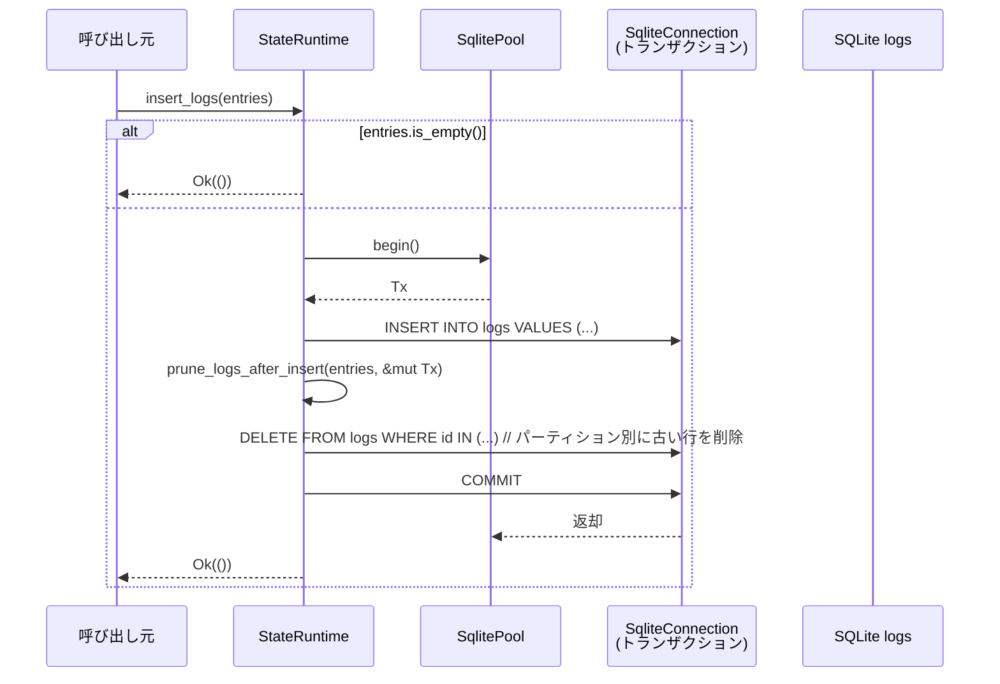
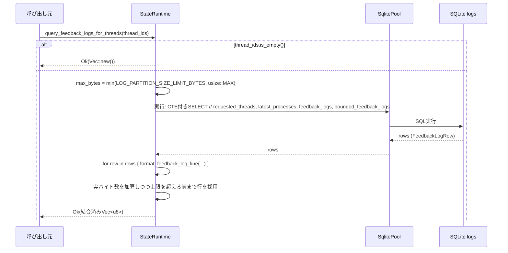

# state/src/runtime/logs.rs コード解説

## 0. ざっくり一言

- SQLite をバックエンドにした **ログ専用データベース**への書き込み・保持期間制御・検索を行うランタイム機能をまとめたモジュールです。
- スレッド単位／プロセス単位の **容量／行数上限に基づく自動削除** と、フィードバック用の **テキストログ生成** がコア機能です。

> 注: 行番号情報はこの環境からは取得できないため、根拠は関数名や SQL 文の断片で示します。

---

## 1. このモジュールの役割

### 1.1 概要

- このモジュールは、`StateRuntime` に対して **ログを SQLite DB に永続化**し、  
  ログの **サイズ・行数制限に基づくパーティション単位の削除（pruning）** と  
  **検索／フィードバック用取得 API** を提供します。
- ログは「スレッド ID」と「プロセス UUID」によりパーティション分割され、  
  各パーティションに対して **概算バイト数（estimated_bytes）と行数の上限** を守るように削除されます。
- 起動時メンテナンスとして、一定日数より古いログを削除し、SQLite の `PRAGMA` を使ってファイルサイズも管理します。

### 1.2 アーキテクチャ内での位置づけ

`StateRuntime` を中心に、ログ DB、クエリ型、ログエントリ型との関係は概ね次のようになります。

```mermaid
graph TD
    SR[StateRuntime\n(他ファイルで定義)] -->|insert_logs, query_*| LogsDB[(SQLite\nlogs.sqlite)]
    SR -->|書き込み| LogEntry[LogEntry\n(crate 型)]
    SR -->|読み出し| LogRow[LogRow\n(crate 型)]
    SR -->|検索条件| LogQuery[LogQuery\n(crate 型)]

    subgraph Retention
      prune[prune_logs_after_insert\n(パーティション毎の削除)]
    end

    SR --> prune
    LogsDB --> prune
```

- `StateRuntime` は、ここでは `logs_pool: SqlitePool`（ログ専用 DB への接続）を使います。
- 書き込みは `insert_logs` → `prune_logs_after_insert` → `tx.commit` という **1 トランザクション**内で完結します。
- 読み出しは `query_logs` や `query_feedback_logs_for_threads` から `logs_pool` に直接クエリします。

### 1.3 設計上のポイント

コードから読み取れる特徴を示します。

- **責務の分割**
  - `StateRuntime` impl メソッド:
    - 書き込み: `insert_log`, `insert_logs`
    - 削除・保持制御: `prune_logs_after_insert`, `delete_logs_before`, `run_logs_startup_maintenance`
    - 読み出し: `query_logs`, `query_feedback_logs_for_threads`, `query_feedback_logs`, `max_log_id`
  - モジュール内ヘルパー:
    - クエリ整形: `push_log_filters`, `push_like_filters`
    - フィードバック用 1 行フォーマット: `format_feedback_log_line`
    - フィードバックログ行の一時的な受け皿構造体: `FeedbackLogRow`
- **状態管理**
  - ログ DB 自体の状態は SQLite が保持し、ここでは `logs_pool` 経由で接続します。
  - メモリ側で保持する状態は最小限（挿入バッチ `entries`, その中から抽出した `BTreeSet` など）。
- **エラーハンドリング**
  - すべての公開メソッドは `anyhow::Result` を返し、`sqlx` の DB エラーなどを `?` で委譲します。
  - ログフォーマット部分では、変換失敗などに対しては **安全側のフォールバック**（例: `ts_nanos` が `u32` に収まらない場合は 0 にする）を採用しています。
- **並行性**
  - すべて `async fn` であり、`SqlitePool` のコネクションプールを利用した **マルチスレッド非同期 I/O** を前提としています。
  - トランザクション (`begin` ～ `commit`) の範囲を厳格にし、  
    「挿入済みだがまだ prune されていない」状態を外部から見えないようにしています。

---

## 2. 主要な機能一覧

このモジュールが提供する主な機能を列挙します（本体コードのみ、テストは後述）。

- `StateRuntime::insert_log`: 単一の `LogEntry` をログ DB に追加する（バッチ版のラッパー）。
- `StateRuntime::insert_logs`: 複数の `LogEntry` を一括挿入し、**パーティション別の容量・行数上限を超えた古いログを削除**する。
- `StateRuntime::delete_logs_before`: 指定 UNIX 時刻より古いログを一括削除する。
- `StateRuntime::run_logs_startup_maintenance`: 起動時に **保持日数を超えた古いログ削除 & SQLite ファイルのメンテナンス PRAGMA 実行**を行う。
- `StateRuntime::query_logs`: 各種フィルタ条件付きでログ行を取得する（`LogRow` のベクタ）。
- `StateRuntime::query_feedback_logs_for_threads`: 複数スレッド ID に対応する **スレッド付き／スレッドレスのフィードバックログを結合し、容量上限以内で新しい順に取得**する。
- `StateRuntime::query_feedback_logs`: 単一スレッド ID 向けの `query_feedback_logs_for_threads` のラッパー。
- `StateRuntime::max_log_id`: フィルタ条件に一致するログの最大 ID を取得する。
- `format_feedback_log_line`: 1 レコードを RFC3339 形式のタイムスタンプ付き 1 行テキストに整形する。
- `push_log_filters`: `LogQuery` に基づく WHERE 句（レベル、期間、モジュール、ファイル、スレッド、検索語句など）を `QueryBuilder` に追加する。
- `push_like_filters`: 特定列に対する部分一致（`LIKE '%...%'`）条件を `QueryBuilder` に追加する。

---

## 3. 公開 API と詳細解説

### 3.1 型一覧（構造体・列挙体など）

このファイル内および関連する主な型をまとめます。

| 名前 | 種別 | 定義場所 | 役割 / 用途 |
|------|------|----------|-------------|
| `StateRuntime` | 構造体 | 別ファイル（`super::*`） | 全体の状態を持つランタイム。ここではログ DB（`logs_pool`）を操作するメソッドを実装。 |
| `LogEntry` | 構造体 | crate 内（`crate::LogEntry`） | 挿入用ログエントリ。`ts`, `ts_nanos`, `level`, `target`, `message`, `feedback_log_body`, `thread_id`, `process_uuid`, `module_path`, `file`, `line` 等を持つ。 |
| `LogQuery` | 構造体 | crate 内（`crate::LogQuery`） | `level_upper`, `from_ts`, `to_ts`, `module_like`, `file_like`, `thread_ids`, `include_threadless`, `after_id`, `search`, `limit`, `descending` などの検索条件を持つ。 |
| `LogRow` | 構造体 | crate 内 | DB から読み出す 1 行。`query_logs` で `FromRow` として使われる。 |
| `FeedbackLogRow` | 構造体 | このファイル | フィードバックログ取得用の一時的な行型。`ts`, `ts_nanos`, `level`, `feedback_log_body` を保持。 |
| `Sqlite`, `SqliteConnection`, `SqlitePool` | 型 | `sqlx` | SQLite 用ドライバおよび接続／プール型。 |
| `Utc`, `DateTime` | 型 | `chrono` | UTC 時刻表現。ログのタイムスタンプ変換に使用。 |

> `LOG_PARTITION_SIZE_LIMIT_BYTES` と `LOG_PARTITION_ROW_LIMIT` は `super::*` から来る定数で、  
> バイト数と行数の上限値として使われています（値そのものはこのファイルからは読み取れません）。

### 3.2 関数詳細（代表 7 件）

#### 1. `StateRuntime::insert_logs(&self, entries: &[LogEntry]) -> anyhow::Result<()>`

**概要**

- 複数の `LogEntry` を **1 トランザクションで SQLite の `logs` テーブルへ一括挿入**します。
- 挿入後に `prune_logs_after_insert` を呼び出し、各パーティションの上限を超えた古いログを削除します。

**引数**

| 引数名 | 型 | 説明 |
|--------|----|------|
| `entries` | `&[LogEntry]` | 挿入したいログエントリのスライス。空の場合は何もせず即 `Ok(())` を返す。 |

**戻り値**

- `anyhow::Result<()>`  
  - 成功時: `Ok(())`  
  - 失敗時: DB エラーやトランザクション操作失敗などを含む `Err(anyhow::Error)`。

**内部処理の流れ**

1. `entries.is_empty()` の場合は早期に `Ok(())` を返す。
2. `self.logs_pool.begin().await?` でトランザクションを開始し、`SqliteConnection` を取得。
3. `QueryBuilder::<Sqlite>::new("INSERT INTO logs (...)")` で INSERT 文を組み立て、
   `builder.push_values(entries, |row, entry| { ... })` で各行の値を追加。
   - `feedback_log_body` として `entry.feedback_log_body` があればそちらを、なければ `entry.message` を使う。
   - `estimated_bytes` は `feedback_log_body`（または `message`）の長さ + `level`, `target`, `module_path`, `file` の長さの合計で概算。
4. `builder.build().execute(&mut *tx).await?` で一括 INSERT 実行。
5. `self.prune_logs_after_insert(entries, &mut tx).await?` を呼び、同一トランザクション内で古い行を削除。
6. `tx.commit().await?` でトランザクションをコミット。
7. `Ok(())` を返す。

**Examples（使用例）**

```rust
use crate::{StateRuntime, LogEntry};
use chrono::Utc;

#[tokio::main]
async fn main() -> anyhow::Result<()> {
    let runtime = StateRuntime::init("/path/to/home".into(), "provider".to_string()).await?;
    
    let entries = vec![
        LogEntry {
            ts: Utc::now().timestamp(),
            ts_nanos: 0,
            level: "INFO".to_string(),
            target: "cli".to_string(),
            message: Some("hello".to_string()),
            feedback_log_body: Some("hello".to_string()),
            thread_id: Some("thread-1".to_string()),
            process_uuid: Some("proc-1".to_string()),
            module_path: Some("my_mod".to_string()),
            file: Some("main.rs".to_string()),
            line: Some(42),
        },
    ];

    runtime.insert_logs(&entries).await?;
    Ok(())
}
```

**Errors / Panics**

- `begin`, `execute`, `commit` の各ステップで `sqlx` のエラーが発生した場合は `Err` を返します。
- パニックを起こしうる箇所は見当たりません（`unwrap` 系は使用していません）。

**Edge cases（エッジケース）**

- `entries` が空スライスのときは DB にアクセスせず即 `Ok(())` を返します（テストからも間接的に前提とされる挙動）。
- 単一行の `estimated_bytes` 自体が上限を超える場合、その行だけが削除される可能性があります  
  （`insert_logs_prunes_single_thread_row_when_it_exceeds_size_limit` などのテスト参照）。

**使用上の注意点**

- `entries` 内の `thread_id` と `process_uuid` の組み合わせでパーティションが決まり、  
  後続の `prune_logs_after_insert` により **同一パーティション内の古い行が削除される**ことがあります。
- `LogEntry.message` は旧 API の互換のためのフィールドであり、実際に DB に保存されるのは `feedback_log_body` です。  
  新規実装では `feedback_log_body` を優先的にセットする前提で使うのが安全です。

---

#### 2. `StateRuntime::prune_logs_after_insert(&self, entries: &[LogEntry], tx: &mut SqliteConnection) -> anyhow::Result<()>`

**概要**

- `insert_logs` 内部からのみ呼ばれる非公開メソッドです。
- 直前に挿入した `entries` に含まれるパーティション（スレッド ID、プロセス UUID）について、  
  **`LOG_PARTITION_SIZE_LIMIT_BYTES` と `LOG_PARTITION_ROW_LIMIT` を超えないよう古いログを削除**します。

**引数**

| 引数名 | 型 | 説明 |
|--------|----|------|
| `entries` | `&[LogEntry]` | 直前に挿入されたログエントリ。どのパーティションに対してチェックすべきかを抽出するために使用。 |
| `tx` | `&mut SqliteConnection` | すでに開始済みのトランザクション接続。挿入と同一トランザクション内で prune を行う。 |

**戻り値**

- `anyhow::Result<()>`。  
  `SELECT` や `DELETE` の実行でエラーがあれば `Err` になります。

**内部処理の流れ（要約）**

1. **thread_id 付きログの削除**
   - `entries` から `thread_id` を持つものを `BTreeSet<&str>` に収集。
   - その集合に対して `HAVING SUM(estimated_bytes) > LIMIT OR COUNT(*) > LIMIT_ROWS` な `thread_id` を抽出。
   - 該当スレッドごとに、
     - ウィンドウ関数 `SUM(estimated_bytes) OVER (PARTITION BY thread_id ORDER BY ts DESC, ts_nanos DESC, id DESC)` と
     - `ROW_NUMBER() OVER (PARTITION BY thread_id ORDER BY ts DESC, ts_nanos DESC, id DESC)`
     を計算し、予算超過 (`cumulative_bytes > LIMIT`) または行数超過 (`row_number > LIMIT_ROWS`) の行を `DELETE`。
2. **threadless（thread_id が NULL）かつ process_uuid 付きログの削除**
   - `entries` から `thread_id.is_none()` かつ `process_uuid` を持つものを `BTreeSet<&str>` に収集。
   - 上記と同様に `process_uuid` 単位で SUM/COUNT を集計し、上限超過の `process_uuid` を抽出。
   - 対象となる `process_uuid` に対し、`PARTITION BY process_uuid` で同様のウィンドウ関数を使い予算超過・行数超過の行を削除。
3. **threadless かつ process_uuid が NULL のログの削除**
   - `entries` 内に該当行が存在していた場合のみ処理。
   - `thread_id IS NULL AND process_uuid IS NULL` の行について、`SUM(estimated_bytes)` と `COUNT(*)` を一度集計。
   - どちらかが上限を超える場合、
     - `PARTITION BY process_uuid`（NULL も 1 つのパーティションとして扱われる）でウィンドウ関数を計算し、同様に削除。

**Examples（使用例）**

- 直接呼び出すことは想定されておらず、`insert_logs` 内部からのみ利用されます。  
  そのため、使用例は `insert_logs` の例を参照するのが妥当です。

**Errors / Panics**

- `fetch_all`, `fetch_one`, `execute` などの DB 操作が失敗すると `Err` を返します。
- パニックを起こしうる明示的な `unwrap` 等はありません。

**Edge cases**

- **単一行が上限超過**:
  - その行単体で `estimated_bytes > LIMIT` の場合も、ウィンドウ関数の結果として `row_number = 1` かつ `cumulative_bytes > LIMIT` となり削除対象になります。  
    → 「一度も保持されないログ」が発生しうることがテストで確認されています。
- **複数パーティション混在のバッチ**
  - `entries` に複数の `thread_id` / `process_uuid` が混在している場合でも、それぞれのパーティション単位で集計されます。
- **process_uuid NULL パーティション**
  - `process_uuid IS NULL` も 1 つのパーティションとして扱うため、threadless かつ `process_uuid` 未設定のログも上限管理の対象になります。

**使用上の注意点**

- この関数は **トランザクション内でのみ** 呼び出される前提で設計されています。  
  そのため、外部から直接呼び出して別のトランザクションで使うと、  
  「挿入と削除が atomically 同期している」という前提が崩れる可能性があります。
- 上限は概算バイト数 (`estimated_bytes`) によるため、実際の UTF-8 バイト数と若干の誤差がありえます。  
  ただし、その分は後述の `query_feedback_logs_for_threads` 側で実バイト数に基づくチェックを行っています。

---

#### 3. `StateRuntime::query_logs(&self, query: &LogQuery) -> anyhow::Result<Vec<LogRow>>`

**概要**

- `LogQuery` の条件に基づき、`logs` テーブルから `LogRow` のベクタを取得する汎用クエリです。
- レベル、期間、モジュールパス、ファイル、スレッド（および threadless）フラグ、全文検索（部分一致）、`after_id`、ソート順、件数上限をサポートします。

**引数**

| 引数名 | 型 | 説明 |
|--------|----|------|
| `query` | `&LogQuery` | 各種フィルタ条件とオプション（`limit`, `descending` など）を含む。 |

**戻り値**

- `anyhow::Result<Vec<LogRow>>`  
  - 条件に一致するログ行を `LogRow` としてすべて返します（`limit` 指定がある場合はその件数まで）。

**内部処理の流れ**

1. ベースクエリ:

   ```sql
   SELECT id, ts, ts_nanos, level, target,
          feedback_log_body AS message,
          thread_id, process_uuid, file, line
   FROM logs
   WHERE 1 = 1
   ```

2. `push_log_filters(&mut builder, query);` で WHERE 句に条件を追加。
   - レベル、期間、モジュールパス部分一致、ファイル部分一致、スレッド ID（複数 OR）、threadless の有無、`after_id`、`search` の全文部分一致など。
3. `ORDER BY id DESC/ASC` を `query.descending` に応じて追加。
4. `LIMIT ?` を `query.limit` が指定されていれば追加。
5. `build_query_as::<LogRow>().fetch_all(self.logs_pool.as_ref()).await?` でクエリ実行。
6. 結果の `Vec<LogRow>` を返す。

**Examples**

```rust
use crate::{StateRuntime, LogQuery};

async fn get_recent_info_logs(runtime: &StateRuntime) -> anyhow::Result<Vec<crate::LogRow>> {
    let query = LogQuery {
        level_upper: Some("INFO".to_string()),
        descending: true,
        limit: Some(100),
        ..Default::default()
    };
    runtime.query_logs(&query).await
}
```

**Errors / Panics**

- DB 接続の失敗、SQL 実行エラーなどで `Err(anyhow::Error)` を返します。
- クエリの構築にあたってはユーザ入力はすべて `push_bind` 経由でバインドされており、文字列連結による SQL インジェクション箇所は見当たりません。

**Edge cases**

- `search` 条件は `INSTR(COALESCE(feedback_log_body, ''), ?)` を使うため、`feedback_log_body` が `NULL` の行は「空文字列」として扱われ、  
  その中に検索語句が含まれている場合のみマッチします。  
  → テスト `query_logs_with_search_matches_rendered_body_substring` がこの動作を確認しています。
- `include_threadless` が true で `thread_ids` が空の場合でも、`thread_id IS NULL` という条件のみが付加されます。

**使用上の注意点**

- `LogQuery` の `level_upper` はすでに大文字化済みである前提で `UPPER(level) = ?` を使っています。  
  呼び出し側は大文字に正規化するか、このフィールドを適切に構成する必要があります。
- `ORDER BY` は ID のみで行っているため、同一 `ts` の行の相対順序は ID 順になります。

---

#### 4. `StateRuntime::query_feedback_logs_for_threads(&self, thread_ids: &[&str]) -> anyhow::Result<Vec<u8>>`

**概要**

- 指定された複数のスレッド ID に紐づくログと、  
  それぞれのスレッドの **最新のプロセス UUID に属する threadless ログ** を合わせて取得し、  
  1 行ごとのテキストに整形して **連結したバイト列** を返します。
- SQLite 上の `LOG_PARTITION_SIZE_LIMIT_BYTES` を基準とした **おおよその上限**と、  
  Rust 側での **厳密なバイト数上限**の二段構えで容量を制限します。

**引数**

| 引数名 | 型 | 説明 |
|--------|----|------|
| `thread_ids` | `&[&str]` | 対象とするスレッド ID の配列。空の場合は空の `Vec<u8>` を返す。 |

**戻り値**

- `anyhow::Result<Vec<u8>>`  
  - タイムスタンプ付きログ行が改行区切りで結合されたバイト列（UTF-8）。

**内部処理の流れ（SQL レベル）**

1. `thread_ids.is_empty()` のときは即 `Ok(Vec::new())`。
2. `LOG_PARTITION_SIZE_LIMIT_BYTES` を `usize::try_from` で変換し、失敗したら `usize::MAX` にフォールバック（`max_bytes`）。
3. `requested_threads` という CTE で、`VALUES (?)` 形式で thread_id のリストを定義。
4. `latest_processes` CTE:
   - 各 `requested_threads.thread_id` について、

     ```sql
     SELECT process_uuid
     FROM logs
     WHERE logs.thread_id = requested_threads.thread_id AND process_uuid IS NOT NULL
     ORDER BY ts DESC, ts_nanos DESC, id DESC
     LIMIT 1
     ```

     により **最新のプロセス UUID** を取得。
5. `feedback_logs` CTE:
   - `feedback_log_body IS NOT NULL` の行のみを対象にし、
   - `thread_id IN (requested_threads)` の行、または
   - `thread_id IS NULL AND process_uuid IN (latest_processes)` の行を選択。
6. `bounded_feedback_logs` CTE:
   - `feedback_logs` に対して `SUM(estimated_bytes) OVER (ORDER BY ts DESC, ts_nanos DESC, id DESC)` を計算し、
     新しい順に `cumulative_estimated_bytes` を付与。
7. 最終 SELECT:
   - `cumulative_estimated_bytes <= ?` な行のみを抽出し、`ts DESC, ts_nanos DESC, id DESC` で並べ替え。
8. Rust 側:
   - 結果 `FeedbackLogRow` ごとに `format_feedback_log_line` で 1 行の文字列に整形。
   - 実際の `line.len()` を積み上げ、`total_bytes.saturating_add(line.len()) > max_bytes` でチェック。上限を超える直前で中断。
   - 行リストを **逆順にしてから** バイト列として連結（最終的には古い順 → 新しい順になる）。

**Examples**

```rust
use crate::StateRuntime;

async fn dump_feedback_for_two_threads(runtime: &StateRuntime) -> anyhow::Result<String> {
    let bytes = runtime
        .query_feedback_logs_for_threads(&["thread-1", "thread-2"])
        .await?;
    Ok(String::from_utf8(bytes).expect("logs are utf-8"))
}
```

**Errors / Panics**

- SQL 実行に失敗すると `Err(anyhow::Error)` になります。
- `usize::try_from(LOG_PARTITION_SIZE_LIMIT_BYTES).unwrap_or(usize::MAX)` での `unwrap_or` はパニックしません。
- `String::from_utf8` などは呼び出し側の責任であり、この関数内では使用していません。

**Edge cases**

- **`thread_ids` が空**: 即座に `Ok(Vec::new())` を返します（テストで確認）。
- **最新行が単独で上限超過**:
  - SQL レベルでは `estimated_bytes` ベースでフィルタされますが、Rust 側の厳密チェックで弾かれ、結果として空になるケースがあります。  
    → `query_feedback_logs_excludes_oversized_newest_row` のテストで確認。
- **複数スレッド指定**:
  - 各スレッドの最新プロセス UUID が異なる場合、それぞれのプロセスに属する threadless ログを併せて取得します。  
    → `query_feedback_logs_for_threads_merges_requested_threads_and_threadless_rows` が挙動を確認しています。

**使用上の注意点**

- 返り値は UTF-8 文字列をバイト列にしたものですが、この関数はエンコーディングを保証しません。  
  テストでは UTF-8 を前提としていますが、呼び出し側で `String::from_utf8` する際は `Result` を確認する必要があります。
- フィードバックログとして利用される前提があり、`feedback_log_body` が `NULL` の行は最初から対象外です。

---

#### 5. `StateRuntime::query_feedback_logs(&self, thread_id: &str) -> anyhow::Result<Vec<u8>>`

**概要**

- 単一スレッド ID 向けのフィードバックログ取得 API です。
- `query_feedback_logs_for_threads(&[thread_id])` の薄いラッパーです。

**引数**

| 引数名 | 型 | 説明 |
|--------|----|------|
| `thread_id` | `&str` | ターゲットのスレッド ID。 |

**戻り値**

- `anyhow::Result<Vec<u8>>`  
  - 内容は `query_feedback_logs_for_threads` と同じ形式のログテキストバイト列。

**内部処理の流れ**

1. `self.query_feedback_logs_for_threads(&[thread_id]).await` をそのまま返す。

**Examples**

```rust
async fn dump_single_thread(runtime: &StateRuntime, thread_id: &str) -> anyhow::Result<String> {
    let bytes = runtime.query_feedback_logs(thread_id).await?;
    Ok(String::from_utf8(bytes)?)
}
```

**Errors / Panics**

- エラー挙動は `query_feedback_logs_for_threads` に準じます。

**Edge cases**

- スレッドに関連するログが 1 行も存在しない場合や、最新行だけで上限超過になる場合、  
  結果は空の `Vec<u8>` になります（複数のテストで確認）。

**使用上の注意点**

- スレッドに紐づく threadless ログも「同一プロセス UUID」のものは含まれるため、  
  呼び出し側は「スレッド専用ログ」だけでなく「関連する threadless ログ」も出力されうる点に注意が必要です。

---

#### 6. `StateRuntime::run_logs_startup_maintenance(&self) -> anyhow::Result<()>`

**概要**

- ランタイム起動時などに呼び出されるメンテナンス処理です。
- `LOG_RETENTION_DAYS`（10 日）より古いログを削除し、SQLite の WAL チェックポイントとインクリメンタル VACUUM を実行します。

**引数**

- なし（`&self` のみ）。

**戻り値**

- `anyhow::Result<()>`  
  - いずれかの DB 操作に失敗すると `Err` になります。

**内部処理**

1. `Utc::now().checked_sub_signed(chrono::Duration::days(LOG_RETENTION_DAYS))` でカットオフ時刻を計算。
   - オーバーフローなどで `None` の場合は何もせず `Ok(())`。
2. `delete_logs_before(cutoff.timestamp()).await?` を呼び、古い行を削除。
3. `PRAGMA wal_checkpoint(TRUNCATE)` を実行し、WAL をチェックポイント & トランケート。
4. `PRAGMA incremental_vacuum` を実行し、不要ページを解放。
5. `Ok(())` を返す。

**Examples**

```rust
async fn startup(runtime: &StateRuntime) -> anyhow::Result<()> {
    runtime.run_logs_startup_maintenance().await?;
    Ok(())
}
```

**使用上の注意点**

- この処理は **ログ DB に対して一定の I/O 負荷** をかけるため、頻度は起動時または低負荷時に限定するのがよいと考えられます（コードから読み取れる範囲での一般的注意）。
- `LOG_RETENTION_DAYS` は固定値（10 日）として定義されており、このファイル内では変更されません。

---

#### 7. `StateRuntime::max_log_id(&self, query: &LogQuery) -> anyhow::Result<i64>`

**概要**

- 与えられたフィルタ条件に一致するログ行の `MAX(id)` を返します。
- 増分取得などで「どこまで読んだか」を記録する用途が想定されます。

**引数**

| 引数名 | 型 | 説明 |
|--------|----|------|
| `query` | `&LogQuery` | `query_logs` と同じフィルタ条件を持つ。 |

**戻り値**

- `anyhow::Result<i64>`  
  - 一致する行があればその最大 ID、1 行もなければ `0` を返します。

**内部処理**

1. `SELECT MAX(id) AS max_id FROM logs WHERE 1 = 1` のベースクエリを作成。
2. `push_log_filters` で WHERE 条件を追加。
3. `fetch_one` で 1 行取得し、`row.try_get("max_id")?` から `Option<i64>` として取り出し。
4. `unwrap_or(0)` で `None`（1 行もない）場合は 0 にフォールバック。

**使用上の注意点**

- 「未取得のログが存在するかどうか」を判定するために `after_id` を組み合わせる場合、  
  呼び出し側で `max_id > last_seen_id` のように比較するパターンが想定されます。

---

### 3.3 その他の関数

| 関数名 | 役割（1 行） |
|--------|--------------|
| `format_feedback_log_line(ts, ts_nanos, level, feedback_log_body) -> String` | UNIX 秒とナノ秒から RFC3339 形式のタイムスタンプを生成し、`"<ts> <LEVEL> <body>\n"` 形式の 1 行文字列を返す。 |
| `push_log_filters(builder, query)` | `LogQuery` の内容に基づき、`QueryBuilder` に WHERE 句を追加する。`level`, `from_ts`, `to_ts`, `module_like`, `file_like`, スレッド／threadless、`after_id`, `search` を処理。 |
| `push_like_filters(builder, column, filters)` | 文字列配列 `filters` を `column LIKE '%filter%'` の OR 連結として `QueryBuilder` に追加する。 |

---

## 4. データフロー

ここでは代表的な 2 つのシナリオのデータフローを示します。

### 4.1 ログ挿入＋パーティション別 prune の流れ

`insert_logs` → `prune_logs_after_insert` の処理の流れです。



- 1 つのトランザクション内に **挿入と削除が両方含まれる**ため、  
  呼び出し元は「上限を超える古いログが残っている中途半端な状態」を観測しません。
- `entries` の内容から対象パーティションを限定しているため、不要なパーティションへの DELETE は発行されません。

### 4.2 フィードバックログ取得の流れ

`query_feedback_logs_for_threads` で thread/threadless ログを統合する流れです。



- SQL 側で `estimated_bytes` による粗い制限をかけつつ、Rust 側で `line.len()` による厳密な制限をかけています。
- threadless ログは「各スレッドの最新プロセス UUID に属するもの」だけが対象です。

---

## 5. 使い方（How to Use）

### 5.1 基本的な使用方法

典型的な利用は次のようなフローです。

```rust
use crate::{StateRuntime, LogEntry, LogQuery};
use chrono::Utc;

#[tokio::main]
async fn main() -> anyhow::Result<()> {
    // 1. ランタイムの初期化（詳細は別ファイルの StateRuntime::init 実装による）
    let codex_home = std::path::PathBuf::from("/path/to/home");
    let runtime = StateRuntime::init(codex_home.clone(), "provider".to_string()).await?;

    // 2. ログを追加する
    let entry = LogEntry {
        ts: Utc::now().timestamp(),
        ts_nanos: 0,
        level: "INFO".to_string(),
        target: "cli".to_string(),
        message: Some("user started command".to_string()),
        feedback_log_body: Some("user started command".to_string()),
        thread_id: Some("thread-1".to_string()),
        process_uuid: Some("proc-1".to_string()),
        module_path: Some("app::cli".to_string()),
        file: Some("main.rs".to_string()),
        line: Some(10),
    };
    runtime.insert_log(&entry).await?;

    // 3. 条件付きでログを検索する
    let query = LogQuery {
        thread_ids: vec!["thread-1".to_string()],
        ..Default::default()
    };
    let rows = runtime.query_logs(&query).await?;
    for row in rows {
        println!("{:?}", row);
    }

    // 4. フィードバック用のログテキストを取得する
    let feedback_bytes = runtime.query_feedback_logs("thread-1").await?;
    let feedback_text = String::from_utf8(feedback_bytes)?;
    println!("{}", feedback_text);

    Ok(())
}
```

### 5.2 よくある使用パターン

1. **スレッド単位のログ追跡**
   - `insert_logs` で `thread_id` を付与しながら追加。
   - `query_logs` で `LogQuery { thread_ids: vec![thread_id.to_string()], .. }` を使って取得。
   - 長期的な履歴表示には `query_feedback_logs` を使って「スレッド＋関連する threadless ログ」をまとめて表示。

2. **threadless プロセスログの監視**
   - `thread_id: None`, `process_uuid: Some("proc-...")` のログを記録。
   - `query_logs` で `include_threadless: true` および `search` や `file_like` を組み合わせてフィルタリング。

3. **インクリメンタル取得**
   - `max_log_id` で現在の最大 ID を取得し、クライアント側に保存。
   - 次回は `after_id` に前回の最大 ID を指定した `LogQuery` で `query_logs` を呼び、差分だけを取得。

### 5.3 よくある間違い

```rust
// 間違い例: feedback_log_body を設定せず、message だけを使う新規コード
let entry = LogEntry {
    message: Some("body".to_string()),
    feedback_log_body: None, // ← 新コードでは非推奨
    // ...
};

// 正しい（望ましい）例: feedback_log_body に保存したい内容をセットする
let entry = LogEntry {
    message: Some("deprecated but kept for compatibility".to_string()),
    feedback_log_body: Some("body".to_string()), // ← DB に保存される
    // ...
};
```

```rust
// 間違い例: 非同期ランタイムの外で呼び出してしまう
// let runtime = StateRuntime::init(...); // async fn をブロッキングコンテキストで呼んでいる

// 正しい例: tokio などの async ランタイム内で await を使う
#[tokio::main]
async fn main() {
    let runtime = StateRuntime::init(...).await.unwrap();
    runtime.run_logs_startup_maintenance().await.unwrap();
}
```

### 5.4 使用上の注意点（まとめ）

- すべてのメソッドは `async fn` であり、**Tokio などの非同期ランタイム上で `.await` する必要**があります。
- `insert_logs` / `prune_logs_after_insert` によりパーティション上限を超えた古いログは削除されるため、  
  「すべての過去ログが永遠に残る」ものではありません。
- フィードバック用ログ (`query_feedback_logs*`) は、スレッドログと threadless ログを統合するため、  
  「どのログがどの経路で出力されているか」を明示的に区別したい場合は、`query_logs` の生データも併用する必要があります。

---

## 6. 変更の仕方（How to Modify）

### 6.1 新しい機能を追加する場合

例として「ログに新しいフィルタ条件（例: `target` でのフィルタ）を追加する」場合を考えます。

1. **検索条件型の拡張**
   - `crate::LogQuery` に新フィールド（例: `target_like: Vec<String>`）を追加する。
2. **フィルタ追加ロジック**
   - 本ファイルの `push_log_filters` 内で、`query.target_like` を見て `push_like_filters(builder, "target", &query.target_like)` を追加する。
3. **公開 API**
   - `query_logs` / `max_log_id` は `push_log_filters` を呼んでいるため、追加した条件が自動的に反映される。
4. **テストの追加**
   - `mod tests` 内に `query_logs_with_target_filter` のようなテストを追加し、期待される絞り込みができているか確認する。

### 6.2 既存の機能を変更する場合

- **影響範囲の確認**
  - `insert_logs` / `prune_logs_after_insert` を変更する場合:
    - パーティション定義（`thread_id`, `process_uuid`）に依存するテストが多数存在するため、  
      `insert_logs_prunes_*` 系テストをすべて確認する必要があります。
  - `query_feedback_logs_for_threads` を変更する場合:
    - thread/threadless のマージロジックに関するテストが多く、順序や包含範囲もテストで固定されています。
- **契約（前提条件・返り値の意味）**
  - `max_log_id` が「一致行がない場合は 0」を返す契約に依存した呼び出し側がある可能性があるため、挙動を変える場合は慎重な検討が必要です。
  - `query_feedback_logs` / `query_feedback_logs_for_threads` は  
    「空の結果は空の `Vec<u8>`」という挙動がテストで前提とされています。
- **テスト**
  - 本ファイルには多数の `#[tokio::test]` / `#[test]` が含まれており、  
    挙動の仕様書としても機能しています。変更時には関連するテストケースを優先的に確認します。

---

## 7. 関連ファイル

このモジュールと密接に関係するファイル・コンポーネント（コードから読み取れる範囲）をまとめます。

| パス / シンボル | 役割 / 関係 |
|-----------------|------------|
| `StateRuntime`（`super::*`） | ランタイム本体。ここで `logs_pool` を保持し、本ファイル内のメソッドがログ DB を操作する。 |
| `crate::LogEntry` | ログ挿入用の構造体。本ファイルの `insert_log` / `insert_logs` で使用。 |
| `crate::LogQuery` | ログ検索条件を表す構造体。`query_logs` / `max_log_id` / テストで使用。 |
| `crate::LogRow` | `query_logs` の結果をマッピングする DB 行型。 |
| `crate::logs_db_path` | テスト内で使用。ログ専用 DB のパスを計算する関数。`insert_logs_use_dedicated_log_database` から「専用 DB を使う」ことが確認できる。 |
| `crate::migrations::LOGS_MIGRATOR` | SQLite スキーマのマイグレーション管理。テストで旧スキーマからのマイグレーション動作を検証。 |
| `test_support::unique_temp_dir` | テスト用の一時ディレクトリ作成ユーティリティ。ログ DB ファイルを一時的に作成・削除するために使用。 |

---

## 補足: バグ・セキュリティ観点（このファイルから分かる範囲）

- **SQL インジェクション**
  - ユーザ入力にあたる文字列（thread_id, process_uuid, search 文字列など）は  
    すべて `push_bind` / `.bind(...)` によるプレースホルダバインドで扱われており、  
    文字列連結で直接 SQL に埋め込んでいる箇所は `VALUES (?)` のテンプレート部分だけです。  
    → 現状、このファイル内からは SQL インジェクションのリスクは見当たりません。
- **容量上限ロジック**
  - `estimated_bytes` は文字列の長さの合計による概算であり、UTF-8 のマルチバイト文字や内部オーバーヘッドは考慮していません。  
    ただし、フィードバックログ取得側で実際の `line.len()` を再チェックしているため、  
    「実際の出力が `LOG_PARTITION_SIZE_LIMIT_BYTES` を超える」ことは抑制されています。
- **時刻のフォーマット**
  - `format_feedback_log_line` で `DateTime::<Utc>::from_timestamp(ts, nanos)` が `None` の場合、  
    `"ts.ts_nanosZ"` 形式のフォールバック文字列を生成します。  
    → 異常な時刻値でもパニックせずログを生成できる設計になっています。

この範囲を超えるバグ・セキュリティ上の懸念（例: 他モジュールとの連携による問題）は、このファイル単体からは判断できません。
