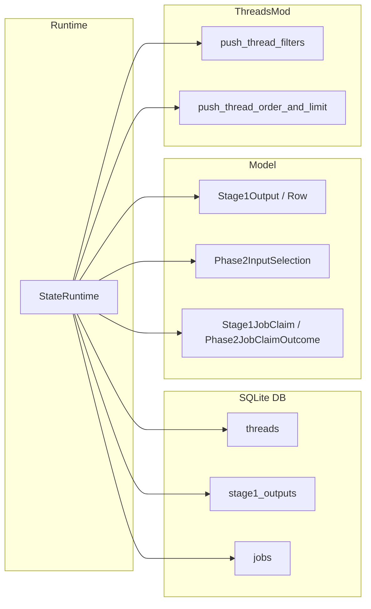
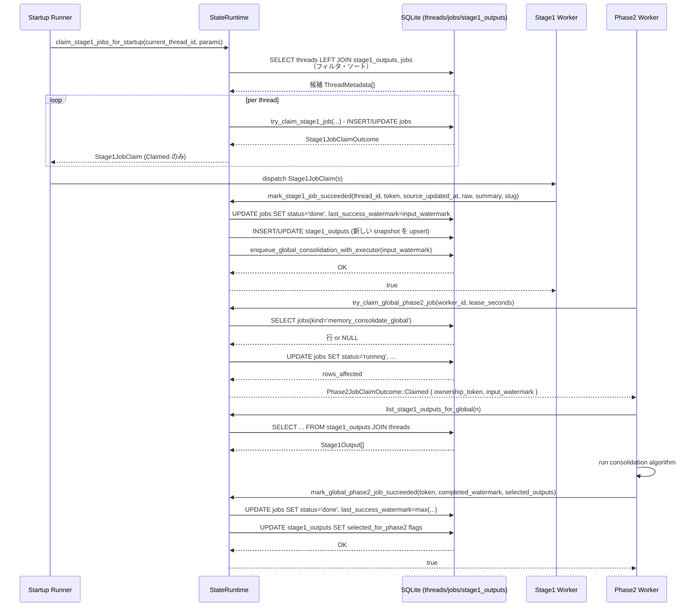

# state/src/runtime/memories.rs

## 0. ざっくり一言

`StateRuntime` に対して「スレッドごとのメモリ抽出（stage1）」と「グローバルなメモリ統合（phase2）」のジョブ管理・選択・クリーンアップを提供するモジュールです。  
SQLite の `jobs` / `stage1_outputs` / `threads` テーブルを使って、並行実行しても安全なジョブスケジューリングとスナップショット管理を行います。

> 注: このインターフェイスでは元ソースの行番号情報がないため、根拠は **関数名・クエリ内容レベル** で示します（実際の行番号は不明です）。

---

## 1. このモジュールの役割

### 1.1 概要

このモジュールは、次の 2 段階からなる「メモリ生成パイプライン」をデータベース上で管理します。

- **stage1（スレッド単位の抽出）**
  - 各 `thread` の履歴からメモリテキストを生成し、`stage1_outputs` に保存
  - ジョブ状態は `jobs(kind='memory_stage1')` で管理
- **phase2（グローバル統合）**
  - 有効な `stage1_outputs` のうち一部を選び、「グローバルメモリベースライン」として確定
  - ジョブ状態は `jobs(kind='memory_consolidate_global', job_key='global')` で管理

主な責務は次の通りです。

- 起動時などに、どのスレッドの stage1 を走らせるべきかを選択・クレームする
- stage1 ジョブ成功/失敗時に `jobs` と `stage1_outputs` を整合的に更新する
- phase2 グローバルジョブを「汚れ（dirty）」にして再実行をトリガーする
- phase2 ジョブのクレーム・成功/失敗の状態遷移を管理する
- 古い `stage1_outputs` を一定条件で削除する

### 1.2 アーキテクチャ内での位置づけ

このファイルにあるメソッドは、すべて `StateRuntime` の `impl` として定義されており、内部で SQLite コネクションプール (`self.pool`) を利用します。

関係モジュール／テーブルの概要は以下の通りです。

- `threads` テーブル: スレッドメタデータ (`id`, `updated_at`, `memory_mode`, `source`, など)
- `stage1_outputs` テーブル: 各スレッドから抽出されたメモリスナップショット
- `jobs` テーブル: stage1 / phase2 を含むさまざまなジョブの状態機械
- `crate::model`:
  - `Stage1JobClaim`, `Stage1JobClaimOutcome`
  - `Phase2JobClaimOutcome`
  - `Stage1Output`, `Stage1OutputRow`
  - `Phase2InputSelection`
  - `Stage1StartupClaimParams`
  - `ThreadRow`, `ThreadMetadata`, `stage1_output_ref_from_parts`
- `super::threads`:
  - `push_thread_filters`, `push_thread_order_and_limit` で `threads` のフィルタ・ソートを構築



### 1.3 設計上のポイント

- **ジョブ管理を DB に集中**
  - `jobs` テーブルの行が単一のジョブ（stage1: thread ごと、phase2: グローバル）を表現します。
  - `status`, `lease_until`, `retry_remaining`, `retry_at`, `input_watermark`, `last_success_watermark` などのフィールドで状態機械を構築しています。
- **並行性を SQL レベルで制御**
  - stage1: `INSERT ... ON CONFLICT ... DO UPDATE` と複雑な `WHERE` 条件で、「同時に 2 つ以上のランナーが同じジョブ or 実行上限を超えて走らない」ことを保証しています。
  - phase2: `BEGIN IMMEDIATE` トランザクション + `UPDATE ... WHERE ...` でグローバルジョブの排他制御を行います。
- **ウォーターマークベースの Up-to-date 判定**
  - `source_updated_at`（thread の更新時刻）と `last_success_watermark` を比較し、ジョブの Up-to-date / 再実行必要を決定します。
- **リトライ制御**
  - `retry_remaining` と `retry_at` により、失敗時のリトライ回数・バックオフを管理します。
  - 新しい `input_watermark` が入ってきた場合はリトライ回数をリセットします。
- **スナップショット選択の追跡**
  - `stage1_outputs.selected_for_phase2` と `selected_for_phase2_source_updated_at` で、「最後に成功した phase2 ベースラインに含まれるスナップショット」とその `source_updated_at` を記録し、次回の差分（追加 / 維持 / 削除）を取れるようにしています。

---

## 2. 主要な機能一覧

- メモリデータの全消去・再初期化
- stage1 ジョブのクレーム・成功・失敗処理
- 起動時向けの stage1 ジョブ一括スキャン・クレーム（スレッドの鮮度・アイドル時間・メモリモードによるフィルタ）
- `stage1_outputs` のリスト取得（phase2 用入力）
- `stage1_outputs` のリテンションポリシーに基づく削除
- phase2（グローバル統合）入力集合と前回ベースラインとの差分算出
- スレッドの `memory_mode` を `polluted` にする際の phase2 再実行トリガ
- phase2 グローバルジョブのクレーム・ハートビート・成功 / 失敗・失敗フォールバック処理
- stage1 出力の利用統計（usage_count / last_usage）の更新

---

## 3. 公開 API と詳細解説

### 3.1 型一覧（構造体・列挙体など）

このファイル自身は新しい公開型を定義していませんが、`StateRuntime` のメソッド公開 API として重要な関連型は以下です（すべて `crate::model` など他モジュールで定義）。

| 名前 | 種別 | 定義元 | 役割 / 用途 |
|------|------|--------|-------------|
| `StateRuntime` | 構造体 | `super` | アプリ全体の状態と DB プールを保持するランタイム。ここで多数のメモリ関連メソッドを実装。 |
| `ThreadId` | 構造体 | `codex_protocol` | スレッドの一意 ID。DB では文字列として保存・比較。 |
| `Stage1StartupClaimParams<'a>` | 構造体 | `crate::model` | `claim_stage1_jobs_for_startup` のスキャン条件（年齢・アイドル時間・制限数など）。 |
| `Stage1JobClaim` | 構造体 | `crate::model` | 成功した stage1 ジョブクレーム結果（`thread` メタデータと `ownership_token`）。 |
| `Stage1JobClaimOutcome` | 列挙体 | `crate::model` | `try_claim_stage1_job` の結果（`Claimed`, `SkippedUpToDate`, `SkippedRunning`, `SkippedRetryBackoff`, `SkippedRetryExhausted` など）。 |
| `Stage1OutputRow` | 構造体 | `crate::model` | `stage1_outputs` テーブルの SQL 行 → モデル変換用ラッパ。 |
| `Stage1Output` | 構造体 | `crate::model` | スレッドごとのメモリスナップショット（raw/summary/rollout 情報など）。 |
| `Phase2InputSelection` | 構造体 | `crate::model` | phase2 用入力集合と、前回ベースラインとの差分 (`selected`, `previous_selected`, `retained_thread_ids`, `removed`)。 |
| `Phase2JobClaimOutcome` | 列挙体 | `crate::model` | phase2 グローバルジョブのクレーム結果（`Claimed`, `SkippedNotDirty`, `SkippedRunning`）。 |

### 3.2 関数詳細（主要 7 件）

以下では特に重要な 7 関数について詳述します。

---

#### `claim_stage1_jobs_for_startup(&self, current_thread_id: ThreadId, params: Stage1StartupClaimParams<'_>) -> anyhow::Result<Vec<Stage1JobClaim>>`

**概要**

- 起動時などに「どのスレッドのメモリが古いか」を DB 上で検索し、そのスレッドに対する stage1 ジョブをクレームします。
- 返り値は、クレームに成功した `Stage1JobClaim` のベクタです。

**引数**

| 引数名 | 型 | 説明 |
|--------|----|------|
| `current_thread_id` | `ThreadId` | 現在この処理を実行しているスレッド ID（自分自身を対象から除外するために使用）。 |
| `params` | `Stage1StartupClaimParams<'_>` | スキャン条件（スキャン件数上限、クレーム上限、対象とするスレッドの年齢・アイドル時間、許可ソース、リース時間など）。 |

**戻り値**

- `Ok(Vec<Stage1JobClaim>)`: 実際にクレームできた stage1 ジョブ（スレッド + 所有トークン）の一覧。
- `Err(_)`: SQL エラーなど。`anyhow::Error` でラップされます。

**内部処理の流れ**

1. `scan_limit == 0` または `max_claimed == 0` の場合は即座に空ベクタを返却。
2. `max_age_cutoff` と `idle_cutoff` を現在時刻から計算 (`Utc::now() - Duration::days/hours`)。
3. `QueryBuilder<Sqlite>` で次の条件を持つ `SELECT ... FROM threads` クエリを組み立てる。
   - `push_thread_filters(...)` でアクティブなスレッド & 許可された `source` のみ。
   - `threads.memory_mode = 'enabled'` のみ。
   - `id != current_thread_id`（自分自身除外）。
   - `updated_at >= max_age_cutoff` かつ `updated_at <= idle_cutoff`（古すぎ/新しすぎを除外）。
   - `LEFT JOIN stage1_outputs` および `LEFT JOIN jobs(kind='memory_stage1')` を行い、
     - `COALESCE(stage1_outputs.source_updated_at, -1) < threads.updated_at`
     - `COALESCE(jobs.last_success_watermark, -1) < threads.updated_at`
     - を満たすスレッドのみ（メモリが古いスレッド）。
   - `push_thread_order_and_limit` で `updated_at DESC, id DESC` 順にし、`scan_limit` 適用。
4. 得られた `ThreadRow` を `ThreadMetadata` に変換。
5. 各スレッドについて、`try_claim_stage1_job` を呼び出す。
   - 成功して `Stage1JobClaimOutcome::Claimed { ownership_token }` の場合だけ `Stage1JobClaim` として `claimed` ベクタに追加。
   - すでに `claimed.len() >= max_claimed` ならループを打ち切り。
6. `claimed` を返却。

**Examples（使用例）**

```rust
// 起動時に、現在のスレッドから「メモリが古い他スレッド」の stage1 ジョブをクレームする例
let allowed_sources = vec!["cli".to_string()];
let claims = runtime
    .claim_stage1_jobs_for_startup(
        current_thread_id,
        Stage1StartupClaimParams {
            scan_limit: 500,                 // 候補スレッドを最大 500 件スキャン
            max_claimed: 32,                 // 実際にクレームするのは最大 32 ジョブ
            max_age_days: 30,                // 30 日より古いスレッドは対象外
            min_rollout_idle_hours: 12,      // 最後の更新から 12 時間以上アイドル
            allowed_sources: &allowed_sources,
            lease_seconds: 3600,             // 1 時間のリース
        },
    )
    .await?;
for claim in claims {
    // claim.thread: ThreadMetadata
    // claim.ownership_token: &str
    // → stage1 抽出処理を行い、成功後 mark_stage1_job_succeeded を呼ぶ
}
```

**Errors / Panics**

- DB 接続やクエリ構築の失敗で `Err(anyhow::Error)` を返す可能性があります。
- この関数内部では `panic!` は使用されていません。

**Edge cases（エッジケース）**

- `scan_limit == 0` または `max_claimed == 0` の場合は、DB にアクセスせずに `Ok(vec![])` を返します。
- すべてのスレッドが Up-to-date または `memory_mode != 'enabled'` の場合も `Ok(vec![])` です。
- `allowed_sources` に該当するスレッドがない場合も同様です。

**使用上の注意点**

- `max_running_jobs` 上限は `try_claim_stage1_job` 側でチェックされるため、`max_claimed` を大きくしても実際のクレーム数は制限されます。
- ここで返ってくる `Stage1JobClaim` は、**必ず対応する `mark_stage1_job_succeeded` / `_no_output` / `_failed` で完了させる必要**があります。そうしないとジョブが「走りっぱなし」の状態になります。

---

#### `try_claim_stage1_job(&self, thread_id: ThreadId, worker_id: ThreadId, source_updated_at: i64, lease_seconds: i64, max_running_jobs: usize) -> anyhow::Result<Stage1JobClaimOutcome>`

**概要**

- 特定スレッドの stage1 ジョブをクレームしようとします。
- すでに Up-to-date の場合や、リトライ制限などにより実行すべきでない場合には、詳細なスキップ理由を `Stage1JobClaimOutcome` で返します。

**引数**

| 引数名 | 型 | 説明 |
|--------|----|------|
| `thread_id` | `ThreadId` | 対象スレッド ID。 |
| `worker_id` | `ThreadId` | このジョブを実行しようとするワーカー（スレッド） ID。 `jobs.worker_id` に記録されます。 |
| `source_updated_at` | `i64` | このジョブが処理すべき入力の「ソース時刻」（通常は `threads.updated_at.timestamp()`）。 |
| `lease_seconds` | `i64` | ジョブが「走っている」とみなされるリース時間。 |
| `max_running_jobs` | `usize` | `memory_stage1` ジョブ全体の同時実行上限。 |

**戻り値**

- `Ok(Stage1JobClaimOutcome::Claimed { ownership_token })`  
  → ジョブのクレームに成功し、`ownership_token` を発行。
- `Ok(Stage1JobClaimOutcome::SkippedUpToDate)`  
  → すでに同等以上の `source_updated_at` で stage1 が完了している。
- `Ok(Stage1JobClaimOutcome::SkippedRunning)`  
  → 有効なリースを持つ実行中のジョブが存在する。
- `Ok(Stage1JobClaimOutcome::SkippedRetryBackoff)`  
  → 失敗後で `retry_at > now`（バックオフ期間中）。
- `Ok(Stage1JobClaimOutcome::SkippedRetryExhausted)`  
  → `retry_remaining <= 0` でリトライ上限に達している。
- `Err(_)`  
  → SQL エラーなど。

**内部処理の流れ**

1. `now` と `lease_until = now + max(0, lease_seconds)` を計算し、新しい `ownership_token` を生成。
2. `BEGIN IMMEDIATE` でトランザクション開始（SQLite に対する排他ロックを取りやすくするため）。
3. `stage1_outputs` を `thread_id` で検索。
   - `source_updated_at >= input source_updated_at` なら Up-to-date と判定し `SkippedUpToDate` を返して終了。
4. `jobs(kind='memory_stage1', job_key=thread_id)` を検索。
   - `last_success_watermark >= source_updated_at` なら Up-to-date と判定し `SkippedUpToDate`。
5. `INSERT INTO jobs (...) SELECT ... WHERE (global running jobs) < max_running_jobs`  
   `ON CONFLICT(kind, job_key) DO UPDATE SET ...` を実行。
   - INSERT 部分:
     - `status='running'`、`retry_remaining=DEFAULT_RETRY_REMAINING`、`input_watermark=source_updated_at` で新規作成。
     - ただし、`kind='memory_stage1' AND status='running' AND lease_until>now` の件数が `max_running_jobs` 未満のときのみ INSERT。
   - UPDATE 部分:
     - 既存ジョブが `status!='running' OR lease_expired` の場合にのみ `status='running'` に更新。
     - `retry_at` が `now` 以前、または `input_watermark` が増加した場合のみ更新を許可。
     - `retry_remaining>0` または `input_watermark` 増加でリトライをリセット。
     - グローバルに `kind='memory_stage1'` の running ジョブ数が `max_running_jobs` 未満であることもチェック。
6. `rows_affected > 0` の場合:
   - クレーム成功 → トランザクション commit → `Claimed { ownership_token }`。
7. `rows_affected == 0` の場合:
   - `jobs` 行を再度読み取り (`status`, `lease_until`, `retry_at`, `retry_remaining`) を確認。
   - `retry_remaining <= 0` → `SkippedRetryExhausted`
   - `retry_at > now` → `SkippedRetryBackoff`
   - `status='running' && lease_until>now` → `SkippedRunning`
   - それ以外 → 安全側で `SkippedRunning`

**Examples（使用例）**

```rust
// 単一スレッドの stage1 をクレームして実行するパターン
let outcome = runtime
    .try_claim_stage1_job(
        thread_id,
        worker_id,
        thread_updated_at.timestamp(),
        /*lease_seconds*/ 3600,
        /*max_running_jobs*/ 64,
    )
    .await?;

match outcome {
    Stage1JobClaimOutcome::Claimed { ownership_token } => {
        // 実際にメモリ抽出処理を行う
        let (raw_memory, summary) = run_stage1_extraction(&thread_id).await?;
        runtime
            .mark_stage1_job_succeeded(
                thread_id,
                &ownership_token,
                thread_updated_at.timestamp(),
                &raw_memory,
                &summary,
                None,
            )
            .await?;
    }
    Stage1JobClaimOutcome::SkippedUpToDate => {
        // 既に最新のメモリがあるので何もしない
    }
    Stage1JobClaimOutcome::SkippedRunning => {
        // 他ワーカーが処理中
    }
    Stage1JobClaimOutcome::SkippedRetryBackoff => {
        // バックオフ中 → 後で再トライ
    }
    Stage1JobClaimOutcome::SkippedRetryExhausted => {
        // 手動介入が必要な失敗として扱う
    }
}
```

**Errors / Panics**

- DB ロック競合 (`database is locked`) が起きうるため、テストではリトライロジック付きのヘルパを使っている箇所があります。
- 例外は `anyhow::Error` で呼び出し元に伝播されます。

**Edge cases**

- `lease_seconds <= 0` の場合でも `saturating_add` により現在時刻がそのまま `lease_until` になるか、それ以下にはなりません。
- `max_running_jobs` が非常に小さい（1 など）の場合、並行クレームはほとんど `SkippedRunning` になります（テスト `stage1_concurrent_claims_respect_running_cap` を参照）。
- 既に `retry_remaining == 0` であっても、`source_updated_at` が増加していればリトライがリセットされ、再度 `Claimed` されることがテスト `stage1_retry_exhaustion_does_not_block_newer_watermark` で確認されています。

**使用上の注意点**

- **戻り値の Outcome によって処理を分岐する前提**になっているので、`Claimed` 以外を無視すると無限ループや過剰なリトライにつながります。
- クレームに成功したら、**必ず** `mark_stage1_job_succeeded*` か `mark_stage1_job_failed` を呼んでジョブを終端させる必要があります。

---

#### `mark_stage1_job_succeeded(&self, thread_id: ThreadId, ownership_token: &str, source_updated_at: i64, raw_memory: &str, rollout_summary: &str, rollout_slug: Option<&str>) -> anyhow::Result<bool>`

**概要**

- クレーム済みの stage1 ジョブが成功したときに呼ばれます。
- `jobs` 行の状態を `done` にし、`stage1_outputs` に抽出結果を upsert、さらに phase2 グローバルジョブを「汚れ（dirty）」状態にします。

**引数**

| 引数名 | 型 | 説明 |
|--------|----|------|
| `thread_id` | `ThreadId` | 対象スレッド ID。 |
| `ownership_token` | `&str` | `try_claim_stage1_job` が返したトークン。所有権検証に使用。 |
| `source_updated_at` | `i64` | 抽出対象のソース時刻（thread の更新時刻）。 |
| `raw_memory` | `&str` | 生メモリテキスト。 |
| `rollout_summary` | `&str` | ロールアウトサマリ。 |
| `rollout_slug` | `Option<&str>` | ロールアウト識別に使うスラグ（ファイル名など）。 |

**戻り値**

- `Ok(true)`  : `jobs` 行が更新され、`stage1_outputs` が upsert された（トークンが有効だった）。
- `Ok(false)` : `jobs` の更新対象行が見つからなかった（すでに別のトークンで完了済みなど）。
- `Err(_)`    : DB エラーなど。

**内部処理の流れ**

1. トランザクション開始。
2. `jobs` を `kind='memory_stage1' AND job_key=thread_id AND status='running' AND ownership_token=?` で `UPDATE`。
   - `status='done'`, `finished_at=now`, `lease_until=NULL`, `last_error=NULL`, `last_success_watermark=input_watermark` を設定。
3. `rows_affected == 0` の場合:
   - トランザクション commit → `Ok(false)` を返却。
4. `rows_affected > 0` の場合:
   - `stage1_outputs` に `INSERT ... ON CONFLICT(thread_id) DO UPDATE` を実行。
   - 既存行があっても、`excluded.source_updated_at >= stage1_outputs.source_updated_at` のときのみ上書き（古いスナップショットでは上書きしない）。
5. `enqueue_global_consolidation_with_executor` を呼び、phase2 グローバルジョブの `input_watermark` を `source_updated_at` で進める。
6. トランザクション commit → `Ok(true)`。

**Examples（使用例）**

```rust
let outcome = runtime
    .try_claim_stage1_job(
        thread_id, worker_id,
        thread_updated_at.timestamp(),
        3600, 64,
    )
    .await?;

if let Stage1JobClaimOutcome::Claimed { ownership_token } = outcome {
    // メモリ抽出に成功したケース
    let raw = "memory text ...";
    let summary = "short summary ...";

    let succeeded = runtime
        .mark_stage1_job_succeeded(
            thread_id,
            &ownership_token,
            thread_updated_at.timestamp(),
            raw,
            summary,
            Some("rollout-123"),
        )
        .await?;

    if !succeeded {
        // 所有権を失っていたなど
    }
}
```

**Errors / Panics**

- SQL エラー発生時はトランザクション全体がロールバックされ、`Err(anyhow::Error)` を返します。

**Edge cases**

- `rollout_slug` が `None` の場合、`NULL` として挿入されます。
- すでに `source_updated_at` が同じか新しい `stage1_outputs` が存在する場合のみ更新されるため、古いジョブが遅れて成功しても新しいスナップショットを上書きしません。

**使用上の注意点**

- `try_claim_stage1_job` で得た `ownership_token` と同じものを必ず渡す必要があります。異なるトークンでは `rows_affected == 0` となり `false` が返ります。
- トランザクション内で phase2 ジョブの dirty 状態も更新されるため、複数の stage1 成功が重なっても phase2 は最大の `source_updated_at` を入力ウォーターマークとして認識します。

---

#### `mark_stage1_job_succeeded_no_output(&self, thread_id: ThreadId, ownership_token: &str) -> anyhow::Result<bool>`

**概要**

- stage1 実行は成功したが、有効なメモリ出力がなかった場合の完了処理です。
- `jobs` を `done` にし、既存の `stage1_outputs` を削除します。
- **既に `stage1_outputs` が存在した場合のみ** phase2 を dirty にします。

**引数 / 戻り値**

- 引数は `thread_id`, `ownership_token` のみで、戻り値は `Ok(true/false)` / `Err(_)` の意味は `mark_stage1_job_succeeded` と同様です。

**内部処理の流れ**

1. トランザクション開始。
2. `jobs` を `kind='memory_stage1' AND job_key=thread_id AND status='running' AND ownership_token=?` で `UPDATE`（内容は `mark_stage1_job_succeeded` と同じ）。
3. `rows_affected == 0` → commit → `Ok(false)`。
4. `jobs` から `input_watermark` を取得（この値を `source_updated_at` 相当として使用）。
5. `stage1_outputs` を `DELETE WHERE thread_id=?`。
6. `deleted_rows > 0` の場合のみ `enqueue_global_consolidation_with_executor` を呼び、`input_watermark` を phase2 に伝播。
7. commit → `Ok(true)`。

**Edge cases**

- もともと `stage1_outputs` が存在しなかった場合:
  - `deleted_rows == 0` となり、phase2 は dirty にはなりません（テスト `mark_stage1_job_succeeded_no_output_skips_phase2_when_output_was_already_absent`）。
  - ただし、このスレッドの `source_updated_at` に対しては `last_success_watermark` が更新されるので、同じ `source_updated_at` で再実行しようとすると `SkippedUpToDate` になります。

**使用上の注意点**

- 「出力なし」を表すために空文字列で `mark_stage1_job_succeeded` を呼ぶのではなく、こちらのメソッドを使う方針になっています。  
  `list_stage1_outputs_for_global` は空の raw/summary をフィルタするため、そもそも空出力行を残す意味がないからです。

---

#### `get_phase2_input_selection(&self, n: usize, max_unused_days: i64) -> anyhow::Result<Phase2InputSelection>`

**概要**

- 「今 phase2 を実行するとしたら、どの `stage1_outputs` を入力として使うか」と、その結果と「前回成功した phase2 ベースライン」との diff を計算します。
- 戻り値の `Phase2InputSelection` には:
  - `selected`: 現在の候補一覧
  - `previous_selected`: 前回ベースラインに含まれていたスナップショット
  - `retained_thread_ids`: 前回ベースラインのスナップショットのうち、**同じ `source_updated_at` で** 今回も選ばれたもの
  - `removed`: 前回ベースラインに含まれていたが今回は外れたもの（スレッドが現在非対象でも含む）

**引数**

| 引数名 | 型 | 説明 |
|--------|----|------|
| `n` | `usize` | 現在選択する最大件数（LIMIT）。0 の場合はデフォルト値（空の選択）を返す。 |
| `max_unused_days` | `i64` | 「未使用」期間の最大日数。これを超えて使われていないメモリは対象外。 |

**戻り値**

- `Ok(Phase2InputSelection)`:
  - 該当する `stage1_outputs` がなければ、各フィールドが空ベクタの値になります（`n=0` の場合は `Phase2InputSelection::default()` を返す）。
- `Err(_)`: SQL エラーなど。

**内部処理の流れ**

1. `n == 0` の場合は `Phase2InputSelection::default()` を返却。
2. `cutoff = now - Duration::days(max_unused_days.max(0))` を計算。
3. **現在の候補集合** (`current_rows`) をクエリ:
   - `FROM stage1_outputs AS so LEFT JOIN threads AS t ON t.id = so.thread_id`
   - 条件:
     - `t.memory_mode = 'enabled'`
     - `length(trim(so.raw_memory)) > 0 OR length(trim(so.rollout_summary)) > 0`
     - 次のどちらか:
       - `so.last_usage >= cutoff`（使用履歴が新しい）
       - `so.last_usage IS NULL AND so.source_updated_at >= cutoff`（使用されていないが生成時刻が新しい）
   - ORDER:
     - `COALESCE(so.usage_count, 0) DESC`
     - `COALESCE(so.last_usage, so.source_updated_at) DESC`
     - `so.source_updated_at DESC`
     - `so.thread_id DESC`
   - LIMIT `n`
   - 各行から `Stage1Output` を構築しつつ:
     - `current_thread_ids` セットを構築。
     - `selected_for_phase2 != 0` かつ `selected_for_phase2_source_updated_at == source_updated_at` の行の `thread_id` を `retained_thread_ids` に追加。
4. **前回ベースライン集合** (`previous_rows`) をクエリ:
   - `FROM stage1_outputs AS so LEFT JOIN threads AS t ON t.id = so.thread_id`
   - `WHERE so.selected_for_phase2 = 1`
   - ORDER: `source_updated_at DESC, thread_id DESC`
   - ここから `previous_selected: Vec<Stage1Output>` を構築。
5. `previous_rows` を再走査し、`current_thread_ids` に含まれない `thread_id` を `removed` に追加。
   - `stage1_output_ref_from_parts(thread_id, source_updated_at, rollout_slug)` で参照型を作成。
6. 以上 4 つのベクタから `Phase2InputSelection` を構築して返す。

**Examples（使用例）**

```rust
// phase2 実行前に、入力にすべきスナップショット集合を決定し、差分も確認する
let selection = runtime
    .get_phase2_input_selection(/*n*/ 100, /*max_unused_days*/ 30)
    .await?;

// selection.selected: 今回の入力候補（最大 100 件）
// selection.previous_selected: 前回ベースライン
// selection.retained_thread_ids: 前回からそのまま維持されたスナップショットの thread_id
// selection.removed: 前回ベースラインから外れたスナップショット
```

**Edge cases**

- `memory_mode != 'enabled'` のスレッドの出力は、現在の候補 (`selected`) からは除外されますが、`previous_selected` には残りうるため、「汚染された過去ベースライン」が `removed` として報告されます（テスト `get_phase2_input_selection_marks_polluted_previous_selection_as_removed`）。
- 同一スレッドで `source_updated_at` が更新された場合、前回ベースラインのスナップショットは `removed`、新しいスナップショットは `selected` に入り、`retained_thread_ids` には含まれません（テスト `get_phase2_input_selection_treats_regenerated_selected_rows_as_added`）。

**使用上の注意点**

- ここでの `selected` は **実際に phase2 で採用すべき最終集合** ではなく、「使用候補ランキング上位 n 件」です。実際のアルゴリズム側でさらにフィルタする可能性があります。
- `max_unused_days` を過度に大きくすると、非常に古くて一度も使われていないメモリも含まれることに注意してください。

---

#### `try_claim_global_phase2_job(&self, worker_id: ThreadId, lease_seconds: i64) -> anyhow::Result<Phase2JobClaimOutcome>`

**概要**

- グローバルな phase2 統合ジョブをクレームしようとします。
- 単一行 `jobs(kind='memory_consolidate_global', job_key='global')` を対象に、状態やウォーターマーク、リトライ条件を確認して `Claimed` / `SkippedNotDirty` / `SkippedRunning` を返します。

**引数**

| 引数名 | 型 | 説明 |
|--------|----|------|
| `worker_id` | `ThreadId` | phase2 を実行するワーカーの ID。 |
| `lease_seconds` | `i64` | グローバルジョブのリース時間。 |

**戻り値**

- `Ok(Phase2JobClaimOutcome::Claimed { ownership_token, input_watermark })`  
  → phase2 ジョブを実行すべき。`input_watermark` は処理すべき dirty 範囲の上限。
- `Ok(Phase2JobClaimOutcome::SkippedNotDirty)`  
  → `input_watermark <= last_success_watermark`、またはリトライ不可/バックオフ中などで実行不要。
- `Ok(Phase2JobClaimOutcome::SkippedRunning)`  
  → 有効なリースを持つ実行中のジョブが存在する。
- `Err(_)`  
  → DB エラーなど。

**内部処理の流れ**

1. トランザクション `BEGIN IMMEDIATE` で開始。
2. `jobs` から `kind='memory_consolidate_global' AND job_key='global'` の行を取得。
   - 行が存在しない場合 → commit → `SkippedNotDirty`。
3. `input_watermark`（`Option<i64>`）と `last_success_watermark`（`Option<i64>`）を取得。
   - `input_watermark.unwrap_or(0) <= last_success_watermark.unwrap_or(0)` の場合 → commit → `SkippedNotDirty`。
4. `status`, `lease_until`, `retry_at`, `retry_remaining` を確認。
   - `retry_remaining <= 0` → commit → `SkippedNotDirty`。
   - `retry_at > now` → commit → `SkippedNotDirty`。
   - `status='running' && lease_until>now` → commit → `SkippedRunning`。
5. 上記をすべて通過した場合:
   - `UPDATE jobs SET status='running', worker_id=?, ownership_token=?, started_at=now, finished_at=NULL, lease_until=?, retry_at=NULL, last_error=NULL WHERE ...` を実行。
   - 条件では再度 `input_watermark > COALESCE(last_success_watermark, 0)` と `lease` / `retry` 条件、`retry_remaining > 0` を確認。
6. `rows_affected == 0` → commit → `SkippedRunning`（他ランナーが先にクレームした等）。
7. `rows_affected > 0` → commit → `Claimed { ownership_token, input_watermark_value }`。

**使用上の注意点**

- `enqueue_global_consolidation*` により `jobs` 行がまだ作成されていない場合、この関数は `SkippedNotDirty` を返します。
- `lease_seconds` を短くしすぎると、実行時間が長い phase2 job が頻繁に「リース切れ」とみなされ、他ワーカーによる takeover の対象になります。

---

#### `mark_global_phase2_job_succeeded(&self, ownership_token: &str, completed_watermark: i64, selected_outputs: &[Stage1Output]) -> anyhow::Result<bool>`

**概要**

- クレーム済みの phase2 グローバルジョブが正常終了したあとに呼び出されます。
- `jobs` 行の状態を `done` にし、`last_success_watermark` を更新。
- `stage1_outputs` テーブルの `selected_for_phase2` と `selected_for_phase2_source_updated_at` を、**引数 `selected_outputs` に一致するスナップショットだけが `1` になるように書き換えます。**

**引数**

| 引数名 | 型 | 説明 |
|--------|----|------|
| `ownership_token` | `&str` | `try_claim_global_phase2_job` が返したトークン。 |
| `completed_watermark` | `i64` | この phase2 実行で処理し終えた `input_watermark` の上限。 |
| `selected_outputs` | `&[Stage1Output]` | 今回のベースラインに含めるスナップショット群。 |

**戻り値**

- `Ok(true)`  : 正しく `jobs` 行が更新され、スナップショット選択が書き換えられた。
- `Ok(false)` : `jobs` 行が見つからない / 所有トークン不一致などで更新できなかった。
- `Err(_)`    : DB エラー。

**内部処理の流れ**

1. トランザクション開始。
2. `jobs` を `kind='memory_consolidate_global' AND job_key='global' AND status='running' AND ownership_token=?` で `UPDATE`。
   - `status='done'`, `finished_at=now`, `lease_until=NULL`, `last_error=NULL`,
   - `last_success_watermark = max(COALESCE(last_success_watermark, 0), completed_watermark)`。
3. `rows_affected == 0` → commit → `Ok(false)`。
4. `stage1_outputs` に対し:
   - 全行の `selected_for_phase2=0`, `selected_for_phase2_source_updated_at=NULL` にリセット（`WHERE selected_for_phase2 != 0 OR selected_for_phase2_source_updated_at IS NOT NULL`）。
5. `selected_outputs` の各要素について:
   - `UPDATE stage1_outputs SET selected_for_phase2=1, selected_for_phase2_source_updated_at=? WHERE thread_id=? AND source_updated_at=?` を実行。
   - これにより、「**今回選ばれたスナップショットの `source_updated_at`**」がスナップショット時刻として保存される。
6. commit → `Ok(true)`。

**Edge cases**

- `selected_outputs` が空でも、前回の選択はすべてクリアされます（テスト `mark_stage1_job_succeeded_no_output_enqueues_phase2_when_deleting_output` などで再選択の挙動が検証されています）。
- `selected_outputs` の中に、`source_updated_at` が現在の `stage1_outputs` の `source_updated_at` と異なる行を渡すと、その行にはマークが付きません（テスト `mark_global_phase2_job_succeeded_only_marks_exact_selected_snapshots`）。

**使用上の注意点**

- `selected_outputs` には、**直前に `list_stage1_outputs_for_global` などで得た「現在の」スナップショット**を渡す必要があります。古いスナップショットをそのまま渡すと、期待どおりに `selected_for_phase2` が付与されません。
- `completed_watermark` は、実際に処理し終えた `input_watermark` を表す必要があります。小さすぎる値を渡すと、後続の `try_claim_global_phase2_job` が `SkippedNotDirty` を返さなくなる可能性があります。

---

#### `prune_stage1_outputs_for_retention(&self, max_unused_days: i64, limit: usize) -> anyhow::Result<usize>`

**概要**

- リテンションポリシーに基づき、古くて使われていない stage1 出力を削除します。
- `selected_for_phase2 = 0` の行だけを対象とし、`COALESCE(last_usage, source_updated_at)` が一定より古いものから `limit` 件まで削除します。

**引数 / 戻り値**

| 引数名 | 型 | 説明 |
|--------|----|------|
| `max_unused_days` | `i64` | 「使用されていない」とみなす日数の閾値。 |
| `limit` | `usize` | 一度に削除する最大行数。0 の場合は何もせず 0 を返す。 |

- 戻り値: 実際に削除された行数。

**使用上の注意点**

- `jobs` テーブルには一切触れないため、ジョブの `last_success_watermark` には影響しません（テストで削除前後の jobs 行数が変わらないことを検証）。
- `selected_for_phase2=1` の行は削除対象外なので、ベースラインに含まれるスナップショットは保護されます。

---

### 3.3 その他の関数（概要一覧）

| 関数名 | 役割（1 行） |
|--------|--------------|
| `clear_memory_data(&self)` | `stage1_outputs` とメモリ関連の `jobs` 行をすべて削除するユーティリティ。 |
| `reset_memory_data_for_fresh_start(&self)` | `clear_memory_data_inner(true)` を呼び出し、既存スレッドの `memory_mode` を `disabled` にリセット。 |
| `clear_memory_data_inner(&self, disable_existing_threads: bool)` | メモリ関連テーブルの削除と `threads.memory_mode` 更新を 1 トランザクションで行う内部関数。 |
| `record_stage1_output_usage(&self, thread_ids: &[ThreadId])` | 指定スレッド ID 群について `usage_count++` と `last_usage=now` を更新。 |
| `list_stage1_outputs_for_global(&self, n: usize)` | `threads.memory_mode='enabled'` かつ raw/summary が非空の `stage1_outputs` を新しい順に `n` 件返す。 |
| `mark_thread_memory_mode_polluted(&self, thread_id: ThreadId)` | スレッドの `memory_mode` を `polluted` にし、それが前回ベースラインに含まれていれば phase2 ジョブを dirty にする。 |
| `mark_stage1_job_failed(&self, thread_id, ownership_token, failure_reason, retry_delay_seconds)` | stage1 ジョブを `status='error'` にし、`retry_remaining--`, `retry_at=now+delay` を設定。 |
| `enqueue_global_consolidation(&self, input_watermark: i64)` | 公開 API。内部で `enqueue_global_consolidation_with_executor(self.pool.as_ref(), input_watermark)` を呼ぶ。 |
| `heartbeat_global_phase2_job(&self, ownership_token: &str, lease_seconds: i64)` | 所有者トークン一致かつ `status='running'` のグローバルジョブの `lease_until` を延長。 |
| `mark_global_phase2_job_failed(&self, ownership_token, failure_reason, retry_delay_seconds)` | 厳格な所有トークンチェック付きで phase2 ジョブを `status='error'` にし、リトライ情報を更新。 |
| `mark_global_phase2_job_failed_if_unowned(&self, ownership_token, failure_reason, retry_delay_seconds)` | 所有トークン不一致または `NULL` の場合も含めてエラー更新するフォールバック。 |
| `enqueue_global_consolidation_with_executor<E: Executor<Database=Sqlite>>(executor, input_watermark)` | 任意の `sqlx::Executor` 上で phase2 グローバルジョブを upsert し、dirty ウォーターマークを進める内部関数。 |

---

## 4. データフロー

### 4.1 代表的シナリオ: stage1 → phase2 の流れ

ここでは「スレッドのメモリが古くなったときに、stage1 を実行し、その結果をもとに phase2 を実行する」までのデータフローを図で示します。



要点:

- stage1 完了時は、`jobs` と `stage1_outputs` の更新と同時に **phase2 の dirty ウォーターマーク** を進めます。
- phase2 ジョブは常に **単一行の jobs エントリ** を対象とし、`input_watermark` と `last_success_watermark` の差で「未処理の更新があるか」を判定します。

---

## 5. 使い方（How to Use）

### 5.1 基本的な使用方法

ここでは、高レベルに「スレッド 1 本分の stage1 / phase2 フロー」を構成する例を示します。

```rust
use codex_protocol::ThreadId;
use crate::state::runtime::StateRuntime;
use crate::model::{Stage1JobClaimOutcome, Phase2JobClaimOutcome};

// 初期化（定義は別ファイル）
let codex_home = std::path::PathBuf::from("/path/to/codex_home");
let runtime = StateRuntime::init(codex_home.clone(), "provider".to_string()).await?;

// 例: 単一スレッドの stage1 を実行し、その後 phase2 を走らせる
let thread_id = ThreadId::new();
let worker_id = ThreadId::new();

// 1. stage1 ジョブをクレーム
let outcome = runtime
    .try_claim_stage1_job(
        thread_id,
        worker_id,
        /*source_updated_at*/ 1234567890, // threads.updated_at.timestamp() など
        /*lease_seconds*/ 3600,
        /*max_running_jobs*/ 64,
    )
    .await?;

if let Stage1JobClaimOutcome::Claimed { ownership_token } = outcome {
    // 2. 実際のメモリ抽出処理
    let raw_memory = "extracted memory ...";
    let summary = "short summary ...";

    // 3. 成功としてマーク（出力あり）
    runtime
        .mark_stage1_job_succeeded(
            thread_id,
            &ownership_token,
            1234567890,
            raw_memory,
            summary,
            None,
        )
        .await?;
}

// 4. グローバル phase2 をクレーム
let phase2_outcome = runtime
    .try_claim_global_phase2_job(worker_id, /*lease_seconds*/ 3600)
    .await?;

if let Phase2JobClaimOutcome::Claimed {
    ownership_token,
    input_watermark,
} = phase2_outcome
{
    // 5. phase2 入力候補を取得
    let candidates = runtime.list_stage1_outputs_for_global(100).await?;

    // ここでアプリケーション固有の統合ロジックを実行し、採用する outputs を選ぶ
    let selected = candidates; // 例: 全件採用

    // 6. 成功としてマーク
    runtime
        .mark_global_phase2_job_succeeded(
            &ownership_token,
            input_watermark,
            &selected,
        )
        .await?;
}
```

### 5.2 よくある使用パターン

- **起動時のバッチ stage1 処理**
  - `claim_stage1_jobs_for_startup` で複数スレッド分の stage1 をまとめてクレームし、ワーカーに振り分ける。
- **専用 phase2 ランナー**
  - 別タスク/プロセスで `loop { try_claim_global_phase2_job → 実行 → mark_* }` を繰り返す。
  - `Phase2JobClaimOutcome::SkippedNotDirty` の場合はしばらくスリープ。

### 5.3 よくある間違い

```rust
// 間違い例: Claim 結果を無視して常に stage1 を実行してしまう
let outcome = runtime
    .try_claim_stage1_job(thread_id, worker_id, ts, 3600, 64)
    .await?;
let raw_memory = run_stage1_extraction(&thread_id).await?;
runtime
    .mark_stage1_job_succeeded(thread_id, "dummy-token", ts, &raw_memory, "summary", None)
    .await?;
```

- 問題点:
  - `Claimed` 以外の Outcome（`SkippedUpToDate` 等）でも処理してしまう。
  - 実際の `ownership_token` ではなく `"dummy-token"` を渡しているため、`rows_affected == 0` となり完了処理が行われない。

```rust
// 正しい例: Outcome を判定し、トークンを正しく渡す
if let Stage1JobClaimOutcome::Claimed { ownership_token } =
    runtime
        .try_claim_stage1_job(thread_id, worker_id, ts, 3600, 64)
        .await?
{
    let raw_memory = run_stage1_extraction(&thread_id).await?;
    runtime
        .mark_stage1_job_succeeded(
            thread_id,
            &ownership_token,
            ts,
            &raw_memory,
            "summary",
            None,
        )
        .await?;
}
```

### 5.4 使用上の注意点（まとめ）

- **所有トークンの扱い**
  - `try_claim_*` が返す `ownership_token` は、**そのジョブのライフサイクルに一意**です。このトークンを使ってのみ成功/失敗処理が行えるようになっており、レースコンディションを防いでいます。
- **リース時間 (`lease_until`)**
  - 実行時間がリースを超えると、他ワーカーがジョブを再クレームできるようになります。長時間処理を行う場合は、`heartbeat_global_phase2_job` のような仕組みが有効です（phase2 にのみ実装）。
- **エラー処理**
  - エラー時は `mark_*_failed` を呼ぶことでリトライ回数やバックオフが適切に更新されます。これを呼ばないとジョブが `running` のまま残る可能性があります。
- **並行実行**
  - stage1/phase2 とも、複数プロセス・複数ノードから同じ DB を叩くことを前提としています。SQL の `ON CONFLICT`・`BEGIN IMMEDIATE` によるロック制御があるため、アプリ側での明示的なロックは不要ですが、`database is locked` エラー発生時にはリトライが必要になることがあります（テストではリトライの例があります）。

---

## 6. 変更の仕方（How to Modify）

### 6.1 新しい機能を追加する場合

例: 新しいメモリパイプライン段階やジョブ種別を追加したい場合。

1. **jobs テーブルのスキーマ確認**
   - 既存の `kind='memory_stage1'` / `'memory_consolidate_global'` の扱いを参考に、新しい `kind` 名を決めます。
2. **新ジョブ用のクレーム関数を設計**
   - `try_claim_stage1_job` / `try_claim_global_phase2_job` の実装パターン（ウォーターマーク、リース、リトライ）を参考に、新種別用の `try_claim_*` を実装します。
3. **成功/失敗マーク関数**
   - `mark_stage1_job_succeeded` / `_failed` / phase2 系の関数と同じく、`jobs` の状態遷移を 1 トランザクション内で行う関数を追加します。
4. **入力選択ロジック**
   - 必要であれば、`get_phase2_input_selection` のような入力集合・差分計算ロジックを新たなテーブル / フラグで実装します。
5. **テストを追加**
   - 本ファイルのテストに倣って、Up-to-date 判定、並行クレーム、リトライ・バックオフなどの振る舞いを検証するテストを書きます。

### 6.2 既存の機能を変更する場合

- **影響範囲の確認**
  - 関連テーブル:
    - `jobs`
    - `stage1_outputs`
    - `threads`
  - 関連メソッド:
    - stage1: `try_claim_stage1_job`, `mark_stage1_job_succeeded*`, `mark_stage1_job_failed`, `claim_stage1_jobs_for_startup`
    - phase2: `enqueue_global_consolidation*`, `try_claim_global_phase2_job`, `mark_global_phase2_job_*`, `get_phase2_input_selection`
- **契約 (前提条件)**
  - `try_claim_*` は `mark_*` とペアで使われる前提です。`ownership_token` の使われ方を崩さないことが重要です。
  - `get_phase2_input_selection` は、`mark_global_phase2_job_succeeded` が更新した `selected_for_phase2` / `selected_for_phase2_source_updated_at` を前提に差分を計算しています。
- **テスト**
  - 同名のテスト関数が多数存在し、それぞれ特定シナリオ（リトライ尽き、polluted スレッド、グローバルロックの乗っ取り等）を検証しています。ロジックを変更した場合はこれらテストを更新・追加する必要があります。

---

## 7. 関連ファイル

| パス | 役割 / 関係 |
|------|------------|
| `state/src/runtime/mod.rs`（推定） | `StateRuntime` 本体や `self.pool` の定義。ここでこのファイルの `impl StateRuntime` がまとめられていると考えられます。 |
| `state/src/runtime/threads.rs` | `push_thread_filters`, `push_thread_order_and_limit` を提供し、`claim_stage1_jobs_for_startup` のスレッド選択クエリ構築で利用されます。 |
| `state/src/runtime/test_support.rs` | テスト用の `test_thread_metadata`, `unique_temp_dir` を提供しており、メモリ関連の挙動テストで使用されています。 |
| `crate::model` 一式 | `Stage1JobClaimOutcome`, `Phase2JobClaimOutcome`, `Stage1Output`, `Phase2InputSelection` など、このファイルの API で使われるドメインモデルを定義。 |
| `codex_protocol::ThreadId` | スレッド ID 型。DB では文字列として保存され、本ファイル中でも `to_string()` / `from_string` で変換しています。 |

---

## Bugs / Security / Contracts / Tests / Performance の補足

※ 見出し名としては分けませんが、重要な観点を簡潔にまとめます。

- **既知のバグ挙動はコードからは読み取れません**。テスト群はかなり包括的で、特に以下を検証しています。
  - stage1/phase2 クレームの Up-to-date 判定
  - リース切れによるジョブ乗っ取り
  - グローバル同時実行上限 (`max_running_jobs`) の順守
  - リトライ枯渇と新ウォーターマークによるリセット
  - `memory_mode='polluted'` スレッドの扱い
  - `selected_for_phase2` フラグとスナップショット時刻の整合性
- **セキュリティ観点**
  - SQL 文はすべて `?` パラメータバインドで値を渡しており、明示的な文字列連結による SQL インジェクションの痕跡はありません（`QueryBuilder` に渡しているパラメータも `push_bind` を使っています）。
  - `ownership_token` は UUID 文字列で、ジョブの所有権チェックに使われます。これはジョブ奪取を防ぐための「秘密トークン」として機能します。
- **契約 / エッジケース**
  - `lease_seconds` や `max_unused_days` に 0 や負数を渡しても `max(0, ...)` / `saturating_add` により妥当な値に正規化されています。
  - `n == 0` 系の関数（`get_phase2_input_selection`, `list_stage1_outputs_for_global`, `prune_stage1_outputs_for_retention`）は必ず「即座に空結果を返す」分岐を持っています。
- **パフォーマンス / スケーラビリティ**
  - stage1 クレームは `jobs` テーブルへの `INSERT ... ON CONFLICT ... DO UPDATE` をキーにしています。`jobs(kind='memory_stage1')` に適切なインデックスがあることが前提です（スキーマはこのチャンクにはありません）。
  - `claim_stage1_jobs_for_startup` は `scan_limit` / `max_claimed` / `max_running_jobs` により負荷を管理します。
  - `record_stage1_output_usage` はスレッド数分ループで `UPDATE` していますが、1 回あたりの呼び出しで扱う ID 数はテストを見る限り小規模であることが想定されています。

このモジュールは、Rust の所有権と非同期 (`async` / `await`) の仕組みを利用しつつ、**DB レベルでの整合性と並行性を重視したジョブ管理**を行う部分と理解できます。
