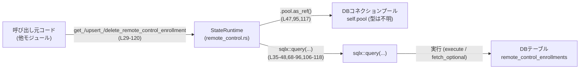
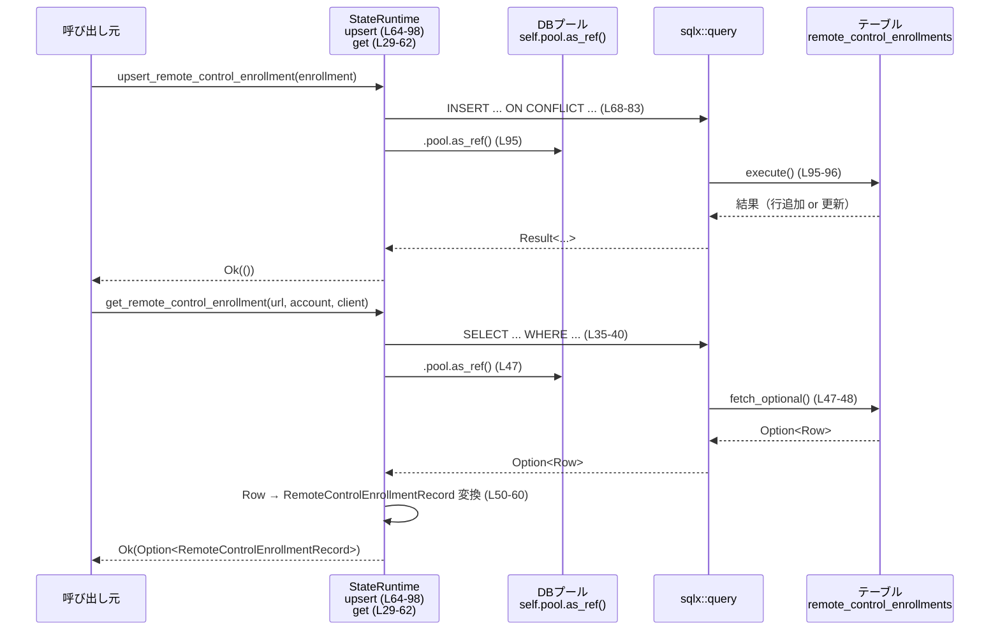

# state/src/runtime/remote_control.rs コード解説

## 0. ざっくり一言

リモートコントロール用サーバーの「登録情報（enrollment）」を、SQLite などのデータベース上の `remote_control_enrollments` テーブルに保存・取得・削除するための、`StateRuntime` 上の非同期 API を提供するモジュールです（`RemoteControlEnrollmentRecord` の永続化と検索キーの扱いを含みます）。

---

## 1. このモジュールの役割

### 1.1 概要

- このモジュールは、**リモートコントロールサーバーの登録状態を永続化して管理する**ために存在します。
- `websocket_url` / `account_id` / `app_server_client_name` の組をキーとして、対応する `server_id` / `environment_id` / `server_name` を保存・更新・取得・削除する機能を提供します（`get_remote_control_enrollment`, `upsert_remote_control_enrollment`, `delete_remote_control_enrollment`、`L29-120`）。
- `Option<String>` で表現される `app_server_client_name` を、DB 上では空文字列で表現するためのマッピング関数も含みます（`remote_control_app_server_client_name_key`, `app_server_client_name_from_key`, `L16-26`）。

### 1.2 アーキテクチャ内での位置づけ

このファイル単体から読み取れる関係を簡略化して図示します。



- `StateRuntime` 自体はこのファイルでは定義されておらず、`super::*` からインポートされています（`L1`）。
- データベースアクセスは `sqlx::query` を通じて行われ、接続プールは `self.pool.as_ref()` 経由で利用されます（`L47, L95, L117`）。
- テストでは `StateRuntime::init` や `test_support::unique_temp_dir` が使われており、ランタイムの初期化や一時ディレクトリの作成は他モジュールに委ねられています（`L132-135, L209-212`）。

### 1.3 設計上のポイント

- **責務の分離**
  - このモジュールは「リモートコントロール登録」の保存・取得・削除という限定された責務に特化し、DB 初期化や接続プールの管理は `StateRuntime` や `test_support` に任せています（`L28`, `L132-135`）。
- **状態の扱い**
  - 永続化される実体は `RemoteControlEnrollmentRecord` 構造体ひとつです（`L7-13`）。
  - 登録の有無を `Option<RemoteControlEnrollmentRecord>` として扱い、「存在しない」ケースを明示的に表現しています（`get_remote_control_enrollment` の戻り値, `L34`）。
- **エラーハンドリング**
  - 公開メソッドはすべて `anyhow::Result` を返し、`sqlx` のエラーや内部処理のエラーを `?` 演算子でそのまま伝播させる方針です（`L34, L67, L105`）。
- **非同期処理**
  - すべての DB 操作用公開メソッドは `async fn` として定義され、`sqlx` の非同期 API (`fetch_optional`, `execute`) を利用しています（`L29, L64, L100`）。
- **NULL の代わりに空文字列を使用**
  - `Option<String>` で表現される `app_server_client_name` を、DB では空文字列で保存・検索する設計になっています（`L16-26, L44-45, L88-90, L114-115`）。

---

## 2. 主要な機能一覧

- リモートコントロール登録レコードの定義: `RemoteControlEnrollmentRecord` 構造体（`L7-13`）
- `app_server_client_name` の `Option<String>` と DB 表現（空文字列）の相互変換
  - `remote_control_app_server_client_name_key`（`L16-18`）
  - `app_server_client_name_from_key`（`L20-25`）
- リモートコントロール登録の取得: `StateRuntime::get_remote_control_enrollment`（`L29-62`）
- リモートコントロール登録の挿入または更新（UPSERT）: `StateRuntime::upsert_remote_control_enrollment`（`L64-98`）
- リモートコントロール登録の削除: `StateRuntime::delete_remote_control_enrollment`（`L100-120`）
- 動作検証用の非同期テスト 2 件（`L130-205`, `L207-282`）

---

## 3. 公開 API と詳細解説

### 3.1 型一覧（構造体・列挙体など）

| 名前 | 種別 | 役割 / 用途 | 定義位置 |
|------|------|-------------|----------|
| `RemoteControlEnrollmentRecord` | 構造体 | リモートコントロールサーバー登録の 1 レコードを表す。DB テーブル `remote_control_enrollments` の行と 1:1 対応。 | `remote_control.rs:L7-13` |

**`RemoteControlEnrollmentRecord` のフィールド**

- `websocket_url: String` – 対象リモートコントロールサーバーの WebSocket URL（`L8`）
- `account_id: String` – アカウント ID（`L9`）
- `app_server_client_name: Option<String>` – クライアント種別名。デスクトップクライアントなど。`None` は「クライアント名なし」を表す（`L10`）。
- `server_id: String` – リモートコントロール対象となるサーバーの ID（`L11`）
- `environment_id: String` – サーバーが属する環境 ID（`L12`）
- `server_name: String` – サーバーの表示名（`L13`）

### 3.1 補助コンポーネント一覧（関数・テストを含む）

| 名前 | 種別 | 公開/非公開 | 役割 | 定義位置 |
|------|------|-------------|------|----------|
| `REMOTE_CONTROL_APP_SERVER_CLIENT_NAME_NONE` | 定数 `&'static str` | 非公開 | `app_server_client_name` が `None` の場合に DB 上で使用する空文字列のキー | `remote_control.rs:L3` |
| `remote_control_app_server_client_name_key` | 関数 | 非公開 | `Option<&str>` を DB 検索・保存用の `&str`（空文字列を含む）に変換 | `remote_control.rs:L16-18` |
| `app_server_client_name_from_key` | 関数 | 非公開 | DB から取得した `String` を `Option<String>` に変換（空文字列→`None`） | `remote_control.rs:L20-25` |
| `StateRuntime::get_remote_control_enrollment` | メソッド（async） | 公開 | キーに一致する登録レコードを 0 または 1 件取得 | `remote_control.rs:L29-62` |
| `StateRuntime::upsert_remote_control_enrollment` | メソッド（async） | 公開 | 登録レコードの挿入または更新（UPSERT） | `remote_control.rs:L64-98` |
| `StateRuntime::delete_remote_control_enrollment` | メソッド（async） | 公開 | キーに一致する登録レコードを削除し、削除件数を返す | `remote_control.rs:L100-120` |
| `remote_control_enrollment_round_trips_by_target_and_account` | テスト関数（async） | 非公開 | 同じ `websocket_url` かつ `app_server_client_name` だが異なる `account_id` の 2 レコードが正しく区別されることを検証 | `remote_control.rs:L130-205` |
| `delete_remote_control_enrollment_removes_only_matching_entry` | テスト関数（async） | 非公開 | `delete_remote_control_enrollment` が指定キーにのみ作用することを検証 | `remote_control.rs:L207-282` |

---

### 3.2 関数詳細（重要な 5 件）

#### `remote_control_app_server_client_name_key(app_server_client_name: Option<&str>) -> &str`

**概要**

- `Option<&str>` で表現された `app_server_client_name` を、DB で検索・保存に使う生の文字列キーに変換します（`L16-18`）。
- `None` や `Some("")` の場合は空文字列 `""` を返します。

**引数**

| 引数名 | 型 | 説明 |
|--------|----|------|
| `app_server_client_name` | `Option<&str>` | クライアント名の参照。`None` は「クライアント名なし」を表す。 |

**戻り値**

- `&str` – DB で使用するキー。`Some(s)` なら `s`、`None` または `Some("")` なら `""`（`L17`）。

**内部処理の流れ**

1. `app_server_client_name.unwrap_or(REMOTE_CONTROL_APP_SERVER_CLIENT_NAME_NONE)` を実行（`L17`）。
2. `REMOTE_CONTROL_APP_SERVER_CLIENT_NAME_NONE` は `""` で定義されている（`L3`）。

**Edge cases（エッジケース）**

- `app_server_client_name == None` → `""` を返す。
- `app_server_client_name == Some("")` → 依然として `""` を返す。
  - そのため、**`Some("")` と `None` は DB キー上で区別されません**。

**使用上の注意点**

- 「空文字列」という意味を持つクライアント名を区別したい場合、この関数を通すと `None` と区別できなくなります。そのようなニーズがある場合は仕様や DB 表現の見直しが必要です。

---

#### `app_server_client_name_from_key(app_server_client_name: String) -> Option<String>`

**概要**

- DB から取得した `app_server_client_name` の文字列を、アプリ側の `Option<String>` に変換します（`L20-25`）。
- 空文字列は `None` と解釈されます。

**引数**

| 引数名 | 型 | 説明 |
|--------|----|------|
| `app_server_client_name` | `String` | DB から取得したクライアント名。空文字列の場合、`None` を表す。 |

**戻り値**

- `Option<String>` – 空文字列なら `None`、それ以外は `Some(app_server_client_name)`。

**内部処理の流れ**

1. `if app_server_client_name.is_empty()` で空文字列かを判定（`L21`）。
2. 空なら `None` を返却（`L22`）。
3. それ以外は `Some(app_server_client_name)` を返却（`L24`）。

**Edge cases**

- 空文字列 `""` → `None` に変換される。
- 空白のみ `" "` のような文字列 → 非空と判定されるため `Some(" ")` になる。

**使用上の注意点**

- DB 側に `NULL` が入ることは想定していません。コード上では `String` で受けており、`NULL` が返るケースは考慮されていません（`L21`）。DB スキーマ側で `NOT NULL DEFAULT ''` などの制約がある前提と思われますが、このチャンクからは断定できません。

---

#### `StateRuntime::get_remote_control_enrollment(...)`

```rust
pub async fn get_remote_control_enrollment(
    &self,
    websocket_url: &str,
    account_id: &str,
    app_server_client_name: Option<&str>,
) -> anyhow::Result<Option<RemoteControlEnrollmentRecord>>
```

（`remote_control.rs:L29-62`）

**概要**

- 指定された `websocket_url` / `account_id` / `app_server_client_name` に一致するリモートコントロール登録レコードを 1 件取得します。
- レコードが存在しない場合は `Ok(None)` を返します（`fetch_optional`, `L47-48`）。

**引数**

| 引数名 | 型 | 説明 |
|--------|----|------|
| `websocket_url` | `&str` | 対象リモートコントロールサーバーの WebSocket URL（`L31`）。 |
| `account_id` | `&str` | アカウント ID（`L32`）。 |
| `app_server_client_name` | `Option<&str>` | クライアント名。`None` の場合は「クライアント名なし」で検索（`L33`）。 |

**戻り値**

- `anyhow::Result<Option<RemoteControlEnrollmentRecord>>`
  - `Ok(Some(record))` – 該当レコードが存在する場合。
  - `Ok(None)` – 該当レコードが存在しない場合。
  - `Err(e)` – DB エラーなどが発生した場合。

**内部処理の流れ**

1. `sqlx::query` で SELECT 文を構築（`L35-40`）。
2. `websocket_url`, `account_id`, `remote_control_app_server_client_name_key(app_server_client_name)` を順に `bind` する（`L42-46`）。
   - `app_server_client_name` は `Option<&str>` から空文字列を含むキーに変換されます（`L44-45`, `L16-18`）。
3. `fetch_optional(self.pool.as_ref()).await` で 0 または 1 行を取得（`L47-48`）。
4. `row.map(|row| { ... })` で `Option<Row>` を `Option<Result<RemoteControlEnrollmentRecord>>` に変換（`L50-60`）。
   - `row.try_get("...")?` により各カラムから値を取得（`L51-58`）。
   - `app_server_client_name` は `String` として取得後、`app_server_client_name_from_key` で `Option<String>` に変換（`L51, L55`）。
5. `.transpose()` で `Result<Option<RemoteControlEnrollmentRecord>>` に変換し、呼び出し元に返却（`L61`）。

**Examples（使用例）**

以下は、登録済みのレコードを取得する単純な例です（テスト `remote_control_enrollment_round_trips_by_target_and_account` を簡略化、`L162-180`）。

```rust
// 非同期コンテキスト内を想定
let record = runtime
    .get_remote_control_enrollment(
        "wss://example.com/backend-api/wham/remote/control/server", // websocket_url
        "account-a",                                                // account_id
        Some("desktop-client"),                                     // app_server_client_name
    )
    .await?; // anyhow::Result を ? で展開

if let Some(enrollment) = record {
    // enrollment は RemoteControlEnrollmentRecord
    println!("Server name = {}", enrollment.server_name);
} else {
    println!("Enrollment not found");
}
```

**Errors / Panics**

- `?` 演算子で伝播している可能性のあるエラー（`L48, L51-58`）:
  - DB アクセス中のエラー（接続エラー、SQL 実行エラーなど）。
  - `row.try_get("...")` での取得時のエラー（カラム名の不一致、型変換失敗など）。
- この関数内で `panic!` や `unwrap` は使用していません。

**Edge cases**

- 該当行が存在しない場合:
  - `fetch_optional` が `None` を返し、そのまま `Ok(None)` が返却されます（`L50-61`）。
- `app_server_client_name == None`:
  - SQL パラメータには空文字列 `""` がバインドされます（`L44-45, L16-18`）。
- DB に `app_server_client_name` が空文字列で保存されている場合:
  - `app_server_client_name_from_key` により `None` として復元されます（`L51, L55`）。
- DB に複数行がマッチするケース:
  - SQL 上は `ON CONFLICT(websocket_url, account_id, app_server_client_name)` が定義されているため（`L79`）、ユニーク制約が前提であり、`fetch_optional` は最大 1 行を返す想定です。

**使用上の注意点**

- 呼び出し前に、`upsert_remote_control_enrollment` で同じキーのレコードを追加済みであることが前提となります。
- `Some("")` を渡した場合も空文字列キーで検索されるため、`None` で保存したレコードと同じものとして扱われます。
- 非同期関数のため、`tokio` などのランタイム上で `.await` する必要があります（テストで `#[tokio::test]` が使われています, `L130, L207`）。

---

#### `StateRuntime::upsert_remote_control_enrollment(...)`

```rust
pub async fn upsert_remote_control_enrollment(
    &self,
    enrollment: &RemoteControlEnrollmentRecord,
) -> anyhow::Result<()>
```

（`remote_control.rs:L64-98`）

**概要**

- `RemoteControlEnrollmentRecord` を `remote_control_enrollments` テーブルに挿入または更新します。
- 主キー（または一意制約）`(websocket_url, account_id, app_server_client_name)` によって、同じキーの行が存在する場合は `server_id`, `environment_id`, `server_name`, `updated_at` を更新します（`L70-83`）。

**引数**

| 引数名 | 型 | 説明 |
|--------|----|------|
| `enrollment` | `&RemoteControlEnrollmentRecord` | 保存・更新したい登録情報（`L66`）。 |

**戻り値**

- `anyhow::Result<()>` – 成功時は `Ok(())`。失敗時は DB などのエラー情報を含む `Err`。

**内部処理の流れ**

1. `sqlx::query` で INSERT ... ON CONFLICT ... DO UPDATE 文を構築（`L68-83`）。
2. `websocket_url`, `account_id` をそのまま `bind`（`L86-87`）。
3. `enrollment.app_server_client_name.as_deref()` を `remote_control_app_server_client_name_key` に渡し、空文字列かクライアント名の文字列をバインド（`L88-90`）。
4. `server_id`, `environment_id`, `server_name` を順に `bind`（`L91-93`）。
5. `Utc::now().timestamp()` を `updated_at` としてバインド（秒単位の UNIX タイムスタンプと思われます, `L94`）。
6. `.execute(self.pool.as_ref()).await?` でクエリを実行（`L95-96`）。
7. 成功時は `Ok(())` を返す（`L97-98`）。

**Examples（使用例）**

テストでの利用例（簡略版, `L137-158`）:

```rust
let enrollment = RemoteControlEnrollmentRecord {
    websocket_url: "wss://example.com/backend-api/wham/remote/control/server".to_string(),
    account_id: "account-a".to_string(),
    app_server_client_name: Some("desktop-client".to_string()),
    server_id: "srv_e_first".to_string(),
    environment_id: "env_first".to_string(),
    server_name: "first-server".to_string(),
};

runtime
    .upsert_remote_control_enrollment(&enrollment)
    .await?; // 既存なら更新、なければ挿入
```

**Errors / Panics**

- `execute(...).await?` により、以下のようなエラーが `Err` として返り得ます（`L95-96`）。
  - DB 接続エラー。
  - SQL 実行エラー（テーブル・カラムの欠如、型不一致など）。
  - 一意制約やその他制約違反。
- 関数内で `panic!` や `unwrap` は使用していません。

**Edge cases**

- まだレコードが存在しない場合:
  - 通常の INSERT として動作し、新しい行が追加されます（`L70-78`）。
- 既にレコードが存在する場合:
  - `ON CONFLICT` により `server_id`, `environment_id`, `server_name`, `updated_at` のみ更新されます（`L79-83`）。
- `enrollment.app_server_client_name == None`:
  - DB には空文字列 `""` として保存されます（`L88-90, L16-18`）。
- `enrollment.app_server_client_name == Some("")`:
  - 同じく空文字列として保存され、`None` のケースと区別されません。

**使用上の注意点**

- `app_server_client_name` の `None` と `Some("")` が同一キーになるため、その違いを区別したい場合は仕様レベルで検討が必要です。
- `updated_at` は呼び出し時点の現在時刻であり、クライアント側から任意の値を渡すことはできません（`L94`）。
- 高頻度に呼び出すときは、`updated_at` 更新のために毎回書き込みが発生する点に注意が必要です（パフォーマンス観点）。

---

#### `StateRuntime::delete_remote_control_enrollment(...)`

```rust
pub async fn delete_remote_control_enrollment(
    &self,
    websocket_url: &str,
    account_id: &str,
    app_server_client_name: Option<&str>,
) -> anyhow::Result<u64>
```

（`remote_control.rs:L100-120`）

**概要**

- 指定された `websocket_url` / `account_id` / `app_server_client_name` に一致する登録レコードを削除します。
- 削除された行数（`rows_affected`）を `u64` として返します。

**引数**

| 引数名 | 型 | 説明 |
|--------|----|------|
| `websocket_url` | `&str` | 対象リモートコントロールサーバーの WebSocket URL（`L102`）。 |
| `account_id` | `&str` | アカウント ID（`L103`）。 |
| `app_server_client_name` | `Option<&str>` | クライアント名。`None` の場合は空文字列として検索（`L104`）。 |

**戻り値**

- `anyhow::Result<u64>` – 成功時は削除された行数。通常は `0` または `1`。
- エラー時は `Err(e)`。

**内部処理の流れ**

1. `sqlx::query` で DELETE 文を構築（`L106-110`）。
2. 引数を順に `bind` する。`app_server_client_name` は `remote_control_app_server_client_name_key` で空文字列を含むキーに変換（`L112-115`）。
3. `.execute(self.pool.as_ref()).await?` で削除を実行（`L117-118`）。
4. `result.rows_affected()` で削除行数を取得し、`Ok(rows)` で返却（`L119`）。

**Examples（使用例）**

テストでの利用例（簡略版, `L239-249`）:

```rust
let deleted = runtime
    .delete_remote_control_enrollment(
        "wss://example.com/backend-api/wham/remote/control/server",
        "account-a",
        None, // app_server_client_name なしのエントリを削除
    )
    .await?;

assert_eq!(deleted, 1);
```

**Errors / Panics**

- DB 接続エラーや SQL 実行エラーが `?` により `Err` として返されます（`L118`）。
- 関数内に `panic!` はありません。

**Edge cases**

- 該当する行が存在しない場合:
  - `rows_affected()` は `0` を返します（`L119`）。
- `app_server_client_name == None`:
  - 空文字列キーで削除を行うため、`upsert` 時に `None` として保存されたレコードを対象にできます（`L114-115`）。
- `app_server_client_name == Some("")`:
  - 同じく空文字列キーで削除され、`None` 保存のレコードと区別されません。

**使用上の注意点**

- テスト `delete_remote_control_enrollment_removes_only_matching_entry` が示すように（`L239-279`）、同じ `websocket_url` でも `account_id` や `app_server_client_name` が異なるエントリは削除されません。
- 戻り値 `u64` を確認せずに「削除できた」とみなすと、対象行が存在しなかったケースを見逃す可能性があります。

---

### 3.3 その他の関数・テスト

| 関数名 | 種別 | 役割（1 行） | 定義位置 |
|--------|------|--------------|----------|
| `remote_control_enrollment_round_trips_by_target_and_account` | `#[tokio::test] async fn` | 2 つのアカウント `account-a` / `account-b` に対して異なるレコードを登録し、それぞれが正しく取得される／存在しない場合 `None` が返ることを検証 | `remote_control.rs:L130-205` |
| `delete_remote_control_enrollment_removes_only_matching_entry` | `#[tokio::test] async fn` | `account-a` のレコードのみ削除され、`account-b` のレコードは残ることを検証 | `remote_control.rs:L207-282` |

---

## 4. データフロー

### 4.1 代表的な処理シナリオ

ここでは、「登録 → 取得」の流れのデータフローを示します。  
`upsert_remote_control_enrollment (L64-98)` でレコードを保存し、その後 `get_remote_control_enrollment (L29-62)` で読み出します。



**要点**

- キー `(websocket_url, account_id, app_server_client_name)` に対して `upsert` が行われ、同じキーで `get` すると 0 または 1 レコードが返ります。
- `app_server_client_name` の `Option` は内部で空文字列との変換が行われますが、呼び出し側は `Option` として扱えます。

---

## 5. 使い方（How to Use）

### 5.1 基本的な使用方法

テストコードをベースにした、典型的な利用フローです（`L132-160`, `L162-180`）。

```rust
use state::runtime::StateRuntime;
use state::runtime::remote_control::RemoteControlEnrollmentRecord;

// 非同期コンテキスト、かつ StateRuntime::init が利用可能な前提
#[tokio::main]
async fn main() -> anyhow::Result<()> {
    // ランタイム初期化（テストと同様のパターン, L132-135）
    let codex_home = /* unique_temp_dir 相当のパスを用意 */;
    let runtime = StateRuntime::init(codex_home.clone(), "test-provider".to_string())
        .await?;

    // 1. 登録情報を upsert
    let enrollment = RemoteControlEnrollmentRecord {
        websocket_url: "wss://example.com/backend-api/wham/remote/control/server".to_string(),
        account_id: "account-a".to_string(),
        app_server_client_name: Some("desktop-client".to_string()),
        server_id: "srv_e_first".to_string(),
        environment_id: "env_first".to_string(),
        server_name: "first-server".to_string(),
    };

    runtime
        .upsert_remote_control_enrollment(&enrollment)
        .await?;

    // 2. 同じキーで取得
    if let Some(loaded) = runtime
        .get_remote_control_enrollment(
            &enrollment.websocket_url,
            &enrollment.account_id,
            enrollment.app_server_client_name.as_deref(), // Option<&str> に変換
        )
        .await?
    {
        assert_eq!(loaded.server_id, enrollment.server_id);
    }

    Ok(())
}
```

### 5.2 よくある使用パターン

1. **クライアント名ありでの管理**

   - 同じ `websocket_url` / `account_id` でも、`app_server_client_name` によって複数のクライアント種別を区別したい場合（`L137-158`, `L162-180`）。

   ```rust
   // desktop-client 用
   runtime.upsert_remote_control_enrollment(&RemoteControlEnrollmentRecord {
       websocket_url: url.to_string(),
       account_id: "account-a".to_string(),
       app_server_client_name: Some("desktop-client".to_string()),
       server_id: "srv_desktop".to_string(),
       environment_id: "env".to_string(),
       server_name: "desktop-server".to_string(),
   }).await?;

   // mobile-client 用
   runtime.upsert_remote_control_enrollment(&RemoteControlEnrollmentRecord {
       websocket_url: url.to_string(),
       account_id: "account-a".to_string(),
       app_server_client_name: Some("mobile-client".to_string()),
       server_id: "srv_mobile".to_string(),
       environment_id: "env".to_string(),
       server_name: "mobile-server".to_string(),
   }).await?;
   ```

2. **クライアント名なしでの管理**

   - 全てのクライアントを同一扱いにしたい場合、`app_server_client_name: None` として運用（`L215-223`, `L227-235`）。

   ```rust
   let enrollment = RemoteControlEnrollmentRecord {
       websocket_url: url.to_string(),
       account_id: "account-a".to_string(),
       app_server_client_name: None,
       server_id: "srv_generic".to_string(),
       environment_id: "env".to_string(),
       server_name: "generic".to_string(),
   };
   runtime.upsert_remote_control_enrollment(&enrollment).await?;
   ```

3. **削除後の検証**

   - 削除 API の戻り値で削除件数を確認し、その後 `get_...` で確認するパターン（`L239-259`）。

### 5.3 よくある間違い

```rust
// 間違い例: app_server_client_name の扱いを一貫させていない
runtime.upsert_remote_control_enrollment(&RemoteControlEnrollmentRecord {
    websocket_url: url.to_string(),
    account_id: "account-a".to_string(),
    app_server_client_name: None,
    /* ... */
}).await?;

// 後で Some("") で検索してしまう
let rec = runtime
    .get_remote_control_enrollment(&url, "account-a", Some(""))
    .await?;
// Some("") と None は同じキーなので、たまたま動くが、意図が曖昧になる
```

```rust
// 正しい例: None を使う場合は常に None を使う
let app_server_client_name: Option<&str> = None;

let rec = runtime
    .get_remote_control_enrollment(&url, "account-a", app_server_client_name)
    .await?;
```

**注意点**

- 「クライアント名なし」のレコードは常に `None` で扱い、`Some("")` を使わないほうが挙動が明確です。
- 非同期関数を呼び出す際に `.await` を忘れると、コンパイルエラーになります。

### 5.4 使用上の注意点（まとめ）

- **一意性のキー**
  - `(websocket_url, account_id, app_server_client_name)` が一意キーとして扱われます（`ON CONFLICT` の定義, `L79`）。
- **`Option` と空文字列の関係**
  - `None` および `Some("")` は両方とも空文字列として保存・検索されます（`L16-18, L21-25, L44-45, L88-90, L114-115`）。
- **エラー処理**
  - すべての公開メソッドが `anyhow::Result` を返すため、呼び出し側で `?` や `match` によるエラー処理が必要です。
- **並行性**
  - `StateRuntime` が内部で DB プールを使っているため（`self.pool.as_ref()`, `L47, L95, L117`）、複数タスクから同時に呼ばれることを想定した設計です。ただし `StateRuntime` のスレッドセーフ性自体はこのチャンクだけでは判断できません。
- **セキュリティ**
  - SQL 文はすべてプレースホルダと `.bind()` を使っており、SQL インジェクションを避ける形になっています（`L42-46, L86-93, L112-115`）。
  - アクセス制御（どの caller がどの `account_id` を扱えるか）はこのモジュールでは扱わず、上位レイヤーの責務です。

---

## 6. 変更の仕方（How to Modify）

### 6.1 新しい機能を追加する場合

例: 「ある `account_id` 配下の全ての enrollments を列挙する」機能を追加する場合。

1. **追加先**
   - このファイルの `impl StateRuntime` ブロック内に、新しい `pub async fn list_remote_control_enrollments_for_account(...)` のような関数を追加するのが自然です（`L28-120` 参照）。
2. **既存ロジックの再利用**
   - `RemoteControlEnrollmentRecord` 構造体をそのまま再利用します（`L7-13`）。
   - `app_server_client_name` の空文字列⇔`Option` 変換には、既存の `app_server_client_name_from_key` を使うと一貫性が保てます（`L20-25`）。
3. **SQL の作成**
   - `sqlx::query("SELECT ... FROM remote_control_enrollments WHERE account_id = ?")` のようにし、`account_id` を `bind` します。
4. **戻り値の設計**
   - `Vec<RemoteControlEnrollmentRecord>` など、必要なコレクション型を `anyhow::Result` で包んだ戻り値にします。

### 6.2 既存の機能を変更する場合

変更時に特に注意すべき点:

- **`app_server_client_name` の表現**
  - 空文字列で `None` を表現している設計を変える場合、以下すべてに影響します:
    - `remote_control_app_server_client_name_key`（`L16-18`）
    - `app_server_client_name_from_key`（`L20-25`）
    - すでに保存済みの DB データ（移行が必要になる場合があります）。
- **ON CONFLICT のキー**
  - `ON CONFLICT(websocket_url, account_id, app_server_client_name)` を変更すると（`L79`）、ユニーク性の定義が変わり、アプリ全体の動作に影響します。
- **戻り値の契約**
  - `get_remote_control_enrollment` が「存在しないときは `Ok(None)`」という挙動を変えると、呼び出し元のコードも修正が必要になります（`L34, L50-61`）。
- **テストの更新**
  - テスト `remote_control_enrollment_round_trips_by_target_and_account` および `delete_remote_control_enrollment_removes_only_matching_entry` は、現在の仕様を前提としているため、仕様変更に合わせて修正が必要です（`L130-205, L207-282`）。

---

## 7. 関連ファイル

このモジュールと密接に関係するが、このチャンクには定義がないものをまとめます。

| パス / シンボル（推定） | 役割 / 関係 |
|-------------------------|------------|
| `state/src/runtime/mod.rs` などの `StateRuntime` 定義 | `impl StateRuntime` 本体。`self.pool` の型や、`init` メソッドの実装が含まれると考えられます（`L28, L132-135, L209-212` から推測）。 |
| `state/src/runtime/test_support.rs`（推定） | `test_support::unique_temp_dir` を提供。テスト用の一時ディレクトリを生成するユーティリティ（`L127, L132, L209`）。 |
| DB スキーマ定義ファイル（不明） | `remote_control_enrollments` テーブルの作成 SQL を定義していると考えられますが、このチャンクには現れません。 |

---

## 付記: Bugs / セキュリティ / テスト / パフォーマンス観点の要点（簡潔）

- **挙動上の注意点（仕様上のクセ）**
  - `Some("")` と `None` が DB 上で区別されない点は、意図的な設計かもしれませんが、仕様として明示しておくと安全です（`L16-18, L20-25`）。
- **セキュリティ**
  - すべてプレースホルダバインディングを利用しており、SQL インジェクションへの耐性があります（`L42-46, L86-93, L112-115`）。
- **テスト**
  - 2 つの非同期テストがあり、それぞれ:
    - キーによる区別と存在しない場合の `None` を検証（`L130-205`）。
    - 削除 API の正確な作用範囲を検証（`L207-282`）。
- **パフォーマンス / スケーラビリティ**
  - 1 レコード単位の SELECT / INSERT ... ON CONFLICT / DELETE であり、主に「単一キーへのランダムアクセス」のユースケースに適した設計です。
  - 高頻度で大量に呼び出す場合は、まとめて処理する API（バルク upsert / バルク delete 等）が必要になる可能性があります。
- **オブザーバビリティ**
  - このモジュールにはログやメトリクス出力がなく、失敗時は `anyhow::Error` 経由でしか情報が得られません。問題調査のためには、上位レイヤーでエラーをログに記録することが有用です。
