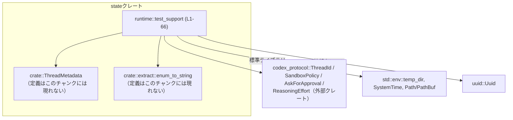
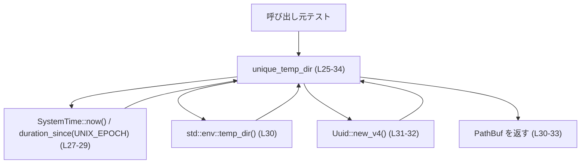
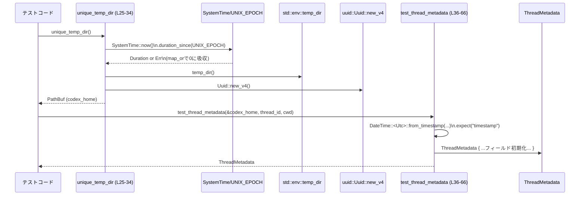

# state/src/runtime/test_support.rs

## 0. ざっくり一言

テストコード専用に、**一意な一時ディレクトリパスの生成**と、**`ThreadMetadata` のテスト用インスタンス生成**を行うヘルパー関数を定義しているファイルです（`#[cfg(test)]` によりテスト時のみ有効）（根拠: `state/src/runtime/test_support.rs:L1-24,L25-26,L35-36`）。

---

## 1. このモジュールの役割

### 1.1 概要

- テストごとに衝突しにくい一時ディレクトリパスを返す `unique_temp_dir` を提供します（根拠: `L25-34`）。
- テストで利用しやすい、一定のデフォルト値を持つ `ThreadMetadata` を構築する `test_thread_metadata` を提供します（根拠: `L35-66`）。
- いずれも `#[cfg(test)]` 付き・`pub(super)` であり、**テストコンパイル時のみ**同一モジュール階層内から利用される内部ヘルパーです（根拠: `L1-24,L25,L35`）。

### 1.2 アーキテクチャ内での位置づけ

このファイルは、`state` クレート内部の `runtime` モジュール配下にあり、テストコードからのみ参照される補助モジュールです。`ThreadMetadata` や `codex_protocol` の型に依存しています（根拠: `L5-12,L23-24`）。

主要な関係を簡略化すると次のようになります。



### 1.3 設計上のポイント

- **テスト専用**  
  全ての `use` と関数定義に `#[cfg(test)]` が付けられており、本番バイナリには含まれません（根拠: `L1-24,L25,L35`）。
- **ステートレスなヘルパー**  
  グローバルな可変状態を持たず、入力から値を構築して返す純粋関数的な構造です（外部 I/O は `SystemTime::now`, `env::temp_dir`, `Uuid::new_v4` の呼び出しのみ）（根拠: `L27-33,L30-32,L41-65`）。
- **テストの再現性を意識した設計**  
  `ThreadMetadata` の `created_at` / `updated_at` には固定の Unix 時刻 `1_700_000_000` を使い、テスト実行時刻に依存しないメタデータを生成しています（根拠: `L41, L45-46`）。
- **ポリシー類は実際の型から文字列に変換**  
  `SandboxPolicy` と `AskForApproval` は、`crate::extract::enum_to_string` により文字列化されており、外部永続化や比較などの用途を想定した形のテストデータを提供しています（根拠: `L57-58`）。

---

## 2. 主要な機能一覧（コンポーネントインベントリー）

### 2.1 このファイルで定義される関数

| 種別 | 名前 | 役割 / 用途 | 定義位置 |
|------|------|------------|----------|
| 関数 | `unique_temp_dir()` | 一意性の高い一時ディレクトリのパス (`PathBuf`) を生成するテスト用ヘルパー | `state/src/runtime/test_support.rs:L25-34` |
| 関数 | `test_thread_metadata(codex_home, thread_id, cwd)` | `ThreadMetadata` のテスト用インスタンスをデフォルト値込みで構築する | `state/src/runtime/test_support.rs:L35-66` |

### 2.2 このファイルが利用する主な型（定義は他ファイル）

このファイル内で**新しい型定義はありません**（`struct` や `enum` の宣言はない）（根拠: 全行確認）。

利用している外部／他モジュールの主な型は次の通りです。

| 名前 | 種別 | 定義場所（推定レベル） | 用途 | 根拠 |
|------|------|------------------------|------|------|
| `ThreadMetadata` | 構造体 | `crate::ThreadMetadata`（具体的ファイルはこのチャンクには現れない） | スレッドのメタデータを表現するテストデータのコンテナ | `L23-24,L42-65` |
| `ThreadId` | 型（おそらく newtype/struct） | `codex_protocol::ThreadId` | スレッド識別子 | `L5-6,L38` |
| `ReasoningEffort` | enum | `codex_protocol::openai_models::ReasoningEffort` | モデルの推論強度の指定（ここでは `Medium`） | `L7-8,L53` |
| `SandboxPolicy` | enum/struct | `codex_protocol::protocol::SandboxPolicy` | サンドボックス権限ポリシーを表す型 | `L11-12,L57` |
| `AskForApproval` | enum | `codex_protocol::protocol::AskForApproval` | 実行承認のモードを表す型 | `L9-10,L58` |
| `Path` / `PathBuf` | 構造体 | `std::path` | パスの参照・所有型 | `L13-16,L26,L37,L40` |
| `SystemTime` / `UNIX_EPOCH` | 構造体 / 定数 | `std::time` | 現在時刻と Unix エポック | `L17-20,L27-29` |
| `Uuid` | 構造体 | `uuid::Uuid` | ランダムな識別子を生成し、パス名に組み込む | `L21-22,L31-32` |
| `DateTime<Utc>` | 構造体＋タイムゾーン型 | `chrono` | 固定 Unix 時刻から日時を構築し、`created_at`/`updated_at` に使う | `L1-4,L41` |

---

## 3. 公開 API と詳細解説

このファイル内の関数はいずれも `pub(super)` であり、**現在のモジュールの親モジュール内でのみ利用可能**なテストヘルパーです（根拠: `L25,L35`）。

### 3.1 型一覧（このファイルで定義される型）

このファイル自身では新たな構造体・列挙体は定義されていません（根拠: 全行確認）。

---

### 3.2 関数詳細

#### `unique_temp_dir() -> PathBuf`

**概要**

- 現在時刻のナノ秒とランダムな UUID を組み合わせて、一意性の高い一時ディレクトリパスを生成します（根拠: `L27-33`）。
- テストごとに異なるディレクトリを使うことで、ファイルシステム上の副作用が衝突しにくくなります。

**引数**

- なし

**戻り値**

- `PathBuf`  
  `std::env::temp_dir()` が返すシステムのテンポラリディレクトリ配下に、  
  `"codex-state-runtime-test-{nanos}-{uuid}"` 形式のパスを連結したものです（根拠: `L27-33`）。

**内部処理の流れ**

1. `SystemTime::now()` で現在時刻を取得する（根拠: `L27`）。
2. `duration_since(UNIX_EPOCH)` で Unix エポックからの経過時間を取得し、エラー時には `map_or(0, ...)` により `0` を使う（根拠: `L27-29`）。
   - これにより、システム時計がエポックより前を指しているなどの理由でエラーになった場合でも panic せず、ナノ秒値として `0` を使用します。
3. `std::env::temp_dir()` を呼び出し、システムの一時ディレクトリパスを取得します（根拠: `L30`）。
4. `Uuid::new_v4()` でランダムな UUID を生成し、それを文字列に埋め込んだサフィックスを作ります（根拠: `L31-32`）。
5. `temp_dir().join(format!(...))` でテンポラリのパスにサフィックスを結合し、`PathBuf` を返します（根拠: `L30-33`）。

**簡易フローチャート**



**Examples（使用例）**

> 注: 以下の例は、この関数とその周辺の使い方のイメージを示すものであり、  
> モジュールパスなどは実際のプロジェクト構成に合わせて修正する必要があります。

```rust
#[test]
fn temp_dirs_are_different_between_calls() {
    // 一度目の呼び出しで一時ディレクトリパスを取得する
    let dir1 = unique_temp_dir(); // テスト専用ヘルパー（L25-34）

    // 二度目の呼び出しで別の一時ディレクトリパスを取得する
    let dir2 = unique_temp_dir();

    // 2回の呼び出しで得られるパスは原則として異なることが期待される
    assert_ne!(dir1, dir2);
}
```

**Errors / Panics**

- `duration_since(UNIX_EPOCH)` のエラーは `map_or(0, ...)` によって吸収され、panic しません（根拠: `L27-29`）。
- `std::env::temp_dir()` はパスを返す API であり、エラーを返す設計ではないため、このコード上ではハンドリングは不要です（標準ライブラリ仕様による。コード上では Result を扱っていないことから読み取れます: `L30`）。
- `Uuid::new_v4()` が内部で panic するかどうかは `uuid` クレートの実装に依存し、このチャンクからは判定できません。コード内でエラー処理や `Result` が使われていないため、ここで検出・処理していないことだけが分かります（根拠: `L31-32`）。

**Edge cases（エッジケース）**

- システム時計が Unix エポック以前を指している場合  
  `duration_since(UNIX_EPOCH)` がエラーになる可能性がありますが、`map_or(0, ...)` により `nanos = 0` として処理されます（根拠: `L27-29`）。  
  その場合でも UUID による一意性付与があるため、パス衝突のリスクは低く保たれます。
- 非 UNIX 系 OS  
  `std::env::temp_dir()` の中身は OS ごとに異なりますが、ここでは `PathBuf` として透過的に扱っており、特別扱いはしていません（根拠: `L30`）。

**使用上の注意点**

- **ディレクトリの作成は行わない**  
  この関数は `PathBuf` を返すだけで、実際にディレクトリを作成しません。必要であれば、呼び出し側で `std::fs::create_dir_all(&path)` などを実行する必要があります（コード上、`std::fs` 呼び出しがないことから判定: `L25-34`）。
- **テスト以外からは利用できない**  
  `#[cfg(test)]` と `pub(super)` によってテストビルドかつ親モジュールまでの可視性に制限されています。プロダクションコードで同様の機能が必要な場合は別途実装する必要があります（根拠: `L25`）。

---

#### `test_thread_metadata(codex_home: &Path, thread_id: ThreadId, cwd: PathBuf) -> ThreadMetadata`

**概要**

- 与えられた `codex_home`（基準ディレクトリ）、`thread_id`、`cwd`（カレントディレクトリ）を元に、テスト用の `ThreadMetadata` を一括で構築します（根拠: `L36-40,L42-65`）。
- 日時・モデル名・ポリシーなど多くのフィールドに固定値や簡易なデフォルト値を設定し、テストコード側の記述量を減らします。

**引数**

| 引数名 | 型 | 説明 | 根拠 |
|--------|----|------|------|
| `codex_home` | `&Path` | ロールアウトログファイルパスなどを構築するための基準ディレクトリ | `L37,L44` |
| `thread_id` | `ThreadId` | スレッドを一意に識別する ID | `L38,L43-L44` |
| `cwd` | `PathBuf` | スレッドに紐づくカレントディレクトリパス | `L39,L54` |

**戻り値**

- `ThreadMetadata`  
  スレッド ID, ロールアウトファイルパス, タイムスタンプ, モデル情報, サンドボックスポリシー, 承認モードなどが設定されたメタデータ構造体です（根拠: `L42-65`）。

**内部処理の流れ**

1. 固定 Unix 時刻 `1_700_000_000` 秒を `DateTime::<Utc>::from_timestamp` で `DateTime<Utc>` に変換し、`expect("timestamp")` で `Option` から取り出す（根拠: `L41`）。
   - ここで `from_timestamp` が `None` を返した場合は panic します。
2. `ThreadMetadata { ... }` のリテラル構築で、各フィールドに値をセットする（根拠: `L42-65`）。
   - `id` に引数 `thread_id` をそのまま代入（根拠: `L43`）。
   - `rollout_path` は `codex_home.join(format!("rollout-{thread_id}.jsonl"))` で構築（根拠: `L44`）。
   - `created_at` / `updated_at` に先ほどの `now` を設定（根拠: `L45-46`）。
   - `source` は `"cli"` 固定文字列（根拠: `L47`）。
   - `agent_nickname`, `agent_role`, `agent_path` は `None`（根拠: `L48-50`）。
   - `model_provider` は `"test-provider"` 固定（根拠: `L51`）。
   - `model` は `Some("gpt-5")`（根拠: `L52`）。
   - `reasoning_effort` は `Some(ReasoningEffort::Medium)`（根拠: `L53`）。
   - `cwd` は引数の所有権をそのまま移動（根拠: `L39,L54`）。
   - `cli_version` は `"0.0.0"` 固定（根拠: `L55`）。
   - `title` は空文字列（`String::new()`）（根拠: `L56`）。
   - `sandbox_policy` は `SandboxPolicy::new_read_only_policy()` を生成し、`crate::extract::enum_to_string(&...)` で文字列化した値（根拠: `L57`）。
   - `approval_mode` は `AskForApproval::OnRequest` を `enum_to_string` した文字列（根拠: `L58`）。
   - `tokens_used` は `0`（根拠: `L59`）。
   - `first_user_message` は `Some("hello")` 固定（根拠: `L60`）。
   - `archived_at`, `git_sha`, `git_branch`, `git_origin_url` はすべて `None`（根拠: `L61-64`）。

**Examples（使用例）**

> ThreadId や ThreadMetadata の生成方法・モジュールパスはこのチャンクには現れないため、  
> 以下ではそれらを「どこかから取得済み」とする擬似コード的な例を示します。

```rust
#[test]
fn create_basic_test_thread_metadata() {
    // 一時的な codex_home ディレクトリを得る（L25-34）
    let codex_home = unique_temp_dir();

    // ThreadId は外部クレート codex_protocol から取得する必要がある
    // 実際の生成方法はこのチャンクには現れないため、ここでは既にあるものとして扱う
    let thread_id: ThreadId = /* どこかから取得済みの ThreadId */ unimplemented!();

    // カレントディレクトリ用の PathBuf を用意する
    let cwd = codex_home.join("workspace");

    // テスト用の ThreadMetadata を一括生成する（L36-66）
    let metadata = test_thread_metadata(&codex_home, thread_id, cwd);

    // 例えば、ロールアウトパスのプレフィックスが codex_home であることを確認するなど
    // （ThreadMetadata のフィールドの公開範囲はこのチャンクからは不明）
}
```

**Errors / Panics**

- `DateTime::<Utc>::from_timestamp(...).expect("timestamp")`  
  `from_timestamp` が `None` を返した場合（与えた秒数・ナノ秒が `chrono` のサポート範囲外など）には `expect` により panic します（根拠: `L41`）。
  - ここで使われている `1_700_000_000` という秒数は固定値であり、コード上は常に同じ値で呼び出されています（根拠: `L41`）。
- `SandboxPolicy::new_read_only_policy()` / `AskForApproval::OnRequest` / `enum_to_string`  
  これらが内部で panic しうるかはそれぞれの実装に依存しており、このチャンクからは判断できません。コード上では `Result` や `Option` は返されておらず、エラー処理も行っていません（根拠: `L57-58`）。

**Edge cases（エッジケース）**

- `codex_home` が存在しないパスの場合  
  `rollout_path` は単に `Path.join` で構築されるだけであり、パスの存在確認は行いません（根拠: `L44`）。後続の処理（ファイル書き込みなど）で初めて問題になる可能性があります。
- `cwd` が実在しないパスの場合  
  そのまま `ThreadMetadata.cwd` に格納されます（根拠: `L54`）。実在性の検証は行っていません。
- `thread_id` の値が空・不正などであっても、文字列化や検証は行っていません。`format!("rollout-{thread_id}.jsonl")` で `Display` 実装を通じて文字列化される前提です（根拠: `L44`）。

**使用上の注意点**

- **テストの期待値が固定値に依存する**  
  `created_at` / `updated_at` / `model` / `model_provider` / `first_user_message` などは固定値です（根拠: `L41,L45-52,L55-56,L60`）。  
  これらの値を利用するテストを書くと、実装変更時にテストが影響を受けやすくなるため、「最低限の前提」に絞ってアサートすることが望ましいです。
- **ポリシーと承認モードは文字列表現**  
  `sandbox_policy` / `approval_mode` は enum そのものではなく `enum_to_string` の結果（おそらく文字列）です（根拠: `L57-58`）。  
  これらを enum 型として比較したいテストでは、このヘルパーではなく直接 `SandboxPolicy` や `AskForApproval` を扱う必要があります。
- **ThreadMetadata のフィールド構造への依存**  
  この関数は `ThreadMetadata` の全フィールドに直接アクセスして初期化しています（根拠: `L42-65`）。  
  構造体のフィールド構成が変わった場合、この関数も合わせて更新する必要があります。

---

### 3.3 その他の関数

このファイルには上記 2 つ以外の関数はありません（根拠: 全行確認）。

---

## 4. データフロー

### 4.1 代表的な処理シナリオ

テストコードで「`ThreadMetadata` を用意して runtime のロジックをテストする」という典型パターンを考えます。

1. テストコードが `unique_temp_dir()` を呼び出し、一時的な `codex_home` ディレクトリパスを取得する。
2. 別の手段で `ThreadId` を用意する（方法はこのチャンクには現れません）。
3. 必要に応じて `cwd` を決める（例: `codex_home.join("workspace")`）。
4. `test_thread_metadata(&codex_home, thread_id, cwd)` を呼び出し、テスト用メタデータを生成する。
5. 生成した `ThreadMetadata` を runtime のテスト対象ロジックに渡す。

これを sequence diagram で表すと次のようになります。



---

## 5. 使い方（How to Use）

### 5.1 基本的な使用方法

最もシンプルな使い方として、テストコード内で `codex_home` と `ThreadMetadata` をまとめて用意する例です。

```rust
#[test]
fn test_runtime_with_basic_thread_metadata() {
    // 一時的な codex_home を決める（L25-34）
    let codex_home = unique_temp_dir();

    // ThreadId は実際には codex_protocol クレートの API から取得する必要がある
    let thread_id: ThreadId = /* どこかから生成または取得 */ unimplemented!();

    // カレントディレクトリも codex_home 配下に置く
    let cwd = codex_home.join("workspace");

    // テスト用メタデータをまとめて構築（L36-66）
    let metadata = test_thread_metadata(&codex_home, thread_id, cwd);

    // ここで metadata を runtime のロジックに渡してテストを行う
    // 例: runtime.handle_thread(metadata, ...) など
}
```

### 5.2 よくある使用パターン

1. **テストごとに独立したファイルツリーを持たせる**

   - `unique_temp_dir` を毎テストで呼び出して `codex_home` とし、その配下に必要なファイル・ディレクトリを作成する。
   - これにより、テスト間でファイルが衝突したり、前のテストの結果が後続テストに影響することを避けられます。

2. **「典型的な CLI スレッド」のメタデータを使う**

   - `test_thread_metadata` は `source = "cli"`、`model = Some("gpt-5")`、`reasoning_effort = Some(Medium)` など「それらしい」デフォルトを持っているため、  
     「ごく一般的な CLI 経由スレッド」の振る舞いをテストする際の共通ベースとして利用できます。

### 5.3 よくある間違い（起こりうる誤用例）

```rust
#[test]
fn bad_example_sharing_temp_dir_between_tests() {
    // 間違い例（イメージ）: グローバルな固定ディレクトリを使い回してしまう
    let codex_home = std::path::PathBuf::from("/tmp/codex-test"); // 例

    // これだと、複数テストが同じ場所を使ってファイル操作し、干渉する可能性がある
}
```

```rust
#[test]
fn good_example_using_unique_temp_dir() {
    // 正しい例: テストごとに unique_temp_dir で別ディレクトリを使う（L25-34）
    let codex_home = unique_temp_dir();
    // 以降のファイル操作は codex_home 配下に閉じ込められ、テスト同士が干渉しにくくなる
}
```

### 5.4 使用上の注意点（まとめ）

- **テスト専用**であり、本番コードでの利用を前提としていないことに留意する必要があります（根拠: `#[cfg(test)]` `L1-24,L25,L35`）。
- `test_thread_metadata` は多くのフィールドを**固定値**で埋めています。  
  実際の運用環境との差異（例: `model` 名、`cli_version`、`source` など）を意識しないと、テストが現実と乖離する可能性があります（根拠: `L47-52,L55-60`）。
- ファイルシステム上のパスの存在確認やディレクトリ作成は一切行っていないため、必要なら呼び出し側で明示的に対応する必要があります（根拠: このファイル内に fs 操作がないこと）。

---

## 6. 変更の仕方（How to Modify）

### 6.1 新しい機能を追加する場合

- **新しいテスト用メタデータバリエーションを追加する**
  1. `test_support.rs` に別のヘルパー関数（例: `test_thread_metadata_with_model(...)`）を追加する。
  2. 既存の `test_thread_metadata` を呼び出してから、一部フィールドを上書きする形にすると重複が減ります（ただし、フィールドの可視性は `ThreadMetadata` の定義側次第で、このチャンクからは不明）。
- **異なるポリシー／承認モードを使うヘルパー**
  - `SandboxPolicy::new_read_only_policy()` や `AskForApproval::OnRequest` を別のバリアントに変えた関数を追加すると、「特定のポリシー条件での振る舞い」テストが書きやすくなります。

### 6.2 既存の機能を変更する場合

- **`ThreadMetadata` にフィールドが追加・削除された場合**
  - コンパイルエラーとして `ThreadMetadata { ... }` の初期化部（`L42-65`）が指摘されるので、ここを修正する必要があります。
- **モデル名や CLI バージョンなどの固定値を変更する場合**
  - テストの期待値（文字列比較など）に影響するため、該当テストを合わせて更新するか、テストを固定値に依存しない形にする必要があります。
- **タイムスタンプの扱いを変更する場合**
  - 現状は固定 Unix 時刻で再現性を重視しています（`L41,L45-46`）。  
    実行時刻に依存させるように変更すると、テストの安定性に影響する可能性があります。

---

## 7. 関連ファイル

このファイルと密接に関連する型・モジュールをまとめます。

| パス / モジュール | 役割 / 関係 |
|------------------|------------|
| `crate::ThreadMetadata` | `test_thread_metadata` がインスタンスを構築する対象の構造体です（定義ファイルはこのチャンクには現れませんが、スレッドのメタ情報を表すと考えられます）。 |
| `crate::extract::enum_to_string` | `SandboxPolicy` や `AskForApproval` を文字列表現に変換する関数です（実装はこのチャンクには現れませんが、`L57-58` で利用されています）。 |
| `codex_protocol::ThreadId` | スレッド識別子の型であり、`test_thread_metadata` の引数およびファイル名生成に使用されます（根拠: `L5-6,L38,L44`）。 |
| `codex_protocol::protocol::SandboxPolicy` | サンドボックス権限のポリシー型で、ここでは read-only ポリシーをテスト用に適用しています（根拠: `L11-12,L57`）。 |
| `codex_protocol::protocol::AskForApproval` | 実行承認モードの型で、ここでは `OnRequest` モードのテスト用文字列表現を利用しています（根拠: `L9-10,L58`）。 |
| `codex_protocol::openai_models::ReasoningEffort` | モデルの推論強度（ここでは `Medium`）を表す enum で、メタデータの一部として格納されます（根拠: `L7-8,L53`）。 |

このチャンクにはテスト本体（`#[test]` 関数）や runtime の実際の処理ロジックは現れないため、それらとの具体的な連携コードは不明です。
