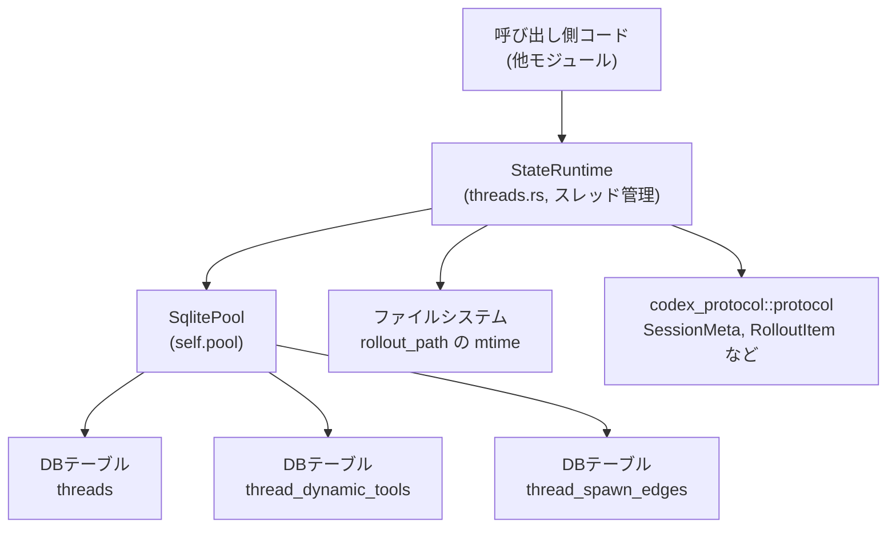
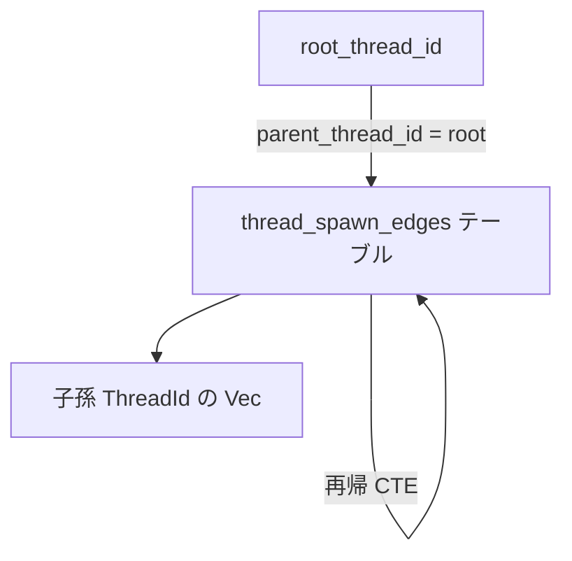

# state/src/runtime/threads.rs コード解説

## 0. ざっくり一言

`StateRuntime` がスレッド（対話スレッド）のメタデータを SQLite 上で管理するためのメソッド群と、そのための SQL ビルダー・補助関数・テストをまとめたファイルです。  
スレッド一覧・検索・アーカイブ、親子スレッド関係（spawn edges）、ロールアウト結果の反映、動的ツール定義の保存などを扱います。

> 行番号について: このチャンクには元ソースの行番号情報が含まれていないため、以下では「関数名＋ファイル名」で根拠を示し、正確な行番号は「不明」と明記します（例: `state/src/runtime/threads.rs:L不明`）。  

---

## 1. このモジュールの役割

### 1.1 概要

このモジュールは **スレッド状態を SQLite に永続化・検索するためのランタイム層** です。主に次の機能を提供します。

- `threads` テーブルへのスレッドメタデータの挿入・更新・削除（`upsert_thread*`, `delete_thread` など）
- スレッド一覧・検索・ページング（`list_threads`, `list_thread_ids`, `find_thread_by_exact_title` など）
- スレッドの親子関係（spawn edges）の管理・探索（`upsert_thread_spawn_edge`, `list_thread_spawn_descendants_with_status` など）
- ロールアウトファイル（`RolloutItem` 列）の適用と副作用（`apply_rollout_items`）
- 動的ツール定義の保存・取得（`persist_dynamic_tools`, `get_dynamic_tools`）
- Git 情報や memory_mode など、補助的なメタデータの更新

### 1.2 アーキテクチャ内での位置づけ

このファイルは、`StateRuntime` の一部として DB 操作を集約するレイヤーです。外部からは `StateRuntime` のメソッドが呼ばれ、内部では `sqlx` によるクエリ発行やファイルシステムアクセスを行います。



- `StateRuntime` 型自体は別ファイルで定義されていますが、本ファイルの `impl StateRuntime` ブロック内でスレッド関連のロジックが提供されています（`state/src/runtime/threads.rs:L不明`）。
- DB スキーマは `threads`, `thread_dynamic_tools`, `thread_spawn_edges` の 3 テーブルを前提にしています（各種 `INSERT/SELECT/UPDATE` 文より）。

### 1.3 設計上のポイント

コードから読み取れる特徴は次の通りです（根拠: 各メソッド定義, `state/src/runtime/threads.rs:L不明`）。

- **責務の分離**
  - スレッド一覧・検索系ロジックは `push_thread_filters`, `push_thread_order_and_limit` で共通化。
  - 親子スレッド関係は `thread_spawn_edges` テーブル＋専用メソッド群で一元管理。
  - ロールアウト適用は `apply_rollout_items` に集約し、その中で upsert・memory_mode・動的ツールを連携。
- **状態は DB 頼り**
  - `StateRuntime` 自身は状態を持たず（`&self` のみ）、すべての変更は SQL を通じて永続化。
  - メモリ上のキャッシュやミューテックスはこのファイルには登場しません。
- **非同期・エラー処理**
  - ほぼすべての公開メソッドは `async fn` で、`anyhow::Result<...>` を返し、内部の `sqlx` / `serde_json` / ファイル I/O エラーをそのまま包んで返します。
- **DB 一貫性の確保**
  - `ON CONFLICT` や `CASE WHEN ? THEN ?` など、SQL レベルの制約・更新パターンを活用。
  - 動的ツール保存はトランザクション (`self.pool.begin()`) でまとめて行い、中途半端な挿入を防いでいます。
- **クエリの動的構築**
  - `QueryBuilder<Sqlite>` を用いて、フィルタや LIMIT 等を動的に組み立てつつ、値は必ずバインドパラメータ経由にして SQL インジェクションを避けています。

---

## 2. 主要な機能一覧（コンポーネントインベントリー）

このファイルが提供する主な機能を列挙します（メソッド・関数名ベース）。

- スレッド単体取得
  - `get_thread`：`ThreadId` から完全な `ThreadMetadata` を読み出す。
  - `get_thread_memory_mode`：`memory_mode` カラムだけを取得。
- スレッド一覧・検索
  - `list_threads`：フィルタ・検索語・ページング付きで `ThreadMetadata` をページ単位で取得。
  - `list_thread_ids`：同様の条件で ID のみの一覧取得。
  - `find_thread_by_exact_title`：タイトル完全一致＋各種フィルタで最新スレッドを 1 件取得。
  - `find_rollout_path_by_id`：スレッド ID から `rollout_path` のみ取得。
- スレッドの作成・更新・削除
  - `upsert_thread_with_creation_memory_mode`：内部用の upsert（insert or update）。初回だけ `memory_mode` を設定。
  - `upsert_thread`：上記のラッパー。既存行の `memory_mode` は保持。
  - `insert_thread_if_absent`：既に存在する場合は何もしない insert。
  - `set_thread_memory_mode` / `update_thread_title` / `touch_thread_updated_at` / `update_thread_git_info`：特定カラムの部分更新。
  - `mark_archived` / `mark_unarchived`：アーカイブ状態の切り替え。
  - `delete_thread`：スレッド行の削除。
- 親子スレッド（spawn edges）の管理
  - `upsert_thread_spawn_edge` / `set_thread_spawn_edge_status`：親子関係とそのステータスの保存・更新。
  - `list_thread_spawn_children_with_status` / `list_thread_spawn_descendants_with_status`：状態フィルタ付きの子・子孫スレッド列挙。
  - `find_thread_spawn_child_by_path` / `find_thread_spawn_descendant_by_path`：`agent_path` から子／子孫スレッドを一意に特定。
  - `list_thread_spawn_children_matching` / `list_thread_spawn_descendants_matching`：上記の内部共通実装。
  - `insert_thread_spawn_edge_if_absent` / `insert_thread_spawn_edge_from_source_if_absent`：子スレッド作成時に親子エッジを暗黙に張るための補助。
- 動的ツール
  - `persist_dynamic_tools`：スレッド開始時に定義された動的ツールを `thread_dynamic_tools` に保存（初回のみ）。
  - `get_dynamic_tools`：保存された動的ツールを取得。
  - `extract_dynamic_tools`：`RolloutItem` 列から dynamic tools 情報を取得（メタライン用）。
- メモリモード
  - `extract_memory_mode`：`RolloutItem` 列の最後の `SessionMeta` から `memory_mode` を復元。
- ロールアウト適用
  - `apply_rollout_items`：`RolloutItem` 列を既存スレッドに適用し、トークン数や git 情報・memory_mode などを DB に反映。
- クエリビルダー補助
  - `push_thread_filters`：`list_threads` / `list_thread_ids` / `find_thread_by_exact_title` の共通フィルタロジック。
  - `push_thread_order_and_limit`：sort key に応じた ORDER BY と LIMIT の組み立て。
- その他内部補助
  - `one_thread_id_from_rows`：`agent_path` 検索で 0/1/複数結果を扱うヘルパー。
  - `thread_spawn_parent_thread_id_from_source_str`：`source` 文字列から親スレッド ID を抽出。
- テスト（`#[cfg(test)] mod tests`）
  - memory_mode の永続化・復元・保持
  - git 情報の更新と他メタデータの不変性
  - insert-if-absent の動作
  - `touch_thread_updated_at` の影響範囲
  - `apply_rollout_items` の updated_at の扱いとトークン数反映
  - spawn edges の状態遷移・探索挙動

---

## 3. 公開 API と詳細解説

### 3.1 型一覧（このファイルで利用している主な型）

このファイル内で登場し、公開 API で扱われる主な型を整理します（定義自体は他ファイルにあります）。

| 名前 | 種別 | 役割 / 用途 | 根拠 |
|------|------|-------------|------|
| `StateRuntime` | 構造体 | ステート DB へのアクセスを抽象化するランタイム。`impl StateRuntime` がこのファイルに存在。 | `threads.rs:L不明` の `impl StateRuntime` |
| `ThreadId` | 型（おそらく newtype） | スレッド ID（UUID 文字列から `try_from` で変換）。 | `get_thread`, `list_thread_ids` などで使用 |
| `ThreadMetadata` | 構造体 | スレッドのメタデータを表すドメインオブジェクト。DB からの読み書きに利用。 | `get_thread`, `upsert_thread*` |
| `ThreadMetadataBuilder` | 構造体 | ロールアウトファイルを元に `ThreadMetadata` を構築するビルダー。 | `apply_rollout_items` 引数 |
| `ThreadsPage` | 構造体 | スレッド一覧のページング結果（items, next_anchor, num_scanned_rows）。 | `list_threads` 戻り値 |
| `Anchor` | 構造体 | ページング用のアンカー（ID, timestamp）。 | `list_threads`, `list_thread_ids`, `push_thread_filters` |
| `SortKey` | 列挙体 | ソートキー（`CreatedAt`, `UpdatedAt`）。 | `list_threads`, `push_thread_order_and_limit` |
| `DirectionalThreadSpawnEdgeStatus` | 列挙体 | spawn edge の状態（Open/Closed などの文字列表現）。 | spawn edge 系メソッド |
| `DynamicToolSpec` | 構造体 | 動的ツール（名前・説明・入力スキーマ・遅延ロードフラグ）。 | `get_dynamic_tools`, `persist_dynamic_tools` |
| `RolloutItem` | 列挙体 | ロールアウトファイルの 1 行（SessionMeta, EventMsg など）。 | `apply_rollout_items`, `extract_*` |
| `SessionSource` | 列挙体 | セッションの起点（CLI, SubAgent など）。spawn 元スレッド識別に使用。 | 冒頭 `use`, `thread_spawn_parent_thread_id_from_source_str` |

### 3.2 関数詳細（重要な 7 件）

#### 1. `StateRuntime::get_thread(&self, id: ThreadId) -> anyhow::Result<Option<ThreadMetadata>>`

**概要**

- `threads` テーブルから指定 ID のスレッドメタデータを読み出し、`ThreadMetadata` に変換して返します。
- 該当行がなければ `Ok(None)` を返します。
- 根拠: `state/src/runtime/threads.rs:L不明` の `get_thread` 実装。

**引数**

| 引数名 | 型 | 説明 |
|--------|----|------|
| `&self` | `&StateRuntime` | DB プールを含むランタイム。 |
| `id` | `ThreadId` | 取得対象スレッドの ID。 |

**戻り値**

- `Ok(Some(ThreadMetadata))`：ID に一致するスレッドが存在し、マッピングに成功した場合。
- `Ok(None)`：行が存在しない場合（`fetch_optional` の結果が `None`）。
- `Err(anyhow::Error)`：`sqlx` クエリ失敗、`ThreadRow::try_from_row` や `ThreadMetadata::try_from` の失敗など。

**内部処理の流れ**

1. `SELECT ... FROM threads WHERE id = ?` という固定 SQL を発行し、`id.to_string()` をバインド（`fetch_optional` 使用）。
2. 返ってきた `Option<Row>` に対して `map` を適用し、存在すれば
   - `ThreadRow::try_from_row(&row)` で中間表現へ変換。
   - `ThreadMetadata::try_from(ThreadRow)` でドメインオブジェクトへ変換。
3. `transpose()` により `Option<Result<_>>` を `Result<Option<_>>` へ変換し、そのまま返却。

**使用例**

```rust
// スレッド ID をどこかから取得する
let thread_id: ThreadId = /* ... */;

// スレッドメタデータを読み出す
let maybe_meta = runtime.get_thread(thread_id).await?; // エラーは anyhow 経由で伝播

if let Some(meta) = maybe_meta {
    println!("title = {}", meta.title); // メタデータが存在する場合
} else {
    println!("thread not found");
}
```

**Errors / Panics**

- SQL 実行時 (`fetch_optional`) のエラーは `anyhow::Error` に包まれて返ります。
- `ThreadRow::try_from_row` または `ThreadMetadata::try_from` でのバリデーション/型変換失敗もエラーとして返ります。
- パニック要因は見当たりません（`unwrap` 等を使用していない）。

**Edge cases**

- ID が存在しない: `Ok(None)`（404 的な扱い）。
- DB スキーマと `ThreadRow` の期待がズレている: `try_get` 失敗などでエラー。
- 一部カラムが `NULL` でも、`ThreadRow` 側で `Option` を取っていれば問題なく読み込める想定です（詳細は `ThreadRow` 定義次第。コードからは不明）。

**使用上の注意点**

- 戻り値が `Option` であるため、「存在しないこと」と「DB エラー」を明確に分けて扱う必要があります。
- この関数は純粋に DB 読み取りのみを行い、副作用（更新）はありません。

---

#### 2. `StateRuntime::list_threads(&self, ...) -> anyhow::Result<ThreadsPage>`

**概要**

- フィルタ条件・検索語・ソートキー・ページング情報を元に、`threads` テーブルからスレッド一覧を取得します。
- 1 ページ分＋1行を読み、次ページ有無を `next_anchor` として返すページング実装です。
- 根拠: `state/src/runtime/threads.rs:L不明` の `list_threads` 実装。

**引数**

| 引数名 | 型 | 説明 |
|--------|----|------|
| `page_size` | `usize` | 1 ページあたりの最大件数。実際には `page_size + 1` 行読みます。 |
| `anchor` | `Option<&Anchor>` | ページングの基準位置。`None` なら最新から。 |
| `sort_key` | `SortKey` | `CreatedAt` か `UpdatedAt`。 |
| `allowed_sources` | `&[String]` | `source` カラムの許容値。空なら制限なし。 |
| `model_providers` | `Option<&[String]>` | `model_provider` の IN フィルタ。 |
| `archived_only` | `bool` | `true` ならアーカイブ済みのみ、`false` なら未アーカイブのみ。 |
| `search_term` | `Option<&str>` | タイトルの部分一致に使う文字列。 |

**戻り値**

- `ThreadsPage { items, next_anchor, num_scanned_rows }`
  - `items`: 最大 `page_size` 個の `ThreadMetadata`。
  - `next_anchor`: さらに古いページがある場合のアンカー（`Some`）、なければ `None`。
  - `num_scanned_rows`: DB から読み取った行数（`page_size + 1` まで）。

**内部処理の流れ**

1. `limit = page_size.saturating_add(1)` を計算。
2. `QueryBuilder::<Sqlite>` で `SELECT ... FROM threads` を構築。
3. `push_thread_filters(...)` で WHERE 条件や `source`/`model_provider`/`archived`/`search_term`/`anchor` を付与。
4. `push_thread_order_and_limit(builder, sort_key, limit)` で ORDER BY と LIMIT を付与。
5. クエリ実行 (`fetch_all`)。
6. 各行を `ThreadRow::try_from_row` → `ThreadMetadata::try_from` で変換し、`Vec<ThreadMetadata>` を作成。
7. もし `items.len() > page_size` なら:
   - 1 件 pop して捨てる（「次ページがある」判定用に読み過ぎた行）。
   - 最後の要素から `anchor_from_item(item, sort_key)` で `next_anchor` を計算。
8. `ThreadsPage` を構築して返却。

**使用例**

```rust
// 最初のページ（最新から）
let page = runtime
    .list_threads(
        20,                      // page_size
        None,                    // anchor
        SortKey::UpdatedAt,      // ソートキー
        &vec!["cli".to_string()],// allowed_sources
        None,                    // model_providers
        false,                   // archived_only = false (未アーカイブのみ)
        Some("タイトル断片"),     // search_term
    )
    .await?;

// 次ページがあれば追いかける
if let Some(anchor) = page.next_anchor.as_ref() {
    let next_page = runtime
        .list_threads(
            20,
            Some(anchor),
            SortKey::UpdatedAt,
            &vec!["cli".into()],
            None,
            false,
            Some("タイトル断片"),
        )
        .await?;
}
```

**Errors / Panics**

- SQL 実行エラー、`ThreadRow`/`ThreadMetadata` の変換エラーは `Err(anyhow::Error)` で返ります。
- `page_size.saturating_add(1)` を使っているため、`usize::MAX` に対しても panic しません（オーバーフロー時に `usize::MAX` のままになります）。

**Edge cases**

- `allowed_sources` が空配列: `source` に対するフィルタ無し。
- `model_providers` が `None` または `Some(&[])`: `model_provider` フィルタ無し。
- `archived_only`:
  - `true` → `AND archived = 1`
  - `false` → `AND archived = 0`
  - 「両方」を同時に取るモードはありません。
- `search_term` が `Some("")`（空文字列）の場合も `instr(title, '') > 0` が付与されます（SQLite の `instr` の挙動に依存）。

**使用上の注意点**

- `first_user_message <> ''` というフィルタが常に付与されるため、最初のユーザメッセージが空のスレッドは一覧に出てきません（`push_thread_filters` 参照）。
- ページングは「古い方向」へのみ進みます。`anchor` は「前ページの最後の要素」を渡す前提です。
- 並行にスレッドが追加・更新される場合、ページング中に結果が多少揺れる可能性があります（DB のスナップショット分離レベル次第）。

---

#### 3. `StateRuntime::upsert_thread_with_creation_memory_mode(&self, metadata, creation_memory_mode) -> anyhow::Result<()>`

**概要**

- `threads` テーブルに対して「insert or update」する内部メソッドです。
- 初回 INSERT 時のみ `memory_mode` を `creation_memory_mode`（または `"enabled"`）で設定し、以降の UPDATE では既存の `memory_mode` を保持します。
- 根拠: `state/src/runtime/threads.rs:L不明` の `upsert_thread_with_creation_memory_mode` 実装およびテスト `upsert_thread_keeps_creation_memory_mode_for_existing_rows`。

**引数**

| 引数名 | 型 | 説明 |
|--------|----|------|
| `metadata` | `&ThreadMetadata` | 永続化対象のメタデータ。 |
| `creation_memory_mode` | `Option<&str>` | 初回挿入時の `memory_mode`。`None` の場合 `"enabled"`。 |

**戻り値**

- 常に `Ok(())` か `Err(anyhow::Error)`。更新／挿入されたかどうかの真偽は返しません。

**内部処理の流れ**

1. `INSERT INTO threads (...) VALUES (...) ON CONFLICT(id) DO UPDATE SET ...` という SQL を発行。
2. `VALUES` に `metadata` の各フィールドと `creation_memory_mode.unwrap_or("enabled")` をバインド。
3. `ON CONFLICT` 節では、多数のカラム（`rollout_path`, `created_at`, `updated_at`, ...）を `excluded` 側で上書きしつつ、**`memory_mode` は更新対象に含めていません**。
4. 実行後、`insert_thread_spawn_edge_from_source_if_absent` を呼び出し、`metadata.source` から親スレッド ID が分かる場合は spawn edge を挿入。

**使用例**

通常は直接ではなく、`upsert_thread` から利用されます（そのための内部メソッドです）。テストでは次のように使われています。

```rust
let mut metadata = test_thread_metadata(&codex_home, thread_id, codex_home.clone());

runtime
    .upsert_thread_with_creation_memory_mode(&metadata, Some("disabled"))
    .await?;

// 2回目以降は upsert_thread 経由で呼び出し、memory_mode は維持される
metadata.title = "updated title".to_string();
runtime.upsert_thread(&metadata).await?;
```

**Errors / Panics**

- SQL エラー（INSERT/UPDATE 失敗）は `anyhow::Error` として返却されます。
- `creation_memory_mode.unwrap_or("enabled")` に伴う panic はありません（`unwrap_or` は panic しません）。

**Edge cases**

- 既存行がある場合:
  - `metadata` に `memory_mode` フィールドがあっても、DB 側の `memory_mode` は更新されません（`ON CONFLICT` で更新していないため）。
- 存在しない ID の場合:
  - 新規挿入され、`memory_mode` は `creation_memory_mode` または `"enabled"` になります。

**使用上の注意点**

- 「memory_mode を変えたいが、他のフィールドも upsert したい」というケースではこの関数ではなく、`set_thread_memory_mode` と組み合わせる必要があります（実際 `apply_rollout_items` ではそのように別 UPDATE を呼んでいます）。
- `INSERT` と `spawn edge` 挿入は同じトランザクションではないため、途中でエラーになると「スレッドはあるが spawn edge がない」状態が一時的に発生しうる点に注意が必要です。

---

#### 4. `StateRuntime::apply_rollout_items(&self, builder, items, new_thread_memory_mode, updated_at_override) -> anyhow::Result<()>`

**概要**

- ロールアウトファイルから読み取った `RolloutItem` 列を、既存または新規のスレッドメタデータに適用し、DB に反映します。
- トークン数、git 情報、memory_mode、動的ツールなどを一括で処理する「ロールアウト適用の中心」関数です。
- 根拠: `state/src/runtime/threads.rs:L不明` の `apply_rollout_items` 実装と複数のテスト（`apply_rollout_items_*` 系）。

**引数**

| 引数名 | 型 | 説明 |
|--------|----|------|
| `builder` | `&ThreadMetadataBuilder` | 基本的なメタデータを構築するためのビルダー（id, rollout_path, created_at, source 等）。 |
| `items` | `&[RolloutItem]` | ロールアウトファイル 1 スレッド分のアイテム列。 |
| `new_thread_memory_mode` | `Option<&str>` | スレッド新規作成時に使う `memory_mode`。既存スレッドがある場合は無視。 |
| `updated_at_override` | `Option<DateTime<Utc>>` | `updated_at` をファイルの mtime ではなく、この値に上書きしたい場合に指定。 |

**戻り値**

- `Ok(())`：ロールアウト適用が成功した場合。
- `Err(anyhow::Error)`：DB 操作やロールアウト適用中にエラーが発生した場合。

**内部処理の流れ**

1. `items` が空なら即 `Ok(())` を返す。
2. `existing_metadata = self.get_thread(builder.id).await?` で既存メタデータを読み出し。
3. `metadata` を用意:
   - 既存があれば `clone()`。
   - なければ `builder.build(&self.default_provider)` でビルド。
4. `metadata.rollout_path = builder.rollout_path.clone()` でパスを更新。
5. `for item in items { apply_rollout_item(&mut metadata, item, &self.default_provider); }` を適用。
   - ここで tokens_used などが更新される（根拠: `apply_rollout_items_uses_override_updated_at_when_provided` テスト）。
6. 既存メタデータがあれば `metadata.prefer_existing_git_info(existing_metadata);` を呼び、既存ブランチなどを優先（根拠: `apply_rollout_items_preserves_existing_git_branch_and_fills_missing_git_fields`）。
7. `updated_at` を決定:
   - `updated_at_override` が `Some` ならそれを使用。
   - そうでなければ `file_modified_time_utc(builder.rollout_path)` を呼んでファイルの mtime を取得。`Some` なら `metadata.updated_at` に代入。
8. スレッド upsert:
   - 既存がない場合 → `upsert_thread_with_creation_memory_mode(&metadata, new_thread_memory_mode)`。
   - 既存がある場合 → `upsert_thread(&metadata)`。
9. `extract_memory_mode(items)` で最後の `SessionMeta` から memory_mode を抽出し、`Some` なら `set_thread_memory_mode(builder.id, ...)` を呼び出し。
10. `extract_dynamic_tools(items)` で dynamic tools 定義を抽出し、`Some` なら `persist_dynamic_tools(builder.id, ...)` を呼び出し。
11. 途中で `set_thread_memory_mode` または `persist_dynamic_tools` が `Err` を返した場合、そのエラーを呼び出し元に返して終了。

**使用例**

```rust
let builder = ThreadMetadataBuilder::new(
    thread_id,
    rollout_path.clone(),
    created_at,
    SessionSource::Cli,
);

// ロールアウトファイルを事前にパースして items: Vec<RolloutItem> を用意しているとする
let items: Vec<RolloutItem> = /* ... */;

// 既存スレッドがなければ memory_mode "disabled" で作成する
runtime
    .apply_rollout_items(
        &builder,
        &items,
        Some("disabled"),  // new_thread_memory_mode
        None,              // updated_at_override
    )
    .await?;
```

**Errors / Panics**

- `get_thread` / upsert 系 / `set_thread_memory_mode` / `persist_dynamic_tools` / `file_modified_time_utc` / `apply_rollout_item` 内部でのエラーが `anyhow::Error` として返ります。
- `i64::try_from(idx).unwrap_or(i64::MAX)` のような panic 要因はここにはありません（それは `persist_dynamic_tools` 内部）。

**Edge cases**

- `items` が空: 何もせず `Ok(())`。
- ロールアウトファイルに `SessionMeta` が複数ある場合: `extract_memory_mode` は `iter().rev()` で最後のものを採用。
- ロールアウトファイルに dynamic tools や memory_mode 情報が含まれていない: 対応する UPDATE/INSERT は実行されません。
- `file_modified_time_utc` が `None` を返した場合: `metadata.updated_at` は既存値のまま。

**使用上の注意点**

- **部分的更新の可能性**  
  スレッド upsert → `set_thread_memory_mode` → `persist_dynamic_tools` という順に独立した DB 操作が行われているため、中間でエラーが発生すると「スレッドは更新済みだが memory_mode だけ未更新」等の中途半端な状態になり得ます。
- **並行実行**  
  同じ `thread_id` に対して複数の `apply_rollout_items` が同時に走ると、最後に完了したものが勝つ形になります。DB トランザクションは 1 回の呼び出し内では一部のみ（dynamic tools 保存）にしか使われていません。

---

#### 5. `StateRuntime::persist_dynamic_tools(&self, thread_id, tools) -> anyhow::Result<()>`

**概要**

- スレッド開始時に定義された動的ツールを `thread_dynamic_tools` テーブルに保存します。
- 既にその `thread_id`＋`position` の組み合わせが存在する場合は挿入せず（`DO NOTHING`）、動的ツールは不変である前提の設計です。
- 根拠: `state/src/runtime/threads.rs:L不明` の `persist_dynamic_tools` 実装。

**引数**

| 引数名 | 型 | 説明 |
|--------|----|------|
| `thread_id` | `ThreadId` | 紐づけるスレッド ID。 |
| `tools` | `Option<&[DynamicToolSpec]>` | 保存する動的ツール一覧。`None` または空配列なら何もしない。 |

**戻り値**

- 成功時 `Ok(())`。エラー時 `Err(anyhow::Error)`。

**内部処理の流れ**

1. `tools` が `None` または空なら即 `Ok(())`。
2. `thread_id.to_string()` で ID を文字列化。
3. `let mut tx = self.pool.begin().await?;` でトランザクション開始。
4. `tools.iter().enumerate()` で各ツールに `position`（`idx`）を付与。
   - `position` は `i64::try_from(idx).unwrap_or(i64::MAX)` で `i64` に変換（非常に大きな idx の場合は `i64::MAX`）。
   - `serde_json::to_string(&tool.input_schema)` で `input_schema` を JSON 文字列化。
5. 各ツールについて `INSERT INTO thread_dynamic_tools (...) VALUES (?, ?, ?, ?, ?, ?) ON CONFLICT(thread_id, position) DO NOTHING` を実行。
6. すべて成功したら `tx.commit().await?` でコミット。

**使用例**

```rust
let tools: Vec<DynamicToolSpec> = vec![
    DynamicToolSpec {
        name: "search".into(),
        description: "Search API".into(),
        input_schema: serde_json::json!({"query": "string"}),
        defer_loading: false,
    },
];

runtime
    .persist_dynamic_tools(thread_id, Some(&tools))
    .await?;
```

**Errors / Panics**

- トランザクション開始・INSERT 実行・コミット時の DB エラー。
- `serde_json::to_string` のエラー。
- `i64::try_from(idx).unwrap_or(i64::MAX)` は panic しません（`unwrap_or`）。

**Edge cases**

- 非常に多くのツールで `idx > i64::MAX` となると `position` がすべて `i64::MAX` になり、ON CONFLICT により 1 件のみ挿入される可能性があります（理論上の話で、現実的には起こりにくいです）。
- 再度同じ `thread_id` で呼び出しても、同じ `position` の行は `DO NOTHING` となり上書きされません。

**使用上の注意点**

- 「ツール定義を更新したい」ケースは、この API だけでは対応できません。既存行の削除または別の API が必要です（このファイル内には存在しません）。
- トランザクションは dynamic tools の挿入にのみ使われており、スレッド本体の upsert とは分離されています。

---

#### 6. `StateRuntime::list_thread_spawn_descendants_matching(&self, root_thread_id, status) -> anyhow::Result<Vec<ThreadId>>`

（公開 API のラッパー `list_thread_spawn_descendants_with_status` の中核）

**概要**

- `thread_spawn_edges` テーブルを再帰 CTE でたどり、あるスレッドからの「子孫スレッド」の一覧を取得します。
- オプションで edge の `status`（Open/Closed 等）をフィルタできます。
- 結果は「深さ優先」ではなく、「深さ（1,2,3,...）→ID」の順で安定ソートされます。
- 根拠: `state/src/runtime/threads.rs:L不明` の `list_thread_spawn_descendants_matching` 実装およびテスト `thread_spawn_edges_track_directional_status`。

**引数**

| 引数名 | 型 | 説明 |
|--------|----|------|
| `root_thread_id` | `ThreadId` | 探索を開始する根スレッド ID。 |
| `status` | `Option<DirectionalThreadSpawnEdgeStatus>` | `Some` なら `status = ?` でフィルタ。`None` なら全て。 |

**戻り値**

- `Ok(Vec<ThreadId>)`：見つかった子孫スレッド ID（昇順＆深さ順）。
- `Err(anyhow::Error)`：DB エラーまたは `ThreadId::try_from` 失敗。

**内部処理の流れ**

1. `status_filter` 文字列を構築:
   - `Some(_)` → `" AND status = ?"`
   - `None` → `""`
2. 次のような CTE 付き SQL を `format!` で組み立て:

   ```sql
   WITH RECURSIVE subtree(child_thread_id, depth) AS (
       SELECT child_thread_id, 1
       FROM thread_spawn_edges
       WHERE parent_thread_id = ?{status_filter}
       UNION ALL
       SELECT edge.child_thread_id, subtree.depth + 1
       FROM thread_spawn_edges AS edge
       JOIN subtree ON edge.parent_thread_id = subtree.child_thread_id
       WHERE 1 = 1{status_filter}
   )
   SELECT child_thread_id
   FROM subtree
   ORDER BY depth ASC, child_thread_id ASC
   ```

3. `sqlx::query(query.as_str())` に `root_thread_id.to_string()` をバインド。
4. `status` が `Some` の場合は `status.to_string()` を 2 回バインド（base 部分と recursive 部分用）。
5. `fetch_all` で行を取得し、各 `child_thread_id` を `ThreadId::try_from` で変換。

**使用例**

```rust
// Open な子孫スレッド ID を全列挙
let open_descendants = runtime
    .list_thread_spawn_descendants_with_status(
        root_thread_id,
        DirectionalThreadSpawnEdgeStatus::Open,
    )
    .await?;
```

**Errors / Panics**

- SQL 実行時エラー。
- `ThreadId::try_from` のバリデーションエラー（不正な UUID 文字列など）。

**Edge cases**

- 子孫がいない場合: 空の `Vec` を返す。
- `status` が `Some` の場合、指定されたステータスを持つ edge のみをたどるため、途中の edge が別ステータスだとその先の子孫も列挙されません（テスト `thread_spawn_edges_track_directional_status` より）。

**使用上の注意点**

- 「status 無しで全経路をたどりたい」場合は `list_thread_spawn_descendants_matching(root_id, None)` を使う必要があります（公開 API としては `*_with_status` しか定義されていないため、外部からは直接呼べません）。
- 再帰 CTE を使うため、非常に深いスレッドツリーでは DB の再帰の深さ制限に注意が必要です（SQLite の設定に依存）。

---

#### 7. `push_thread_filters(builder, archived_only, allowed_sources, model_providers, anchor, sort_key, search_term)`

**概要**

- `list_threads` / `list_thread_ids` / `find_thread_by_exact_title` などのクエリに対し、共通の WHERE 条件を追加するユーティリティ関数です。
- 「未アーカイブのみ or アーカイブのみ」「source フィルタ」「model_provider フィルタ」「タイトルの部分一致検索」「ページング用の anchor 条件」などを一括で組み込みます。
- 根拠: `state/src/runtime/threads.rs:L不明` の `push_thread_filters` 実装。

**引数**

| 引数名 | 型 | 説明 |
|--------|----|------|
| `builder` | `&mut QueryBuilder<'a, Sqlite>` | クエリを構築中のビルダー。 |
| `archived_only` | `bool` | アーカイブ済みスレッドのみを対象とするか。 |
| `allowed_sources` | `&[String]` | `source` カラムの IN リスト。空ならフィルタ無し。 |
| `model_providers` | `Option<&[String]>` | `model_provider` の IN リスト。 |
| `anchor` | `Option<&Anchor>` | ページングの基準（`ts` と `id`）。 |
| `sort_key` | `SortKey` | `anchor` と整合するソートキー（`CreatedAt` or `UpdatedAt`）。 |
| `search_term` | `Option<&str>` | `title` の部分一致対象。 |

**内部処理の流れ**

1. `builder.push(" WHERE 1 = 1");` でダミー条件を追加。
2. `archived_only` に応じて `AND archived = 1` または `AND archived = 0` を追加。
3. `builder.push(" AND first_user_message <> ''");` を常に追加。
4. `allowed_sources` が非空の場合、`AND source IN (?, ?, ...)` を追加（すべてバインド）。
5. `model_providers` が `Some` かつ非空の場合、`AND model_provider IN (?, ?, ...)` を追加。
6. `search_term` が `Some(term)` の場合、`AND instr(title, ?) > 0` を追加。
7. `anchor` が `Some(anchor)` の場合:
   - `anchor_ts = datetime_to_epoch_seconds(anchor.ts)` を計算。
   - `sort_key` に応じて `column = "created_at"` または `"updated_at"` を選択。
   - `(column < anchor_ts OR (column = anchor_ts AND id < anchor.id))` という条件を `AND (...)` の形で追加。

**使用例**

この関数自体は直接呼ばず、`list_threads` 内で次のように使われています。

```rust
push_thread_filters(
    &mut builder,
    archived_only,
    allowed_sources,
    model_providers,
    anchor,
    sort_key,
    search_term,
);
```

**使用上の注意点**

- この関数を変更すると、`list_threads` / `list_thread_ids` / `find_thread_by_exact_title` など複数の API の挙動が一気に変わります。フィルタ条件の追加・変更は慎重なテストが必要です。
- `archived_only` は bool であり、「アーカイブと未アーカイブ両方」を取りたい場合には別のクエリ実装が必要になります。

---

### 3.3 その他の関数一覧（インベントリー補完）

ここでは詳細説明を省いた関数をカテゴリ別にまとめます。

#### スレッド単体取得・プロパティ取得

| 関数名 | 役割（1 行） |
|--------|--------------|
| `get_thread_memory_mode(&self, id: ThreadId)` | `threads.memory_mode` カラムを `Option<String>` として取得。 |
| `find_rollout_path_by_id(&self, id, archived_only)` | ID から `rollout_path` だけを `PathBuf` として取得。 |

#### スレッド作成・更新・削除

| 関数名 | 役割（1 行） |
|--------|--------------|
| `upsert_thread(&self, metadata)` | `upsert_thread_with_creation_memory_mode(metadata, None)` のラッパー。 |
| `insert_thread_if_absent(&self, metadata)` | 既に存在すれば何もせず、新規行だけを INSERT；成功時は spawn edge も挿入。 |
| `set_thread_memory_mode(&self, thread_id, memory_mode)` | `UPDATE threads SET memory_mode = ?`。 |
| `update_thread_title(&self, thread_id, title)` | `UPDATE threads SET title = ?`。 |
| `touch_thread_updated_at(&self, thread_id, updated_at)` | `updated_at` カラムだけを更新（テストで確認済み）。 |
| `update_thread_git_info(&self, thread_id, git_sha, git_branch, git_origin_url)` | git 関連 3 カラムだけを、3 値ロジック（設定／NULL でクリア／無変更）で更新。 |
| `mark_archived(&self, thread_id, rollout_path, archived_at)` | `archived_at` を Some にし、`rollout_path`＋`updated_at` を更新。ID 不一致時は `warn!`。 |
| `mark_unarchived(&self, thread_id, rollout_path)` | `archived_at` を None にし、`rollout_path`＋`updated_at` を更新。 |
| `delete_thread(&self, thread_id)` | `DELETE FROM threads WHERE id = ?` し、`rows_affected` を返却。 |

#### スレッド spawn edges（親子関係）

| 関数名 | 役割（1 行） |
|--------|--------------|
| `upsert_thread_spawn_edge(&self, parent_thread_id, child_thread_id, status)` | `ON CONFLICT(child_thread_id)` で親と status を更新 or 挿入。 |
| `set_thread_spawn_edge_status(&self, child_thread_id, status)` | 子スレッドに対する edge の status を更新。 |
| `list_thread_spawn_children_with_status(&self, parent_thread_id, status)` | 指定 status にマッチする直下の子 ID を列挙。 |
| `list_thread_spawn_descendants_with_status(&self, root_thread_id, status)` | 指定 status にマッチする子孫 ID を列挙（BFS 的順序）。 |
| `list_thread_spawn_children_matching(&self, parent_thread_id, status)` | 上記 children API の内部実装。 |
| `insert_thread_spawn_edge_if_absent(&self, parent_thread_id, child_thread_id)` | edge が無い場合だけ `status=Open` で挿入。 |
| `insert_thread_spawn_edge_from_source_if_absent(&self, child_thread_id, source)` | `source` から親 ID を解釈し、存在すれば edge を挿入。 |
| `thread_spawn_parent_thread_id_from_source_str(source: &str)` | `SessionSource::SubAgent(ThreadSpawn {parent_thread_id})` 形式の JSON をパースして親 ID を取得。 |

#### 動的ツール & メモリモード抽出

| 関数名 | 役割（1 行） |
|--------|--------------|
| `get_dynamic_tools(&self, thread_id)` | `thread_dynamic_tools` から動的ツール定義を取得し、JSON をパースして `Vec<DynamicToolSpec>` に。 |
| `extract_dynamic_tools(items: &[RolloutItem])` | 最初の `SessionMeta` から `dynamic_tools` を抽出（`Option<Option<Vec<DynamicToolSpec>>>`）。 |
| `extract_memory_mode(items: &[RolloutItem])` | 最後の `SessionMeta` から `memory_mode` を抽出（`Option<String>`）。 |

#### 補助

| 関数名 | 役割（1 行） |
|--------|--------------|
| `list_thread_ids(&self, limit, anchor, sort_key, allowed_sources, model_providers, archived_only)` | `threads.id` だけを条件付きで列挙。 |
| `one_thread_id_from_rows(rows, agent_path)` | 0 件なら None、1 件ならその ID、2 件以上ならエラーを返す。 |
| `push_thread_order_and_limit(builder, sort_key, limit)` | ORDER BY（created_at/updated_at DESC, id DESC）＋ LIMIT を追加。 |

---

## 4. データフロー

### 4.1 ロールアウト適用のフロー（`apply_rollout_items`）

ロールアウトファイルを読み、スレッドメタデータと DB に反映する際の代表的なフローです（関数 `apply_rollout_items` に対応、`threads.rs:L不明`）。

```mermaid
sequenceDiagram
    participant Caller as 呼び出し側コード
    participant RT as StateRuntime::apply_rollout_items
    participant DB as SQLite DB
    participant FS as ファイルシステム

    Caller->>RT: apply_rollout_items(builder, items, new_thread_memory_mode, updated_at_override)
    RT->>DB: SELECT ... FROM threads WHERE id = builder.id (get_thread)
    DB-->>RT: Option<ThreadMetadata>

    alt 既存メタデータあり
        RT->>RT: metadata = existing.clone()
    else 既存なし
        RT->>RT: metadata = builder.build(default_provider)
    end

    RT->>RT: metadata.rollout_path = builder.rollout_path
    loop 各 RolloutItem
        RT->>RT: apply_rollout_item(&mut metadata, item, default_provider)
    end

    alt 既存メタデータあり
        RT->>RT: metadata.prefer_existing_git_info(existing)
    end

    alt updated_at_override あり
        RT->>RT: metadata.updated_at = override
    else
        RT->>FS: file_modified_time_utc(rollout_path)
        FS-->>RT: Option<DateTime>
        alt Some(t)
            RT->>RT: metadata.updated_at = t
        end
    end

    alt 既存なし
        RT->>DB: INSERT ... ON CONFLICT DO UPDATE ... (upsert_thread_with_creation_memory_mode)
    else
        RT->>DB: INSERT ... ON CONFLICT DO UPDATE ... (upsert_thread)
    end

    alt items に memory_mode が含まれる
        RT->>DB: UPDATE threads SET memory_mode = ? WHERE id = ? (set_thread_memory_mode)
    end

    alt items に dynamic_tools が含まれる
        RT->>DB: BEGIN; INSERT INTO thread_dynamic_tools ...; COMMIT (persist_dynamic_tools)
    end

    RT-->>Caller: Result<()>
```

ポイント（根拠: `apply_rollout_items` 実装と関連テスト）:

- **既存スレッドがあればその情報を尊重**しつつ、ロールアウトから新しい情報を上書きします。
- `updated_at` は原則ロールアウトファイルの mtime ですが、`updated_at_override` があればそちらを優先します。
- memory_mode と dynamic tools は upsert 後に別クエリで更新されます。

### 4.2 spawn edge 探索のフロー（`list_thread_spawn_descendants_with_status`）

親子スレッド関係の探索イメージです（`list_thread_spawn_descendants_matching` 内部、`threads.rs:L不明`）。



- SQL レベルで再帰 CTE を用い、アプリ側のループは行変換（`ThreadId::try_from`）のみです。
- `status` 条件を付けた場合は、base および recursive 両方のステップに `AND status = ?` が付与されます。

---

## 5. 使い方（How to Use）

### 5.1 基本的な使用方法（スレッドの作成・更新・取得）

以下は簡略化した典型フローです。

```rust
use crate::{StateRuntime, ThreadId};
use codex_protocol::protocol::SessionSource;

// 1. runtime を初期化する（実際には StateRuntime::init 等が別ファイルに定義されている）
let runtime: StateRuntime = /* ... */;

// 2. ThreadMetadataBuilder 等からメタデータを作る
let thread_id = ThreadId::from_string("00000000-0000-0000-0000-000000000123")?;
let builder = ThreadMetadataBuilder::new(
    thread_id,
    rollout_path.clone(),
    created_at,
    SessionSource::Cli,
);
let items: Vec<RolloutItem> = /* ロールアウトファイルを読み込んで構築 */;

// 3. ロールアウトを適用してスレッドを upsert
runtime
    .apply_rollout_items(
        &builder,
        &items,
        Some("enabled"),   // 新規作成時の memory_mode
        None,              // updated_at はファイルの mtime に任せる
    )
    .await?;

// 4. 一覧や検索 API で参照
let page = runtime
    .list_threads(
        20,
        None,
        SortKey::UpdatedAt,
        &vec!["cli".into()],
        None,
        false,  // 未アーカイブのみ
        None,
    )
    .await?;

for meta in page.items {
    println!("{}: {}", meta.id, meta.title);
}
```

### 5.2 よくある使用パターン

#### (1) ページングしながら全スレッドを走査する

```rust
let mut anchor: Option<Anchor> = None;

loop {
    let page = runtime
        .list_threads(
            100,
            anchor.as_ref(),
            SortKey::UpdatedAt,
            &[],     // allowed_sources フィルタなし
            None,
            false,   // 未アーカイブのみ
            None,    // search_term なし
        )
        .await?;

    if page.items.is_empty() {
        break;
    }

    // ここで page.items を処理する
    for item in &page.items {
        println!("{} ({})", item.id, item.title);
    }

    // 次ページがなければ終了
    if let Some(next) = page.next_anchor {
        anchor = Some(next);
    } else {
        break;
    }
}
```

#### (2) spawn edge を使って子スレッドをたどる

```rust
let children = runtime
    .list_thread_spawn_children_with_status(
        parent_thread_id,
        DirectionalThreadSpawnEdgeStatus::Open,
    )
    .await?;

for child in children {
    println!("open child = {}", child);
}
```

#### (3) git 情報だけを更新する

```rust
runtime
    .update_thread_git_info(
        thread_id,
        Some(Some("newsha")),                         // git_sha を newsha に
        Some(None),                                  // git_branch を NULL クリア
        None,                                        // origin_url は変更しない
    )
    .await?;
```

### 5.3 よくある間違いと正しい使い方

```rust
// 誤り例: insert_thread_if_absent で既存メタデータを上書きしようとしている
let updated = runtime
    .insert_thread_if_absent(&new_metadata)
    .await?;
// updated が false の場合、既存メタデータは「まったく変わっていない」。
// ここで new_metadata による更新は行われない。

// 正しい例: 既存を上書きしたい場合は upsert_thread を使う
runtime.upsert_thread(&new_metadata).await?;
```

```rust
// 誤り例: persist_dynamic_tools を「ツールの更新」に使う
runtime
    .persist_dynamic_tools(thread_id, Some(&new_tools))
    .await?;
// ON CONFLICT DO NOTHING のため、同じ thread_id + position の既存行は更新されない。

// 正しい例: ツールを更新したい場合は、事前に既存行を削除する（ここには API がないので別途実装が必要）
```

### 5.4 使用上の注意点（まとめ）

- **エラー処理**
  - すべて `anyhow::Result` で返ってくるため、`?` で伝播させるか `match` で個別に扱います。
  - 「対象が存在しない」ことを表す関数（`get_thread`, `find_*`）は `Option` を返すため、「存在しない」と「エラー」を混同しないように注意が必要です。
- **並行性**
  - `&self` の非同期メソッドなので、同じ `StateRuntime` を複数タスクから同時に呼び出せます（`sqlx::Pool` が内部で排他制御）。
  - ただし、同じスレッド ID に対して並行に更新を行うと「最後に書いたものが勝つ」形になるため、アプリ側での排他や整合性設計が重要です。
- **フィルタの暗黙条件**
  - `push_thread_filters` により、`archived_only`/`first_user_message <> ''`/`allowed_sources`/`model_providers` などの条件が自動的に付くことを意識する必要があります。
- **部分更新の挙動**
  - `update_thread_git_info`, `touch_thread_updated_at` などの関数は、ごく一部のカラムだけを変更することがテストで保証されています（他カラムはそのまま）。

---

## 6. 変更の仕方（How to Modify）

### 6.1 新しい機能を追加する場合

**例: スレッド一覧に新しいフィルタ（例えば `agent_role`）を追加したい**

1. **フィルタロジックの追加**
   - `push_thread_filters` に新しい引数（例: `agent_roles: Option<&[String]>`）を追加。
   - `builder.push(" AND agent_role IN (...)")` のようなロジックを組み込みます。
2. **呼び出し元の更新**
   - `list_threads` / `list_thread_ids` / `find_thread_by_exact_title` の呼び出しシグネチャに新しい引数を追加し、`push_thread_filters` に渡します。
3. **テストの追加**
   - `#[cfg(test)] mod tests` か別テストモジュールで、フィルタが正しく効いているかを確認するテストを追加します。

### 6.2 既存の機能を変更する場合

**例: アーカイブ/未アーカイブを同時に取得できるモードを追加したい**

- 影響範囲:
  - `push_thread_filters` の `archived_only` ロジック。
  - `list_threads` / `list_thread_ids` / `find_rollout_path_by_id` など、`archived_only` を使っているすべての関数。
- 注意すべき契約:
  - 現状は `archived_only: bool` で「アーカイブ or 未アーカイブ」を排他的に選択するという前提がテストや呼び出しコードに埋め込まれています。
- 変更手順の例:
  1. 新しい列挙型（例: `ArchiveFilter { ArchivedOnly, UnarchivedOnly, Both }`）を定義し、`push_thread_filters` の引数を差し替え。
  2. 既存呼び出し箇所では `ArchivedOnly`/`UnarchivedOnly` を明示的に選ぶように変更。
  3. 既存テストを修正し、新たな `Both` ケースのテストも追加。

---

## 7. 関連ファイル

このモジュールと密接に関連すると思われる型・モジュールを挙げます（ファイルパスはこのチャンクからは特定できないものもあります）。

| パス / モジュール | 役割 / 関係 |
|-------------------|------------|
| `crate::runtime::StateRuntime` | 本ファイルの `impl` 対象。DB プールや `default_provider` を保持する構造体。 |
| `crate::ThreadMetadata` / `ThreadMetadataBuilder` | スレッドメタデータのドメインオブジェクトと、そのビルダー。`apply_rollout_items` で使用。 |
| `crate::ThreadsPage` / `crate::Anchor` / `crate::SortKey` | `list_threads` のページング結果と制御用の型。 |
| `crate::DirectionalThreadSpawnEdgeStatus` | spawn edge の状態 enum。`upsert_thread_spawn_edge` などで使用。 |
| `crate::runtime::test_support::{test_thread_metadata, unique_temp_dir}` | テスト用のヘルパー関数。StateRuntime の初期化やテスト用メタデータを提供。 |
| `codex_protocol::protocol::{RolloutItem, SessionMetaLine, SessionSource, EventMsg, GitInfo}` | ロールアウトファイルや spawn 元情報を表すプロトコル層の型。 |
| `codex_git_utils::GitSha` | git コミットハッシュ型。テスト内で使用。 |
| DB スキーマ定義ファイル（不明） | `threads`, `thread_dynamic_tools`, `thread_spawn_edges` テーブルの定義。SQLx のクエリからスキーマを推測できますが、実際の DDL ファイルはこのチャンクからは特定できません。 |

---

### 補足: テストが保証している契約・エッジケース

最後に、テストから読み取れる「壊してはいけない挙動」を要約します（根拠: `#[cfg(test)] mod tests`）。

- **memory_mode**
  - 初回 `upsert_thread_with_creation_memory_mode(..., Some("disabled"))` で保存した `memory_mode` は、後続の `upsert_thread` では変更されない。
  - `apply_rollout_items` は `RolloutItem::SessionMeta` の `memory_mode` を復元し、DB の `memory_mode` を更新する（`get_thread_memory_mode` で確認）。
- **git 情報**
  - `apply_rollout_items` は既存の `git_branch` を保持しつつ、新しい git 情報で `git_sha` と `git_origin_url` を更新する。
  - `update_thread_git_info` は git 関連カラム以外を変更しない（`tokens_used`, `first_user_message`, `updated_at` などは不変）。
  - `update_thread_git_info` は `Some(None)` を渡すことでフィールドを NULL にクリアできる。
- **insert-if-absent**
  - `insert_thread_if_absent` は既存行がある場合は何もしない（`rows_affected == 0`）、既存メタデータは上書きされない。
- **部分更新**
  - `touch_thread_updated_at` は `updated_at` だけを更新し、`title` や `first_user_message` を変更しない。
- **updated_at の決定**
  - `apply_rollout_items` は `updated_at_override` が渡された場合、それを `updated_at` として使う。
  - また、`RolloutItem::EventMsg::TokenCount` から `tokens_used` を更新する。
- **spawn edges**
  - `upsert_thread_spawn_edge` ＋ `set_thread_spawn_edge_status` ＋ `list_thread_spawn_children_with_status` ＋ `list_thread_spawn_descendants_with_status` が、
    Open/Closed 状態を正しく反映し、再帰的な子孫列挙を行うこと。

これらのテストが示す契約を前提に既存コードが書かれていると考えられるため、仕様変更時には該当テストの意図を確認しながら調整することが重要です。
