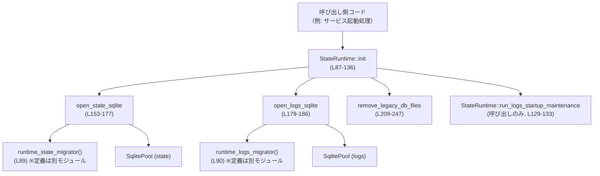
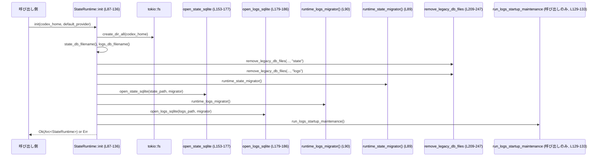
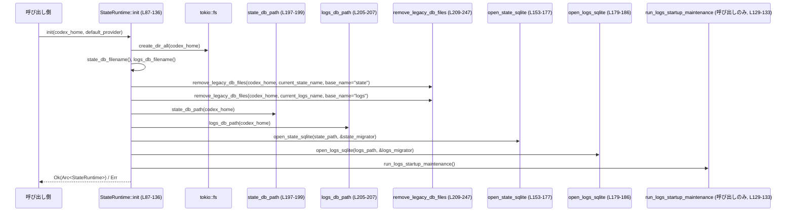

# state/src/runtime.rs コード解説

## 0. ざっくり一言

`StateRuntime` を中心に、Codex の状態データベースとログデータベース（いずれも SQLite）を初期化・マイグレーションし、古い DB ファイルをクリーンアップするランタイム基盤を提供するモジュールです（`runtime.rs:L73-141, L153-207, L209-272`）。

---

## 1. このモジュールの役割

### 1.1 概要

- このモジュールは **Codex の永続状態（state）とログ（logs）を SQLite 上で管理するためのランタイム環境** を構築します（`runtime.rs:L73-79, L81-136`）。
- 具体的には次の機能を提供します：
  - SQLite 接続オプションの共通設定（WAL・busy timeout など）（`runtime.rs:L143-151`）
  - state / logs DB のオープンとマイグレーション実行（`runtime.rs:L153-177, L179-186`）
  - DB ファイル名のバージョン付き生成とパス解決（`runtime.rs:L189-207`）
  - 古いバージョンの DB ファイルとその WAL/ジャーナルの削除（`runtime.rs:L209-247, L249-272`）
  - 初期化済みランタイム `StateRuntime` の提供（`runtime.rs:L73-79, L81-141`）

### 1.2 アーキテクチャ内での位置づけ

`StateRuntime` は Codex の他コンポーネントから共通の状態・ログ DB アクセス基盤として利用される位置づけです。ファイル先頭の `mod` 宣言から、より細かい機能はサブモジュールに分割されています（`runtime.rs:L53-60`）。

- `StateRuntime` 自身は：
  - `state` 用 SQLite プール (`pool`)
  - `logs` 用 SQLite プール (`logs_pool`)
  - DB ファイルのある `codex_home` ディレクトリ
  - `default_provider` 文字列  
  を保持します（`runtime.rs:L73-79`）。

全体の依存関係イメージは次の通りです（この図はこのファイルに現れる依存関係に限定しています）：



> 備考: `run_logs_startup_maintenance` の実装はこのチャンクには現れませんが、`StateRuntime` のメソッドとして非同期に呼び出され、`Result` を返すことが `if let Err(err) = ...` の使用から読み取れます（`runtime.rs:L129-133`）。

また、リモート制御関連の型 `RemoteControlEnrollmentRecord` は `remote_control` サブモジュールから再エクスポートされています（`runtime.rs:L62`）。

### 1.3 設計上のポイント

コードから読み取れる設計上の特徴は次の通りです。

- **責務の分割**
  - このファイルは主に「DB ランタイムの初期化・基盤処理」を担当し、実際の業務ロジック（エージェントジョブ、ログ、メモリ管理、スレッド管理など）はサブモジュールに委譲されています（`runtime.rs:L53-60`）。
- **状態管理**
  - `StateRuntime` 構造体は DB 接続プールと設定値を保持する状態fulなオブジェクトです（`runtime.rs:L73-79`）。
  - クローン可能（`#[derive(Clone)]`）であり、`Arc<SqlitePool>` によって内部プールを複数の `StateRuntime` インスタンス間で共有できます（`runtime.rs:L73-79`）。
- **エラーハンドリング方針**
  - クリティカルな処理（ディレクトリ作成、DB 接続・マイグレーション）は `anyhow::Result` でエラーを呼び出し元に伝播します（`runtime.rs:L81-88, L153-159, L179-185`）。
  - 一部メンテナンス処理（`VACUUM`, `PRAGMA incremental_vacuum`, 古い DB ファイル削除など）は「ベストエフォート」として、失敗時は `warn!` ログにとどめて処理継続します（`runtime.rs:L169-175, L215-223, L239-245, L129-134`）。
- **並行性**
  - `SqlitePoolOptions::max_connections(5)` により同時接続数を制限した接続プールを利用します（`runtime.rs:L155-157, L181-183`）。
  - `journal_mode(WAL)` と `busy_timeout(5秒)` を設定し、WAL 方式による読み取りと書き込みの並行性向上とロック時の待機挙動を制御します（`runtime.rs:L143-151`）。
  - `StateRuntime` 自体は `Arc` でラップされて返されるため、複数タスク・スレッドから共有して利用する前提の設計です（`runtime.rs:L87-88, L123-128`）。

---

## 2. 主要な機能一覧

このファイルが提供する主な機能を列挙します。

- `StateRuntime` の初期化と取得
  - Codex のホームディレクトリ配下に state / logs DB を作成・オープンし、マイグレーションとログ DB のメンテナンスを行う（`runtime.rs:L81-136`）。
- SQLite 接続オプションの共通設定
  - WAL, 自動作成, busy timeout, ログ無効化などの共通設定を行う（`runtime.rs:L143-151`）。
- state / logs DB の接続プール生成
  - state 用 DB（自動バキューム設定・マイグレーション＋PRAGMA調整付き）（`runtime.rs:L153-177`）
  - logs 用 DB（マイグレーションのみ）（`runtime.rs:L179-186`）
- DB ファイル名・パスの解決
  - `STATE_DB_FILENAME` / `STATE_DB_VERSION` などの定数に基づき、バージョン付きファイル名を組み立ててパスを返す（`runtime.rs:L189-207`）。
- 古い DB ファイルのクリーンアップ
  - 現在のバージョン以外の `*.sqlite` と関連する `-wal`, `-shm`, `-journal` を削除する（`runtime.rs:L209-247, L249-272`）。
- ログ保持ポリシーのための定数定義
  - 各ログパーティションあたりの最大容量（10 MiB）と最大行数（1000 行）の制限値を定義（`runtime.rs:L64-71`）。
- マイグレーション互換性テスト
  - 「将来バージョンのマイグレーション履歴」を含む DB に対してもランタイムのマイグレータが動作することを検証するテスト（`runtime.rs:L274-337`）。

---

## 3. 公開 API と詳細解説

### 3.1 型一覧（構造体・列挙体など）

このチャンクに現れる公開型は次の通りです。

| 名前 | 種別 | 役割 / 用途 | 定義位置 |
|------|------|-------------|----------|
| `StateRuntime` | 構造体 | Codex の state / logs SQLite プールや設定値 (`codex_home`, `default_provider`) をまとめたランタイム状態。Clone 可能で、`Arc<SqlitePool>` を通じてプールを共有します。 | `runtime.rs:L73-79` |
| `RemoteControlEnrollmentRecord` | 型（再エクスポート） | リモートコントロール機能に関連する登録情報レコード。`remote_control` サブモジュールから `pub use` されています。実際のフィールド定義はこのチャンクには現れません。 | 再エクスポート宣言 `runtime.rs:L62`（定義本体は別モジュール） |

### 3.2 関数詳細（最大 7 件）

ここでは、公開 API とコアロジックから特に重要な 7 個の関数・メソッドを詳細に説明します。

---

#### `StateRuntime::init(codex_home: PathBuf, default_provider: String) -> anyhow::Result<Arc<Self>>`  

**定義位置:** `runtime.rs:L81-136`  

**概要**

- Codex ホームディレクトリ配下に state / logs の SQLite DB を用意し、それぞれに対してマイグレーションを実行して接続プールを作成します。
- 旧バージョンの DB ファイルを削除し、ログ DB に対して起動時メンテナンス (`run_logs_startup_maintenance`) をベストエフォートで実行したうえで、`Arc<StateRuntime>` を返します。

**引数**

| 引数名 | 型 | 説明 |
|--------|----|------|
| `codex_home` | `PathBuf` | Codex のホームディレクトリ。ここに state / logs の SQLite ファイルを作成します（`runtime.rs:L87-88, L107-108`）。 |
| `default_provider` | `String` | ランタイムに保存されるデフォルトプロバイダ名。用途はこのチャンクには現れませんが、`StateRuntime` のフィールドとして保持されます（`runtime.rs:L76, L123-128`）。 |

**戻り値**

- `Ok(Arc<StateRuntime>)`  
  - state / logs の両 DB が正常にオープン・マイグレーションされた場合に返されます。
- `Err(anyhow::Error)`  
  - ディレクトリ作成 (`create_dir_all`) 失敗
  - state または logs DB のオープン・マイグレーション失敗  
  の場合に返されます（`runtime.rs:L87-88, L109-122`）。

ログ DB の起動時メンテナンスに失敗した場合はエラーを返さず、警告ログを出した上で `Ok` を返します（`runtime.rs:L129-135`）。

**内部処理の流れ**

1. `codex_home` ディレクトリを非同期に作成（既存ならそのまま）（`tokio::fs::create_dir_all`, `runtime.rs:L87-88`）。
2. state/logs 用のランタイムマイグレータを取得（`runtime_state_migrator`, `runtime_logs_migrator`）（`runtime.rs:L89-90`）。
3. 現在のバージョンに対応する state / logs DB ファイル名を生成（`state_db_filename`, `logs_db_filename`）（`runtime.rs:L91-92`）。
4. `remove_legacy_db_files` を 2 回呼び出し、`codex_home` 配下から旧バージョンの state / logs DB ファイルおよびその WAL/ジャーナルを削除（`runtime.rs:L93-106`）。
5. state / logs の DB パスを解決し（`state_db_path`, `logs_db_path`）、それぞれに対して `open_state_sqlite` / `open_logs_sqlite` で接続プールを作成（`runtime.rs:L107-108, L109-122`）。
   - 失敗した場合は `warn!` ログを出力しつつ `Err` として終了（`runtime.rs:L111-114, L118-121`）。
6. `StateRuntime` インスタンスを生成し、2つのプールと設定値を保持する `Arc<Self>` を構築（`runtime.rs:L123-128`）。
7. `run_logs_startup_maintenance` を呼び、ログ DB の起動時メンテナンスを実行（`runtime.rs:L129-133`）。
   - 失敗時は `warn!` を出力して無視（`if let Err(err) = ...`）。
8. 最終的に `Ok(runtime)` を返す（`runtime.rs:L135-136`）。

**Mermaid フロー図（初期化シーケンス）**



**Examples（使用例）**

典型的な起動コードの一部として想定される使用例です。

```rust
use std::path::PathBuf;
use std::sync::Arc;
use state::runtime::StateRuntime; // 実際のクレートパスは仮の例

#[tokio::main] // Tokio ランタイム上で実行
async fn main() -> anyhow::Result<()> {
    // Codex ホームディレクトリとデフォルトプロバイダ名を決める
    let codex_home = PathBuf::from("/var/lib/codex"); // 永続データを置くディレクトリ
    let default_provider = "openai".to_string();      // 例: デフォルトのモデルプロバイダ

    // ランタイムを初期化する（state/logs DB を開く・マイグレーションする）
    let runtime: Arc<StateRuntime> = StateRuntime::init(codex_home, default_provider).await?;

    // codex_home を参照する
    println!("Using codex home at: {}", runtime.codex_home().display());

    Ok(())
}
```

**Errors / Panics**

- `Err(anyhow::Error)` になりうる条件（抜粋）：
  - `tokio::fs::create_dir_all` が失敗（権限不足、パス不正など）（`runtime.rs:L87-88`）。
  - `open_state_sqlite` / `open_logs_sqlite` 内で、SQLite 接続の確立やマイグレーションが失敗（`runtime.rs:L109-115, L116-122`）。
- `panic!` を直接呼び出すコードはこのチャンクには現れません。

**Edge cases（エッジケース）**

- `codex_home` が存在しない場合  
  - `create_dir_all` により作成されます（`runtime.rs:L87-88`）。
- `codex_home` の読み取り権限がない場合  
  - `read_dir` が `Err` を返し、`remove_legacy_db_files` 内で警告ログを出すだけで、その後の処理は続行されます（`runtime.rs:L215-223`）。
- 旧バージョンの DB が大量に存在する場合  
  - `remove_legacy_db_files` により順次削除されますが、個々の `remove_file` 失敗はすべて警告ログにとどまり、初期化自体は継続します（`runtime.rs:L239-245`）。
- `run_logs_startup_maintenance` がエラーを返す場合  
  - 警告ログが出力されるだけで `init` 自体は `Ok(runtime)` を返します（`runtime.rs:L129-135`）。

**使用上の注意点**

- **非同期コンテキスト必須**: `async fn` なので必ず Tokio などの非同期ランタイム上で `.await` する必要があります（`#[tokio::test]` のテストからも tokio 前提であることが読み取れます、`runtime.rs:L294-295`）。
- **エラー処理**: `anyhow::Result` を返すため、起動処理側で `?` もしくは適切なエラーハンドリングを行う必要があります。
- **パフォーマンス**: 初期化時にマイグレーションや `VACUUM`（ベストエフォート）などが動くため、初回起動時やスキーマ変更後の起動では時間がかかる可能性があります（`runtime.rs:L153-177`）。
- **ログメンテナンス失敗**: 起動時メンテナンスが失敗してもランタイムは返されるため、ログ DB の状態が想定通りでない可能性があります。必要であれば呼び出し側でログを監視する必要があります（`runtime.rs:L129-135`）。

---

#### `StateRuntime::codex_home(&self) -> &Path`

**定義位置:** `runtime.rs:L137-140`  

**概要**

- ランタイムが使用している Codex ホームディレクトリへの参照を返します。

**引数**

| 引数名 | 型 | 説明 |
|--------|----|------|
| `&self` | `&StateRuntime` | 共有参照。特別な状態変更は行いません。 |

**戻り値**

- `&Path` — `StateRuntime` が保持している `codex_home` フィールドへの参照（`PathBuf` の内部）を返します（`runtime.rs:L75, L139-140`）。

**内部処理の流れ**

1. `self.codex_home.as_path()` を呼び出して `&Path` を返すだけの薄いラッパーです（`runtime.rs:L139-140`）。

**Examples（使用例）**

```rust
let runtime: Arc<StateRuntime> = /* ... */;
// ランタイムが使用しているホームディレクトリを表示する
println!("Codex home: {}", runtime.codex_home().display());
```

**Errors / Panics**

- エラーやパニックは発生しません（単純なフィールドアクセスのみ）。

**Edge cases**

- `codex_home` が存在しないパスを指していても、このメソッド自体は単にパスを返すだけです。存在確認などは呼び出し側で行う必要があります。

**使用上の注意点**

- 返される `&Path` は `StateRuntime` の内部を指すので、保持期間は `StateRuntime` のライフタイムに依存します。
- `Path` を保持する場合は必要に応じて `to_path_buf()` でコピーを取ると所有権の扱いが単純になります。

---

#### `base_sqlite_options(path: &Path) -> SqliteConnectOptions`

**定義位置:** `runtime.rs:L143-151`  

**概要**

- `state` / `logs` 両方の SQLite 接続に共通する基本オプション（ファイル名、作成フラグ、WAL, synchronous, busy_timeout, ログ出力無効）を設定した `SqliteConnectOptions` を作成します。

**引数**

| 引数名 | 型 | 説明 |
|--------|----|------|
| `path` | `&Path` | 接続先 SQLite ファイルのパス |

**戻り値**

- `SqliteConnectOptions` — 指定パスに対して、次の設定が施されたオプション（`runtime.rs:L143-151`）：
  - `.filename(path)`
  - `.create_if_missing(true)`
  - `.journal_mode(SqliteJournalMode::Wal)`
  - `.synchronous(SqliteSynchronous::Normal)`
  - `.busy_timeout(Duration::from_secs(5))`
  - `.log_statements(LevelFilter::Off)`

**内部処理の流れ**

1. `SqliteConnectOptions::new()` を呼ぶ。
2. チェーンで各オプションを設定し、構築したオプション値を返す。

**使用例**

```rust
use sqlx::sqlite::SqliteConnectOptions;
use std::path::Path;

let path = Path::new("state.sqlite");
let options: SqliteConnectOptions = base_sqlite_options(path);
// ここからさらに auto_vacuum などを設定して使用する
```

**Errors / Panics**

- この関数自体はエラーやパニックを返しません（ただの構造体生成）。

**Edge cases**

- 存在しないディレクトリを含むパスが指定されると、実際の接続時（`connect_with`）にエラーになりますが、この関数の段階では検出されません。

**使用上の注意点**

- ログ出力 (`log_statements`) が `Off` になっているため、SQL 文のログを見たい場合は、呼び出し側で別途設定を変更する必要があります。
- `journal_mode = WAL` と `synchronous = Normal` の組み合わせは、耐障害性よりもパフォーマンス寄りの設定です。

---

#### `open_state_sqlite(path: &Path, migrator: &Migrator) -> anyhow::Result<SqlitePool>`

**定義位置:** `runtime.rs:L153-177`  

**概要**

- state 用 SQLite DB に接続し、マイグレーションを実行した後、`SqlitePool` を返します。
- さらに、`auto_vacuum = INCREMENTAL` が有効でない既存 DB に対しては、`PRAGMA` と `VACUUM` を用いて設定を永続化し、`incremental_vacuum` をベストエフォートで実行します。

**引数**

| 引数名 | 型 | 説明 |
|--------|----|------|
| `path` | `&Path` | state DB の SQLite ファイルパス（`runtime.rs:L153-155`）。 |
| `migrator` | `&Migrator` | 実行するマイグレーション定義（`sqlx::migrate::Migrator`）。`runtime_state_migrator()` から渡されます（`runtime.rs:L89`）。 |

**戻り値**

- `Ok(SqlitePool)` — 接続・マイグレーション・PRAGMA 実行が成功した場合。
- `Err(anyhow::Error)` — 途中の `?` で発生する任意のエラー（接続・マイグレーション・`PRAGMA auto_vacuum` 実行）を内包します（`runtime.rs:L155-162`）。

**内部処理の流れ**

1. `base_sqlite_options(path)` を呼び出し、`auto_vacuum(SqliteAutoVacuum::Incremental)` を設定（`runtime.rs:L154`）。
2. `SqlitePoolOptions::new().max_connections(5).connect_with(options).await?` で接続プールを生成（`runtime.rs:L155-158`）。
3. `migrator.run(&pool).await?` でマイグレーションを実行（`runtime.rs:L159`）。
4. `PRAGMA auto_vacuum` の現在値を取得し（`sqlx::query_scalar`, `runtime.rs:L160-162`）、`INCREMENTAL` でなければ：
   - `PRAGMA auto_vacuum = INCREMENTAL` を実行（`runtime.rs:L163-168`）。
   - ロック取得に失敗してもよいという前提で `VACUUM` をベストエフォートで実行（エラーは無視）（`runtime.rs:L169-171`）。
5. 最後に `PRAGMA incremental_vacuum` をベストエフォートで実行（こちらもエラーは無視）（`runtime.rs:L172-175`）。
6. `Ok(pool)` を返す（`runtime.rs:L176-177`）。

**Examples（使用例）**

通常は `StateRuntime::init` からのみ呼ばれますが、単体で使用する場合の例を示します。

```rust
use sqlx::migrate::Migrator;
use sqlx::SqlitePool;
use std::path::Path;

// 例: ランタイム用マイグレータを取得（実際の定義は別モジュール）
let migrator: Migrator = runtime_state_migrator(); // runtime.rs:L89 参照
let path = Path::new("state_1.sqlite");

let pool: SqlitePool = open_state_sqlite(path, &migrator).await?;
```

**Errors / Panics**

- `connect_with(options).await?` で:
  - DB ファイルの作成・オープンに失敗した場合（パス不正・権限不足など）。
- `migrator.run(&pool).await?` で:
  - スキーマ不整合、既存テーブルとの競合などでマイグレーションが失敗した場合。
- `PRAGMA auto_vacuum` の取得に失敗すると、その時点で `Err` を返します（`runtime.rs:L160-162`）。

`VACUUM` と `PRAGMA incremental_vacuum` の失敗は無視されます（`let _ = ...`）。

**Edge cases**

- 既存 DB で `auto_vacuum != INCREMENTAL` の場合  
  - 起動時に `PRAGMA auto_vacuum = INCREMENTAL; VACUUM;` が（ベストエフォートで）走り、ヘッダに設定が永続化されます（`runtime.rs:L163-171`）。
- DB ロック競合で `VACUUM` / `incremental_vacuum` が実行できない場合  
  - コメントにある通り「次回起動時に再試行」とする設計で、エラーは無視します（`runtime.rs:L169-170, L172-175`）。

**使用上の注意点**

- **並行性とロック**: `VACUUM` は排他的なロックを必要とするため、同時接続が多い環境では一時的にブロックが発生する可能性があります。そのためベストエフォートで失敗を許容する設計になっています。
- **マイグレーションとの整合性**: テストコードから、ランタイム側のマイグレータは「将来バージョンのマイグレーション」が存在しても動作するよう緩和されていることがわかります（`runtime.rs:L295-337`）。

---

#### `open_logs_sqlite(path: &Path, migrator: &Migrator) -> anyhow::Result<SqlitePool>`

**定義位置:** `runtime.rs:L179-186`  

**概要**

- ログ用 SQLite DB に接続し、マイグレーションを実行した後、`SqlitePool` を返します。
- state DB と異なり、追加の `PRAGMA` や `VACUUM` は実行しません。

**引数・戻り値**

`open_state_sqlite` と同様ですが、`auto_vacuum` 後の `PRAGMA` 系が存在しません（`runtime.rs:L179-186`）。

**内部処理の流れ**

1. `base_sqlite_options(path).auto_vacuum(SqliteAutoVacuum::Incremental)` を設定（`runtime.rs:L180`）。
2. `SqlitePoolOptions::new().max_connections(5).connect_with(options).await?` で接続プールを生成（`runtime.rs:L181-183`）。
3. `migrator.run(&pool).await?` でマイグレーションを実行（`runtime.rs:L184-185`）。
4. `Ok(pool)` を返す（`runtime.rs:L186`）。

**使用上の注意点**

- ログ DB に対する自動バキュームやサイズ管理は、おそらく別のメンテナンス機構（`run_logs_startup_maintenance` や `logs` サブモジュール）が担当していると推測されますが、このチャンクには実装は現れません。

---

#### `db_filename(base_name: &str, version: u32) -> String`

**定義位置:** `runtime.rs:L189-191`  

**概要**

- `"{base_name}_{version}.sqlite"` という形式の DB ファイル名を生成するヘルパー関数です。

**引数**

| 引数名 | 型 | 説明 |
|--------|----|------|
| `base_name` | `&str` | ベース名（例: `STATE_DB_FILENAME` や `LOGS_DB_FILENAME`）。 |
| `version` | `u32` | バージョン番号（例: `STATE_DB_VERSION`）。 |

**戻り値**

- `String` — `format!("{base_name}_{version}.sqlite")` によるファイル名（`runtime.rs:L190`）。

**使用例**

```rust
let name = db_filename("state", 3);
assert_eq!(name, "state_3.sqlite");
```

**使用上の注意点**

- `remove_legacy_db_files` / `should_remove_db_file` はこの命名規則を前提に旧バージョンの DB を判定しているため、命名規則を変更する場合はそちらのロジックも合わせて確認する必要があります（`runtime.rs:L249-272`）。

---

#### `state_db_path(codex_home: &Path) -> PathBuf` / `logs_db_path(codex_home: &Path) -> PathBuf`

**定義位置:** `runtime.rs:L197-199, L205-207`  

**概要**

- Codex ホームディレクトリとバージョン付きファイル名を結合して、state / logs の DB ファイルパスを生成するユーティリティです。

**引数**

| 関数 | 引数名 | 型 | 説明 |
|------|--------|----|------|
| `state_db_path` | `codex_home` | `&Path` | Codex ホームディレクトリ（`runtime.rs:L197`）。 |
| `logs_db_path`  | `codex_home` | `&Path` | 同上（`runtime.rs:L205`）。 |

**戻り値**

- いずれも `PathBuf` — `codex_home.join(state_db_filename())` または `codex_home.join(logs_db_filename())` の結果（`runtime.rs:L198-199, L206-207`）。

**使用例**

```rust
use std::path::Path;

let home = Path::new("/var/lib/codex");
let state_path = state_db_path(home);
let logs_path = logs_db_path(home);
```

**使用上の注意点**

- 返されるパスが存在するかどうかは保証しません。実際の作成・オープンは `open_state_sqlite` / `open_logs_sqlite` や `SqlitePool::connect_with` が行います。

---

#### `remove_legacy_db_files(codex_home: &Path, current_name: &str, base_name: &str, db_label: &str)`

**定義位置:** `runtime.rs:L209-247`  

**概要**

- 指定された `codex_home` ディレクトリ配下から、現在使用している DB ファイル（`current_name`）以外の旧バージョン DB と、その SQLite 補助ファイル（`-wal`, `-shm`, `-journal`）を削除します。
- 削除すべきかどうかの判定には `should_remove_db_file` を利用します（`runtime.rs:L236-237`）。

**引数**

| 引数名 | 型 | 説明 |
|--------|----|------|
| `codex_home` | `&Path` | DB ファイルが存在するディレクトリ。 |
| `current_name` | `&str` | 現在使用中のファイル名（例: `"state_3.sqlite"`）。 |
| `base_name` | `&str` | ベース名（例: `"state"`）。 |
| `db_label` | `&str` | ログ出力用ラベル（`"state"` や `"logs"`）。 |

**戻り値**

- `()`（非公開 `async fn`）であり、エラーは返しません。エラーはすべて `warn!` ログに記録されます（`runtime.rs:L215-223, L239-245`）。

**内部処理の流れ**

1. `tokio::fs::read_dir(codex_home).await` でディレクトリエントリのイテレータを取得。
   - 失敗した場合は `warn!` を出力して即 return（`runtime.rs:L215-223`）。
2. `while let Ok(Some(entry)) = entries.next_entry().await` で非同期にエントリを列挙（`runtime.rs:L225`）。
3. 各エントリについて `entry.file_type().await` でファイル種別を取得し、ファイルでなければスキップ（`runtime.rs:L226-233`）。
4. ファイル名を `OsString` から `String` に変換（`to_string_lossy`）し、`should_remove_db_file` で削除対象かどうかを判定（`runtime.rs:L234-237`）。
5. 削除対象なら `tokio::fs::remove_file(&legacy_path).await` を試み、失敗したら `warn!` を出力（`runtime.rs:L239-245`）。

**Errors / Panics**

- 関数シグネチャ上エラーは返さず、すべて内部で `warn!` ログに記録して終了します。

**Edge cases**

- `codex_home` が存在しない・読み取れない  
  → `read_dir` が失敗し、警告ログだけ出して終了（`runtime.rs:L215-223`）。
- ファイル種別取得 (`file_type().await`) が失敗した場合  
  → `unwrap_or(false)` によりファイルでないものとして扱われ、削除は行われません（`runtime.rs:L227-231`）。
- 削除対象ファイルが他プロセスによりすでに削除されている場合  
  → `remove_file` が失敗し、警告ログが出るのみ（`runtime.rs:L239-245`）。

**使用上の注意点**

- 削除対象の判定ロジックは `should_remove_db_file` に依存しており、命名規則変更時はこの関数と合わせて変更・確認する必要があります。
- エラーが無視されるため、確実なクリーンアップを保証したい場合は別途検証やログ監視が必要です。

---

#### `should_remove_db_file(file_name: &str, current_name: &str, base_name: &str) -> bool`

**定義位置:** `runtime.rs:L249-272`  

**概要**

- 与えられた `file_name` が、現在使用している DB 以外の「旧バージョン DB ファイル」またはその補助ファイル（`-wal`, `-shm`, `-journal`）かどうかを判定します。
- `remove_legacy_db_files` からのみ使用されます（`runtime.rs:L236-237`）。

**引数**

| 引数名 | 型 | 説明 |
|--------|----|------|
| `file_name` | `&str` | ディレクトリ内のエントリ名（拡張子・サフィックス付き）。 |
| `current_name` | `&str` | 現在使用中の DB ファイル名（例: `"state_3.sqlite"`）。 |
| `base_name` | `&str` | DB ベース名（例: `"state"`）。 |

**戻り値**

- `true` — 旧バージョン DB またはその補助ファイルと判定された場合に削除対象。
- `false` — 現行 DB または無関係なファイルと判定された場合。

**内部処理の流れ**

1. `normalized_name` を `file_name` で初期化（`runtime.rs:L250`）。
2. サフィックス `["-wal", "-shm", "-journal"]` のいずれかで終わる場合、それを取り除いた名前を `normalized_name` とする（`runtime.rs:L251-255`）。
3. `normalized_name == current_name` なら削除不要として `false` を返す（`runtime.rs:L257-259`）。
   - これにより現行 DB とその `-wal` / `-shm` / `-journal` は残されます。
4. `unversioned_name = format!("{base_name}.sqlite")` に一致する場合は「旧形式の unversioned DB」とみなし `true` を返す（`runtime.rs:L260-263`）。
5. それ以外については、
   - `normalized_name` が `"{base_name}_"` で始まるか確認（`strip_prefix`、`runtime.rs:L264-266`）。
   - 末尾が `.sqlite` で終わるか確認し、`.sqlite` を除いた部分を `version_suffix` とする（`runtime.rs:L268-270`）。
   - `version_suffix` が空でなく、すべて ASCII 数字なら `true`、そうでなければ `false`（`runtime.rs:L271-272`）。

**Edge cases**

- `state.sqlite-wal`  
  - サフィックス `-wal` を除くと `state.sqlite` になり、`unversioned_name` と一致するため `true`。
- `state_2.sqlite-wal`（current_name = `state_3.sqlite`）  
  - サフィックス除去 → `state_2.sqlite`。
  - current_name と不一致。
  - `base_name_` プレフィックス + 数値版サフィックス → `true`。
- `state_3.sqlite-wal`（current_name = `state_3.sqlite`）  
  - サフィックス除去 → `state_3.sqlite`。
  - current_name と一致するため `false`。
- 無関係なファイル（例: `notes.txt`）  
  - プレフィックス/サフィックスが合致しないため `false`。

**使用上の注意点**

- 命名規則が変更された場合、この判定ロジックが期待通り動作しなくなる可能性があります。
- ディレクトリ内にユーザー独自の `.sqlite` ファイルがあると、その名前によっては削除対象になる可能性があります。`codex_home` はこのアプリ専用ディレクトリである前提の設計です。

---

### 3.3 その他の関数

ここまでで詳細解説しなかった補助的な関数やテスト関数を一覧にします。

| 関数名 | シグネチャ / 種別 | 役割（1 行） | 定義位置 |
|--------|-------------------|--------------|----------|
| `state_db_filename` | `pub fn state_db_filename() -> String` | `STATE_DB_FILENAME` と `STATE_DB_VERSION` から state DB のバージョン付きファイル名を生成（`db_filename` の薄いラッパー）。 | `runtime.rs:L193-195` |
| `logs_db_filename` | `pub fn logs_db_filename() -> String` | `LOGS_DB_FILENAME` と `LOGS_DB_VERSION` から logs DB のバージョン付きファイル名を生成。 | `runtime.rs:L201-203` |
| `open_db_pool` | `async fn open_db_pool(path: &Path) -> SqlitePool`（テスト用） | テスト用に `create_if_missing(false)` で SQLite プールを開くヘルパー。 | `runtime.rs:L285-293` |
| `open_state_sqlite_tolerates_newer_applied_migrations` | `#[tokio::test] async fn ...()` | ランタイムのマイグレータが「将来バージョンのマイグレーション記録」を許容することを検証する統合テスト。 | `runtime.rs:L294-337` |

---

## 4. データフロー

ここでは、代表的なシナリオとして **アプリケーション起動時のランタイム初期化** におけるデータフローを説明します。

### 4.1 起動時の初期化フロー

- 入力：`codex_home`（ホームディレクトリのパス）、`default_provider`（文字列）。
- 処理：
  1. ディレクトリを作成。
  2. バージョン付きファイル名を決定。
  3. 旧バージョン DB を削除。
  4. state / logs DB の接続プールを作成し、マイグレーション実行。
  5. ログ DB の起動時メンテナンスを実行。
- 出力：`Arc<StateRuntime>`（state / logs プールと設定値を保持）。



このフローから、**ファイルシステム I/O（`tokio::fs`）と DB I/O（`sqlx`）が非同期で行われている**こと、また **エラーの扱いが処理ごとに異なる**ことがわかります：

- ディレクトリ作成・DB オープン・マイグレーション：`Result` で失敗を通知。
- 旧 DB 削除・VACUUM・ログ起動メンテナンス：`warn!` ログのみにとどめて処理継続。

---

## 5. 使い方（How to Use）

### 5.1 基本的な使用方法

もっとも典型的な利用は、「アプリ起動時に `StateRuntime` を初期化し、他のコンポーネントに渡して使う」パターンです。

```rust
use std::path::PathBuf;
use std::sync::Arc;
// use crate::state::runtime::StateRuntime; // 実際のパスはプロジェクト構成による

#[tokio::main] // Tokio ランタイムを起動
async fn main() -> anyhow::Result<()> {
    // Codex ホームディレクトリを決定する
    let codex_home = PathBuf::from("/var/lib/codex");      // 永続データ置き場
    let default_provider = "openai".to_string();           // デフォルトプロバイダ名

    // ランタイムを初期化（DB 作成・マイグレーション・旧 DB クリーンアップ）
    let runtime: Arc<StateRuntime> =
        StateRuntime::init(codex_home, default_provider).await?; // runtime.rs:L87-136

    // codex_home を使う例
    println!("Codex home: {}", runtime.codex_home().display());  // runtime.rs:L137-140

    // ここから先は runtime を他のサービスやハンドラに注入して利用する想定
    // 例: run_server(runtime.clone()).await?;

    Ok(())
}
```

### 5.2 よくある使用パターン

1. **複数タスクからの共有**

   `StateRuntime::init` は `Arc<StateRuntime>` を返すため、そのままクローンして複数タスクから利用できます。

   ```rust
   let runtime = StateRuntime::init(codex_home, default_provider).await?;
   let r1 = runtime.clone(); // Arc のクローンは軽量
   let r2 = runtime.clone();

   let h1 = tokio::spawn(async move {
       // r1 を用いた処理
   });
   let h2 = tokio::spawn(async move {
       // r2 を用いた処理
   });

   h1.await?;
   h2.await?;
   ```

   このとき `SqlitePool` は内部で接続プールを共有しているため、複数タスクからの同時クエリが可能です（`runtime.rs:L73-79`）。

2. **DB パスを明示的に参照する**

   テストやデバッグ時には、`state_db_path` や `logs_db_path` を使って実際の DB ファイル位置を確認できます（`runtime.rs:L197-199, L205-207`）。

   ```rust
   let home = PathBuf::from("/tmp/codex");
   let state_path = state_db_path(&home);
   println!("State DB path: {}", state_path.display());
   ```

### 5.3 よくある間違い

```rust
// 間違い例: 同期コンテキストで .await しようとしている
// fn main() {
//     let runtime = StateRuntime::init(PathBuf::from("/var/lib/codex"), "openai".into()).await;
// }

// 正しい例: Tokio ランタイム上で async main として実行する
#[tokio::main]
async fn main() -> anyhow::Result<()> {
    let runtime = StateRuntime::init(PathBuf::from("/var/lib/codex"), "openai".into()).await?;
    Ok(())
}
```

```rust
// 間違い例: codex_home として他用途のディレクトリを指定してしまう
let codex_home = PathBuf::from(".");

let runtime = StateRuntime::init(codex_home, "openai".into()).await?;
// → カレントディレクトリ直下に state/logs の SQLite ファイルや古い DB の削除が行われる

// 正しい例: 専用のアプリケーションデータディレクトリを用意する
let codex_home = PathBuf::from("/var/lib/codex"); // もしくは XDG/OS 標準のアプリデータディレクトリ
```

### 5.4 使用上の注意点（まとめ）

- **専用ディレクトリの利用**  
  `remove_legacy_db_files` は `codex_home` 配下の `*.sqlite` とその `-wal` / `-shm` / `-journal` を命名規則に従って削除します（`runtime.rs:L209-247, L249-272`）。他の用途の `.sqlite` ファイルを置かない前提で利用するのが安全です。
- **非同期 I/O 前提**  
  すべてのファイルアクセスと DB 接続は `tokio` + `sqlx` の非同期 API を用いているため、同期コードから呼び出す場合は適切にランタイムを構築する必要があります（`runtime.rs:L87-88, L153-159, L179-185, L225-231`）。
- **ベストエフォート処理の存在**  
  `VACUUM` や旧 DB 削除、ログ起動メンテナンスは失敗してもエラーは返らず警告ログのみにとどまります（`runtime.rs:L169-175, L215-223, L239-245, L129-135`）。ディスク容量管理などを厳密に行いたい場合はログを監視し、必要に応じて追加のメンテナンスを検討する必要があります。
- **マイグレーション互換性**  
  テストから、「将来バージョンのマイグレーション記録を含む DB」に対してもランタイムのマイグレータが動作することが確認されています（`runtime.rs:L295-337`）。ダウングレード環境でも起動できるよう配慮された設計です。

---

## 6. 変更の仕方（How to Modify）

### 6.1 新しい機能を追加する場合

このモジュールに新しい機能（例: 新しい種類の SQLite DB や、追加のメンテナンスロジック）を追加する場合の一般的な流れです。

1. **DB ファイル名・パスの定義を追加**
   - 新しい DB 用に `*_DB_FILENAME` / `*_DB_VERSION` のような定数を crate ルート側に追加し（このチャンクには定義はありませんが `STATE_DB_FILENAME` などと同様の形です、`runtime.rs:L13-14, L8-9`）、`db_filename` を用いてファイル名を生成する関数を追加します（`runtime.rs:L189-195, L201-203`）。
2. **パス解決関数を追加**
   - `state_db_path` / `logs_db_path` と同様に、新しい DB 用の `*_db_path` 関数を追加します（`runtime.rs:L197-199, L205-207`）。
3. **接続ロジックの追加**
   - `open_state_sqlite` / `open_logs_sqlite` を参考に、必要な `PRAGMA` や `auto_vacuum` 設定を行うオープン関数を追加します（`runtime.rs:L153-177, L179-186`）。
4. **旧ファイルクリーンアップへの統合**
   - `remove_legacy_db_files` / `should_remove_db_file` は `base_name` を引数で受け取る汎用設計なので、新しいベース名を指定して呼び出すだけで既存ロジックを流用可能です（`runtime.rs:L209-247, L249-272`）。
5. **`StateRuntime` への統合**
   - 新しい DB プールを `StateRuntime` のフィールドとして加える場合は、`StateRuntime` 構造体と `init` のフィールド初期化部分を拡張します（`runtime.rs:L73-79, L123-128`）。

### 6.2 既存の機能を変更する場合

変更時に確認すべき点を整理します。

- **命名規則の変更**（`db_filename` / `*_db_filename` / `should_remove_db_file`）
  - 影響範囲: 旧 DB の削除ロジック、今後のバージョンアップ時のファイルクリーンアップ挙動。
  - 変更時には `should_remove_db_file` の判定条件（`base_name_数字.sqlite` 形式）と整合性が取れているか確認する必要があります（`runtime.rs:L249-272`）。
- **マイグレーションポリシーの変更**
  - `runtime_state_migrator` / `runtime_logs_migrator` の実装は別モジュールですが、テスト `open_state_sqlite_tolerates_newer_applied_migrations` がマイグレータの互換性契約を表しています（「新しいマイグレーションが適用済みでもランタイムは動く」）（`runtime.rs:L295-337`）。
  - これを崩さないように変更する場合は、テストを更新または追加する必要があります。
- **VACUUM / 自動バキュームの変更**
  - `open_state_sqlite` の `auto_vacuum` / `VACUUM` / `incremental_vacuum` 呼び出しはディスク使用量とパフォーマンスに影響します（`runtime.rs:L154-175`）。
  - 変更時には、ロック時間・起動時間・ディスク消費のトレードオフを考慮する必要があります。

---

## 7. 関連ファイル

このモジュールと密接に関係するモジュール・ファイル（コード内に名前が現れるもの）を列挙します。

| パス / モジュール | 役割 / 関係 |
|------------------|------------|
| `crate::migrations::runtime_state_migrator` | state DB 用のマイグレーションを定義する `Migrator` を返す関数。`StateRuntime::init` およびテストから利用されます（`runtime.rs:L21, L89, L277, L331`）。実装はこのチャンクには現れません。 |
| `crate::migrations::runtime_logs_migrator` | logs DB 用のマイグレーションを定義する `Migrator` を返す関数。`StateRuntime::init` で利用されます（`runtime.rs:L20, L90`）。 |
| `crate::migrations::STATE_MIGRATOR` | より「厳密な」マイグレータ。テスト `open_state_sqlite_tolerates_newer_applied_migrations` 内で使用され、将来バージョンのマイグレーションをエラーとして検出することが確認されています（`runtime.rs:L280, L308-329`）。 |
| `crate::STATE_DB_FILENAME`, `crate::STATE_DB_VERSION` | state DB のベース名とバージョン。`state_db_filename` を通じてファイル名生成に使用されます（`runtime.rs:L13-14, L193-195`）。 |
| `crate::LOGS_DB_FILENAME`, `crate::LOGS_DB_VERSION` | logs DB のベース名とバージョン。`logs_db_filename` で使用されます（`runtime.rs:L8-9, L201-203`）。 |
| `mod agent_jobs`, `mod backfill`, `mod logs`, `mod memories`, `mod remote_control`, `mod threads` | `StateRuntime` を補完する各種機能モジュール。具体的な内容はこのチャンクには現れませんが、`runtime.rs` から宣言されています（`runtime.rs:L53-60`）。 |
| `remote_control::RemoteControlEnrollmentRecord` | リモート制御機能に関する型であり、本ファイルから `pub use` されています（`runtime.rs:L62`）。 |

> 備考: 多数の `use crate::...` がファイル先頭に存在しますが（`runtime.rs:L1-51`）、それらの多くはサブモジュール側で `super::*` を通じて利用されることが想定されます。このチャンクに含まれるコード範囲では、直接の使用箇所が現れないものもあります。
