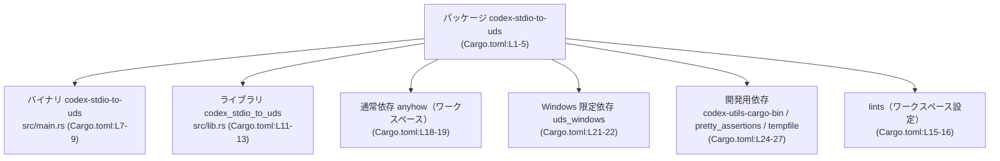
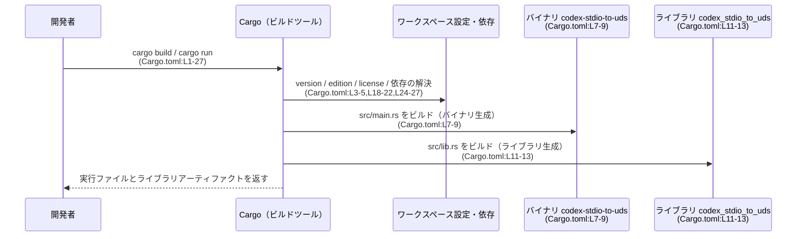

# stdio-to-uds/Cargo.toml コード解説

## 0. ざっくり一言

`stdio-to-uds/Cargo.toml` は、パッケージ `codex-stdio-to-uds` の **Cargo マニフェスト**であり、パッケージメタデータ、バイナリ／ライブラリターゲット、および依存クレート（通常・Windows 限定・開発用）を定義しています（`Cargo.toml:L1-27`）。

---

## 1. このモジュールの役割

### 1.1 概要

- このファイルは Rust のビルドツール Cargo に、次の情報を提供します。
  - パッケージ名とワークスペース由来の `version`・`edition`・`license`（`Cargo.toml:L1-5`）
  - メインのバイナリターゲット `codex-stdio-to-uds`（`Cargo.toml:L7-9`）
  - ライブラリターゲット `codex_stdio_to_uds`（`Cargo.toml:L11-13`）
  - ワークスペース共通の lints 設定を利用する指定（`Cargo.toml:L15-16`）
  - 通常依存・Windows 限定依存・開発用依存クレートの宣言（`Cargo.toml:L18-22,L24-27`）

このファイル自体には Rust コードや実行ロジックは含まれず、公開 API やエラー処理・並行性の詳細は読み取れません。

### 1.2 アーキテクチャ内での位置づけ

Cargo マニフェストとして、ソースコード（`src/main.rs` と `src/lib.rs`）および依存クレートの **ビルド単位の関係** を定義しています。



- パッケージ `codex-stdio-to-uds` が、バイナリ・ライブラリ・各種依存を束ねるルートになります（`Cargo.toml:L1-5`）。
- Windows 以外の OS では `uds_windows` 依存はビルドに含まれず、Windows のみ追加されます（`Cargo.toml:L21-22`）。

### 1.3 設計上のポイント

このファイルから読み取れる設計上の特徴は次のとおりです。

- **ワークスペース前提の設計**  
  - `version.workspace = true`・`edition.workspace = true`・`license.workspace = true` により、これらの値をワークスペースのルート設定に委譲しています（`Cargo.toml:L3-5`）。
  - `anyhow` や `uds_windows` なども `workspace = true` で指定されており、バージョンや詳細はワークスペース側に集約されています（`Cargo.toml:L19,L22,L25-27`）。

- **バイナリ + ライブラリ構成**  
  - 同一パッケージ内に `[[bin]]` と `[lib]` を両方定義し、実行可能バイナリとライブラリの両方を生成する構成になっています（`Cargo.toml:L7-13`）。
  - バイナリがライブラリを利用しているかどうかは、このファイルからは分かりません。

- **OS ごとの依存切り替え**  
  - `[target.'cfg(target_os = "windows")'.dependencies]` セクションにより、Windows ビルドにのみ追加される依存 `uds_windows` が定義されています（`Cargo.toml:L21-22`）。  
  - これにより、他 OS で不要な依存を避ける構成になっています。

- **安全性・エラー・並行性**  
  - これらはすべてソースコード側の実装に依存しており、この `Cargo.toml` からはポリシーや具体的な挙動は読み取れません。

---

## 2. 主要な機能（コンポーネント）一覧

### 2.1 コンポーネントインベントリー

このファイルが定義している主なビルドコンポーネントを一覧にします。

| コンポーネント | 種別 | 内容 | 根拠 |
|---------------|------|------|------|
| `codex-stdio-to-uds` | パッケージ | ワークスペース内パッケージ。名前のみこのファイルで指定し、バージョン・edition・license はワークスペース設定から継承 | `Cargo.toml:L1-5` |
| `codex-stdio-to-uds` | バイナリターゲット | エントリポイント `src/main.rs` を持つバイナリ | `Cargo.toml:L7-9` |
| `codex_stdio_to_uds` | ライブラリターゲット | ルート `src/lib.rs` を持つライブラリ | `Cargo.toml:L11-13` |
| `lints` | ワークスペース lints 設定 | lints 設定をワークスペース共通設定から利用する指定 | `Cargo.toml:L15-16` |
| `anyhow` | 通常依存（ワークスペース定義） | ワークスペースでバージョン等が定義される依存クレート | `Cargo.toml:L18-19` |
| `uds_windows` | Windows 限定依存（ワークスペース定義） | Windows OS ビルド時のみ追加される依存クレート | `Cargo.toml:L21-22` |
| `codex-utils-cargo-bin` / `pretty_assertions` / `tempfile` | 開発用依存（ワークスペース定義） | テスト・開発時に使用されるクレート群。詳細な用途はこのファイルからは不明 | `Cargo.toml:L24-27` |

### 2.2 このファイルが提供する「機能」

- パッケージメタデータの宣言（`[package]`）（`Cargo.toml:L1-5`）
- バイナリターゲットの定義（`[[bin]]`）（`Cargo.toml:L7-9`）
- ライブラリターゲットの定義（`[lib]`）（`Cargo.toml:L11-13`）
- ワークスペース共通 lints の有効化（`[lints]`）（`Cargo.toml:L15-16`）
- 通常依存クレートの宣言（`[dependencies]`）（`Cargo.toml:L18-19`）
- Windows 限定依存クレートの宣言（`[target.'cfg(target_os = "windows")'.dependencies]`）（`Cargo.toml:L21-22`）
- 開発用依存クレートの宣言（`[dev-dependencies]`）（`Cargo.toml:L24-27`）

---

## 3. 公開 API と詳細解説

このファイルは Cargo の設定ファイルであり、**Rust の型定義や関数定義は一切含まれていません**。  
したがって、「公開 API」「コアロジック」「関数詳細」は、このファイル単体からは説明できません。

### 3.1 型一覧（構造体・列挙体など）

| 名前 | 種別 | 役割 / 用途 |
|------|------|-------------|
| (なし) | - | このファイルには Rust の構造体・列挙体定義は存在しません。Cargo 設定のみが記述されています。`Cargo.toml:L1-27` |

### 3.2 関数詳細

- Rust の関数定義は 1 つも存在しません（`Cargo.toml:L1-27`）。
- 安全性（`unsafe` の使用など）やエラー処理、並行性制御の詳細は、`src/main.rs` や `src/lib.rs` の実コード側に依存し、このチャンクには現れません。

### 3.3 その他の関数

- 該当なしです。

---

## 4. データフロー

ここでは、**ビルド時** にこの `Cargo.toml` がどのように利用されるかという観点で、概念的なデータフローを示します。

### 4.1 ビルド時の処理シナリオ

1. 開発者が `cargo build` や `cargo run` などを実行すると、Cargo はこの `Cargo.toml` を読み込みます（`Cargo.toml:L1-27`）。
2. Cargo は `[package]` セクションでパッケージ名等を認識し、ワークスペースのルート設定から `version`・`edition`・`license` を取得します（`Cargo.toml:L1-5`）。
3. `[[bin]]` と `[lib]` セクションから、`src/main.rs` と `src/lib.rs` をビルドターゲットとして決定します（`Cargo.toml:L7-13`）。
4. `[dependencies]` と `[target.'cfg(target_os = "windows")'.dependencies]` を基に、通常依存と Windows 限定依存を解決・ビルドします（`Cargo.toml:L18-22`）。
5. `[dev-dependencies]` はテスト実行や開発時にのみ利用されます（`Cargo.toml:L24-27`）。

### 4.2 シーケンス図（ビルドフロー）



- バイナリがライブラリを呼び出すかどうか、どのようなデータがやりとりされるかは、このファイルからは判断できません。

---

## 5. 使い方（How to Use）

### 5.1 基本的な使用方法

このパッケージをビルド・実行する際の基本的なコマンド例を示します。  
パッケージ名は `[package]` セクションで `codex-stdio-to-uds` と定義されています（`Cargo.toml:L2`）。

```bash
# ワークスペース全体から、このパッケージだけをビルドする例
cargo build -p codex-stdio-to-uds

# バイナリターゲット codex-stdio-to-uds を実行する例
cargo run -p codex-stdio-to-uds -- [バイナリに渡す引数...]
```

- バイナリ名とパッケージ名が同一であることが、このファイルから分かります（`Cargo.toml:L2,L8`）。

### 5.2 よくある使用パターン

- **通常の依存追加**  
  新しい依存クレートをワークスペース経由で追加する場合、ワークスペース側にクレートを定義し、本ファイル側では次のように `workspace = true` で参照するパターンが想定されます。

```toml
[dependencies]
anyhow = { workspace = true }              # 既存（Cargo.toml:L18-19）
# new_dep = { workspace = true }          # 新規に追加する場合の例（仮）
```

（コメントの `new_dep` は説明用であり、このチャンクの実コードには登場しません。）

- **OS 限定の依存追加**  
  OS によって利用する依存を切り替えるパターンとして、すでに Windows 向けの `uds_windows` が定義されています（`Cargo.toml:L21-22`）。  
  他 OS 向け依存を追加する場合も、類似の `[target.'cfg(...)'.dependencies]` ブロックを追加する形が一般的です。

### 5.3 よくある間違い（このファイルから推測できる範囲）

この `Cargo.toml` から想定される、設定周りの誤り例と正しい形を示します。

```toml
# 間違い例: Windows 限定依存を通常依存に書いてしまう
[dependencies]
uds_windows = { workspace = true }  # 本来 Windows 限定にしたい場合には不適切

# 正しい例: OS 限定セクションに記述する
[target.'cfg(target_os = "windows")'.dependencies]
uds_windows = { workspace = true }  # 実際のコード（Cargo.toml:L21-22）
```

- 上記は Cargo の一般的な使い方に基づく例であり、このパッケージの具体的な利用コードはこのチャンクには現れません。

### 5.4 使用上の注意点（まとめ）

- **安全性・エラー・並行性**  
  - これらはソースコード（`src/main.rs`・`src/lib.rs` 等）に依存し、`Cargo.toml` からは詳細不明です。
- **ワークスペース依存**  
  - `version`・`edition`・`license`・依存クレートはワークスペース設定に依存しているため、ワークスペース側を変更するとこのパッケージにも影響します（`Cargo.toml:L3-5,L19,L22,L25-27`）。
- **OS ごとの依存**  
  - `uds_windows` は Windows ビルドでしか取得されないため、他 OS で同等機能が必要な場合は別途依存を定義する必要があります（設定レベルの話であり、実装内容はこのチャンクからは不明です）。

---

## 6. 変更の仕方（How to Modify）

### 6.1 新しい機能を追加する場合（設定レベル）

このファイルに関する「新機能追加」は、主にビルド構成や依存の追加になります。

- **新しい依存クレートを追加する場合**
  1. ワークスペースのルート `Cargo.toml` などに対象クレートとバージョンを追加する。
  2. 本ファイルの `[dependencies]` もしくは OS 限定の `[target.'cfg(...)'.dependencies]` に  
     `crate_name = { workspace = true }` のようなエントリを追加する（`Cargo.toml:L18-22` を参考）。

- **新しいバイナリターゲットを追加する場合**
  1. 新しいエントリポイントファイル（例: `src/bin/other_main.rs`）を作成する。
  2. このファイルに新たな `[[bin]]` セクションを追加し、`name` と `path` を指定する。  
     既存の `[[bin]]` セクション（`Cargo.toml:L7-9`）が参考になります。

- **ライブラリ機能の拡張**
  - ライブラリ自体の API 追加は `src/lib.rs` 側の作業であり、この `Cargo.toml` 側では `[lib]` セクションを変更する必要があるケースは限定的です（`Cargo.toml:L11-13`）。

### 6.2 既存の機能を変更する場合（設定レベル）

- **パッケージ名を変更する場合**
  - `[package]` セクションの `name` を変更すると、`cargo build -p` などで指定するパッケージ名も変わるため、CI やドキュメントとの整合性に注意が必要です（`Cargo.toml:L2`）。

- **ターゲットのパスを変更する場合**
  - `[[bin]]` の `path` や `[lib]` の `path` を変更する際は、対応する `.rs` ファイルの実在とビルドが成功することを確認する必要があります（`Cargo.toml:L7-9,L11-13`）。

- **依存の種類・スコープ変更**
  - 通常依存 ↔ 開発依存 の移動、OS 限定依存への切り替え、などを行う際は、実際に依存を使用しているコード側（テストか本番コードか、どの OS 向けか）を確認する必要があります。  
  - このチャンクにはコードが含まれないため、どこで使われているかはここからは分かりません。

---

## 7. 関連ファイル

この `Cargo.toml` が参照する、密接に関連するソースファイルを一覧にします。

| パス | 役割 / 関係 | 根拠 |
|------|------------|------|
| `src/main.rs` | バイナリターゲット `codex-stdio-to-uds` のエントリポイント。実装内容はこのチャンクには現れません。 | `Cargo.toml:L7-9` |
| `src/lib.rs` | ライブラリターゲット `codex_stdio_to_uds` のルート。公開 API や内部ロジックはこのチャンクには現れません。 | `Cargo.toml:L11-13` |

---

### 関数・構造体インベントリー（このファイルに関して）

最後に、このチャンクに関数・構造体が存在しないことを明示します。

| 種別 | 名前 | 定義有無 | 根拠 |
|------|------|----------|------|
| 関数 | （なし） | 定義されていない | `Cargo.toml:L1-27` |
| 構造体 / 列挙体などの型 | （なし） | 定義されていない | `Cargo.toml:L1-27` |

このため、公開 API・エラー処理・並行性に関する詳細な分析は、`src/main.rs` および `src/lib.rs` 等のコードチャンクがないと実施できません。
