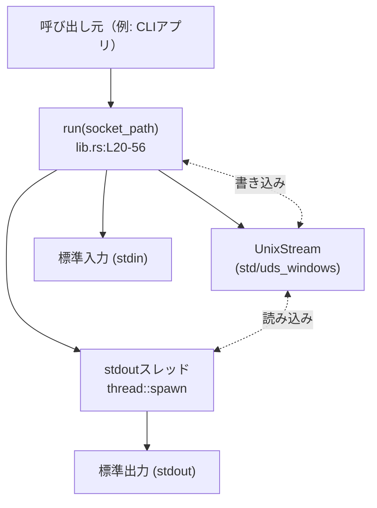
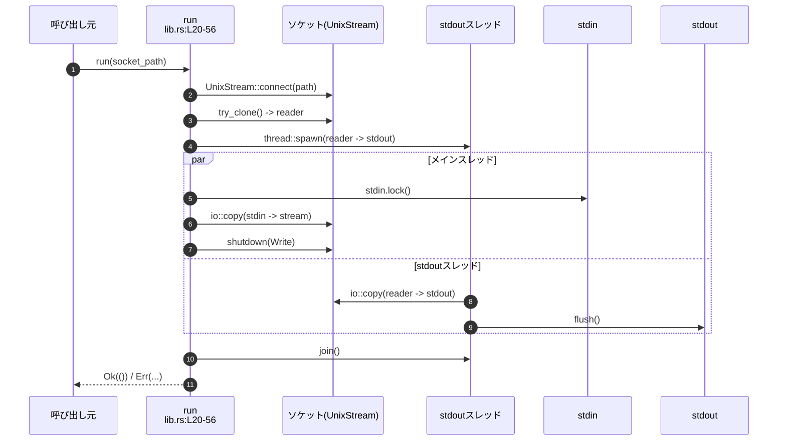
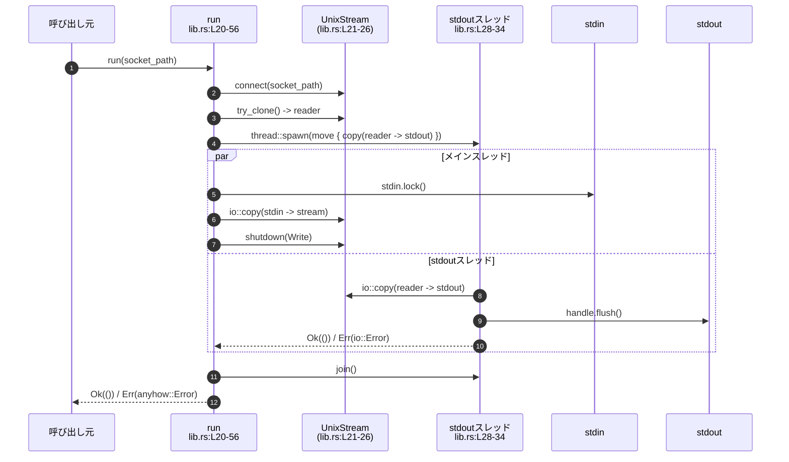

# stdio-to-uds/src/lib.rs

## 0. ざっくり一言

Unixドメインソケットに接続し、**標準入力 ⇔ ソケット ⇔ 標準出力** の間でバイト列を中継する、シンプルな同期 I/O ブリッジを提供するモジュールです（`run` 関数ひとつが公開 API です。根拠: `lib.rs:L18-20`）。

---

## 1. このモジュールの役割

### 1.1 概要

- このモジュールは、**ローカルの Unix ドメインソケットに対して、標準入力の内容を送信し、ソケットからの応答を標準出力へ書き出す**ために存在しています（`lib.rs:L18-20, L28-34, L36-40`）。
- ソケット→標準出力方向は別スレッドで処理し、標準入力→ソケット方向は呼び出し元スレッドで処理することで、**全二重（同時に送受信）に近い通信**を実現しています（`lib.rs:L28-34, L36-40`）。
- エラー情報は `anyhow::Result` と `Context` 拡張を使って、人間が読める文脈付きメッセージとして返されます（`lib.rs:L9-10, L21-22, L24-26, L39, L47, L52-53`）。

### 1.2 アーキテクチャ内での位置づけ

このファイル内に定義されているのは `run` 関数のみで、外部からはこの関数を呼ぶ想定になっています（`lib.rs:L18-20`）。

内部で利用している主なコンポーネントは以下です（いずれも他モジュールからの import であり、このファイル内では定義されていません。`lib.rs:L3-7, L12-16`）。

- `std::os::unix::net::UnixStream`（Unix のみ）または `uds_windows::UnixStream`（Windows のみ）: UDS ソケット入出力
- `std::io::{stdin, stdout, copy, Write}`: 標準入出力とストリームコピー
- `std::thread::spawn`: ソケット→stdout を別スレッドで処理
- `std::net::Shutdown`: ソケットの書き込み側の半クローズ

これらの関係を簡略化して示すと、次のようになります。



- `run` が Unix ドメインソケットに接続し（`lib.rs:L21-22`）、クローンしたソケットを読み取り専用としてスレッドに渡します（`lib.rs:L24-28`）。
- メインスレッドでは標準入力→ソケット書き込みを処理し（`lib.rs:L36-40`）、サーバーへの送信完了後にソケットの書き込み側のみを `shutdown(Write)` します（`lib.rs:L44-47`）。
- スレッド側はソケット→標準出力をコピーし続け、EOF などでコピーが終わると終了します（`lib.rs:L28-34`）。

### 1.3 設計上のポイント

- **単一の公開 API**  
  - 外部に公開されているのは `pub fn run(socket_path: &Path) -> anyhow::Result<()>` のみです（`lib.rs:L18-20`）。
- **状態を持たない関数型デザイン**  
  - グローバル状態や構造体はなく、`run` は引数のパスとプロセスの標準入出力・ソケットだけを扱います（`lib.rs:L3-7, L18-20, L21-40`）。
- **同期 I/O + スレッドでの並行処理**  
  - 非 async/await。`std::thread::spawn` による OS スレッドを 1 本だけ追加し、ブロッキング I/O を並行実行します（`lib.rs:L28-34`）。
- **エラーハンドリングの方針**  
  - ほぼ全ての I/O 操作に対し `?` と `Context` を組み合わせ、原因を示すメッセージを付加して `anyhow::Error` として呼び出し元に返します（`lib.rs:L21-22, L24-26, L39, L47, L52-53`）。
  - ソケットの `shutdown(Write)` では、特定の OS レベルエラー（`NotConnected`）だけは無視し、それ以外はエラーとして扱います（`lib.rs:L42-47`）。
- **静的解析ポリシー**  
  - `#![deny(clippy::print_stdout)]` により、`println!` などの標準出力への印字マクロの使用を禁止し、代わりに `io::stdout()` と `Write` トレイトを使っています（`lib.rs:L1, L3-4, L28-33`）。

---

## 2. 主要な機能一覧

このファイルが提供する主な機能は次のとおりです（すべて `run` 内で実装されています）。

- ソケット接続: 指定された Unix ドメインソケットパスに接続し、`UnixStream` を取得する（`lib.rs:L21-22`）。
- ソケットのクローン: 読み取り用に `UnixStream::try_clone()` で別ハンドルを作成する（`lib.rs:L24-26`）。
- ソケット→標準出力の転送（受信）: 別スレッドを立ち上げ、ソケットから読み取ったデータを `stdout` に書き込む（`lib.rs:L28-34`）。
- 標準入力→ソケットの転送（送信）: メインスレッドで `stdin` から読み取ったデータをソケットに書き込む（`lib.rs:L36-40`）。
- ソケット書き込み側の半クローズ: 送信完了後にソケットの書き込み側だけをクローズし、`NotConnected` を除くエラーは呼び出し元に伝える（`lib.rs:L42-47`）。
- スレッドの終了待ちとエラー伝播: ソケット→stdout スレッドの終了を `join` で待ち、パニック／I/O エラーを `anyhow::Error` として呼び出し元に伝える（`lib.rs:L50-53`）。

---

## 3. 公開 API と詳細解説

### 3.1 型一覧（構造体・列挙体など）

このファイル内で新たに定義されている構造体・列挙体・トレイトはありません（`lib.rs:L1-56` を通読しても `struct` / `enum` / `trait` の宣言が存在しないため）。

外部型として `UnixStream` が条件付き import されていますが、定義自体は別モジュールです（`lib.rs:L12-16`）。

### 3.2 関数詳細

#### `run(socket_path: &Path) -> anyhow::Result<()>`

**概要**

- 指定されたパスの Unix ドメインソケットに接続し、  
  - 標準入力から読んだデータをソケットへ送信し、  
  - ソケットから受信したデータを標準出力へ書き出す  
  処理を行います（`lib.rs:L18-20, L21-22, L28-34, L36-40`）。
- ソケット→標準出力のコピーは別スレッドで並行実行されます（`lib.rs:L28-34`）。

**引数**

| 引数名       | 型        | 説明 |
|-------------|-----------|------|
| `socket_path` | `&Path` | 接続先 Unix ドメインソケットのファイルシステムパス。`UnixStream::connect` に渡されます（`lib.rs:L20-22`）。 |

**戻り値**

- `anyhow::Result<()>`  
  - `Ok(())`: 送信・受信処理が完了し、ソケット書き込み側の `shutdown` とスレッドの `join` が正常に行われたことを表します（`lib.rs:L44-47, L50-55`）。  
  - `Err(anyhow::Error)`: 接続、コピー、shutdown、スレッドのパニックなど、いずれかの段階でエラーが発生したことを表し、適切な文脈文字列が付与されます（`lib.rs:L21-22, L24-26, L39, L47, L52-53`）。

**内部処理の流れ（アルゴリズム）**

1. **ソケットに接続**  
   - `UnixStream::connect(socket_path)` でソケットに接続し、失敗した場合は `"failed to connect to socket at ..."` の文脈を付けてエラーを返します（`lib.rs:L21-22`）。
2. **読み取り用のソケットをクローン**  
   - `stream.try_clone()` でソケットの複製を作成し、こちらを読み取り専用として使用します。失敗した場合は `"failed to clone socket for reading"` のコンテキスト付きでエラーを返します（`lib.rs:L24-26`）。
3. **ソケット→stdout のスレッドを起動**  
   - `thread::spawn(move || -> io::Result<()> { ... })` で新しいスレッドを生成し、クローンした `reader` から `io::copy` で `stdout.lock()` へデータを転送し、最後に `flush()` します（`lib.rs:L28-34`）。
4. **stdin→ソケット書き込み**  
   - メインスレッドでは `stdin.lock()` を取得し、`io::copy(&mut handle, &mut stream)` で標準入力からソケットへデータをコピーします。失敗時は `"failed to copy data from stdin to socket"` のコンテキスト付きエラーとして即座に `run` から戻ります（`lib.rs:L36-40`）。
5. **ソケットの書き込み側を半クローズ**  
   - コメントで示されているように、相手側がすぐに接続を閉じるレースに配慮しつつ、`stream.shutdown(Shutdown::Write)` を呼びます（`lib.rs:L42-44`）。  
   - `NotConnected` 以外のエラーが返った場合にのみエラーとして扱い、 `"failed to shutdown socket writer"` コンテキスト付きで `Err` を返します（`lib.rs:L44-47`）。
6. **スレッド終了の待機とエラー伝播**  
   - `stdout_thread.join()` でスレッド終了を待ちます。  
   - スレッドがパニックした場合は `join` が `Err` を返すので、`anyhow!("thread panicked while copying socket data to stdout")` というエラーに変換します（`lib.rs:L50-52`）。  
   - スレッド内の `io::copy` / `flush` が失敗した場合、その `io::Result<()>` を `stdout_result` として受け取り、`"failed to copy data from socket to stdout"` の文脈で `Err` に変換します（`lib.rs:L50-53`）。
7. **正常終了**  
   - すべての処理が成功した場合、`Ok(())` を返して終了します（`lib.rs:L55`）。

**処理フローの簡単な図**



**Examples（使用例）**

以下は、コマンドライン引数で受け取ったソケットパスに接続する簡単な `main` 関数の例です。

```rust
use std::env;                             // コマンドライン引数を受け取るために使用
use std::path::Path;                      // &Path に変換するために使用

fn main() -> anyhow::Result<()> {         // main も anyhow::Result を返す
    // 1つ目の引数をソケットパスとして取得する
    let socket_path = env::args()         // コマンドライン引数のイテレータを取得
        .nth(1)                           // 1番目の要素（0番目は実行ファイル名）を取り出す
        .expect("socket path is required"); // 無かった場合は簡易的に panic する

    // &Path に変換して run に渡す
    stdio_to_uds::run(Path::new(&socket_path))?; // このライブラリの run を呼び出す

    Ok(())                                // 正常終了
}
```

- この例では、標準入力に入力したデータがソケットに送られ、サーバーからの応答が標準出力に表示されます。
- エラーが発生した場合、`anyhow` によってスタックトレースや文脈付きメッセージが出力されます。

**Errors / Panics**

`run` 自体は明示的に `panic!` を呼びませんが、以下の条件で `Err(anyhow::Error)` を返します。

- ソケット接続エラー  
  - 例: ソケットファイルが存在しない、権限がないなどで `UnixStream::connect` が失敗した場合（`lib.rs:L21-22`）。
- ソケットクローンの失敗  
  - `stream.try_clone()` が失敗した場合（`lib.rs:L24-26`）。
- 標準入力→ソケットコピーの失敗  
  - `io::copy(&mut handle, &mut stream)` がエラーを返した場合（`lib.rs:L39`）。
- ソケット書き込み側の shutdown 失敗  
  - `stream.shutdown(Shutdown::Write)` が `NotConnected` 以外のエラーを返した場合（`lib.rs:L44-47`）。
- ソケット→stdout スレッドでの panic  
  - スレッド内で `panic!` が発生した場合、`join()` が `Err` を返し、`"thread panicked while copying socket data to stdout"` というメッセージで `anyhow::Error` に変換されます（`lib.rs:L50-52`）。
- ソケット→stdout コピー／flush の失敗  
  - スレッド内の `io::copy(&mut reader, &mut handle)` または `handle.flush()` がエラーを返した場合（`lib.rs:L28-33`）。  
  - これらは `io::Result<()>` として `stdout_result` に伝播し、その後 `"failed to copy data from socket to stdout"` コンテキスト付きで `Err` になります（`lib.rs:L50-53`）。

**Edge cases（エッジケース）**

コードから読み取れる代表的な挙動は次のとおりです。

- **ソケットが存在しない / 接続できない**  
  - `UnixStream::connect` が失敗し、`"failed to connect to socket at ..."` のエラーになります（`lib.rs:L21-22`）。
- **相手側がすぐに接続を閉じる**  
  - コメントにあるように、相手が応答を送った直後に接続を閉じると、`shutdown(Write)` が `NotConnected` を返すことがありますが、この場合は無視します（`lib.rs:L42-47`）。  
  - それ以外の shutdown エラーは `Err` になります。
- **標準入力がすぐ EOF（空入力）**  
  - `io::copy` は 0 バイトコピーで即終了し、ソケットの書き込み側が shutdown されます（`lib.rs:L36-40, L44-47`）。  
  - その後、相手側がソケットを閉じれば stdout スレッドも終了します。
- **標準入力が閉じられない（EOF が来ない）**  
  - メインスレッドの `io::copy` がブロックし続け、`run` は戻りません（`lib.rs:L36-40`）。  
  - これは設計上、ブロッキング I/O を使用しているため自然な挙動です。
- **相手側が一切データを送らずに接続を維持する**  
  - stdout スレッドの `io::copy(&mut reader, &mut handle)` は読み取りでブロックし続けます（`lib.rs:L28-32`）。  
  - 標準入力が EOF になっても、相手側がソケットを閉じない限りスレッドは終了しません。
- **スレッド内 panic**  
  - 何らかの理由でスレッドが panic すると、`join()` で検出され `Err(anyhow!("thread panicked ..."))` が返ります（`lib.rs:L50-52`）。

**使用上の注意点**

- **ブロッキング I/O**  
  - `run` は標準入力とソケットの両方でブロッキング I/O を行うため、**戻り値を待つ呼び出し元スレッドもブロック**されます（`lib.rs:L28-32, L36-40, L50-52`）。  
  - GUI アプリやイベントループ内から呼ぶ場合は、別スレッドで実行するなどの配慮が必要です（一般的な注意点）。
- **終了条件**  
  - 正常終了には、少なくとも以下の条件が必要です（コードの流れから推測されるものです）。  
    - 標準入力側で EOF が発生し、`io::copy` が戻る（`lib.rs:L36-40`）。  
    - 相手側がソケットの読み書きを終了し、stdout スレッドの `io::copy` が終了する（`lib.rs:L28-34`）。
- **エラー時のスレッドの扱い**  
  - 標準入力→ソケットコピーでエラーが発生した場合、`?` により `run` はその時点で `Err` を返します（`lib.rs:L39`）。  
  - この場合、`stdout_thread.join()` は呼ばれないため、プロセスが存続している間は、stdout スレッドはバックグラウンドで動作し続ける可能性があります（`lib.rs:L50-52` が実行されない）。  
    - 一般的には、`run` がエラーを返した場合にアプリ全体も終了することが多く、その際にはプロセス終了とともに全スレッドも終了します。
- **セキュリティ上の観点**  
  - このコードは **標準入力から読み取ったバイト列をそのままソケットに送信**します（`lib.rs:L36-40`）。  
  - 入力バリデーションやプロトコルレベルの制御は行っていないため、その責任はソケットの相手側（サーバー）や呼び出し元アプリケーションにあります。

### 3.3 その他の関数

このファイル内に `run` 以外の関数は存在しません（`lib.rs:L1-56` を通読しても追加の `fn` 定義がないため）。

---

## 4. データフロー

### 4.1 代表的な処理シナリオ

典型的なシナリオは「対話的またはスクリプトから `run` を呼び出し、標準入力・出力を利用してソケットの相手と通信する」というものです。

- 呼び出し元が `run(&socket_path)` を呼び出す（`lib.rs:L20`）。
- `run` がソケット接続を確立し、読み取り用ソケットをクローンして stdout スレッドを起動（`lib.rs:L21-34`）。
- メインスレッドで標準入力→ソケットへのコピーを実行し（`lib.rs:L36-40`）、完了後にソケットの書き込み側を shutdown（`lib.rs:L44-47`）。
- stdout スレッドはソケット→stdout のコピーを行い、EOF 等で終了する（`lib.rs:L28-34`）。
- メインスレッドで stdout スレッドを `join` し、結果を確認してから `Ok(())` または `Err` を返す（`lib.rs:L50-55`）。

これを sequence diagram で表現すると次のようになります。



---

## 5. 使い方（How to Use）

### 5.1 基本的な使用方法

標準的な使い方は、「CLI や他のプログラムから `run` を呼び出し、標準入力・出力をプロトコルの入出力として利用する」形です。

```rust
use std::path::Path;                         // Path 型を使うための use
use stdio_to_uds::run;                       // このライブラリの run 関数をインポート

fn main() -> anyhow::Result<()> {            // エラーを anyhow::Result でラップする
    // 接続先ソケットパスを固定文字列で指定する例
    let socket_path = Path::new("/tmp/my.sock"); // Unix ドメインソケットのパス

    // run を呼び出し、標準入力とソケットを接続する
    run(socket_path)?;                       // エラー時には ? でそのまま main から Err を返す

    Ok(())                                   // 正常終了
}
```

- シェルからは次のように利用できます（一般的な利用例、実際のパスは環境に依存します）。

```text
echo "hello" | my_cli_program
```

- この場合、`"hello\n"` がソケットに送られ、サーバーからの応答が標準出力に表示されます。

### 5.2 よくある使用パターン

このコードは「標準入出力とソケットを直結」する構造のため、以下のようなパターンに適しています。

1. **フィルタ型ツールとしての利用**  
   - 入力: 他のコマンドの出力をパイプで接続  
   - 出力: ソケットの応答をそのまま標準出力へ  
   - 例:  

     ```text
     cat request.bin | uds-client /tmp/server.sock > response.bin
     ```

2. **対話的セッション**  
   - ユーザーがターミナルで文字を入力し、それがそのままソケットに送られ、応答がターミナルに表示される使い方。  
   - この場合、EOF（通常は Ctrl-D）を送るまで接続を維持し続けます（`lib.rs:L36-40`）。

### 5.3 よくある間違い

コードから推測される、起こりやすそうな誤用とその影響を示します。

```rust
use std::path::Path;

// 誤り例: 無効なパスを渡してしまう
fn main() -> anyhow::Result<()> {
    // ディレクトリパスや存在しないファイルパスを指定してしまう
    let socket_path = Path::new("/tmp");          // ディレクトリを指定している例（多くの場合ソケットではない）

    stdio_to_uds::run(socket_path)?;             // connect が失敗し Err になる

    Ok(())
}
```

- この場合、`UnixStream::connect` が失敗し、`"failed to connect to socket at /tmp"` のようなエラーになります（`lib.rs:L21-22`）。

```rust
// 誤り例: run を呼び出した後に標準入力が閉じられない
fn main() -> anyhow::Result<()> {
    // 標準入力に対して、EOF を送らないまま放置するようなロジック
    stdio_to_uds::run(Path::new("/tmp/my.sock"))?; // stdin からの読み取りが永続的にブロックしうる

    Ok(())
}
```

- 標準入力が EOF にならない限りメインスレッドの `io::copy` が終了せず、`run` も戻らないため、プログラムが「ハングしたように見える」状況になり得ます（`lib.rs:L36-40`）。

### 5.4 使用上の注意点（まとめ）

- **ブロッキング挙動**  
  - I/O はすべてブロッキングで行われるため、`run` を呼び出したスレッドは処理完了まで制御を取り戻しません（`lib.rs:L28-32, L36-40, L50-52`）。
- **EOF と接続の終了**  
  - 標準入力の EOF と、ソケット側の終了（あるいは EOF）が揃うまで関数は終了しない可能性があります。
- **エラー時の挙動**  
  - 標準入力→ソケットコピーでエラーが発生すると、その時点で `run` が `Err` を返し、stdout スレッドの `join` は行われません（`lib.rs:L39`）。  
  - 通常、プロセス終了によりスレッドも停止しますが、大きなアプリケーションの一部として利用する場合は、この挙動を前提に設計する必要があります。
- **プラットフォーム依存**  
  - Unix では標準ライブラリの `std::os::unix::net::UnixStream`、Windows では外部クレート `uds_windows::UnixStream` を使用します（`lib.rs:L12-16`）。  
  - Windows 向けの挙動詳細はこのチャンクには現れず、不明です。

---

## 6. 変更の仕方（How to Modify）

### 6.1 新しい機能を追加する場合

このモジュールに機能を追加したい場合、実装の入口は基本的に `run` 関数の内部になります（`lib.rs:L20-56`）。

例として、次のような拡張が想定されます（あくまで「どこを触るか」の参考です）。

- **タイムアウトを導入したい場合**  
  - ブロッキングな `io::copy` 呼び出しが行われている箇所が対象です（`lib.rs:L31, L39`）。  
  - 標準入力→ソケット、ソケット→stdout の両方向で、`io::copy` の代わりにタイムアウト付きの読み書きを行うよう置き換えることが考えられます。
- **ログ出力を追加したい場合**  
  - 既存コードは `println!` などを使わず、`#![deny(clippy::print_stdout)]` が指定されているため（`lib.rs:L1`）、ログクレート（例: `log`）を利用する場合は `run` の開始・終了やエラー箇所（`lib.rs:L21-22, L24-26, L39, L47, L52-53`）にロギングを追加するのが自然です。
- **プロトコル処理を挟みたい場合**  
  - 現状はバイト列をそのままコピーしています（`lib.rs:L31, L39`）。  
  - データの前処理・後処理を行いたい場合は、各 `io::copy` の直前後に処理を追加するか、独自の読み書きループに置き換えることになります。

### 6.2 既存の機能を変更する場合

変更前に、次の観点を確認することが実用的です。

- **影響範囲の確認**  
  - `run` はこのモジュールの唯一の公開 API であり、呼び出し元がどこかはこのチャンクからは分かりません（このチャンクには `main` や他のモジュールが現れない）。  
  - そのため、クレート全体の公開 API を確認し、`run` を呼んでいる箇所を参照する必要があります（別ファイルのため不明）。
- **契約（前提条件・終了条件）の維持**  
  - 「標準入力とソケットを接続する」「ソケットからの応答を標準出力へ流す」という振る舞い（`lib.rs:L28-34, L36-40`）を維持するかどうかを明確にする必要があります。
  - shutdown の挙動 (`NotConnected` を無視している点) を変える場合、コメントに書かれているレース条件を理解した上で行う必要があります（`lib.rs:L42-47`）。
- **エラーメッセージの互換性**  
  - 既存のエラーメッセージは `anyhow::Context` により文字列が決まっています（`lib.rs:L21-22, L24-26, L39, L47, L52-53`）。  
  - これらの文言に依存したテストや監視があるかもしれないため、変更する場合は呼び出し側の影響も確認する必要があります。
- **テストコードの有無**  
  - このチャンクにはテストコードは現れないため、テストの有無・内容は不明です。  
  - 振る舞いを変える場合は、新たに結合テストを追加するのが一般的です。

---

## 7. 関連ファイル

このチャンクから直接参照できる関連ファイル・ディレクトリは限定的です。

| パス / クレート | 役割 / 関係 |
|----------------|------------|
| `std::os::unix::net::UnixStream` | Unix 環境で使用される Unix ドメインソケットのストリーム型。`run` 内で使用されます（`lib.rs:L12, L21-26`）。 |
| `uds_windows::UnixStream`       | Windows 環境で使用される Unix ドメインソケット互換のストリーム型。外部クレートであり、このファイルには実装は現れません（`lib.rs:L15-16`）。 |
| `std::io` / `std::thread` / `std::net::Shutdown` | 入出力、スレッド生成、ソケットの半クローズなどに利用される標準ライブラリモジュール（`lib.rs:L3-7, L28-34, L44-47`）。 |

- このクレート内に `main` 関数や他のモジュールが存在するかどうかは、このチャンクには現れず不明です。  
- テストコード（`tests/` や `*_test.rs` など）についても、このチャンクからは確認できません。
