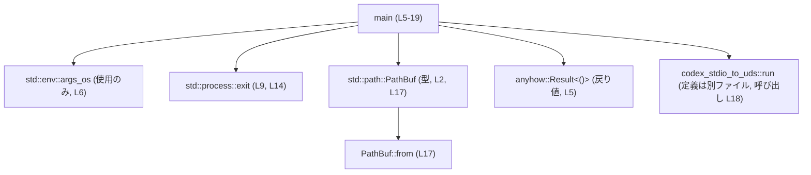
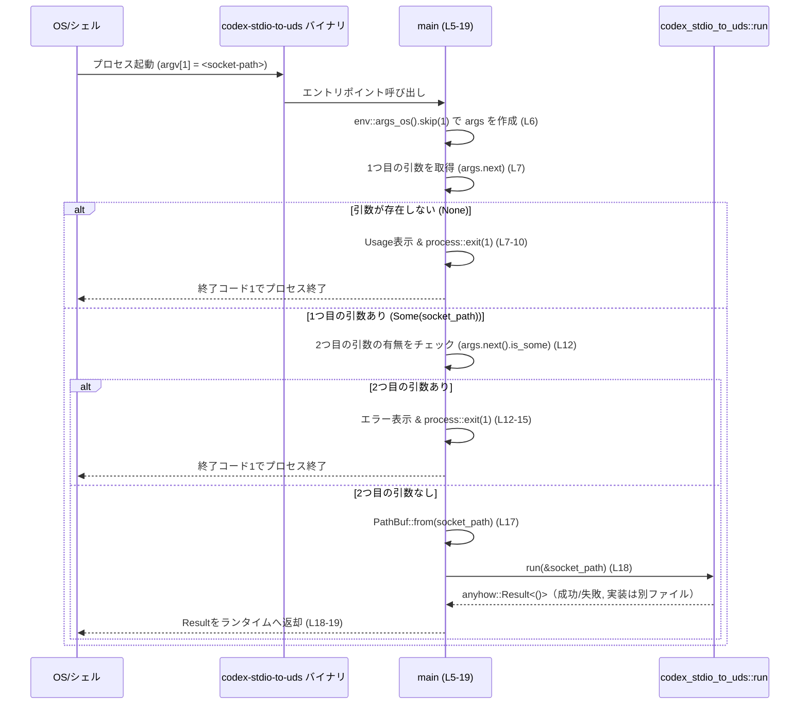

# stdio-to-uds/src/main.rs

## 0. ざっくり一言

`codex-stdio-to-uds` バイナリのエントリポイントで、  
コマンドライン引数から Unix ドメインソケットのパス（`<socket-path>`）を 1 つだけ受け取り、  
それを `codex_stdio_to_uds::run` に渡して実処理を委譲するファイルです（`stdio-to-uds/src/main.rs:L5-19`）。

---

## 1. このモジュールの役割

### 1.1 概要

- このファイルは CLI プログラムの `main` 関数のみを提供します（`stdio-to-uds/src/main.rs:L5-19`）。
- 役割は次の 2 点です。
  - コマンドライン引数から **Unix ドメインソケットのパスを 1 つだけ**受け取る（`env::args_os` の利用, `stdio-to-uds/src/main.rs:L6`）。
  - 引数が正しい場合に、そのパスを `PathBuf` 化して `codex_stdio_to_uds::run` に渡す（`stdio-to-uds/src/main.rs:L17-18`）。

### 1.2 アーキテクチャ内での位置づけ

このファイルはアプリケーションの最上流に位置し、標準ライブラリと `codex_stdio_to_uds` クレートに依存しています。



- `codex_stdio_to_uds::run` の定義本体は **このチャンクには現れない** ため、内部処理は不明です（`stdio-to-uds/src/main.rs:L18`）。
- このファイルは **引数検証 + 委譲** のみを行い、ビジネスロジックはすべて `codex_stdio_to_uds` クレートに任せる構造になっています。

### 1.3 設計上のポイント（コードから読み取れる範囲）

- **責務の分割**
  - このファイルは CLI インターフェースと引数検証だけを行い、実処理は外部関数に委譲しています（`stdio-to-uds/src/main.rs:L6-18`）。
- **状態**
  - グローバルな状態は持たず、`main` 関数内ローカル変数のみを使用しています。
- **エラーハンドリング方針**
  - 引数エラー（不足・過剰）は `eprintln!` でメッセージを出したうえで `std::process::exit(1)` で終了します（`stdio-to-uds/src/main.rs:L7-10, L12-15`）。
  - ソケット接続などの実行時エラーは `codex_stdio_to_uds::run` が返す `anyhow::Result<()>` をそのまま呼び出し元（Rust ランタイム）に返します（`stdio-to-uds/src/main.rs:L5, L18`）。
- **言語固有の特徴**
  - `env::args_os` により、非 UTF-8 を含む OS 依存の引数も安全に扱います（`stdio-to-uds/src/main.rs:L6`）。
  - `process::exit` を使うため、その分岐ではスタック上の変数の `Drop` は実行されませんが、このコードでは重大なリソースは保持していません（`stdio-to-uds/src/main.rs:L9, L14`）。
- **並行性**
  - スレッド生成や `async/await` などの並行処理は一切使用していません。

---

## 2. 主要な機能一覧（コンポーネントインベントリー）

### 2.1 このファイルで定義される関数

| 名前 | 種別 | 役割 / 用途 | 根拠 |
|------|------|-------------|------|
| `main` | 関数 | プロセスのエントリポイント。コマンドライン引数から `<socket-path>` を 1 つだけ受け取り、`codex_stdio_to_uds::run` を呼び出す | `stdio-to-uds/src/main.rs:L5-19` |

### 2.2 このファイルが利用する外部コンポーネント

| 名前 | 種別 | 定義の所在 | 役割 / 用途 | 根拠 |
|------|------|------------|-------------|------|
| `std::env::args_os` | 関数 | 標準ライブラリ | OS 依存のコマンドライン引数を `OsString` のイテレータとして取得 | `stdio-to-uds/src/main.rs:L1, L6` |
| `std::process::exit` | 関数 | 標準ライブラリ | 引数エラー時にプロセスを即座に終了（終了コード 1） | `stdio-to-uds/src/main.rs:L3, L9, L14` |
| `std::path::PathBuf` | 構造体 | 標準ライブラリ | ソケットパスを所有権付きのパス型として保持 | `stdio-to-uds/src/main.rs:L2, L17` |
| `PathBuf::from` | 関連関数 | 標準ライブラリ | 得られた `OsString` から `PathBuf` を構築 | `stdio-to-uds/src/main.rs:L17` |
| `anyhow::Result<()>` | 型エイリアス | `anyhow` クレート | `main` の戻り値として汎用エラーを表現 | `stdio-to-uds/src/main.rs:L5` |
| `codex_stdio_to_uds::run` | 関数 | 別クレート `codex_stdio_to_uds` | ソケットパスを受け取り、標準入出力と Unix ドメインソケットを橋渡しするコア処理（詳細はこのチャンクには現れない） | `stdio-to-uds/src/main.rs:L18` |
| `eprintln!` | マクロ | 標準ライブラリ | 引数エラーや Usage を標準エラー出力に表示 | `stdio-to-uds/src/main.rs:L8, L13` |

---

## 3. 公開 API と詳細解説

### 3.1 型一覧（構造体・列挙体など）

このファイル内で **新しく定義される型はありません**。

外部から利用される可能性がある主要な型（インターフェース上重要なもの）は次の通りです。

| 名前 | 種別 | 役割 / 用途 | 根拠 |
|------|------|-------------|------|
| `anyhow::Result<()>` | 型エイリアス | `main` の戻り値型。`Ok(())` で正常終了、`Err(anyhow::Error)` でエラー終了 | `stdio-to-uds/src/main.rs:L5` |
| `PathBuf` | 構造体 | `codex_stdio_to_uds::run` に渡されるソケットパスの表現 | `stdio-to-uds/src/main.rs:L2, L17` |

`codex_stdio_to_uds::run` がどのような型や構造体を内部で使うかは、**このチャンクには現れないため不明**です。

### 3.2 関数詳細

#### `main() -> anyhow::Result<()>`

**概要**

- CLI プログラムのエントリポイントです（`stdio-to-uds/src/main.rs:L5`）。
- コマンドライン引数から `<socket-path>` を 1 つだけ受け取り、余分な引数がないかを検証します（`stdio-to-uds/src/main.rs:L6-15`）。
- 正常な場合には `PathBuf` に変換し、`codex_stdio_to_uds::run(&socket_path)` を呼び出し、その戻り値の `anyhow::Result<()>` をそのまま返します（`stdio-to-uds/src/main.rs:L17-18`）。

**引数**

- この関数は引数を直接受け取りません。
- 代わりに `std::env::args_os()` からプロセスのコマンドライン引数を取得します（`stdio-to-uds/src/main.rs:L6`）。

**戻り値**

- 型: `anyhow::Result<()>`（`stdio-to-uds/src/main.rs:L5`）
  - `Ok(())`:
    - `codex_stdio_to_uds::run` が成功した場合に返されます（`stdio-to-uds/src/main.rs:L18`）。
  - `Err(anyhow::Error)`:
    - `codex_stdio_to_uds::run` が失敗した場合にそのエラーを包んで返します。
- Rust ランタイムにおける挙動（一般論）:
  - `main` が `Result` で `Err` を返すと、通常は非ゼロ終了ステータスでプロセスが終了し、エラー内容が標準エラーに表示されます。
  - エラーの具体的なメッセージは `codex_stdio_to_uds::run` がどのようなエラーを返すかに依存し、**このチャンクからは不明**です。

**内部処理の流れ（アルゴリズム）**

1. `env::args_os().skip(1)` で、プログラム名を除いた引数イテレータ `args` を作成する（`stdio-to-uds/src/main.rs:L6`）。
2. 最初の引数 `socket_path` を `args.next()` で取得し、`Some(socket_path)` であるかパターンマッチする（`stdio-to-uds/src/main.rs:L7`）。
   - `None`（引数が 0 個）なら:
     - Usage メッセージを `eprintln!` で表示し（`"Usage: codex-stdio-to-uds <socket-path>"`）、`process::exit(1)` で終了する（`stdio-to-uds/src/main.rs:L7-10`）。
3. 2 つ目以降の引数が存在しないことを `if args.next().is_some()` で確認する（`stdio-to-uds/src/main.rs:L12`）。
   - 存在する（2 個以上）なら:
     - エラーメッセージ `"Expected exactly one argument: <socket-path>"` を `eprintln!` で出力し、`process::exit(1)` で終了する（`stdio-to-uds/src/main.rs:L12-15`）。
4. ここまでで **ちょうど 1 個の引数** であることが保証されているので、その `socket_path` を `PathBuf::from(socket_path)` で `PathBuf` に変換する（`stdio-to-uds/src/main.rs:L17`）。
5. `codex_stdio_to_uds::run(&socket_path)` を呼び、その戻り値（`anyhow::Result<()>`）をそのまま `main` の戻り値として返す（`stdio-to-uds/src/main.rs:L18`）。

**処理フロー図（main の範囲 L5-19）**

この図は `main` 関数（`stdio-to-uds/src/main.rs:L5-19`）内での主要な分岐を表します。

```mermaid
flowchart TD
    A["Start main (L5)"] --> B["args = env::args_os().skip(1) (L6)"]
    B --> C{"1つ目の引数<br>args.next() (L7)"}
    C -->|None| D["Usage表示 & process::exit(1) (L7-10)"]
    C -->|Some(socket_path)| E{"2つ目の引数<br>args.next().is_some() (L12)"}
    E -->|true| F["エラー表示 & process::exit(1) (L12-15)"]
    E -->|false| G["PathBuf::from(socket_path) (L17)"]
    G --> H["codex_stdio_to_uds::run(&socket_path) (L18)"]
    H --> I["Resultをmainの戻り値として返す (L18-19)"]
```

**Examples（使用例）**

`main` は直接呼びだすよりも、通常は CLI から利用されます。ここでは 2 つの利用例を示します。

1. シェルからの実行例（正常系）

```sh
# ソケットパスとして /tmp/codex.sock を指定した例
$ codex-stdio-to-uds /tmp/codex.sock
# → main が /tmp/codex.sock を PathBuf として run に渡す
# → run の戻り値が Ok(()) なら終了ステータス 0 で終了
```

1. Rust コードから `std::process::Command` を使って起動する例（テストコードなどから）

```rust
use std::process::Command; // Commandを使って外部プログラムを起動する

fn spawn_stdio_to_uds() -> std::io::Result<std::process::Output> {
    Command::new("codex-stdio-to-uds")               // 実行ファイル名
        .arg("/tmp/codex.sock")                      // <socket-path> を1つだけ渡す
        .output()                                    // 実行してOutputを取得
}
```

> `codex_stdio_to_uds::run` の挙動（接続に成功するかどうか等）は、このチャンクには現れないため、この例では触れていません。

**Errors / Panics**

- `process::exit(1)` による終了
  - 引数が 0 個のとき（`args.next()` が `None` のとき）:
    - Usage を表示後、`process::exit(1)` で終了します（`stdio-to-uds/src/main.rs:L7-10`）。
  - 引数が 2 個以上のとき（`args.next().is_some()` が `true` のとき）:
    - エラーメッセージを表示後、`process::exit(1)` で終了します（`stdio-to-uds/src/main.rs:L12-15`）。
- `codex_stdio_to_uds::run` による `Err`
  - `run(&socket_path)` が `Err` を返した場合、その `Err` が `main` の戻り値として伝播します（`stdio-to-uds/src/main.rs:L18`）。
  - どのような条件で `Err` になるかは `run` の実装がこのチャンクには現れないため不明です。
- Panic の可能性
  - このファイルに現れる処理（`env::args_os`, `PathBuf::from`, `process::exit`）は通常 panic を起こしません。
  - `eprintln!` も非常にまれなケース（標準エラーの書き込みエラーなど）を除けば panic しない設計です。
  - `run` が panic しうるかどうかは、このチャンクには現れないため不明です。

**Edge cases（エッジケース）**

- 引数が 0 個（プログラム名のみ）の場合
  - `args.next()` が `None` となり、Usage を表示して終了コード 1 で終了します（`stdio-to-uds/src/main.rs:L7-10`）。
- 引数が 1 個ちょうどの場合
  - その引数が `socket_path` として `PathBuf` に変換され、`run(&socket_path)` が呼ばれます（`stdio-to-uds/src/main.rs:L7, L12, L17-18`）。
- 引数が 2 個以上の場合
  - 2 つ目の引数が存在するため、`Expected exactly one argument: <socket-path>` と出力し、終了コード 1 で終了します（`stdio-to-uds/src/main.rs:L12-15`）。
- `<socket-path>` が非常に長い、または OS が受け付けない形式の場合
  - `PathBuf::from(socket_path)` 自体は通常どんな `OsString` でも受け取ります（`stdio-to-uds/src/main.rs:L17`）。
  - 実際にソケットを開けるかどうかは `codex_stdio_to_uds::run` の実装依存であり、このチャンクからは不明です。
- 非 UTF-8 なパス
  - `env::args_os` と `PathBuf::from` の組み合わせにより、非 UTF-8 文字を含むパスも扱えます（`stdio-to-uds/src/main.rs:L6, L17`）。
  - その後の処理が非 UTF-8 を許容するかは `run` の実装に依存し、このチャンクには現れません。

**使用上の注意点**

- コマンドライン引数は **ちょうど 1 個** にする必要があります。
  - 0 個や 2 個以上を渡すと、Usage またはエラーメッセージを表示して終了コード 1 で即終了します（`stdio-to-uds/src/main.rs:L7-10, L12-15`）。
- `process::exit` の特徴
  - `process::exit(1)` はスタックの `Drop` を実行せずにプロセスを終了します。
  - このファイルでは大きなリソースを所有していないため、実害はほぼありませんが、`main` に将来的にリソース管理コードを追加する場合には注意が必要です。
- 並行性
  - このファイルにはスレッドや `async` が一切登場しないため、並行性に関する競合（データレースなど）は発生しません。
  - 並行性が必要な場合は、`codex_stdio_to_uds::run` 側で行う設計になっていると考えられますが、**コードからは断定できません**。
- セキュリティ的な観点
  - `<socket-path>` の内容は一切検証されず、そのまま `PathBuf` として `run` に渡されます（`stdio-to-uds/src/main.rs:L17-18`）。
  - パスの妥当性・アクセス制御・ソケットの所有権などのセキュリティチェックが必要であれば、それは `run` 側で行われているか、別途実装する必要がありますが、このチャンクからは不明です。

### 3.3 その他の関数

- このファイルには `main` 以外の関数やメソッド定義は存在しません（`stdio-to-uds/src/main.rs:L1-19` を通して確認）。

---

## 4. データフロー

代表的な処理シナリオとして、「シェルから `<socket-path>` を 1 つだけ渡して実行する」ケースを説明します。

### 4.1 高レベルなデータフロー

1. OS / シェルがコマンド `codex-stdio-to-uds <socket-path>` を実行します。
2. Rust ランタイムが `main` 関数（`stdio-to-uds/src/main.rs:L5-19`）を呼び出します。
3. `main` は `env::args_os()` から `<socket-path>` を含む引数を取得します（`stdio-to-uds/src/main.rs:L6-7`）。
4. `<socket-path>` を `PathBuf` に変換します（`stdio-to-uds/src/main.rs:L17`）。
5. その `PathBuf` の参照 `&socket_path` を `codex_stdio_to_uds::run` に渡します（`stdio-to-uds/src/main.rs:L18`）。
6. `run` が処理を行い、`anyhow::Result<()>` を返します（定義はこのチャンクには現れない）。
7. `main` はその `Result` をそのまま返し、Rust ランタイムが終了コードを決定します（`stdio-to-uds/src/main.rs:L18-19`）。

### 4.2 シーケンス図（このチャンクのコード範囲 main: L5-19）



---

## 5. 使い方（How to Use）

### 5.1 基本的な使用方法

このモジュール（バイナリ）の基本的な使用方法は、**Unix ドメインソケットのパスを 1 つだけ引数に与えて実行する**ことです。

```sh
# 典型的な起動例
$ codex-stdio-to-uds /tmp/codex.sock
```

- `/tmp/codex.sock` が `<socket-path>` として `main` に渡されます（`stdio-to-uds/src/main.rs:L6-7`）。
- `main` はこのパスを `PathBuf` に変換し（`stdio-to-uds/src/main.rs:L17`）、`codex_stdio_to_uds::run(&socket_path)` を呼び出します（`stdio-to-uds/src/main.rs:L18`）。
- その後の標準入出力とソケットの接続方法は `run` の実装に依存し、このチャンクには現れません。

### 5.2 よくある使用パターン

1. テストや他の Rust プログラムからこのバイナリを起動

```rust
use std::process::Command;

fn main() -> std::io::Result<()> {
    let output = Command::new("codex-stdio-to-uds") // バイナリ名
        .arg("/tmp/codex.sock")                    // <socket-path> を 1 つ指定
        .output()?;                                // 実行して結果を得る

    // 成功/失敗を確認
    if output.status.success() {
        eprintln!("codex-stdio-to-uds 成功");
    } else {
        eprintln!("codex-stdio-to-uds 失敗: {:?}", output);
    }

    Ok(())
}
```

1. systemd などのサービス定義からの起動  
   （実際の unit ファイルはこのチャンクには現れないため概念的な説明のみ）

- `ExecStart=/usr/bin/codex-stdio-to-uds /run/codex.sock`
- サービス管理ツールがプロセスを起動し、`main` が引数 `/run/codex.sock` を受け取る構造になります。

### 5.3 よくある間違い

```sh
# 間違い例: 引数がない
$ codex-stdio-to-uds
# main: Usage: codex-stdio-to-uds <socket-path> を表示し、終了コード 1 で終了（L7-10）

# 間違い例: 引数が多すぎる
$ codex-stdio-to-uds /tmp/codex.sock extra-arg
# main: Expected exactly one argument: <socket-path> を表示し、終了コード 1 で終了（L12-15）
```

正しい例:

```sh
# 正しい: 引数はちょうど 1 個
$ codex-stdio-to-uds /tmp/codex.sock
```

### 5.4 使用上の注意点（まとめ）

- `<socket-path>` は **必須** であり、かつ **1 個だけ** 指定する必要があります。
- 引数が不正な場合は、`run` には到達せず、直ちに終了コード 1 で終了します。
- `<socket-path>` の妥当性（存在するディレクトリか、長さ制限など）はこのファイルではチェックしていません。
  - 必要なチェックは `codex_stdio_to_uds::run` か、その利用側で行う必要がありますが、具体的な内容はこのチャンクには現れません。
- `process::exit` を使うため、引数エラー時の終了パスでは、今後この関数に追加されるリソース管理コードの `Drop` が呼ばれないことに注意が必要です。

---

## 6. 変更の仕方（How to Modify）

### 6.1 新しい機能を追加する場合

このファイルの主な責務は「引数処理と `run` 実行」なので、新機能の追加方針は次のようになります。

1. **引数オプションを増やしたい場合**
   - 例: `--help` や `--version` を追加したいなど。
   - 影響箇所:
     - `env::args_os().skip(1)` の結果の解釈（`stdio-to-uds/src/main.rs:L6-15`）。
   - ステップ:
     1. `args` の解析ロジックを別関数（例: `parse_args`）に切り出す。
     2. `parse_args` の戻り値として `enum Command { Run(PathBuf), Help, Version, ... }` のようなコマンド種別を返す設計にする。
     3. `main` は `match` でコマンド種別に応じた処理を呼び分ける。
   - 現行コードでは `main` に直接ロジックが書かれているため、テストしやすさや拡張性を考えると分割が有用です。

2. **`run` に渡す情報を増やしたい場合**
   - 例: バッファサイズやタイムアウト設定など。
   - 影響箇所:
     - `main` の引数解析ロジック（`stdio-to-uds/src/main.rs:L6-15`）。
     - `run` のシグネチャ（ただし `run` の定義はこのチャンクには現れないため、別ファイルを参照する必要があります）。
   - ステップ:
     1. 新しい引数を CLI で受け取り、パースする。
     2. `run` の引数型（例えば設定用構造体）を定義・変更し、`main` から渡す。

### 6.2 既存の機能を変更する場合

- 引数の「契約」を変更したい場合（例: 引数を任意にする）
  - 現在の契約:
    - 引数は **ちょうど 1 個** 必須（`stdio-to-uds/src/main.rs:L7-15`）。
  - 変更時に確認すべき点:
    - `run` が「引数がない」または「複数のパス」を受け取る設計になっているかどうか（このチャンクからは不明なので `run` の定義ファイルを確認する必要があります）。
    - エラーメッセージや Usage 表示が既存のユーザーにとって後方互換かどうか。
- エラーハンドリング方法を変更したい場合
  - 例: 引数エラーも `Result` として返し、終了コードやメッセージ出力を呼び出し側に任せたい場合。
  - 影響範囲:
    - `process::exit(1)` を行っている分岐（`stdio-to-uds/src/main.rs:L7-10, L12-15`）。
  - 注意点:
    - `main` が `Result` を返す現在の構造と整合するように、`Result` のエラー型を整理する必要があります（`anyhow::Result<()>` を使い続けるか、独自エラー型にするかなど）。
- 並行性や非同期処理を導入したい場合
  - 現在 `main` は同期関数であり、`async` ではありません（`stdio-to-uds/src/main.rs:L5`）。
  - 非同期ランタイム（例: `tokio`）を導入する場合は、`#[tokio::main]` マクロを付けるなど `main` の定義自体を変更する必要がありますが、そのようなコードはこのチャンクには現れません。

---

## 7. 関連ファイル

このチャンクから読み取れる、密接に関係するファイル・モジュールは次の通りです。

| パス / モジュール | 役割 / 関係 |
|------------------|------------|
| `codex_stdio_to_uds::run`（別ファイル） | `main` から呼び出されるコア処理。Unix ドメインソケットとの接続や stdio ブリッジを行うと推測されますが、実装はこのチャンクには現れません（`stdio-to-uds/src/main.rs:L18`）。 |
| `anyhow` クレート | `main` の戻り値型として利用される `anyhow::Result<()>` を提供するクレート。エラーハンドリング戦略に関わります（`stdio-to-uds/src/main.rs:L5`）。 |

テストコードやその他の補助ユーティリティファイルは、このチャンクには現れないため不明です。
