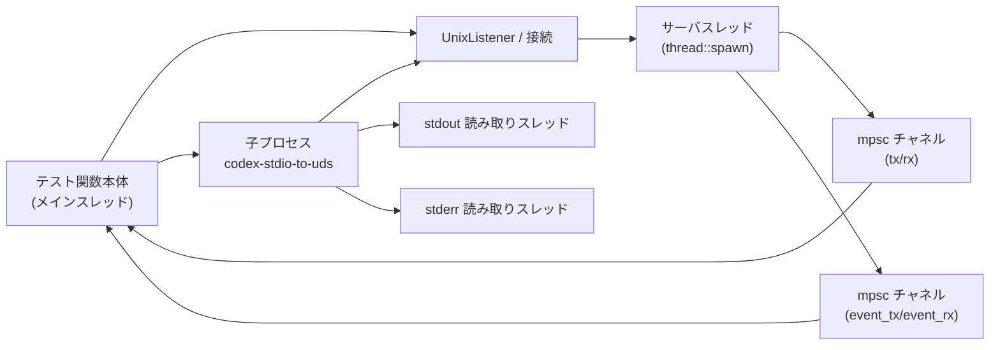
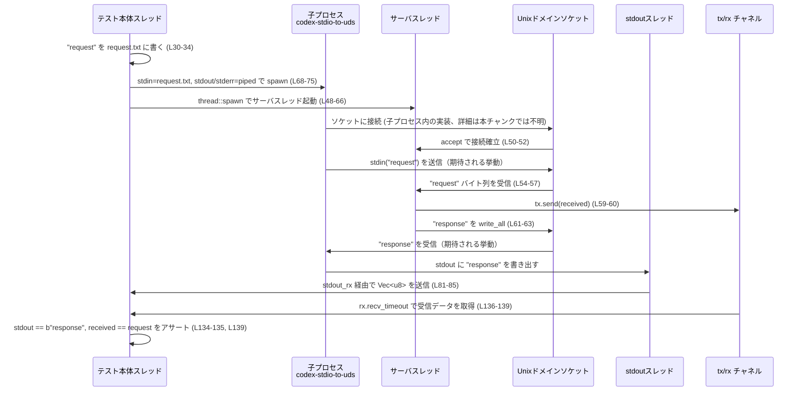

# stdio-to-uds/tests/stdio_to_uds.rs

## 0. ざっくり一言

Unix ドメインソケット経由で、親プロセスの標準入力→子プロセス→ソケットサーバ→子プロセスの標準出力という往復が正しく行われることを検証する統合テストです（`codex-stdio-to-uds` バイナリの挙動検証）。  
根拠: `pipes_stdin_and_stdout_through_socket` 内でソケットサーバを立てて子プロセスと通信し、送受信バイト列を検証しているため（stdio_to_uds.rs:L21-147）。

---

## 1. このモジュールの役割

### 1.1 概要

- このテストモジュールは、`codex-stdio-to-uds` バイナリが
  - 親プロセスの **stdin を Unix ドメインソケットのクライアント送信側に接続**し（リクエスト送信）  
  - ソケット経由の **レスポンスを stdout に書き出す**  
  という I/O パイプ動作を正しく行うかを検証します。  
  根拠: テスト側でソケットサーバを実装し、`"request"` を受信して `"response"` を返し、子プロセス stdout/サーバ受信バイトを検証しているため（stdio_to_uds.rs:L30-35, L54-63, L69-75, L134-139）。

### 1.2 アーキテクチャ内での位置づけ

このファイルは Rust プロジェクトの `tests/` 配下にあり、通常の Rust 構成では「外部からバイナリを起動する統合テスト」に相当します（ただしリポジトリ全体構成は本チャンクからは不明です）。

主なコンポーネント間の依存関係は次の通りです。

- テスト本体スレッドが:
  - 一時ディレクトリとソケットパスの準備
  - Unix ドメインソケットのリスナ生成
  - サーバスレッドの spawn
  - 子プロセス（`codex-stdio-to-uds`）の起動
  - 子プロセスの終了・出力・サーバからの受信を検証  
- サーバスレッドが:
  - `UnixListener.accept()` で接続待ち
  - 固定長のリクエスト受信
  - レスポンス送信
  - イベント・データを mpsc チャネルでテスト本体に通知

根拠: リスナ生成とマッチ処理（stdio_to_uds.rs:L35-44）、サーバスレッド spawn（L48-66）、子プロセス spawn（L69-75）、mpsc チャネル生成と利用（L46-47, L59-60, L81-90, L95-97, L120-123, L124-127, L136-139）。

### 1.3 設計上のポイント

- **OS 依存を吸収したソケットリスナ**
  - Unix: `std::os::unix::net::UnixListener`  
  - Windows: `uds_windows::UnixListener`  
  を `cfg` で切り替えています。  
  根拠: 条件付き `use`（stdio_to_uds.rs:L15-19）。

- **テストのスキップ条件**
  - ソケット bind 時に `PermissionDenied` の場合はテストをスキップして成功扱いにします。  
  根拠: PermissionDenied を検出して `Ok(())` を返す分岐（L35-40）。

- **非決定性の低減**
  - サーバ側は `read_to_end` ではなく、固定バイト数 `request.len()` だけ読みます。EOF 待ちによるレースを避ける設計です。  
  根拠: コメントと `vec![0; request.len()]` に対する `read_exact`（L23-29, L54-57）。

- **並行 I/O とタイムアウト管理**
  - サーバ処理と子プロセス stdout/stderr 読み取りを別スレッドで並行実行し、テスト本体スレッドはポーリング＋タイムアウトでハングを防ぎます。  
  根拠: `thread::spawn` でのサーバ・stdout・stderr スレッド生成（L48, L81, L86）、`Instant` と `Duration` を使った 5 秒タイムアウト（L92-105）。

- **詳細なエラー文脈**
  - ほぼ全ての失敗パスに `anyhow::Context` で説明文が付与されます。  
  根拠: `context("...")?` や `bail!` の使用（L30, L34, L35-43, L48-52, L56-57, L62-63, L68-75, L77-78, L99, L106-109, L120-127, L136-139, L141-144）。

---

## 2. 主要な機能一覧（コンポーネントインベントリー）

このファイルに含まれる主要な関数・スレッド・チャネルの一覧です。

| 名前 | 種別 | 役割 / 用途 | 定義位置 |
|------|------|-------------|----------|
| `pipes_stdin_and_stdout_through_socket` | テスト関数 | ソケットサーバと子プロセスを起動し、stdin→UDS→stdout の往復を検証する | stdio_to_uds.rs:L21-147 |
| `UnixListener` | ソケットリスナ型（OS 依存） | Unix ドメインソケットで接続待ちを行う | L15-19, L35-44 |
| `server_thread` | `JoinHandle<anyhow::Result<()>>` | クライアントからリクエストを固定長読み込みし、レスポンスを書き返すサーバスレッド | L48-66 |
| 子プロセス `child` | `std::process::Child` | `codex-stdio-to-uds` バイナリ。stdin をソケットに送り、ソケットレスポンスを stdout に書くことが期待される | L69-75, L77-78, L99-101, L103-105 |
| `tx` / `rx` | `mpsc::Sender<Vec<u8>>` / `Receiver<Vec<u8>>` | サーバスレッド側で受信したリクエストバイト列をテスト本体スレッドに送る | L46, L59-60, L136-139 |
| `event_tx` / `event_rx` | `mpsc::Sender<String>` / `Receiver<String>` | サーバ側の進行状況をテスト本体に通知する（デバッグ用ログ） | L47, L49, L53, L58, L64, L92, L95-97 |
| stdout 読み取りスレッド | `thread::spawn` クロージャ | 子プロセス stdout を `read_to_end` し、結果を `stdout_tx` で返す | L81-85 |
| stderr 読み取りスレッド | `thread::spawn` クロージャ | 子プロセス stderr を `read_to_end` し、結果を `stderr_tx` で返す | L86-90 |

---

## 3. 公開 API と詳細解説

このファイルはテスト用であり、ライブラリとして公開される API はありません。  
ここではテスト関数自体を「外から Rust テストランナーに呼ばれる API」とみなして解説します。

### 3.1 型一覧（構造体・列挙体など）

このファイル内で新たな型定義は行っていません。使用している主な外部・標準ライブラリ型は次の通りです。

| 名前 | 種別 | 役割 / 用途 | 根拠 |
|------|------|-------------|------|
| `UnixListener` | 構造体 | Unix ドメインソケットリスナ。クライアント接続の accept に使用 | stdio_to_uds.rs:L15-19, L35-44, L50-52 |
| `mpsc::Sender<T>` / `Receiver<T>` | 構造体 | スレッド間でデータ（`Vec<u8>`）やイベント文字列を転送 | L46-47, L59-60, L81-90, L95-97, L120-127, L136-139 |
| `std::process::Child` | 構造体 | 子プロセスハンドル。ステータス確認や kill/wait に使用 | L69-75, L77-78, L94-101, L103-105 |
| `Instant` / `Duration` | 構造体 | タイムアウト管理（5 秒の全体タイムアウト、1 秒のチャネル待ち） | L92-94, L103, L106-107, L120-121, L124-125, L137-138 |
| `anyhow::Result<T>` | 型エイリアス | テスト関数とサーバスレッドクロージャの汎用エラー型として利用 | L21-22, L48 |

### 3.2 関数詳細: `pipes_stdin_and_stdout_through_socket() -> anyhow::Result<()>`

#### 概要

- `codex-stdio-to-uds` バイナリの **エンドツーエンド挙動**（stdin→UDS→stdout）を検証する単一の統合テストです。  
- 自前の Unix ドメインソケットサーバを立てて、`"request"` を受け取り `"response"` を返し、子プロセスの stdout とサーバ側で受け取ったデータが期待通りであることをアサートします。  
根拠: 一時ファイルに `"request"` を書き、サーバスレッドで固定長読み込み→`"response"` 書き込み、テスト側で stdout/受信データを `assert_eq!` しているため（stdio_to_uds.rs:L30-34, L54-63, L134-139）。

#### 引数

- 引数はありません（Rust テストランナーから自動的に呼び出される `#[test]` 関数）。  
根拠: 関数シグネチャ `fn pipes_stdin_and_stdout_through_socket() -> anyhow::Result<()>`（L21-22）。

#### 戻り値

- `anyhow::Result<()>`
  - `Ok(())`: テストがすべてのアサーションと I/O 操作に成功した場合。
  - `Err(anyhow::Error)`: 途中の I/O エラーやアサーション失敗などを `?` 演算子や `bail!` 経由で返します。  
根拠: 戻り値型と `?` / `bail!` の使用（L21-22, L30, L34-35, L42-43, L48-52, L56-57, L62-63, L68-75, L77-78, L99, L106-109, L120-123, L124-127, L136-139, L141-144）。

#### 内部処理の流れ（アルゴリズム）

1. **一時ディレクトリとリクエストデータの準備**  
   - `tempfile::TempDir::new()` で一時ディレクトリを作り、`request.txt` に `"request"` を書き込みます。  
   根拠: stdio_to_uds.rs:L30-34。

2. **Unix ドメインソケットリスナのセットアップ**  
   - `UnixListener::bind(socket_path)` を実行し、成功時はそのまま使用。  
   - `PermissionDenied` のときはテストをスキップ（`eprintln!` の後 `Ok(())` で早期 return）。  
   - それ以外のエラーは `Err` としてテスト失敗。  
   根拠: マッチ式の分岐（L35-43）。

3. **サーバスレッドとイベントチャネルの起動**  
   - `mpsc::channel()` で
     - `tx`/`rx`: サーバ→テスト本体への受信データ送信用  
     - `event_tx`/`event_rx`: サーバ→本体への進行ログ用  
     を作成。  
   - サーバスレッドでは:
     - `"waiting for accept"` を送信  
     - `listener.accept()` で接続待ち  
     - `"accepted connection"` を送信  
     - `request.len()` 長のバッファを用意し、`read_exact` でクライアントから読み込み  
     - `"read {} bytes"` を送信  
     - 受信バイト列を `tx.send(received)` でテスト本体に送信  
     - `"response"` を `write_all` でクライアントへ送信  
     - `"wrote response"` を送信  
     - `Ok(())` を返す  
   根拠: サーバスレッドクロージャ（L46-66）。

4. **子プロセス `codex-stdio-to-uds` の起動**  
   - `request.txt` を開き、子プロセスの `stdin` として渡します。  
   - `stdout` と `stderr` を `Stdio::piped()` に設定し、後で別スレッドで読み取ります。  
   根拠: `File::open` と `Command::new(...).stdin(...).stdout(...).stderr(...).spawn()`（L68-75）。

5. **stdout/stderr 読み取りスレッドの起動**  
   - 子プロセスの `stdout` / `stderr` を `take()` して所有権を得ます。  
   - それぞれのハンドルを別スレッドで `read_to_end` し、結果 `Vec<u8>` または `io::Error` を `mpsc::channel()` でテスト本体に返します。  
   根拠: `child.stdout.take()` / `child.stderr.take()` と 2 つの `thread::spawn`（L77-90）。

6. **子プロセス終了待ちループとタイムアウト**  
   - 5 秒後を `deadline` として記録。  
   - ループの中で:
     - `event_rx.try_recv()` によりサーバからのイベントをすべて `server_events` に蓄積。  
     - `child.try_wait()` が `Some(status)` を返したらループ終了。  
     - 現在時刻が `deadline` を過ぎたら:
       - `child.kill()` でプロセスを殺し、`child.wait()` で回収。  
       - `stderr_rx.recv_timeout(1 秒)` で stderr を取得できなければタイムアウトエラー。  
       - `bail!` でタイムアウト失敗（サーバイベントと stderr を含むメッセージ）。  
   根拠: ループ部分とタイムアウト処理（L92-117, L103-115）。

7. **子プロセス stdout/stderr と終了コードの検証**  
   - `stdout_rx` / `stderr_rx` を `recv_timeout(1 秒)` で受信し、`Result<Vec<u8>, io::Error>` の二重 `Result` を `context` で展開。  
   - `assert!(status.success(), "...")` により正常終了を確認し、失敗時にはサーバイベントと stderr を出力。  
   - `assert_eq!(stdout, b"response")` で子プロセス stdout が `"response"` であることを検証。  
   根拠: L120-135, 特にアサート部分（L128-135）。

8. **サーバ受信データとスレッド終了の検証**  
   - `rx.recv_timeout(1 秒)` でサーバスレッドからの受信データを取得し、`assert_eq!(received, request)` を行う。  
   - `server_thread.join()` し、join 時に panic していないか・`anyhow::Result<()>` が `Ok(())` かを確認。  
   根拠: 受信とアサート（L136-139）および join（L141-144）。

9. **正常終了**  
   - すべて成功した場合は `Ok(())` を返す。  
   根拠: 最終行の `Ok(())`（L146）。

#### Examples（使用例）

この関数自体はテストランナーから自動的に実行されるため、直接呼び出す必要はありません。  
同様のパターンで「ソケットサーバ＋外部バイナリ」をテストする場合の流れは、上記 1〜8 のステップに従う形になります。

#### Errors / Panics（エラー・パニック条件）

この関数は `anyhow::Result<()>` を返すため、主なエラー発生条件は次の通りです（いずれも `Err` でテスト失敗）:

- 一時ディレクトリ作成やリクエストファイル書き込みに失敗  
  根拠: `TempDir::new()` と `std::fs::write` に対する `context(...) ?`（L30, L34）。

- ソケット bind 失敗（`PermissionDenied` を除く）  
  根拠: `Err(err) => Err(err).context("failed to bind test unix socket")`（L41-43）。

- サーバスレッド内の accept / read / write / send での失敗  
  根拠: `accept().context("failed to accept test connection")?` など（L50-52, L56-57, L62-63, L59-60）。

- 子プロセス spawn 失敗、`stdout` / `stderr` の `take()` 失敗  
  根拠: `spawn().context("failed to spawn codex-stdio-to-uds")?`、`child.stdout.take().context("missing child stdout")?` など（L75, L77-78）。

- 子プロセス終了待ちループ中の `try_wait` エラー  
  根拠: `child.try_wait().context("failed to poll child status")?`（L99）。

- タイムアウト:
  - 子プロセスが 5 秒以内に終了しない場合 → kill 後に `bail!`  
    根拠: `Instant::now() >= deadline` ブランチと `bail!`（L103-115）。
  - `stdout_rx` / `stderr_rx` / `rx` の 1 秒 `recv_timeout` がタイムアウトした場合  
    根拠: それぞれの `recv_timeout(...).context("...")?`（L120-123, L124-127, L136-139）。

- サーバスレッドが panic した場合  
  根拠: `server_thread.join().map_err(|_| anyhow!("server thread panicked"))?`（L141-143）。

パニックについて:

- テスト関数内で明示的に `panic!` を呼んでいませんが、`assert!` / `assert_eq!` が失敗すると panic し、そのテストだけが失敗となります。  
  根拠: `assert!(status.success(), ...)` と `assert_eq!` の使用（L128-135, L139）。

#### Edge cases（エッジケース）

- **UNIX ソケット bind 権限がない場合**  
  - `ErrorKind::PermissionDenied` のとき、テストは `eprintln!` で理由を出力して `Ok(())` を返し、**スキップ相当**の扱いになります。  
  根拠: `Err(err) if err.kind() == ErrorKind::PermissionDenied` ブランチ（L37-40）。

- **子プロセスが即座に異常終了する場合**  
  - `child.try_wait()` がすぐに `Some(status)` を返し、後続で `status.success()` が `false` となれば、`assert!` によりテストは失敗します。その際、サーバイベントと stderr ログがメッセージに含まれます。  
  根拠: `try_wait` ループと `assert!(status.success(), ...)`（L94-101, L128-133）。

- **子プロセスがハングする場合**  
  - 5 秒経過すると kill→wait を行い、stderr を 1 秒待ってから `bail!` によりテスト失敗。  
  - サーバスレッドは accept や read でブロックしたまま残る可能性がありますが、その時点でテストは `Err` を返して終了します。  
  根拠: タイムアウト処理（L92-117, L106-115）。

- **サーバからの受信データが遅い / 来ない場合**  
  - `rx.recv_timeout(Duration::from_secs(1))` がタイムアウトすると、`"server did not receive data in time"` という文脈でテストが失敗します。  
  根拠: L136-139。

#### 使用上の注意点（安全性・並行性・前提条件）

- **スレッド安全性**  
  - スレッド間の通信はすべて `std::sync::mpsc` チャネルを通じて行われ、共有ミュータブル状態は `server_events` ベクタのみです。このベクタはテスト本体スレッド専有で、書き込みは `try_recv` で受け取った文字列の push のみです。  
  根拠: `server_events` がメインスレッド内にのみ存在し、他スレッドからは `event_tx.send` 経由で文字列だけ渡している（L47, L49, L53, L58, L64, L92-97）。

- **ブロッキング I/O とタイムアウト**  
  - サーバスレッドは `accept` および `read_exact` でブロックしますが、テスト本体は 5 秒の全体タイムアウトと 1 秒のチャネルタイムアウトを設けることで、無限ハングを避けています。  
  根拠: L50-52, L55-57, L92-94, L103-107, L120-121, L124-125, L137-138。

- **子プロセス stdout/stderr の安全な読み取り**  
  - `read_to_end` はプロセス終了までブロッキングしますが、stdout/stderr それぞれを別スレッドで実行することで、親スレッドの進行を妨げない設計になっています。  
  根拠: 2 つの `thread::spawn` とその中の `read_to_end`（L81-90）。

- **テストの前提条件**  
  - `codex-stdio-to-uds` バイナリが `codex_utils_cargo_bin::cargo_bin("codex-stdio-to-uds")` で起動可能であること。  
  - 実行環境が Unix ドメインソケット（または Windows で `uds_windows` の Unix ドメインソケットエミュレーション）をサポートしていること。  
  これらが満たされない場合、テストはスキップまたはエラーとなります。  
  根拠: `cargo_bin("codex-stdio-to-uds")` 呼び出しと `UnixListener::bind` の使用（L35-35, L69-75）。

### 3.3 その他の関数

- このファイル内に他の関数定義はありません。

---

## 4. データフロー

代表的なシナリオ（このテストそのもの）のデータの流れは次の通りです。

1. テスト本体スレッドが `"request"` を `request.txt` に書き、ファイルとして保持。  
2. 子プロセス `codex-stdio-to-uds` の stdin に `request.txt` を接続。  
3. サーバスレッドが Unix ドメインソケットで待ち受け、子プロセスからの接続を受理。  
4. サーバスレッドが子プロセスから `"request"` を受信し、`tx` チャネルでテスト本体へ転送。  
5. サーバスレッドが `"response"` をソケット経由で子プロセスに送信。  
6. 子プロセスが `"response"` を stdout に書き出し、stdout 読み取りスレッドがそれを `stdout_rx` チャネルでテスト本体へ転送。  
7. テスト本体が両方のデータ（サーバ受信 `"request"` と子 stdout `"response"`）をアサート。

これをシーケンス図で表すと次のようになります。

---

## 5. 使い方（How to Use）

このファイルはテストですので、「使い方」は主に「どのようにテストが機能するか」を理解するためのものです。

### 5.1 基本的な使用方法（テストとしての実行）

- 通常は `cargo test` で自動的に実行されます。  
  - Rust のテストランナーが `#[test]` 関数 `pipes_stdin_and_stdout_through_socket` を見つけて実行します。  
  - 事前に `codex-stdio-to-uds` バイナリがビルドできる状態であることが前提です。  
  根拠: `#[test]` 属性（stdio_to_uds.rs:L21）。

### 5.2 よくある使用パターン（テストパターンとして）

このテストは「外部バイナリを起動し、その I/O を統合テストする」ためのパターンを示しています。

- **パターン A: バイナリのソケット I/O をテストしたい場合**
  1. 一時ディレクトリやファイルでテスト用の入力データを用意。
  2. `UnixListener` などでテスト用サーバを起動（必要に応じてスレッド化）。
  3. `Command::new` でバイナリを spawn し、stdin/stdout/stderr を `Stdio::piped` に設定。
  4. stdout/stderr は別スレッドで `read_to_end` してチャネル経由で回収。
  5. `try_wait`＋タイムアウトで子プロセス終了を監視。
  6. 受信データや exit status を `assert!` / `assert_eq!` で検証。

本ファイルはこのパターンの具体例になっています（根拠: 前述のステップと対応するコード行）。

### 5.3 よくある間違い（想定される誤用と本コードの対策）

このテストは、典型的な落とし穴に対して対策が入っています。

- **誤用例: サーバ側で `read_to_end()` を行い EOF を待つ**  
  - 問題: ソケットの half-close タイミング次第でテストがハングまたは不安定になる可能性。  
  - 本コード: 固定長 `request.len()` だけ `read_exact` することで EOF への依存を避けています。  
  根拠: コメントと `read_exact` の利用（stdio_to_uds.rs:L23-29, L54-57）。

- **誤用例: 子プロセス stdout/stderr をメインスレッドで `read_to_end`**  
  - 問題: 子プロセスがハングした場合、メインスレッドもブロックしてテスト全体が止まる。  
  - 本コード: stdout/stderr を別スレッドで読み、メインスレッドはタイムアウト付きで待つ設計です。  
  根拠: `thread::spawn` での読み取りと `recv_timeout`（L81-90, L120-127）。

- **誤用例: タイムアウトを設けない**  
  - 問題: ネットワークや子プロセスの不具合でテストが永遠にハングする。  
  - 本コード: 全体 5 秒タイムアウト＋各チャネル 1 秒タイムアウトを設けています。  
  根拠: `deadline` と `recv_timeout` の使用（L92-94, L103, L106-107, L120-121, L124-125, L137-138）。

### 5.4 使用上の注意点（まとめ）

- テストは OS のソケット権限に依存します。`PermissionDenied` の場合はスキップ扱いですが、それ以外の権限問題や環境差異はエラーになります（L35-43）。
- `codex-stdio-to-uds` の実装が変わる（プロトコルや I/O 仕様が変わる）と、このテストもそれに応じて更新が必要です。
- テスト実行環境が非常に遅い場合、5 秒のタイムアウトでは不十分な可能性があります。その場合はテストコード側の `Duration::from_secs(5)` の調整が必要です（L92-94）。

---

## 6. 変更の仕方（How to Modify）

### 6.1 新しい機能を追加する場合（テストの拡張）

このファイルに新しいテストケースや検証項目を追加する場合の典型的な手順です。

1. **テストケースの追加**  
   - 別の `[test]` 関数として追加し、必要に応じて
     - 異なるリクエストデータ
     - 複数リクエストの連続送信
     - エラー応答の検証  
     などを行うと、既存テストと干渉しにくくなります。

2. **サーバロジックを変更したいとき**  
   - 現在のサーバ処理は `thread::spawn` のクロージャ内（stdio_to_uds.rs:L48-66）に集約されています。  
   - 新しいパターン（例: 可変長メッセージや複数のレスポンス）を扱いたい場合は、このクロージャ内部を変更・分割して対応します。

3. **イベントログの追加**  
   - デバッグ情報を増やしたいときは、`event_tx.send(...)` を追加し、`server_events` をより詳細に蓄積します（L49, L53, L58, L64, L95-97）。

### 6.2 既存の機能を変更する場合（注意点）

- **プロトコル（送受信データ）の変更**  
  - `request` / `"response"` の内容や長さを変更する場合は、サーバ側の `request.len()` とアサーション（`assert_eq!(stdout, ...)` と `assert_eq!(received, ...)`）を一貫して変更する必要があります。  
  根拠: `request` 定義と使用箇所（L32, L54, L139, L134-135）。

- **タイムアウト値の変更**  
  - `deadline`（5 秒）と `recv_timeout(1 秒)` の値を変更する際は、環境に応じたバランス（テストの安定性と実行時間）を考慮します。  
  - 値を短くしすぎると、遅い CI 環境で誤検出が増える可能性があります。  
  根拠: L92-94, L106-107, L120-121, L124-125, L137-138。

- **エラーメッセージの変更**  
  - `context("...")` や `bail!` 内のメッセージはデバッグ時の重要な手がかりです。変更する場合は、何が失敗したのかが分かる情報（操作内容・サーバイベント・stderr）を残すようにするのが実務的に有用です。  
  根拠: 多数の `context` 文と `bail!`（L30, L34, L42-43, L48-52, L56-57, L62-63, L68-75, L77-78, L99, L106-109, L120-123, L124-127, L136-139, L141-144）。

- **スレッド・チャネルの変更**  
  - サーバスレッドが返す型（現在は `anyhow::Result<()>`）やチャネルの型を変える場合、join 部分や `recv_timeout` 部分にも変更が必要です。  
  根拠: `thread::spawn(move || -> anyhow::Result<()> { ... })` と `server_thread.join()`（L48-66, L141-144）。

---

## 7. 関連ファイル

このファイルと密接に関係しそうなコンポーネント（ただし本チャンクには定義が現れないもの）です。

| パス / シンボル | 役割 / 関係 | 備考 |
|----------------|------------|------|
| `codex-stdio-to-uds` バイナリ | このテストが検証対象とする実行ファイル | `codex_utils_cargo_bin::cargo_bin("codex-stdio-to-uds")` で起動（stdio_to_uds.rs:L69）|
| `codex_utils_cargo_bin::cargo_bin` | テスト用にビルドされたバイナリへのパスを解決すると推測される関数 | 実体はこのチャンクには現れません（L69）|
| `tempfile` クレート | 一時ディレクトリを提供し、テスト用ソケット・リクエストファイルの配置に利用 | `TempDir::new()` のみ本チャンクに出現（L30）|
| `uds_windows` クレート | Windows 用 Unix ドメインソケット互換実装 | `UnixListener` の別実装として条件付き import（L18-19）|

> これらの関連ファイルやクレートの内部実装や詳細な API は、このチャンクには現れないため不明です。
