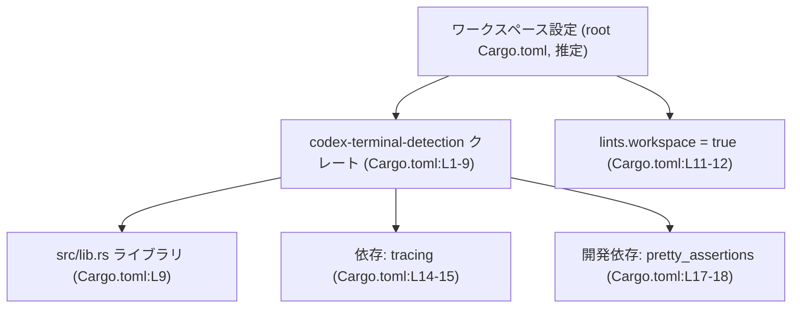
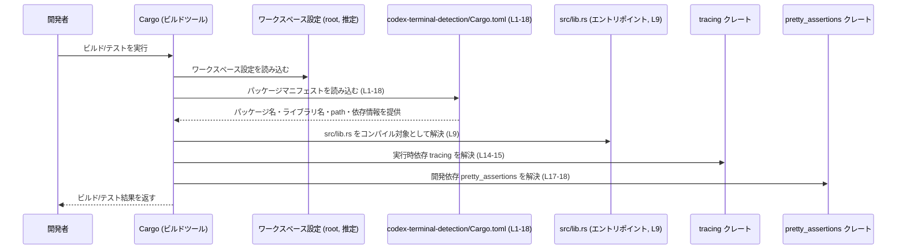

# terminal-detection/Cargo.toml コード解説

## 0. ざっくり一言

`terminal-detection/Cargo.toml` は、Rust ライブラリクレート `codex-terminal-detection` のビルド設定と依存関係を定義する Cargo マニフェストファイルです（`Cargo.toml:L1-9,14-18`）。  
クレートのバージョン・edition・ライセンスや、`tracing` / `pretty_assertions` などの依存関係がワークスペース経由で管理されることが分かります（`Cargo.toml:L2-5,15,18`）。

---

## 1. このモジュールの役割

### 1.1 概要

- このファイルは、Rust のビルドツール Cargo が参照するマニフェストであり、`codex-terminal-detection` クレートのメタデータ・ライブラリターゲット・依存クレートを定義します（`Cargo.toml:L1-5,7-9,14-18`）。
- 実際のターミナル検出ロジックや公開 API は `src/lib.rs` 側にあり、このファイルからはその具体的な内容は分かりません（`Cargo.toml:L9` からライブラリのエントリポイントのみが分かります）。

### 1.2 アーキテクチャ内での位置づけ

このファイルから読み取れるアーキテクチャ上の関係は次のとおりです。

- 本クレートはワークスペースの一部であり、`version` / `edition` / `license` / `lints` をワークスペース設定から継承します（`Cargo.toml:L3-5,11-12`）。
- ライブラリターゲット `codex_terminal_detection` は `src/lib.rs` をエントリポイントとします（`Cargo.toml:L7-9`）。
- 実行時依存としてロギング用クレート `tracing` を利用します（`Cargo.toml:L14-15`）。
- 開発時（テストなど）専用依存として `pretty_assertions` を利用します（`Cargo.toml:L17-18`）。

これを簡略な依存関係図として表すと、次のようになります。



※ ワークスペース root の `Cargo.toml` 自体はこのチャンクには現れませんが、`.workspace = true` の指定から存在が前提とされていると分かります。

### 1.3 設計上のポイント

コード（マニフェスト）から読み取れる設計上の特徴は次のとおりです。

- **ワークスペース集中管理**  
  - `version.workspace = true` / `edition.workspace = true` / `license.workspace = true` により、バージョン・edition・ライセンスを一元管理しています（`Cargo.toml:L3-5`）。
- **ライブラリクレートとしての定義**  
  - `[lib]` セクションで `name = "codex_terminal_detection"` と `path = "src/lib.rs"` を指定し、バイナリではなくライブラリとしてビルドされます（`Cargo.toml:L7-9`）。
- **ロギング基盤の導入**  
  - 依存クレートとして `tracing` のみが定義されており、本クレート内部のログ出力や計測に `tracing` を使用する設計であることが分かります（`Cargo.toml:L14-15`）。
- **テスト用アサーション拡張**  
  - 開発依存として `pretty_assertions` が指定されており、テストや検証コードで読みやすい差分出力を行う方針と見られます（`Cargo.toml:L17-18`）。
- **Lint 設定の統一**  
  - `[lints] workspace = true` により、Clippy などの lints 設定をワークスペース共通にしています（`Cargo.toml:L11-12`）。

---

### 1.4 コンポーネント一覧（インベントリー）

このチャンクに現れる「コンポーネント」（クレート・設定・依存）の一覧です。

| コンポーネント名 | 種別 | 説明 | 根拠 |
|------------------|------|------|------|
| `codex-terminal-detection` | パッケージ名 | Cargo パッケージ（クレート）の名前です。 | `Cargo.toml:L1-2` |
| `codex_terminal_detection` | ライブラリターゲット名 | `src/lib.rs` をエントリポイントとするライブラリターゲット名です。 | `Cargo.toml:L7-9` |
| `src/lib.rs` | ライブラリソース | 公開 API やコアロジックが実装される Rust ソースファイルです（内容はこのチャンクには現れません）。 | `Cargo.toml:L9` |
| `version.workspace` | ワークスペース設定委譲 | バージョンをワークスペースで一元管理します。 | `Cargo.toml:L3` |
| `edition.workspace` | ワークスペース設定委譲 | Rust edition をワークスペースで一元管理します。 | `Cargo.toml:L4` |
| `license.workspace` | ワークスペース設定委譲 | ライセンスをワークスペースで一元管理します。 | `Cargo.toml:L5` |
| `lints.workspace` | ワークスペース設定委譲 | Lint 設定をワークスペース共通にします。 | `Cargo.toml:L11-12` |
| `tracing` | 依存クレート | ロギング・トレース用の実行時依存です。 | `Cargo.toml:L14-15` |
| `pretty_assertions` | 開発依存クレート | テスト時のアサーション出力改善のための dev-dependency です。 | `Cargo.toml:L17-18` |

※ このファイルには Rust の関数や構造体の定義は含まれていません。そのため関数・構造体インベントリーは「該当なし」となります。

---

## 2. 主要な機能一覧

このファイル自体は実行コードではなく設定ファイルですが、「機能」として次の役割を果たします。

- パッケージメタデータの定義: クレート名とワークスペース由来の version / edition / license を定義します（`Cargo.toml:L1-5`）。
- ライブラリターゲットの定義: ライブラリ名とエントリポイント (`src/lib.rs`) を指定します（`Cargo.toml:L7-9`）。
- Lint 設定の共有: `[lints] workspace = true` により、ワークスペース共通の lint 設定を適用します（`Cargo.toml:L11-12`）。
- 実行時依存の宣言: ロギング用 `tracing` を依存関係として宣言します（`Cargo.toml:L14-15`）。
- 開発用依存の宣言: テスト等で利用する `pretty_assertions` を dev-dependency として宣言します（`Cargo.toml:L17-18`）。

---

## 3. 公開 API と詳細解説

このファイルは Cargo マニフェストであり、Rust の型・関数・メソッド定義は含まれていません。  
そのため、「公開 API」そのものは `src/lib.rs` 以降のコードに存在し、このチャンクからは詳細を確認できません。

### 3.1 型一覧（構造体・列挙体など）

このファイルに Rust の型定義は存在しません。

| 名前 | 種別 | 役割 / 用途 |
|------|------|-------------|
| （なし） | - | `Cargo.toml` には Rust の型定義は含まれていません。 |

### 3.2 関数詳細

`Cargo.toml` 自体に関数は定義されないため、このセクションに詳細解説すべき関数はありません。  
公開関数やコアロジックは、`src/lib.rs` など別ファイルに定義されていると考えられますが、このチャンクには現れません。

### 3.3 その他の関数

- 該当なし（本ファイルには Rust の関数は定義されていません）。

---

## 4. データフロー

このファイルから直接分かるのは、「ビルド時のメタ情報や依存関係がどのように使われるか」というレベルのデータフローです。  
実行時のデータフロー（ターミナル検出ロジック内部でのデータの流れ）は `src/lib.rs` 側にあり、このチャンクには現れません。

### 4.1 ビルド時のデータフロー（マニフェスト利用）

Cargo ビルド時のおおまかな流れを、`Cargo.toml` がどのように参照されるかという観点で示します。



**ポイント**

- `path = "src/lib.rs"` に基づき、`src/lib.rs` がライブラリのエントリポイントとしてコンパイルされます（`Cargo.toml:L9`）。
- `tracing` / `pretty_assertions` はそれぞれのクレートとして別途解決され、コンパイル・リンク対象となります（`Cargo.toml:L15,18`）。
- エラー処理や並行性などランタイムの挙動は、このファイルだけからは分かりません。

---

## 5. 使い方（How to Use）

### 5.1 基本的な使用方法（このクレート側）

このマニフェストにより、`codex-terminal-detection` は「ライブラリクレート」としてビルドされる前提が整えられています（`Cargo.toml:L7-9`）。  
同一ワークスペース内であれば、通常はワークスペース root から `cargo build` / `cargo test` を実行するだけで、このクレートも含めてビルドされます。

実際のコード利用は `src/lib.rs` に定義される公開関数などに対して行われますが、このチャンクにはその定義がないため、具体的な呼び出し例は書けません。

### 5.2 他クレートからの依存例（一般的なパターン）

別クレートからこのライブラリを利用する一般的な Cargo 設定例を示します。  
実際のパス（`path`）などはプロジェクト構成に依存するため、このファイルからは正確には分かりません。

```toml
[dependencies]
codex-terminal-detection = { path = "../terminal-detection" }  # 実際のパスはプロジェクトによって異なります
```

このように依存を追加すると、別クレートからは通常のライブラリクレートとして `use codex_terminal_detection::...;` のように利用できます。  
ただし、どのモジュールや関数が公開されているかは `src/lib.rs` 側のコード（このチャンクには現れない）を確認する必要があります。

### 5.3 よくある使用パターン

このファイルから分かる範囲での「使用パターン」は、主に以下の設定レベルに留まります。

- `tracing` によるロギングを行うクレートとして利用する  
  → 実装側で `tracing::info!` などを利用する設計が想定されますが、具体的な呼び出しは `src/lib.rs` 以降です。
- テストで `pretty_assertions` を用いる  
  → `#[cfg(test)]` モジュール内で `pretty_assertions::assert_eq!` などを使うことが考えられますが、テストコードはこのチャンクには現れません。

### 5.4 使用上の注意点（まとめ）

このマニフェストに関する注意点を、分かる範囲でまとめます。

- **ワークスペース前提**  
  - `version.workspace = true` などの指定があるため、このパッケージはワークスペースの一部として利用される前提です（`Cargo.toml:L3-5,11-12`）。  
    単独でビルドしようとした場合、対応するワークスペース設定がなければ Cargo がエラーを出します。
- **`src/lib.rs` の存在**  
  - `path = "src/lib.rs"` に対応するファイルが存在しない場合、ビルド時に「ファイルが見つからない」系のエラーになります（`Cargo.toml:L9`）。
- **依存クレートの解決**  
  - `tracing` や `pretty_assertions` がワークスペースか上位の設定で正しくバージョン指定されていない場合、依存解決エラーが発生します（`Cargo.toml:L15,18`）。  
    これらは `.workspace = true` の有無は書かれていますが、バージョン番号自体はこのチャンクには現れません。

---

## 6. 変更の仕方（How to Modify）

### 6.1 新しい機能を追加する場合（設定面）

新しい機能（例えば別のロギングバックエンドや OS 依存のコードなど）を追加する際、このファイルに対して行う可能性のある変更は次のようになります。

1. **新しい依存クレートの追加**  
   - ランタイムで利用するクレートが増える場合は、`[dependencies]` セクションに依存を追加します（`Cargo.toml:L14-15`）。
   - 例（一般的な書き方）:

     ```toml
     [dependencies]
     tracing = { workspace = true }
     # 新しい依存の例
     owo-colors = "4"  # 実際のバージョンはプロジェクトポリシーに依存
     ```

2. **テスト専用依存の追加**  
   - テスト強化のためライブラリを追加したい場合は、`[dev-dependencies]` に追記します（`Cargo.toml:L17-18`）。

3. **ライブラリパス・名前の変更**  
   - `src/lib.rs` 以外にエントリポイントを変えたい場合は、`[lib] path` を変更します（`Cargo.toml:L7-9`）。  
     この場合、実際にファイル構成も合わせて変更する必要があります。

### 6.2 既存の機能を変更する場合（契約と影響範囲）

このファイルを変更する際の「契約」と注意点です。

- **ワークスペース委譲を外す場合**  
  - `version.workspace = true` 等を削除し、個別に `version = "..."` 等を記載することも可能ですが、ワークスペース側の運用ポリシーに影響します（`Cargo.toml:L3-5`）。  
    その場合はワークスペース root の `Cargo.toml` との整合性を確認する必要があります（root ファイルはこのチャンクには現れません）。
- **依存削除の影響**  
  - `tracing` を削除すると、`src/lib.rs` やその他モジュール内で `tracing` API を呼んでいるコードがコンパイルエラーになります（`Cargo.toml:L14-15`）。  
    削除前に `grep` 等で使用箇所を確認する必要があります。
  - 同様に `pretty_assertions` を削除すると、テストコードに影響します（`Cargo.toml:L17-18`）。
- **エッジケース（マニフェストレベル）**
  - `path = "src/lib.rs"` と実際のファイルパスがズレるとビルド不可です（`Cargo.toml:L9`）。
  - `[lints] workspace = true` を無効化すると、他クレートと lint 設定が異なる状態になり、スタイルや警告レベルの一貫性が失われます（`Cargo.toml:L11-12`）。

**安全性・セキュリティ観点**

- このファイル自体は設定のみであり、直接ユーザー入力を処理するコードや並行処理ロジックは含みません。  
  したがって、入力検証やスレッドセーフティに関する情報はここからは分かりません。
- 依存クレートの選定（例: `tracing`）により、ログに含まれる情報の扱い（PII のログ出力など）に注意する必要がありますが、その詳細は実装側のコード依存です。このチャンクには現れません。

---

## 7. 関連ファイル

このマニフェストと密接に関係するファイル・設定は次のとおりです。

| パス / コンポーネント | 役割 / 関係 | 根拠 |
|-----------------------|------------|------|
| `terminal-detection/src/lib.rs` | `codex_terminal_detection` ライブラリターゲットのエントリポイント。公開 API やコアロジックが実装されると考えられます。 | `Cargo.toml:L7-9` |
| （ワークスペース root の `Cargo.toml`、推定） | `version.workspace` / `edition.workspace` / `license.workspace` / `lints.workspace` などの実体を定義するファイル。 | `Cargo.toml:L3-5,11-12` |
| `tracing` クレート | ロギング・トレースのための外部依存。ビルド時に Rust crates.io などから解決されます。 | `Cargo.toml:L14-15` |
| `pretty_assertions` クレート | テストのアサーション出力改善のための dev-dependency。テストコードで利用されます。 | `Cargo.toml:L17-18` |

このチャンクには `src/lib.rs` やワークスペース root のマニフェスト内容は含まれていないため、公開 API や実際の処理ロジックについては、それらのファイルを別途確認する必要があります。
