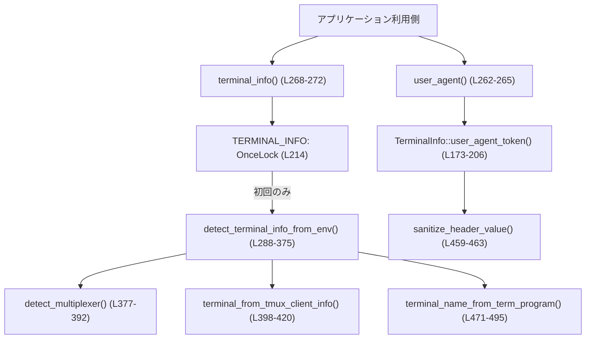
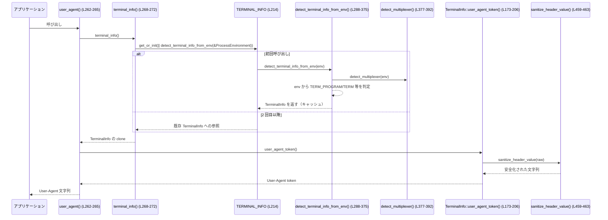

# terminal-detection/src/lib.rs コード解説

## 0. ざっくり一言

- 実行中プロセスの環境変数や tmux から **端末エミュレータ／マルチプレクサの種類・バージョン** を検出し、  
  構造化情報 `TerminalInfo` と **User-Agent 向けの安全な文字列** を提供するモジュールです  
  （terminal-detection/src/lib.rs:L8-21, L262-265, L288-375）。

---

## 1. このモジュールの役割

### 1.1 概要

- このモジュールは、端末の種類やバージョンを推定し、TUI や OpenTelemetry の User-Agent ログに渡すための  
  **統一された端末メタデータ** を提供します（L1-4, L8-21）。
- 端末名は `TerminalName` の列挙型に正規化され、必要に応じて `TERM_PROGRAM` / `TERM` / tmux クライアント情報から  
  付随情報（バージョン・multiplexer）を補います（L23-54, L70-84, L288-375）。
- グローバルな `OnceLock<TerminalInfo>` によって検出結果を 1 度だけ計算し、以降はキャッシュされた値を返します（L214, L268-272）。

### 1.2 アーキテクチャ内での位置づけ

- 下層:
  - OS の環境変数アクセスと `tmux display-message` コマンド実行（L245-259, L438-456）。
- 本モジュール:
  - `Environment` トレイトで環境アクセスを抽象化し（L219-240）、`ProcessEnvironment` で実装（L242-260）。
  - `detect_terminal_info_from_env` が検出ロジックの中核（L288-375）。
  - `TerminalInfo` が検出結果の表現（L8-21）。
- 上層:
  - 公開 API `terminal_info()` / `user_agent()` を通じて、他のコードが端末情報や User-Agent 文字列を取得（L262-272）。



### 1.3 設計上のポイント

- **責務分割**
  - 端末情報の表現 (`TerminalInfo`, `TerminalName`, `Multiplexer`) と検出ロジックを分離（L8-21, L23-54, L56-68, L288-375）。
  - OS 環境アクセスと検出ロジックを `Environment` トレイトで分離し、テスト容易性を確保（L219-240, L242-260）。
- **検出の優先順位**
  - `TERM_PROGRAM`（tmux 特例を含む） > 各種専用環境変数 > `TERM` > Unknown の順で検出（L274-375）。
  - `TERM_PROGRAM=tmux` の場合は、tmux 自身ではなく **クライアント端末** を優先して認識（L274-287, L398-420）。
- **エラーハンドリング方針**
  - 環境変数が未設定・非 UTF-8・tmux コマンド失敗などは、いずれも `Option` / fallback による安全なデグレード（L245-255, L445-456）。
  - User-Agent 文字列はヘッダとして不正な文字をすべて `_` に置換して安全性を確保（L459-468）。
- **状態管理と並行性**
  - `OnceLock<TerminalInfo>` による遅延初期化 & スレッド安全な共有（L214, L268-272）。
  - `TerminalInfo` は `Clone` 可能なイミュータブルなデータ構造（L8-20）。

---

## 2. 主要な機能一覧

- 端末情報の構造化:
  - `TerminalInfo`: 端末名・バージョン・TERM・multiplexer などを保持（L8-21）。
  - `TerminalName`: 既知端末のカテゴリ（AppleTerminal, WezTerm, Kitty など）（L23-54）。
  - `Multiplexer`: `Tmux` / `Zellij` のメタデータ（L56-68）。
- 端末情報の検出:
  - `terminal_info()`: 現在のプロセスに対応する `TerminalInfo` を返す（L268-272）。
  - `detect_terminal_info_from_env()`: 環境から `TerminalInfo` を組み立てるコアロジック（L288-375）。
  - `detect_multiplexer()`: tmux / Zellij を検出する（L377-392）。
- tmux クライアント情報:
  - `tmux_client_info()`, `tmux_display_message()`: `tmux display-message` 経由でクライアント TERM 情報を取得（L438-456）。
  - `terminal_from_tmux_client_info()`: tmux クライアント情報を `TerminalInfo` に変換（L398-420）。
- User-Agent 文字列:
  - `user_agent()`: HTTP User-Agent ヘッダ向けの端末識別子文字列を返す（L262-265）。
  - `TerminalInfo::user_agent_token()`: 検出情報をもとにプレーンな token を組み立て、`sanitize_header_value` で安全化（L173-206, L459-463）。
- 補助ユーティリティ:
  - `terminal_name_from_term_program()`: `TERM_PROGRAM` 文字列を正規化して `TerminalName` にマッピング（L471-495）。
  - `sanitize_header_value()`, `is_valid_header_value_char()`: HTTP ヘッダ用の文字列をホワイトリスト方式で正規化（L459-468）。
  - `none_if_whitespace()`: 空白のみの文字列を `None` に変換（L504-505）。

---

## 3. 公開 API と詳細解説

### 3.1 型一覧（構造体・列挙体など）

#### 型インベントリ

| 名前 | 種別 | 公開 | 役割 / 用途 | 定義位置 |
|------|------|------|-------------|----------|
| `TerminalInfo` | 構造体 | `pub` | 検出された端末名・TERM_PROGRAM・バージョン・TERM・multiplexer を保持するメインのメタデータ型 | terminal-detection/src/lib.rs:L8-21 |
| `TerminalName` | 列挙体 | `pub` | AppleTerminal, Ghostty, WezTerm など既知の端末カテゴリを表す | L23-54 |
| `Multiplexer` | 列挙体 | `pub` | `Tmux { version }` / `Zellij {}` といった multiplexer の種類とバージョンを表す | L56-68 |
| `TmuxClientInfo` | 構造体 | `pub` でない | `tmux display-message` から取得したクライアント TERM 情報（termtype/termname）を一時的に保持 | L80-84 |
| `Environment` | トレイト | `pub` でない | 環境変数アクセスを抽象化し、テスト時に差し替え可能にする | L219-240 |
| `ProcessEnvironment` | 構造体 | `pub` でない | 実際に `std::env` / `tmux` コマンドを使う `Environment` 実装 | L242-260 |

#### グローバル状態

| 名前 | 種別 | 公開 | 役割 / 用途 | 定義位置 |
|------|------|------|-------------|----------|
| `TERMINAL_INFO` | `static OnceLock<TerminalInfo>` | `pub` ではない（内部静的） | `terminal_info()` から利用される、検出済み `TerminalInfo` のスレッド安全なキャッシュ | L214 |

---

### 3.2 重要関数の詳細（最大 7 件）

#### `pub fn user_agent() -> String`（L262-265）

**概要**

- 現在のプロセスに対応する端末情報から **User-Agent ヘッダ向けの端末識別子文字列** を生成します（L262-265）。
- 返される文字列は `sanitize_header_value` によって HTTP ヘッダとして安全な文字だけを含みます（L173-206, L459-463）。

**引数**

- なし。

**戻り値**

- `String`:
  - 例: `"WezTerm/20240202-1234"`, `"kitty"`, `"xterm-256color"` など。
  - 端末が判別不能な場合は `"unknown"` をベースにした安全化済み文字列（L173-206）。

**内部処理の流れ**

1. `terminal_info()` を呼び出して `TerminalInfo` を取得（L262-265）。
2. `TerminalInfo::user_agent_token()` を呼んで、生の端末トークンを生成（L262-265, L173-205）。
3. `user_agent_token()` 内で `sanitize_header_value()` が呼ばれ、不正な文字が `_` に置換される（L173-206, L459-463）。

**Examples（使用例）**

```rust
// HTTP クライアントの User-Agent に端末情報を含める例
let ua = terminal_detection::user_agent(); // 端末由来の UA 文字列を取得（L262-265）

// 例: "WezTerm/20240203-110000" や "kitty" など
let header_value = format!("my-app/1.0 ({})", ua);

// これを HTTP ライブラリのヘッダ設定に渡す
// reqwest::Client::builder()
//     .user_agent(header_value)
//     .build()?;
```

**Errors / Panics**

- この関数自身は `Result` を返さず、panic する可能性のあるコードも含みません。
  - 内部で使用する `terminal_info()` や `user_agent_token()` も `unwrap` や `expect` を使っていません（L173-206, L268-272）。
- したがって、**失敗時は「やや不正確な端末識別子（例: "unknown"）」へのフォールバック**で表現されます。

**Edge cases（エッジケース）**

- 環境変数が一切設定されていない場合:
  - `TerminalInfo::unknown()` による `"unknown"` がベースの UA になります（L162-171, L173-206）。
- 端末名やバージョンに制御文字などが含まれる場合:
  - `sanitize_header_value()` によって不正な文字は `_` に置換されます（L459-463）。

**使用上の注意点**

- 返された文字列はすでに HTTP ヘッダ向けに sanitization 済みなので、**追加のエスケープは基本的に不要**です。
- 検出は `OnceLock` 経由で 1 度だけ行われるため、**プロセス途中で環境変数を変更しても UA の内容は変わりません**（L214, L268-272）。

---

#### `pub fn terminal_info() -> TerminalInfo`（L268-272）

**概要**

- 現在のプロセスに対する **構造化された端末メタデータ `TerminalInfo`** を返します。
- 初回呼び出し時に環境から検出し、以降は `OnceLock` にキャッシュされた値のクローンを返します（L214, L268-272）。

**引数**

- なし。

**戻り値**

- `TerminalInfo`:
  - 検出された `name: TerminalName`, `term_program`, `version`, `term`, `multiplexer` を含みます（L8-20）。

**内部処理の流れ**

1. `TERMINAL_INFO.get_or_init(...)` を呼び出し、初期化済みであればその参照を取得、未初期化ならクロージャを実行（L268-271）。
2. 初回のみ `detect_terminal_info_from_env(&ProcessEnvironment)` が実行され、実際の検出が行われます（L268-272, L288-375）。
3. `ProcessEnvironment` は `Environment` トレイトを実装しており、`std::env` および tmux コマンドを通じて実環境を読みます（L219-240, L242-260）。
4. 最後に `clone()` した `TerminalInfo` を返します（L271-272）。

**Examples（使用例）**

```rust
// 端末に応じて TUI の挙動を変える例
use terminal_detection::terminal_info;
use terminal_detection::TerminalName;

let info = terminal_info(); // 端末情報を取得（L268-272）

match info.name {
    TerminalName::WezTerm => {
        // wezterm 向けのキーバインドや色設定を選択する
    }
    TerminalName::Kitty => {
        // kitty 向けの最適化
    }
    _ => {
        // デフォルト設定
    }
}

// multiplexer 情報の利用
if info.is_zellij() {
    // Zellij 上ではウィンドウサイズ取得の頻度を下げる、など
}
```

**Errors / Panics**

- `OnceLock::get_or_init` は初期化クロージャが panic したときのみ再 panic しますが、
  `detect_terminal_info_from_env` 内には `unwrap` / `expect` が無く、外部コマンド呼び出しも `Option` で握りつぶしているため、このモジュール内に panic 要因はありません（L288-375, L438-456）。
- 環境変数が非 UTF-8 の場合は `tracing::warn!` を出しつつ `None` として扱います（L245-255）。

**Edge cases**

- 複数スレッドから同時に `terminal_info()` を呼ぶ場合:
  - `OnceLock` がスレッド安全に 1 度だけ初期化を実行します（L214, L268-271）。
- 環境変数の状態が途中で変わった場合:
  - 初回呼び出し時の情報がキャッシュされ、**以降は変わりません**。

**使用上の注意点**

- 「テストで環境を差し替えて検出ロジックだけを試したい」といった用途には、  
  内部関数 `detect_terminal_info_from_env` と `Environment` 実装を利用する必要がありますが、いずれも `pub` ではないため、**クレート外からは利用できません**。
- プロセス中に端末が変わることは通常ないため、このキャッシュ戦略は合理的ですが、  
  「環境変数を変更して再検出したい」ような特殊な用途には向きません。

---

#### `fn detect_terminal_info_from_env(env: &dyn Environment) -> TerminalInfo`（L288-375）

**概要**

- `Environment` 抽象を通じて環境変数や tmux クライアント情報を読み取り、  
  **端末名・バージョン・TERM・multiplexer を決定するコア検出関数**です。

**引数**

| 引数名 | 型 | 説明 |
|--------|----|------|
| `env` | `&dyn Environment` | 環境変数アクセスと tmux クライアント情報取得を提供するトレイトオブジェクト（L219-240） |

**戻り値**

- `TerminalInfo`:
  - multiplexer 情報込みで、可能な限り端末を特定した構造体（L8-21）。

**内部処理の流れ（優先順位）**

1. **multiplexer 検出**  
   - `detect_multiplexer(env)` で tmux / Zellij の検出を先に行い、その結果を `multiplexer` に保持（L289-290, L377-392）。

2. **`TERM_PROGRAM` がある場合**（最優先、tmux 特例あり）（L291-303）
   - `env.var_non_empty("TERM_PROGRAM")` が `Some(term_program)` の場合、以下の分岐:
     1. `term_program` が `"tmux"`（大小無視）かつ multiplexer も tmux のとき（L292-293）、
        `terminal_from_tmux_client_info(env.tmux_client_info(), multiplexer.clone())` を試み、
        `Some(terminal)` であれば **tmux クライアント端末を優先**して返す（L292-297）。
     2. 上記でクライアント端末を特定できない場合は、
        `TERM_PROGRAM_VERSION` を `version` として取得し（L300）、
        `terminal_name_from_term_program(&term_program)` で `TerminalName` を推定（L301）、
        `TerminalInfo::from_term_program(...)` で返す（L301-302）。

3. **`TERM_PROGRAM` が無い場合の端末専用変数チェック**（L305-368）
   - 以下の順で環境変数をチェックし、最初にマッチしたものを採用します:
     - `WEZTERM_VERSION` → `TerminalName::WezTerm` + バージョン（L305-308）。
     - iTerm2 系 (`ITERM_SESSION_ID` / `ITERM_PROFILE` / `ITERM_PROFILE_NAME`) → `TerminalName::Iterm2`（L310-312）。
     - `TERM_SESSION_ID` → Apple Terminal（L314-320）。
     - Kitty（`KITTY_WINDOW_ID` または `TERM` に "kitty" を含む）→ `TerminalName::Kitty`（L322-329）。
     - Alacritty（`ALACRITTY_SOCKET` または `TERM == "alacritty"`）→ `TerminalName::Alacritty`（L331-341）。
     - `KONSOLE_VERSION` → `TerminalName::Konsole` + バージョン（L343-347）。
     - `GNOME_TERMINAL_SCREEN` → `TerminalName::GnomeTerminal`（L349-355）。
     - `VTE_VERSION` → `TerminalName::Vte` + バージョン（L357-360）。
     - `WT_SESSION` → `TerminalName::WindowsTerminal`（L362-368）。

4. **最後のフォールバック: `TERM` または Unknown**（L370-374）
   - `env.var_non_empty("TERM")` があれば `TerminalInfo::from_term(term, multiplexer)`（L370-371）。
   - それもない場合は `TerminalInfo::unknown(multiplexer)`（L373-374）。

**Examples（使用例）**

> この関数は `pub` ではないため、外部から直接呼ぶことはできません。以下は擬似コードの例です。

```rust
// テスト用: 独自 Environment 実装を使って検出ロジックだけを検証するイメージ
struct FakeEnv { term_program: Option<String> /* ... */ }

// Environment を実装して必要な env 値を返す
impl Environment for FakeEnv {
    fn var(&self, name: &str) -> Option<String> {
        match name {
            "TERM_PROGRAM" => self.term_program.clone(),
            _ => None,
        }
    }
    fn tmux_client_info(&self) -> TmuxClientInfo {
        TmuxClientInfo::default()
    }
}

// detect_terminal_info_from_env(&fake_env) を使えば、環境に依存しないテストが可能
```

**Errors / Panics**

- すべての外部要素（環境変数・tmux コマンド）は `Option` による失敗吸収で扱われます。
  - 環境変数が無い / 非 UTF-8: `None`（L245-255）。
  - `tmux display-message` のプロセス起動エラー / 非 0 終了コード / 非 UTF-8 出力: `None`（L445-456）。
- panic 要因となる `unwrap` / `expect` は `split_term_program_and_version` 内の `unwrap_or_default()` のみで、
  これは `Option` が `None` のときに空文字列を返すだけの安全な実装です（L431-435）。

**Edge cases**

- **`TERM_PROGRAM=tmux` だが multiplexer 検出が tmux ではない場合**（例: 手動で TERM_PROGRAM を書き換えた）:
  - `matches!(multiplexer, Some(Multiplexer::Tmux { .. }))` が false のため tmux クライアント情報は使われず、
    単に `TerminalName::Unknown` + `term_program = "tmux"` として扱われます（L291-303）。
- **複数の端末専用 env が同時に立っている場合**:
  - コード順により、先に書かれた条件が優先されます（例: `WEZTERM_VERSION` があれば、後続の `WT_SESSION` などは見られません）（L305-368）。
- **`TERM` が `"dumb"` の場合**:
  - `TerminalInfo::from_term` 内で `TerminalName::Dumb` がセットされます（L147-160）。

**使用上の注意点**

- 検出順序に意味があるため、新しい端末の検出を追加する場合は、  
  **どの端末より優先させるべきか**を考えた上で条件を挿入する必要があります（詳細は 6.1 参照）。
- tmux クライアント情報の取得は `tmux` プロセスの起動を伴うため、実行環境に tmux が存在しない場合には  
  `None` となりますが、エラーにはなりません（L438-456）。

---

#### `fn detect_multiplexer(env: &dyn Environment) -> Option<Multiplexer>`（L377-392）

**概要**

- tmux / Zellij などの **端末マルチプレクサが有効かどうか**を環境変数から判定します。

**引数**

| 引数名 | 型 | 説明 |
|--------|----|------|
| `env` | `&dyn Environment` | 環境変数へのアクセス |

**戻り値**

- `Option<Multiplexer>`:
  - `Some(Multiplexer::Tmux { version })` / `Some(Multiplexer::Zellij {})` / `None` のいずれか。

**内部処理の流れ**

1. tmux 判定:
   - `TMUX` または `TMUX_PANE` が non-empty なら tmux と判定（L378-381）。
   - バージョンは `tmux_version_from_env(env)` で `TERM_PROGRAM` / `TERM_PROGRAM_VERSION` から取得（L379-381, L422-428）。
2. Zellij 判定:
   - `ZELLIJ` / `ZELLIJ_SESSION_NAME` / `ZELLIJ_VERSION` のいずれかが non-empty なら Zellij と判定（L384-388）。
3. どちらも該当しなければ `None`（L391）。

**Edge cases**

- tmux と Zellij の両方の env が立っている場合:
  - コード順により **tmux が優先**されます（L377-389）。
- `TERM_PROGRAM` が `"tmux"` でない場合、`tmux_version_from_env` は `None` を返し、  
  `Multiplexer::Tmux { version: None }` となります（L422-428）。

**使用上の注意点**

- multiplexer の検出結果は `TerminalInfo` に埋め込まれて返されるため、  
  呼び出し側は通常 `terminal_info().multiplexer` を見るだけで十分です（L8-20, L268-272）。

---

#### `fn terminal_from_tmux_client_info(client_info: TmuxClientInfo, multiplexer: Option<Multiplexer>) -> Option<TerminalInfo>`（L398-420）

**概要**

- `tmux display-message` から取得したクライアント端末情報をもとに、  
  **tmux クライアントとして実際に利用されている端末**（Ghostty / WezTerm など）を `TerminalInfo` として推定します。

**引数**

| 引数名 | 型 | 説明 |
|--------|----|------|
| `client_info` | `TmuxClientInfo` | `termtype` / `termname` を含む tmux クライアント情報（L80-84） |
| `multiplexer` | `Option<Multiplexer>` | すでに検出済みの multiplexer 情報（通常 `Some(Multiplexer::Tmux { .. })`） |

**戻り値**

- `Option<TerminalInfo>`:
  - クライアント端末を特定できた場合は `Some(TerminalInfo)`、それ以外は `None`。

**内部処理の流れ**

1. `termtype` / `termname` の両方に `none_if_whitespace` を適用し、空白のみなら `None` にする（L402-403, L504-505）。
2. `termtype` が `Some` の場合:
   - `split_term_program_and_version(termtype)` で `"prog ver"` を `(program, version)` に分割（L405-407, L431-435）。
   - `terminal_name_from_term_program(&program)` で `TerminalName` を推定し、未知なら `TerminalName::Unknown`（L407）。
   - `TerminalInfo::from_term_program_and_term` で `term_program = program`, `version`, `term = termname` を持つ `TerminalInfo` を生成（L408-414）。
3. `termtype` が `None` で `termname` が `Some` の場合:
   - `TerminalInfo::from_term(termname.to_string(), multiplexer)` を返す（L417-420）。
4. 両方 `None` の場合は `None`。

**Edge cases**

- `termtype` にバージョン情報以外の余分な語（例: `"wezterm foo bar"`）が含まれる場合:
  - `split_term_program_and_version` は最初の 2 語だけを扱うため、3 語目以降は無視されます（L431-435）。
- `termtype` が空文字列または空白のみの場合:
  - `none_if_whitespace` により `None` となり、`termname` のみから端末を推定します（L402-403, L504-505）。

**使用上の注意点**

- この関数は tmux 環境でのみ意味があります。tmux 以外の multiplexer 情報を渡しても、  
  `detect_terminal_info_from_env` 側で tmux 特例条件を満たさないため呼ばれません（L291-297）。

---

#### `fn tmux_display_message(format: &str) -> Option<String>`（L445-456）

**概要**

- `tmux display-message -p <format>` を実行し、その標準出力を文字列として取得するラッパーです。
- 主に `tmux_client_info()` から `#{client_termtype}` / `#{client_termname}` を取得するために使われます（L438-443）。

**引数**

| 引数名 | 型 | 説明 |
|--------|----|------|
| `format` | `&str` | `tmux display-message` の `-p` 引数（例: `"#{client_termtype}"`） |

**戻り値**

- `Option<String>`:
  - 成功時: 標準出力（末尾の改行などを `trim()` した上で `none_if_whitespace` にかけた結果）（L455-456）。
  - 失敗時: `None`（プロセス起動エラー、非 0 終了コード、非 UTF-8 出力など）（L445-456）。

**内部処理の流れ**

1. `std::process::Command::new("tmux")` でプロセスを起動（L446）。
2. `args(["display-message", "-p", format])` を指定して `.output()` を呼び、結果を取得（L446-448）。
3. `output().ok()?` でプロセス起動の `Result` を `Option` に変換（失敗時 `None`）（L448-449）。
4. 終了ステータスが成功でなければ `None`（L451-453）。
5. `String::from_utf8(output.stdout).ok()?` で出力を UTF-8 文字列に変換し、失敗したら `None`（L455）。
6. `value.trim().to_string()` した上で `none_if_whitespace` を適用し、空白のみなら `None`（L455-456, L504-505）。

**Errors / Panics**

- すべての失敗パスは `Option::None` で返されるため、panic はしません。
- `Command::new("tmux")` 自体は panic しません（引数はコンパイル時に固定文字列です）。

**Edge cases**

- 実行環境に `tmux` バイナリが存在しない場合:
  - `output().ok()?` が `Err` となり、結果として `None` を返します（L448-449）。
- tmux セッション外で実行した場合:
  - `tmux display-message` が非 0 終了コードになり、`None` になります（L451-453）。

**使用上の注意点**

- この関数はシェルコマンド実行のため **ブロッキング I/O** を伴い、`detect_terminal_info_from_env` の初回評価時にのみ呼ばれる可能性があります（L438-443, L291-297）。
- 引数 `format` はこのモジュール内では固定のリテラルのみを渡しており、外部入力は使っていません（L439-440）  
  → コマンドインジェクションの懸念はありません。

---

#### `fn sanitize_header_value(value: String) -> String`（L459-463）

**概要**

- 与えられた文字列から **HTTP User-Agent ヘッダに許可されない文字**を `_` に置換し、安全なヘッダ値に変換します。

**引数**

| 引数名 | 型 | 説明 |
|--------|----|------|
| `value` | `String` | 任意の文字列（端末名など） |

**戻り値**

- `String`:
  - `value` の各文字について `is_valid_header_value_char` が false の場合 `_` に置換した結果（L463-468）。

**内部処理の流れ**

1. `value.replace(|c| !is_valid_header_value_char(c), "_")` を実行（L463）。
2. `is_valid_header_value_char` は `A-Za-z0-9` と `-_. /` のみを許可（L466-468）。

**使用上の注意点**

- この関数は **破壊的に情報を落とす** ため、User-Agent 以外で元の情報を保持したい場合には  
  `TerminalInfo` のフィールドを直接利用し、`sanitize_header_value` の出力だけに依存しないのが安全です。

---

#### `fn terminal_name_from_term_program(value: &str) -> Option<TerminalName>`（L471-495）

**概要**

- `TERM_PROGRAM` などから得られる文字列を正規化し、既知の `TerminalName` にマッピングします。

**内部処理のポイント**

- 空白・`-`・`_`・`.` をすべて削除し、小文字化した上でパターンマッチ（L472-477）。
  - 例: `"iTerm.app"` → `"itermapp"` → `TerminalName::Iterm2`（L482）。
- 対応する端末: AppleTerminal, Ghostty, iTerm, Warp, VS Code, WezTerm, Kitty, Alacritty, Konsole, GNOME Terminal, VTE, Windows Terminal, Dumb（L479-493）。

**Edge cases**

- 未知の文字列: `None` を返し、上位では `TerminalName::Unknown` へのフォールバックに使われます（L301, L407）。

---

#### `fn TerminalInfo::user_agent_token(&self) -> String`（L173-206）

**概要**

- `TerminalInfo` 内の情報をもとに **生の端末トークン文字列** を構築し、それを `sanitize_header_value` で安全化します。

**重要なロジック**

- 優先順位:
  1. `term_program` があれば `"prog/version"` または `"prog"`（L175-179）。
  2. `term` が non-empty ならそれをそのまま使用（L180-182）。
  3. 上記が無ければ `name: TerminalName` に応じた固定文字列または `"Name/version"`（L183-202, L497-502）。
- 最後に `sanitize_header_value(raw)` を通して返却（L205-206）。

---

### 3.3 その他の関数・メソッド一覧

| 関数名 / メソッド名 | 種別 | 役割（1 行） | 定義位置 |
|---------------------|------|--------------|----------|
| `TerminalInfo::new` | associated | `TerminalInfo` のフィールドをそのまま受け取って構築する内部コンストラクタ | L88-102 |
| `TerminalInfo::from_term_program` | associated | `TERM_PROGRAM` + バージョン + multiplexer から `TerminalInfo` を構築 | L105-118 |
| `TerminalInfo::from_term_program_and_term` | associated | 上記に `TERM` 値も含めて `TerminalInfo` を構築 | L121-128 |
| `TerminalInfo::from_name` | associated | 端末名とバージョンから `term_program` / `term` なしの `TerminalInfo` を構築 | L132-144 |
| `TerminalInfo::from_term` | associated | `TERM` から Dumb/Unknown を判定しつつ `TerminalInfo` を構築 | L146-160 |
| `TerminalInfo::unknown` | associated | すべて Unknown の `TerminalInfo` を生成 | L162-171 |
| `TerminalInfo::is_zellij` | method (`pub`) | multiplexer が Zellij かどうか判定 | L208-211 |
| `Environment::var` | trait メソッド | env 変数の生値取得 | L221 |
| `Environment::has` | trait デフォルト | env 変数が設定されているか判定 | L223-226 |
| `Environment::var_non_empty` | trait デフォルト | 空白しかない値を除いた env 取得 | L228-231, L504-505 |
| `Environment::has_non_empty` | trait デフォルト | env が non-empty か判定 | L233-236 |
| `Environment::tmux_client_info` | trait メソッド | tmux クライアント情報取得 | L238-239 |
| `ProcessEnvironment::var` | impl | 実プロセスの env を `std::env::var` で取得し、非 UTF-8 は warn ログとともに無視 | L246-255 |
| `ProcessEnvironment::tmux_client_info` | impl | `tmux_client_info()` を呼び出す | L257-259 |
| `is_tmux_term_program` | free | `TERM_PROGRAM` が `"tmux"` かどうか（大小無視）を判定 | L394-395 |
| `tmux_version_from_env` | free | `TERM_PROGRAM=tmux` のときに `TERM_PROGRAM_VERSION` を取得 | L422-428 |
| `split_term_program_and_version` | free | `"prog ver"` → `(prog, Some(ver))` に分割 | L431-435 |
| `tmux_client_info` | free | `tmux_display_message` を 2 回呼び、`TmuxClientInfo` を構築 | L438-443 |
| `is_valid_header_value_char` | free | Header に許可される文字か判定 | L466-468 |
| `format_terminal_version` | free | `"Name"` + `version` を `"Name/version"` 形式に整形 | L497-502 |
| `none_if_whitespace` | free | 文字列が空白のみなら `None` を返す | L504-505 |

---

## 4. データフロー

### 4.1 代表的な処理シナリオ：User-Agent 文字列の生成

以下は、`user_agent()` がどのように端末情報を検出して文字列を生成するかのシーケンスです。



**要点**

- 端末検出は `detect_terminal_info_from_env` が一手に担い、**初回のみ**実行されます（L268-272, L288-375）。
- multiplexer 検出や tmux クライアント情報取得などは、環境変数と `tmux` コマンドに限定されています（L377-392, L438-456）。
- User-Agent 文字列は `TerminalInfo` から `user_agent_token()` で生成され、  
  最終的に `sanitize_header_value` を通して HTTP ヘッダとして安全化されます（L173-206, L459-463）。

### 4.2 潜在的なバグ・セキュリティ上の注意点

- **環境変数の信頼性**
  - すべての検出は環境変数に依存しているため、**外部から環境を操作できる場面では情報が偽装可能**です。  
    ただし User-Agent 文字列は sanitize 済みであり、ヘッダインジェクションにはなりにくい設計です（L459-463）。
- **tmux コマンド実行**
  - `tmux_display_message` は `tmux` プロセスを起動しますが、フォーマット文字列は固定のリテラルのみであり、  
    コマンドインジェクションの入力経路はありません（L439-440, L445-456）。
- **キャッシュの一貫性**
  - 一度検出された `TerminalInfo` はプロセス生存中変わらないため、  
    もし「起動中に TMUX 環境が変わる」ような特殊な状況があると、実際の状態と乖離する可能性があります（L214, L268-272）。

---

## 5. 使い方（How to Use）

### 5.1 基本的な使用方法

もっとも典型的な利用は、**User-Agent に端末情報を載せる**場合と、**TUI の挙動を端末ごとに調整する**場合です。

```rust
use terminal_detection::{terminal_info, user_agent, TerminalName};

fn main() {
    // 1. 端末メタデータの取得（L268-272）
    let info = terminal_info();

    // 2. 端末名に応じた分岐
    match info.name {
        TerminalName::WezTerm => {
            // wezterm 向けの最適化
        }
        TerminalName::Kitty => {
            // kitty 向けの設定
        }
        _ => {
            // デフォルト設定
        }
    }

    // 3. multiplexer 情報の利用（Zellij 判定）（L208-211）
    if info.is_zellij() {
        // Zellij 上では描画の頻度を調整するなど
    }

    // 4. User-Agent 文字列の生成（L262-265, L173-206）
    let ua = user_agent();
    println!("User-Agent terminal token = {}", ua);
}
```

### 5.2 よくある使用パターン

1. **HTTP クライアントとの組み合わせ**

```rust
// 端末情報付きの User-Agent を使う HTTP クライアント
let ua = user_agent();
let client = reqwest::Client::builder()
    .user_agent(format!("my-app/1.0 ({})", ua))
    .build()?;
// この後、client でリクエストを送る
```

1. **ロギング・メトリクスへの埋め込み**

```rust
let info = terminal_info();
tracing::info!(
    terminal_name = ?info.name,
    term_program = ?info.term_program,
    term = ?info.term,
    multiplexer = ?info.multiplexer,
    "Detected terminal",
);
```

### 5.3 よくある間違い

```rust
use terminal_detection::{terminal_info, TerminalInfo};

// 間違い例: TerminalInfo を自前で構築してしまう
let info = TerminalInfo {
    name: terminal_detection::TerminalName::Unknown,
    term_program: None,
    version: None,
    term: None,
    multiplexer: None,
};
// これでは実際の環境を反映していない

// 正しい例: terminal_info() を使って検出済みの情報を取得（L268-272）
let info = terminal_info();
```

```rust
// 間違い例: user_agent() の出力をさらに独自ルールで「無害化」して壊してしまう
let ua_raw = user_agent();
let ua = ua_raw.replace(" ", ""); // sanitize されている文字列をさらに加工してしまう

// 正しい例: user_agent() の出力をそのまま User-Agent ヘッダ値として使う（L459-463）
let ua = user_agent();
```

### 5.4 使用上の注意点（まとめ）

- **スレッド安全性**
  - `terminal_info()` / `user_agent()` は `OnceLock` とイミュータブルな `TerminalInfo` に基づいており、  
    複数スレッドから同時に呼び出しても安全です（L8-21, L214, L268-272）。
- **検出タイミング**
  - 初回呼び出し時の環境状態が固定されるため、プロセス起動後に環境変数を変更しても反映されません。
- **費用のかかる処理**
  - tmux 環境では `tmux display-message` のプロセス起動が発生しますが、初回検出時の 1 回のみです（L438-456）。

---

## 6. 変更の仕方（How to Modify）

### 6.1 新しい端末をサポートしたい場合

例: 新しい端末「FooTerm」を追加するときの典型的な手順です。

1. **`TerminalName` への追加**  
   - 列挙体に新 variant を追加（L23-54 付近）。
2. **`terminal_name_from_term_program` への対応追加**  
   - `TERM_PROGRAM` から `"footerm"` などへのマッピングを追加（L471-495）。
3. **検出ロジックへの組み込み**
   - その端末特有の環境変数がある場合は、`detect_terminal_info_from_env` 内の適切な位置に条件を追加（L305-368）。
   - 優先順位を意識して、似た端末（例: WezTerm, Kitty）との前後関係を決める。
4. **User-Agent 名の整形**
   - 固定文字列を使う場合は `TerminalInfo::user_agent_token` 内の `match self.name { ... }` に分岐を追加（L183-202）。

### 6.2 既存の検出ロジックを変更する場合

- **影響範囲の確認**
  - `detect_terminal_info_from_env` はすべての検出の入口なので、行動を変えると  
    `user_agent()`・`terminal_info()` を利用するすべてのコードに影響します（L262-272, L288-375）。
- **契約（前提条件・返り値の意味）**
  - `TerminalInfo` のフィールドは今のところ「None を許容する Optional 情報」であり、  
    新たに `None` 不可の前提を入れると既存利用コードと整合しなくなる可能性があります（L8-21）。
- **テスト・使用箇所の確認**
  - テストは別ファイル `terminal_tests.rs` に定義されており（L508-510）、  
    詳細な内容はこのチャンクには現れませんが、検出ロジック変更時はこのテストを必ず更新・確認する必要があります。

---

## 7. 関連ファイル

| パス | 役割 / 関係 |
|------|------------|
| `terminal-detection/src/lib.rs` | 本レポートの対象ファイル。端末検出ロジックと公開 API を提供 |
| `terminal-detection/src/terminal_tests.rs` | `#[cfg(test)]` でインクルードされるテストコード（中身はこのチャンクには現れません）（L508-510） |

このモジュール単体で端末検出の完結した機能を提供しており、他ファイルへの依存は標準ライブラリと `tracing` のみです。
