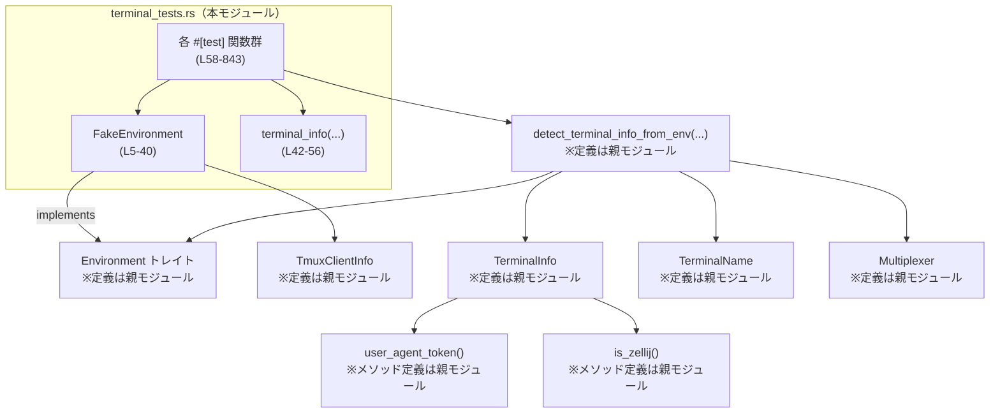
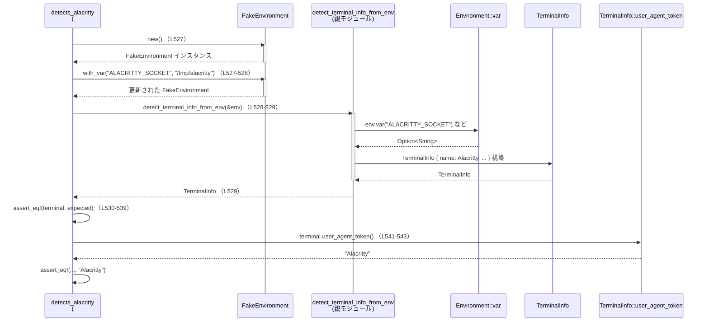

terminal-detection/src/terminal_tests.rs

---

## 0. ざっくり一言

- 端末検出関数 `detect_terminal_info_from_env` と `TerminalInfo` の挙動を、さまざまな環境変数の組み合わせで検証するテストモジュールです。  
- テスト用に、`Environment` トレイトを実装した `FakeEnvironment` と、`TerminalInfo` を簡単に生成するヘルパー関数 `terminal_info` を定義しています。

---

## 1. このモジュールの役割

### 1.1 概要

このモジュールは、端末情報検出ロジックが次の点を満たすことを確認するためのテスト群を提供します。

- 環境変数 (`TERM_PROGRAM`, `WEZTERM_VERSION`, `TMUX`, など) に基づいて `TerminalInfo` が期待どおり構築されること  
- `TerminalInfo::user_agent_token()` が適切なユーザーエージェント文字列を返すこと  
- 多重化ツール（tmux, zellij など）や各種ターミナル（WezTerm, kitty, Alacritty 等）が正しく識別されること  

また、テストのために簡易な環境実装 `FakeEnvironment` を用意し、`Environment` トレイト経由で環境変数と tmux クライアント情報を注入しています（`terminal_tests.rs:L5-40`）。

### 1.2 アーキテクチャ内での位置づけ

- 本モジュールは `super::*` をインポートしており、親モジュールに定義された以下のコンポーネントを利用します（`terminal_tests.rs:L1`）:
  - `Environment` トレイト
  - `TmuxClientInfo`
  - `TerminalInfo`
  - `TerminalName`
  - `Multiplexer`
  - `detect_terminal_info_from_env` 関数

依存関係の概要を Mermaids 図で示します。



### 1.3 設計上のポイント

コードから読み取れる特徴は次の通りです。

- **テストのための抽象化**  
  - `Environment` トレイトを `FakeEnvironment` が実装し、`detect_terminal_info_from_env` にはトレイト経由で環境情報を渡します（`terminal_tests.rs:L32-39`）。  
  - これにより、実際の OS 環境に依存せず、テストごとに必要な環境変数だけを指定できます。

- **テスト・データ構築の簡略化**  
  - `FakeEnvironment` はビルダーパターン（`with_var`, `with_tmux_client_info`）で環境を構築します（`terminal_tests.rs:L10-29`）。  
  - `terminal_info` ヘルパー関数が `TerminalInfo` を簡潔に構築します（`terminal_tests.rs:L42-56`）。

- **振る舞い仕様をテストで明示**  
  - 端末ごとに専用のテスト関数（`detects_wezterm`, `detects_kitty` など）を用意し、「どの環境変数が設定されているときに、どの `TerminalInfo` が得られるべきか」をテストケースとして明示しています。

- **エラー・安全性・並行性**  
  - `detect_terminal_info_from_env` は常に `TerminalInfo` を返すことが前提であり、`Result` などのエラー型は登場しません（すべてのテストで直接 `TerminalInfo` を受け取っています、例: `terminal_tests.rs:L64-65`）。  
  - panic を誘発するような操作（`unwrap` など）はこのファイル内には存在しません。  
  - `async` やスレッド関連 API は一切使われておらず、すべて同期・単一スレッドのテストです。

---

## 2. コンポーネント一覧（インベントリ）

### 2.1 型コンポーネント

| 名前 | 種別 | 役割 / 用途 | 定義の有無 | 根拠 |
|------|------|-------------|------------|------|
| `FakeEnvironment` | 構造体 | テスト用の環境実装。環境変数と tmux クライアント情報を保持し、`Environment` トレイトを実装する。 | このファイル内に定義 | `terminal_tests.rs:L5-8` |
| `TmuxClientInfo` | 構造体 | tmux クライアントの `termtype` / `termname` を保持する型。`FakeEnvironment` が保持する。 | このチャンクには定義なし | `terminal_tests.rs:L7, L24-27` |
| `Environment` | トレイト | `var` と `tmux_client_info` を通じて環境情報を提供するインターフェース。`FakeEnvironment` が実装。 | このチャンクには定義なし | `terminal_tests.rs:L32-39` |
| `TerminalInfo` | 構造体 | 検出された端末情報（端末名、バージョン、TERM 値、多重化ツールなど）を表現。テストの期待値として多用。 | このチャンクには定義なし | `terminal_tests.rs:L48-55, L310-316` |
| `TerminalName` | 列挙体 | iTerm2, WezTerm, Kitty など、論理的な端末名を表現。 | このチャンクには定義なし | 例: `terminal_tests.rs:L68-69, L175, L532-533` |
| `Multiplexer` | 列挙体 | `Tmux { version: Option<String> }`, `Zellij {}` など、端末多重化ツールの種類を表す。 | このチャンクには定義なし | 例: `terminal_tests.rs:L132, L141-142, L293-294` |

### 2.2 関数・メソッドコンポーネント

**ヘルパー / トレイト実装**

| 名前 | 種別 | 役割 / 用途 | 根拠 |
|------|------|-------------|------|
| `FakeEnvironment::new()` | メソッド | 空の環境変数マップとデフォルトの `TmuxClientInfo` を持つ `FakeEnvironment` を生成する。 | `terminal_tests.rs:L10-16` |
| `FakeEnvironment::with_var(&mut self, key, value)` | メソッド（ビルダー） | 環境変数を 1 つ追加し、自分自身を返してメソッドチェーンを可能にする。 | `terminal_tests.rs:L18-21` |
| `FakeEnvironment::with_tmux_client_info(&mut self, termtype, termname)` | メソッド（ビルダー） | `TmuxClientInfo` の `termtype` / `termname` を設定し、自分自身を返す。 | `terminal_tests.rs:L23-29` |
| `Environment for FakeEnvironment::var(&self, name)` | トレイトメソッド実装 | 指定された環境変数の値を `Option<String>` として返す。 | `terminal_tests.rs:L32-35` |
| `Environment for FakeEnvironment::tmux_client_info(&self)` | トレイトメソッド実装 | `TmuxClientInfo` をクローンして返す。 | `terminal_tests.rs:L37-39` |
| `terminal_info(...) -> TerminalInfo` | 関数（テスト用ヘルパー） | `TerminalInfo` を、`&str` を受け取って `String` に変換しつつ簡単に構築する。 | `terminal_tests.rs:L42-56` |

**外部 API（このモジュールから利用されているが定義は別モジュール）**

| 名前 | 種別 | 役割 / 用途 | 根拠 |
|------|------|-------------|------|
| `detect_terminal_info_from_env(env: &impl Environment) -> TerminalInfo`※ | 関数 | 与えられた `Environment` 実装から環境情報を取得し、`TerminalInfo` を構築する中核ロジック。 | 呼び出し例: `terminal_tests.rs:L64, L149, L171` など |
| `TerminalInfo::user_agent_token()` | メソッド | `TerminalInfo` の情報からユーザーエージェント風の文字列を生成する。 | 使用例: `terminal_tests.rs:L77-80, L162-165` |
| `TerminalInfo::is_zellij()` | メソッド | 多重化ツールが Zellij かどうかを判定する。 | 使用例: `terminal_tests.rs:L134-135, L142-143` |

※ `detect_terminal_info_from_env` の正確なシグネチャはこのチャンクには存在しませんが、`&FakeEnvironment` への参照を引数に取ることと、`TerminalInfo` を返すことはテストから明らかです。

**テスト関数（#[test]）**

以下は代表的なグループごとにまとめて記載します（すべて `fn ...()` で引数無しのテスト関数です）。

| 関数名 | テスト対象の挙動 | 根拠 |
|--------|------------------|------|
| `detects_term_program` | `TERM_PROGRAM` と `TERM_PROGRAM_VERSION` の扱い、および `WEZTERM_VERSION` との優先順位 | `terminal_tests.rs:L58-123` |
| `terminal_info_reports_is_zellij` | `TerminalInfo::is_zellij()` の真偽 | `terminal_tests.rs:L125-144` |
| `detects_iterm2` | iTerm2 の検出（`ITERM_SESSION_ID`） | `terminal_tests.rs:L146-166` |
| `detects_apple_terminal` | Apple Terminal の検出（`TERM_PROGRAM=Apple_Terminal` または `TERM_SESSION_ID`） | `terminal_tests.rs:L168-207` |
| `detects_ghostty` | Ghostty の検出（`TERM_PROGRAM=Ghostty`） | `terminal_tests.rs:L209-229` |
| `detects_vscode` | VS Code 内蔵ターミナルの検出 | `terminal_tests.rs:L231-253` |
| `detects_warp_terminal` | Warp ターミナルの検出 | `terminal_tests.rs:L255-277` |
| `detects_tmux_multiplexer` | tmux 多重化ツールとクライアント termtype/termname の扱い | `terminal_tests.rs:L279-302` |
| `detects_zellij_multiplexer` | Zellij 多重化ツールの検出（`ZELLIJ` 変数） | `terminal_tests.rs:L304-319` |
| `detects_tmux_client_termtype` | tmux クライアント termtype が WezTerm の場合の扱い | `terminal_tests.rs:L321-344` |
| `detects_tmux_client_termname` | tmux クライアント termname を `term` として採用する挙動 | `terminal_tests.rs:L346-368` |
| `detects_tmux_term_program_uses_client_termtype` | `TERM_PROGRAM=tmux` のとき、クライアント termtype を元に Ghostty を検出する挙動 | `terminal_tests.rs:L371-397` |
| `detects_wezterm` | WezTerm の検出（`WEZTERM_VERSION` または `TERM_PROGRAM=WezTerm`） | `terminal_tests.rs:L399-459` |
| `detects_kitty` | kitty の検出（`KITTY_WINDOW_ID`, `TERM_PROGRAM=kitty`, `TERM=xterm-kitty`） | `terminal_tests.rs:L461-523` |
| `detects_alacritty` | Alacritty の検出（`ALACRITTY_SOCKET`, `TERM_PROGRAM=Alacritty`, `TERM=alacritty`） | `terminal_tests.rs:L525-585` |
| `detects_konsole` | Konsole の検出（`KONSOLE_VERSION` や `TERM_PROGRAM=Konsole`） | `terminal_tests.rs:L587-647` |
| `detects_gnome_terminal` | GNOME Terminal の検出（`GNOME_TERMINAL_SCREEN`, `TERM_PROGRAM=gnome-terminal`） | `terminal_tests.rs:L649-689` |
| `detects_vte` | VTE ベース端末の検出（`VTE_VERSION`, `TERM_PROGRAM=VTE`） | `terminal_tests.rs:L692-748` |
| `detects_windows_terminal` | Windows Terminal の検出（`WT_SESSION`, `TERM_PROGRAM=WindowsTerminal`） | `terminal_tests.rs:L750-791` |
| `detects_term_fallbacks` | `TERM` のみがある場合のフォールバックおよび `dumb` / 完全未知の場合の扱い | `terminal_tests.rs:L793-843` |

---

## 3. 公開 API と詳細解説

このファイル自体には公開 API はありませんが、テスト対象となる外部 API と、テスト用ヘルパーを中心に解説します。

### 3.1 型一覧（構造体・列挙体など）

| 名前 | 種別 | 役割 / 用途 | フィールド概要 | 根拠 |
|------|------|-------------|----------------|------|
| `FakeEnvironment` | 構造体 | テスト用に環境変数と tmux 情報を注入するための簡易実装。 | `vars: HashMap<String, String>` と `tmux_client_info: TmuxClientInfo` を保持。 | `terminal_tests.rs:L5-8` |
| `TmuxClientInfo` | 構造体 | tmux クライアント側の端末情報を表す。（`termtype`, `termname`） | このチャンクでは `termtype`, `termname` フィールドを `String` に変換して設定している。 | `terminal_tests.rs:L24-27` |
| `TerminalInfo` | 構造体 | 検出された端末の論理名やバージョン、`TERM`、多重化ツール情報を保持する。 | `name`, `term_program`, `version`, `term`, `multiplexer` フィールドが存在することが `terminal_info` とテストからわかる。 | `terminal_tests.rs:L48-55, L310-316` |
| `TerminalName` | 列挙体 | 論理端末名。`Iterm2`, `WezTerm`, `Kitty`, `Dumb`, `Unknown` などのバリアントを持つ。 | テスト内で各バリアントが使用されている。 | 例: `terminal_tests.rs:L68, L175, L819-820` |
| `Multiplexer` | 列挙体 | 端末多重化ツール。`Tmux { version: Option<String> }`, `Zellij {}` など。 | テストで各バリアントが生成され、`TerminalInfo.multiplexer` にセットされている。 | 例: `terminal_tests.rs:L132, L141-142, L293-294` |

### 3.2 重要な関数 / メソッド詳細（最大 7 件）

#### 1. `detect_terminal_info_from_env(env: &impl Environment) -> TerminalInfo`（推定）

**概要**

- `Environment` トレイト実装から環境変数や tmux クライアント情報を取得し、端末情報 `TerminalInfo` を構築するコア関数です。  
- さまざまな端末・多重化ツールを環境変数から識別し、優先順位付きのロジックで `TerminalName` や `Multiplexer` を決定する挙動が、テストから読み取れます。

> ※ 正確なシグネチャはこのチャンクにはありません。引数が `&FakeEnvironment` で呼ばれ、戻り値が `TerminalInfo` であることのみが確実です（例: `terminal_tests.rs:L64-65`）。

**引数（テストから読み取れる範囲）**

| 引数名 | 型 | 説明 |
|--------|----|------|
| `env` | `&impl Environment` 相当 | `var(name)` と `tmux_client_info()` を通じて環境情報を取得できるオブジェクト。テストでは `&FakeEnvironment` が渡される。 |

**戻り値**

- `TerminalInfo`  
  - 検出された端末を表す情報オブジェクトです。  
  - テストから、常に何らかの `TerminalInfo` が返ることが前提になっています（`terminal_tests.rs:L829-842`）。

**内部処理の流れ（テストから読み取れる仕様）**

テストケースから少なくとも次のような挙動が読み取れます。

1. **`TERM_PROGRAM` の優先**  
   - `TERM_PROGRAM` が `"iTerm.app"` の場合、`TerminalName::Iterm2` として扱い、`TERM_PROGRAM_VERSION` が非空なら `version` にセット（`terminal_tests.rs:L60-75`）。  
   - このとき、`WEZTERM_VERSION` があっても無視されます（`terminal_tests.rs:L60-63` と期待値 `L67-73`）。

2. **バージョン文字列が空の場合の扱い**  
   - `TERM_PROGRAM_VERSION` や `WEZTERM_VERSION`, `KONSOLE_VERSION`, `VTE_VERSION` などが空文字列のとき、`version` は `None` 相当になります（例: `terminal_tests.rs:L82-95`, `L441-452`, `L629-640`, `L734-745`）。

3. **特定の環境変数による端末識別**  
   - WezTerm: `WEZTERM_VERSION` の有無で検出（`terminal_tests.rs:L401-412, L441-452`）。  
   - Kitty: `KITTY_WINDOW_ID` や `TERM=xterm-kitty` で検出（`terminal_tests.rs:L463-475, L503-516`）。  
   - Alacritty: `ALACRITTY_SOCKET` や `TERM=alacritty`（`terminal_tests.rs:L527-539, L567-578`）。  
   - Konsole: `KONSOLE_VERSION`（`terminal_tests.rs:L589-601`）。  
   - GNOME Terminal: `GNOME_TERMINAL_SCREEN`（`terminal_tests.rs:L651-663`）。  
   - VTE: `VTE_VERSION`（`terminal_tests.rs:L694-705`）。  
   - Windows Terminal: `WT_SESSION`（`terminal_tests.rs:L752-763`）。  
   - Apple Terminal: `TERM_PROGRAM=Apple_Terminal` または `TERM_SESSION_ID`（`terminal_tests.rs:L170-207`）。  
   - iTerm2: `ITERM_SESSION_ID` または `TERM_PROGRAM=iTerm.app`（`terminal_tests.rs:L147-165, L60-75`）。

4. **tmux / zellij の扱い**  
   - `TMUX` が存在し `TERM_PROGRAM=tmux` の場合、`multiplexer` は `Multiplexer::Tmux` になります（`terminal_tests.rs:L281-295`）。  
   - tmux クライアントの `termtype` / `termname` に応じて `TerminalInfo` の `name`, `term_program`, `term` が上書きされます（`terminal_tests.rs:L323-337, L348-361, L373-389`）。  
   - `ZELLIJ` が設定されているときは `Multiplexer::Zellij {}` がセットされます（`terminal_tests.rs:L305-317`）。

5. **フォールバックロジック**  
   - 上記のいずれにも当てはまらない場合、`TERM` が `"dumb"` であれば `TerminalName::Dumb`（`terminal_tests.rs:L814-827`）。  
   - `TERM` が他の値なら `TerminalName::Unknown` としつつ `term` フィールドに `TERM` を格納（`terminal_tests.rs:L795-807`）。  
   - `TERM` もない場合は完全な Unknown として扱われます（`terminal_tests.rs:L829-842`）。

**Examples（使用例：テストから）**

```rust
// iTerm2 を TERM_PROGRAM 経由で検出する例（terminal_tests.rs:L58-75）
let env = FakeEnvironment::new()
    .with_var("TERM_PROGRAM", "iTerm.app")
    .with_var("TERM_PROGRAM_VERSION", "3.5.0")
    .with_var("WEZTERM_VERSION", "2024.2"); // これは無視される

let terminal = detect_terminal_info_from_env(&env);

assert_eq!(
    terminal,
    terminal_info(
        TerminalName::Iterm2,
        Some("iTerm.app"),
        Some("3.5.0"),
        None,
        None
    )
);
assert_eq!(terminal.user_agent_token(), "iTerm.app/3.5.0");
```

```rust
// tmux + Ghostty クライアントを検出する例（terminal_tests.rs:L371-397）
let env = FakeEnvironment::new()
    .with_var("TMUX", "/tmp/tmux-1000/default,123,0")
    .with_var("TERM_PROGRAM", "tmux")
    .with_var("TERM_PROGRAM_VERSION", "3.6a")
    .with_tmux_client_info(Some("ghostty 1.2.3"), Some("xterm-ghostty"));

let terminal = detect_terminal_info_from_env(&env);

assert_eq!(
    terminal,
    terminal_info(
        TerminalName::Ghostty,
        Some("ghostty"),
        Some("1.2.3"),
        Some("xterm-ghostty"),
        Some(Multiplexer::Tmux {
            version: Some("3.6a".to_string()),
        }),
    )
);
assert_eq!(terminal.user_agent_token(), "ghostty/1.2.3");
```

**Errors / Panics**

- テストでは `Result` を返すことなく直接 `TerminalInfo` を受け取っており、エラー分岐はありません。  
- さまざまな組み合わせ（環境変数無しを含む）で呼び出されていますが、panic を期待するテストはなく、すべて正常に `TerminalInfo` を返す前提です（`terminal_tests.rs:L829-842`）。

**Edge cases（エッジケース）**

- 環境変数が存在するが **値が空文字列**（`""`）のケース：  
  - `TERM_PROGRAM_VERSION`, `WEZTERM_VERSION`, `KONSOLE_VERSION`, `VTE_VERSION` が空の場合は「バージョンなし」として扱われます（例: `terminal_tests.rs:L82-95, L441-452, L629-640, L734-745`）。
- `TERM="dumb"` の特別扱い：  
  - 明示的に `TerminalName::Dumb` になるテストがあります（`terminal_tests.rs:L814-827`）。
- **環境変数がまったく無い**ケース：  
  - `FakeEnvironment::new()` のみで `detect_terminal_info_from_env` を呼び、`TerminalName::Unknown` / `user_agent_token()=="unknown"` であることを確認しています（`terminal_tests.rs:L829-842`）。

**使用上の注意点（テストから分かる範囲）**

- この関数は OS のグローバル環境ではなく `Environment` トレイト経由で情報を取得するため、実際の利用コードでも同様の抽象化が前提になります。  
- 値が空の環境変数は「存在しない」と同等に扱われることがあり、`version` フィールドが `None` となります（上記エッジケース参照）。  
- 並行性に関する制約はこのファイルからは読み取れません（`Environment` 実装に依存）。

---

#### 2. `TerminalInfo::user_agent_token()`（推定）

**概要**

- `TerminalInfo` の内容から、HTTP の User-Agent 風の短い識別子文字列を生成するメソッドです。
- テストから、端末名やバージョン、`term` の値を使って組み立てていることが分かります。

**引数**

- レシーバ `&self` のみ（テストに `terminal.user_agent_token()` として出現、`terminal_tests.rs:L77` など）。

**戻り値**

- 文字列型（`&str` リテラルとの比較が可能）。  
  - 例: `"iTerm.app/3.5.0"`, `"WezTerm/2024.2"`, `"kitty"`, `"unknown"` など（`terminal_tests.rs:L77-80, L415-417, L809-811, L842-843`）。

**挙動（テストから読み取れる仕様）**

以下はテストから観察されるルールです。

1. **`term_program` と `version` がある場合**  
   - `"term_program/version"` 形式の文字列になります。  
   - 例: `"iTerm.app/3.5.0"`（`terminal_tests.rs:L77-80`）、`"vscode/1.86.0"`（`L249-251`）、`"WarpTerminal/v0.2025.12.10.08.12.stable_03"`（`L273-275`）。

2. **`term_program` のみで `version` がない場合**  
   - 単に `"term_program"` だけになります。  
   - 例: `TERM_PROGRAM_VERSION` が空の iTerm2 のケースで `"iTerm.app"`（`terminal_tests.rs:L97-101`）。

3. **`term_program` が `None` で `TerminalName` が既知の場合**  
   - WezTerm: `version` があれば `"WezTerm/version"`、なければ `"WezTerm"`（`terminal_tests.rs:L415-417, L455-457`）。  
   - Kitty: `"kitty"`（`terminal_tests.rs:L477-479, L519-521`）。  
   - Alacritty: `"Alacritty"` または `"Alacritty/version"`（`terminal_tests.rs:L541-543, L562-564, L581-583`）。  
   - Konsole: `"Konsole"` または `"Konsole/version"`（`terminal_tests.rs:L603-605, L624-626, L642-645`）。  
   - GNOME Terminal: `"gnome-terminal"` または `"gnome-terminal/version"`（`terminal_tests.rs:L665-667, L685-688`）。  
   - VTE: `"VTE"` または `"VTE/version"`（`terminal_tests.rs:L707-711, L729-731, L747`）。  
   - Windows Terminal: `"WindowsTerminal"` または `"WindowsTerminal/version"`（`terminal_tests.rs:L766-768, L787-789`）。  
   - Apple Terminal: `"Apple_Terminal"`（`terminal_tests.rs:L184-187, L203-205`）。  
   - iTerm2 (TERM_PROGRAMなし・ITERM_SESSION_IDのみ): `"iTerm.app"`（`terminal_tests.rs:L161-165`）。

4. **`TerminalName` が `Unknown` で `term` がある場合**  
   - `"term"` の値がそのまま返されます（`terminal_tests.rs:L809-811`）。

5. **完全 Unknown の場合**  
   - `term_program`, `version`, `term`, `TerminalName` いずれも情報がないケースで `"unknown"` を返します（`terminal_tests.rs:L829-843`）。

**Examples（テストから）**

```rust
// WezTerm のバージョンあり・なし（terminal_tests.rs:L399-458）
let env = FakeEnvironment::new().with_var("WEZTERM_VERSION", "2024.2");
let terminfo = detect_terminal_info_from_env(&env);
assert_eq!(terminfo.user_agent_token(), "WezTerm/2024.2");

let env = FakeEnvironment::new().with_var("WEZTERM_VERSION", "");
let terminfo = detect_terminal_info_from_env(&env);
assert_eq!(terminfo.user_agent_token(), "WezTerm");
```

```rust
// TERM だけが設定されているケース（terminal_tests.rs:L793-812）
let env = FakeEnvironment::new().with_var("TERM", "xterm-256color");
let terminfo = detect_terminal_info_from_env(&env);
assert_eq!(terminfo.user_agent_token(), "xterm-256color");
```

**Errors / Panics**

- すべてのテストで `user_agent_token()` は panic 無しに呼ばれており、どのような `TerminalInfo` でも有効な文字列を返す前提です。

**Edge cases**

- `version` が空文字列扱いで `None` 相当になっても、ユーザーエージェントは `"Program"` の形式で返ります（例: WezTerm, Konsole, VTE の `*_empty_info` テスト）。  
- `TerminalName::Dumb` の場合 `"dumb"` が返る（`terminal_tests.rs:L817-827`）。  
- 完全 Unknown では `"unknown"`（`terminal_tests.rs:L829-843`）。

---

#### 3. `TerminalInfo::is_zellij()`（推定）

**概要**

- この `TerminalInfo` が Zellij 上で動作しているかどうかを判定します。

**挙動（テストから）**

- `multiplexer` が `Some(Multiplexer::Zellij {})` の場合に `true` を返し、それ以外（例: `Multiplexer::Tmux`）では `false` を返します（`terminal_tests.rs:L125-144`）。

**Examples**

```rust
// zellij 上かどうかの判定（terminal_tests.rs:L125-144）
let zellij = terminal_info(
    TerminalName::Unknown,
    None,
    None,
    None,
    Some(Multiplexer::Zellij {}),
);
assert!(zellij.is_zellij());

let non_zellij = terminal_info(
    TerminalName::Unknown,
    None,
    None,
    None,
    Some(Multiplexer::Tmux { version: None }),
);
assert!(!non_zellij.is_zellij());
```

**使用上の注意点**

- `is_zellij()` の判定は `multiplexer` フィールドに依存するため、`detect_terminal_info_from_env` が適切に Zellij を検出していることが前提となります（`terminal_tests.rs:L305-317`）。

---

#### 4. `FakeEnvironment::new() -> FakeEnvironment`

**概要**

- テスト用の空の環境を初期化します。環境変数マップは空、`tmux_client_info` は `TmuxClientInfo::default()` です（`terminal_tests.rs:L10-16`）。

**戻り値**

- `FakeEnvironment` インスタンス。

**内部処理**

1. `HashMap::new()` で空の `vars` マップを作成（`terminal_tests.rs:L13`）。  
2. `TmuxClientInfo::default()` で tmux クライアント情報をデフォルト値で初期化（`terminal_tests.rs:L14`）。  

**Examples**

```rust
// 空の環境から始める（terminal_tests.rs 全般で使用）
let env = FakeEnvironment::new();
// 必要な環境変数をチェーンで追加
let env = env.with_var("TERM", "xterm-256color");
```

**Errors / Panics / 並行性**

- コンストラクタでエラーや panic を起こすような処理はありません。  
- 単なるデータ構築であり、スレッドに関する要素もありません。

---

#### 5. `FakeEnvironment::with_var(self, key: &str, value: &str) -> Self`

**概要**

- 環境変数 `key=value` を追加し、自身を返すビルダーメソッドです（`terminal_tests.rs:L18-21`）。

**引数**

| 引数名 | 型 | 説明 |
|--------|----|------|
| `key` | `&str` | 環境変数名 |
| `value` | `&str` | 環境変数の値 |

**戻り値**

- 自身（`Self`）。メソッドチェーンを行う前提で消費（move）しています。

**内部処理**

1. `key.to_string()` と `value.to_string()` で `String` に変換。  
2. `self.vars.insert(...)` で `HashMap` にセット（`terminal_tests.rs:L19`）。  
3. `self` を返す（`terminal_tests.rs:L20`）。

**Examples**

```rust
let env = FakeEnvironment::new()
    .with_var("TERM_PROGRAM", "WezTerm")
    .with_var("TERM_PROGRAM_VERSION", "2024.2");
```

**注意点**

- `self` を消費するメソッド（所有権ムーブ）なので、呼び出し側はチェーンで使う前提です（`let env = FakeEnvironment::new().with_var(...);` のような記法）。

---

#### 6. `FakeEnvironment::with_tmux_client_info(self, termtype: Option<&str>, termname: Option<&str>) -> Self`

**概要**

- tmux クライアント情報である `TmuxClientInfo` を設定するビルダーメソッドです（`terminal_tests.rs:L23-29`）。

**引数**

| 引数名 | 型 | 説明 |
|--------|----|------|
| `termtype` | `Option<&str>` | tmux クライアントの `termtype`。`None` の場合は設定しない。 |
| `termname` | `Option<&str>` | tmux クライアントの `termname`。`None` の場合は設定しない。 |

**戻り値**

- 自身（`Self`）。

**内部処理**

1. `TmuxClientInfo { termtype: termtype.map(ToString::to_string), termname: termname.map(ToString::to_string) }` で新しい `TmuxClientInfo` を構築（`terminal_tests.rs:L24-27`）。  
2. それを `self.tmux_client_info` に代入し（`terminal_tests.rs:L24`）、`self` を返す（`terminal_tests.rs:L28`）。

**Examples**

```rust
// tmux クライアントが WezTerm の場合（terminal_tests.rs:L321-327）
let env = FakeEnvironment::new()
    .with_var("TMUX", "/tmp/tmux-1000/default,123,0")
    .with_var("TERM_PROGRAM", "tmux")
    .with_tmux_client_info(Some("WezTerm"), None);
```

---

#### 7. `terminal_info(name, term_program, version, term, multiplexer) -> TerminalInfo`

**概要**

- テスト内でのみ使用されるヘルパー関数で、`TerminalInfo` の期待値を簡潔に構築するために使われます（`terminal_tests.rs:L42-56`）。

**引数**

| 引数名 | 型 | 説明 |
|--------|----|------|
| `name` | `TerminalName` | 論理端末名 |
| `term_program` | `Option<&str>` | `TERM_PROGRAM` に相当するプログラム名 |
| `version` | `Option<&str>` | バージョン文字列 |
| `term` | `Option<&str>` | `TERM` 環境変数に相当 |
| `multiplexer` | `Option<Multiplexer>` | 多重化ツール情報 |

**戻り値**

- `TerminalInfo` インスタンス。`&str` 引数は `String` に変換されて格納されます（`terminal_tests.rs:L51-53`）。

**内部処理**

1. `term_program.map(ToString::to_string)` で `Option<String>` に変換（`terminal_tests.rs:L51`）。  
2. `version`, `term` も同様にマッピング（`terminal_tests.rs:L52-53`）。  
3. それらをフィールドにセットして `TerminalInfo` を返します（`terminal_tests.rs:L48-55`）。

**Examples**

テストの期待値はほぼすべてこの関数で構築されています。

```rust
let expected = terminal_info(
    TerminalName::Kitty,
    Some("kitty"),
    Some("0.30.1"),
    None,
    None,
);
assert_eq!(terminal, expected);
```

---

### 3.3 その他の関数

- 上記以外の関数はすべて `#[test] fn detects_...()` 形式のユニットテストであり、それぞれ特定の端末や条件の検出を検証する役割を持ちます（一覧は §2.2 参照）。

---

## 4. データフロー

ここでは、代表的なシナリオとして **Alacritty の検出** テスト（`detects_alacritty (terminal_tests.rs:L525-585)`）におけるデータフローを例示します。

### 4.1 処理の要点（Alacritty の例）

1. テスト関数 `detects_alacritty` が `FakeEnvironment::new()` を呼び出し、`.with_var("ALACRITTY_SOCKET", "/tmp/alacritty")` で環境変数をセット（`terminal_tests.rs:L527-528`）。
2. `detect_terminal_info_from_env(&env)` が呼び出され、`env.var("ALACRITTY_SOCKET")` などを通じて環境変数を取得（`terminal_tests.rs:L528-529`）。
3. 検出ロジックが `TerminalName::Alacritty` を選択し、`TerminalInfo` を構築（`terminal_tests.rs:L530-537`）。
4. テストは `TerminalInfo` と期待値を `assert_eq!` で比較し、さらに `user_agent_token()` を検証します（`terminal_tests.rs:L538-544`）。

### 4.2 シーケンス図



このパターンは他のテストでも基本的に同じで、`FakeEnvironment` が提供する環境変数キーと値だけが変化します。

---

## 5. 使い方（How to Use）

対象がテストモジュールであるため、「使い方」は主に **新しいテストケースの追加** や **`FakeEnvironment` の利用方法**になります。

### 5.1 基本的な使用方法（新しいテストケース）

```rust
// terminal_tests.rs 内に新しいテストを追加する例
#[test]
fn detects_example_terminal() {
    // 1. テスト用環境を用意
    let env = FakeEnvironment::new()
        .with_var("EXAMPLE_TERM_FLAG", "1");

    // 2. 検出関数を呼び出す
    let terminal = detect_terminal_info_from_env(&env);

    // 3. 期待される TerminalInfo を構築
    let expected = terminal_info(
        TerminalName::Unknown, // または新しい TerminalName バリアント
        None,                  // term_program
        None,                  // version
        None,                  // term
        None,                  // multiplexer
    );

    // 4. 構造体と user_agent_token の両方を検証
    assert_eq!(terminal, expected);
    assert_eq!(terminal.user_agent_token(), "unknown");
}
```

### 5.2 よくある使用パターン

- **環境変数の組み合わせで挙動を確認する**  
  - 例: `detects_term_program` では、同じ `TERM_PROGRAM` に対して `TERM_PROGRAM_VERSION` の有無や、他の変数（`WEZTERM_VERSION`）との優先順位を 1 つのテスト関数内で切り替えています（`terminal_tests.rs:L58-123`）。

- **tmux クライアント情報を使った判定**  
  - `with_tmux_client_info` を利用し、`TERM_PROGRAM=tmux` 時にクライアントの `termtype` の内容で最終的な `TerminalName` を決定するパターン（`terminal_tests.rs:L371-389`）。

### 5.3 よくある間違い（推測される注意点）

コードから実際に見える誤用例はありませんが、構造から起こり得る誤りを挙げます。

```rust
// （誤りになり得る）FakeEnvironment を再利用しながら上書き忘れ
let mut env = FakeEnvironment::new()
    .with_var("TERM_PROGRAM", "WezTerm");

// 後続のテストで TERM_PROGRAM を書き換えないまま再利用してしまう
let terminal = detect_terminal_info_from_env(&env); // 意図しない WezTerm として検出される可能性
```

正しくは、テストごとに `FakeEnvironment::new()` から作り直す形が、このファイルのパターンになっています（どのテストも毎回 `FakeEnvironment::new()` から開始しています）。

### 5.4 使用上の注意点（まとめ）

- 各テストでは **新しい `FakeEnvironment` を生成してから** 必要な環境変数を設定する構造になっており、状態を跨いだ再利用はしていません。  
- バージョン情報のテストでは、空文字列と `None` の扱いを区別して検証しているため、新しいロジックを追加する場合もこの仕様に合わせる必要があります。  
- 並行テストやマルチスレッドは使っていないため、`Environment` 実装がスレッド安全かどうかはこのモジュールからは判断できません。

---

## 6. 変更の仕方（How to Modify）

### 6.1 新しい端末や条件に対する検出ロジックを追加する場合

1. **親モジュール側の変更**（このチャンクには含まれない）  
   - `TerminalName` に新しいバリアントを追加し、`detect_terminal_info_from_env` に対応する分岐を追加する必要があります（定義は別ファイル）。

2. **本テストモジュールに追加すべき内容**  
   - 既存のパターンに倣って `#[test] fn detects_new_terminal()` のようなテスト関数を追加します。  
   - `FakeEnvironment::new()` から始め、想定する環境変数を `with_var` などで設定します。  
   - `terminal_info` を用いて期待される `TerminalInfo` を構築し、`assert_eq!` で比較します。  
   - `user_agent_token()` の期待値も同じテスト内で検証します（多くの既存テストがそうしています）。

### 6.2 既存の仕様を変更する場合の注意点

- **優先順位の変更**（例: `WEZTERM_VERSION` と `TERM_PROGRAM` の優先）。  
  - `detects_term_program` や `detects_wezterm` など、複数のテストに影響します（`terminal_tests.rs:L58-123, L399-459`）。  
  - 変更前に、どのテストがその優先順位を前提にしているかを確認する必要があります。

- **version の空文字列の扱い**  
  - `*_empty_info` 系テスト（WezTerm, Konsole, VTE）で空文字列を `version=None` とみなす挙動が固定されています（`terminal_tests.rs:L441-452, L629-640, L734-745`）。  
  - ここを変えると、ユーザーエージェント文字列などにも影響します。

- **フォールバックの挙動**  
  - `detects_term_fallbacks` は最終的な Unknown / dumb の扱いをテストしているため、この仕様を変更すると CLI やログ出力に影響する可能性があります（`terminal_tests.rs:L793-843`）。

---

## 7. 関連ファイル

このチャンクから参照されているが定義が含まれていないコンポーネントを提供するファイルは、リポジトリ構成に依存するため正確なパスは不明です。ただし、論理的な関係は次の通りです。

| パス（推定/論理名） | 役割 / 関係 |
|---------------------|------------|
| 親モジュール（`super`） | `Environment` トレイト, `TerminalInfo`, `TerminalName`, `Multiplexer`, `TmuxClientInfo`, `detect_terminal_info_from_env` など、本テストが対象とするコアロジックを定義しているモジュール。 |
| `terminal-detection/src/terminal_tests.rs`（本ファイル） | 端末検出ロジックの挙動を網羅的に検証するテストコードと、テスト専用の `FakeEnvironment` / `terminal_info` ヘルパーを提供する。 |

> 実際のファイルパスやモジュール階層はこのチャンクには現れないため、ここでは「親モジュール」にとどめています。

---

## Bugs / Security / Contracts / Edge Cases（まとめ）

- **Bugs の可能性**  
  - このファイル自体はテストコードであり、明らかなバグ（例: 間違った期待値や未使用変数）は見当たりません。  
  - 実装側のバグ有無については、テストから仕様の一部は読み取れますが、すべてを網羅しているかどうかはこのチャンクだけでは判断できません。

- **Security**  
  - テストでは外部入力やファイル I/O、ネットワーク I/O を扱っておらず、安全性に関わる要素はほぼありません。  
  - 実際の `detect_terminal_info_from_env` が環境変数をどのように扱うか（長大文字列の扱い等）はこのチャンクでは不明です。

- **Contracts / Edge Cases**  
  - 契約仕様として重要なのは「空文字列のバージョンは `None` 扱い」「`TERM="dumb"` の特別扱い」「何も設定されていなければ Unknown/`user_agent_token()=="unknown"`」であることです（該当テストは前述）。  
  - tmux まわりでは、`TERM_PROGRAM=tmux` 時に `tmux_client_info` が優先されるという契約がテストにより固定化されています。

- **Performance / Scalability**  
  - テスト内では少数の HashMap 操作と文字列生成のみで、大きな負荷を想定していません。パフォーマンス上の懸念はこのファイルからは読み取れません。

- **Observability（ログなど）**  
  - このファイルではログ出力やメトリクスは一切扱っておらず、観測性に関する仕様は不明です。
