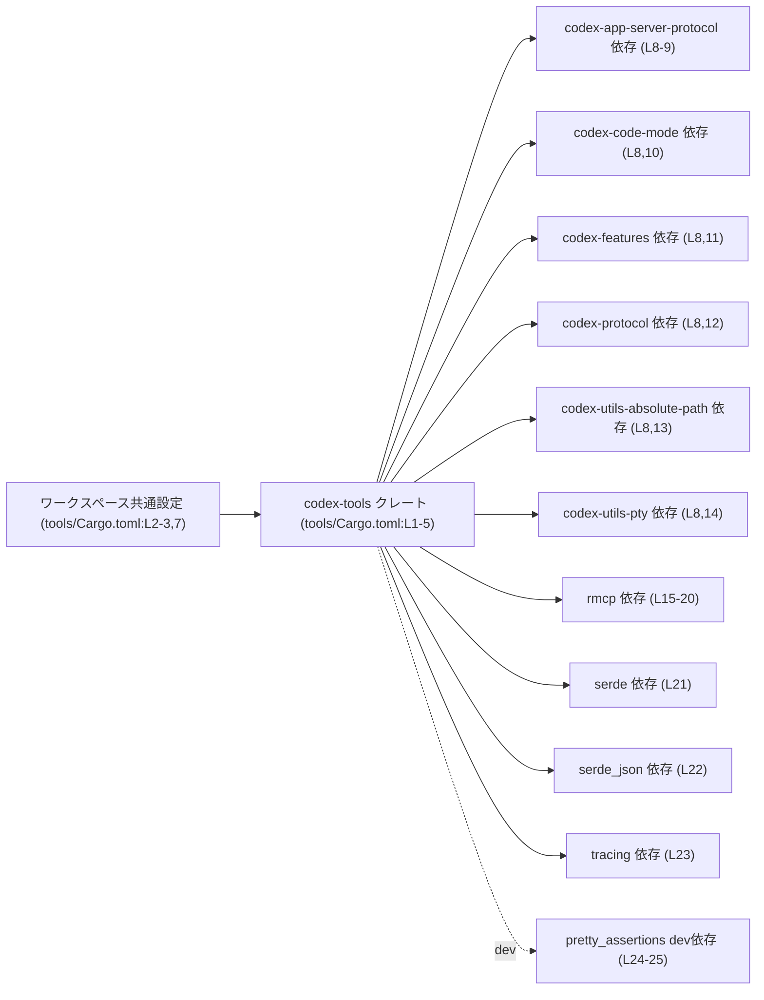
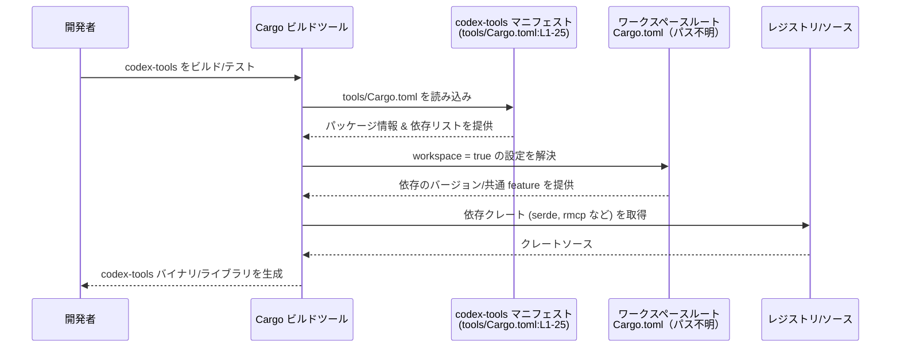

# tools/Cargo.toml コード解説

## 0. ざっくり一言

`tools/Cargo.toml` は、Rust クレート `codex-tools` の Cargo マニフェストファイルであり、クレート名やバージョンなどのメタデータと、依存クレート・開発用依存クレートを定義しています（`tools/Cargo.toml:L1-5,8-25`）。

---

## 1. このモジュールの役割

### 1.1 概要

- このファイルは、Rust ワークスペース内のクレート `codex-tools` の設定を行う Cargo マニフェストです（`name = "codex-tools"`、`tools/Cargo.toml:L4`）。
- edition・license・version・lints などの共通設定はワークスペースから継承する構成になっています（`edition.workspace = true` など、`tools/Cargo.toml:L2-3,7`）。
- 実行時依存（`[dependencies]`）とテスト・開発時の依存（`[dev-dependencies]`）を宣言します（`tools/Cargo.toml:L8-25`）。

このファイル自体には Rust の関数や構造体定義は含まれていません。

### 1.2 アーキテクチャ内での位置づけ

このファイルから読み取れる範囲では、「ワークスペース内の一つのクレート `codex-tools` が、複数の依存クレートを利用する」という構図になっています。



※ ワークスペースルートの `Cargo.toml` や各依存クレートの中身は、このチャンクには現れないため不明です。

### 1.3 設計上のポイント

コードではなく設定ファイルですが、次のような方針が読み取れます。

- **ワークスペースによる一元管理**  
  - edition・license・version はすべて `workspace = true` で共有設定を利用しています（`tools/Cargo.toml:L2-3,5`）。
  - lints も `[lints]` セクションでワークスペース設定に委譲しています（`tools/Cargo.toml:L6-7`）。

- **依存バージョンと機能のワークスペース側管理**  
  - すべての通常依存・開発依存に `workspace = true` が指定されており、バージョンや基本的な feature 構成はワークスペースで定義されていると解釈できます（`tools/Cargo.toml:L8-9,21-25`）。

- **一部依存に対するローカルな feature 指定**  
  - `rmcp` では `default-features = false` にしつつ、`base64`, `macros`, `schemars`, `server` といった features をローカルで選択しています（`tools/Cargo.toml:L15-20`）。
  - `serde` では `features = ["derive"]` を明示しており、派生マクロを利用する前提であることがわかります（`tools/Cargo.toml:L21`）。

- **このファイルからは安全性・エラーハンドリング・並行性の詳細は不明**  
  - 実際の API 実装やロジックが含まれていないため、Rust における所有権・スレッド安全性・エラーハンドリングの方針については、このチャンクからは読み取れません。

---

## 2. 主要な機能一覧

このファイルが担う「機能」は設定・宣言レベルに限られます。

- クレートメタデータの定義: `name`, `edition`, `license`, `version` をワークスペース経由で設定（`tools/Cargo.toml:L1-5`）
- Lint 設定の共有: `[lints]` セクションでワークスペース共通の lint 方針を利用（`tools/Cargo.toml:L6-7`）
- 実行時依存の宣言: `codex-*` 系クレートや `rmcp`, `serde`, `serde_json`, `tracing` などへの依存を宣言（`tools/Cargo.toml:L8-23`）
- 開発時依存の宣言: テスト時などに利用可能な `pretty_assertions` を dev-dependency として宣言（`tools/Cargo.toml:L24-25`）

---

## 3. 公開 API と詳細解説

このファイルには Rust の型定義や関数定義は含まれていないため、「型一覧」「関数詳細」は基本的に該当しません。そのうえで、コンポーネント（クレート）単位のインベントリーを示します。

### 3.1 型一覧（構造体・列挙体など）

このファイルには Rust の構造体や列挙体の定義は存在しません（すべて TOML の設定記述です）。

#### コンポーネント（クレート）インベントリー

| 名前                         | 種別           | 役割 / 用途（このチャンクから読める範囲）                                  | 定義箇所（根拠）                  |
|------------------------------|----------------|---------------------------------------------------------------------------|-----------------------------------|
| `codex-tools`               | クレート       | 本ファイルで設定される対象クレート。ワークスペース内の 1 メンバー。        | `name = "codex-tools"`（L4）      |
| `codex-app-server-protocol` | 依存クレート   | アプリサーバーとのプロトコル関連機能を提供すると推測される名称だが、実装はこのチャンクには現れない。 | 依存宣言（L8-9）                  |
| `codex-code-mode`           | 依存クレート   | 「コードモード」に関連する機能を提供する依存と推測されるが、詳細不明。     | 依存宣言（L8,10）                 |
| `codex-features`            | 依存クレート   | 機能フラグ管理などに関連すると推測されるが、詳細不明。                     | 依存宣言（L8,11）                 |
| `codex-protocol`            | 依存クレート   | プロトコル一般の定義を含むと推測されるが、詳細不明。                       | 依存宣言（L8,12）                 |
| `codex-utils-absolute-path` | 依存クレート   | 絶対パスのユーティリティ機能を提供すると推測されるが、詳細不明。           | 依存宣言（L8,13）                 |
| `codex-utils-pty`           | 依存クレート   | 擬似端末 (PTY) 関連ユーティリティと推測されるが、詳細不明。               | 依存宣言（L8,14）                 |
| `rmcp`                      | 依存クレート   | `base64`, `macros`, `schemars`, `server` といった機能を含むライブラリ。具体的用途はこのチャンクからは不明。 | `rmcp = { ... }`（L15-20）        |
| `serde`                     | 依存クレート   | シリアライズ/デシリアライズ用ライブラリ。`derive` 機能を利用する前提。    | `serde = { ... }`（L21）          |
| `serde_json`                | 依存クレート   | JSON 形式との変換機能を提供。用途の詳細はこのチャンクからは不明。          | `serde_json = { ... }`（L22）     |
| `tracing`                   | 依存クレート   | 構造化ログ・トレース出力用ライブラリ。どのように使うかはコード側で決まる。 | `tracing = { ... }`（L23）        |
| `pretty_assertions`         | dev 依存クレート | テストで見やすい差分付き assert を行うために利用されるライブラリ。        | `[dev-dependencies]`（L24-25）    |

> 補足: 各 `codex-*` クレートや `rmcp` の実際の型・関数は、このチャンクには現れないため不明です。

### 3.2 関数詳細（最大 7 件）

このファイルには Rust の関数・メソッド定義が存在しないため、本セクションは該当しません。

- Cargo.toml はコンパイル・ビルド時に Cargo によって読み取られる設定ファイルであり、実行時 API を提供するコードは含みません。

### 3.3 その他の関数

同様に、このファイルには関数が存在しません。

---

## 4. データフロー

Rust コードの具体的なデータフローはこのファイルからは分かりませんが、「ビルド時の依存解決フロー」という観点で、このファイルがどのように利用されるかを簡単に示します。

### 4.1 ビルド時の依存解決フロー（概念図）



- `workspace = true` によって、このファイル単体ではなく、ワークスペースルートの設定も併せて解決される点が特徴です（`tools/Cargo.toml:L2-3,5,8-9,21-25`）。
- `rmcp` や `serde` などの依存が実際にどのようなデータを扱うかは、`codex-tools` のソースコード側に依存し、このチャンクからは分かりません。

---

## 5. 使い方（How to Use）

### 5.1 基本的な使用方法

このファイルは手動で編集することで、`codex-tools` クレートのメタデータや依存関係を変更できます。

代表的な構成要素は以下です。

```toml
[package]                               # パッケージメタデータセクション（L1）
edition.workspace = true                # edition はワークスペースで共通管理（L2）
license.workspace = true                # ライセンスもワークスペースで共通管理（L3）
name = "codex-tools"                    # クレート名（L4）
version.workspace = true                # バージョンもワークスペースで共通管理（L5）

[lints]                                 # lint 設定（L6）
workspace = true                        # lint もワークスペース設定を利用（L7）

[dependencies]                          # 通常依存（L8）
serde = { workspace = true, features = ["derive"] }  # 例: serde + derive（L21）
```

このように、`workspace = true` を多用することで、バージョンや基本機能の指定をワークスペースのルート `Cargo.toml` 側に集約していることが分かります。

### 5.2 よくある使用パターン

1. **新しい依存を追加する**

   ワークスペースで依存を共有したい場合:

   ```toml
   [dependencies]
   new-crate = { workspace = true }  # ワークスペースルートで new-crate を定義しておく
   ```

   - このファイルのスタイルに合わせるなら、まずワークスペースルートで `new-crate` のバージョンなどを定義し、ここでは `workspace = true` だけを書く、という使い方になります（このチャンクにはルート定義は現れません）。

2. **特定の依存に対してローカルな feature を指定する**

   `rmcp` のように、default features を無効化しつつ、必要な feature を列挙するパターンです（`tools/Cargo.toml:L15-20`）。

   ```toml
   [dependencies]
   rmcp = { workspace = true, default-features = false, features = [
       "base64",
       "macros",
       "schemars",
       "server",
   ] }
   ```

   - default-features を無効化することで、不要な機能を避けつつ、必要なものだけを明示的に有効化できます。

3. **テスト時のみ必要なライブラリの指定**

   `pretty_assertions` のように、テストコードでのみ利用するライブラリは `[dev-dependencies]` に追加します（`tools/Cargo.toml:L24-25`）。

   ```toml
   [dev-dependencies]
   pretty_assertions = { workspace = true }
   ```

### 5.3 よくある間違い

このファイルの構造から想定される、誤用パターンと正しいパターンの例です。

```toml
# 間違い例: workspace = true とローカル version を混在させる
[dependencies]
serde = { workspace = true, version = "1.0" }  # 一般的に推奨されない組み合わせ

# 正しい例: どちらか一方に統一する
[dependencies]
serde = { workspace = true, features = ["derive"] }  # このファイルの方針に合わせる
```

- `workspace = true` を使う場合は、バージョンや基本的な feature 構成はワークスペースルートの設定に任せるのが自然であり、このファイルの行（`tools/Cargo.toml:L2-3,5,8-9,21-25`）とも整合的です。

```toml
# 間違い例: default-features を切ることを忘れている
[dependencies]
rmcp = { workspace = true, features = ["base64", "macros"] }

# 正しい例: default-features を明示的に無効化し、必要な feature のみを指定
[dependencies]
rmcp = { workspace = true, default-features = false, features = [
    "base64",
    "macros",
    "schemars",
    "server",
] }
```

- ただし、`rmcp` の default-features の内容や、どの feature が本当に必要かはこのチャンクからは分かりません。ここでは、現状の設定（`tools/Cargo.toml:L15-20`）と整合する例だけを示しています。

### 5.4 使用上の注意点（まとめ）

- **workspace = true の前提**  
  - すべての依存に `workspace = true` が使われているため、ワークスペースルート `Cargo.toml` に対応する依存設定が存在しないとビルドエラーになります。  
    （ワークスペースルートの具体的な内容はこのチャンクには現れませんが、Cargo の仕様としてそうなります。）

- **feature 設計の影響範囲**  
  - `rmcp` や `serde` の feature 切り替えは、`codex-tools` クレート内のコード（このチャンクにはない）で利用可能な API や挙動に影響します。feature を削減するとコンパイルエラーが発生する可能性があります。

- **安全性・エラーハンドリング・並行性はコード側依存**  
  - このファイルは依存ライブラリへのリンクを指定するだけであり、実際にどのようなエラーハンドリングやスレッドモデルを採用するかは、`codex-tools` のソースコードに依存します。このチャンクからはその詳細は分かりません。

---

## 6. 変更の仕方（How to Modify）

### 6.1 新しい機能を追加する場合

ここでの「新しい機能」とは、`codex-tools` クレートで新しいライブラリを利用したり、既存ライブラリの機能を拡張することを指します。

1. **ワークスペースルートの設定を確認/追加**  
   - 新しい依存をワークスペース全体で共有したい場合、まずワークスペースルート `Cargo.toml` にその依存を追加し、`workspace = true` で参照できるようにします（ルートのファイルパスや内容はこのチャンクからは不明）。

2. **tools/Cargo.toml に依存を追加**  
   - このファイルの `[dependencies]` セクションに、新しく利用するクレートを追加します。既存のスタイルに合わせるなら `workspace = true` を指定します（`tools/Cargo.toml:L8-23` を参照）。

3. **必要な feature の調整**  
   - `rmcp` や `serde` のように、feature をローカルで制御したい場合は、`default-features` や `features` キーを追加・変更します（`tools/Cargo.toml:L15-21`）。

4. **コード側の実装**  
   - 実際の API 呼び出しやロジックは `codex-tools` の Rust ソースコード側で実装する必要があります。このチャンクにはソースが含まれていないため、どのファイルを編集するかは不明です。

### 6.2 既存の機能を変更する場合

既存の依存や feature を変更する際の注意点です。

- **rmcp の feature 変更**  
  - `rmcp` の `features` 配列（`tools/Cargo.toml:L15-20`）から機能を削除すると、その機能に依存しているコードがコンパイルエラーになる可能性があります。
  - 新しい feature を追加する場合は、その feature が実際に必要かどうか、`rmcp` のドキュメントとコード側の利用箇所を確認する必要があります（このチャンクには利用箇所が現れません）。

- **serde/serde_json の利用形態変更**  
  - `serde` の `derive` を外すと、`#[derive(Serialize, Deserialize)]` を使っているコードがコンパイルに失敗します。現在は `derive` が有効（`tools/Cargo.toml:L21`）であるため、 derive ベースの実装が存在する可能性がありますが、これは推測であり、コードがないため断定はできません。

- **依存削除の影響範囲確認**  
  - 任意の依存クレートを削除する前には、`codex-tools` のソースコード全体でそのクレートを import している箇所を検索し、影響範囲を確認する必要があります。このチャンクにはコードがないため、具体的な影響箇所は不明です。

---

## 7. 関連ファイル

このファイルと密接に関係すると考えられるファイル・コンポーネントを、一般的な Cargo プロジェクト構造に基づいて整理します。

| パス / コンポーネント                  | 役割 / 関係 |
|----------------------------------------|-------------|
| （ワークスペースルート）`Cargo.toml`  | `workspace = true` で参照される共通設定・共通依存の定義を保持するファイルです。このリポジトリ内の正確なパスや内容は、このチャンクには現れないため不明です。 |
| `codex-app-server-protocol` ほか各 `codex-*` クレート | `[dependencies]` で参照されている各クレートです（`tools/Cargo.toml:L8-14`）。`codex-tools` の機能実装は、これらのクレートに定義された API を利用すると考えられますが、具体的な内容は不明です。 |
| `rmcp`, `serde`, `serde_json`, `tracing` | 外部ライブラリとして一般的に利用されるクレートであり、シリアライズやログ出力などのインフラ的機能を提供します（`tools/Cargo.toml:L15-23`）。利用方法の詳細は `codex-tools` のコード側に依存します。 |
| `pretty_assertions`                    | テスト用の dev-dependency（`tools/Cargo.toml:L24-25`）。`codex-tools` のテストコードで、より見やすいアサーションメッセージを出すために利用される可能性があります。 |

---

### Bugs / Security / Contracts / Edge Cases / Tests / Performance 概観

- **Bugs**  
  - このチャンクには明らかな記述ミス（セクション名のスペルミスなど）は見られません。
  - 潜在的な問題は、ワークスペースルート側の設定との不整合（定義されていない依存を `workspace = true` で参照するなど）ですが、これはこのチャンクだけからは確認できません。

- **Security**  
  - `rmcp` に `server` feature が有効になっているため（`tools/Cargo.toml:L15-20`）、ネットワークサーバー機能がリンクされる可能性があります。どのポートを開けるか、認証があるか等はコード側次第であり、このチャンクからは判断できません。
  - `serde_json` のようなパーサは、入力検証の仕方によって安全性に影響しますが、検証ロジックはこのチャンクには現れません。

- **Contracts / Edge Cases**  
  - `workspace = true` で参照している依存がワークスペースルートで未定義の場合、ビルド時にエラーとなります。
  - `default-features = false` を指定している `rmcp` は、default feature に依存したサンプルコード等をそのまま使うとコンパイルエラーになる可能性があります。

- **Tests**  
  - `pretty_assertions` を dev-dependency に含めていることから（`tools/Cargo.toml:L24-25`）、テストコードが存在することが示唆されますが、その内容やカバレッジはこのチャンクからは分かりません。

- **Performance / Scalability**  
  - このファイル自体はビルド設定だけを提供し、ランタイムパフォーマンスやスケーラビリティは、依存クレートの利用方法とコード実装に依存します。
  - `tracing` を利用しているため（`tools/Cargo.toml:L23`）、適切なレベル設定と出力先設定によって本番環境のオーバーヘッドを制御できる可能性がありますが、その設定はこのチャンクには現れません。
