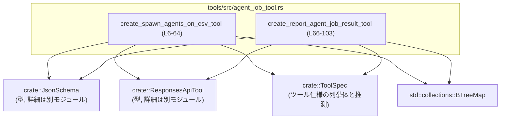
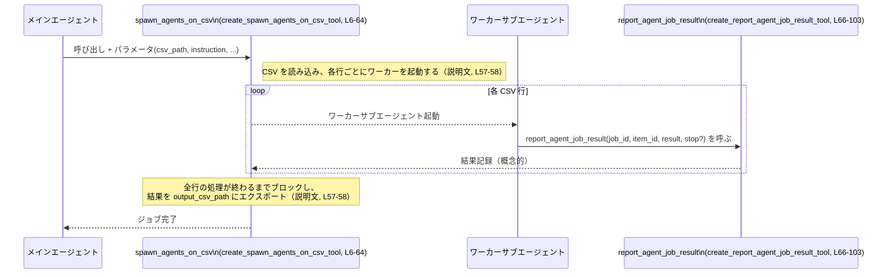

# tools/src/agent_job_tool.rs コード解説

## 0. ざっくり一言

- エージェントジョブ機能用の **ツール定義（ToolSpec）を2つ生成するヘルパー** です。
- CSV 行ごとにワーカーエージェントを起動するジョブと、その結果を報告するジョブ用ツールの JSON スキーマを組み立てます。

---

## 1. このモジュールの役割

### 1.1 概要

- このモジュールは、エージェントシステムにおける「ジョブ実行」と「ジョブ結果報告」を行うための **ツール仕様（ToolSpec）を生成する関数** を提供します。
- 具体的には、以下 2 つのツールを定義します（`agent_job_tool.rs:L6-64`, `L66-103`）。
  - `spawn_agents_on_csv`: CSV の各行に対してワーカーサブエージェントを起動して処理するジョブ。
  - `report_agent_job_result`: 各ワーカーが自分のジョブ結果を報告するためのツール。

### 1.2 アーキテクチャ内での位置づけ

- このファイルは **ツール仕様の宣言のみ** を行い、実際のジョブ実行・並列処理・CSV 読み書きなどのロジックは、他のモジュール（Responses API やジョブ実行エンジン）に委ねられています。
- 依存関係（このファイルから見える範囲）は以下の通りです。



※ `JsonSchema`, `ResponsesApiTool`, `ToolSpec` の定義自体はこのチャンクには現れません。

### 1.3 設計上のポイント

- **責務の分割**
  - このモジュールは「ツールのメタ情報（名前・説明・パラメータスキーマ）の構築」のみを担当し、実際の処理は一切行いません（`ToolSpec::Function` の組み立てのみ、`agent_job_tool.rs:L55-63`, `L89-102`）。
- **状態を持たない**
  - 2 つの関数はいずれも引数を取らず、グローバル状態も持たず、毎回同じ `ToolSpec` を返す純粋な関数です（`L6`, `L66`）。
- **エラーハンドリング**
  - このファイル内でのエラー発生可能性は実質ありません。`BTreeMap::from` などはパニックしない前提の単純な値構築のみです。
- **並行性の扱い**
  - 並行性そのものはここでは実装していませんが、`max_concurrency`/`max_workers` や `max_runtime_seconds`、`stop` といったパラメータを通じて **別モジュール側の並行処理ロジックを制御する設定インターフェース** を提供します（`L30-47`, `L81-85`）。

---

## コンポーネントインベントリー（このチャンク）

このファイル内で **定義／直接参照** している主なコンポーネントの一覧です。

| 名前 | 種別 | 役割 / 用途 | 定義 or 参照 | ソース範囲 |
|------|------|-------------|--------------|------------|
| `create_spawn_agents_on_csv_tool` | 関数 | `spawn_agents_on_csv` ツールの `ToolSpec` を構築して返す | 定義 | `agent_job_tool.rs:L6-64` |
| `create_report_agent_job_result_tool` | 関数 | `report_agent_job_result` ツールの `ToolSpec` を構築して返す | 定義 | `agent_job_tool.rs:L66-103` |
| `JsonSchema` | 型 | JSON スキーマ DSL。ツールパラメータの型定義に使用 | 参照のみ | `agent_job_tool.rs:L1,L7-52,L61,L78,L96-100` |
| `ResponsesApiTool` | 型 | `ToolSpec::Function` の中身となる構造体 | 参照のみ | `agent_job_tool.rs:L2,L55-63,L89-102` |
| `ToolSpec` | 列挙体と推測 | 各ツールを表現する公開 API 型。ここでは `Function` 変種を使用 | 参照のみ | `agent_job_tool.rs:L3,L55,L89` |
| `BTreeMap` | 標準ライブラリ型 | パラメータ名→スキーマのマップ | 参照のみ | `agent_job_tool.rs:L4,L7,L51,L67,L78` |
| `tests` モジュール | テストモジュール | このモジュール用テストを `agent_job_tool_tests.rs` に定義 | 条件付き定義 | `agent_job_tool.rs:L105-107` |

---

## 2. 主要な機能一覧

- CSV ジョブツール定義: `create_spawn_agents_on_csv_tool` により、CSV の各行をワーカーエージェントで処理するためのツール仕様 `spawn_agents_on_csv` を定義します（`L6-64`）。
- ジョブ結果報告ツール定義: `create_report_agent_job_result_tool` により、ワーカーエージェントがジョブ結果を報告するツール仕様 `report_agent_job_result` を定義します（`L66-103`）。

---

## 3. 公開 API と詳細解説

### 3.1 型一覧（構造体・列挙体など）

このファイル内で **新たに定義される公開型はありません**。外部型への依存のみが存在します。

外部型の参照状況を整理します。

| 名前 | 種別 | 役割 / 用途 | 備考 | ソース範囲 |
|------|------|-------------|------|------------|
| `ToolSpec` | 列挙体と推測 | ツール仕様のトップレベル型。`ToolSpec::Function` が使用されている | 実体定義はこのチャンクには現れません | `agent_job_tool.rs:L3,L55,L89` |
| `ResponsesApiTool` | 構造体と推測 | `ToolSpec::Function` のペイロード。ツール名・説明・パラメータスキーマなどを保持 | 実体定義はこのチャンクには現れません | `agent_job_tool.rs:L2,L55-63,L89-102` |
| `JsonSchema` | 列挙体／構造体と推測 | ツールパラメータの JSON スキーマを構築する DSL | `string`, `number`, `object`, `boolean` メソッドを使用 | `agent_job_tool.rs:L1,L7-52,L61,L78,L96-100` |
| `BTreeMap` | 標準ライブラリのマップ | プロパティ名 → スキーマのマップ構築に使用 | 順序付きである必要があるかはこのコードからは不明 | `agent_job_tool.rs:L4,L7,L51,L67,L78` |

### 3.2 関数詳細

#### `create_spawn_agents_on_csv_tool() -> ToolSpec`

**概要**

- CSV ファイルを行ごとに処理するジョブ用ツール `spawn_agents_on_csv` の `ToolSpec` を構築して返します（`agent_job_tool.rs:L6-64`）。
- 説明文によれば、このツールは「各 CSV 行ごとにワーカーサブエージェントを起動し、各ワーカーが `report_agent_job_result` を呼び出す」ことを前提としたジョブを実行します（`L55-58`）。

**引数**

- 引数はありません。

**戻り値**

- `ToolSpec`  
  - `ToolSpec::Function(ResponsesApiTool { ... })` で初期化された値を返します（`agent_job_tool.rs:L55-63`）。
  - `name = "spawn_agents_on_csv"` のツール仕様です（`L56`）。

**内部処理の流れ**

1. `BTreeMap::from` でパラメータ名から `JsonSchema` へのマップ `properties` を構築します（`agent_job_tool.rs:L7-53`）。
   - `csv_path`: 文字列。CSV ファイルのパス（`L8-11`）。
   - `instruction`: 文字列。各行に適用する指示テンプレート（`L12-18`）。
   - `id_column`: 文字列。オプションの ID 列名（`L19-23`）。
   - `output_csv_path`: 文字列。結果を書き出す出力 CSV パス（`L25-28`）。
   - `max_concurrency`: 数値。最大同時ワーカー数（`L29-35`）。
   - `max_workers`: 数値。`max_concurrency` の別名（`L36-41`）。
   - `max_runtime_seconds`: 数値。ワーカーごとの最大実行時間（`L42-47`）。
   - `output_schema`: オブジェクト。結果 JSON のスキーマ（`L49-52`）。
2. `ToolSpec::Function` の `ResponsesApiTool` を初期化します（`agent_job_tool.rs:L55-63`）。
   - `name`: `"spawn_agents_on_csv"`（`L56`）。
   - `description`: ジョブの挙動を説明する長文（`L57-58`）。
   - `strict`: `false`（`L59`）。
   - `defer_loading`: `None`（`L60`）。
   - `parameters`: `JsonSchema::object(properties, required_keys, additional_properties)`  
     - `required_keys` は `["csv_path", "instruction"]` の 2 つ（`L61`）。
     - `additional_properties` は `Some(false.into())` で、追加プロパティ禁止の可能性があります（意味は `JsonSchema` の定義側に依存、`L61`）。
   - `output_schema`: `None`（`L62`）。
3. 初期化した `ToolSpec` をそのまま返します（`L55-63`）。

**Examples（使用例）**

> 実際のモジュールパスはプロジェクト構成に依存するため、`use` の行は擬似的なものです。

```rust
// agent_job_tool モジュールから関数をインポートする（モジュールパスは実プロジェクトに合わせて調整する）
use crate::tools::agent_job_tool::create_spawn_agents_on_csv_tool;

fn register_tools() {
    // ツール仕様を構築する
    let spawn_tool_spec = create_spawn_agents_on_csv_tool(); // ToolSpec を取得

    // ここでフレームワーク側のツールレジストリに登録する想定
    // register_tool(spawn_tool_spec);
}
```

**Errors / Panics**

- この関数内で明示的に `Result` や `Option` を扱っておらず、パニックを発生させるような処理もありません。
- 使用している標準ライブラリ API (`BTreeMap::from`, `String::to_string`) は、通常の使用ではパニックを起こしません。
- したがって **関数呼び出し時に失敗することは想定されていません**（スキーマ構築のみ）。

**Edge cases（エッジケース）**

この関数自体のエッジケースというより、**生成されるツールの契約**に関する注意点です。

- `csv_path` / `instruction` 未指定
  - これら 2 つは `required` に指定されているため（`agent_job_tool.rs:L61`）、ツールを呼び出す際に省略するとバリデーションエラーになる可能性があります。
- `max_concurrency` と `max_workers` の両方を指定
  - 両方ともスキーマ上は有効な数値フィールドですが、どちらを優先するかはこのファイルからは分かりません。
- `output_schema` 未指定
  - 説明文では「`output_schema` が指定された場合、そのスキーマに合わせる必要がある」とありますが（`agent_job_tool.rs:L57-58`）、未指定時のバリデーション挙動は不明です。
- プレースホルダ表記のゆらぎ
  - コメントでは `{column_name}`（`agent_job_tool.rs:L15`）、説明文では `` `{column}` ``（`L57`） と、2 種類の記述があります。どちらが正しいのかはコードからは判断できません。

**使用上の注意点**

- `max_concurrency` / `max_workers` と並行性
  - これらは「最大同時ワーカー数」「逐次実行」を制御する設定項目として説明されていますが（`agent_job_tool.rs:L30-40`）、実際の並列実行の仕組みは別モジュールの実装に依存します。
- `max_runtime_seconds`
  - 「ワーカーごとの最大実行時間」として説明されており（`agent_job_tool.rs:L43-47`）、タイムアウトやワーカーの強制終了を行うかどうかは実装側に依存します。
- ブロッキング呼び出し
  - 説明文に「This call blocks until all rows finish」とあるため（`agent_job_tool.rs:L57-58`）、呼び出しスレッドをブロックする設計であることが示唆されます。UI スレッドや低レイテンシが要求されるコンテキストからは注意が必要です。
- 結果報告の必須性
  - 「Each worker must call `report_agent_job_result` … missing reports are treated as failures」とあるため（`agent_job_tool.rs:L57-58`）、各ワーカー実装側で `report_agent_job_result` を必ず一度呼ぶ契約になっていると解釈できます。

---

#### `create_report_agent_job_result_tool() -> ToolSpec`

**概要**

- ワーカーエージェントが、ジョブアイテムの結果を報告するためのツール `report_agent_job_result` の `ToolSpec` を構築して返します（`agent_job_tool.rs:L66-103`）。
- 説明文には「Worker-only tool」「Main agents should not call this」とあり、**ワーカー専用の内部用ツール**であることが示されています（`L90-93`）。

**引数**

- 引数はありません。

**戻り値**

- `ToolSpec`  
  - `ToolSpec::Function(ResponsesApiTool { ... })` として初期化された値を返します（`agent_job_tool.rs:L89-102`）。
  - `name = "report_agent_job_result"` のツール仕様です（`L90`）。

**内部処理の流れ**

1. `BTreeMap::from` でパラメータ用のプロパティマップ `properties` を構築します（`agent_job_tool.rs:L67-87`）。
   - `job_id`: 文字列。ジョブの識別子（`L68-71`）。
   - `item_id`: 文字列。ジョブアイテムの識別子（`L72-75`）。
   - `result`: オブジェクト。結果 JSON（`L76-79`）。
   - `stop`: 真偽値。`true` のとき残りのジョブアイテムをキャンセル（`L80-85`）。
2. `ToolSpec::Function` の `ResponsesApiTool` を初期化します（`agent_job_tool.rs:L89-102`）。
   - `name`: `"report_agent_job_result"`（`L90`）。
   - `description`: ワーカー専用である旨の説明文（`L91-93`）。
   - `strict`: `false`（`L94`）。
   - `defer_loading`: `None`（`L95`）。
   - `parameters`:  
     - `JsonSchema::object(properties, required_keys, additional_properties)` 形式で、  
       `required_keys` は `["job_id", "item_id", "result"]` の 3 つ（`L96-100`）。
       `stop` はオプションです。
   - `output_schema`: `None`（`L101`）。
3. 構築した `ToolSpec` を返します（`agent_job_tool.rs:L89-102`）。

**Examples（使用例）**

```rust
// agent_job_tool モジュールから関数をインポート（モジュールパスは実プロジェクトに合わせて調整）
use crate::tools::agent_job_tool::create_report_agent_job_result_tool;

fn register_worker_tools() {
    let report_tool_spec = create_report_agent_job_result_tool(); // ToolSpec を取得

    // ワーカー用のツールレジストリに登録するイメージ
    // register_worker_tool(report_tool_spec);
}
```

**Errors / Panics**

- この関数も単に構造体・マップを構築しているだけであり、通常の実行でエラーやパニックは発生しません。
- 失敗の可能性は、ツールを実行する側のロジック（`job_id` が存在しない、`item_id` が不正など）にありますが、その実装はこのファイルには現れません。

**Edge cases（エッジケース）**

- `stop` フィールド未指定
  - `required` に含まれていないため（`agent_job_tool.rs:L96-100`）、省略可能です。省略した場合のデフォルト動作（継続するのか）は、このファイルからは不明です。
- `result` のスキーマ
  - `JsonSchema::object(BTreeMap::new(), None, None)` となっており（`agent_job_tool.rs:L76-79`）、内部構造には制約がありません。  
    `spawn_agents_on_csv` 側の `output_schema` と整合させるのは、別の層の責務と考えられます。
- `job_id` / `item_id` の整合性
  - これらが有効な組合せかどうかは、バックエンドのジョブ管理側が検証する想定と思われますが、コードからは判断できません。

**使用上の注意点**

- ワーカー専用
  - 説明文で「Worker-only」「Main agents should not call this」と明言されており（`agent_job_tool.rs:L91-93`）、メインエージェントが直接呼び出すと設計意図に反する使い方になります。
- キャンセル機能
  - `stop: true` により「残りのジョブアイテムをキャンセルする」と説明されています（`agent_job_tool.rs:L81-85`）。  
    並列実行されているワーカーがある場合にどう扱われるか（すでに実行中のものを中断するかどうかなど）は、このコードからは不明です。
- 結果 JSON の形式
  - `result` の中身は任意のオブジェクトとして許可されており（`agent_job_tool.rs:L76-79`）、実際のアプリケーション側で決めたスキーマに従う必要があります。

### 3.3 その他の関数

- このファイルには、上記 2 つ以外の関数は定義されていません。

---

## 4. データフロー

`spawn_agents_on_csv` と `report_agent_job_result` の意図されたデータフローを、**説明文から読み取れる範囲** でまとめます。

- メインエージェントが `spawn_agents_on_csv` ツールを呼び出し、CSV の各行に対してワーカーサブエージェントが起動される（説明文より、`agent_job_tool.rs:L57-58`）。
- 各ワーカーは自身の処理結果を `report_agent_job_result` を通じて報告し、報告がない場合は失敗として扱われる（`L57-58`）。
- `spawn_agents_on_csv` の呼び出しは、全行の処理が完了するまでブロックされ、結果は `output_csv_path` に書き出される（`L57-58`）。



> 実際のジョブ管理やストレージ層（ジョブ結果の保存方法など）は、このファイルには現れないため、「概念的な参加者」としてのみ表現しています。

---

## 5. 使い方（How to Use）

### 5.1 基本的な使用方法

このモジュールは、「ツール仕様を登録する層」で利用されることが想定されます。

```rust
// モジュールパスは実プロジェクトに合わせて調整する必要があります。
// use crate::tools::agent_job_tool::{create_spawn_agents_on_csv_tool, create_report_agent_job_result_tool};

fn setup_agent_tools() {
    // CSV ジョブ用ツールを生成
    let spawn_spec = create_spawn_agents_on_csv_tool();          // agent_job_tool.rs:L6-64

    // 結果報告用ツールを生成
    let report_spec = create_report_agent_job_result_tool();     // agent_job_tool.rs:L66-103

    // ここでフレームワーク側のツールレジストリに登録する
    // register_tool(spawn_spec);
    // register_tool(report_spec);
}
```

- Rust としては、**純粋関数を呼び出して `ToolSpec` を得るだけ** です。
- これらのツールがどのように UI / API から利用されるかは、ツール登録先のフレームワークの設計次第です。

### 5.2 よくある使用パターン

1. **メインエージェントからジョブを起動する**
   - `spawn_agents_on_csv` を呼び出して CSV ベースの一括処理ジョブを開始。
   - `instruction` にテンプレート文字列を渡して、各行に対するプロンプトや指示を生成。
2. **ワーカーエージェントから結果を報告する**
   - 各ワーカーが `report_agent_job_result` を一度だけ呼び、`result` に JSON オブジェクトを渡す。
   - `stop: true` を指定すると、残りのアイテムの処理をキャンセルする指示となる（説明文, `agent_job_tool.rs:L81-85`）。

### 5.3 よくある間違い

推測ではなく、説明文から読み取れる典型的な誤用例を挙げます。

```rust
// 誤り例: メインエージェントが直接 report_agent_job_result を呼ぶ
fn main_agent_logic() {
    // ...
    let _ = create_report_agent_job_result_tool();
    // ツール経由で main から結果を自前報告するのは意図と異なる
}

// 正しい例: ワーカーのみが結果報告を行う（概念的なコード）
fn worker_logic() {
    // ワーカーのみが report_agent_job_result を使用する想定
    let _ = create_report_agent_job_result_tool();
}
```

- `report_agent_job_result` の説明文には「Worker-only tool」「Main agents should not call this」と明記されているため（`agent_job_tool.rs:L91-93`）、メインエージェントからの利用は誤用とみなされます。

### 5.4 使用上の注意点（まとめ）

- **前提条件**
  - `spawn_agents_on_csv` では `csv_path` と `instruction` が必須（`agent_job_tool.rs:L61`）。これらが存在しないとツール側でバリデーションエラーが発生する可能性があります。
  - 各ワーカーは必ず `report_agent_job_result` を呼び出すことが期待されています（説明文, `agent_job_tool.rs:L57-58`）。
- **並行性**
  - `max_concurrency` / `max_workers` / `max_runtime_seconds` によって並行実行度とタイムアウトが制御されますが（`agent_job_tool.rs:L30-47`）、具体的なスレッド・タスクモデルはこのコードからは分かりません。
  - 呼び出し元のスレッドはジョブ完了までブロックされることが説明されています（`agent_job_tool.rs:L57-58`）。
- **セキュリティ**
  - `csv_path` / `output_csv_path` はファイルパス文字列として扱われるだけで、このコードではパス検証や権限チェックは行っていません（`agent_job_tool.rs:L9-11,L26-28`）。実際のファイル操作部分で適切なチェックが必要です。
- **仕様上のゆらぎ**
  - テンプレートプレースホルダが `{column}` と `{column_name}` で揺れており（`agent_job_tool.rs:L15,L57`）、ドキュメントか実装のいずれかを統一する必要がある可能性があります。

---

## 6. 変更の仕方（How to Modify）

### 6.1 新しい機能を追加する場合

このファイルの役割は「ツール仕様の組み立て」なので、新しいジョブ関連ツールを追加する場合は以下の流れが自然です。

1. **新ツールの目的を決める**
   - 例: 「JSON Lines ファイルを処理するジョブ」など。  
     ※ 実装は他モジュールとなるため、このファイルでは説明文とパラメータだけを定義します。
2. **パラメータスキーマの定義**
   - `BTreeMap::from` でパラメータ名→`JsonSchema` のマップを定義します（既存コードの `properties` を参考, `agent_job_tool.rs:L7-53,L67-87`）。
3. **`ResponsesApiTool` の構築**
   - `name`, `description`, `parameters`, `output_schema` などを設定し、`ToolSpec::Function` でラップします（`agent_job_tool.rs:L55-63,L89-102`）。
4. **テストの追加**
   - `#[cfg(test)]` で参照されている `agent_job_tool_tests.rs` に、新ツール仕様のテスト（パラメータ名や必須フラグの確認）を追加するのが自然です（`agent_job_tool.rs:L105-107`）。

### 6.2 既存の機能を変更する場合

- **影響範囲の確認**
  - `name` の変更（`"spawn_agents_on_csv"`, `"report_agent_job_result"`）は、ツール名でバインドしている全ての呼び出し元に影響します（`agent_job_tool.rs:L56,L90`）。
  - パラメータ名や `required` リストの変更は、ツールの呼び出しフォーマット（JSON など）に影響します（`agent_job_tool.rs:L7-52,L61,L67-87,L96-100`）。
- **契約（前提条件・返り値）**
  - 説明文で明示されている契約（「ワーカーが必ず結果を報告」「stop で残りをキャンセル」など）を変更する場合、ジョブ実行エンジン側の実装も合わせて確認する必要があります（`agent_job_tool.rs:L57-58,L81-85,L91-93`）。
- **テストの更新**
  - `agent_job_tool_tests.rs` 側で、ツール名・パラメータ・説明文などを検証しているテストがあれば、同時に更新する必要があります（テストコードはこのチャンクには現れません）。

---

## 7. 関連ファイル

| パス | 役割 / 関係 |
|------|------------|
| `tools/src/agent_job_tool.rs` | 本ファイル。ジョブ関連ツールの `ToolSpec` を構築するヘルパー関数を定義する。 |
| `tools/src/agent_job_tool_tests.rs` | `#[cfg(test)]` で参照されるテストモジュール。ツール仕様の内容（パラメータや必須項目）が期待通りかを検証していると推測されるが、このチャンクには具体的な中身は現れません（`agent_job_tool.rs:L105-107`）。 |
| `crate::JsonSchema` 定義ファイル（パス不明） | JSON スキーマを表現する DSL の定義。`string`, `number`, `object`, `boolean` などのコンストラクタが提供されている（`agent_job_tool.rs:L7-52,L76-79`）。 |
| `crate::ResponsesApiTool` 定義ファイル（パス不明） | `ToolSpec::Function` にラップされるツール情報構造体。`name`, `description`, `strict`, `defer_loading`, `parameters`, `output_schema` フィールドを持つと解釈できる（`agent_job_tool.rs:L55-63,L89-102`）。 |
| `crate::ToolSpec` 定義ファイル（パス不明） | ツール全体を表す API 型。少なくとも `Function(ResponsesApiTool)` 変種を持つ（`agent_job_tool.rs:L55,L89`）。 |

---

### Bugs / Security / Contracts / Tests / パフォーマンス まとめ（ファイル全体）

- **潜在的なバグ候補**
  - プレースホルダ表記の不一致 `{column_name}` vs `` `{column}` ``（`agent_job_tool.rs:L15,L57`）。
- **セキュリティ**
  - パスや JSON 内容についての検証はこのファイルでは行っておらず、**バリデーションはすべて別の層に依存** します。
- **Contracts / Edge Cases**
  - 「ワーカーは結果を必ず報告する」「stop で残りをキャンセル」など、説明文に契約が明示されています（`agent_job_tool.rs:L57-58,L81-85,L91-93`）。
- **Tests**
  - `agent_job_tool_tests.rs` でテストが用意されていることのみが分かります（`L105-107`）。中身はこのチャンクには現れません。
- **Performance / Scalability**
  - 並行性に関する設定項目（`max_concurrency`, `max_workers`, `max_runtime_seconds`）が用意されており（`agent_job_tool.rs:L30-47`）、大規模な CSV ジョブにも対応する設計であることが示唆されますが、実際のスケーリング挙動はジョブ実行エンジン側に依存します。
