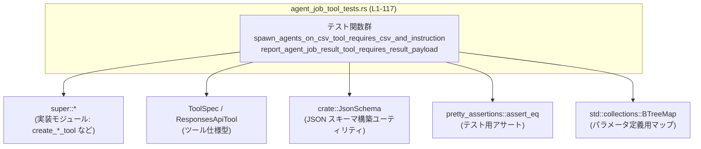
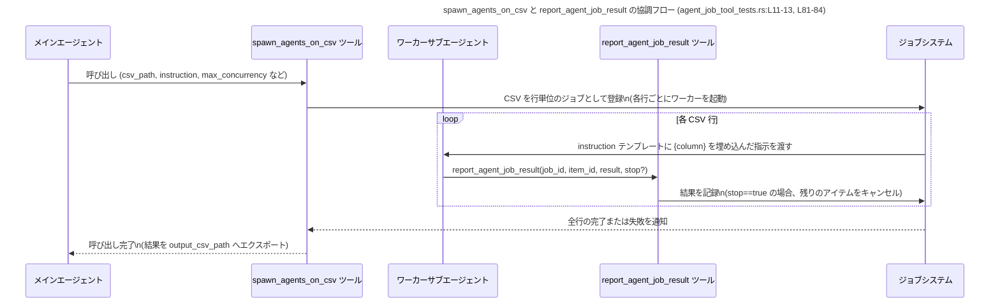

# tools/src/agent_job_tool_tests.rs コード解説

## 0. ざっくり一言

エージェントジョブ系の 2 つのツール  
`spawn_agents_on_csv` と `report_agent_job_result` の **ToolSpec（ツール仕様）と JSON スキーマが期待どおりかを検証するテストモジュール**です（`agent_job_tool_tests.rs:L6-74`, `L76-117`）。

---

## 1. このモジュールの役割

### 1.1 概要

- このモジュールは、エージェントジョブ機能のためのツール生成関数  
  `create_spawn_agents_on_csv_tool` と `create_report_agent_job_result_tool` が返す `ToolSpec` が、  
  **所定の名前・説明文・パラメータスキーマ・必須項目**を持つことを検証します（`agent_job_tool_tests.rs:L8-12`, `L78-83`）。
- これにより、エージェント用ツールの **外部契約（JSON 形状や意味）** が不意に変わらないことを保証します。

### 1.2 アーキテクチャ内での位置づけ

このテストモジュールは、同一モジュール階層の実装（`super::*`）に依存し、  
`ToolSpec`, `ResponsesApiTool`, `JsonSchema` を用いて期待される仕様を構築します（`L1-4`）。



> 親モジュール（`super`）の具体的なファイル名や中身は、このチャンクには現れないため不明です。

### 1.3 設計上のポイント

- **ゴールデン値比較による契約テスト**  
  - `assert_eq!` で、ファクトリ関数の戻り値と **完全に一致する `ToolSpec::Function(ResponsesApiTool { ... })`** を比較しています（`L8-12`, `L78-81`）。
  - 説明文やパラメータ名を含む **全フィールドがテスト対象**です。
- **JSON スキーマの明示的定義**  
  - `JsonSchema::object` と `BTreeMap::from` を使って、各パラメータの型・説明・必須項目を明示しています（`L16-70`, `L87-115`）。
  - `BTreeMap` によりキー順が安定するため、テスト時の比較が安定します（`L4`, `L16`, `L65`, `L87`, `L99`）。
- **並行実行とタイムアウト設定をパラメータで制御**  
  - `max_concurrency` / `max_workers` / `max_runtime_seconds` といったパラメータが仕様に含まれ（`L43-60`）、  
    ジョブの並行性とワーカーごとの最大実行時間を外部から制御できる設計であることが分かります。
- **エージェントの責務分離**  
  - `spawn_agents_on_csv` は「ジョブ全体の起動・管理用」、  
    `report_agent_job_result` は「ワーカーのみが結果報告に使う」ツールとして説明文上分離されています（`L11-13`, `L81-84`）。

---

## 2. 主要な機能一覧（コンポーネントインベントリー概要）

このファイルに「定義」または「参照」として登場する主な関数・型の一覧です。

| 名前 | 種別 | 定義/参照 | 役割 / 用途 | 根拠行 |
|------|------|-----------|-------------|--------|
| `spawn_agents_on_csv_tool_requires_csv_and_instruction` | 関数（テスト） | 定義 | `create_spawn_agents_on_csv_tool` の戻り値 `ToolSpec` が期待どおりか検証する | `agent_job_tool_tests.rs:L6-74` |
| `report_agent_job_result_tool_requires_result_payload` | 関数（テスト） | 定義 | `create_report_agent_job_result_tool` の戻り値 `ToolSpec` が期待どおりか検証する | `agent_job_tool_tests.rs:L76-117` |
| `create_spawn_agents_on_csv_tool` | 関数 | 参照 | `spawn_agents_on_csv` ツール仕様を生成するファクトリ（引数なしで呼び出される） | `agent_job_tool_tests.rs:L8-9` |
| `create_report_agent_job_result_tool` | 関数 | 参照 | `report_agent_job_result` ツール仕様を生成するファクトリ（引数なしで呼び出される） | `agent_job_tool_tests.rs:L78-79` |
| `ToolSpec` | 列挙体と推定 | 参照 | `Function(ResponsesApiTool)` というバリアントを通じて、ツール仕様のトップレベル型として使われる | `agent_job_tool_tests.rs:L10`, `L80` |
| `ResponsesApiTool` | 構造体と推定 | 参照 | 実際のツール定義（name, description, parameters など）を保持する | `agent_job_tool_tests.rs:L10-72`, `L80-116` |
| `JsonSchema` | 型（詳細不明） | 参照 | パラメータそれぞれの JSON スキーマ（型・説明・必須情報）を構築するユーティリティ | `agent_job_tool_tests.rs:L2`, `L16-20`, `L24-27`, `L31-33`, `L37-39`, `L43-60`, `L63-68`, `L87-103`, `L105-109` |

> `ToolSpec` が列挙体であることは、`ToolSpec::Function(...)` というバリアント風の呼び出しから推測できますが、定義自体はこのファイルにはありません（`agent_job_tool_tests.rs:L10`, `L80`）。

---

## 3. 公開 API と詳細解説

このファイル自体はテストモジュールのため「公開 API」の定義はありませんが、  
テスト対象である 2 つのツール生成関数の振る舞いを、テストから読み取れる範囲で整理します。

### 3.1 型一覧（このファイルから分かる範囲）

| 名前 | 種別 | 役割 / 用途 | 備考 / 根拠 |
|------|------|-------------|-------------|
| `ToolSpec` | 列挙体（推定） | ツールの仕様全体を表すトップレベル型。少なくとも `Function(ResponsesApiTool)` というバリアントを持つ。 | `ToolSpec::Function(ResponsesApiTool { ... })` というコンストラクタ風の利用から（`agent_job_tool_tests.rs:L10`, `L80`） |
| `ResponsesApiTool` | 構造体（推定） | ツール名、説明文、`parameters`、`output_schema` などを保持するツール定義。 | フィールド初期化構文 `{ name: ..., description: ..., parameters: ..., output_schema: ... }` から（`agent_job_tool_tests.rs:L10-72`, `L80-116`） |
| `JsonSchema` | 型（おそらく列挙体 or 構造体） | JSON スキーマを構築するためのユーティリティ。`object` / `string` / `number` / `boolean` などの関連関数を持つ。 | `JsonSchema::object`, `JsonSchema::string`, `JsonSchema::number`, `JsonSchema::boolean` の呼び出しから（`agent_job_tool_tests.rs:L16-20`, `L24-27`, `L31-33`, `L37-39`, `L43-60`, `L63-68`, `L87-103`, `L105-109`） |

### 3.2 関数詳細（テスト対象のファクトリ関数）

> どちらの関数も **定義はこのファイル外** にあります。  
> ここではテストコードから読み取れる「期待される挙動」だけを記述します。

#### `create_spawn_agents_on_csv_tool() -> ToolSpec`（推定）

**概要**

- `spawn_agents_on_csv` という名前のツール仕様（`ToolSpec::Function`）を生成する関数です（`agent_job_tool_tests.rs:L10-12`）。
- このツールは「CSV を行ごとのワーカーサブエージェントで処理するジョブ」を開始するためのものです（`L11-13`）。

**引数**

- テストでは **引数なし** で呼び出されているため、0 引数関数であると考えられます（`agent_job_tool_tests.rs:L8-9`）。

**戻り値**

- `ToolSpec::Function(ResponsesApiTool { ... })` という値と `assert_eq!` で比較されるため、  
  少なくとも `ToolSpec` 型か、同等に比較可能な型を返す必要があります（`agent_job_tool_tests.rs:L8-10`）。
- フィールド内容（テストが要求する仕様）:
  - `name`: `"spawn_agents_on_csv"`（`L11`）
  - `description`: 以下の内容の文字列（要約）  
    - CSV の各行ごとにワーカーサブエージェントを生成して処理する  
    - `instruction` 文字列はテンプレートで、`{column}` プレースホルダは行の値で置換される  
    - 各ワーカーは `report_agent_job_result` を呼ぶ必要がある  
    - 呼び出しは全行の処理が終わるまでブロックし、結果を `output_csv_path`（未指定時はデフォルトパス）にエクスポートする  
    （`agent_job_tool_tests.rs:L11-13`）
  - `strict: false`（`L14`）
  - `defer_loading: None`（`L15`）
  - `parameters`: `JsonSchema::object(...)` により定義されたパラメータスキーマ（`L16-70`）
    - パラメータ一覧は後述
  - `output_schema: None`（`L71`）

**パラメータスキーマの詳細（parameters フィールド）**

`JsonSchema::object(BTreeMap::from([...]), Some(vec![...]), Some(false.into()))` という形で  
オブジェクト型のスキーマが構築されています（`agent_job_tool_tests.rs:L16-70`）。

- プロパティ一覧:

  | フィールド名 | 型 | 説明 (description) | 根拠 |
  |--------------|----|--------------------|------|
  | `csv_path` | 文字列 (`JsonSchema::string`) | 「入力行を含む CSV ファイルのパス」 | `agent_job_tool_tests.rs:L18-21` |
  | `instruction` | 文字列 | 「各 CSV 行に適用する命令テンプレート。`{column_name}` プレースホルダで行の値を埋め込む」 | `agent_job_tool_tests.rs:L24-27` |
  | `id_column` | 文字列 | 「オプション: 安定した item id として使うカラム名」 | `agent_job_tool_tests.rs:L31-34` |
  | `output_csv_path` | 文字列 | 「オプション: 結果を書き出す出力 CSV のパス」 | `agent_job_tool_tests.rs:L37-40` |
  | `max_concurrency` | 数値 (`JsonSchema::number`) | 「このジョブの最大同時ワーカー数。デフォルトは 16、設定で上限が決まる」 | `agent_job_tool_tests.rs:L43-47` |
  | `max_workers` | 数値 | 「`max_concurrency` のエイリアス。1 を指定すると逐次実行になる」 | `agent_job_tool_tests.rs:L50-53` |
  | `max_runtime_seconds` | 数値 | 「ワーカーごとの最大実行時間。デフォルト 1800 秒」 | `agent_job_tool_tests.rs:L56-60` |
  | `output_schema` | オブジェクト (`JsonSchema::object`) | 「結果 JSON のスキーマ。空オブジェクトで、required/追加プロパティはこのチャンクからは不明」 | `agent_job_tool_tests.rs:L63-68` |

- 必須プロパティ:
  - `["csv_path", "instruction"]`（`agent_job_tool_tests.rs:L70`）
- 第 3 引数 `Some(false.into())` の意味は、このチャンクだけでは分かりません  
  （追加プロパティ許可フラグなどの可能性がありますが、推測に留まります）。

**内部処理の流れ（アルゴリズム）**

- 実際の関数定義が存在しないため、実装の流れは不明です。
- テストから分かるのは「呼び出し結果が上記フィールドをもつ `ToolSpec::Function(ResponsesApiTool { .. })` と等しいべき」という仕様だけです（`agent_job_tool_tests.rs:L8-12`, `L16-72`）。

**Examples（使用例）**

テストと同様に、ツール登録時にこの関数を呼ぶ例です。  
関数の実際の可視性やモジュール構成はこのチャンクからは分かりませんが、テストの形を元にした利用例です。

```rust
use tools::agent_job_tool::create_spawn_agents_on_csv_tool; // 実際のパスはこのチャンクからは不明

fn register_tools() {
    // spawn_agents_on_csv ツールの仕様を取得する
    let spawn_tool_spec = create_spawn_agents_on_csv_tool(); // 引数なしで呼び出し（L8-9）

    // これをツールレジストリや API クライアントに登録して使う、という形が想定されます
    let tools = vec![spawn_tool_spec];
    // register_tools_with_agent_system(tools); // 実際の API は不明
}
```

**Errors / Panics**

- テスト内で `create_spawn_agents_on_csv_tool` がエラーを返したりパニックを起こす前提は書かれていません。
- `assert_eq!` のみが使われているため（`agent_job_tool_tests.rs:L8-9`）、この関数は **例外的な状況でも `Result` や `Option` ではなく、素の `ToolSpec` を返す** と考えられますが、定義がないため断定はできません。

**Edge cases（エッジケース）**

ツール仕様の説明文から分かるエッジケースは次のとおりです（実際の処理は別モジュール）。

- **ワーカーが `report_agent_job_result` を呼ばない場合**  
  - 説明文に「missing reports are treated as failures」とあるため（`agent_job_tool_tests.rs:L11-13`）、  
    レポートが行われなかった行は「失敗」と見なされる契約になっています。
- **`output_csv_path` 未指定**  
  - 説明文に「(or a default path)」とあるので（`agent_job_tool_tests.rs:L11-13`）、未指定時には何らかのデフォルトパスに書き出す旨が約束されています。
- **並行度パラメータ**  
  - `max_workers` を 1 にすると逐次実行になる（`agent_job_tool_tests.rs:L50-53`）。
  - `max_concurrency` に対して別途「config」による上限が存在する（`agent_job_tool_tests.rs:L43-47`）。

**使用上の注意点**

- `csv_path` と `instruction` は必須パラメータです（`agent_job_tool_tests.rs:L70`）。  
  ツール呼び出し側は必ず値を指定する必要があります。
- 並行実行に関連する設定（`max_concurrency` / `max_workers` / `max_runtime_seconds`）は  
  **ジョブの性能や安定性に直結する**ため、ワーカーの処理時間や外部システム負荷を考慮して設定する必要があります。
- `instruction` はテンプレート文字列で `{column_name}` プレースホルダ置換を行う前提のため（`agent_job_tool_tests.rs:L24-27`）、  
  CSV のカラム名とテンプレート内のプレースホルダ名を整合させる必要があります。
- Rust の観点では、この関数は `ToolSpec` という **不変な定数に近い値**を構築するだけと考えられるため、  
  スレッド安全性やメモリ安全性の懸念は少ない設計です（テストコードに `unsafe` は登場しません）。

---

#### `create_report_agent_job_result_tool() -> ToolSpec`（推定）

**概要**

- `report_agent_job_result` という名前のツール仕様を生成する関数です（`agent_job_tool_tests.rs:L80-82`）。
- このツールは **ワーカー専用** で、ジョブの 1 アイテムに対する結果を報告するために使われます（`agent_job_tool_tests.rs:L81-84`）。

**引数**

- テストでは引数なしで呼び出されているため、0 引数関数であると考えられます（`agent_job_tool_tests.rs:L78-79`）。

**戻り値**

- `ToolSpec::Function(ResponsesApiTool { ... })` として比較される点は、前述の関数と同様です（`agent_job_tool_tests.rs:L78-81`）。
- フィールド内容（テストが要求する仕様）:
  - `name`: `"report_agent_job_result"`（`agent_job_tool_tests.rs:L81`）
  - `description`: 「ワーカー専用。エージェントジョブアイテムの結果を報告する。メインエージェントは呼び出すべきでない。」（`agent_job_tool_tests.rs:L81-84`）
  - `strict: false`（`L85`）
  - `defer_loading: None`（`L86`）
  - `parameters`: 次のようなオブジェクトスキーマ（`L87-111`）
  - `output_schema: None`（`L116`）

**パラメータスキーマの詳細**

`JsonSchema::object(BTreeMap::from([...]), Some(vec![ ... ]), Some(false.into()))` で定義されています（`agent_job_tool_tests.rs:L87-115`）。

- プロパティ一覧:

  | フィールド名 | 型 | 説明 | 根拠 |
  |--------------|----|------|------|
  | `job_id` | 文字列 | 「ジョブの識別子」 | `agent_job_tool_tests.rs:L89-90` |
  | `item_id` | 文字列 | 「ジョブアイテムの識別子」 | `agent_job_tool_tests.rs:L93-95` |
  | `result` | オブジェクト (`JsonSchema::object`) | 結果ペイロード。詳細スキーマはこのチャンクからは不明 | `agent_job_tool_tests.rs:L97-103` |
  | `stop` | 真偽値 (`JsonSchema::boolean`) | 「オプション。true の場合、この結果が保存された後、残りのジョブアイテムをキャンセルする」 | `agent_job_tool_tests.rs:L105-109` |

- 必須プロパティ:
  - `["job_id", "item_id", "result"]`（`agent_job_tool_tests.rs:L111-115`）

**内部処理の流れ（アルゴリズム）**

- 関数定義がないため不明です。
- テストが保障するのは、上記パラメータ仕様・説明文を持つ `ToolSpec::Function` を返すことだけです（`agent_job_tool_tests.rs:L78-81`, `L87-116`）。

**Examples（使用例）**

ワーカーサブエージェントが結果を報告する際の、概念的な使用例です。  
ここではツールを使う「リクエストペイロード」の形だけをイメージとして示します。

```rust
// 実際にはエージェントフレームワークが ToolSpec に従って JSON を組み立てて呼び出す想定です。
// これは result フィールドの形の一例です。
use serde_json::json;

let payload = json!({
    "job_id": "job-123",       // ジョブ識別子
    "item_id": "row-42",       // 行ごと、またはアイテムごとの ID
    "result": {                // output_schema に従う JSON オブジェクト
        "status": "ok",
        "summary": "processed successfully"
    },
    "stop": true               // これ以降のアイテムをキャンセルしたい場合
});

// 実際の送信手段（HTTP / 内部 API など）はこのチャンクからは分かりません。
```

**Errors / Panics**

- この関数自体がエラーを返す様子はテストからは読み取れません。
- ツールの実際の実行時には、必須フィールド欠落や型不一致に対してバリデーションエラーが発生する可能性がありますが、  
  その挙動はこのチャンクには現れません。

**Edge cases（エッジケース）**

- `stop` フラグが `true` のとき: 残りのジョブアイテムがキャンセルされる契約であることが説明文に明示されています（`agent_job_tool_tests.rs:L105-109`）。
- `result` の内部構造: `JsonSchema::object(BTreeMap::new(), None, None)` となっており（`agent_job_tool_tests.rs:L97-103`）、  
  具体的なフィールドや必須項目はこのチャンクからは分かりません。

**使用上の注意点**

- 説明文に「Main agents should not call this.」とあるため（`agent_job_tool_tests.rs:L81-84`）、  
  メインエージェントがこのツールを直接利用するのは契約違反です。  
  ワーカーサブエージェントのみが使用する設計です。
- `job_id`, `item_id`, `result` は必須であり（`agent_job_tool_tests.rs:L111-115`）、  
  これらを省略したペイロードは不正扱いになることが予想されます。
- `stop` を安易に `true` にすると、残りのアイテムが処理されなくなるため、  
  ビジネスロジック上の意味をよく検討する必要があります。

---

### 3.3 このファイルで定義されている関数（テスト関数）

| 関数名 | 役割（1 行） | 根拠行 |
|--------|--------------|--------|
| `spawn_agents_on_csv_tool_requires_csv_and_instruction` | `create_spawn_agents_on_csv_tool()` が期待どおりの `ToolSpec` を返すことを `assert_eq!` で検証するテスト | `agent_job_tool_tests.rs:L6-74` |
| `report_agent_job_result_tool_requires_result_payload` | `create_report_agent_job_result_tool()` が期待どおりの `ToolSpec` を返すことを `assert_eq!` で検証するテスト | `agent_job_tool_tests.rs:L76-117` |

これらのテストはどちらも同じパターンを取っています。

- `#[test]` 属性でマークされたシンプルな関数（`agent_job_tool_tests.rs:L6`, `L76`）
- 中で `assert_eq!(create_*_tool(), ToolSpec::Function(ResponsesApiTool { ... }))` を 1 回実行（`L8-12`, `L78-81`）

---

## 4. データフロー

ここでは、ツールの説明文に基づいて、  
**CSV からワーカーを起動し、結果を集約する** 一連の流れをシーケンス図で示します。



- 上記は説明文の記述（`agent_job_tool_tests.rs:L11-13`, `L81-84`, `L105-109`）から読み取れる概念フローであり、  
  実際のモジュール構成や関数呼び出し階層はこのチャンクには現れません。
- Rust の観点では、このテストファイル自体は **非同期処理やスレッドを直接扱っておらず**、  
  並行性は「ツールが受け取るパラメータ」として表現されています。

---

## 5. 使い方（How to Use）

### 5.1 基本的な使用方法（概念）

このファイルから確実に分かるのは、  
**「ツール仕様を返すファクトリ関数が存在し、それをテストで検証している」** という点です。

実際の利用シナリオの一例（あくまで概念的）:

```rust
use tools::agent_job_tool::{
    create_spawn_agents_on_csv_tool,
    create_report_agent_job_result_tool,
}; // 実際のパスはこのチャンクには出てこない

fn build_tools() -> Vec<ToolSpec> {
    // 2 つのツール仕様を取得する（テストと同様、引数なしで呼び出す）
    let csv_tool = create_spawn_agents_on_csv_tool();        // L8-9
    let report_tool = create_report_agent_job_result_tool(); // L78-79

    vec![csv_tool, report_tool]
}

// これをエージェントシステムや API に登録して利用する、という形が想定されます。
```

### 5.2 よくある使用パターン（推測を明示）

コードから直接は分かりませんが、ツール仕様から想定される使い方のパターンは次のとおりです。

1. **メインエージェントが CSV 処理ジョブを開始**
   - `spawn_agents_on_csv` ツールを呼び出し、`csv_path` と `instruction` を指定（必須: `agent_job_tool_tests.rs:L70`）。
   - 必要に応じて `max_concurrency` や `max_runtime_seconds` を調整。

2. **ワーカーサブエージェントによる結果報告**
   - 各行を担当するワーカーが `report_agent_job_result` を呼び出し、  
     `job_id`, `item_id`, `result` を送信（`agent_job_tool_tests.rs:L89-95`, `L97-103`）。
   - 終了条件によっては `stop: true` を設定して残りのジョブをキャンセル（`agent_job_tool_tests.rs:L105-109`）。

### 5.3 よくある間違い（想定される誤用）

テストや説明文から、「避けるべき誤用」として読み取れるもの:

```rust
// 誤り例 1: メインエージェントが report_agent_job_result を呼ぶ
// 説明文に "Main agents should not call this." とあるため契約違反です（L81-84）。
// main_agent.call_tool("report_agent_job_result", payload);

// 誤り例 2: 必須パラメータを省略する
// spawn_agents_on_csv で csv_path / instruction を省略する、など。
// 正しくは両方を指定する必要があります（L70）。
let payload = json!({
    // "csv_path": "input.csv",   // ← 必須
    "instruction": "Summarize row: {text}"
});

// 正しい例（必須項目をすべて指定）
let correct_payload = json!({
    "csv_path": "input.csv",
    "instruction": "Summarize row: {text}"
});
```

### 5.4 使用上の注意点（まとめ）

- **必須フィールドの尊重**  
  - `spawn_agents_on_csv`: `csv_path`, `instruction` が必須（`agent_job_tool_tests.rs:L70`）。
  - `report_agent_job_result`: `job_id`, `item_id`, `result` が必須（`agent_job_tool_tests.rs:L111-115`）。
- **役割の分離**  
  - `spawn_agents_on_csv` はジョブ起動用、`report_agent_job_result` はワーカーの結果報告用であり、  
    メインエージェントが後者を直接呼ばないことが契約になっています（`agent_job_tool_tests.rs:L81-84`）。
- **並行性とタイムアウトの設定**  
  - `max_concurrency` / `max_workers` / `max_runtime_seconds` の設定は、ジョブ実行の効率と安定性に影響するため、  
    インフラや外部サービスの許容量を考慮して設定する必要があります（`agent_job_tool_tests.rs:L43-60`）。
- **Rust の安全性**  
  - このテストファイルには `unsafe` ブロックやスレッド操作はなく、  
    仕様構築は `String` と `BTreeMap` を組み合わせた純粋なデータ定義です（`agent_job_tool_tests.rs:L4`, `L11-72`, `L81-116`）。

---

## 6. 変更の仕方（How to Modify）

### 6.1 新しい機能・パラメータを追加する場合

例として、`spawn_agents_on_csv` に `retry_limit` パラメータを追加するような場合を考えます。

1. **実装側（親モジュール）での変更**
   - `create_spawn_agents_on_csv_tool` の `parameters` に `retry_limit` 用の `JsonSchema` 定義を追加します。
   - 必須にする場合は `required` 配列にも追加します（実装側コード。テストからは見えません）。

2. **テスト側の変更（このファイル）**
   - `ToolSpec::Function(ResponsesApiTool { ... })` 内の `parameters` 定義に同じプロパティを追加します（`agent_job_tool_tests.rs:L16-70` 付近）。
   - 必要に応じて説明文も更新します（`agent_job_tool_tests.rs:L11-13`）。

3. **影響の確認**
   - テストがコンパイル・実行され、`assert_eq!` が通ることを確認します。  
     これにより実装とテストで `ToolSpec` が完全一致していることが保証されます。

### 6.2 既存の仕様を変更する場合

- **影響範囲の確認**
  - 説明文やパラメータ名を変更すると、**このテストは必ず失敗**します（`agent_job_tool_tests.rs:L11-13`, `L81-84`）。  
    このため、仕様変更時は常にテストの期待値も更新する必要があります。
- **契約（前提条件）の維持**
  - 必須パラメータのリスト（`required`）を変える場合は、クライアント側とのインタフェース契約が変わります。  
    既存クライアントへの影響を十分に検討する必要があります。
- **テストの粒度**
  - 現状は「構造全体の完全一致」をテストしているため、  
    もし今後「部分的な一致だけを保証したい」（例: 必須項目だけ）という方針に変えるなら、  
    `assert_eq!` ベースのテスト構造自体を変更する必要があります。

---

## 7. 関連ファイル

このファイルから参照されているが、内容がこのチャンクにはない関連モジュール・ライブラリです。

| パス / モジュール | 役割 / 関係 |
|-------------------|------------|
| `super::*` | `create_spawn_agents_on_csv_tool`, `create_report_agent_job_result_tool`, `ToolSpec`, `ResponsesApiTool` など、ツール仕様の実装を提供する親モジュール。具体的なファイル名はこのチャンクからは分かりません（`agent_job_tool_tests.rs:L1`, `L8-10`, `L78-80`）。 |
| `crate::JsonSchema` | ツールパラメータの JSON スキーマを構築するためのユーティリティ型。`object` / `string` / `number` / `boolean` などの関数が使われています（`agent_job_tool_tests.rs:L2`, `L16-20`, `L24-27`, `L31-33`, `L37-39`, `L43-60`, `L63-68`, `L87-103`, `L105-109`）。 |
| `pretty_assertions::assert_eq` | 標準の `assert_eq!` と互換の API を持つが、差分表示が見やすいテスト用マクロ。ツール仕様の差異を把握しやすくします（`agent_job_tool_tests.rs:L3`, `L8`, `L78`）。 |
| `std::collections::BTreeMap` | パラメータ定義のマップ構築に使用される標準ライブラリの連想配列。キー順が安定するため、`assert_eq!` 比較に適しています（`agent_job_tool_tests.rs:L4`, `L16`, `L65`, `L87`, `L99`）。 |

このテストファイルは、上記の実装モジュールやユーティリティに対して  
**「仕様が変わっていないかどうかを継続的に検証するための安全ネット」** という位置づけになっています。
