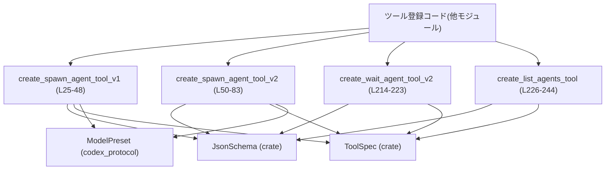
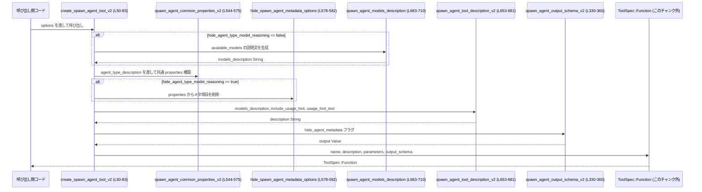

# tools/src/agent_tool.rs

## 0. ざっくり一言

- エージェント（サブエージェント）関連の **ツール定義（ToolSpec）と JSON Schema** をまとめて構築するモジュールです（spawn / send / wait / list / close など）  
  （根拠: `create_*_tool_*` 群と各種 `*_schema` 関数の定義  
  tools/src/agent_tool.rs:L25-279, L281-468）

---

## 1. このモジュールの役割

### 1.1 概要

- このモジュールは、**エージェント管理用の API ツール仕様**（`ToolSpec`）を構築します。  
  （spawn_agent, send_input, wait_agent, list_agents, close_agent など）  
  （根拠: `create_spawn_agent_tool_*`, `create_send_*`, `create_wait_agent_tool_*`, `create_list_agents_tool`, `create_close_agent_tool_*`  
  tools/src/agent_tool.rs:L25-279）
- 各ツールの **入力パラメータと出力形式の JSON Schema** を組み立て、実行系がそれをもとにリクエスト/レスポンスをバリデーションできるようにします。  
  （根拠: `JsonSchema::object/array/...` 呼び出しと `*_output_schema` 群  
  tools/src/agent_tool.rs:L35-47, L65-82, L108-116, L135-147, L173-181, L190-199, L202-223, L235-244, L253-260, L271-278, L281-468）
- モデル候補リストから、エージェントのモデル選択ガイダンス文を生成する補助機能も提供します。  
  （根拠: `spawn_agent_models_description`  
  tools/src/agent_tool.rs:L683-710）

### 1.2 アーキテクチャ内での位置づけ

- 外部（ツール登録ロジック）からは、主に `create_*_tool_*` 関数群が呼び出され、`ToolSpec` が返されます。  
  （根拠: すべて `pub fn create_...() -> ToolSpec` として公開  
  tools/src/agent_tool.rs:L25-279）
- これらの公開関数は内部で `JsonSchema` ヘルパーとローカルな `*_schema` 関数を使って、入力・出力のスキーマを組み立てます。  
  （根拠: 各 create 関数内の `JsonSchema::object/array/number/string` と `*_output_schema` 呼び出し  
  tools/src/agent_tool.rs:L35-47, L65-82, L108-116, L135-147, L173-181, L190-199, L202-223, L235-244, L253-260, L271-278）
- モデル情報は `codex_protocol::openai_models::ModelPreset` から受け取り、ユーザ向けガイダンス文にのみ利用されます（スキーマやロジックでの分岐はしていません）。  
  （根拠: `SpawnAgentToolOptions.available_models` と `spawn_agent_models_description`  
  tools/src/agent_tool.rs:L10-15, L25-27, L50-52, L683-710）

#### 依存関係（概略）



- 実際に「spawn_agent」等を実行するロジックは、このチャンクには現れず、`ToolSpec` を解釈する別モジュール側にあります（不明、実装は他ファイル）。  

### 1.3 設計上のポイント

- **ステートレスなビルダー**  
  - すべての関数は引数から新しい `ToolSpec` / `JsonSchema` / `Value` を構築するだけで、モジュール内にグローバルな状態はありません。  
    （根拠: グローバル変数や `static mut` が存在せず、関数はローカル変数のみ使用  
    tools/src/agent_tool.rs:L25-750）
- **明示的なスキーマ定義**  
  - JSON レベルの入力・出力仕様が明確に構造化されており、フロントエンドやエージェント側モデルが機械的に解釈できる形式になっています。  
    （根拠: `json!` マクロと `JsonSchema::object/array` によるスキーマ定義  
    tools/src/agent_tool.rs:L281-468, L471-576, L712-749）
- **エラーハンドリング**  
  - このモジュール内では `Result` / `Option` でのエラー返却は行わず、ほぼすべてが成功前提のビルダーです。  
    - 潜在的エラーはメモリアロケーション失敗程度で、明示的な panic や `unwrap` は存在しません。  
      （根拠: `unwrap` / `expect` / `panic!` 等が登場しない  
      tools/src/agent_tool.rs:L1-754）
- **並行性**  
  - 共有可変状態を持たないため、このモジュールの関数自体はどのスレッドから呼び出しても安全です。  
    - 実際の並行性制御は、`ToolSpec` を使用する実行系側に委ねられます（このチャンクには現れません）。

---

## 2. 主要な機能一覧

（公開 API ベース）

- エージェント生成ツール定義:
  - `create_spawn_agent_tool_v1`: agent_id + nickname を返す旧版 spawn ツールの定義を構築。  
    （tools/src/agent_tool.rs:L25-48）
  - `create_spawn_agent_tool_v2`: task_name ベースの新しい階層タスク名を使う spawn ツール定義を構築。  
    （tools/src/agent_tool.rs:L50-83）
- 入力送信ツール定義:
  - `create_send_input_tool_v1`: agent_id 宛てに message/items を送るレガシー `send_input` ツール仕様を構築。  
    （tools/src/agent_tool.rs:L85-117）
  - `create_send_message_tool`: ターンを発生させず queue にメッセージを積む `send_message` ツール仕様。  
    （tools/src/agent_tool.rs:L119-148）
  - `create_followup_task_tool`: 非 root agent へのフォローアップとターン起動用 `followup_task` ツール仕様。  
    （tools/src/agent_tool.rs:L150-181）
- エージェント状態管理ツール定義:
  - `create_resume_agent_tool`: 閉じた agent を再開させる `resume_agent` ツール仕様。  
    （tools/src/agent_tool.rs:L184-200）
  - `create_wait_agent_tool_v1`: 複数 agent の最終状態を待つ `wait_agent` v1 ツール仕様。  
    （tools/src/agent_tool.rs:L202-212）
  - `create_wait_agent_tool_v2`: 任意の agent からの mailbox 更新を待つ `wait_agent` v2 ツール仕様。  
    （tools/src/agent_tool.rs:L214-223）
  - `create_list_agents_tool`: 現在の root thread tree の live agent 一覧を得る `list_agents` ツール仕様。  
    （tools/src/agent_tool.rs:L226-244）
  - `create_close_agent_tool_v1/v2`: agent を閉じる `close_agent` ツール仕様（v2 は canonical task name も許容）。  
    （tools/src/agent_tool.rs:L247-279）
- 共通スキーマ / ガイダンス生成:
  - 共通出力・状態スキーマ: `agent_status_output_schema`, `wait_output_schema_*`, `list_agents_output_schema`, `close_agent_output_schema`, など。  
    （tools/src/agent_tool.rs:L281-468）
  - spawn 入力共通部: `spawn_agent_common_properties_v1/v2`。  
    （tools/src/agent_tool.rs:L506-542, L544-575）
  - モデル説明・使用ガイダンス: `spawn_agent_models_description`, `spawn_agent_tool_description`, `spawn_agent_tool_description_v2`。  
    （tools/src/agent_tool.rs:L584-681, L683-710）
  - timeout パラメータスキーマ: `wait_agent_tool_parameters_v1/v2`。  
    （tools/src/agent_tool.rs:L712-739, L740-749）

---

## 3. 公開 API と詳細解説

### 3.1 型一覧（構造体）

| 名前 | 種別 | 役割 / 用途 | 根拠 |
|------|------|-------------|------|
| `SpawnAgentToolOptions<'a>` | 構造体 | spawn_agent ツール定義を構築する際のオプション。利用可能モデルリスト・説明文・メタデータ非表示フラグなどを保持。 | tools/src/agent_tool.rs:L9-16 |
| `WaitAgentTimeoutOptions` | 構造体 | wait_agent ツールの timeout 説明文を構築するためのデフォルト/最小/最大ミリ秒値を保持。 | tools/src/agent_tool.rs:L18-23 |

- どちらも `pub` で公開されており、外部からツール定義の構築条件を指定できます。  
  （根拠: `pub struct` 宣言 tools/src/agent_tool.rs:L9-16, L18-23）

### 3.2 関数詳細（重点 7 件）

#### `create_spawn_agent_tool_v2(options: SpawnAgentToolOptions<'_>) -> ToolSpec`

**概要**

- 新しい task-name ベースの spawn_agent ツール定義を構築します。  
  - 入力: task_name, message, agent_type など。  
  - 出力: task_name（と必要に応じて nickname）を返す schema。  
  （根拠: 関数本体と `spawn_agent_output_schema_v2` 呼び出し  
  tools/src/agent_tool.rs:L50-83, L330-360）

**引数**

| 引数名 | 型 | 説明 |
|--------|----|------|
| `options` | `SpawnAgentToolOptions<'_>` | 利用可能モデル一覧、agent_type 説明文、メタデータ非表示や usage hint の指定。 |

（根拠: 定義とフィールド使用  
tools/src/agent_tool.rs:L10-15, L50-71）

**戻り値**

- `ToolSpec`: name `"spawn_agent"` の `ResponsesApiTool` を内包し、parameters に JSON Schema、output_schema に v2 用スキーマを持つ関数ツール。  
  （根拠: `ToolSpec::Function(ResponsesApiTool { name: "spawn_agent", ... })`  
  tools/src/agent_tool.rs:L65-82）

**内部処理の流れ（アルゴリズム）**

1. モデル説明文の組み立て  
   - `options.hide_agent_type_model_reasoning` が `false` のときだけ `spawn_agent_models_description` を呼び出し、モデル一覧説明文字列を生成。  
     （根拠: `(!options.hide_agent_type_model_reasoning).then(...)`  
     tools/src/agent_tool.rs:L51-52, L683-710）
2. 入力パラメータ用の共通 properties を構築  
   - `spawn_agent_common_properties_v2(&options.agent_type_description)` を呼び出し、message / agent_type / fork_turns / model / reasoning_effort を含む `BTreeMap<String, JsonSchema>` を取得。  
     （根拠: tools/src/agent_tool.rs:L53, L544-575）
3. メタデータ項目の削除（オプション）  
   - `options.hide_agent_type_model_reasoning` が true の場合、`hide_spawn_agent_metadata_options` で `agent_type`, `model`, `reasoning_effort` を properties から削除。  
     （根拠: tools/src/agent_tool.rs:L54-56, L578-582）
4. 必須の `task_name` プロパティ追加  
   - properties に `"task_name"` を `JsonSchema::string` で追加。説明文には使用可能文字（小文字英字・数字・アンダースコア）が記載される。  
     （根拠: tools/src/agent_tool.rs:L57-63）
5. ツール説明文の組み立て  
   - `spawn_agent_tool_description_v2` を呼び、モデル説明＋ canonical task name のルールを含む説明文を生成。`include_usage_hint` と `usage_hint_text` に応じて追記。  
     （根拠: tools/src/agent_tool.rs:L67-71, L653-681）
6. `ToolSpec::Function` を構築  
   - `parameters` に `JsonSchema::object` で作成した schema を渡す。必須項目は `"task_name"` と `"message"`。  
     - `required: Some(vec!["task_name".to_string(), "message".to_string()])`  
   - `output_schema` として `spawn_agent_output_schema_v2(options.hide_agent_type_model_reasoning)` を設定。  
     （根拠: tools/src/agent_tool.rs:L65-82, L330-360）

**Examples（使用例）**

以下は、v2 spawn ツール定義を登録する例です（モジュールパスは仮に `crate::agent_tool` とします）。

```rust
use crate::agent_tool::{
    SpawnAgentToolOptions,               // spawn オプション構造体をインポートする
    create_spawn_agent_tool_v2,          // v2 ツールビルダをインポートする
};
use codex_protocol::openai_models::ModelPreset; // モデルプリセット型（このチャンク外）

fn build_spawn_tool(models: Vec<ModelPreset>) -> crate::ToolSpec { // ToolSpec 型はこのチャンク外
    // spawn_agent ツール構築時のオプションを用意する
    let options = SpawnAgentToolOptions {
        available_models: &models,                           // モデル一覧への参照
        agent_type_description: "Code-review worker".into(), // agent_type の説明文
        hide_agent_type_model_reasoning: false,              // model/agent_type を提示する
        include_usage_hint: true,                            // デフォルトの利用ガイド文を含める
        usage_hint_text: None,                               // カスタム文は使わない
    };

    // ToolSpec を構築する（純粋関数・エラーは返さない）
    let spawn_tool = create_spawn_agent_tool_v2(options);

    spawn_tool // 呼び出し元でツールセットに登録して利用する
}
```

**Errors / Panics**

- 明示的な `Result` や panic はありません。  
  - 失敗しうるのは内部でのメモリアロケーションのみですが、これは Rust ランタイム/OS レベルに委ねられています。  
  （根拠: 関数内で `unwrap` / `panic!` 等がない  
  tools/src/agent_tool.rs:L50-83）

**Edge cases（エッジケース）**

- `available_models` が空のとき  
  - `spawn_agent_models_description` が `"No picker-visible models are currently loaded."` を返すため、説明文はその文言で始まります。  
    （根拠: tools/src/agent_tool.rs:L683-688）
- `hide_agent_type_model_reasoning` = true のとき  
  - 入力 schema から `agent_type`, `model`, `reasoning_effort` フィールドが削除され、出力 schema から `nickname` も省略されます。  
    （根拠: tools/src/agent_tool.rs:L54-56, L330-343, L578-582）
- `include_usage_hint` = true かつ `usage_hint_text` = Some のとき  
  - `spawn_agent_tool_description_v2` 内で、カスタム usage_hint_text が説明文末尾に追記されます。  
    （根拠: tools/src/agent_tool.rs:L653-681）

**使用上の注意点**

- この関数は **スキーマと説明文だけ** を構築します。  
  - 実際に `task_name` / `message` が正しく解釈・検証されるかどうかは、`ToolSpec` を解釈する側に依存します（このチャンクには現れません）。
- `task_name` の命名制約（小文字・数字・アンダースコア）は説明文としてのみ書かれており、このモジュールでは強制していません。  
  （根拠: tools/src/agent_tool.rs:L57-61）

---

#### `create_spawn_agent_tool_v1(options: SpawnAgentToolOptions<'_>) -> ToolSpec`

**概要**

- 旧 API 形式の spawn_agent ツール定義を構築します。  
  - 出力は `agent_id` と `nickname` を含むシンプルなオブジェクトです。  
  （根拠: tools/src/agent_tool.rs:L25-48, L312-328）

**引数**

| 引数名 | 型 | 説明 |
|--------|----|------|
| `options` | `SpawnAgentToolOptions<'_>` | v2 と同様。モデル説明文・ガイダンス文・メタデータ表示/非表示の制御に使用。 |

**戻り値**

- `ToolSpec`（name `"spawn_agent"` の v1 ツール定義）。  
  （根拠: tools/src/agent_tool.rs:L35-47）

**内部処理の流れ（v2 との違いのみ）**

- `spawn_agent_common_properties_v1` を使い、`fork_context` を持つ旧フォーク概念（true/false）を用いた properties を生成。  
  （根拠: tools/src/agent_tool.rs:L30, L506-542）
- `task_name` プロパティはなく、required も None（任意フィールドのみ）となっています。  
  （根拠: `JsonSchema::object(properties, /*required*/ None, ...)`  
  tools/src/agent_tool.rs:L45）
- 出力 schema は `agent_id` / `nickname`。`nickname` は `"string" or "null"`。  
  （根拠: tools/src/agent_tool.rs:L312-327）

**Errors / Panics / Edge cases**

- v2 同様、明示的エラーはなし。  
- `hide_agent_type_model_reasoning` によって入力プロパティからメタデータ系が削除される点も同じです。  
  （根拠: tools/src/agent_tool.rs:L31-33, L578-582）

**使用上の注意点**

- v2 との違いは **フォーク指定と出力形式** だけであり、どちらを使うかは API バージョンやクライアントの期待形式によります。  

---

#### `create_send_input_tool_v1() -> ToolSpec`

**概要**

- 既存エージェント（agent id 指定）にメッセージや構造化 items を送る `send_input` ツール仕様を構築します。  
  （根拠: tools/src/agent_tool.rs:L85-117）

**引数**

- なし。

**戻り値**

- `ToolSpec`（name `"send_input"`）。  
  - parameters: `target`（必須）, `message`, `items`, `interrupt`。  
  - output_schema: `submission_id` を持つオブジェクト。  
  （根拠: tools/src/agent_tool.rs:L85-116, L362-373）

**内部処理の流れ**

1. properties の構築  
   - `"target"`: agent id（spawn_agent からの id）。  
   - `"message"`: レガシー平文メッセージ。説明文に「message か items のどちらかを使う」と記載。  
   - `"items"`: `create_collab_input_items_schema` による構造化 items 配列。  
   - `"interrupt"`: true であれば即時割り込み、false ならキューに積む。  
   （根拠: tools/src/agent_tool.rs:L85-106, L471-504）
2. `JsonSchema::object` で parameters を構築  
   - required は `"target"` のみ。  
   （根拠: tools/src/agent_tool.rs:L108-115）
3. 出力 schema として `send_input_output_schema` を設定。  
   - `submission_id`（string）のみ。  
   （根拠: tools/src/agent_tool.rs:L115-116, L362-373）

**Examples（使用例）**

```rust
use crate::agent_tool::create_send_input_tool_v1; // send_input ツールビルダをインポート

fn build_send_input_tool() -> crate::ToolSpec {
    // ToolSpec を 1 回構築してツール一覧に登録
    let tool = create_send_input_tool_v1(); // 引数なし・エラーなし
    tool
}
```

**Errors / Panics**

- この関数自体はエラーを返さず、panic も行いません。  
- 実際に `target` が存在しない／`message` & `items` の組み合わせが不正などのエラーは、ツール実行側のロジックに依存します（このチャンクには現れません）。

**Edge cases**

- `interrupt` を省略するとどう扱われるかは schema には書かれていませんが、説明文からは「false (default)」と読み取れます（デフォルト値処理はこのモジュール外）。  
  （根拠: tools/src/agent_tool.rs:L100-104）
- `message` と `items` の両方が未指定のケースや、両方指定されたケースについての振る舞いはこのチャンクからは分かりません。

**使用上の注意点**

- schema レベルでは `target` しか必須にしていないため、クライアント側で **「message または items のどちらかは必須」** といった追加バリデーションを入れる必要がある可能性があります。

---

#### `create_wait_agent_tool_v1(options: WaitAgentTimeoutOptions) -> ToolSpec`

**概要**

- 複数の agent id を対象に、**最終ステータスに到達するまで待つ** `wait_agent` v1 ツール定義を構築します。  
  （根拠: 説明文と parameters, output_schema  
  tools/src/agent_tool.rs:L202-212, L712-738, L420-437）

**引数**

| 引数名 | 型 | 説明 |
|--------|----|------|
| `options` | `WaitAgentTimeoutOptions` | timeout_ms 説明文に記載する default / min / max 値。 |

（根拠: tools/src/agent_tool.rs:L18-23, L712-729）

**戻り値**

- `ToolSpec`（name `"wait_agent"`）。  
  - parameters: `targets`（必須の string 配列）、`timeout_ms`（任意 number）。  
  - output_schema: `status`（agent id → status）、`timed_out`（boolean）。  
  （根拠: tools/src/agent_tool.rs:L202-212, L712-738, L420-437）

**内部処理の流れ**

1. `wait_agent_tool_parameters_v1(options)` で parameters schema を構築。  
   - `targets`: string の配列。説明文に「複数 id を渡すと先に終わった方を待つ」と記述。  
   - `timeout_ms`: 説明文に default / min / max と「長めの wait を推奨」と記述。  
   （根拠: tools/src/agent_tool.rs:L712-729）
2. `wait_output_schema_v1()` を output_schema に設定。  
   - `status`: object（キー: agent id, 値: `agent_status_output_schema`）。  
   - `timed_out`: boolean。  
   （根拠: tools/src/agent_tool.rs:L420-437, L281-310）
3. name `"wait_agent"` の `ResponsesApiTool` で `ToolSpec::Function` を返却。  
   （根拠: tools/src/agent_tool.rs:L202-211）

**Errors / Panics**

- この関数自体にエラー処理はありません。  
- 実際の timeout 超過・存在しない agent id 等のエラー表現は `status` と `timed_out` の値、および runtime 実装に依存します（このチャンクには現れません）。

**Edge cases**

- `targets` が空配列で呼ばれた場合の挙動は、このモジュールからは不明です（schema 上は許可される）。  
- `timeout_ms` が options.min 未満 / max 超過でも、ここではチェックしておらず、あくまで説明文に書かれているだけです。  
  （根拠: `JsonSchema::number(Some(format!(...)))` のみでバリデーションロジックなし  
  tools/src/agent_tool.rs:L725-729）

**使用上の注意点**

- `WaitAgentTimeoutOptions` は **説明文用の値** に過ぎない点に注意が必要です。  
  - 実際の timeout 範囲制約は runtime 側が実装する必要があります。

---

#### `create_wait_agent_tool_v2(options: WaitAgentTimeoutOptions) -> ToolSpec`

**概要**

- 任意の live agent の mailbox 更新（queued messages / final-status notifications）を待つ v2 の `wait_agent` ツール定義を構築します。  
  （根拠: 説明文  
  tools/src/agent_tool.rs:L214-223）

**引数・戻り値**

- `options`: v1 と同様に timeout 説明文のためだけに使用。  
- parameters: `timeout_ms` のみ（targets 指定はなし）。  
  （根拠: tools/src/agent_tool.rs:L215-223, L740-749）
- output_schema: `message`（要約 string）と `timed_out`（boolean）。  
  （根拠: tools/src/agent_tool.rs:L439-455）

**特徴**

- v1 が「特定の targets の最終状態を待つ」のに対し、v2 は「どの agent でも良いので mailbox に更新があれば通知する」という用途に向いています。  
  （根拠: 説明テキストの差分  
  tools/src/agent_tool.rs:L205-206, L217-218）

---

#### `create_list_agents_tool() -> ToolSpec`

**概要**

- 現在の root thread tree に存在する live agents の一覧を取得する `list_agents` ツール定義を構築します。  
  （根拠: tools/src/agent_tool.rs:L226-245）

**引数**

- なし。

**戻り値**

- `ToolSpec`（name `"list_agents"`）。  
  - parameters: `path_prefix`（任意 string）。  
  - output_schema: `agents`（agent_name, agent_status, last_task_message を要素とする配列）。  
  （根拠: tools/src/agent_tool.rs:L226-244, L376-407）

**内部処理の流れ**

1. `path_prefix` プロパティを持つ properties を構築。  
   - 説明文に「末尾スラッシュなしの task-path prefix でフィルタできる」と記載。  
   （根拠: tools/src/agent_tool.rs:L227-233）
2. `JsonSchema::object(properties, /*required*/ None, Some(false.into()))` で parameters を定義（必須なし）。  
3. `list_agents_output_schema()` を output_schema に設定。  
   - `agents`: array of object { agent_name, agent_status, last_task_message }。  
   - `agent_status` は `agent_status_output_schema` を allOf で包含。  
   （根拠: tools/src/agent_tool.rs:L235-244, L376-407, L281-310）

**使用上の注意点**

- `path_prefix` の形式（相対/絶対 task-path）の詳細仕様は説明文に簡単に触れられているのみで、構文チェックはこのモジュールでは行われません。  
  （根拠: tools/src/agent_tool.rs:L227-232）

---

#### `spawn_agent_models_description(models: &[ModelPreset]) -> String`

**概要**

- モデルプリセットのリストから、spawn_agent ツールの説明文の先頭に貼り付ける **モデル一覧テキスト** を構築します。  
  （根拠: tools/src/agent_tool.rs:L683-710）

**引数**

| 引数名 | 型 | 説明 |
|--------|----|------|
| `models` | `&[ModelPreset]` | モデル候補の配列。`show_in_picker` が true のものだけが表示対象。 |

**戻り値**

- `String`:  
  - `show_in_picker` が true のモデルを列挙した箇条書き、または 1 行 `"No picker-visible models are currently loaded."`。  

**内部処理の流れ**

1. `visible_models` をフィルタ  
   - `models.iter().filter(|model| model.show_in_picker).collect()`。  
   （根拠: tools/src/agent_tool.rs:L684-685）
2. 空ならメッセージを返す  
   - `"No picker-visible models are currently loaded."` を返却。  
   （根拠: tools/src/agent_tool.rs:L686-688）
3. 各モデルごとに、以下の情報を含む文字列を生成し、改行で連結  
   - display_name, model (ID), description, default_reasoning_effort, supported_reasoning_efforts (effort + description の組み合わせ)。  
   （根拠: tools/src/agent_tool.rs:L690-707）

**Errors / Panics / Edge cases**

- `supported_reasoning_efforts` が空配列の場合、`efforts` 文字列は空になりますが、そのまま `"Supported reasoning efforts: ."` のように出力されます（視覚的にはやや不自然ですがバグとは断定できません）。  
  （根拠: join(", ") に空ベクタを渡したときの挙動  
  tools/src/agent_tool.rs:L692-699）
- モデル数が多い場合はテキストが長くなりますが、このモジュールは分割などは行いません。

---

#### `wait_agent_tool_parameters_v1(options: WaitAgentTimeoutOptions) -> JsonSchema`

**概要**

- v1 wait_agent の **入力パラメータ schema** を構築する内部ヘルパーです。  
  （根拠: tools/src/agent_tool.rs:L712-738）

**引数・戻り値**

- `options`: default/min/max ミリ秒値を埋め込んだ説明文を生成するために使用。  
- 戻り値: `JsonSchema::object`（required: targets）の schema。  

**内部処理のポイント**

- `timeout_ms` の説明文に default, min, max を埋め込んでおり、クライアントはこの説明文を読んで適切な値を設定できますが、**バリデーションはここでは行われません**。  
  （根拠: `JsonSchema::number(Some(format!(...)))` のみ  
  tools/src/agent_tool.rs:L725-729）

---

### 3.3 その他の関数（概要一覧）

| 関数名 | 役割（1 行） | 根拠 |
|--------|--------------|------|
| `create_send_message_tool` | ターンを発生させずメッセージを enqueue する `send_message` ツール仕様を構築。 | tools/src/agent_tool.rs:L119-148 |
| `create_followup_task_tool` | 非 root agent へのフォローアップとターン開始を行う `followup_task` ツール仕様を構築。 | tools/src/agent_tool.rs:L150-181 |
| `create_resume_agent_tool` | 閉じられたエージェントを再開する `resume_agent` ツール仕様を構築。 | tools/src/agent_tool.rs:L184-200 |
| `create_close_agent_tool_v1` | agent id 指定でエージェントを閉じる v1 `close_agent` ツール仕様を構築。 | tools/src/agent_tool.rs:L247-260 |
| `create_close_agent_tool_v2` | agent id または canonical task name 指定で閉じる v2 `close_agent` ツール仕様を構築。 | tools/src/agent_tool.rs:L263-278 |
| `agent_status_output_schema` | agent の状態表現（文字列 or completed/errored オブジェクト）の JSON Schema を定義。 | tools/src/agent_tool.rs:L281-310 |
| `spawn_agent_output_schema_v1` | v1 spawn_agent が返す agent_id + nickname 用の JSON Schema。 | tools/src/agent_tool.rs:L312-328 |
| `send_input_output_schema` | send_input が返す submission_id 用の JSON Schema。 | tools/src/agent_tool.rs:L362-373 |
| `list_agents_output_schema` | list_agents が返す agents 配列の JSON Schema。 | tools/src/agent_tool.rs:L376-407 |
| `resume_agent_output_schema` | resume_agent が返す status 用の JSON Schema。 | tools/src/agent_tool.rs:L409-417 |
| `wait_output_schema_v1` | wait_agent v1 の出力（status map + timed_out）用 JSON Schema。 | tools/src/agent_tool.rs:L420-437 |
| `wait_output_schema_v2` | wait_agent v2 の出力（message + timed_out）用 JSON Schema。 | tools/src/agent_tool.rs:L439-455 |
| `close_agent_output_schema` | close_agent の previous_status 用 JSON Schema。 | tools/src/agent_tool.rs:L457-468 |
| `create_collab_input_items_schema` | send_input の items 配列（text/image/skill/mention など）用 JSON Schema。 | tools/src/agent_tool.rs:L471-504 |
| `spawn_agent_common_properties_v1/v2` | spawn_agent の共通入力フィールド群（message, agent_type, fork_*, model, reasoning_effort）を構築。 | tools/src/agent_tool.rs:L506-542, L544-575 |
| `hide_spawn_agent_metadata_options` | properties から agent_type, model, reasoning_effort を削除するヘルパー。 | tools/src/agent_tool.rs:L578-582 |
| `spawn_agent_tool_description` | v1 spawn_agent 用の長い使用ガイド付き説明文を構築。 | tools/src/agent_tool.rs:L584-651 |
| `spawn_agent_tool_description_v2` | v2 spawn_agent 用の説明文（タスクパスのルール説明＋任意 usage_hint）。 | tools/src/agent_tool.rs:L653-681 |
| `wait_agent_tool_parameters_v2` | wait_agent v2 の timeout_ms のみからなる parameters schema を構築。 | tools/src/agent_tool.rs:L740-749 |

---

## 4. データフロー

ここでは、`create_spawn_agent_tool_v2` を用いてツール定義を構築する内部データフローを示します。



- すべての処理は **同期的かつ純粋関数** であり、外部 I/O や状態変更は行いません。  
  （根拠: 関数内に I/O 呼び出しや `async` がない  
  tools/src/agent_tool.rs:L50-83, L544-575, L578-582, L653-681, L683-710, L330-360）

---

## 5. 使い方（How to Use）

### 5.1 基本的な使用方法

典型的には、「エージェント実行環境の初期化コード」でこのモジュールの `create_*` 関数を呼び、ツール一覧を登録します。

```rust
use crate::agent_tool::{
    SpawnAgentToolOptions,
    WaitAgentTimeoutOptions,
    create_spawn_agent_tool_v2,
    create_send_input_tool_v1,
    create_wait_agent_tool_v2,
    create_list_agents_tool,
    create_close_agent_tool_v2,
};
use codex_protocol::openai_models::ModelPreset;

fn build_agent_tools(models: Vec<ModelPreset>) -> Vec<crate::ToolSpec> {
    // spawn_agent v2 のオプション
    let spawn_options = SpawnAgentToolOptions {
        available_models: &models,                // モデル候補
        agent_type_description: "Root planner".into(),
        hide_agent_type_model_reasoning: false,   // モデル情報を説明に含める
        include_usage_hint: true,                 // デフォルトの利用ガイドを含める
        usage_hint_text: None,
    };
    let spawn_tool = create_spawn_agent_tool_v2(spawn_options); // spawn_agent

    // wait_agent v2 の timeout 説明用オプション
    let wait_opts = WaitAgentTimeoutOptions {
        default_timeout_ms: 60_000,
        min_timeout_ms: 1_000,
        max_timeout_ms: 600_000,
    };
    let wait_tool = create_wait_agent_tool_v2(wait_opts);       // wait_agent

    // 他のツール定義も構築
    let send_input_tool = create_send_input_tool_v1();          // send_input
    let list_tool = create_list_agents_tool();                  // list_agents
    let close_tool = create_close_agent_tool_v2();              // close_agent

    vec![
        spawn_tool,
        wait_tool,
        send_input_tool,
        list_tool,
        close_tool,
    ]
}
```

- ここで構築した `ToolSpec` ベクタを、実行系（このチャンク外）に渡してツールを有効化する、という形が想定されます。

### 5.2 よくある使用パターン

- **spawn_agent v2 + wait_agent v2 による非同期並行実行**  
  - v2 は canonical task name で agent を識別できるため、階層的なマルチタスク構成に向いています。  
  - `wait_agent` v2 を使うと、「いずれかの agent からの更新が来たら処理を再開する」というループを組み立てるのに適します。  
    （根拠: 説明文  
    tools/src/agent_tool.rs:L214-223）
- **レガシー API サポート**  
  - 既存クライアントが agent id / fork_context ベースの API に依存している場合は v1 群（`create_spawn_agent_tool_v1`, `create_wait_agent_tool_v1`）を引き続き利用できます。

### 5.3 よくある間違い

```rust
// 間違い例: wait_agent v1 の targets を空にして呼ぶ（意味が不明瞭）
let wait_opts = WaitAgentTimeoutOptions { /* ... */ };
// parameters schema 的には許されるが、runtime の挙動はこのチャンクからは不明
let wait_tool = create_wait_agent_tool_v1(wait_opts);

// 正しい例の一案: 少なくとも 1 つはターゲット agent id を指定する
// 実際の呼び出しは ToolSpec を解釈するレイヤで行うが、
// 「待機対象が 0 件」という状態を避けるのが無難
```

- その他の典型的な誤用として、`spawn_agent` の説明に書かれたポリシー（ユーザの明示的な依頼なしにサブエージェントを作らない等）を無視してしまうことがありますが、これはこのモジュールでは防げません。  
  （根拠: `spawn_agent_tool_description` のガイドライン  
  tools/src/agent_tool.rs:L614-649）

### 5.4 使用上の注意点（まとめ）

- **バリデーションはほぼ説明文レベル**  
  - min/max timeout、`task_name` の命名制約、「message または items のいずれかを使う」といったルールは、**説明文に書かれているだけであり、このモジュールでは検証していません**。  
- **スレッドセーフだが、実行系での安全性は別途必要**  
  - ここで生成される `ToolSpec` を複数スレッドから共有するのは問題ありませんが、その実装（実際の RPC や DB 操作）はこのチャンク外であり、そちらでスレッド安全性・エラー処理を確保する必要があります。
- **セキュリティ**  
  - このモジュールはユーザ入力を直接処理せず、あくまでスキーマと説明文を定義するだけなので、単体での入力検証や認可機構は提供しません。  
  - 実際のコマンド権限やリソースアクセス制御は別コンポーネントに委ねる設計になっています。

---

## 6. 変更の仕方（How to Modify）

### 6.1 新しい機能を追加する場合

例: 新しい `pause_agent` ツールを追加したい場合。

1. **公開関数を追加**  
   - `pub fn create_pause_agent_tool(...) -> ToolSpec` のような関数を追加し、既存の `create_*_tool_*` と同じパターンで `ToolSpec::Function` を返す。  
   （参考: `create_close_agent_tool_v2` の構造  
   tools/src/agent_tool.rs:L263-278）
2. **入力 schema の設計**  
   - `BTreeMap<String, JsonSchema>` を作成し、必要に応じて `JsonSchema::string/boolean/number/object/array` を用いてフィールドを定義する。  
   （根拠: 既存の create 関数  
   tools/src/agent_tool.rs:L85-106, L119-133, L150-171）
3. **出力 schema の設計**  
   - 既存の `*_output_schema` を参考に、新しい `fn pause_agent_output_schema() -> Value` を追加する。  
   （根拠: tools/src/agent_tool.rs:L281-468）
4. **説明文の統一**  
   - 英語で一貫したトーンの説明文を `description` に記述し、必要であれば専用の説明生成関数を追加する（`spawn_agent_tool_description` などを参考）。  

### 6.2 既存の機能を変更する場合

- **影響範囲の確認**  
  - 例えば `spawn_agent_common_properties_v2` にフィールドを追加・変更すると、`create_spawn_agent_tool_v2` と `hide_spawn_agent_metadata_options` の両方に影響します。  
    （根拠: 呼び出し関係 tools/src/agent_tool.rs:L53-56, L544-575, L578-582）
- **契約の維持**  
  - `*_output_schema` を変更する際は、クライアント側が依存している JSON フォーマットに影響するため、互換性ポリシーに沿った変更（フィールド追加は optional にするなど）を検討する必要があります。
- **テストの更新**  
  - `#[cfg(test)] #[path = "agent_tool_tests.rs"] mod tests;` により、このモジュール専用テストが別ファイルに存在しますが、このチャンクには内容が現れません。  
    - スキーマ変更時は、そのテストを更新する必要があります。  
    （根拠: tools/src/agent_tool.rs:L752-754）

---

## 7. 関連ファイル

| パス / モジュール | 役割 / 関係 |
|-------------------|------------|
| `tools/src/agent_tool_tests.rs` | `#[path = "agent_tool_tests.rs"]` で参照される、このモジュールのテストコード。内容はこのチャンクには現れません。 |
| `crate::JsonSchema` | JSON Schema ビルダ。詳細定義はこのチャンクには現れません。`JsonSchema::object/array/string/number/boolean` などを提供。 |
| `crate::ToolSpec` | ツールのメタ定義。`ToolSpec::Function` バリアントに `ResponsesApiTool` を格納。定義はこのチャンクには現れません。 |
| `crate::ResponsesApiTool` | 実際のツール（関数）仕様を表す構造体。name, description, parameters, output_schema 等を保持。定義はこのチャンクには現れません。 |
| `codex_protocol::openai_models::ModelPreset` | モデル一覧と reasoning_effort の情報を持つ構造体。spawn_agent のモデル説明生成に使用。定義はこのチャンクには現れません。 |

- 上記のうち、`JsonSchema`, `ToolSpec`, `ResponsesApiTool`, `ModelPreset` はすべて **このファイル外の定義** であり、このチャンクからは具体的なフィールド構造やメソッド仕様は分かりません。
