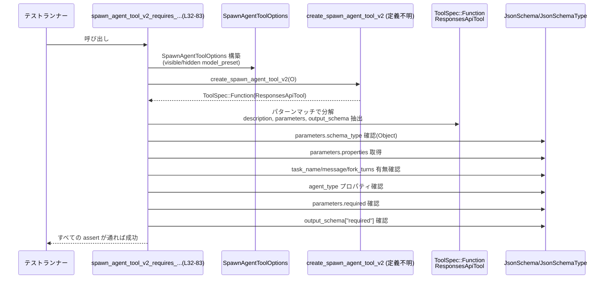

# tools/src/agent_tool_tests.rs コード解説

## 0. ざっくり一言

このファイルは、エージェント関連ツール（`spawn_agent`, `send_message`, `followup_task`, `wait_agent`, `list_agents`）の**JSON Schema 仕様と説明文が期待どおりになっているかを検証するテスト群**です。  
（根拠: `use super::*;` と複数の `create_*_tool` を呼ぶテスト関数定義 `tools/src/agent_tool_tests.rs:L1-287`）

---

## 1. このモジュールの役割

### 1.1 概要

- 親モジュール（`use super::*;`）で定義されている各種ツール生成関数  
  `create_spawn_agent_tool_v1/v2`, `create_send_message_tool`,  
  `create_followup_task_tool`, `create_wait_agent_tool_v2`, `create_list_agents_tool` の出力を検査するテストを提供します。  
  （根拠: `tools/src/agent_tool_tests.rs:L1-8, L32-83, L85-109, L111-149, L151-193, L195-234, L236-286`）
- ツールの `parameters`（入力の JSON Schema）と `output_schema`（出力の JSON Schema）、および `description` 文字列が、**API 契約どおりになっているか**をチェックします。  
  （根拠: `parameters` や `output_schema` へのアクセスと `assert!` 群 `tools/src/agent_tool_tests.rs:L45-82, L95-108, L113-148, L153-192, L197-233, L238-266, L270-286`）
- テスト専用ファイルであり、本番ロジックや公開 API 自体はこのファイルには定義されていません。  
  （根拠: すべての関数が `#[test]` またはテスト用ヘルパ `fn model_preset` であり `pub` が存在しない `tools/src/agent_tool_tests.rs:L10-287`）

### 1.2 アーキテクチャ内での位置づけ

このファイルは、親モジュールが提供する「ツール定義 API」に対する**スキーマ回帰テスト**の役割を持ちます。依存関係を概略図で示すと次のようになります。

```mermaid
graph TD
    subgraph 親モジュール（別ファイル・定義不明）
        A[create_spawn_agent_tool_v1/v2]
        B[create_send_message_tool]
        C[create_followup_task_tool]
        D[create_wait_agent_tool_v2]
        E[create_list_agents_tool]
        O1[SpawnAgentToolOptions]
        O2[WaitAgentTimeoutOptions]
        T[ToolSpec::Function<br/>ResponsesApiTool]
        S[JsonSchema, JsonSchemaType<br/>JsonSchemaPrimitiveType]
    end

    subgraph 本ファイル: agent_tool_tests.rs
        H[model_preset<br/>(テスト用ヘルパ)]
        T1[spawn_agent_tool_v2_requires_...]
        T2[spawn_agent_tool_v1_keeps_...]
        T3[send_message_tool_requires_...]
        T4[followup_task_tool_requires_...]
        T5[wait_agent_tool_v2_uses_...]
        T6[list_agents_tool_includes_...]
        T7[list_agents_tool_status_schema_...]
    end

    H --> A
    T1 --> A
    T2 --> A
    T3 --> B
    T4 --> C
    T5 --> D
    T6 --> E
    T7 --> E

    T1 --> T
    T2 --> T
    T3 --> T
    T4 --> T
    T5 --> T
    T6 --> T
    T7 --> T

    T1 --> S
    T2 --> S
    T3 --> S
    T4 --> S
    T5 --> S
    T6 --> S
    T7 --> S
```

- 親モジュール側の型・関数（`create_*_tool`, `SpawnAgentToolOptions` など）の定義場所は、このチャンクには現れません。  
  （根拠: `use super::*;` のみで具体ファイル名がない `tools/src/agent_tool_tests.rs:L1`）

### 1.3 設計上のポイント

- **ツールは必ず関数ツールであることを前提にテスト**  
  各テストは `let ToolSpec::Function(ResponsesApiTool {...}) = ... else { panic!(...) }` というパターンでツールを取り出し、他のバリアントが返った場合は `panic!` させます。  
  （根拠: `tools/src/agent_tool_tests.rs:L45-53, L95-97, L113-121, L153-161, L197-209, L238-245, L270-274`）
- **JsonSchema 検査に特化**  
  `parameters.schema_type` が Object であること、`properties` のキー有無、`required` 配列の内容、`output_schema` 内の `required` や `properties` の構造を細かく検証します。  
  （根拠: `tools/src/agent_tool_tests.rs:L55-82, L99-108, L123-148, L163-192, L211-233, L247-266, L276-286`）
- **文言も契約の一部としてチェック**  
  `description.contains(...)` やフィールドの `description` 文字列を `assert_eq!` で検査し、仕様の文章レベルまで固定しています。  
  （根拠: `tools/src/agent_tool_tests.rs:L62-65, L134-143, L174-179, L220-222, L255-261`）
- エラー処理はテスト用に `assert!` 系・`expect`・`panic!` のみを利用し、本番コード内のエラー伝播（`Result` / `Option`）はこのファイルには登場しません。  
  （根拠: `assert!`, `assert_eq!`, `.expect`, `panic!` のみが使われている `tools/src/agent_tool_tests.rs:L52-82, L95-108, L122-148, L162-192, L210-233, L246-266, L270-286`）

---

## 2. 主要な機能一覧（＋コンポーネントインベントリー）

### 2.1 機能の概要リスト

- `model_preset`: テスト用の `ModelPreset` インスタンスを簡単に生成するヘルパ関数です。  
  （根拠: `tools/src/agent_tool_tests.rs:L10-30`）
- `spawn_agent_tool_v2_requires_task_name_and_lists_visible_models`: V2 の `spawn_agent` ツールがタスク名必須・モデル表示フィルタなどのスキーマを満たすことを検証します。  
  （根拠: `tools/src/agent_tool_tests.rs:L32-83`）
- `spawn_agent_tool_v1_keeps_legacy_fork_context_field`: V1 の `spawn_agent` がレガシーな `fork_context` フィールドを保持し、新しい `fork_turns` をまだ使わないことを確認します。  
  （根拠: `tools/src/agent_tool_tests.rs:L85-109`）
- `send_message_tool_requires_message_and_has_no_output_schema`: `send_message` ツールの入力スキーマと、出力スキーマが `None` であることを検証します。  
  （根拠: `tools/src/agent_tool_tests.rs:L111-149`）
- `followup_task_tool_requires_message_and_has_no_output_schema`: `followup_task` ツールの入力スキーマと、`interrupt` フラグ説明・出力スキーマなしを検証します。  
  （根拠: `tools/src/agent_tool_tests.rs:L151-193`）
- `wait_agent_tool_v2_uses_timeout_only_summary_output`: `wait_agent` V2 ツールが `timeout_ms` のみをパラメータに持ち、結果としてサマリのみを返すスキーマになっていることを検証します。  
  （根拠: `tools/src/agent_tool_tests.rs:L195-234`）
- `list_agents_tool_includes_path_prefix_and_agent_fields`: `list_agents` ツールの入力 `path_prefix` と出力 `agents` アイテムの必須フィールドを検証します。  
  （根拠: `tools/src/agent_tool_tests.rs:L236-267`）
- `list_agents_tool_status_schema_includes_interrupted`: `list_agents` の出力スキーマに `agent_status` の `enum` として `interrupted` など 5 状態が含まれていることを検証します。  
  （根拠: `tools/src/agent_tool_tests.rs:L270-286`）

### 2.2 関数インベントリー表

| 名前 | 種別 | 役割 / 用途 | 定義行 | 根拠 |
|------|------|------------|--------|------|
| `model_preset` | 非公開関数（ヘルパ） | テストで使用する `ModelPreset` を組み立てる | L10-30 | `tools/src/agent_tool_tests.rs:L10-30` |
| `spawn_agent_tool_v2_requires_task_name_and_lists_visible_models` | `#[test]` 関数 | V2 `spawn_agent` ツールのスキーマ・説明文・モデル一覧表現を検証 | L32-83 | `tools/src/agent_tool_tests.rs:L32-83` |
| `spawn_agent_tool_v1_keeps_legacy_fork_context_field` | `#[test]` 関数 | V1 `spawn_agent` のレガシー `fork_context` フィールド保持と `fork_turns` 非存在を検証 | L85-109 | `tools/src/agent_tool_tests.rs:L85-109` |
| `send_message_tool_requires_message_and_has_no_output_schema` | `#[test]` 関数 | `send_message` ツールの必須パラメータと出力スキーマなしを検証 | L111-149 | `tools/src/agent_tool_tests.rs:L111-149` |
| `followup_task_tool_requires_message_and_has_no_output_schema` | `#[test]` 関数 | `followup_task` ツールの `interrupt` 含むスキーマと出力スキーマなしを検証 | L151-193 | `tools/src/agent_tool_tests.rs:L151-193` |
| `wait_agent_tool_v2_uses_timeout_only_summary_output` | `#[test]` 関数 | `wait_agent` V2 の `timeout_ms` パラメータとサマリのみの出力スキーマを検証 | L195-234 | `tools/src/agent_tool_tests.rs:L195-234` |
| `list_agents_tool_includes_path_prefix_and_agent_fields` | `#[test]` 関数 | `list_agents` の入力 `path_prefix` 説明と出力フィールド必須リストを検証 | L236-267 | `tools/src/agent_tool_tests.rs:L236-267` |
| `list_agents_tool_status_schema_includes_interrupted` | `#[test]` 関数 | `list_agents` の `agent_status` enum に `interrupted` などが含まれることを検証 | L270-286 | `tools/src/agent_tool_tests.rs:L270-286` |

---

## 3. 公開 API と詳細解説

このファイル自体には公開 API はなく、すべてテスト用の内部関数です。ただし、**親モジュールの API 契約を読み解くうえで重要なテスト関数**が複数あります。

### 3.1 型一覧（このファイルで利用する主な型）

このファイル内で利用している主要な型・列挙体（定義は他ファイル/クレート）を整理します。

| 名前 | 種別 | 役割 / 用途 | 定義場所 | 根拠 |
|------|------|------------|----------|------|
| `ModelPreset` | 構造体 | モデル ID や表示名、説明文、推論モード等を含むモデル定義 | `codex_protocol::openai_models`（外部クレート） | `tools/src/agent_tool_tests.rs:L4, L10-30` |
| `ReasoningEffort` | 列挙体 | 推論の「負荷レベル」（Medium など）を表す | `codex_protocol::openai_models` | `tools/src/agent_tool_tests.rs:L5, L16-19` |
| `ReasoningEffortPreset` | 構造体 | `ReasoningEffort` とその説明をまとめたプリセット | `codex_protocol::openai_models` | `tools/src/agent_tool_tests.rs:L6, L17-20` |
| `JsonSchemaType` | 列挙体 | JSON Schema の型（Single など）を表現 | `crate` 内 | `tools/src/agent_tool_tests.rs:L3, L55-56, L99-100, L123-124, L163-164, L211-212, L247-248` |
| `JsonSchemaPrimitiveType` | 列挙体 | JSON のプリミティブ型（Object など）を表現 | `crate` 内 | `tools/src/agent_tool_tests.rs:L2, L56, L100, L124, L164, L212, L248` |
| `JsonSchema` | 構造体 | JSON Schema 1 つ分を表す（`.string(..)` などのコンストラクタを持つ） | `crate` 内 | `tools/src/agent_tool_tests.rs:L72-73` |
| `ToolSpec` | 列挙体と推測 | ツールの仕様を表す型で、少なくとも `Function(ResponsesApiTool)` バリアントを持つ | 親モジュールあるいは crate 内 | `tools/src/agent_tool_tests.rs:L45, L95, L113, L153, L197, L238, L270` |
| `ResponsesApiTool` | 構造体と推測 | 関数ツールの詳細（`description`, `parameters`, `output_schema` など）を持つ | 親モジュールあるいは crate 内 | `tools/src/agent_tool_tests.rs:L45-49, L95, L113-116, L153-156, L197-200, L238-240` |
| `SpawnAgentToolOptions` | 構造体と推測 | `create_spawn_agent_tool_v1/v2` に渡すオプション（利用可能モデル等） | 親モジュール | `tools/src/agent_tool_tests.rs:L34-43, L87-93` |
| `WaitAgentTimeoutOptions` | 構造体と推測 | `create_wait_agent_tool_v2` 用の timeout 設定 | 親モジュール | `tools/src/agent_tool_tests.rs:L202-206` |

> `ToolSpec`, `ResponsesApiTool`, `JsonSchema`, `SpawnAgentToolOptions`, `WaitAgentTimeoutOptions` などの正確な定義は、このチャンクには含まれていません。

### 3.2 関数詳細（重要なテスト 7 件）

#### `spawn_agent_tool_v2_requires_task_name_and_lists_visible_models() -> ()`

**概要**

V2 の `spawn_agent` ツールが次の契約を満たすことを検証します。  
（根拠: `tools/src/agent_tool_tests.rs:L32-83`）

- パラメータは JSON Object 型。
- `task_name` と `message` が必須フィールド。
- `fork_turns` は存在し、`fork_context` は存在しない。
- `agent_type` は `"role help"` の文字列スキーマ。
- モデル一覧の説明には「picker で表示されるモデルのみ」含まれ、隠れたモデルは含まれない。
- 出力スキーマには `task_name` と `nickname` が必須フィールドとして定義される。

**引数**

なし（`#[test]` 関数）。  
（根拠: 関数シグネチャに引数がない `tools/src/agent_tool_tests.rs:L32-33`）

**戻り値**

- 戻り値型は暗黙に `()` で、テスト成功時は何も返しません。  
- 期待が外れると `panic!` / `assert!` によりテストが失敗します。  
  （根拠: `panic!` と `assert!` 群 `tools/src/agent_tool_tests.rs:L52-82`）

**内部処理の流れ**

1. `SpawnAgentToolOptions` を生成し、`available_models` として `model_preset("visible", true)` と `model_preset("hidden", false)` を指定します。  
   （根拠: `tools/src/agent_tool_tests.rs:L34-43`）
2. `create_spawn_agent_tool_v2` を呼び出して `tool` を取得します。  
   （根拠: `tools/src/agent_tool_tests.rs:L34`）
3. `tool` が `ToolSpec::Function(ResponsesApiTool { description, parameters, output_schema, .. })` であるとパターンマッチし、そうでなければ `panic!` します。  
   （根拠: `tools/src/agent_tool_tests.rs:L45-53`）
4. `parameters.schema_type` が `Object` であることを `assert_eq!` で確認します。  
   （根拠: `tools/src/agent_tool_tests.rs:L55-57`）
5. `parameters.properties` を取得し、`task_name`, `message`, `fork_turns` が存在し、`items`, `fork_context` が存在しないことを確認します。  
   （根拠: `tools/src/agent_tool_tests.rs:L58-70`）
6. `agent_type` プロパティが `JsonSchema::string(Some("role help".to_string()))` であることを確認します。  
   （根拠: `tools/src/agent_tool_tests.rs:L71-74`）
7. `parameters.required` が `["task_name", "message"]` になっていることを確認します。  
   （根拠: `tools/src/agent_tool_tests.rs:L75-78`）
8. `description` にいくつかの文言（タスク説明、同じツールを持つこと、visible モデルの表示など）が含まれ、hidden モデルに関する記述がないことを確認します。  
   （根拠: `tools/src/agent_tool_tests.rs:L62-65`）
9. `output_schema["required"]` が `["task_name", "nickname"]` であることを確認します。  
   （根拠: `tools/src/agent_tool_tests.rs:L79-82`）

**Examples（使用例）**

親モジュール側で `create_spawn_agent_tool_v2` を利用してスキーマを確認したい場合、テストのロジックを参考に次のように利用できます。

```rust
// 親モジュール側のコード例（概念的なもの・テストと同様の呼び方）
// use super::*;
// use crate::JsonSchemaPrimitiveType;
// use crate::JsonSchemaType;

let tool = create_spawn_agent_tool_v2(SpawnAgentToolOptions {
    available_models: &[
        model_preset("visible", true),  // picker に表示されるモデル
        model_preset("hidden", false),  // picker には表示されないモデル
    ],
    agent_type_description: "role help".to_string(),
    hide_agent_type_model_reasoning: false,
    include_usage_hint: true,
    usage_hint_text: None,
});

let ToolSpec::Function(ResponsesApiTool { parameters, .. }) = tool else {
    panic!("spawn_agent should be a function tool");
};

assert_eq!(
    parameters.schema_type,
    Some(JsonSchemaType::Single(JsonSchemaPrimitiveType::Object))
);

// properties の中身をアプリ側で利用したり検査したりできる
```

※ このコードのうち `create_spawn_agent_tool_v2` や `SpawnAgentToolOptions` の定義は、このチャンクには現れませんが、テストから同様の使い方が想定されます。  
（根拠: テスト内の呼び出し `tools/src/agent_tool_tests.rs:L34-57`）

**Errors / Panics**

- `create_spawn_agent_tool_v2` が `ToolSpec::Function` 以外のバリアントを返した場合、`panic!("spawn_agent should be a function tool")` で即座にパニックします。  
  （根拠: `tools/src/agent_tool_tests.rs:L45-53`）
- `parameters.properties` が `None` の場合、`.expect("spawn_agent should use object params")` によりパニックします。  
  （根拠: `tools/src/agent_tool_tests.rs:L58-61`）
- 各種 `assert!` / `assert_eq!` が失敗した場合もテストはパニックします。  
  （根拠: `tools/src/agent_tool_tests.rs:L54-82`）

**Edge cases（エッジケース）**

- `available_models` に **picker 非表示のモデル**（`show_in_picker=false`）を含めても、説明文には `visible` モデルのみが記述されるべき、とテストは仮定しています。  
  （根拠: `tools/src/agent_tool_tests.rs:L34-38, L64-65`）
- `parameters.required` が `None` または期待と異なる順番/内容になった場合、このテストは失敗します。  
  （根拠: `tools/src/agent_tool_tests.rs:L75-78`）
- 出力スキーマから `task_name` または `nickname` のどちらかが外された場合もテストが失敗します。  
  （根拠: `tools/src/agent_tool_tests.rs:L79-82`）

**使用上の注意点**

- `description` の文言が細かく検査されているため、**ドキュメントの文言を変更するとテストがすぐ壊れる**点に注意が必要です。  
  （根拠: `description.contains(...)` チェック `tools/src/agent_tool_tests.rs:L62-65`）
- `JsonSchema::string` などのコンストラクタ仕様に変更が入ると、`JsonSchema::string(Some("role help".to_string()))` との比較が通らなくなる可能性があります。  
  （根拠: `tools/src/agent_tool_tests.rs:L71-74`）

---

> 以下の 6 関数についても、同様の観点でポイントのみ整理します（完全なテンプレートは省略しますが、必要であれば詳細展開も可能です）。

#### `spawn_agent_tool_v1_keeps_legacy_fork_context_field()`

- V1 `spawn_agent` ツールが `fork_context` フィールドを保持し、`fork_turns` を持たないことを検証します。  
  （根拠: `tools/src/agent_tool_tests.rs:L85-109`）
- `parameters.schema_type` が Object であることを確認した後、`properties` に `fork_context` が存在し、`fork_turns` が存在しないことを `assert!` しています。  
  （根拠: `tools/src/agent_tool_tests.rs:L98-108`）
- V1/V2 の互換性に関する仕様（新旧フィールドの差）を保証するテストです。

#### `send_message_tool_requires_message_and_has_no_output_schema()`

- `send_message` ツールが `target` と `message` を必須とし、`interrupt` と `items` を持たないことを検証します。  
  （根拠: `tools/src/agent_tool_tests.rs:L111-149`）
- 説明文が `"Send a string message to an existing agent without triggering a new turn."` と **完全一致**することを要求し、`target` の `description` 文字列も同様に検証します。  
  （根拠: `tools/src/agent_tool_tests.rs:L134-143`）
- `output_schema` が `None` であることも検証しており、このツールが値を返さず副作用のみである契約を示しています。  
  （根拠: `tools/src/agent_tool_tests.rs:L148`）

#### `followup_task_tool_requires_message_and_has_no_output_schema()`

- `followup_task` ツールも `target` と `message` を必須とし、加えて `interrupt` フラグを持つことを検証します。  
  （根拠: `tools/src/agent_tool_tests.rs:L151-193`）
- 説明文に「non-root agent へのメッセージ」や「interrupt=false のときはキューされる」といった文言が含まれることを `description.contains(...)` で確認します。  
  （根拠: `tools/src/agent_tool_tests.rs:L174-179`）
- `interrupt` フィールドの `description` が、割り込みの意味とキューイング挙動を詳述していることを要求します。  
  （根拠: `tools/src/agent_tool_tests.rs:L181-186`）
- こちらも `output_schema` は `None` であることを検証しています。  
  （根拠: `tools/src/agent_tool_tests.rs:L192`）

#### `wait_agent_tool_v2_uses_timeout_only_summary_output()`

- `wait_agent` V2 ツールが `targets` パラメータを持たず、`timeout_ms` のみを持つことを検証します。  
  （根拠: `tools/src/agent_tool_tests.rs:L195-234`）
- `timeout_ms` の `description` に、デフォルト値・最小値・最大値が具体的に書かれていることをチェックします。  
  （根拠: `tools/src/agent_tool_tests.rs:L224-227`）
- `description` に「内容は返さず、更新があるエージェントのサマリを返す」といった文が含まれていることを確認します。  
  （根拠: `tools/src/agent_tool_tests.rs:L220-222`）
- 出力スキーマの `properties["message"]["description"]` が `"Brief wait summary without the agent's final content."` であることを要求します。  
  （根拠: `tools/src/agent_tool_tests.rs:L231-233`）

#### `list_agents_tool_includes_path_prefix_and_agent_fields()`

- `list_agents` ツールの入力パラメータとして `path_prefix` が存在することと、その説明文がタスクパスの書式について述べていることを検証します。  
  （根拠: `tools/src/agent_tool_tests.rs:L236-261`）
- 出力スキーマにおいて、`agents` 配列の各要素が `agent_name`, `agent_status`, `last_task_message` の 3 フィールドを必須とすることを検証します。  
  （根拠: `tools/src/agent_tool_tests.rs:L263-266`）

#### `list_agents_tool_status_schema_includes_interrupted()`

- `list_agents` 出力の `agent_status` フィールドに対応する enum 値が  
  `"pending_init"`, `"running"`, `"interrupted"`, `"shutdown"`, `"not_found"` の 5 つであることを検証します。  
  （根拠: `tools/src/agent_tool_tests.rs:L276-285`）
- これは `allOf[0].oneOf[0].enum` 経由でスキーマを検査しており、ステータス表現がスキーマに正しく埋め込まれていることを保証します。  
  （根拠: `tools/src/agent_tool_tests.rs:L276-279`）

### 3.3 その他の関数

| 関数名 | 役割（1 行） | 根拠 |
|--------|--------------|------|
| `model_preset` | テストで使う `ModelPreset` を、ID と picker 表示フラグから組み立てるヘルパです。 | `tools/src/agent_tool_tests.rs:L10-30` |

`model_preset` 内では `ReasoningEffort::Medium` と `ReasoningEffortPreset` を固定で使用しており、テストで必要な最小限の構造を満たしたモデルプリセットを生成しています。  
（根拠: `tools/src/agent_tool_tests.rs:L16-20`）

---

## 4. データフロー

ここでは代表として、`spawn_agent_tool_v2_requires_task_name_and_lists_visible_models`（L32-83）における処理の流れを示します。

### 4.1 シナリオ概要

- テストランナーが `spawn_agent_tool_v2_requires_task_name_and_lists_visible_models` を起動。
- このテストが `SpawnAgentToolOptions` を構築し、`create_spawn_agent_tool_v2` を呼び出して `ToolSpec::Function` を得ます。
- その後、`parameters` と `output_schema` から JSON Schema の情報を読み取り、`assert!` によって契約を検証します。  
  （根拠: `tools/src/agent_tool_tests.rs:L32-82`）

### 4.2 シーケンス図



---

## 5. 使い方（How to Use）

### 5.1 基本的な使用方法（テストの実行）

このファイルは単体テストです。通常の Rust プロジェクトと同様、`cargo test` で実行されます。

```bash
# プロジェクトルートで
cargo test agent_tool_tests
```

- モジュール名やファイル名に応じて、テストフィルタを指定して部分的に実行できます。  
- 各テストは対応する `create_*_tool` 関数の契約を検証します。

### 5.2 よくある使用パターン（テスト追加時）

新しいツール（例: `create_delete_agent_tool`）を追加した場合、同じパターンでテストを書くことができます。

```rust
// 例: 新しいツール delete_agent のスキーマを検証するテスト
#[test]
fn delete_agent_tool_requires_target_and_has_no_output() {
    let ToolSpec::Function(ResponsesApiTool {
        parameters,
        output_schema,
        ..
    }) = create_delete_agent_tool()  // 親モジュールの新関数（定義はこのチャンクにはない）
    else {
        panic!("delete_agent should be a function tool");
    };

    assert_eq!(
        parameters.schema_type,
        Some(JsonSchemaType::Single(JsonSchemaPrimitiveType::Object)),
    );

    let properties = parameters
        .properties
        .as_ref()
        .expect("delete_agent should use object params");

    assert!(properties.contains_key("target"));
    assert_eq!(parameters.required.as_deref(), Some(&["target".to_string()][..]));
    assert_eq!(output_schema, None);
}
```

この例は既存の `send_message` / `followup_task` テストと同じ構造で、**スキーマ検証のテンプレート**として使えます。  
（根拠: 既存テストの構造 `tools/src/agent_tool_tests.rs:L111-149, L151-193`）

### 5.3 よくある間違い

```rust
// 間違い例: ToolSpec のバリアントを確認しない
let tool = create_send_message_tool();
// 直接 parameters フィールドにアクセスしようとするとコンパイルエラー
// let schema_type = tool.parameters.schema_type;

// 正しい例: 必ず ToolSpec::Function にパターンマッチしてから使う
let ToolSpec::Function(ResponsesApiTool { parameters, .. }) = tool else {
    panic!("send_message should be a function tool");
};
let schema_type = parameters.schema_type;
```

- テストコードでも、本番コードでも、`ToolSpec` が複数バリアントを持つ場合は**必ずパターンマッチしてから中身を使う**必要があります。  
  （根拠: 全テストが `ToolSpec::Function(...) = ... else { panic! }` を採用 `tools/src/agent_tool_tests.rs:L45-53, L95-97, L113-121, L153-161, L197-209, L238-245, L270-274`）

### 5.4 使用上の注意点（まとめ）

- このファイルのテストは `description` や `field description` の**文字列まで厳密に検査**しているため、ドキュメント文言の軽微な変更でもテストが落ちます。仕様変更かどうかを意識して更新する必要があります。  
  （根拠: `assert_eq!(description, "...")` や `description.contains(...)` `tools/src/agent_tool_tests.rs:L62-65, L134-137, L174-179, L220-222, L231-233`）
- JSON Schema の構造（`allOf` / `oneOf` / `enum` など）も固定されているため、スキーマ生成ロジックのリファクタリング時にはテストの期待値部分も合わせて更新する必要があります。  
  （根拠: `allOf[0]["oneOf"][0]["enum"]` を直接参照 `tools/src/agent_tool_tests.rs:L276-279`）
- このファイル自体には非同期処理やスレッドは登場せず、Rust の並行性に関する要素はありません。テストはすべて同期実行です。  
  （根拠: `async` やスレッド API 呼び出しが存在しない `tools/src/agent_tool_tests.rs:L1-287`）

---

## 6. 変更の仕方（How to Modify）

### 6.1 新しい機能を追加する場合（新ツールのテスト）

1. 親モジュール（`use super::*;` の対象）に新しいツール生成関数（例: `create_xxx_tool`）とオプション構造体を追加する。  
   （定義場所はこのチャンクには不明）
2. `agent_tool_tests.rs` に `#[test]` 関数を追加し、既存テストと同じように:
   - `let ToolSpec::Function(ResponsesApiTool { parameters, output_schema, .. }) = create_xxx_tool() else { panic!(...) };`
   - `parameters.schema_type` が Object であること。
   - 必須フィールド、任意フィールド、`description`、`output_schema` を必要に応じて検証。  
   （根拠: 既存テストのパターン `tools/src/agent_tool_tests.rs:L45-82, L95-108, L113-148`）
3. `cargo test` を実行し、新たに追加したツールの仕様が期待どおりか確認する。

### 6.2 既存の機能を変更する場合（契約の見直し）

- **影響範囲の確認**

  - `spawn_agent` のスキーマを変更する場合:  
    `spawn_agent_tool_v2_requires_...` と `spawn_agent_tool_v1_keeps_...` の 2 つのテストを確認し、必要であれば期待値を変更します。  
    （根拠: `create_spawn_agent_tool_v1/v2` を使う 2 テスト `tools/src/agent_tool_tests.rs:L32-83, L85-109`）
  - `send_message` / `followup_task` の挙動を変更する場合:  
    対応する 2 テストを確認し、特に `description` と `interrupt` の説明文に注意します。  
    （根拠: `tools/src/agent_tool_tests.rs:L111-149, L151-193`）
  - `wait_agent` / `list_agents` のスキーマ変更時:  
    `wait_agent_tool_v2_uses_timeout_only_summary_output` および 2 つの `list_agents` テストを更新します。  
    （根拠: `tools/src/agent_tool_tests.rs:L195-234, L236-267, L270-286`）

- **契約（前提条件・返り値の意味）の注意点**

  - `send_message` / `followup_task` は `output_schema = None` である契約を前提にしているため、**返り値を追加する場合はテストと外部利用者の両方に影響**します。  
    （根拠: `tools/src/agent_tool_tests.rs:L148, L192`）
  - `wait_agent` は「内容ではなくサマリだけ」を返す仕様を前提にしているため、ここを変えるとクライアント側の UI 仕様にも影響しうることがテストから読み取れます。  
    （根拠: `tools/src/agent_tool_tests.rs:L220-222, L231-233`）
  - `list_agents` の `agent_status` の列挙値変更はステータス扱いの全体仕様に直結します。  
    （根拠: `tools/src/agent_tool_tests.rs:L276-285`）

- **テスト・使用箇所の再確認**

  - スキーマや説明を変えたら、**このファイルの該当テスト**を必ず更新し、`cargo test` で全体の整合性を確認する必要があります。

---

## 7. 関連ファイル

このファイルに密接に関係するのは、`use super::*;` でインポートされる親モジュールおよび外部クレートです。

| パス（推定/実際） | 役割 / 関係 | 根拠 |
|-------------------|------------|------|
| 親モジュール (`super`) | `create_spawn_agent_tool_v1/v2`, `create_send_message_tool`, `create_followup_task_tool`, `create_wait_agent_tool_v2`, `create_list_agents_tool` および `SpawnAgentToolOptions`, `WaitAgentTimeoutOptions`, `ToolSpec`, `ResponsesApiTool`, `JsonSchema` などの定義を提供するモジュール。具体ファイル名はこのチャンクからは分かりません。 | `tools/src/agent_tool_tests.rs:L1, L34-43, L87-93, L113-120, L153-160, L197-209, L238-245, L270-274` |
| `codex_protocol::openai_models` | `ModelPreset`, `ReasoningEffort`, `ReasoningEffortPreset` を提供する外部クレート。`model_preset` ヘルパで利用されています。 | `tools/src/agent_tool_tests.rs:L4-6, L10-30` |
| `serde_json` | `json!` マクロを提供し、`output_schema` などの JSON 値と期待値の比較に使用されています。 | `tools/src/agent_tool_tests.rs:L8, L80-82, L231-233, L264-266, L276-286` |
| `pretty_assertions` | `assert_eq` を上書きし、テスト失敗時に見やすい diff を出力するために用いられています。 | `tools/src/agent_tool_tests.rs:L7, L55-57, L76-78, L80-82, L99-101, L123-125, L145-147, L163-165, L211-213, L247-249, L263-266, L276-286` |

---

### 安全性・エラー・並行性の観点（まとめ）

- **安全性**:  
  - このファイルはテスト専用であり、本番環境に直接影響する副作用は持ちません。  
  - すべての失敗は `panic!` と `assert!` によるテストの停止にとどまります。  
    （根拠: エラー処理が `panic!/assert!/expect` のみ `tools/src/agent_tool_tests.rs:L52, L61, L95-97, L121, L160-161, L208-209, L244-245, L270-274`）
- **エラー処理**:  
  - Rust の `Result` / `Option` によるエラー伝播は本ファイル内にはなく、`Option` は `.as_ref().expect(...)` でテスト用に強制アンラップしています。  
    （根拠: `.as_ref().expect(...)` パターン `tools/src/agent_tool_tests.rs:L59-61, L103-105, L127-129, L167-169, L215-217, L251-253`）
- **並行性**:  
  - 非同期関数やスレッドの使用はなく、並行性に関する特別な配慮は不要です。  
    （根拠: `async` やスレッド関連 API が一切登場しない `tools/src/agent_tool_tests.rs:L1-287`）
