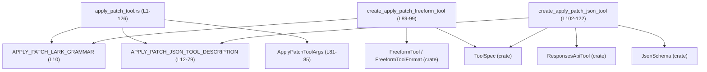
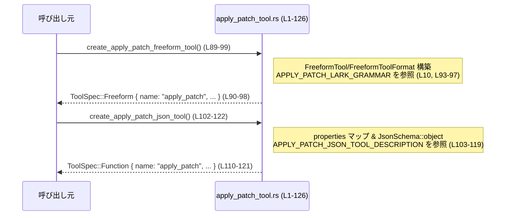

# tools/src/apply_patch_tool.rs

## 0. ざっくり一言

`apply_patch` というファイル編集ツールの **ツール定義（ToolSpec）** を 2 形式（FREEFORM / JSON）で提供するモジュールです。パッチ言語の文法（Lark）と、その使用方法のロングテキスト説明もここで定義されています。  
（根拠: `APPLY_PATCH_LARK_GRAMMAR` 定数と `APPLY_PATCH_JSON_TOOL_DESCRIPTION` 定数の定義 [apply_patch_tool.rs:L10, L12-79]）

---

## 1. このモジュールの役割

### 1.1 概要

- このモジュールは、LLM がファイルを編集するための `apply_patch` ツールを **型安全に構成するためのファクトリ関数** を提供します。  
  - FREEFORM ツール（文法ベース）の定義: `create_apply_patch_freeform_tool` [L87-99]  
  - JSON ツール（function calling スタイル）の定義: `create_apply_patch_json_tool` [L101-122]
- パッチ形式の詳細な仕様（文章）と、形式文法（Lark）の読み込みを一箇所に集約しています。  
  （根拠: 定数と 2 つの関数定義 [apply_patch_tool.rs:L10-79, L87-122]）

### 1.2 アーキテクチャ内での位置づけ

このモジュールは「ツール仕様を構築するレイヤ」に属しており、実際のパッチ適用ロジックは含みません。代わりに、`ToolSpec` / `FreeformTool` / `ResponsesApiTool` など、クレート側で定義された型を使ってツールのメタデータを組み立てています。  
（根拠: 先頭の use 群と `ToolSpec::Freeform` / `ToolSpec::Function` の使用 [apply_patch_tool.rs:L1-5, L89-99, L110-121]）



※ `ToolSpec`, `FreeformTool`, `FreeformToolFormat`, `ResponsesApiTool`, `JsonSchema` はすべて `crate` からインポートされているため、このモジュールはそれらに依存する「上位」レイヤであることが分かります。[apply_patch_tool.rs:L1-5]

### 1.3 設計上のポイント

- **文法と説明の分離**  
  - 文法定義は `tool_apply_patch.lark` ファイルを `include_str!` で取り込み（コンパイル時埋め込み）[L10]  
  - 使用方法やルールは長い文字列定数 `APPLY_PATCH_JSON_TOOL_DESCRIPTION` として保持 [L12-79]
- **ツール形式の二本立て**  
  - FREEFORM: `ToolSpec::Freeform(FreeformTool { ... })` [L89-98]  
  - JSON: `ToolSpec::Function(ResponsesApiTool { ... })` [L110-121]  
  同じ `apply_patch` 名を持つツールを 2 つの表現で提供しています。
- **引数型の明示**  
  - JSON ツール側の引数として `ApplyPatchToolArgs { input: String }` を定義（`serde` 対応）[L81-85]。このファイル内ではまだ利用箇所は見えません。
- **状態を持たない**  
  - すべての API は純粋な関数であり、グローバル可変状態はありません。関数は毎回新しい `ToolSpec` を構築して返すだけです。[L89-99, L102-122]
- **エラーハンドリング方針**  
  - API はすべて `Result` を返さず、`panic!` の可能性がある操作も見当たりません（`to_string` や `BTreeMap::from` は通常 panic しない）ため、生成処理は基本的に失敗しない設計です。

---

## 2. コンポーネント一覧と主要な機能

### 2.1 コンポーネントインベントリー（構造体・定数・関数）

| 名前 | 種別 | 公開性 | 定義行 | 役割 / 用途 |
|------|------|--------|--------|-------------|
| `APPLY_PATCH_LARK_GRAMMAR` | 定数 `&'static str` | モジュール内のみ（非 pub） | L10 | パッチ言語の Lark 文法を `tool_apply_patch.lark` から埋め込んだ文字列 [L10] |
| `APPLY_PATCH_JSON_TOOL_DESCRIPTION` | 定数 `&'static str` | モジュール内のみ | L12-79 | パッチ言語の仕様と使用上の注意点を説明する長文テキスト [L12-79] |
| `ApplyPatchToolArgs` | 構造体 | `pub` | L81-85 | JSON ツール呼び出し用の引数。`input: String` フィールドのみを持つ [L83-84] |
| `create_apply_patch_freeform_tool` | 関数 | `pub` | L89-99 | FREEFORM 形式（grammar ベース）で `apply_patch` ツールの `ToolSpec` を構築して返す [L89-98] |
| `create_apply_patch_json_tool` | 関数 | `pub` | L102-122 | JSON function 形式で `apply_patch` ツールの `ToolSpec` を構築して返す [L102-121] |
| `tests` モジュール | モジュール | cfg(test) 時のみ | L124-126 | テストコードを `apply_patch_tool_tests.rs` から読み込む [L124-126] |

### 2.2 主要な機能一覧

- `apply_patch` FREEFORM ツール定義: Lark 文法を用いた grammar ベースのカスタムツールを `ToolSpec` として提供する [L10, L89-99]  
- `apply_patch` JSON ツール定義: `input` プロパティを持つ JSON function ツールを `ToolSpec` として提供する [L102-121]  
- パッチ言語仕様の説明テキスト: パッチフォーマットや安全上のルール（相対パスのみ、新規行は `+` で始める等）を人間・モデル向けに提示する [L12-79]  
- JSON 引数型の宣言: `ApplyPatchToolArgs { input: String }` によるシリアライズ可能な引数型の定義 [L81-85]

---

## 3. 公開 API と詳細解説

### 3.1 型一覧（構造体・定数）

#### 構造体

| 名前 | 種別 | フィールド | 役割 / 用途 | 定義行 |
|------|------|------------|-------------|--------|
| `ApplyPatchToolArgs` | 構造体（`pub`） | `pub input: String` | JSON ツールで受け取る `apply_patch` コマンド全体を格納するための引数型。`serde` でシリアライズ/デシリアライズ可能。 | L81-85 |

詳細:

- `#[derive(Debug, Clone, PartialEq, Eq, Serialize, Deserialize)]` により、デバッグ出力、クローン、等価比較、`serde` によるシリアライズ/デシリアライズに対応しています。[apply_patch_tool.rs:L82]
- このファイル内には、この型を実際に利用しているコードはありません。この構造体がどこから使われているかは、このチャンクだけでは分かりません。

#### 定数

| 名前 | 種別 | 内容の概要 | 定義行 |
|------|------|------------|--------|
| `APPLY_PATCH_LARK_GRAMMAR` | `&'static str` | `tool_apply_patch.lark` の内容をそのまま埋め込んだ文字列。[L10] 文法の詳細はこのチャンクには含まれていません。 | L10 |
| `APPLY_PATCH_JSON_TOOL_DESCRIPTION` | `&'static str` | パッチフォーマットのハイレベルな説明、ヘッダー形式、ハンク形式、注意点などを含む長文。[L12-79] | L12-79 |

`APPLY_PATCH_JSON_TOOL_DESCRIPTION` から読み取れる主な仕様（抜粋・要約）:

- パッチ全体は `*** Begin Patch` と `*** End Patch` に囲まれる [L15-17]  
- 操作は 3 種類: Add / Delete / Update [L23-25]  
- オプションで `*** Move to: <new path>` によるリネーム [L27]  
- 各 hunk は `@@` から始まり、その中の行は `" "` / `-` / `+` のいずれかで始まる [L50-59]  
- 例として、複数ファイルの追加・更新・削除を組み合わせたパッチが示されている [L61-72]  
- 重要なルール:  
  - Add/Delete/Update いずれかのヘッダーは必須 [L76]  
  - 新しい行は `+` で始める（新規ファイルでも同様）[L77]  
  - ファイルパスは相対パスのみ許可、絶対パスは禁止 [L78]

### 3.2 関数詳細

#### `create_apply_patch_freeform_tool() -> ToolSpec`

**概要**

- Lark 文法ベースの FREEFORM ツールとして `apply_patch` を定義した `ToolSpec` を構築して返します。[apply_patch_tool.rs:L87-99]  
- このツールは「パッチを JSON でラップしない」ことを説明文で明示しています。[L92-93]

**引数**

- ありません。

**戻り値**

- `ToolSpec`  
  - 具体的には `ToolSpec::Freeform(FreeformTool { ... })` が返されます。[L90-98]  
  - `FreeformTool` のフィールド:
    - `name: "apply_patch".to_string()` [L91]
    - `description`: FREEFORM ツールであり、パッチを JSON でラップしないよう注意を促す文 [L92-93]
    - `format: FreeformToolFormat { r#type: "grammar", syntax: "lark", definition: APPLY_PATCH_LARK_GRAMMAR.to_string() }` [L93-97]

**内部処理の流れ**

1. `FreeformTool` 構造体リテラルを生成  
   - 固定文字列 `"apply_patch"` と説明文を `String` に変換 [L91-93]  
   - `FreeformToolFormat` を `"grammar"` / `"lark"` / `APPLY_PATCH_LARK_GRAMMAR.to_string()` で構築 [L93-97]
2. それを `ToolSpec::Freeform(...)` でラップして返します [L90, L98]。

処理は完全に定数とリテラルからの構築であり、ループや条件分岐はありません。

**Examples（使用例）**

このファイルと同じモジュール内から呼び出す例です（モジュールパスは省略します）。

```rust
// apply_patch_tool.rs と同じクレート内のどこかから
use crate::apply_patch_tool::create_apply_patch_freeform_tool; // モジュールパスはプロジェクト構成に依存します

fn register_tools() {
    // FREEFORM 形式の apply_patch ツール仕様を取得する
    let apply_patch_spec = create_apply_patch_freeform_tool();

    // 返ってきた ToolSpec を、ツール登録用の仕組みに渡す（詳細はこのチャンクには現れません）
    // register_tool(apply_patch_spec);
}
```

※ `register_tool` のような関数はこのチャンクには存在しないため、上記はあくまで典型的な利用イメージです。

**Errors / Panics**

- この関数内で `Result` や `Option` は使用されておらず、明示的なエラー分岐や `panic!` もありません。[L89-98]
- `to_string()` は通常 heap アロケーションに失敗しない限り panic しないため、現実的には「常に成功する初期化関数」とみなせます。

**Edge cases（エッジケース）**

- 引数がないため、入力に関するエッジケースはありません。
- 返す `ToolSpec` の内容も固定であり、呼び出すタイミングや回数によって内容が変わることはありません。

**使用上の注意点**

- **FREEFORM 専用**  
  説明文に「This is a FREEFORM tool, so do not wrap the patch in JSON.」と明記されているため、このツールを使うモデルには「生のパッチテキスト（JSON ではなく）」を生成させる前提となります。[L92-93]
- **文法の変更点**  
  文法定義は `tool_apply_patch.lark` から読み込まれるため（`include_str!`）、文法を変更したい場合はこのファイルではなく `tool_apply_patch.lark` を編集する必要があります。[L10]
- **スレッド安全性**  
  グローバル状態を変更せず、新しい `ToolSpec` を返すだけの純粋関数のため、複数スレッドから同時に呼び出しても問題はありません。

#### `create_apply_patch_json_tool() -> ToolSpec`

**概要**

- JSON function calling 形式で `apply_patch` ツールを定義した `ToolSpec` を構築して返します。[L101-122]  
- 引数は `input` プロパティのみを持ち、「apply_patch コマンドの内容全体」を文字列として渡す設計になっています。[L103-107]

**引数**

- ありません。

**戻り値**

- `ToolSpec`  
  - 具体的には `ToolSpec::Function(ResponsesApiTool { ... })` が返されます。[L110-121]
  - 主なフィールド:
    - `name: "apply_patch".to_string()` [L111]
    - `description: APPLY_PATCH_JSON_TOOL_DESCRIPTION.to_string()` [L112]
    - `strict: false` [L113]
    - `defer_loading: None` [L114]
    - `parameters: JsonSchema::object(...)` [L115-119]
      - `properties`: `input` プロパティのみ [L103-108]
      - 必須プロパティ: `"input"` [L116-117]
      - 第 3 引数 `Some(false.into())` は何らかのオプションですが、意味はこのチャンクからは読み取れません。
    - `output_schema: None` [L120-121]

**内部処理の流れ**

1. `properties` マップの構築 [L103-108]  
   - キー `"input"`  
   - 値は `JsonSchema::string(Some("The entire contents of the apply_patch command".to_string()))`  
     → `input` が「apply_patch コマンド全体を表す文字列」であることをスキーマレベルで表現。
2. `JsonSchema::object(properties, Some(vec!["input".to_string()]), Some(false.into()))` を呼び出し、オブジェクトスキーマを構築 [L115-119]。
3. それを利用して `ResponsesApiTool { ... }` を作り、`ToolSpec::Function(...)` でラップして返す [L110-121]。

**Examples（使用例）**

```rust
use crate::apply_patch_tool::create_apply_patch_json_tool; // モジュールパスはプロジェクト構成に依存します

fn register_tools() {
    // JSON function 形式の apply_patch ツール仕様を取得する
    let apply_patch_json_spec = create_apply_patch_json_tool();

    // これを function calling 対応モデルのツール定義として登録する
    // register_tool(apply_patch_json_spec);
}
```

**Errors / Panics**

- FREEFORM 版と同様に、明示的なエラーハンドリングや `panic!` はありません。[L102-121]
- `BTreeMap::from` や `to_string()` も正常系では panic しない前提です。

**Edge cases（エッジケース）**

- この関数はあくまで **スキーマを返すだけ** であり、ツール呼び出し時に `input` が空文字列であったり、不正なパッチであったりしても、このレベルでは何も検証しません。
  - そのような検証は「ツールを実行する側」（別ファイルのロジック）で行われるはずですが、このチャンクにはその実装は現れていません。

**使用上の注意点**

- **`input` プロパティは必須**  
  `JsonSchema::object` の第 2 引数に `Some(vec!["input".to_string()])` を渡しており、`input` が必須フィールドである契約になっています。[L116-117]
- **説明文が契約を表現**  
  `APPLY_PATCH_JSON_TOOL_DESCRIPTION` には「ヘッダーは必須」「新行は `+` で始める」「絶対パスは禁止」などのルールが明記されており、これはツール呼び出し時にモデルが守るべき契約です。[L76-78]  
  ただし、この関数自体はそれを静的テキストとして与えるだけで、遵守チェックは行っていません。
- **モデル適用範囲**  
  コメントに「Should only be used with gpt-oss models」とあり、この JSON ツールが特定のモデル群向けであることが示唆されていますが、具体的な理由はこのチャンクからは分かりません。[L101]

### 3.3 その他の関数

- このファイルには他の補助関数やラッパー関数は存在しません。[L1-126 を通覧]

---

## 4. データフロー（代表的なシナリオ）

ここでは「外部の呼び出し元が FREEFORM ツール定義を取得して利用する」ケースを例に、データフローを示します。



要点:

- 両関数とも **外部入力を取らず**、モジュール内部の定数（文法・説明）とリテラルから `ToolSpec` を構築して返します。[L10, L12-79, L89-99, L102-121]
- 実際にパッチが解釈・適用されるのは、この `ToolSpec` を利用する **別のコンポーネント** 側であり、このモジュールにはその処理は含まれていません。

---

## 5. 使い方（How to Use）

### 5.1 基本的な使用方法

FREEFORM ツールと JSON ツールを両方登録する想定の簡単な例です。

```rust
// モジュールパスはプロジェクト構成に依存します。
// ここでは仮に `crate::apply_patch_tool` にあると仮定した呼び出し例を示します。
use crate::apply_patch_tool::{
    create_apply_patch_freeform_tool,
    create_apply_patch_json_tool,
};

fn setup_tools() {
    // FREEFORM 版 apply_patch ツールを取得
    let freeform_spec = create_apply_patch_freeform_tool(); // L89-99

    // JSON 版 apply_patch ツールを取得
    let json_spec = create_apply_patch_json_tool();         // L102-122

    // それぞれをツールレジストリに登録する（レジストリの実装はこのチャンクには現れません）
    // tool_registry.register(freeform_spec);
    // tool_registry.register(json_spec);
}
```

このコードにより、呼び出し元は `apply_patch` ツールを 2 形態で利用できるようになります。

### 5.2 よくある使用パターン

1. **最新モデル向けに FREEFORM ツールを使う**  
   - コメントに「Well-suited for GPT-5 models」と書かれているため、FREEFORM ツールはより高度なモデル向けの利用を想定しています。[L87]  
   - モデルに Lark 文法に従ったパッチテキストを直接生成させます。

2. **function calling 対応モデル向けに JSON ツールを使う**  
   - JSON ツールは `input` という 1 つの文字列プロパティを持ち、この中にパッチテキスト全体を入れる設計です。[L103-107]  
   - モデルには `"input"` フィールドを必須として生成させます。[L116-117]

3. **FREEFORM と JSON を併用する**  
   - 同じ `"apply_patch"` 名で 2 つの `ToolSpec` を用意し、モデル特性に応じてどちらを有効にするか切り替えるといった運用が考えられます。  
   - 切り替えロジック自体はこのチャンクには含まれていません。

### 5.3 よくある間違い（想定できるもの）

コードと説明文から、起こり得る誤用をいくつか挙げます。

```rust
// 誤り例: FREEFORM ツールで JSON を渡してしまう
let spec = create_apply_patch_freeform_tool();
// モデルに {"input": "..."} といった JSON を生成させる → 説明文と矛盾

// 正しい方向性: FREEFORM ツールでは JSON ではなく生のパッチテキストを生成させる
// 例: "*** Begin Patch\n*** Update File: src/main.rs\n..." のような文字列
```

- FREEFORM ツールで **パッチを JSON に包む**  
  - 説明文で「do not wrap the patch in JSON」と明記しているため、JSON で渡すとツール側が期待するフォーマットと食い違う可能性があります。[L92-93]
- **絶対パスを使う**  
  - 説明文で「File references can only be relative, NEVER ABSOLUTE.」と書かれており、絶対パスは契約違反です。[L78]  
  - このモジュールにはそのチェックはなく、実際に拒否されるかどうかはツール実行側の実装依存です。
- **新しい行に `+` を付け忘れる**  
  - 新規ファイルでも追加行は `+` を付ける必要があると説明されています。[L23, L77]

### 5.4 使用上の注意点（まとめ）

- **安全性に関する注意**  
  - 説明文は「ファイル参照は相対パスのみ」「絶対パス禁止」といった安全上のルールを含みますが、このモジュール自体はそれを検証しません。[L78]  
    → 実際の適用ロジック側でこれらのルールを守る実装が必要です。
- **エラー挙動**  
  - このモジュール内の API はエラーを返さないため、ツール定義の構築時に失敗することはほぼありません。[L89-99, L102-121]  
  - 逆に言えば、ツール定義の不整合（例えば文法ファイルと説明文の不一致）はコンパイル時/起動時ではなく、実行時に問題として表面化する可能性があります。
- **性能面**  
  - 関数はどちらも 1 回の呼び出しで固定の `ToolSpec` を構築するだけで、外部 I/O やループはありません。[L89-99, L102-121]  
  - ツール登録時に一度だけ呼び出すような利用であれば、性能上の問題になることは考えにくいです。
- **並行性**  
  - グローバル可変状態にアクセスしない純粋関数であり、`APPLY_PATCH_*` 定数は読み取り専用の `'static` 文字列です。[L10, L12-79, L89-99, L102-121]  
  - そのため、マルチスレッド環境でこれらの関数を同時に呼び出してもデータ競合は発生しません。

---

## 6. 変更の仕方（How to Modify）

### 6.1 新しい機能を追加する場合

例: `apply_patch` ツールに追加のパラメータ（例: ドライランフラグ）を持たせたい場合。

1. **引数型を拡張する**  
   - `ApplyPatchToolArgs` に新しいフィールドを追加する。例えば:  

     ```rust
     #[derive(Debug, Clone, PartialEq, Eq, Serialize, Deserialize)]
     pub struct ApplyPatchToolArgs {
         pub input: String,
         pub dry_run: bool, // 新フィールド（例）
     }
     ```  

     （現状の定義は 1 フィールドのみ [L81-85]）
   - ただし、この構造体がどこで使われているかはこのチャンクには現れないため、利用箇所を検索して追従変更が必要です。

2. **JSON スキーマを更新する**  
   - `create_apply_patch_json_tool` 内で `properties` に新しいプロパティを追加し、必要なら必須フィールドのリストにも加えます。[L103-108, L116-117]

3. **説明文を更新する**  
   - 新しい挙動（例: ドライラン）がパッチ言語の仕様に影響するなら、`APPLY_PATCH_JSON_TOOL_DESCRIPTION` に説明を追加する必要があります。[L12-79]

4. **テストを追加 / 更新する**  
   - `mod tests;` から読み込まれる `apply_patch_tool_tests.rs` に、新しいスキーマやフィールドに対応したテストを追加することが望ましいです。[L124-126]  
   - テストの具体的な内容はこのチャンクからは分かりません。

### 6.2 既存の機能を変更する場合

- **文法ファイルを変更する場合**  
  - `APPLY_PATCH_LARK_GRAMMAR` は `include_str!("tool_apply_patch.lark")` によって埋め込まれています。[L10]  
  - 文法を変えるときは `tool_apply_patch.lark` 側の内容を変更し、ここでの `definition: APPLY_PATCH_LARK_GRAMMAR.to_string()` [L96-97] はそのまま利用できます。
- **説明文の変更**  
  - パッチ仕様自体を変える場合、`APPLY_PATCH_JSON_TOOL_DESCRIPTION` のテキストを変更します。[L12-79]  
  - FREEFORM ツールの `description`（「JSON でラップしない」旨）[L92-93] との整合性も確認する必要があります。
- **ツール名の変更**  
  - 現在、両方のツールで `name: "apply_patch"` をハードコードしています。[L91, L111]  
  - これを変更する場合、ツールを利用する全ての呼び出し側も一緒に更新する必要があります。このチャンクでは呼び出し側は分かりません。
- **契約の維持**  
  - JSON スキーマの必須プロパティ `"input"` [L116-117] を変更する場合、これまでのクライアントコードが破壊されないか検討する必要があります。
- **テストの追従**  
  - 既存の機能を変更したら、`apply_patch_tool_tests.rs` のテストが依然として妥当か確認し、必要に応じて修正します。[L124-126]

---

## 7. 関連ファイル

| パス / モジュール | 役割 / 関係 |
|------------------|------------|
| `tools/src/tool_apply_patch.lark` | `APPLY_PATCH_LARK_GRAMMAR` が `include_str!("tool_apply_patch.lark")` で読み込む文法定義ファイル。パッチ言語の正式な文法が記述されているはずですが、このチャンクには内容は現れません。[apply_patch_tool.rs:L10] |
| `tools/src/apply_patch_tool_tests.rs` | `#[cfg(test)]` 付きで `mod tests;` から参照されるテストコード。`apply_patch` ツール定義に対するテストが含まれていると推測されますが、具体的なテスト内容はこのチャンクには現れません。[apply_patch_tool.rs:L124-126] |
| `crate::FreeformTool` / `crate::FreeformToolFormat` | FREEFORM ツールを表す型。`create_apply_patch_freeform_tool` で使用されていますが、定義は別モジュールです。[apply_patch_tool.rs:L1-2, L89-98] |
| `crate::ToolSpec` | ツール定義の共通ラッパー型。FREEFORM/Function 両方で利用。[apply_patch_tool.rs:L5, L89-99, L110-121] |
| `crate::ResponsesApiTool` / `crate::JsonSchema` | JSON function ツールとその引数スキーマを表す型。`create_apply_patch_json_tool` 内で使用。[apply_patch_tool.rs:L3-4, L102-121] |

このチャンクから分かるのは、`apply_patch_tool.rs` が **文法ファイル** と **ツールテスト** に直接結びついていること、およびクレート内のツール関連型に依存していることです。それ以外の呼び出し元や適用ロジックは、このチャンクには現れていません。
