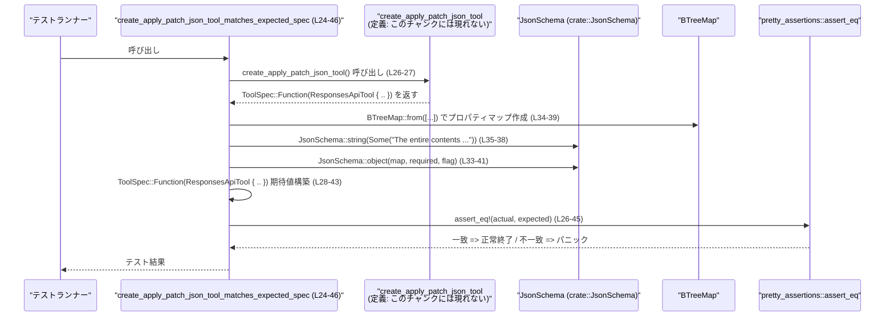

# tools/src/apply_patch_tool_tests.rs コード解説

## 0. ざっくり一言

`apply_patch` ツール用の 2 種類のツール定義（FREEFORM / JSON）が、期待どおりの `ToolSpec` を返しているかを `assert_eq!` で検証するテストファイルです。[apply_patch_tool_tests.rs:L6-22][apply_patch_tool_tests.rs:L24-46]

---

## 1. このモジュールの役割

### 1.1 概要

- このモジュールは、親モジュールで定義されている以下の 2 つの関数が  
  **正しい仕様のツール定義 (`ToolSpec`) を返すこと** をテストします。[apply_patch_tool_tests.rs:L7-10][apply_patch_tool_tests.rs:L25-28]
  - `create_apply_patch_freeform_tool`
  - `create_apply_patch_json_tool`
- テストは、期待される `ToolSpec` インスタンスをこのファイル側で構築し、関数の戻り値と厳密に比較します。[apply_patch_tool_tests.rs:L8-21][apply_patch_tool_tests.rs:L26-45]

### 1.2 アーキテクチャ内での位置づけ

このファイルはテスト専用であり、親モジュールの実装に対する回帰テストとして機能しています。

依存関係のイメージは次の通りです。

```mermaid
graph TD
    subgraph 親モジュール（パスはこのチャンクからは不明）
        A[create_apply_patch_freeform_tool<br/>create_apply_patch_json_tool]
        B[ToolSpec / FreeformTool /<br/>FreeformToolFormat / ResponsesApiTool]
        C[APPLY_PATCH_LARK_GRAMMAR<br/>APPLY_PATCH_JSON_TOOL_DESCRIPTION]
    end

    subgraph テストモジュール<br/>tools/src/apply_patch_tool_tests.rs
        T1[create_apply_patch_freeform_tool_matches_expected_spec (L6-22)]
        T2[create_apply_patch_json_tool_matches_expected_spec (L24-46)]
    end

    T1 --> A
    T2 --> A
    T1 -. 使用 .-> B
    T2 -. 使用 .-> B
    T1 -. 使用 .-> C
    T2 -. 使用 .-> C

    T2 --> D[crate::JsonSchema]
    T2 --> E[std::collections::BTreeMap]
    T1 & T2 --> F[pretty_assertions::assert_eq]
```

- `use super::*;` により、親モジュールからツール定義関連の型・関数・定数を一括インポートしています。[apply_patch_tool_tests.rs:L1]
- JSON ツールのテストでは、`JsonSchema` と `BTreeMap` を使ってパラメータスキーマを構築しています。[apply_patch_tool_tests.rs:L2][apply_patch_tool_tests.rs:L33-41]
- 両テストとも `pretty_assertions::assert_eq` を使用しており、テスト失敗時に差分が見やすく表示されます。[apply_patch_tool_tests.rs:L3][apply_patch_tool_tests.rs:L8][apply_patch_tool_tests.rs:L26]

### 1.3 設計上のポイント

- **仕様を値で固定**  
  ツール仕様をその場で構造体リテラルとして構築し、関数の戻り値と完全一致を要求することで、  
  ツール仕様の変更があれば必ずテストが壊れるようになっています。[apply_patch_tool_tests.rs:L10-21][apply_patch_tool_tests.rs:L28-45]
- **FREEFORM ツールと JSON ツールをそれぞれ独立に検証**  
  FREEFORM 用・JSON 用のツール仕様を別々のテスト関数で検証し、片方だけが壊れた場合でも原因を特定しやすい構成です。[apply_patch_tool_tests.rs:L6-22][apply_patch_tool_tests.rs:L24-46]
- **安全性・並行性**  
  - `unsafe` ブロックは存在せず、Rust の安全な機能のみで記述されています。[apply_patch_tool_tests.rs:L1-46]
  - 並行・非同期処理は含まれておらず、各テストは同期的に評価されます。[apply_patch_tool_tests.rs:L6-22][apply_patch_tool_tests.rs:L24-46]
- **エラーハンドリング**  
  - テスト失敗時は `assert_eq!` によるパニック（テスト失敗）で表現されます。[apply_patch_tool_tests.rs:L8][apply_patch_tool_tests.rs:L26]
  - その他の `Result` などによるエラー処理はこのファイルには登場しません。[apply_patch_tool_tests.rs:L1-46]

---

## 2. 主要な機能一覧

このファイルで提供されている（定義されている）機能は、2 つのテスト関数です。

- `create_apply_patch_freeform_tool_matches_expected_spec`:  
  FREEFORM（grammar/lark ベース）な `apply_patch` ツールの仕様が期待どおりか検証するテスト。[apply_patch_tool_tests.rs:L6-22]
- `create_apply_patch_json_tool_matches_expected_spec`:  
  JSON Function ツール版の `apply_patch` が、期待どおりの `ToolSpec::Function` と JSON スキーマを持つか検証するテスト。[apply_patch_tool_tests.rs:L24-46]

### 2.1 コンポーネント一覧（このファイルで定義・使用されるもの）

| 名前 | 種別 | 役割 / 用途 | 定義/出所 | 根拠 |
|------|------|-------------|-----------|------|
| `create_apply_patch_freeform_tool_matches_expected_spec` | 関数（テスト） | FREEFORM ツール仕様が期待どおりかを検証 | このファイルで定義 | apply_patch_tool_tests.rs:L6-22 |
| `create_apply_patch_json_tool_matches_expected_spec` | 関数（テスト） | JSON ツール仕様が期待どおりかを検証 | このファイルで定義 | apply_patch_tool_tests.rs:L24-46 |
| `create_apply_patch_freeform_tool` | 関数 | FREEFORM ツールの `ToolSpec` を返す（テスト対象） | 親モジュール（このチャンクには定義無し） | 呼び出し: apply_patch_tool_tests.rs:L8-9 |
| `create_apply_patch_json_tool` | 関数 | JSON ツールの `ToolSpec` を返す（テスト対象） | 親モジュール（このチャンクには定義無し） | 呼び出し: apply_patch_tool_tests.rs:L26-27 |
| `ToolSpec` | 列挙体と推測される型 | ツール仕様の表現。`Freeform` / `Function` などのバリアントを持つ | 親モジュール（このチャンクには定義無し） | 使用: apply_patch_tool_tests.rs:L10,L28 |
| `FreeformTool` | 構造体 | FREEFORM ツール仕様の詳細（名前・説明・フォーマット） | 親モジュール（このチャンクには定義無し） | 使用: apply_patch_tool_tests.rs:L10-19 |
| `FreeformToolFormat` | 構造体 | FREEFORM ツールのフォーマット情報（`type`, `syntax`, `definition`） | 親モジュール（このチャンクには定義無し） | 使用: apply_patch_tool_tests.rs:L15-19 |
| `ResponsesApiTool` | 構造体 | JSON Function ツール仕様（名前・説明・strict など） | 親モジュール（このチャンクには定義無し） | 使用: apply_patch_tool_tests.rs:L28-43 |
| `APPLY_PATCH_LARK_GRAMMAR` | 定数 | FREEFORM ツール用 Lark 文法定義 | 親モジュール（このチャンクには定義無し） | 使用: apply_patch_tool_tests.rs:L18 |
| `APPLY_PATCH_JSON_TOOL_DESCRIPTION` | 定数 | JSON ツールの説明文 | 親モジュール（このチャンクには定義無し） | 使用: apply_patch_tool_tests.rs:L30 |
| `JsonSchema` | 型（おそらく構造体または列挙体） | JSON スキーマ定義のユーティリティ。`object`・`string` メソッドを提供 | `crate::JsonSchema` として別モジュールからインポート | インポート: apply_patch_tool_tests.rs:L2, 使用: L33-38 |
| `BTreeMap` | 構造体 | プロパティ名とスキーマのマッピング構築に使用 | `std::collections::BTreeMap` | インポート: apply_patch_tool_tests.rs:L4, 使用: L33-39 |
| `assert_eq` | マクロ | 期待値と実際の値の比較。テスト失敗時にパニック | `pretty_assertions::assert_eq` | インポート: apply_patch_tool_tests.rs:L3, 使用: L8,L26 |

> 備考: `ToolSpec` や `JsonSchema` の正確な定義（フィールド・バリアント）は、このチャンクには含まれていません。

---

## 3. 公開 API と詳細解説

このファイルはテスト専用であり、ライブラリ利用者が直接呼び出す公開 API は定義していません。[apply_patch_tool_tests.rs:L1-46]  
ここでは、「テストが何を保証しているか」という観点で 2 つのテスト関数を詳細に説明します。

### 3.1 型一覧（構造体・列挙体など）

このファイル内で新たに定義されている型はありません。[apply_patch_tool_tests.rs:L1-46]

外部の主要な型の利用状況のみ整理します。

| 名前 | 種別 | 役割 / 用途 | 根拠 |
|------|------|-------------|------|
| `ToolSpec` | 列挙体と推測される型 | ツール仕様のトップレベル表現。`Freeform` / `Function` といったバリアントでツール種別を表現。 | 使用: apply_patch_tool_tests.rs:L10,L28 |
| `FreeformTool` | 構造体 | FREEFORM ツールの詳細（`name`, `description`, `format`）を保持。 | 使用: apply_patch_tool_tests.rs:L10-19 |
| `FreeformToolFormat` | 構造体 | FREEFORM ツールのフォーマット情報（`type`, `syntax`, `definition`）を保持。 | 使用: apply_patch_tool_tests.rs:L15-19 |
| `ResponsesApiTool` | 構造体 | JSON Function ツールの詳細（`name`, `description`, `strict`, `defer_loading`, `parameters`, `output_schema`）を保持。 | 使用: apply_patch_tool_tests.rs:L28-43 |
| `JsonSchema` | 型 | JSON スキーマ定義のためのビルダ（`object`・`string` メソッド）として利用。 | 使用: apply_patch_tool_tests.rs:L33-38 |

> これらの型の定義そのもの（フィールド型・メソッドのシグネチャ）は、このチャンクには含まれていません。

### 3.2 関数詳細

#### `create_apply_patch_freeform_tool_matches_expected_spec()`

**概要**

- 親モジュールの `create_apply_patch_freeform_tool` が返す `ToolSpec` が、  
  `ToolSpec::Freeform(FreeformTool { ... })` という期待値と完全一致することを検証するテストです。[apply_patch_tool_tests.rs:L6-21]

**引数**

- 引数はありません（`fn f()` 形式）。[apply_patch_tool_tests.rs:L7]

**戻り値**

- 戻り値の型は `()`（ユニット）です。テスト関数のため、値を返さず、成功/失敗のみを表現します。[apply_patch_tool_tests.rs:L6-22]

**内部処理の流れ**

1. `create_apply_patch_freeform_tool()` を呼び出し、その戻り値を取得します。[apply_patch_tool_tests.rs:L8-9]
2. 期待される `ToolSpec` を、その場で構造体リテラルとして構築します。[apply_patch_tool_tests.rs:L10-20]
   - `ToolSpec::Freeform(FreeformTool { ... })` を生成。[apply_patch_tool_tests.rs:L10]
   - `name: "apply_patch".to_string()` とし、ツール名が `"apply_patch"` であることを期待。[apply_patch_tool_tests.rs:L11]
   - `description` には、FREEFORM ツールであることと JSON でラップしない旨を説明する英語文字列を設定。[apply_patch_tool_tests.rs:L12-14]
   - `format` には `FreeformToolFormat` を設定し、`type: "grammar"`, `syntax: "lark"`, `definition: APPLY_PATCH_LARK_GRAMMAR.to_string()` を期待。[apply_patch_tool_tests.rs:L15-19]
3. `pretty_assertions::assert_eq!` を使い、関数の戻り値と期待 `ToolSpec` の等価性をチェックします。[apply_patch_tool_tests.rs:L8-21]
4. 両者が等しければテストは成功し、等しくなければパニック（テスト失敗）になります。[apply_patch_tool_tests.rs:L8-21]

**Examples（使用例）**

これはテスト関数なので、通常コードから呼び出すことはありません。  
同様のテストを追加するイメージ例を示します。

```rust
// FREEFORM apply_patch ツールに新しいフィールドが追加されたとき、
// 期待される仕様を固定するテストの雛形の例です。
#[test]
fn create_apply_patch_freeform_tool_has_expected_new_field() {
    // 実装からツール定義を取得
    let spec = create_apply_patch_freeform_tool(); // 親モジュール内の関数

    // 期待される仕様を構築
    let expected = ToolSpec::Freeform(FreeformTool {
        name: "apply_patch".to_string(),
        description: "Use the `apply_patch` tool to edit files. ...".to_string(),
        format: FreeformToolFormat {
            r#type: "grammar".to_string(),
            syntax: "lark".to_string(),
            definition: APPLY_PATCH_LARK_GRAMMAR.to_string(),
        },
        // ここに新しいフィールドが追加されたと仮定して設定する
        // new_field: "expected_value".to_string(),
    });

    pretty_assertions::assert_eq!(spec, expected);
}
```

**Errors / Panics**

- `assert_eq!` による比較が失敗した場合、テストはパニックして失敗します。[apply_patch_tool_tests.rs:L8-21]
  - 例: `name` フィールドが `"apply_patch"` 以外だった場合。[apply_patch_tool_tests.rs:L11]
  - 例: `format.syntax` が `"lark"` でない場合。[apply_patch_tool_tests.rs:L17]
  - 例: `definition` が `APPLY_PATCH_LARK_GRAMMAR.to_string()` と異なる場合。[apply_patch_tool_tests.rs:L18]

**Edge cases（エッジケース）**

- 親関数が `ToolSpec::Freeform` ではなく、別のバリアント（例: `ToolSpec::Function`）を返した場合も、等価比較が失敗し、テストは失敗します。[apply_patch_tool_tests.rs:L10]
- 親モジュール側でフィールドが追加／削除された場合、コンパイルエラーまたはテスト失敗になるため、仕様変更が見逃されにくくなっています。[apply_patch_tool_tests.rs:L10-20]
- `APPLY_PATCH_LARK_GRAMMAR` の内容が変わると、`definition` の文字列が変化し、テストが失敗します。[apply_patch_tool_tests.rs:L18]

**使用上の注意点**

- このテストは仕様を厳密に固定する役割を持つため、親モジュールの仕様を意図的に変更した場合は、テスト側の期待値も合わせて更新する必要があります。
- FREEFORM ツールの説明文 (`description`) や Lark 文法 (`APPLY_PATCH_LARK_GRAMMAR`) を変更したときもテストが失敗するため、説明文の微細な変更（句読点など）でもテスト修正が必要です。[apply_patch_tool_tests.rs:L12-18]
- 安全性・並行性に関する特別な注意事項はなく、`assert_eq!` のパニックのみが失敗モードです。[apply_patch_tool_tests.rs:L8-21]

---

#### `create_apply_patch_json_tool_matches_expected_spec()`

**概要**

- 親モジュールの `create_apply_patch_json_tool` が返す `ToolSpec` が、  
  JSON Function ベースの `ToolSpec::Function(ResponsesApiTool { ... })` と完全一致するかを検証するテストです。[apply_patch_tool_tests.rs:L24-45]

**引数**

- 引数はありません。[apply_patch_tool_tests.rs:L25]

**戻り値**

- 戻り値の型は `()`（ユニット）です。[apply_patch_tool_tests.rs:L24-46]

**内部処理の流れ**

1. `create_apply_patch_json_tool()` を呼び出し、その戻り値を取得します。[apply_patch_tool_tests.rs:L26-27]
2. 期待される `ToolSpec` を構築します。[apply_patch_tool_tests.rs:L28-43]
   - `ToolSpec::Function(ResponsesApiTool { ... })` を生成。[apply_patch_tool_tests.rs:L28]
   - `name: "apply_patch".to_string()` で、ツール名が `"apply_patch"` であることを期待。[apply_patch_tool_tests.rs:L29]
   - `description: APPLY_PATCH_JSON_TOOL_DESCRIPTION.to_string()` により、説明文は親モジュールの定数に一致することを期待。[apply_patch_tool_tests.rs:L30]
   - `strict: false` として、strict モードが無効であることを期待。[apply_patch_tool_tests.rs:L31]
   - `defer_loading: None` として、遅延ロード設定が無いことを期待。[apply_patch_tool_tests.rs:L32]
   - `parameters` には `JsonSchema::object(...)` を使用して、`input` プロパティを持つオブジェクトスキーマを構築。[apply_patch_tool_tests.rs:L33-41]
     - `BTreeMap::from([(...,)])` で `"input"` プロパティを定義。[apply_patch_tool_tests.rs:L34-39]
     - `"input"` のスキーマは `JsonSchema::string(Some("The entire contents of the apply_patch command".to_string()))` で、説明つきの文字列としています。[apply_patch_tool_tests.rs:L35-38]
     - 第 2 引数 `Some(vec!["input".to_string()])` により、`input` が必須であることを表現していると解釈できますが、正確な意味は `JsonSchema::object` の定義を見ないと断定できません。[apply_patch_tool_tests.rs:L40]
     - 第 3 引数 `Some(false.into())` は、`false` から変換される何らかの設定値です（詳細な意味はこのチャンクからは不明です）。[apply_patch_tool_tests.rs:L41]
   - `output_schema: None` として、明示的な出力スキーマが定義されていないことを期待。[apply_patch_tool_tests.rs:L42]
3. `pretty_assertions::assert_eq!` によって、関数の戻り値と期待値を比較します。[apply_patch_tool_tests.rs:L26-45]

**Examples（使用例）**

同様の JSON ツールを追加する場合のテストイメージです。

```rust
#[test]
fn create_my_tool_json_spec_matches_expected() {
    // 実装からツール定義を取得
    let spec = create_my_tool_json(); // 親モジュール側で定義される想定の関数

    // 期待される JSON スキーマを構築
    let parameters = JsonSchema::object(
        BTreeMap::from([(
            "input".to_string(),
            JsonSchema::string(Some("My tool input".to_string())),
        )]),
        Some(vec!["input".to_string()]),
        Some(false.into()),
    );

    let expected = ToolSpec::Function(ResponsesApiTool {
        name: "my_tool".to_string(),
        description: "My tool description".to_string(),
        strict: false,
        defer_loading: None,
        parameters,
        output_schema: None,
    });

    pretty_assertions::assert_eq!(spec, expected);
}
```

**Errors / Panics**

- いずれかのフィールドが期待値と異なる場合、`assert_eq!` によりパニックしてテストが失敗します。[apply_patch_tool_tests.rs:L26-45]
  - 例: `strict` が `true` に変更された場合。[apply_patch_tool_tests.rs:L31]
  - 例: `parameters` に含まれる `"input"` の説明文が変更された場合。[apply_patch_tool_tests.rs:L35-38]
  - 例: `output_schema` が `Some(...)` に変わった場合。[apply_patch_tool_tests.rs:L42]

**Edge cases（エッジケース）**

- 親モジュール側で `"input"` プロパティがオプションに変更されたり、プロパティ名を変更した場合、`JsonSchema::object` の引数との不一致によりテストが失敗します。[apply_patch_tool_tests.rs:L33-41]
- `BTreeMap` はキー順序付きマップであるため、プロパティの順序が変化しても等価比較は安定します。ただし、プロパティの有無・内容が変わればテストは失敗します。[apply_patch_tool_tests.rs:L33-39]
- `APPLY_PATCH_JSON_TOOL_DESCRIPTION` の内容が微妙に変更されても、`to_string()` 後の値が異なるためテストは失敗します。[apply_patch_tool_tests.rs:L30]

**使用上の注意点**

- 入力スキーマにフィールドを追加／削除する場合、テスト側の `JsonSchema::object` 呼び出しも更新しないとテストが失敗します。[apply_patch_tool_tests.rs:L33-41]
- strict フラグや `output_schema` を仕様として変更した場合には、テストの期待値を仕様書と同期させる必要があります。[apply_patch_tool_tests.rs:L31-32,L42]
- このテストは実行時にのみ評価され、`assert_eq!` のパニック以外にエラー処理はありません。[apply_patch_tool_tests.rs:L26-45]

### 3.3 その他の関数

- このファイルには、上記 2 つ以外の関数は定義されていません。[apply_patch_tool_tests.rs:L1-46]

---

## 4. データフロー

代表的なシナリオとして、「JSON ツール仕様のテスト」のデータフローを示します。

1. テストランナーが `create_apply_patch_json_tool_matches_expected_spec` を実行する。[apply_patch_tool_tests.rs:L24-25]
2. テスト関数が `create_apply_patch_json_tool()` を呼び出し、ツール仕様 `ToolSpec::Function(ResponsesApiTool { ... })` を受け取る。[apply_patch_tool_tests.rs:L26-27]
3. テスト関数内で期待される `ToolSpec` インスタンスを構築する。[apply_patch_tool_tests.rs:L28-43]
4. `pretty_assertions::assert_eq!` が、実際の値と期待値を比較する。[apply_patch_tool_tests.rs:L26-45]
5. 一致すればテスト成功。相違があればパニックし、失敗として報告される。[apply_patch_tool_tests.rs:L26-45]



FREEFORM ツールのテストも同様の流れで、`JsonSchema` や `BTreeMap` を用いない点のみが異なります。[apply_patch_tool_tests.rs:L6-22]

---

## 5. 使い方（How to Use）

### 5.1 基本的な使用方法

このファイル自体はテスト用ですので、「利用」といっても  
**新しいツール定義関数を追加した場合に、その仕様を固定するテストを書く** ことが主な使い方になります。

典型的なフローは以下のようになります（擬似的な新ツール `my_tool` の例）。

```rust
// 親モジュール側（定義側）のコードイメージ
pub fn create_my_tool_json() -> ToolSpec {
    // ... ToolSpec::Function(ResponsesApiTool { .. }) を構築して返す ...
}

// テストモジュール側のコードイメージ
#[test]
fn create_my_tool_json_spec_matches_expected() {
    // 1. 実装されたツール仕様を取得
    let actual = create_my_tool_json(); // 親モジュールの関数を呼ぶ

    // 2. 期待する ToolSpec を構築
    let expected = ToolSpec::Function(ResponsesApiTool {
        name: "my_tool".to_string(),
        description: "My tool description".to_string(),
        strict: false,
        defer_loading: None,
        parameters: JsonSchema::object(
            BTreeMap::from([(
                "input".to_string(),
                JsonSchema::string(Some("My tool input".to_string())),
            )]),
            Some(vec!["input".to_string()]),
            Some(false.into()),
        ),
        output_schema: None,
    });

    // 3. 等価性を検証
    pretty_assertions::assert_eq!(actual, expected);
}
```

このように、**仕様の「期待形」を型安全に書き下ろす** ことで、  
関数が返す構造が将来も変わらないことをテストで保証できます。

### 5.2 よくある使用パターン

- **FREEFORM / JSON 両方の仕様をそろえて検証する**  
  - FREEFORM 版: 名前・説明文・grammar/syntax/definition を固定する。[apply_patch_tool_tests.rs:L10-19]
  - JSON 版: 名前・説明文・strict・parameters などを固定する。[apply_patch_tool_tests.rs:L28-43]

- **JsonSchema を用いたパラメータスキーマ検証**  
  - プロパティの定義: `BTreeMap::from([("input".to_string(), JsonSchema::string(Some(...)))])`。[apply_patch_tool_tests.rs:L33-39]
  - 必須プロパティやフラグ類の検証も同時に行う。[apply_patch_tool_tests.rs:L40-41]

### 5.3 よくある間違い

テストコードを書く際に起こりそうな誤用を、正しい例と比較して示します。

```rust
// ❌ 間違い例: プロパティ名の不一致
let parameters = JsonSchema::object(
    BTreeMap::from([(
        "inputs".to_string(), // 誤: "inputs" にしてしまった
        JsonSchema::string(Some("The entire contents of the apply_patch command".to_string())),
    )]),
    Some(vec!["input".to_string()]), // required 側は "input" のまま
    Some(false.into()),
);

// ✅ 正しい例: プロパティ名を揃える
let parameters = JsonSchema::object(
    BTreeMap::from([(
        "input".to_string(),  // テストと実装を通じて一貫した名前
        JsonSchema::string(Some("The entire contents of the apply_patch command".to_string())),
    )]),
    Some(vec!["input".to_string()]),
    Some(false.into()),
);
```

```rust
// ❌ 間違い例: 仕様変更時にテストを更新し忘れる
// 実装側: strict を true に変更したが…
strict: true,

// テスト側: 以前の期待値のまま
strict: false, // ここを更新し忘れると、テストが常に失敗する
```

### 5.4 使用上の注意点（まとめ）

- **仕様の厳密さ**  
  - テストは構造体の全フィールドを比較するため、わずかな変更（説明文の文言など）でもテストが失敗します。[apply_patch_tool_tests.rs:L11-14][apply_patch_tool_tests.rs:L29-30]
- **安全性とエラー処理**  
  - ライブラリ内のロジックへの影響はテストの成功/失敗のみであり、プロダクションコードの挙動には直接影響しません。
  - 失敗モードは `assert_eq!` のパニックだけです。[apply_patch_tool_tests.rs:L8][apply_patch_tool_tests.rs:L26]
- **並行性**  
  - このファイルにはスレッドや非同期 I/O などは登場せず、並行実行に関する注意点はありません。[apply_patch_tool_tests.rs:L1-46]

---

## 6. 変更の仕方（How to Modify）

### 6.1 新しい機能を追加する場合

新しい `apply_patch` バリエーションや別ツールを追加する際のテスト追加の流れは次のようになります。

1. **親モジュールにツール定義関数を追加する**  
   - 例: `fn create_my_tool_freeform() -> ToolSpec { ... }`  
   - このファイルからは親モジュールのファイルパスは分かりませんが、`use super::*;` によって到達できる位置に関数を追加します。[apply_patch_tool_tests.rs:L1]

2. **本ファイルにテスト関数を追加する**  
   - `#[test]` 属性付きの関数として、`create_my_tool_freeform_matches_expected_spec` などを追加します。
   - 関数内で、新しいツールの期待される `ToolSpec` を構築します。

3. **JsonSchema / BTreeMap の利用**（JSON ツールの場合）  
   - 入力パラメータや出力スキーマがある場合、`JsonSchema` を用いて期待されるスキーマ全体を記述します。[apply_patch_tool_tests.rs:L33-41]

4. **`assert_eq!` で比較**  
   - 実装された関数の戻り値と期待 `ToolSpec` を `pretty_assertions::assert_eq!` で比較します。[apply_patch_tool_tests.rs:L8-21][apply_patch_tool_tests.rs:L26-45]

### 6.2 既存の機能を変更する場合

- **影響範囲の確認**  
  - `create_apply_patch_freeform_tool`・`create_apply_patch_json_tool` の戻り値構造を変更すると、  
    このファイルの両テストが影響を受けます。[apply_patch_tool_tests.rs:L8-10][apply_patch_tool_tests.rs:L26-28]
- **契約（前提条件・返り値の意味）**  
  - FREEFORM 版では、`ToolSpec::Freeform` であることを前提としています。[apply_patch_tool_tests.rs:L10]
  - JSON 版では、`ToolSpec::Function` であり、指定されたフィールド構成であることを前提としています。[apply_patch_tool_tests.rs:L28-43]
- **テスト更新のタイミング**  
  - 仕様変更（フィールド追加・削除、名前変更、説明文変更）を行った場合、必ずテストの期待値を更新する必要があります。
- **関連するテストの再確認**  
  - 親モジュールや他のテストファイルにも `create_apply_patch_*` 関連のテストが存在する可能性がありますが、このチャンクからは確認できません。「他のテスト・ドキュメントも確認する」という運用が推奨されます。

---

## 7. 関連ファイル

このファイルと密接に関係するが、定義がこのチャンクには含まれていないものを整理します。

| パス / シンボル | 役割 / 関係 | 根拠 |
|----------------|------------|------|
| 親モジュール（`super`） | `create_apply_patch_freeform_tool`, `create_apply_patch_json_tool`, `ToolSpec`, `FreeformTool`, `FreeformToolFormat`, `ResponsesApiTool`, `APPLY_PATCH_LARK_GRAMMAR`, `APPLY_PATCH_JSON_TOOL_DESCRIPTION` を定義しているモジュール。ファイルパスはこのチャンクからは判別できません。 | インポート: apply_patch_tool_tests.rs:L1, 使用: L8-21,L26-45 |
| `crate::JsonSchema` | JSON スキーマの構築を行う型で、このファイルでは JSON ツールの `parameters` 構築に使用されています。 | インポート: apply_patch_tool_tests.rs:L2, 使用: L33-38 |
| `std::collections::BTreeMap` | パラメータ名と `JsonSchema` のマッピングのための連想配列として利用されています。 | インポート: apply_patch_tool_tests.rs:L4, 使用: L33-39 |
| `pretty_assertions::assert_eq` | テストの等価性判定に用いられるマクロで、標準の `assert_eq!` と同等の比較を行いつつ、見やすい差分表示を提供します。 | インポート: apply_patch_tool_tests.rs:L3, 使用: L8,L26 |

---

### Bugs / Security に関する補足

- **バグの可能性**  
  - このファイルはテストのみを含んでおり、プロダクションコードのバグやセキュリティ問題を直接生むわけではありません。
  - 唯一注意すべき点は、「テストが仕様を完全に反映しているか」であり、仕様変更時にテスト更新を忘れると「テストが古い仕様を要求する」状態になる可能性があります。[apply_patch_tool_tests.rs:L10-20][apply_patch_tool_tests.rs:L28-43]
- **セキュリティ**  
  - テストコード自体は入力を外部から受け取らず、単に値を構築して比較するだけのため、このファイルから直接的なセキュリティリスクは読み取れません。[apply_patch_tool_tests.rs:L6-22][apply_patch_tool_tests.rs:L24-46]
