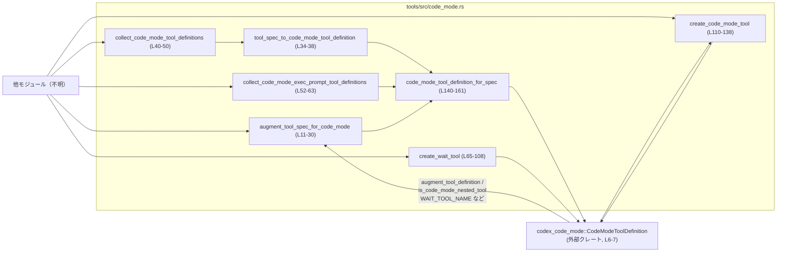
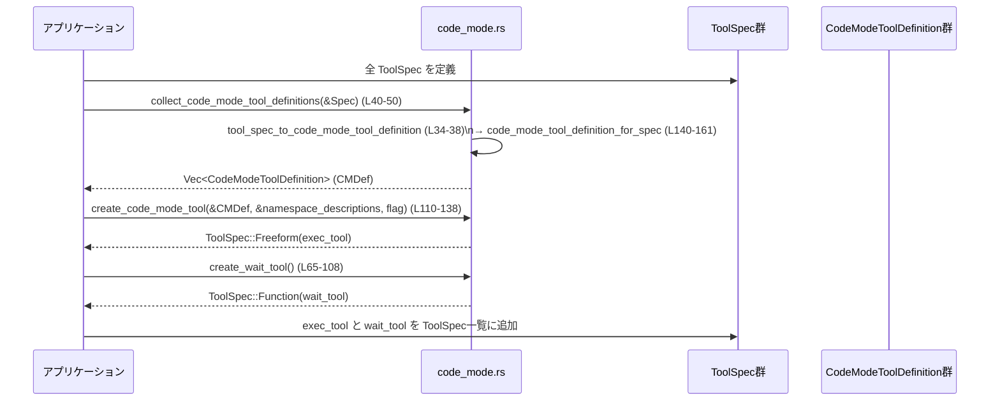

# tools/src/code_mode.rs コード解説

## 0. ざっくり一言

`ToolSpec` から code-mode 用のツール定義や実行用ツール (`exec` / `wait`) を組み立てるためのユーティリティ関数群です。  
外部クレート `codex_code_mode` の API と、ローカルの `ToolSpec` 型の橋渡しを行います。

---

## 1. このモジュールの役割

### 1.1 概要

- このモジュールは **既存のツール定義 (`ToolSpec`) を code-mode ランタイムが扱える形に変換する問題** を解決するために存在し、次の機能を提供します。
  - `ToolSpec` の説明文に code-mode 用のサンプルを付与する（説明の拡張）。
  - `ToolSpec` から `CodeModeToolDefinition` を生成する（JSON スキーマ付きの定義）。
  - code-mode 用の「wait ツール」と「exec 用 Freeform ツール」を組み立てる。

（根拠: 全ての公開関数定義とコメント `code_mode.rs:L10-138`）

### 1.2 アーキテクチャ内での位置づけ

このモジュールは、ローカルのツール定義 (`ToolSpec`) と外部クレート `codex_code_mode` が提供する code-mode ランタイムとの間の変換層として機能します。

主要な依存関係と呼び出し関係は次の通りです。



- `ToolSpec` 自体の定義や `FreeformTool` などの構造体はこのファイル外（`crate::`）で定義されています（`code_mode.rs:L1-5`）。
- code-mode 固有のロジック（ネストツール判定や説明文生成）は `codex_code_mode` クレート側にあります（`code_mode.rs:L6-7`）。

### 1.3 設計上のポイント

- **ステートレスな関数群**  
  - すべての関数は入力値から新しい値を返す純粋関数的な設計で、内部に保持状態はありません（グローバル変数・`static mut`・`unsafe` は登場しません。`code_mode.rs` 全体）。
- **列挙型 `ToolSpec` のバリアントごとの明示的な分岐**  
  - `code_mode_tool_definition_for_spec` が `ToolSpec` 全バリアントを `match` で処理し、対応しないものは `None` を返します（`code_mode.rs:L140-161`）。
- **エラーハンドリングは Option ベースで「無視する」方針**  
  - `serde_json::to_value(&tool.parameters).ok()` により、シリアライズ失敗時は `input_schema: None` とする実装になっています（`code_mode.rs:L146-147`）。
- **ソートと重複排除による決定的なツール定義集合の生成**  
  - ツール一覧は名前でソートし、同名ツールは 1 件にまとめています（`code_mode.rs:L47-48`, `L60-61`）。
- **並行性・スレッド安全性**  
  - 共有可変状態や I/O はなく、すべての関数は引数だけから結果を計算するため、スレッド間で同時呼び出ししても競合状態は生じにくい設計です。

---

## 2. 主要な機能一覧

このモジュールが提供する主な機能は次の通りです。

- `ToolSpec` の説明文の code-mode 用拡張: `augment_tool_spec_for_code_mode`（`code_mode.rs:L11-30`）
- `ToolSpec` から code-mode ランタイム用の `CodeModeToolDefinition` を生成:  
  - ネストツールかつ説明文拡張あり: `tool_spec_to_code_mode_tool_definition`（`code_mode.rs:L34-38`）
  - 素の定義（説明文拡張なし）: `code_mode_tool_definition_for_spec`（`code_mode.rs:L140-161`）
- code-mode 対応ツール集合の生成:
  - 実行時ランタイム用一覧: `collect_code_mode_tool_definitions`（`code_mode.rs:L40-50`）
  - Exec プロンプト用一覧: `collect_code_mode_exec_prompt_tool_definitions`（`code_mode.rs:L52-63`）
- 「wait」ツール（実行セルの待機）定義の生成: `create_wait_tool`（`code_mode.rs:L65-108`）
- 「exec」用 Freeform ツール（コード実行）の生成: `create_code_mode_tool`（`code_mode.rs:L110-138`）

---

## 3. 公開 API と詳細解説

### 3.1 型一覧（構造体・列挙体など）

このファイル内で新たな型定義はありませんが、外部からインポートしている主要型は次の通りです。

| 名前 | 種別 | 定義場所（推測しない範囲） | 役割 / 用途 | 根拠 |
|------|------|----------------------------|-------------|------|
| `ToolSpec` | 列挙体 | `crate::ToolSpec` | 各種ツール（Function, Freeform, LocalShell, ImageGeneration など）の共通表現 | `code_mode.rs:L5`, `L140-161` |
| `FreeformTool` | 構造体 | `crate::FreeformTool` | Freeform 形式のツール定義（grammar など） | `code_mode.rs:L1`, `L125-137` |
| `FreeformToolFormat` | 構造体 | `crate::FreeformToolFormat` | Freeform ツールのフォーマット情報（`type`, `syntax`, `definition`） | `code_mode.rs:L2`, `L132-136` |
| `ResponsesApiTool` | 構造体 | `crate::ResponsesApiTool` | `ToolSpec::Function` 用の具体的なツール定義 | `code_mode.rs:L4`, `L92-107` |
| `JsonSchema` | 列挙体/構造体（詳細不明） | `crate::JsonSchema` | ツール引数の JSON スキーマ表現 | `code_mode.rs:L3`, `L66-88`, `L100-104` |
| `CodeModeToolDefinition` | 構造体 | `codex_code_mode::ToolDefinition` | code-mode ランタイムに渡されるツール定義（名前・説明・入出力スキーマなど） | `code_mode.rs:L7`, `L34-38`, `L40-63`, `L140-161` |
| `CodeModeToolKind` | 列挙体 | `codex_code_mode::CodeModeToolKind` | Function / Freeform など、code-mode ツールの種別 | `code_mode.rs:L6`, `L145`, `L152` |

※ 各型の詳細なフィールド構成は、このチャンクには現れません。

#### 関数・定数インベントリー

| 名前 | 種別 | 概要 | 行番号 |
|------|------|------|--------|
| `augment_tool_spec_for_code_mode` | 公開関数 | `ToolSpec` の説明文を code-mode 用に拡張する | `code_mode.rs:L11-30` |
| `tool_spec_to_code_mode_tool_definition` | 公開関数 | 1 つの `ToolSpec` を code-mode 用の `CodeModeToolDefinition` に変換する | `code_mode.rs:L34-38` |
| `collect_code_mode_tool_definitions` | 公開関数 | 複数の `ToolSpec` から code-mode 対応ツール定義一覧を作る（説明文拡張あり） | `code_mode.rs:L40-50` |
| `collect_code_mode_exec_prompt_tool_definitions` | 公開関数 | Exec プロンプト用の code-mode ツール定義一覧を作る（説明文拡張なし） | `code_mode.rs:L52-63` |
| `create_wait_tool` | 公開関数 | 実行セルを待機する「wait」ツールの `ToolSpec` を生成 | `code_mode.rs:L65-108` |
| `create_code_mode_tool` | 公開関数 | exec 用 Freeform ツールの `ToolSpec` を生成 | `code_mode.rs:L110-138` |
| `code_mode_tool_definition_for_spec` | 非公開関数 | `ToolSpec` から基本的な `CodeModeToolDefinition` を作るヘルパー | `code_mode.rs:L140-161` |
| `CODE_MODE_FREEFORM_GRAMMAR` | モジュール内定数 | exec Freeform ツール用の Lark 文法定義 | `code_mode.rs:L115-123` |

---

### 3.2 関数詳細（主要 7 件）

#### `augment_tool_spec_for_code_mode(spec: ToolSpec) -> ToolSpec`（code_mode.rs:L11-30）

**概要**

- 与えられた `ToolSpec` が code-mode で扱えるツールであれば、説明文 (`description`) を code-mode 用のサンプル付き説明文に差し替えます。
- 対応しないツール（`LocalShell` など）の場合は、入力をそのまま返します。

（根拠: `code_mode.rs:L11-30`, `L140-161`）

**引数**

| 引数名 | 型 | 説明 |
|--------|----|------|
| `spec` | `ToolSpec` | 説明文を拡張する対象のツール定義。`ToolSpec::Function` または `ToolSpec::Freeform` のときのみ変換対象になります。 |

**戻り値**

- `ToolSpec`: 説明文が code-mode 用に拡張された新しい `ToolSpec`。対応しないツールは元のまま返却されます。

**内部処理の流れ**

1. `code_mode_tool_definition_for_spec(&spec)` で、`ToolSpec` から基本的な `CodeModeToolDefinition` を生成します（`code_mode.rs:L12`, `L140-161`）。
2. `Option` が `None` の場合（`LocalShell` や `ImageGeneration` など）には、そのまま `spec` を返して終了します（`code_mode.rs:L12-17`）。
3. `Some(definition)` の場合、`codex_code_mode::augment_tool_definition(definition)` で description を code-mode 用に拡張します（`code_mode.rs:L13`）。
4. 拡張後の `definition.description` を取り出し（`code_mode.rs:L14`）、`ToolSpec` のバリアントごとに `description` フィールドを差し替えて返します（`code_mode.rs:L19-27`）。

**Examples（使用例）**

```rust
// 仮: crate から ToolSpec などが利用可能とする
use crate::ToolSpec;
use crate::ResponsesApiTool;

// 既存の Function ツール定義を作る（詳細は実際の定義に依存）
let original = ToolSpec::Function(ResponsesApiTool {
    name: "my_tool".to_string(),
    description: "Original description".to_string(),
    strict: true,
    parameters: /* JsonSchema */ unimplemented!(),
    output_schema: None,
    defer_loading: None,
});

// code-mode 用に説明文を拡張
let augmented = augment_tool_spec_for_code_mode(original);

// augmented の description には codex_code_mode 側で生成された
// code-mode サンプル付きの説明が入ります。
```

**Errors / Panics**

- 関数自身は `Result` を返さず、明示的なエラーはありません。
- `code_mode_tool_definition_for_spec` 内部で呼んでいる `serde_json::to_value` 失敗時は `input_schema: None` になりますが、ここでは `description` のみ使用しているため、この失敗はこの関数の挙動には影響しません（`code_mode.rs:L146-147`）。
- 明示的な `unwrap` や `panic!` は存在しません。

**Edge cases（エッジケース）**

- `ToolSpec::LocalShell` や `ToolSpec::ImageGeneration` など、`code_mode_tool_definition_for_spec` が `None` を返すバリアントの場合は、`spec` が全く変更されずに返ります（`code_mode.rs:L15-17`, `L156-159`）。
- `ToolSpec::Function` / `Freeform` で `description` が空文字列でも、`codex_code_mode::augment_tool_definition` により上書きされます（元の description は使われません）。

**使用上の注意点**

- 説明文を拡張したくない `Function` / `Freeform` ツールに対してこの関数を適用すると、元の説明文が失われる点に注意が必要です（`code_mode.rs:L20-27`）。
- 元の `ToolSpec` は値として受け取って消費されるため、この関数を呼ぶ前に必要ならクローンしておく必要があります（所有権の移動）。

---

#### `tool_spec_to_code_mode_tool_definition(spec: &ToolSpec) -> Option<CodeModeToolDefinition>`（code_mode.rs:L34-38）

**概要**

- 単一の `ToolSpec` から、code-mode ランタイムが利用する `CodeModeToolDefinition` を生成します。
- 「code-mode ネストツール」と判定されたもののみを対象とし、説明文を code-mode 用に拡張します。

（根拠: `code_mode.rs:L34-38`）

**引数**

| 引数名 | 型 | 説明 |
|--------|----|------|
| `spec` | `&ToolSpec` | 変換対象のツール定義。借用なので所有権は移動しません。 |

**戻り値**

- `Option<CodeModeToolDefinition>`:
  - `Some(def)` … `ToolSpec` が code-mode 対応かつネストツールである場合の拡張済み定義。
  - `None` … 対応しないバリアント、あるいはネストツール判定で除外された場合。

**内部処理の流れ**

1. `code_mode_tool_definition_for_spec(spec)?` により、対応バリアント（Function / Freeform）の場合のみ基本定義を取得します（`code_mode.rs:L35`, `L140-155`）。
2. `codex_code_mode::is_code_mode_nested_tool(&definition.name)` で「ネストツール」かを判定します（`code_mode.rs:L36`）。
3. 真の場合 `codex_code_mode::augment_tool_definition(definition)` を呼び、説明文などを code-mode 用に拡張して `Some` を返します（`code_mode.rs:L37`）。
4. 偽の場合は `None` を返します（`bool::then` の仕様）。

**Examples（使用例）**

```rust
let spec: ToolSpec = /* どこかで作成された Function ツール */ unimplemented!();

// ネストツールだけを code-mode 定義に変換
if let Some(def) = tool_spec_to_code_mode_tool_definition(&spec) {
    println!("code-mode tool: {}", def.name);
} else {
    println!("このツールは code-mode ネストツールではありません");
}
```

**Errors / Panics**

- `Option` ベースで制御しているため、エラーは `None` として表現されます。
- シリアライズ失敗はすでに `code_mode_tool_definition_for_spec` で `input_schema: None` に変換されており、ここではさらなるエラーにはなりません。

**Edge cases**

- `ToolSpec` が `LocalShell` などの場合、`code_mode_tool_definition_for_spec` が `None` を返し、必ず `None` になります（`code_mode.rs:L156-159`）。
- `is_code_mode_nested_tool` が `false` を返す名前の Function / Freeform ツールも `None` です。

**使用上の注意点**

- 「ネストツール以外も含めて code-mode 定義を得たい」場合は、代わりに `code_mode_tool_definition_for_spec` を直接使う必要があります（このファイル外からは非公開なので、設計としてはネストツール以外をこのモジュールで扱わない想定とも解釈できます）。

---

#### `collect_code_mode_tool_definitions<'a>(specs: impl IntoIterator<Item = &'a ToolSpec>) -> Vec<CodeModeToolDefinition>`（code_mode.rs:L40-50）

**概要**

- 複数の `ToolSpec` から、code-mode ネストツールの `CodeModeToolDefinition` 一覧を生成します。
- 各定義は説明文が code-mode 用に拡張され、かつ名前でソート・重複除去されます。

（根拠: `code_mode.rs:L40-50`）

**引数**

| 引数名 | 型 | 説明 |
|--------|----|------|
| `specs` | `impl IntoIterator<Item = &'a ToolSpec>` | 参照として渡される `ToolSpec` のコレクション。`&Vec<ToolSpec>` やイテレータなどを渡せます。 |

**戻り値**

- `Vec<CodeModeToolDefinition>`:  
  code-mode ネストツールのみを含む、名前昇順でソートされ同名は 1 件にまとめられた定義一覧。

**内部処理の流れ**

1. `specs.into_iter()` でイテレータ化（`code_mode.rs:L43-44`）。
2. 各要素に対して `tool_spec_to_code_mode_tool_definition` を適用し、`Some` のみを収集（`filter_map`）（`code_mode.rs:L45`）。
3. ベクタを `left.name.cmp(&right.name)` でソート（`code_mode.rs:L47`）。
4. `dedup_by(|left, right| left.name == right.name)` で名前が同じ連続要素を 1 つにまとめる（`code_mode.rs:L48`）。
5. ベクタを返す（`code_mode.rs:L49-50`）。

**Examples（使用例）**

```rust
let all_specs: Vec<ToolSpec> = /* ツール群 */ unimplemented!();

// code-mode ネストツールの定義をすべて取得
let defs = collect_code_mode_tool_definitions(&all_specs);

for def in &defs {
    println!("code-mode nested tool: {}", def.name);
}
```

**Errors / Panics**

- ベクタ操作のみで、明示的なエラーはありません。
- `sort_by` と `dedup_by` は比較関数がパニックしない限り安全です。ここでは単純な文字列比較のみです。

**Edge cases**

- 空の `specs` を渡した場合、空の `Vec` が返ります。
- 同名のネストツールが複数含まれている場合、ソート後に隣り合った要素が `dedup_by` により 1 件にまとめられます。どちらが残るかは `sort` の安定性次第ですが、標準ライブラリの `sort_by` は安定ではないため、厳密な順序は保証されません。

**使用上の注意点**

- 元の `specs` の順序はソートによって失われます。表示順序を維持したい用途には向きません。
- 名前での重複排除により、同名ツールを複数登録したいケースには適しません。

---

#### `collect_code_mode_exec_prompt_tool_definitions<'a>(specs: impl IntoIterator<Item = &'a ToolSpec>) -> Vec<CodeModeToolDefinition>`（code_mode.rs:L52-63）

**概要**

- Exec プロンプト生成などで用いる、code-mode ネストツールの基本的な定義一覧を作成します。
- `collect_code_mode_tool_definitions` と異なり、説明文は拡張されません（`augment_tool_definition` を呼ばない）。

（根拠: `code_mode.rs:L55-59`）

**引数・戻り値**

- 引数・戻り値の型は `collect_code_mode_tool_definitions` と同じです。

**内部処理の流れ**

1. `specs.into_iter()` でイテレータ化（`code_mode.rs:L55-56`）。
2. `code_mode_tool_definition_for_spec` で Function / Freeform のみ `CodeModeToolDefinition` に変換（`code_mode.rs:L57`, `L140-155`）。
3. そのうち `codex_code_mode::is_code_mode_nested_tool(&definition.name)` が真のものに限定（`code_mode.rs:L58`）。
4. ベクタに収集し、ソート・重複排除は `collect_code_mode_tool_definitions` と同様（`code_mode.rs:L60-61`）。

**Examples（使用例）**

```rust
let defs_for_prompt =
    collect_code_mode_exec_prompt_tool_definitions(&all_specs);

// defs_for_prompt の description は元の ToolSpec の説明文のままです。
```

**使用上の注意点**

- 説明文に code-mode 専用サンプルが不要な用途（プロンプトテキスト生成など）向けです。
- ソート・重複排除の特性は `collect_code_mode_tool_definitions` と同じです。

---

#### `create_wait_tool() -> ToolSpec`（code_mode.rs:L65-108）

**概要**

- 実行セル（exec セル）の進捗・出力をポーリングするための「wait」ツールの `ToolSpec` を生成します。
- 引数には cell ID や待ち時間、最大トークン数、強制終了フラグなどのパラメータスキーマが含まれます。

（根拠: `code_mode.rs:L65-107`）

**引数**

- なし。

**戻り値**

- `ToolSpec::Function(ResponsesApiTool { ... })`: WAIT ツールとして使用できる関数ツール定義。

**内部処理の流れ**

1. `BTreeMap::from([...])` で 4 つのプロパティを持つスキーママップを作成（`code_mode.rs:L66-90`）。
   - `cell_id`: 実行中セルの ID（文字列）。
   - `yield_time_ms`: 追加出力を待つ時間（ミリ秒）。
   - `max_tokens`: 1 回の wait 呼び出しで返す最大トークン数。
   - `terminate`: 実行中セルを終了するかどうか。
2. `ToolSpec::Function(ResponsesApiTool { ... })` を構築（`code_mode.rs:L92-107`）。
   - `name`: `codex_code_mode::WAIT_TOOL_NAME`。
   - `description`: PUBLIC ツール名と `build_wait_tool_description()` を組み合わせた説明文（`code_mode.rs:L94-98`）。
   - `strict`: `false`。
   - `parameters`: `JsonSchema::object(properties, Some(vec!["cell_id".to_string()]), Some(false.into()))` で `cell_id` 必須のオブジェクトスキーマを構築（`code_mode.rs:L100-104`）。
   - `output_schema`: `None`。
   - `defer_loading`: `None`。

**Examples（使用例）**

```rust
// wait ツールの ToolSpec を作成
let wait_tool_spec: ToolSpec = create_wait_tool();

// たとえば、全ツール一覧に追加する
let mut all_specs = Vec::<ToolSpec>::new();
all_specs.push(wait_tool_spec);
```

**Errors / Panics**

- 文字列や数値の静的リテラルからなる構築のみであり、エラーやパニックは想定されません。

**Edge cases**

- `yield_time_ms`, `max_tokens`, `terminate` はスキーマ上必須にはされていません（required に指定されているのは `cell_id` のみ。`code_mode.rs:L102`）。
  - 実際に省略可能かどうか、およびデフォルト値は、このチャンクには現れない code-mode ランタイム側に依存します。

**使用上の注意点**

- wait ツールの名前や説明文は `codex_code_mode` 側の定数・関数に依存するため、この関数を変更せずに外部からカスタマイズすることはできません。
- `output_schema` が `None` のため、クライアントは返却形式を事前に知ることができません（実際の返却 JSON の構造は外部仕様に依存します）。

---

#### `create_code_mode_tool(enabled_tools: &[CodeModeToolDefinition], namespace_descriptions: &BTreeMap<String, codex_code_mode::ToolNamespaceDescription>, code_mode_only_enabled: bool) -> ToolSpec`（code_mode.rs:L110-138）

**概要**

- code-mode のメイン exec 用 Freeform ツール (`PUBLIC_TOOL_NAME`) の `ToolSpec::Freeform` を生成します。
- 有効な code-mode ツール一覧と名前空間説明をもとに、説明文や Lark 文法を構築します。

（根拠: `code_mode.rs:L110-138`）

**引数**

| 引数名 | 型 | 説明 |
|--------|----|------|
| `enabled_tools` | `&[CodeModeToolDefinition]` | code-mode で有効なツール定義一覧。通常は `collect_code_mode_tool_definitions` の出力を渡します。 |
| `namespace_descriptions` | `&BTreeMap<String, codex_code_mode::ToolNamespaceDescription>` | 名前空間ごとの説明情報（詳細不明）。 |
| `code_mode_only_enabled` | `bool` | code-mode のみ有効かどうかを示すフラグ（具体的な意味は `build_exec_tool_description` の実装次第で、このチャンクには現れません）。 |

**戻り値**

- `ToolSpec::Freeform(FreeformTool { ... })`: exec ツールとして利用する Freeform ツール定義。

**内部処理の流れ**

1. Lark 文法定数 `CODE_MODE_FREEFORM_GRAMMAR` を宣言（`code_mode.rs:L115-123`）。

   ```text
   start: pragma_source | plain_source
   pragma_source: PRAGMA_LINE NEWLINE SOURCE
   plain_source: SOURCE

   PRAGMA_LINE: /[ \t]*\/\/ @exec:[^\r\n]*/
   NEWLINE: /\r?\n/
   SOURCE: /[\s\S]+/
   ```

   - 先頭行の `// @exec:` プラグマを含む形式 (`pragma_source`) と、含まない形式 (`plain_source`) の双方を扱えるようにしています。

2. `ToolSpec::Freeform(FreeformTool { ... })` を構築（`code_mode.rs:L125-137`）。
   - `name`: `codex_code_mode::PUBLIC_TOOL_NAME`。
   - `description`: `codex_code_mode::build_exec_tool_description(enabled_tools, namespace_descriptions, code_mode_only_enabled)` の戻り値（`code_mode.rs:L127-131`）。
   - `format`: `FreeformToolFormat { type: "grammar", syntax: "lark", definition: CODE_MODE_FREEFORM_GRAMMAR.to_string() }`（`code_mode.rs:L132-136`）。

**Examples（使用例）**

```rust
let all_specs: Vec<ToolSpec> = /* 全ツール定義 */ unimplemented!();

// code-mode 対応ツール定義を収集
let enabled_defs = collect_code_mode_tool_definitions(&all_specs);

// 名前空間説明（ここでは空）
let namespace_descriptions = BTreeMap::new();

// exec 用 Freeform ツールを生成
let exec_tool = create_code_mode_tool(
    &enabled_defs,
    &namespace_descriptions,
    false, // code_mode_only_enabled
);
```

**Errors / Panics**

- 関数内では静的文字列と外部関数呼び出しのみを行っており、明示的なエラー処理・パニックはありません。
- `build_exec_tool_description` がパニックしうるかどうかは、このチャンクには現れません。

**Edge cases**

- `enabled_tools` が空でも文法自体は有効であるため、Freeform ツールは生成されます。ただし説明文の内容は `build_exec_tool_description` の実装に依存します。

**使用上の注意点**

- 文法 (`CODE_MODE_FREEFORM_GRAMMAR`) はこの関数内で固定されているため、プラグマ形式や構文を変更したい場合はこのファイルを直接編集する必要があります。
- `syntax` が `"lark"` に固定されているため、ランタイムが対応している必要があります（`code_mode.rs:L134`）。

---

#### `code_mode_tool_definition_for_spec(spec: &ToolSpec) -> Option<CodeModeToolDefinition>`（code_mode.rs:L140-161）

**概要**

- `ToolSpec` からより汎用的な code-mode ツール定義 `CodeModeToolDefinition` を生成する内部ヘルパーです。
- Function / Freeform バリアントのみをサポートし、それ以外は `None` を返します。

（根拠: `code_mode.rs:L140-161`）

**引数・戻り値**

| 引数名 | 型 | 説明 |
|--------|----|------|
| `spec` | `&ToolSpec` | 変換対象のツール定義。 |

戻り値:

- `Some(CodeModeToolDefinition)` … Function / Freeform の場合。
- `None` … `LocalShell` / `ImageGeneration` / `ToolSearch` / `WebSearch` などサポート外の場合。

**内部処理の流れ**

1. `match spec` でバリアントごとに分岐（`code_mode.rs:L141-159`）。
2. `ToolSpec::Function(tool)` の場合:
   - `name`: `tool.name.clone()`
   - `description`: `tool.description.clone()`
   - `kind`: `CodeModeToolKind::Function`
   - `input_schema`: `serde_json::to_value(&tool.parameters).ok()`（失敗時 None）（`code_mode.rs:L145-147`）
   - `output_schema`: `tool.output_schema.clone()`（`code_mode.rs:L147-148`）
3. `ToolSpec::Freeform(tool)` の場合:
   - `name`, `description` は同様にクローン。
   - `kind`: `CodeModeToolKind::Freeform`
   - `input_schema`, `output_schema`: いずれも `None`（`code_mode.rs:L149-155`）。
4. `ToolSpec::LocalShell {}` / `ImageGeneration { .. }` / `ToolSearch { .. }` / `WebSearch { .. }` は `None`（`code_mode.rs:L156-159`）。

**Errors / Panics**

- `serde_json::to_value` 失敗時は `ok()` により `input_schema: None` となり、パニックは発生しません。

**使用上の注意点**

- この関数自体は非公開ですが、Function / Freeform 以外を code-mode に載せたい場合は、ここへの分岐追加が必要になります。
- 引数スキーマ (`parameters`) が `serde_json` でシリアライズできないと `input_schema` が `None` になり、ランタイム側で引数構造が把握できなくなる可能性があります。

---

### 3.3 その他の関数

上記以外の補助的な関数はありません（テストモジュールを除く）。

---

## 4. データフロー

### 4.1 代表的な処理シナリオ: ToolSpec から exec/wait ツールを構築

想定される代表的なフローは次の通りです。

1. アプリケーションが全ての `ToolSpec` を定義する。
2. `collect_code_mode_tool_definitions` で code-mode 対応ネストツール一覧を生成。
3. その一覧を渡して `create_code_mode_tool` で exec 用 Freeform ツールを生成。
4. `create_wait_tool` で wait ツールを生成。
5. 上記 2 つのツールを `ToolSpec` の一覧に加え、code-mode 環境を構築する。

この流れをシーケンス図で表します。



このチャンクには、`App` や `Spec` の実際の実装は現れませんが、関数インターフェースからこのようなデータフローが読み取れます。

---

## 5. 使い方（How to Use）

### 5.1 基本的な使用方法

code-mode 対応の exec / wait ツールを含む全ツール集合を構築する典型的なフローの例です。

```rust
use std::collections::BTreeMap;

// 仮: crate からこれらが公開されているとする
use crate::ToolSpec;
use crate::tools::code_mode::{
    collect_code_mode_tool_definitions,
    create_code_mode_tool,
    create_wait_tool,
};

// 全ての既存ツール定義を用意する
fn build_all_specs_without_code_mode() -> Vec<ToolSpec> {
    // ここで Function / Freeform / ImageGeneration などを定義する
    unimplemented!()
}

fn build_all_specs_with_code_mode() -> Vec<ToolSpec> {
    let mut specs = build_all_specs_without_code_mode();

    // 1. code-mode ネストツールの定義を収集
    let enabled_defs = collect_code_mode_tool_definitions(&specs);

    // 2. 名前空間説明（必要に応じて構築）
    let namespace_descriptions = BTreeMap::new();

    // 3. exec Freeform ツールを生成
    let exec_tool = create_code_mode_tool(
        &enabled_defs,
        &namespace_descriptions,
        false, // code_mode_only_enabled
    );

    // 4. wait ツールを生成
    let wait_tool = create_wait_tool();

    // 5. 全体の ToolSpec 一覧に追加
    specs.push(exec_tool);
    specs.push(wait_tool);

    specs
}
```

### 5.2 よくある使用パターン

1. **説明文を code-mode 用に一括拡張する**

   ```rust
   let mut specs = build_all_specs_without_code_mode();

   specs = specs
       .into_iter()
       .map(augment_tool_spec_for_code_mode) // Function / Freeform の description を拡張
       .collect();
   ```

2. **Exec プロンプト用の定義だけを取り出す**

   ```rust
   let exec_prompt_defs =
       collect_code_mode_exec_prompt_tool_definitions(&specs);

   // exec_prompt_defs の description は元の ToolSpec のまま
   ```

3. **ツールごとの code-mode 定義を個別に確認する**

   ```rust
   for spec in &specs {
       if let Some(def) = tool_spec_to_code_mode_tool_definition(spec) {
           println!("nested code-mode tool available: {}", def.name);
       }
   }
   ```

### 5.3 よくある間違い

```rust
// 間違い例: ネストツール以外も含めたいのに tool_spec_to_code_mode_tool_definition を直接使う
let defs: Vec<_> = specs
    .iter()
    .filter_map(tool_spec_to_code_mode_tool_definition) // ネストツール以外は落ちる
    .collect();

// 正しい例: ネストツール判定をせずに定義だけ欲しい場合は、本モジュールではなく
// ToolSpec 側の情報を直接利用するか、このヘルパーの拡張が必要
// （このチャンクには汎用的な「全ツールを CodeModeToolDefinition に」変換する関数はありません）
```

```rust
// 間違い例: exec 用 Freeform ツールを作らずに wait ツールだけ追加する
let mut specs = build_all_specs_without_code_mode();
let wait_tool = create_wait_tool();
specs.push(wait_tool);
// → PUBLIC_TOOL_NAME の exec ツールがないと code-mode の全体 UX が崩れる可能性

// 正しい例: exec / wait をペアで追加する
let enabled_defs = collect_code_mode_tool_definitions(&specs);
let namespace_descriptions = BTreeMap::new();
let exec_tool = create_code_mode_tool(&enabled_defs, &namespace_descriptions, false);
let wait_tool = create_wait_tool();
specs.push(exec_tool);
specs.push(wait_tool);
```

### 5.4 使用上の注意点（まとめ）

- `collect_code_mode_*` 系は **名前でソート・重複排除** するため、元の定義順や重複を保持したいケースには使わない方がよいです。
- `augment_tool_spec_for_code_mode` は Function / Freeform の **説明文を上書き** します。元の説明文を保持したい場合は、別途コピーを残す必要があります。
- `code_mode_tool_definition_for_spec` で引数スキーマの JSON シリアライズに失敗すると、`input_schema` が `None` となります。その場合、ランタイムが引数構造を検証できない可能性があります。

---

## 6. 変更の仕方（How to Modify）

### 6.1 新しい機能を追加する場合

1. **新しい `ToolSpec` バリアントを code-mode でサポートしたい場合**
   - `code_mode_tool_definition_for_spec` の `match` にそのバリアントを追加し、`CodeModeToolDefinition` を構築します（`code_mode.rs:L140-161`）。
   - 必要に応じて `CodeModeToolKind` にも新しい種別を追加する必要がありますが、これは `codex_code_mode` 側の変更になります（このチャンクには現れません）。
2. **wait ツールの引数を増やしたい場合**
   - `create_wait_tool` 内の `properties` に項目を追加し（`code_mode.rs:L66-90`）、`JsonSchema::object` の required リストを更新します（`code_mode.rs:L100-104`）。
3. **exec Freeform 文法を拡張したい場合**
   - `CODE_MODE_FREEFORM_GRAMMAR` の文字列を編集します（`code_mode.rs:L115-123`）。
   - 変更後の文法に合わせて、`build_exec_tool_description` の説明文を `codex_code_mode` 側で更新する必要があるかもしれません。

### 6.2 既存の機能を変更する場合

- **影響範囲の確認**
  - `code_mode_tool_definition_for_spec` を変更すると、これを利用している全ての関数（`augment_tool_spec_for_code_mode`, `tool_spec_to_code_mode_tool_definition`, `collect_code_mode_exec_prompt_tool_definitions`）の挙動に影響します（`code_mode.rs:L11-38`, `L52-63`）。
- **契約（前提条件・返り値の意味）**
  - `collect_code_mode_*` 系は「名前でソートし重複除去する」という性質を前提として他コードが書かれている可能性があります。順序や重複の扱いを変える場合は、呼び出し側も合わせて確認する必要があります。
  - `create_wait_tool` / `create_code_mode_tool` の返す `ToolSpec` の名前（`WAIT_TOOL_NAME`, `PUBLIC_TOOL_NAME`）を変更すると、ランタイムやクライアント側のハードコードされた名前と齟齬を生む可能性があります。
- **テスト**
  - このモジュールには `code_mode_tests.rs` がテストとして指定されています（`code_mode.rs:L163-165`）。振る舞いを変更した場合は、このテストファイルを更新して挙動を検証する必要があります（中身はこのチャンクには現れません）。

---

## 7. 関連ファイル

| パス / モジュール | 役割 / 関係 |
|------------------|------------|
| `tools/src/code_mode_tests.rs` | このモジュールのテストコード。`#[cfg(test)]` の `mod tests;` 経由で読み込まれます（`code_mode.rs:L163-165`）。 |
| `crate::ToolSpec` | このモジュールで扱うツール定義の列挙型。Function / Freeform などのバリアントがあることが、`match` から読み取れます（`code_mode.rs:L140-161`）。 |
| `crate::{FreeformTool, FreeformToolFormat, ResponsesApiTool, JsonSchema}` | `ToolSpec` の具体的なバリアントや JSON スキーマを定義する構造体群（`code_mode.rs:L1-5`, `L65-107`, `L125-137`）。 |
| `codex_code_mode` クレート | code-mode 固有のロジックと型（`CodeModeToolDefinition`, `CodeModeToolKind`, `WAIT_TOOL_NAME`, `PUBLIC_TOOL_NAME`, `augment_tool_definition`, `build_exec_tool_description`, `build_wait_tool_description`, `is_code_mode_nested_tool` など）を提供します（`code_mode.rs:L6-7`, `L13`, `L36-37`, `L58`, `L93-98`, `L126-131`）。 |

このチャンクには、これら関連ファイルの実装詳細は現れないため、より踏み込んだ挙動はそれらの定義を参照する必要があります。
