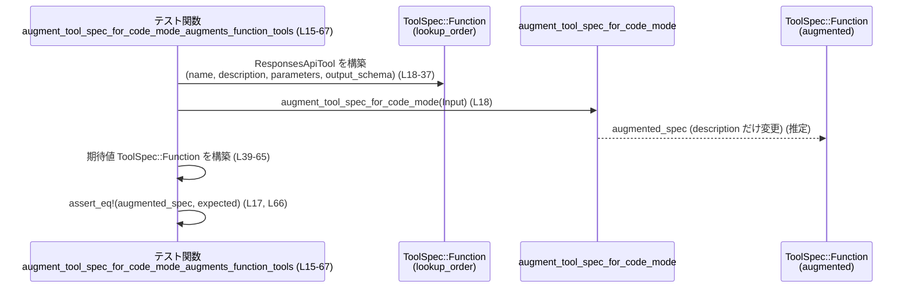
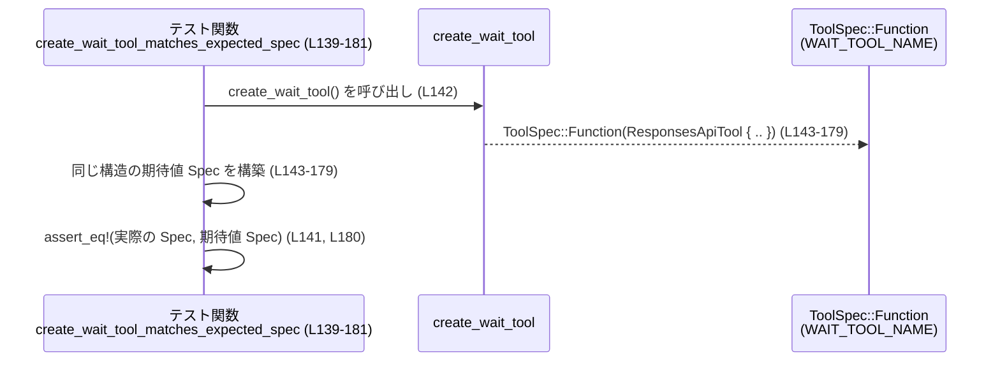

# tools/src/code_mode_tests.rs コード解説

## 0. ざっくり一言

このファイルは、コードモード用のツール仕様変換関数（`augment_tool_spec_for_code_mode` / `tool_spec_to_code_mode_tool_definition` / `create_wait_tool` / `create_code_mode_tool`）が、期待どおりの `ToolSpec`／`ToolDefinition` を生成するかどうかを検証するテスト群です。

---

## 1. このモジュールの役割

### 1.1 概要

- このモジュールは、**コードモードで使うツールの仕様（`ToolSpec`）とコードモード側のツール定義（`codex_code_mode::ToolDefinition`）の相互変換**が正しく行われているかを検証します。
- 具体的には、次の 4 つの関数の振る舞いをテストしています（いずれも親モジュール `super` に定義）。
  - `augment_tool_spec_for_code_mode`
  - `tool_spec_to_code_mode_tool_definition`
  - `create_wait_tool`
  - `create_code_mode_tool`
- これらは **公開 API の期待仕様を固定するテスト**として機能し、将来の変更で挙動が変わらないことを保証します。

### 1.2 アーキテクチャ内での位置づけ

このテストモジュールは、上位モジュール（`super`）の関数と、`crate` 直下の型、および `codex_code_mode` モジュールに依存しています。

```mermaid
graph TD
    subgraph crate
        ToolSpec["ToolSpec<br/>(enum)"]
        ResponsesApiTool["ResponsesApiTool<br/>(構造体)"]
        FreeformTool["FreeformTool<br/>(構造体)"]
        JsonSchema["JsonSchema<br/>(enum/構造体)"]
        AdditionalProperties["AdditionalProperties<br/>(enum)"]
    end

    subgraph codex_code_mode
        PublicTool["PUBLIC_TOOL_NAME<br/>(定数)"]
        WaitToolName["WAIT_TOOL_NAME<br/>(定数)"]
        ToolDef["ToolDefinition<br/>(構造体)"]
        CodeModeKind["CodeModeToolKind<br/>(enum)"]
        BuildExecDesc["build_exec_tool_description(..)"]
        BuildWaitDesc["build_wait_tool_description()"]
    end

    subgraph tools::code_mode (親モジュール; ファイル名は不明)
        Augment["augment_tool_spec_for_code_mode(..)"]
        ToDef["tool_spec_to_code_mode_tool_definition(..)"]
        CreateWait["create_wait_tool()"]
        CreateExec["create_code_mode_tool(..)"]
    end

    subgraph tests
        CodeModeTests["code_mode_tests.rs (本ファイル)"]
    end

    CodeModeTests --> Augment
    CodeModeTests --> ToDef
    CodeModeTests --> CreateWait
    CodeModeTests --> CreateExec

    Augment --> ToolSpec
    ToDef --> ToolDef
    CreateWait --> ToolSpec
    CreateExec --> ToolSpec

    CodeModeTests --> PublicTool
    CodeModeTests --> WaitToolName
    CodeModeTests --> BuildExecDesc
    CodeModeTests --> BuildWaitDesc

    CodeModeTests --> JsonSchema
    CodeModeTests --> AdditionalProperties
```

- **根拠**: インポートと関数呼び出し  
  - `use super::augment_tool_spec_for_code_mode;` など（`tools/src/code_mode_tests.rs:L1-4`）  
  - `use crate::ToolSpec;` など（`L5-10`）  
  - `name: codex_code_mode::PUBLIC_TOOL_NAME.to_string(),`（`L73, L82, L144, L185, L200`）  
  - `codex_code_mode::ToolDefinition`, `CodeModeToolKind` 利用（`L107, L116, L188`）

### 1.3 設計上のポイント

- **責務の分離**  
  - 本ファイルはあくまで **テスト専用**です。実装はすべて `super`（親モジュール）側にあります（`L1-4`）。
- **構造化された比較**  
  - すべてのテストで `pretty_assertions::assert_eq` を使用し、構造体／列挙体のフィールドまで含めた厳密な比較を行います（`L11, L17, L71, L105, L125, L141, L193`）。
- **決定的なマップ順序**  
  - JSON スキーマの `properties` 定義には `BTreeMap` が使われており、キー順序が安定するマップ実装が選ばれています（`L13, L24-27, L50-53, L130-133, L152-177`）。
- **エラーや並行性**  
  - テストはいずれも同期的な関数であり、非同期処理やスレッドを直接扱っていません。
  - テスト対象の関数も、ここから見える範囲では `Result` などのエラー型を返さず、**単純な値変換関数**として利用されています。

---

## 2. 主要な機能一覧（コンポーネントインベントリー）

### 2.1 本ファイル内のテスト関数一覧

| 名前 | 種別 | 役割 / 内容 | 行範囲（根拠） |
|------|------|-------------|----------------|
| `augment_tool_spec_for_code_mode_augments_function_tools` | テスト関数 | `ToolSpec::Function` に対して `augment_tool_spec_for_code_mode` が TypeScript の `exec tool declaration` を説明文に追記することを検証します。 | `tools/src/code_mode_tests.rs:L15-67` |
| `augment_tool_spec_for_code_mode_preserves_exec_tool_description` | テスト関数 | コードモードの実行ツール（`PUBLIC_TOOL_NAME`）に対しては `augment_tool_spec_for_code_mode` が説明文を変更しないことを検証します。 | `L69-91` |
| `tool_spec_to_code_mode_tool_definition_returns_augmented_nested_tools` | テスト関数 | `ToolSpec::Freeform` からネストされたコードモード用ツール定義 `ToolDefinition` を生成し、説明文に `exec tool declaration` を追記することを検証します。 | `L93-121` |
| `tool_spec_to_code_mode_tool_definition_skips_unsupported_variants` | テスト関数 | `ToolSpec::ToolSearch` のような非対応バリアントに対して `tool_spec_to_code_mode_tool_definition` が `None` を返すことを検証します。 | `L123-137` |
| `create_wait_tool_matches_expected_spec` | テスト関数 | `create_wait_tool` が、`WAIT_TOOL_NAME`／適切なパラメータスキーマを持つ待機用 Function ツール仕様を返すことを検証します。 | `L139-181` |
| `create_code_mode_tool_matches_expected_spec` | テスト関数 | 有効なコードモードツール一覧から、`PUBLIC_TOOL_NAME` という Freeform 実行ツール仕様を構築する `create_code_mode_tool` の挙動を検証します。 | `L183-221` |

### 2.2 テスト対象のコア関数一覧（このファイルの外に定義）

| 名前 | 種別 | 呼び出し側テスト | 観測される役割（このファイルから分かる範囲） | 出現箇所（根拠） |
|------|------|------------------|--------------------------------------------|------------------|
| `augment_tool_spec_for_code_mode` | 関数 | `augment_tool_spec_for_code_mode_augments_function_tools` / `augment_tool_spec_for_code_mode_preserves_exec_tool_description` | `ToolSpec` を受け取り、コードモード向けに説明文等を増補した `ToolSpec` を返します。Function ツールには TS 宣言を追記し、コード実行ツール（`PUBLIC_TOOL_NAME`）はそのまま維持することがテストされています。 | `L18-38, L72-80` |
| `tool_spec_to_code_mode_tool_definition` | 関数 | `tool_spec_to_code_mode_tool_definition_returns_augmented_nested_tools` / `tool_spec_to_code_mode_tool_definition_skips_unsupported_variants` | `&ToolSpec` から `Option<codex_code_mode::ToolDefinition>` を生成します。Freeform ツールは `Some(..)` に変換し、ToolSearch バリアントは `None` を返します。 | `L106-107, L126-135` |
| `create_wait_tool` | 関数 | `create_wait_tool_matches_expected_spec` | コードモードの **wait ツール** の `ToolSpec::Function` を構築します。パラメータに `cell_id` / `max_tokens` / `terminate` / `yield_time_ms` を持つ JSON スキーマを含みます。 | `L142-179` |
| `create_code_mode_tool` | 関数 | `create_code_mode_tool_matches_expected_spec` | 有効なコードモードツールの一覧などから、Lark 文法定義付きの `ToolSpec::Freeform`（実行ツール）を生成します。 | `L193-205` |

---

## 3. 公開 API と詳細解説

ここでは、**テスト対象となっているコア関数**の振る舞いを、テストコードから読み取れる範囲で整理します。実装は親モジュールにありますが、テストの期待値から API 仕様の一部がわかります。

### 3.1 型一覧（構造体・列挙体など）

| 名前 | 種別 | 役割 / 用途 | 根拠 |
|------|------|-------------|------|
| `ToolSpec` | 列挙体（推定） | ツール仕様を表す型です。少なくとも `Function`, `Freeform`, `ToolSearch` の各バリアントが使われています。 | `ToolSpec::Function(..)`（`L18, L39, L143`）、`ToolSpec::Freeform(..)`（`L72, L81, L199`）、`ToolSpec::ToolSearch { .. }`（`L126`） |
| `ResponsesApiTool` | 構造体 | Function 形式のツールのメタデータと入出力スキーマを表します。`name`, `description`, `strict`, `defer_loading`, `parameters`, `output_schema` フィールドが使われています。 | `L18-37, L39-65, L143-179` |
| `FreeformTool` | 構造体 | 自由形式（コードモードなど）のツール仕様を表します。`name`, `description`, `format` フィールドを持ちます。 | `L72-80, L81-89, L95-103, L199-220` |
| `FreeformToolFormat` | 構造体 | Freeform ツールのフォーマット定義です。ここでは `type`, `syntax`, `definition` フィールドを持ち、Lark 文法を文字列として保持します。 | `L75-79, L84-88, L98-102, L206-218` |
| `JsonSchema` | 型（enum / 構造体のいずれか） | パラメータや出力の JSON スキーマ定義に利用されています。`object`, `string`, `number`, `boolean` などのコンストラクタが使われています。 | `L23-29, L31-37, L50-57, L129-133, L152-177` |
| `AdditionalProperties` | 列挙体（推定） | JSON オブジェクトの `additionalProperties` 設定を表します。`AdditionalProperties::Boolean(false)` などが使われています。 | `L29, L57, L177` |
| `codex_code_mode::ToolDefinition` | 構造体 | コードモードに渡される、実行可能ツールの定義です。`name`, `description`, `kind`, `input_schema`, `output_schema` を持ちます。 | `L107-119, L185-191` |
| `codex_code_mode::CodeModeToolKind` | 列挙体 | コードモードツールの種類を表します。少なくとも `Freeform` と `Function` が使われています。 | `L116, L188` |
| `codex_code_mode::PUBLIC_TOOL_NAME` | 定数 | コードモードで使用する「コード実行」ツールの公開名です。Freeform ツールの `name` として使われます。 | `L73, L82, L144, L185, L200` |
| `codex_code_mode::WAIT_TOOL_NAME` | 定数 | Wait ツールの名前です。`create_wait_tool` が返す Function ツールの `name` に使用されています。 | `L144` |

> 型の詳細な定義（フィールド型・トレイト実装など）は、このファイルには現れません。

---

### 3.2 関数詳細（コア関数）

#### `augment_tool_spec_for_code_mode(spec: ToolSpec) -> ToolSpec`

**概要**

- コードモードで利用するために、`ToolSpec` の説明文を増補する関数です。
- テストから読み取れる範囲では:
  - Function ツールに対しては TypeScript 形式の `exec` 宣言を説明文に追記します。
  - コード実行ツール（`PUBLIC_TOOL_NAME` の Freeform ツール）はそのまま保持します。

**引数**

| 引数名 | 型 | 説明 |
|--------|----|------|
| `spec` | `ToolSpec` | 変換対象のツール仕様。Function / Freeform などのバリアントを取り得ます。型バリアントごとの挙動はこのファイルには Function / Freeform についてのみ現れます。 |

**戻り値**

- 型: `ToolSpec`  
- 意味: 入力 `spec` を元に、コードモード向けに説明文が整形された新しい `ToolSpec` を返していると解釈できます（テストは値の等価性を確認しており、構造は保たれたまま一部フィールドが変わるのみです）。

**内部処理の流れ（テストから推測できる範囲）**

1. 引数が `ToolSpec::Function(ResponsesApiTool { .. })` の場合（`L18-37`）:
   - `name`, `strict`, `defer_loading`, `parameters`, `output_schema` は保持されています（`L18-23, L31-37` と `L39-50, L58-64` が一致）。
   - `description` に対し、TypeScript の `exec tool declaration` が追記されています（`L20` と `L41-46` の比較）。
2. 引数が `ToolSpec::Freeform(FreeformTool { name: PUBLIC_TOOL_NAME, .. })` の場合（`L72-80`）:
   - 戻り値の `ToolSpec::Freeform` は入力とまったく同一です（`L81-89`）。
   - 説明文やフォーマットは変更されていません。

**Examples（使用例）**

テストを簡略化した、Function ツールの増補例です。

```rust
use crate::{ToolSpec, ResponsesApiTool, JsonSchema, AdditionalProperties};
use std::collections::BTreeMap;

// Function ツールの仕様を作成する
let spec = ToolSpec::Function(ResponsesApiTool {
    name: "lookup_order".to_string(),                 // ツール名
    description: "Look up an order".to_string(),      // 元の説明文
    strict: false,                                    // strict フラグ（詳細不明）
    defer_loading: Some(true),                        // 遅延ロードフラグ
    parameters: JsonSchema::object(                   // パラメータの JSON スキーマ
        BTreeMap::from([(
            "order_id".to_string(),
            JsonSchema::string(None),                 // order_id は文字列
        )]),
        Some(vec!["order_id".to_string()]),           // 必須プロパティ
        Some(AdditionalProperties::Boolean(false)),   // 追加プロパティ非許可（と解釈できる）
    ),
    output_schema: None,                              // 出力スキーマ（ここでは省略）
});

// コードモード向けに説明文を増補する
let augmented = augment_tool_spec_for_code_mode(spec);

// augmented.description には TypeScript の exec 宣言が追記されていることが期待されます。
// 具体的な文字列はテストの期待値（L39-46）に一致します。
```

**Errors / Panics**

- この関数は `ToolSpec` を直接返しており、`Result` や `Option` を返しません（呼び出し側は `assert_eq!` で直接比較しているだけです: `L17-38, L71-80`）。
- テストからは **パニック条件やエラー返却条件は読み取れません**。

**Edge cases（エッジケース）**

- `ToolSpec::Function` 以外のバリアントに対する挙動（ただし `PUBLIC_TOOL_NAME` Freeform を除く）は、このファイルには現れません。
- `description` が空文字・非常に長い場合などの取り扱いも不明です。

**使用上の注意点**

- Function ツールの説明文には `exec tool declaration` を付けるという仕様が、このテストで固定されています（`L41-46`）。  
  これを利用する側は、「description に TypeScript の宣言が含まれている」前提で表示・パースする可能性があります。
- コード実行ツール（`PUBLIC_TOOL_NAME`）に対しては **二重に宣言を付与しない**ことが仕様としてテストされています（`L72-90`）。

---

#### `tool_spec_to_code_mode_tool_definition(spec: &ToolSpec) -> Option<codex_code_mode::ToolDefinition>`

**概要**

- ツール仕様 `ToolSpec` から、コードモード側の `ToolDefinition` を生成する変換関数です。
- Freeform ツールの一部を **「ネストされたコードモードツール」** として扱い、`ToolDefinition` に変換する一方で、非対応のバリアント（例: `ToolSearch`）は `None` を返します。

**引数**

| 引数名 | 型 | 説明 |
|--------|----|------|
| `spec` | `&ToolSpec` | 変換対象のツール仕様への参照。 |

**戻り値**

- 型: `Option<codex_code_mode::ToolDefinition>`  
- 意味:
  - 対応可能な `ToolSpec` の場合は `Some(ToolDefinition { .. })` を返します。
  - 非対応バリアント（例: `ToolSpec::ToolSearch`）は `None` を返します（`L124-136`）。

**内部処理の流れ（テストから推測できる範囲）**

1. 引数が `ToolSpec::Freeform(FreeformTool { name: "apply_patch", .. })` の場合（`L95-103`）:
   - `ToolDefinition { name, description, kind, input_schema: None, output_schema: None }` を返します（`L107-119`）。
   - `kind` は `CodeModeToolKind::Freeform` になっています（`L116`）。
   - `description` は元の `"Apply a patch"` に、TypeScript の `exec tool declaration` が追記されています（`L97, L109-114`）。
2. 引数が `ToolSpec::ToolSearch { .. }` の場合:
   - 戻り値は `None` です（`L126-135`）。

**Examples（使用例）**

```rust
use crate::{ToolSpec, FreeformTool, FreeformToolFormat};
use std::collections::BTreeMap;

// Freeform なツール仕様を作成する（ここでは "apply_patch"）
let spec = ToolSpec::Freeform(FreeformTool {
    name: "apply_patch".to_string(),               // ツール名
    description: "Apply a patch".to_string(),      // 元の説明文
    format: FreeformToolFormat {
        r#type: "grammar".to_string(),            // フォーマットの種類
        syntax: "lark".to_string(),               // 文法の種類
        definition: "start: \"patch\"".to_string() // Lark 文法の定義
    },
});

// コードモード用のツール定義に変換する
if let Some(def) = tool_spec_to_code_mode_tool_definition(&spec) {
    // def.name は "apply_patch"
    // def.description には TypeScript の exec 宣言が追記されている（L109-114 の形）
    // def.kind は CodeModeToolKind::Freeform
}
```

**Errors / Panics**

- 戻り値は `Option` であり、呼び出し側が `Some`/`None` を明示的に扱う前提です。
- この関数が panic を起こす状況はテストからは読み取れません。

**Edge cases**

- どの種類の `ToolSpec::Freeform` が対象になるか（名前やフォーマットの条件）は、このテストでは `"apply_patch"` のみしか確認されていません。
- 他のバリアント（`Function` など）に対する挙動は不明です。
- `ToolSearch` が常に非対応であることだけは明示的にテストされています（`L124-136`）。

**使用上の注意点**

- 呼び出し側は `None` が返るケース（非対応バリアント）を必ず考慮する必要があります。
- `ToolDefinition` に変換された場合、`input_schema` / `output_schema` が `None` である点（`L117-118`）を前提にしている実装があるかもしれません。

---

#### `create_wait_tool() -> ToolSpec`

**概要**

- コードモードで実行中の「exec セル」の進行状況を待つための **Wait ツール**の `ToolSpec::Function` を生成する関数です。
- このテストでは、生成される仕様が固定フォーマットになっていることを検証します（`L143-179`）。

**引数**

- なし。

**戻り値**

- 型: `ToolSpec`（具体的には `ToolSpec::Function(ResponsesApiTool { .. })`）  
- 意味: コードモードの Wait API を表す Function ツール仕様。

**内部処理の流れ（テストから読み取れる構造）**

生成される `ResponsesApiTool` は次のようなフィールドを持ちます（`L143-179`）:

1. `name`: `codex_code_mode::WAIT_TOOL_NAME.to_string()`（`L144`）
2. `description`:
   - フォーマット:  
     `"Waits on a yielded`{PUBLIC_TOOL_NAME}`cell and returns new output or completion.\n{build_wait_tool_description().trim()}"`（`L145-149`）
   - `PUBLIC_TOOL_NAME` と `build_wait_tool_description()` の値を含む説明文に整形されます。
3. `strict`: `false`（`L150`）
4. `defer_loading`: `None`（`L151`）
5. `parameters`: `JsonSchema::object(..)`（`L152-177`）
   - プロパティ:
     - `cell_id`: `string` 型で `"Identifier of the running exec cell."` という説明（`L154-156`）
     - `max_tokens`: `number` 型で `"Maximum number of output tokens ..."`（`L158-162`）
     - `terminate`: `boolean` 型で `"Whether to terminate the running exec cell."`（`L165-168`）
     - `yield_time_ms`: `number` 型で `"How long to wait ..."`（`L171-175`）
   - `required`: `Some(vec!["cell_id".to_string()])`（`L177`）
   - `additional_properties`: `Some(false.into())`（`L177`）
6. `output_schema`: `None`（`L178`）

**Examples（使用例）**

```rust
use crate::ToolSpec;

// Wait ツールの仕様を生成する
let wait_spec = create_wait_tool();

// match でバリアントを確認する例
if let ToolSpec::Function(tool) = wait_spec {
    // tool.name == codex_code_mode::WAIT_TOOL_NAME
    // tool.parameters は cell_id, max_tokens, terminate, yield_time_ms を含む JSON スキーマ
}
```

**Errors / Panics**

- デフォルトの `ToolSpec` を構築しているだけであり、`Result` や `Option` は返していません。
- テストからは例外的なエラーや panic の条件は読み取れません。

**Edge cases**

- パラメータの説明文や必須項目はテストで固定されているため、これらを変更するとテストが失敗します。
- `output_schema` が `None` である前提を、利用側がどう扱うかはこのファイルからは不明です。

**使用上の注意点**

- このツール仕様は、**コードモードの実行セルを待機するための標準 API** として他のコードから利用されることが想定されます。
- `cell_id` が唯一の必須パラメータである点（`L177`）は、クライアント側のバリデーション仕様と一致している必要があります。

---

#### `create_code_mode_tool(enabled_tools: &[codex_code_mode::ToolDefinition], overrides: &BTreeMap<_, _>, code_mode_only_enabled: bool) -> ToolSpec`

**概要**

- 有効なコードモードツール一覧 (`enabled_tools`) とオーバーライド設定などから、実際にエージェントが呼び出す **コード実行ツール（`PUBLIC_TOOL_NAME`）** の `ToolSpec::Freeform` を構築する関数です（`L183-221`）。
- Freeform ツールの `format.definition` として、Lark 文法のコードが固定文字列で設定されます。

**引数**

| 引数名 | 型（このファイルからわかる範囲） | 説明 |
|--------|------------------------------------|------|
| `enabled_tools` | `&[codex_code_mode::ToolDefinition]` | 利用可能なコードモードツール定義のスライス。テストでは 1 要素（`update_plan`）のみを渡しています（`L185-191`）。 |
| `overrides` | `&BTreeMap<_, _>` | 型パラメータは不明ですが、ツールに対する何らかのオーバーライド設定を保持すると考えられます。テストでは空マップが渡されています（`L196-197`）。 |
| `code_mode_only_enabled` | `bool` | コードモードのみが有効かどうかを示すフラグ。テストでは `true` が渡されています（`L197`）。 |

**戻り値**

- 型: `ToolSpec`（Freeform バリアント）  
- 意味: コードモードの実行エントリポイントとなる Freeform ツール仕様。

**内部処理の流れ（テストから読み取れる構造）**

1. `enabled_tools` の内容を利用して、説明文を生成する:
   - `codex_code_mode::build_exec_tool_description(&enabled_tools, &BTreeMap::new(), /*code_mode_only*/ true)` を `description` に設定しています（`L201-205`）。
2. `name`: `codex_code_mode::PUBLIC_TOOL_NAME.to_string()`（`L200`）。
3. `format`: `FreeformToolFormat` を構築し、次のフィールドを設定（`L206-218`）:
   - `type`: `"grammar"`（`L207`）
   - `syntax`: `"lark"`（`L208`）
   - `definition`: 次の Lark 文法文字列（`L209-217`）:

```text
start: pragma_source | plain_source
pragma_source: PRAGMA_LINE NEWLINE SOURCE
plain_source: SOURCE

PRAGMA_LINE: /[ \t]*\/\/ @exec:[^\r\n]*/
NEWLINE: /\r?\n/
SOURCE: /[\s\S]+/
```

**Examples（使用例）**

```rust
use std::collections::BTreeMap;
use crate::ToolSpec;

// コードモードで有効なツール定義を 1 つ作成する
let enabled_tools = vec![codex_code_mode::ToolDefinition {
    name: "update_plan".to_string(),                      // ツール名
    description: "Update the plan".to_string(),           // 説明文
    kind: codex_code_mode::CodeModeToolKind::Function,    // 種類（Function）
    input_schema: None,                                   // 入力スキーマ（ここでは未指定）
    output_schema: None,                                  // 出力スキーマ（ここでは未指定）
}];

// コードモード専用ツールとして実行ツールを作成する
let exec_tool_spec = create_code_mode_tool(
    &enabled_tools,
    &BTreeMap::new(),   // オーバーライド設定（ここでは空）
    true,               // code_mode_only_enabled
);

// exec_tool_spec は Freeform ツールであり、Lark 文法つきの format.definition を持ちます（L209-217）。
```

**Errors / Panics**

- `ToolSpec` を直接返しており、`Result` などによるエラー伝播はありません。
- テストからは、エラーや panic の条件は読み取れません。

**Edge cases**

- `enabled_tools` が空の場合や複数エントリを持つ場合の挙動は、このテストからは分かりません（テストは 1 エントリのみ: `L185-191`）。
- `overrides` の内容が非空の場合の挙動も不明です。

**使用上の注意点**

- `format.definition` に含まれる Lark 文法が、コードモードのパーサと強く結び付いていると考えられるため、この文字列を変更するとエコシステム全体の互換性に影響します。
- `build_exec_tool_description` に `code_mode_only` フラグを渡している点（`L201-205`）は仕様の一部であり、説明文の内容を変える場合にはこのテストも更新が必要です。

---

### 3.3 その他の関数（テスト関数）

テスト関数はすべて **期待値構築 → 関数呼び出し → `assert_eq!`** という流れになっています。

| 関数名 | 役割（1 行） | 根拠 |
|--------|--------------|------|
| `augment_tool_spec_for_code_mode_augments_function_tools` | Function ツールに対する説明文増補を検証します。 | `L15-67` |
| `augment_tool_spec_for_code_mode_preserves_exec_tool_description` | コード実行ツールの説明文が変更されないことを検証します。 | `L69-91` |
| `tool_spec_to_code_mode_tool_definition_returns_augmented_nested_tools` | Freeform ツールからの `ToolDefinition` 変換と説明文増補を検証します。 | `L93-121` |
| `tool_spec_to_code_mode_tool_definition_skips_unsupported_variants` | ToolSearch バリアントが非対応であること（`None` を返す）を検証します。 | `L123-137` |
| `create_wait_tool_matches_expected_spec` | Wait ツール仕様が固定の JSON スキーマを持つことを検証します。 | `L139-181` |
| `create_code_mode_tool_matches_expected_spec` | 実行ツール仕様の name / description / format.definition が期待どおりであることを検証します。 | `L183-221` |

---

## 4. データフロー

ここでは、代表的なテストケースを通じて、データの流れを整理します。

### 4.1 Function ツール仕様の増補（`augment_tool_spec_for_code_mode_augments_function_tools`）

このテスト（`L15-67`）では、Function ツール仕様がどのように変換されるかを確認しています。



- 入力と出力の差は **`description` フィールドのみ** であることが、期待値と入力の比較から確認できます（`L20` vs `L41-46`）。
- 他のフィールド（`name`, `strict`, `defer_loading`, `parameters`, `output_schema`）は完全に一致しているため、関数は **元の構造をほぼ保ちつつ説明文を付け足す** 役割を持つと解釈できます。

### 4.2 Wait ツール仕様の生成（`create_wait_tool_matches_expected_spec`）



- データフローとしては **引数なし → 固定構造の `ToolSpec` を返す** だけの純粋関数です。
- 並行性も状態も持たず、**決定的かつ副作用なし**であることがテストから読み取れます。

---

## 5. 使い方（How to Use）

このファイル自体はテストですが、テストコードは **実際の使い方のサンプル** でもあります。ここでは、そのパターンを整理します。

### 5.1 基本的な使用方法

#### 5.1.1 Function ツールの増補

```rust
use crate::{ToolSpec, ResponsesApiTool, JsonSchema, AdditionalProperties};
use std::collections::BTreeMap;

// 1. 元になる Function ツール仕様を用意する
let function_tool = ToolSpec::Function(ResponsesApiTool {
    name: "lookup_order".to_string(),                 // ツール名
    description: "Look up an order".to_string(),      // 基本説明
    strict: false,                                    // strict フラグ
    defer_loading: Some(true),                        // 遅延ロードの有無
    parameters: JsonSchema::object(
        BTreeMap::from([(
            "order_id".to_string(),
            JsonSchema::string(None),                 // order_id: string
        )]),
        Some(vec!["order_id".to_string()]),           // 必須フィールド
        Some(AdditionalProperties::Boolean(false)),   // 追加プロパティ不可
    ),
    output_schema: None,                              // 出力スキーマ（例では省略）
});

// 2. コードモード向けに説明文を増補する
let function_tool_for_code_mode = augment_tool_spec_for_code_mode(function_tool);

// 3. 以降、function_tool_for_code_mode.description には exec 宣言が含まれます
```

#### 5.1.2 コード実行ツールの生成

```rust
use std::collections::BTreeMap;

// 1. コードモードで有効なツール定義一覧を用意する
let enabled_tools = vec![codex_code_mode::ToolDefinition {
    name: "update_plan".to_string(),                       // ツール名
    description: "Update the plan".to_string(),            // 説明
    kind: codex_code_mode::CodeModeToolKind::Function,     // 種別
    input_schema: None,
    output_schema: None,
}];

// 2. 実行ツール（PUBLIC_TOOL_NAME）を構築する
let exec_spec = create_code_mode_tool(
    &enabled_tools,    // 有効なツール群
    &BTreeMap::new(),  // オーバーライド設定（例ではなし）
    true,              // code_mode_only_enabled
);

// 3. exec_spec は Freeform ツールであり、Lark 文法つき format を持ちます
```

### 5.2 よくある使用パターン

- **変換前後で構造体を等価比較する**  
  テストでは `assert_eq!` を用いて、期待どおりの `ToolSpec` / `ToolDefinition` が構築されているかチェックしています（`L17, L71, L105, L125, L141, L193`）。  
  実際の利用コードでも、ユニットテストを書く際には同様の比較パターンが使えます。

- **`Option` を返す変換の扱い**  
  `tool_spec_to_code_mode_tool_definition` は `Option` を返すため、`if let Some(def) = ...` や `match` を使ったパターンマッチが一般的な使用方法になります（`L106-119` の期待値から確認）。

### 5.3 よくある間違い（推測できる注意点）

このファイルから読み取れる範囲で起こり得る誤用例を挙げます。

```rust
use crate::ToolSpec;

// 誤り例: ToolSearch もコードモードツール定義に変換されると期待してしまう
let spec = ToolSpec::ToolSearch {
    execution: "sync".to_string(),
    description: "Search".to_string(),
    parameters: JsonSchema::object(
        BTreeMap::new(),
        None,
        None,
    ),
};

let def = tool_spec_to_code_mode_tool_definition(&spec);
// def を Some(..) だと仮定して unwrap すると panic する可能性があります

// 正しい例: Option を明示的に扱う
if let Some(def) = tool_spec_to_code_mode_tool_definition(&spec) {
    // 対応ツールの場合の処理
} else {
    // 非対応ツールとして扱う
}
```

- **根拠**: `ToolSpec::ToolSearch` に対して `None` を返すことがテストされているため（`L124-136`）。

### 5.4 使用上の注意点（まとめ）

- `augment_tool_spec_for_code_mode` / `tool_spec_to_code_mode_tool_definition` は、説明文に TypeScript の `exec tool declaration` を埋め込む仕様を持っています（`L41-46, L109-114`）。  
  この文字列形式に依存したロジック（パースなど）を書く場合は、テストで期待値を固定しておくことが重要です。
- `tool_spec_to_code_mode_tool_definition` の戻り値は `Option` であり、**非対応バリアント（例: ToolSearch）を `None` として返す**ことが明示されています（`L124-136`）。
- `create_wait_tool` / `create_code_mode_tool` はどちらも **固定構造の `ToolSpec` を返す純粋関数**として利用されており、副作用や並行性の考慮は不要です。

---

## 6. 変更の仕方（How to Modify）

このファイルはテスト専用であり、実装変更に追随させる形で修正されます。

### 6.1 新しい機能を追加する場合

- 親モジュールに **新しいツール種別や変換関数**を追加した場合:
  1. その関数に対応するテスト関数を、本ファイルまたは別のテストモジュールに追加します。
  2. 期待される `ToolSpec` / `ToolDefinition` をテスト中で構築し、`assert_eq!` で比較するパターンを踏襲します。
- 例: `ToolSpec` に新しいバリアントが追加された場合、そのバリアントから `ToolDefinition` に変換する仕様があれば、`tool_spec_to_code_mode_tool_definition` の新たなテストケースを追加するのが自然です。

### 6.2 既存の機能を変更する場合

- `augment_tool_spec_for_code_mode` の説明文フォーマットを変更する場合:
  - `L39-46` および `L109-114` の期待値文字列を **新フォーマットに合わせて更新**する必要があります。
- `create_wait_tool` のパラメータや説明文を変更する場合:
  - `L152-177` に記述されている `JsonSchema::object` の構造を変更し、テストの期待値も合わせる必要があります。
- `create_code_mode_tool` が使用する Lark 文法を変更する場合:
  - `L209-217` の文字列定義を新しい文法に更新し、その文法を前提とした他のテスト・コードへの影響も確認する必要があります。

---

## 7. 関連ファイル

このモジュールと密接に関係するファイル・モジュールを、コードから読み取れる範囲で整理します。

| パス / モジュール | 役割 / 関係 | 根拠 |
|-------------------|------------|------|
| `super`（親モジュール。ファイル名はこのチャンクからは不明） | `augment_tool_spec_for_code_mode`, `tool_spec_to_code_mode_tool_definition`, `create_wait_tool`, `create_code_mode_tool` の実装を提供します。 | `use super::augment_tool_spec_for_code_mode;` など（`L1-4`） |
| `crate` ルート（具体的モジュール名は不明） | `ToolSpec`, `ResponsesApiTool`, `FreeformTool`, `FreeformToolFormat`, `JsonSchema`, `AdditionalProperties` などの型定義を提供します。 | `use crate::ToolSpec;` など（`L5-10`） |
| `codex_code_mode` モジュール | コードモード固有の `ToolDefinition`, `CodeModeToolKind`, `PUBLIC_TOOL_NAME`, `WAIT_TOOL_NAME`, `build_exec_tool_description`, `build_wait_tool_description` を提供します。 | 構造体・定数利用（`L73, L82, L107-119, L144-149, L185-205`） |
| `pretty_assertions` クレート | `assert_eq!` マクロの拡張版で、テスト時に差分表示を改善します。 | `use pretty_assertions::assert_eq;`（`L11`） |
| `serde_json` クレート | JSON リテラルマクロ `json!` を提供し、`output_schema` の構築に使用されています。 | `use serde_json::json;`（`L12`）、`json!({ ... })`（`L31-37, L58-64`） |

このように、本ファイルは **コードモード関連のツール仕様変換ロジック**の期待挙動を固定するテストとして機能しており、公開 API の仕様を理解する上で有用なリファレンスとなります。
