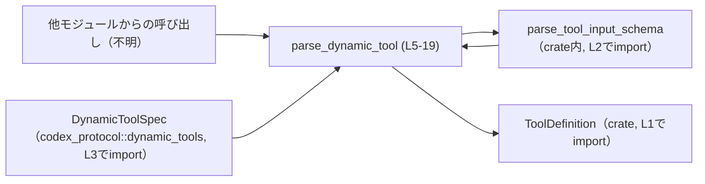
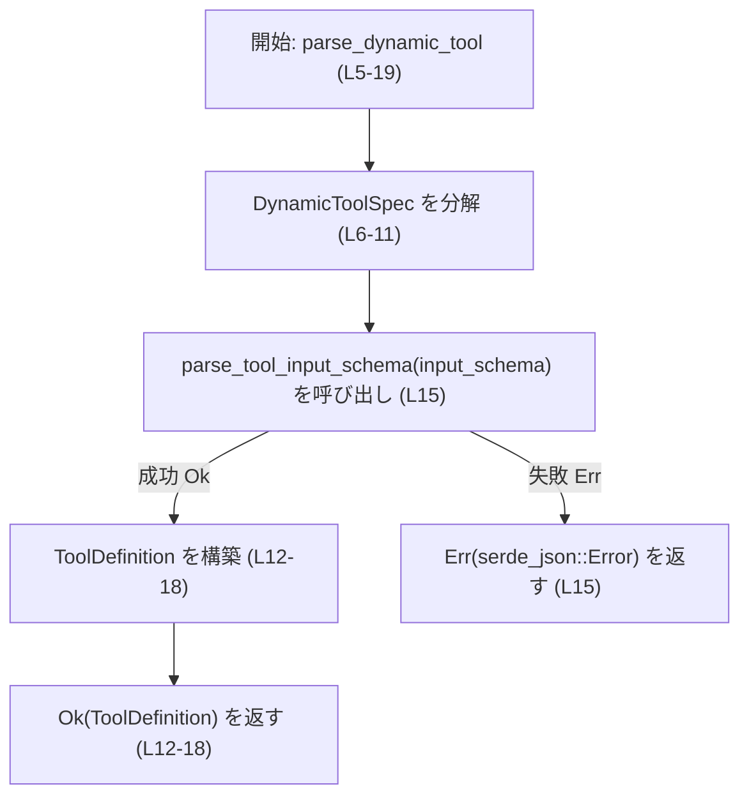
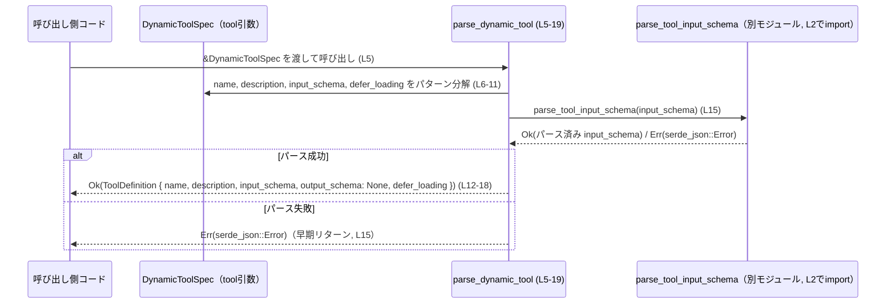

# tools/src/dynamic_tool.rs

## 0. ざっくり一言

`codex_protocol::dynamic_tools::DynamicToolSpec` からクレート内の `ToolDefinition` へ変換しつつ、`input_schema` をパースするためのヘルパー関数を 1 つ提供するモジュールです（`parse_dynamic_tool`、L5-19）。

---

## 1. このモジュールの役割

### 1.1 概要

- このモジュールは **外部プロトコル定義 `DynamicToolSpec`** を、アプリケーション内部で使う **`ToolDefinition` 構造体** に変換する役割を持ちます（L1-3, L5）。
- 変換時に `input_schema` を `parse_tool_input_schema` でパースし、内部表現に変換します（L2, L15）。
- それ以外のフィールド（`name`, `description`, `defer_loading`）はクローン／コピーして `ToolDefinition` に詰め替えます（L6-11, L13-17）。

### 1.2 アーキテクチャ内での位置づけ

このモジュールは「外部仕様 → 内部表現」の変換層に位置すると解釈できます（変換内容はコードから読み取れますが、どこから呼ばれるかはこのチャンクには現れません）。



### 1.3 設計上のポイント

- **純粋関数的な設計**  
  - グローバル状態や可変な共有状態を扱わず、引数から戻り値を生成するだけです（L5-18）。
- **エラーハンドリング**  
  - `parse_tool_input_schema` のエラー（`serde_json::Error`）を `?` 演算子でそのまま呼び出し元へ伝播します（L15, 関数シグネチャ L5）。
- **所有権・クローン**  
  - `name`, `description` は `clone()` して `ToolDefinition` に移します（L13-14）。
  - `defer_loading` はコピー（`*defer_loading`）で移しているため、`Copy` トレイトを実装するスカラー型等であることが分かります（L17）。
- **出力スキーマの扱い**  
  - `ToolDefinition` の `output_schema` フィールドは常に `None` に設定されています（L16）。  
    ここで `output_schema` をどう扱うかは、このモジュールでは責務外となっています。

---

## 2. 主要な機能一覧

- DynamicToolSpec の変換: `DynamicToolSpec` から `ToolDefinition` への一方向変換を行う。
- input_schema のパース: `DynamicToolSpec` の `input_schema` フィールドを `parse_tool_input_schema` で解析し、内部表現に変換する。
- エラー伝播: スキーマパース中に発生した `serde_json::Error` をそのまま呼び出し元へ返す。

### 2.1 コンポーネント一覧（インベントリー）

このファイル内で定義・利用されている主なコンポーネントの一覧です。

| 名前 | 種別 | 公開範囲 | 位置 | 説明 |
|------|------|----------|------|------|
| `parse_dynamic_tool` | 関数 | `pub` | `tools/src/dynamic_tool.rs:L5-19` | `&DynamicToolSpec` から `ToolDefinition` を生成し、`input_schema` をパースする。 |
| `tests` | モジュール | 非公開（`#[cfg(test)]`） | `tools/src/dynamic_tool.rs:L21-23` | このモジュール向けのテストを `dynamic_tool_tests.rs` に委譲する。 |
| `ToolDefinition` | 構造体（外部） | - | 使用: `tools/src/dynamic_tool.rs:L1, L12-18` | 返り値となる内部ツール定義。フィールド `name`, `description`, `input_schema`, `output_schema`, `defer_loading` が存在することが分かる。定義位置はこのチャンクには現れません。 |
| `parse_tool_input_schema` | 関数（外部） | - | 使用: `tools/src/dynamic_tool.rs:L2, L15` | `input_schema` をパースする関数。`serde_json::Error` を返すことが分かるが、詳細なシグネチャはこのチャンクには現れません。 |
| `DynamicToolSpec` | 構造体（外部） | - | 使用: `tools/src/dynamic_tool.rs:L3, L5-11` | 外部プロトコル側のツール定義。フィールド `name`, `description`, `input_schema`, `defer_loading` があることが分かる。定義位置はこのチャンクには現れません。 |

---

## 3. 公開 API と詳細解説

### 3.1 型一覧（構造体・列挙体など）

このファイル自身は型定義を持ちませんが、公開 API の一部として関わる主要な外部型を整理します。

| 名前 | 種別 | 所属 | 役割 / 用途 | 根拠 |
|------|------|------|-------------|------|
| `ToolDefinition` | 構造体（外部） | `crate` 内 | 内部で使うツール定義。`parse_dynamic_tool` の戻り値として構築される（L12-18）。 | `tools/src/dynamic_tool.rs:L1, L12-18` |
| `DynamicToolSpec` | 構造体（外部） | `codex_protocol::dynamic_tools` | 外部プロトコルで使われるツール仕様。`parse_dynamic_tool` の入力引数となる（L3, L5-11）。 | `tools/src/dynamic_tool.rs:L3, L5-11` |

`ToolDefinition` のフィールドは、このファイルから次のように読み取れます（定義そのものは別ファイルです）:

- `name`（L13）
- `description`（L14）
- `input_schema`（L15）
- `output_schema`（L16）
- `defer_loading`（L17）

### 3.2 関数詳細

#### `parse_dynamic_tool(tool: &DynamicToolSpec) -> Result<ToolDefinition, serde_json::Error>`

**概要**

- 引数として渡された `DynamicToolSpec` から、内部表現の `ToolDefinition` を生成します（L5, L12-18）。
- その際、`input_schema` は `parse_tool_input_schema` を用いてパースし、パースに失敗すると `serde_json::Error` を `Err` として返します（L15）。
- その他のフィールドはコピー／クローンするだけで、追加の検証や変換は行っていません（L13-17）。

**引数**

| 引数名 | 型 | 説明 | 根拠 |
|--------|----|------|------|
| `tool` | `&DynamicToolSpec` | 外部プロトコルのツール仕様への参照。フィールド `name`, `description`, `input_schema`, `defer_loading` を持つ。 | `tools/src/dynamic_tool.rs:L3, L5-11` |

**戻り値**

- 型: `Result<ToolDefinition, serde_json::Error>`（L5）
  - `Ok(ToolDefinition)`:
    - `tool` からコピー／クローンした `name`, `description`, `defer_loading` と、
    - `parse_tool_input_schema(input_schema)` の結果を `input_schema` フィールドに格納した `ToolDefinition`（L12-18）。
  - `Err(serde_json::Error)`:
    - `parse_tool_input_schema` が `input_schema` のパースに失敗した場合のエラー（L15）。

**内部処理の流れ（アルゴリズム）**

1. 引数 `tool: &DynamicToolSpec` をパターンマッチで分解し、`name`, `description`, `input_schema`, `defer_loading` を取り出します（L6-11）。
2. `parse_tool_input_schema(input_schema)` を呼び出し、`input_schema` を内部表現へパースします（L15）。
   - この呼び出しで `?` 演算子を使っているため、パースに失敗するとここで `Err(serde_json::Error)` として早期リターンします（L15）。
3. パース結果（`input_schema` フィールド用）とクローンした名前・説明、コピーした `defer_loading` を使って `ToolDefinition` を構築します（L12-18）。
4. `Ok(ToolDefinition { ... })` を呼び出し元へ返します（L12-18）。

内部フローを簡略化した図です:



**Examples（使用例）**

`DynamicToolSpec` や `ToolDefinition` の詳細な定義はこのチャンクにはありませんが、典型的な呼び出しコードは次のようになります。

```rust
use codex_protocol::dynamic_tools::DynamicToolSpec;        // 外部プロトコルのツール仕様
use crate::dynamic_tool::parse_dynamic_tool;               // 本関数
use serde_json::Error;                                     // エラー型

// DynamicToolSpec から ToolDefinition を生成して利用する例
fn handle_tool_spec(tool: &DynamicToolSpec) -> Result<(), Error> {
    // DynamicToolSpec から ToolDefinition に変換
    let tool_def = parse_dynamic_tool(tool)?;              // L5-18 に対応する呼び出し

    // ここで tool_def を使って何らかの処理を行う（詳細はこのチャンクからは不明）
    // e.g. register_tool(tool_def);

    Ok(())
}
```

複数の `DynamicToolSpec` をまとめて内部定義に変換する場合の例です。

```rust
use codex_protocol::dynamic_tools::DynamicToolSpec;
use crate::dynamic_tool::parse_dynamic_tool;
use serde_json::Error;

// Vec<DynamicToolSpec> から Vec<ToolDefinition> に変換するユーティリティ例
fn convert_all_tools(tools: &[DynamicToolSpec]) -> Result<Vec<crate::ToolDefinition>, Error> {
    // 各 spec への参照を回しながら parse_dynamic_tool を適用
    tools
        .iter()
        .map(|spec| parse_dynamic_tool(spec)) // &DynamicToolSpec を渡す
        .collect()                            // どれか一つでも Err ならその Err を返す
}
```

※ 上記コードでは `ToolDefinition` の完全修飾パスは仮のものであり、実際の定義場所はこのチャンクからは分かりません。

**Errors / Panics**

- **Errors**
  - `parse_tool_input_schema(input_schema)` が `Err(serde_json::Error)` を返した場合、この関数も同じエラーを `Err` として返します（L15）。
  - それ以外に、この関数内で `Result` を生成して `Err` を返す箇所はありません（L12-18）。
- **Panics**
  - この関数内には `panic!` や `unwrap` などの明示的なパニック要因はありません（L5-18）。
  - `clone()` や `parse_tool_input_schema` の内部実装がパニックするかどうかは、このチャンクからは分かりません。

**Edge cases（エッジケース）**

- `input_schema` の内容がパース不能な場合
  - `parse_tool_input_schema` が `Err(serde_json::Error)` を返し、この関数も `Err` を返します（L15）。
- `name`・`description` が空文字列等であっても
  - 本関数内では内容に対する検証や制約チェックは行っていません。値をそのまま `clone()` して `ToolDefinition` に渡します（L13-14）。
  - そのような値が許容されるかどうかは、`ToolDefinition` の利用側の設計に依存し、このチャンクからは分かりません。
- `tool` 引数のライフタイム
  - `&DynamicToolSpec` は Rust の通常の参照であり、ヌルにはなりません。
  - 関数内では `tool` からフィールドを取り出し `clone` するだけであり、ミュータブルな操作は行っていません（L6-11, L13-17）。

**使用上の注意点**

- **エラー処理が必須**
  - 戻り値は `Result` であり、`?` または `match` などで必ずエラーを扱う必要があります（L5, L15）。
  - `unwrap()` や `expect()` を安易に使うと、スキーマが不正な場合にパニックするコードになります。
- **入力の検証**
  - `name`, `description`, `defer_loading` については、本関数内で内容の検証や正規化を行っていません（L13-17）。
  - これらの値の妥当性チェックが必要であれば、呼び出し側や別レイヤーで行う必要があります。
- **クローンのコスト**
  - `name`, `description` は `clone()` されるため、もしこれらが大きなデータ型であればコストになる可能性があります（L13-14）。
  - 実際の型（`String` 等）やサイズはこのチャンクからは分かりませんが、多数のツールを一度に変換する際は念頭に置く価値があります。
- **並行性**
  - 関数本体は可変な共有状態を扱っておらず（L5-18）、`tool` に対しても読み取りのみを行います（L6-11）。
  - そのため、「同じ `&DynamicToolSpec` を複数スレッドから読み取り専用で共有し、この関数を並行に呼ぶ」という使い方と、コード上の操作は整合的です。  
    ただし `DynamicToolSpec` やそのフィールド型自体の `Send`/`Sync` 特性は、このチャンクからは分かりません。

### 3.3 その他の関数

このファイルには、上記 `parse_dynamic_tool` 以外の実行ロジックを持つ関数は定義されていません。

- `mod tests;` はテストモジュールであり、実装は `dynamic_tool_tests.rs` にありますが、その内容はこのチャンクには現れません（L21-23）。

---

## 4. データフロー

### 4.1 代表的な処理シナリオ

代表的なシナリオは「外部から取得した `DynamicToolSpec` を内部の `ToolDefinition` に変換する」処理です。

1. 呼び出し側が（ネットワークや設定から）`DynamicToolSpec` を準備する。
2. `parse_dynamic_tool(&spec)` を呼ぶ（L5）。
3. 関数内で `spec` が分解され、`input_schema` が `parse_tool_input_schema` に渡される（L6-11, L15）。
4. パースに成功すれば `ToolDefinition` が生成されて `Ok(...)` が返る（L12-18）。
5. パースに失敗すれば `Err(serde_json::Error)` が返り、呼び出し側でエラー処理を行う。

この流れをシーケンス図で表します。



---

## 5. 使い方（How to Use）

### 5.1 基本的な使用方法

典型的な使用は、「どこかで得られた `DynamicToolSpec` をこの関数に渡し、`ToolDefinition` を得る」という形です。

```rust
use codex_protocol::dynamic_tools::DynamicToolSpec;   // 外部ツール仕様
use crate::dynamic_tool::parse_dynamic_tool;          // 本モジュールの関数
use serde_json::Error;

// ある DynamicToolSpec を内部の ToolDefinition に変換し利用する例
fn register_dynamic_tool(spec: &DynamicToolSpec) -> Result<(), Error> {
    // DynamicToolSpec から内部用 ToolDefinition を生成
    let tool_def = parse_dynamic_tool(spec)?;         // L5-18 に対応

    // 生成した tool_def を、アプリケーション内の登録処理に渡す（処理内容はこのチャンクからは不明）
    // register_tool_definition(tool_def);

    Ok(())
}
```

ここで重要なのは、戻り値が `Result` であるため、`?` などでエラー処理を必ず行う点です（L5, L15）。

### 5.2 よくある使用パターン

1. **単一ツールの登録**

   - 一つの `DynamicToolSpec` に対して一度だけ `parse_dynamic_tool` を呼び、その結果を登録処理に渡す。

2. **複数ツールの一括変換**

   ```rust
   use codex_protocol::dynamic_tools::DynamicToolSpec;
   use crate::dynamic_tool::parse_dynamic_tool;
   use serde_json::Error;

   fn convert_many(specs: &[DynamicToolSpec]) -> Result<Vec<crate::ToolDefinition>, Error> {
       specs.iter().map(parse_dynamic_tool).collect()
   }
   ```

   - どれか一つでも `input_schema` のパースに失敗すると、そこで変換全体が `Err` になります。
   - 成功時には `Vec<ToolDefinition>` が得られます。

### 5.3 よくある間違い（想定しうる誤用）

コードから直接確認できるわけではありませんが、この関数の性質から起こりやすい誤用として、次のようなものが考えられます。

```rust
use codex_protocol::dynamic_tools::DynamicToolSpec;
use crate::dynamic_tool::parse_dynamic_tool;

// NG 例: エラー処理を行わずに unwrap してしまう
fn bad_usage(spec: &DynamicToolSpec) {
    let tool_def = parse_dynamic_tool(spec).unwrap();   // input_schema が不正な場合にパニック
    // ...
}

// OK 例: Result を素直に伝播させる
fn good_usage(spec: &DynamicToolSpec) -> Result<(), serde_json::Error> {
    let tool_def = parse_dynamic_tool(spec)?;           // エラーは呼び出し元へ伝播
    // ...
    Ok(())
}
```

### 5.4 使用上の注意点（まとめ）

- 戻り値 `Result` のエラー（`serde_json::Error`）を必ず処理する必要があります（L5, L15）。
- `name`, `description`, `defer_loading` は検証なしにコピー／クローンされるため（L13-17）、値の妥当性は外部で保証する必要があります。
- 多数のツールを一括変換する場合、`clone()` やスキーマパースがボトルネックになりうるため、必要に応じてバッチ処理やキャッシュを検討する余地があります（ただし具体的なパフォーマンス特性はこのチャンクからは分かりません）。
- 関数自体は状態を持たない純粋関数であり、同じ `DynamicToolSpec` からは常に同じ `ToolDefinition` が得られます（L5-18）。

---

## 6. 変更の仕方（How to Modify）

### 6.1 新しい機能を追加する場合

このモジュールに機能を追加する典型的なケースとしては、「`DynamicToolSpec` から `ToolDefinition` への変換ロジックを拡張したい」場合が考えられます。

例として、`DynamicToolSpec` に新しいフィールドが追加され、それを `ToolDefinition` にも反映したくなった場合:

1. `ToolDefinition` に対応するフィールドを追加する（定義ファイルはこのチャンクからは不明）。
2. `DynamicToolSpec { .. } = tool;` のパターンに新しいフィールドを追加する（L6-11 を修正）。
3. `ToolDefinition { .. }` の初期化部分に、そのフィールドを設定する（L12-18 を修正）。
4. 必要に応じて、そのフィールドに対するパース／検証処理を追加し、エラー型の扱いを整理する。

### 6.2 既存の機能を変更する場合

既存の `parse_dynamic_tool` の挙動を変更する際は、次の点に注意する必要があります。

- **エラー型の契約**
  - 現状の返り値は `Result<ToolDefinition, serde_json::Error>` です（L5）。  
    エラー型を変えたりラップしたりする場合、呼び出し側のコードや上位 API のシグネチャへの影響を確認する必要があります。
- **フィールドの有無**
  - `ToolDefinition` のフィールドセット（`name`, `description`, `input_schema`, `output_schema`, `defer_loading`）は、構築コード（L12-18）に直接現れています。  
    これらのフィールド名や存在を変えるとコンパイルエラーになるため、定義変更時には本ファイルの更新が必須です。
- **スキーマパースの振る舞い**
  - `parse_tool_input_schema` のシグネチャや挙動を変える場合（例えばエラー型を変える等）、本関数の戻り値や `?` の扱いも合わせて変更する必要があります（L2, L15）。
- **テスト**
  - `#[cfg(test)] mod tests;` により、テストは `dynamic_tool_tests.rs` にあることが分かります（L21-23）。  
    振る舞いを変えた際には、このテストファイルの内容を確認・更新する必要があります（テストの中身はこのチャンクには現れません）。

---

## 7. 関連ファイル

このモジュールと密接に関係するファイル・型の一覧です。

| パス / シンボル | 役割 / 関係 | 根拠 |
|-----------------|------------|------|
| `tools/src/dynamic_tool_tests.rs` | `#[path = "dynamic_tool_tests.rs"]` で指定されているテストコード。`parse_dynamic_tool` の振る舞い検証を行っていると推測されるが、内容はこのチャンクには現れません。 | `tools/src/dynamic_tool.rs:L21-22` |
| `crate::ToolDefinition` | `parse_dynamic_tool` の返り値構造体。フィールド構成は本ファイル内の初期化コードから一部が分かるが、定義ファイルの場所はこのチャンクには現れません。 | `tools/src/dynamic_tool.rs:L1, L12-18` |
| `crate::parse_tool_input_schema` | `input_schema` をパースする関数。`serde_json::Error` を返す `Result` 型であることが間接的に分かるが、詳細はこのチャンクには現れません。 | `tools/src/dynamic_tool.rs:L2, L15` |
| `codex_protocol::dynamic_tools::DynamicToolSpec` | 外部プロトコルのツール定義。`parse_dynamic_tool` の入力引数であり、フィールド構成はパターン分解から一部が分かります。定義ファイルは外部クレート内にあります。 | `tools/src/dynamic_tool.rs:L3, L5-11` |

このファイルから読み取れる限りでは、明確なバグやセキュリティホールを示すコード（例えば危険なアンセーフ操作や未検証の外部入力の直接実行など）は含まれていません（L1-19）。  
ただし、`input_schema` の内容やその利用方法はこのチャンクには現れず、全体としての安全性評価には他モジュールの確認が必要です。
