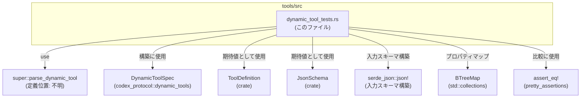
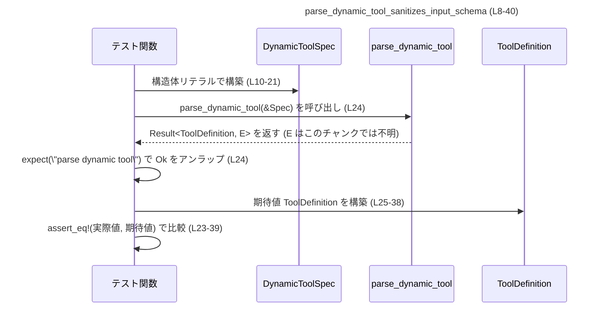

# tools/src/dynamic_tool_tests.rs コード解説

## 0. ざっくり一言

`parse_dynamic_tool` 関数が、動的ツール仕様 `DynamicToolSpec` から内部表現 `ToolDefinition` を生成する際の挙動を検証する単体テストが 2 件定義されたファイルです（tools/src/dynamic_tool_tests.rs:L8-40, L42-68）。

---

## 1. このモジュールの役割

### 1.1 概要

- このモジュールは、`parse_dynamic_tool` が
  - **入力スキーマを安全な内部スキーマ表現にサニタイズすること**（`JsonSchema` を用いた構造）と（tools/src/dynamic_tool_tests.rs:L13-21, L28-35）
  - **`defer_loading` フラグを正しく伝播させること**（tools/src/dynamic_tool_tests.rs:L20, L37, L51, L65）
  を検証するために存在します。
- すべて `#[test]` 関数であり、テストに失敗した場合は panic により異常終了します（tools/src/dynamic_tool_tests.rs:L8, L42, L23-39, L54-67）。

### 1.2 アーキテクチャ内での位置づけ

このファイルはテスト専用モジュールであり、親モジュールに定義された `parse_dynamic_tool` と、外部クレート／crate 内部の型に依存しています（tools/src/dynamic_tool_tests.rs:L1-6）。



- `super::parse_dynamic_tool` を呼び出して `ToolDefinition` を生成し（tools/src/dynamic_tool_tests.rs:L24, L55）、
- 期待される `ToolDefinition` を同じ構造体リテラルで組み立てて比較する、という構造になっています（tools/src/dynamic_tool_tests.rs:L25-38, L56-66）。

`parse_dynamic_tool` 自体の実装や `JsonSchema` / `ToolDefinition` の定義は、このチャンクには現れません。

### 1.3 設計上のポイント

- **テスト駆動の契約定義**  
  - テストは `assert_eq!` で構造体の完全一致を要求しており、`parse_dynamic_tool` の振る舞いをかなり詳細なレベルで固定しています（tools/src/dynamic_tool_tests.rs:L23-39, L54-67）。
- **エラーハンドリングの方針**  
  - `parse_dynamic_tool` は `Result` を返す関数であり（`expect("parse dynamic tool")` の使用から分かる）、テストでは Err を「テスト失敗の panic」として扱います（tools/src/dynamic_tool_tests.rs:L24, L55）。
- **状態と並行性**  
  - 各テストはローカルな `DynamicToolSpec` と `ToolDefinition` を生成して比較しており、共有可変状態は一切使っていません（tools/src/dynamic_tool_tests.rs:L10-21, L25-38, L44-52, L56-66）。  
  - そのため、Rust のテストランナーがテストを並列実行しても競合状態が発生しない構造になっています（このチャンクのコードを見る限り）。

---

## 2. 主要な機能一覧

このファイルが提供する「機能」はすべてテスト関数です。

- `parse_dynamic_tool_sanitizes_input_schema`: 入力 JSON スキーマから `JsonSchema::object` への変換・サニタイズの挙動を検証します（tools/src/dynamic_tool_tests.rs:L8-40）。
- `parse_dynamic_tool_preserves_defer_loading`: `DynamicToolSpec.defer_loading` が `ToolDefinition.defer_loading` にそのままコピーされることを検証します（tools/src/dynamic_tool_tests.rs:L42-67）。

### コンポーネント（関数）一覧

| 名前 | 種別 | 役割 / 用途 | 定義位置 |
|------|------|------------|----------|
| `parse_dynamic_tool_sanitizes_input_schema` | テスト関数 | サニタイズされた `input_schema` の構造（特に `JsonSchema::object` と `JsonSchema::string` の生成結果）を検証する | tools/src/dynamic_tool_tests.rs:L8-40 |
| `parse_dynamic_tool_preserves_defer_loading` | テスト関数 | `DynamicToolSpec.defer_loading` の値が `ToolDefinition.defer_loading` に保持されることを検証する | tools/src/dynamic_tool_tests.rs:L42-67 |

---

## 3. 公開 API と詳細解説

このファイル自身はライブラリ API を公開しませんが、`parse_dynamic_tool` の契約（どう振る舞うべきか）をテストとして示しています。

### 3.1 型一覧（構造体・列挙体など）

このファイル内で「利用」している主な型は次のとおりです。

| 名前 | 種別 | 役割 / 用途 | 定義位置 / 備考 |
|------|------|------------|-----------------|
| `DynamicToolSpec` | 構造体 | 動的ツールの外部仕様。`name`, `description`, `input_schema`, `defer_loading` フィールドを持つことが、構造体リテラルから分かります（tools/src/dynamic_tool_tests.rs:L10-21, L44-52）。 | `codex_protocol::dynamic_tools::DynamicToolSpec`。定義はこのチャンクには現れません。 |
| `ToolDefinition` | 構造体 | 内部で利用されるツール定義。`name`, `description`, `input_schema`, `output_schema`, `defer_loading` フィールドを持つことが、構造体リテラルから分かります（tools/src/dynamic_tool_tests.rs:L25-38, L56-66）。 | `crate::ToolDefinition`。定義はこのチャンクには現れません。 |
| `JsonSchema` | 型（列挙体または構造体など、詳細不明） | `JsonSchema::object` および `JsonSchema::string` といった関連関数を通じて、ツールの `input_schema` を Rust 側で表現するために使用されています（tools/src/dynamic_tool_tests.rs:L28-35, L59-63）。 | `crate::JsonSchema`。具体的な内部構造はこのチャンクには現れません。 |
| `BTreeMap` | 構造体 | JSON スキーマの `properties` 部分をキー順に保持するために使用されています（tools/src/dynamic_tool_tests.rs:L6, L28-32, L59-60）。 | `std::collections::BTreeMap` |
| `serde_json::Value` | 列挙体 | `serde_json::json!` マクロで生成される任意の JSON 値として、`DynamicToolSpec.input_schema` に格納されています（tools/src/dynamic_tool_tests.rs:L13-21, L47-50）。 | 定義は `serde_json` クレート側にあり、このチャンクには現れません。 |

### 3.2 関数詳細

#### `parse_dynamic_tool_sanitizes_input_schema()`

**概要**

- `parse_dynamic_tool` が、最低限の情報しか持たない JSON スキーマ（`properties.id.description` のみ）を、`JsonSchema::object` / `JsonSchema::string` を用いた内部表現にサニタイズしていることを検証するテストです（tools/src/dynamic_tool_tests.rs:L13-21, L28-35）。

**引数**

- なし（テスト関数であり、呼び出しはテストランナーが行います）（tools/src/dynamic_tool_tests.rs:L9）。

**戻り値**

- 戻り値型は `()` です。Rust のテスト関数として、成功時は何も返さず、失敗時は panic します（tools/src/dynamic_tool_tests.rs:L8-40）。

**内部処理の流れ**

1. `DynamicToolSpec` の構築  
   - `name`, `description`, `input_schema`, `defer_loading` を設定した構造体リテラルを作成します（tools/src/dynamic_tool_tests.rs:L10-21）。  
   - `input_schema` には `"properties.id.description"` だけを持つ JSON オブジェクトが設定されており、`type` や `required` などは含まれていません（tools/src/dynamic_tool_tests.rs:L13-18）。
2. `parse_dynamic_tool` の呼び出しと `Result` の解包  
   - `parse_dynamic_tool(&tool)` を呼び出し、`expect("parse dynamic tool")` により `Result` から `ToolDefinition` を取り出します（tools/src/dynamic_tool_tests.rs:L24）。  
   - Err が返った場合には `expect` によって panic し、テストは失敗します。
3. 期待される `ToolDefinition` の構築  
   - `ToolDefinition` の構造体リテラルを直接記述し、`input_schema` には `JsonSchema::object(...)` を使ってオブジェクトスキーマを構築します（tools/src/dynamic_tool_tests.rs:L25-35）。  
   - `JsonSchema::object` の第一引数には `BTreeMap::from` を通じて `"id"` → `JsonSchema::string(Some("Ticket identifier".to_string()))` というマッピングを渡しています（tools/src/dynamic_tool_tests.rs:L28-32）。  
   - `required` と `additional_properties` には `None` が渡されており、省略された状態のスキーマであることが分かります（tools/src/dynamic_tool_tests.rs:L33-35）。
4. 実際値と期待値の比較  
   - `assert_eq!` マクロで、`parse_dynamic_tool` の戻り値と期待される `ToolDefinition` を比較します（tools/src/dynamic_tool_tests.rs:L23-39）。  
   - どこか 1 フィールドでも異なれば、diff を表示してテストが失敗します（`pretty_assertions::assert_eq` の利用、tools/src/dynamic_tool_tests.rs:L5, L23）。

**Examples（使用例）**

このテストは、そのまま `parse_dynamic_tool` の基本的な使い方のサンプルにもなっています。

```rust
use codex_protocol::dynamic_tools::DynamicToolSpec;       // DynamicToolSpec 型（定義は別モジュール）
                                                           // tools/src/dynamic_tool_tests.rs:L4, L10-21 を参考
fn example(tool: &DynamicToolSpec) {
    // parse_dynamic_tool は &DynamicToolSpec を受け取り Result を返す関数です
    // 正常系では ToolDefinition を得られます（エラー型はこのチャンクからは不明）。
    let def = parse_dynamic_tool(tool).expect("parse dynamic tool"); // tools/src/dynamic_tool_tests.rs:L24

    // def は ToolDefinition 型であり、name や description, input_schema などを持ちます。
    // 詳細なフィールド構造は tests 内の期待値と同様です（tools/src/dynamic_tool_tests.rs:L25-38）。
}
```

> 実際のモジュールパス（`parse_dynamic_tool` がどのモジュールに属するか）は、  
> このチャンクには現れないため、`use` のパス指定は省略しています。

**Errors / Panics**

- `parse_dynamic_tool(&tool)` が `Err` を返した場合、`expect("parse dynamic tool")` によって panic します（tools/src/dynamic_tool_tests.rs:L24）。
- `parse_dynamic_tool` が `Ok` を返しても、返された `ToolDefinition` と期待値が一致しない場合、`assert_eq!` により panic します（tools/src/dynamic_tool_tests.rs:L23-39）。

**Edge cases（エッジケース）**

- `input_schema` が `"properties"` とその中の `"description"` だけを持ち、`type` すら含まない不完全な JSON であるという点が重要なテストケースです（tools/src/dynamic_tool_tests.rs:L13-18）。  
  - ここから、「`parse_dynamic_tool` は `type` が指定されていないプロパティに対して、デフォルトで `JsonSchema::string` を選択する」ような挙動が期待されていることが読み取れますが、実装はこのチャンクには現れません。  
- `required` や `additional_properties` が指定されていない場合、`JsonSchema::object` 側も `None` となることが期待されています（tools/src/dynamic_tool_tests.rs:L33-35）。

**使用上の注意点**

- テストは構造体の「完全一致」を要求するため、`ToolDefinition` や `JsonSchema` に新しいフィールドを追加した場合でも、期待値側を更新しないとテストが失敗します（tools/src/dynamic_tool_tests.rs:L25-38）。  
- `parse_dynamic_tool` のエラーケース（`Err` を返す条件）はこのファイルではテストされていません。そのため、異常系の振る舞いを変更する場合は、別途テストを追加する必要があります（このチャンクには異常系テストは現れません）。

---

#### `parse_dynamic_tool_preserves_defer_loading()`

**概要**

- `DynamicToolSpec.defer_loading` が、変換後の `ToolDefinition.defer_loading` にそのままコピーされることを検証するテストです（tools/src/dynamic_tool_tests.rs:L44-52, L56-66）。

**引数**

- なし（テスト関数）（tools/src/dynamic_tool_tests.rs:L43）。

**戻り値**

- `()`（成功時は何も返さない、失敗時は panic）（tools/src/dynamic_tool_tests.rs:L42-67）。

**内部処理の流れ**

1. `DynamicToolSpec` の構築  
   - `name`, `description`, `input_schema`, `defer_loading` を指定した構造体リテラルを構築します（tools/src/dynamic_tool_tests.rs:L44-52）。  
   - `input_schema` は `"type": "object"` と空の `"properties"` を持つ JSON であり、ここではスキーマ内容そのものではなく `defer_loading` の値が主題です（tools/src/dynamic_tool_tests.rs:L47-50）。
2. `parse_dynamic_tool` の呼び出し  
   - `parse_dynamic_tool(&tool).expect("parse dynamic tool")` で `ToolDefinition` を得ます（tools/src/dynamic_tool_tests.rs:L55）。  
   - Err の場合は panic し、テスト失敗となります。
3. 期待される `ToolDefinition` の構築  
   - 空の `BTreeMap` を用いて、プロパティの無いオブジェクトスキーマを表す `JsonSchema::object` を `input_schema` に設定します（tools/src/dynamic_tool_tests.rs:L59-63）。  
   - `defer_loading` フィールドには `true` を指定しており、入力の値が保持されることを確認しています（tools/src/dynamic_tool_tests.rs:L51, L65）。
4. `assert_eq!` による比較  
   - 実際の `ToolDefinition` と期待値を比較し、一致しなければ panic します（tools/src/dynamic_tool_tests.rs:L54-67）。

**Examples（使用例）**

`defer_loading` を尊重した呼び出し例は、テストコードとほぼ同じ形になります。

```rust
use codex_protocol::dynamic_tools::DynamicToolSpec;       // tools/src/dynamic_tool_tests.rs:L44-52 を参考

fn example_defer_loading() {
    let tool = DynamicToolSpec {
        name: "lookup_ticket".to_string(),
        description: "Fetch a ticket".to_string(),
        input_schema: serde_json::json!({
            "type": "object",
            "properties": {}
        }),
        defer_loading: true,                               // 遅延ロードを有効化
    };

    let def = parse_dynamic_tool(&tool).expect("parse dynamic tool"); // tools/src/dynamic_tool_tests.rs:L55

    // テストから読み取れる契約として、ここで def.defer_loading は true のままであることが期待されます。
}
```

**Errors / Panics**

- `parse_dynamic_tool` が Err を返した場合は `expect` により panic します（tools/src/dynamic_tool_tests.rs:L55）。
- 得られた `ToolDefinition.defer_loading` が `true` でなかった場合、`assert_eq!` による比較でテストが失敗します（tools/src/dynamic_tool_tests.rs:L54-67）。

**Edge cases（エッジケース）**

- `input_schema` が空オブジェクト（`properties: {}`）であっても、`defer_loading` の値は保持されるべきである、という点を明文化しています（tools/src/dynamic_tool_tests.rs:L47-52, L59-63）。  
- `output_schema` が `None` である状態も同時に検証しており（tools/src/dynamic_tool_tests.rs:L64）、`parse_dynamic_tool` が `output_schema` を勝手に埋めないことが期待されています。

**使用上の注意点**

- `defer_loading` の意味（どのタイミングでツールをロードするか）はこのチャンクからは分かりませんが、「変換処理がこのフラグを変更してはいけない」という契約は明確です（tools/src/dynamic_tool_tests.rs:L51, L65）。  
- 将来 `parse_dynamic_tool` が内部で `defer_loading` を上書きする仕様に変わる場合、このテストは必ず失敗するため、仕様変更時にはテストの見直しが必要になります。

### 3.3 その他の関数

このファイルに他の関数・メソッド定義はありません（tools/src/dynamic_tool_tests.rs 全体を参照）。

---

## 4. データフロー

代表的なシナリオとして、`parse_dynamic_tool_sanitizes_input_schema` のデータフローを示します。

### データフローの概要

- テスト関数内で `DynamicToolSpec` がローカルに構築されます（tools/src/dynamic_tool_tests.rs:L10-21）。
- `&DynamicToolSpec` が `parse_dynamic_tool` に渡され、`Result` として `ToolDefinition` が返ります（tools/src/dynamic_tool_tests.rs:L24）。
- `expect` により `Result` から値が取り出され、期待値として組み立てた `ToolDefinition` と比較されます（tools/src/dynamic_tool_tests.rs:L23-39）。

### シーケンス図



- `Func` の内部で何が行われるか（`JsonSchema` の生成ロジックなど）は、このチャンクには現れません。  
  ただし、テストの期待値から、「`properties.id.description` のみを持つ JSON から `JsonSchema::object` / `JsonSchema::string` が生成される」ことは推測できます（tools/src/dynamic_tool_tests.rs:L13-18, L28-32）。

---

## 5. 使い方（How to Use）

このファイルはテスト用ですが、`parse_dynamic_tool` の実用的な使い方の「雛形」としても利用できます。

### 5.1 基本的な使用方法

1. 外部仕様 `DynamicToolSpec` を構築する。  
   - 必須フィールドとして `name`, `description`, `input_schema`, `defer_loading` を設定します（tools/src/dynamic_tool_tests.rs:L10-21, L44-52）。
2. `parse_dynamic_tool(&spec)` を呼び出す。  
   - `&` により借用を渡しているため、`DynamicToolSpec` の所有権は移動しません（tools/src/dynamic_tool_tests.rs:L24, L55）。
3. `Result` を `expect` や `?` などで処理し、`ToolDefinition` を得る。  
4. 返された `ToolDefinition` の `input_schema` / `defer_loading` などを利用する。

サンプルコード:

```rust
use codex_protocol::dynamic_tools::DynamicToolSpec;       // tools/src/dynamic_tool_tests.rs:L4
// parse_dynamic_tool, ToolDefinition, JsonSchema のモジュールパスはこのチャンクからは不明

fn build_and_parse_tool() {
    // 1. DynamicToolSpec を構築
    let tool = DynamicToolSpec {
        name: "lookup_ticket".to_string(),                // tools/src/dynamic_tool_tests.rs:L11, L45
        description: "Fetch a ticket".to_string(),        // tools/src/dynamic_tool_tests.rs:L12, L46
        input_schema: serde_json::json!({                 // tools/src/dynamic_tool_tests.rs:L13, L47
            "type": "object",
            "properties": {
                "id": { "description": "Ticket identifier" }
            }
        }),
        defer_loading: false,                             // tools/src/dynamic_tool_tests.rs:L20
    };

    // 2. parse_dynamic_tool を呼び出し
    let def = parse_dynamic_tool(&tool)                   // &tool で借用を渡す（所有権は保持）
        .expect("parse dynamic tool");                    // Err の場合は panic（tests と同様）

    // 3. ToolDefinition を利用
    // def.name, def.description, def.input_schema などを使ってアプリケーション側の処理に渡す
}
```

### 5.2 よくある使用パターン

テストから読み取れる範囲で、次のパターンが想定されます。

- **最小限スキーマからのサニタイズ**  
  - プロパティに `description` しかないような簡略スキーマを受け取り、`JsonSchema` 形式に変換して利用する（tools/src/dynamic_tool_tests.rs:L13-18, L28-32）。
- **遅延ロードフラグ付きのツール**  
  - `defer_loading: true` を指定したツールを登録し、必要になるまで実際のロードを遅らせる。その際 `parse_dynamic_tool` はこのフラグを変えない（tools/src/dynamic_tool_tests.rs:L51, L65）。

### 5.3 よくある間違い

このテストから推測される誤用と、その修正例です。

```rust
use codex_protocol::dynamic_tools::DynamicToolSpec;

// 誤りの可能性がある例: Result を無視している
fn misuse(tool: &DynamicToolSpec) {
    // 戻り値の Result を無視すると、エラーが見逃される
    let _ = parse_dynamic_tool(tool);                    // NG: エラーをハンドリングしていない
}

// 正しい例: expect や match で Result を処理する
fn correct_use(tool: &DynamicToolSpec) {
    let def = parse_dynamic_tool(tool)
        .expect("parse dynamic tool");                   // tests と同様に Err を panic に変換する
    // ここで def を利用する
}
```

- `parse_dynamic_tool` が `Result` を返すことは、このテストで `expect` を呼び出していることから確実です（tools/src/dynamic_tool_tests.rs:L24, L55）。
- 実際のアプリケーションコードでは `expect` の代わりに `match` や `?` を用いることもあると考えられますが、その部分はこのチャンクには現れません。

### 5.4 使用上の注意点（まとめ）

- **エラーハンドリング**  
  - `parse_dynamic_tool` の Err ケースはこのテストではカバーされていません。実運用では、JSON スキーマが不正な場合などにどう振る舞うかを確認し、適切にハンドリングする必要があります（このチャンクには Err の条件は現れません）。
- **並行性**  
  - 関数は `&DynamicToolSpec` を取るだけなので、少なくともこのファイルからは「共有可変状態」を前提とした設計ではないことが分かります（tools/src/dynamic_tool_tests.rs:L24, L55）。  
  - `parse_dynamic_tool` 自体がスレッドセーフかどうか（`Send`/`Sync`）は、このチャンクからは判断できません。
- **仕様の固定度**  
  - テストが構造体リテラルで期待値を指定しているため、`ToolDefinition` / `JsonSchema` の内部表現を変更するとテスト修正が必要になります（tools/src/dynamic_tool_tests.rs:L25-38, L56-66）。

---

## 6. 変更の仕方（How to Modify）

### 6.1 新しい機能を追加する場合（テストケースの追加）

`parse_dynamic_tool` に新しい仕様を追加した場合、対応するテストをこのファイルに追加するのが自然です。

1. **どのファイルに追加するか**  
   - `parse_dynamic_tool` のテストであれば、この `dynamic_tool_tests.rs` に新しい `#[test]` 関数を追加するのが一貫した構成です（tools/src/dynamic_tool_tests.rs:L8, L42）。
2. **依存する型・関数**  
   - 既存のテスト同様、`DynamicToolSpec`, `ToolDefinition`, `JsonSchema` を利用し、期待値を構造体リテラルで記述するスタイルに揃えると分かりやすくなります（tools/src/dynamic_tool_tests.rs:L10-21, L25-38, L44-52, L56-66）。
3. **呼び出し元**  
   - すべてのテストは `parse_dynamic_tool(&tool).expect("parse dynamic tool")` という形で呼び出しているため、新しいテストもこのスタイルに倣うと統一感があります（tools/src/dynamic_tool_tests.rs:L24, L55）。

### 6.2 既存の機能を変更する場合（`parse_dynamic_tool` の仕様変更）

`parse_dynamic_tool` の仕様を変更する場合、以下の点を確認する必要があります。

- **入力スキーマのサニタイズ仕様の変更**  
  - 例えば、`id` プロパティのデフォルト型を `string` 以外に変えた場合や、`required` の扱いを変更した場合は、`parse_dynamic_tool_sanitizes_input_schema` の期待値（`JsonSchema::object` / `JsonSchema::string` 部分）を更新する必要があります（tools/src/dynamic_tool_tests.rs:L28-35）。
- **`defer_loading` の扱いの変更**  
  - もし将来 `parse_dynamic_tool` が `defer_loading` を内部ロジックによって書き換える仕様に変わる場合、`parse_dynamic_tool_preserves_defer_loading` は仕様と矛盾するため、テストの削除または期待値の変更を検討する必要があります（tools/src/dynamic_tool_tests.rs:L51, L65）。
- **エラー条件の追加**  
  - 新たなエラー条件を追加した場合、このファイルにはエラー系テストが存在しないため、別途 `Result::Err` を期待するテストケースを追加しない限り、変更が十分に検証されたとは言えません（このチャンクには Err を期待するテストは現れません）。

---

## 7. 関連ファイル

このファイルと密接に関係するモジュール・型は次のとおりです。

| パス / モジュール | 役割 / 関係 |
|------------------|------------|
| `super` モジュール | `super::parse_dynamic_tool` を定義する親モジュールです（tools/src/dynamic_tool_tests.rs:L1, L24, L55）。具体的なファイルパスはこのチャンクには現れませんが、このモジュールが本テストの対象となる実装を提供します。 |
| `crate::JsonSchema` | `JsonSchema::object`, `JsonSchema::string` などの関連関数を通じて、ツールの `input_schema` を内部表現に変換するための型です（tools/src/dynamic_tool_tests.rs:L2, L28-35, L59-63）。定義は別ファイルにあります。 |
| `crate::ToolDefinition` | `parse_dynamic_tool` の戻り値型であり、名前や説明、入出力スキーマ、`defer_loading` を保持します（tools/src/dynamic_tool_tests.rs:L3, L25-38, L56-66）。 |
| `codex_protocol::dynamic_tools::DynamicToolSpec` | 外部プロトコル側の動的ツール仕様を表す型で、テストで入力として利用されています（tools/src/dynamic_tool_tests.rs:L4, L10-21, L44-52）。 |
| `serde_json` | `serde_json::json!` マクロにより、`DynamicToolSpec.input_schema` に渡す JSON を簡潔に構築するために使用されています（tools/src/dynamic_tool_tests.rs:L13-21, L47-50）。 |
| `pretty_assertions::assert_eq` | テスト失敗時に分かりやすい差分を表示するための `assert_eq!` マクロを提供します（tools/src/dynamic_tool_tests.rs:L5, L23, L54）。 |

このチャンクには `parse_dynamic_tool` 本体や `JsonSchema` / `ToolDefinition` の定義は現れないため、より詳細な仕様を知るには、それらの定義ファイルを参照する必要があります。
