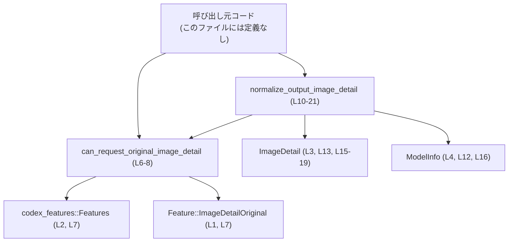
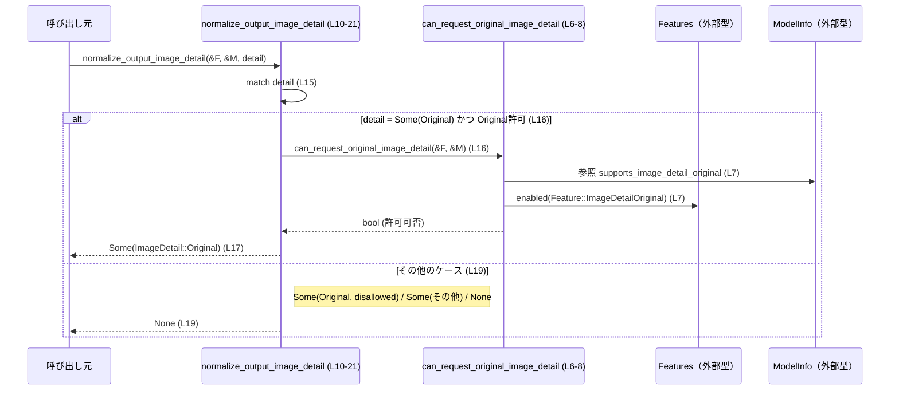

# tools/src/image_detail.rs コード解説

## 0. ざっくり一言

`ImageDetail::Original` を扱うための小さなユーティリティで、  
モデルの能力 (`ModelInfo`) と機能フラグ (`Features`) に基づいて

- original 詳細を要求できるかどうかの判定
- 出力用 `Option<ImageDetail>` の正規化（許可されない指定を落とす）

を行うモジュールです（`tools/src/image_detail.rs:L1-4, L6-21`）。

---

## 1. このモジュールの役割

### 1.1 概要

このモジュールは、`codex_protocol::models::ImageDetail` のうち original 詳細を安全に扱うことを目的とし（L3）、

- `can_request_original_image_detail` で original を要求可能かどうかを判定し（L6-8）
- `normalize_output_image_detail` で与えられた `Option<ImageDetail>` を、  
  「許可された場合のみ `Some(Original)` を通し、それ以外は `None` にする」という形に正規化します（L10-21）

という機能を提供します。

### 1.2 アーキテクチャ内での位置づけ

このファイルは以下の外部コンポーネントに依存します（L1-4）。

- `codex_features::Feature` と `codex_features::Features`  
  → original 詳細機能 `Feature::ImageDetailOriginal` の有効/無効を判定するために使用します（L1-2, L7）。
- `codex_protocol::models::ImageDetail`  
  → 画像詳細レベルを表す型で、少なくとも `ImageDetail::Original` を扱います（L3, L13, L15-19）。
- `codex_protocol::openai_models::ModelInfo`  
  → モデルが original 詳細をサポートしているかどうかを示す `supports_image_detail_original` を持ちます（L4, L7）。

呼び出し元はこのファイルには現れませんが、典型的には「リクエストを組み立てる層」からこれらの関数が呼び出される構造と考えられます（呼び出し元の具体名はこのチャンクには現れない）。

依存関係を簡略図にすると次のようになります。



### 1.3 設計上のポイント

- **ステートレスな純粋関数**  
  どちらの関数も構造体やグローバル状態を持たず、入力（`&Features`, `&ModelInfo`, `Option<ImageDetail>`）だけから結果を計算します（L6-8, L10-21）。  
  引数はすべて不変参照（`&`）であり、このファイル内でミューテーションはありません。

- **機能フラグ + モデル能力の AND 条件**  
  `can_request_original_image_detail` は  
  `model_info.supports_image_detail_original && features.enabled(Feature::ImageDetailOriginal)` をそのまま返しています（L7）。  
  つまり、「モデルが original をサポートしている かつ 機能フラグが有効」でなければ original は要求不可、という契約になっています。

- **正規化の挙動を一点に集約**  
  `normalize_output_image_detail` は、original の扱いに関するロジックを 1 箇所に集約しています（L10-21）。  
  `match` とガードを用いて、
  - 許可されている `Some(Original)` のみをそのまま通す（L16-17）
  - それ以外（許可されない `Original` やその他の `ImageDetail`、`None`）はすべて `None` にする（L19）
  という明確なポリシーを持ちます。

- **エラーを返さずサイレントに無効化**  
  サポートされない `ImageDetail` や original の指定は、`Err` を返さず `None` に折りたたまれます（L19）。  
  呼び出し側は「detail が `None` にされうる」ことを前提とした設計が必要になります。

- **並行性への配慮（このファイル内で確認できる範囲）**  
  関数はすべて引数のみを読み取り、副作用がありません（L6-21）。  
  このため、このファイルに限って見れば、複数スレッドから同じ関数を呼び出してもレースコンディションを引き起こすようなコードは含まれていません（ただし `Features` や `ModelInfo` の内部実装はこのチャンクには現れないため、そのスレッド安全性は不明です）。

---

## 2. 主要な機能一覧

### 2.1 コンポーネントインベントリー（関数・モジュール）

このファイルに定義されるコンポーネントは次のとおりです。

| 名前 | 種別 | 役割 / 概要 | 定義位置（根拠） |
|------|------|-------------|------------------|
| `can_request_original_image_detail` | 関数 | モデルと機能フラグに基づき、original 詳細をリクエスト可能かどうかを判定する | `tools/src/image_detail.rs:L6-8` |
| `normalize_output_image_detail` | 関数 | 入力の `Option<ImageDetail>` を正規化し、許可された場合のみ `Some(Original)` を保持し、それ以外を `None` にする | `tools/src/image_detail.rs:L10-21` |
| `tests` | モジュール | テストモジュール。`#[cfg(test)]` と `#[path = "image_detail_tests.rs"]` で外部のテストファイルを読み込む | `tools/src/image_detail.rs:L23-25` |

### 2.2 主要な機能（箇条書き）

- original 詳細サポート判定:  
  - `can_request_original_image_detail` が `Features` と `ModelInfo` を組み合わせて original が許可されているかどうかを返します（L6-8）。
- ImageDetail 出力の正規化:  
  - `normalize_output_image_detail` が、許可されていない original やその他の `ImageDetail`、`None` をすべて `None` に正規化し、許可された original のみを通します（L15-19）。

---

## 3. 公開 API と詳細解説

### 3.1 型一覧（構造体・列挙体など）

このファイル内で新しく定義される型はありません。  
外部からインポートされ、引数や戻り値として利用されている主な型を整理します。

| 名前 | 種別（このファイルから分かる範囲） | 役割 / 用途 | このファイル内での根拠 |
|------|-----------------------------------|-------------|--------------------------|
| `Feature` | 型（外部定義） | 機能フラグの種類を表す型で、少なくとも `ImageDetailOriginal` という項目を持つ | インポートと `Feature::ImageDetailOriginal` の使用（L1, L7） |
| `Features` | 型（外部定義） | 機能フラグ集合を管理する型で、`enabled` メソッドにより指定フラグが有効か判定できる | インポートと `features.enabled(...)` 呼び出しから（L2, L7, L11） |
| `ImageDetail` | 型（外部定義） | 画像詳細レベルを表す型で、少なくとも `Original` という関連項目（通常は列挙体のバリアント）を持つ | インポートと `Option<ImageDetail>`、`ImageDetail::Original` の使用から（L3, L13, L15-19） |
| `ModelInfo` | 型（外部定義） | モデルの能力情報を持つ型で、`supports_image_detail_original` というブール値のフィールドまたはアクセサを持つ | インポートと `model_info.supports_image_detail_original` の使用から（L4, L7, L12, L16） |

> これらの型の具体的な定義（構造体か列挙体かなど）や他のフィールド・バリアントは、このファイルには現れません。

### 3.2 関数詳細

#### `can_request_original_image_detail(features: &Features, model_info: &ModelInfo) -> bool`

**概要**

- モデルと機能フラグの両方を満たす場合にのみ、original 詳細をリクエストできるかを判定する関数です（L6-8）。
- 判定ロジックは  
  `model_info.supports_image_detail_original && features.enabled(Feature::ImageDetailOriginal)`  
  という単純な AND 条件です（L7）。

**引数**

| 引数名 | 型 | 説明 |
|--------|----|------|
| `features` | `&Features` | 機能フラグ集合。`Feature::ImageDetailOriginal` が有効かどうかを判定する対象（L2, L6-7）。 |
| `model_info` | `&ModelInfo` | モデル能力情報。`supports_image_detail_original` により original 詳細のサポート有無を表す（L4, L6-7）。 |

**戻り値**

- `bool`  
  - `true`: モデル自体が original をサポートし、かつ機能フラグ `ImageDetailOriginal` が有効な場合（L7）。  
  - `false`: 上記のどちらか、または両方が満たされない場合。

**内部処理の流れ**

1. `model_info.supports_image_detail_original` を参照する（L7）。  
   - ここから、このフィールドは `bool` として扱われていると分かります（論理積に使用）。
2. `features.enabled(Feature::ImageDetailOriginal)` を呼び出し、original 機能フラグの有効/無効を取得する（L7）。
3. 上記 2 つの結果に対して論理積（`&&`）を取り、その結果をそのまま返す（L7）。

**Examples（使用例）**

以下では、「original をサポートするモデルで、フラグも有効な場合」と「モデルがサポートしない場合」を対比します。  
`Features` や `ModelInfo` の生成方法はこのファイルには現れないため、コメントで抽象化しています。

```rust
use codex_features::{Feature, Features};                  // Feature と Features 型をインポートする
use codex_protocol::openai_models::ModelInfo;             // ModelInfo 型をインポートする
// use crate::tools::image_detail::can_request_original_image_detail; // 実際のパスはプロジェクト構成に依存（このチャンクには現れない）

fn example(features: &Features, model_info: &ModelInfo) {  // &Features と &ModelInfo を受け取る例
    // モデルとフラグが original を許可しているかどうかを判定する
    let allowed = can_request_original_image_detail(       // 判定関数を呼び出す
        features,                                          // 機能フラグ集合
        model_info,                                        // モデル能力情報
    );                                                     // bool が返る

    if allowed {                                           // true の場合
        // original 詳細を含むリクエストを組み立ててよい
        // （実際のリクエスト構築ロジックはこのチャンクには現れない）
    } else {                                               // false の場合
        // original を要求しないようにする、あるいは UI 側で選択できないようにする、などの処理を行う
    }
}
```

**Errors / Panics**

- この関数自身の中では、`panic!` や `unwrap` などのパニック要因は使用していません（L6-8）。
- `features.enabled` や `model_info.supports_image_detail_original` の内部実装はこのファイルには現れないため、そこでパニックが起こりうるかどうかは不明です。

**Edge cases（エッジケース）**

- フラグのみ有効 (`supports_image_detail_original == false` かつ `enabled == true`)  
  → 結果は `false` になります（L7 の AND 条件より）。
- モデルのみサポート (`supports_image_detail_original == true` かつ `enabled == false`)  
  → 結果は `false` になります。
- どちらも無効 (`false && false`)  
  → 結果は `false` になります。
- どちらも有効 (`true && true`)  
  → 結果は `true` になります。

**使用上の注意点**

- 戻り値 `false` であっても、エラーにはならず通常の `bool` として返されます。  
  呼び出し側がこの結果を無視すると、「サポートされていない original を後続処理で誤って使用する」可能性があります。
- original の利用可否を判断する唯一のロジックとして使う場合、UI や API の呼び出し前にこの関数の結果に必ず分岐する設計にしておくと、サポート外のリクエストを送らないという契約を保ちやすくなります。

---

#### `normalize_output_image_detail(features: &Features, model_info: &ModelInfo, detail: Option<ImageDetail>) -> Option<ImageDetail>`

**概要**

- 出力用の `Option<ImageDetail>` を正規化する関数です（L10-21）。
- ルールは次の通りです（L15-19）。
  - `detail` が `Some(ImageDetail::Original)` で、かつ `can_request_original_image_detail(features, model_info)` が `true` の場合のみ `Some(ImageDetail::Original)` を返す（L16-17）。
  - それ以外（許可されない original、その他の `ImageDetail`、`None`）はすべて `None` を返す（L19）。

**引数**

| 引数名 | 型 | 説明 |
|--------|----|------|
| `features` | `&Features` | original 機能フラグの有効/無効の判定に使用（L11, L16）。 |
| `model_info` | `&ModelInfo` | モデルが original をサポートしているかどうかの判定に使用（L12, L16）。 |
| `detail` | `Option<ImageDetail>` | 呼び出し元から渡される画像詳細指定。`Some(ImageDetail::Original)` またはその他の `ImageDetail`、`None` のいずれかを取りうる（L13, L15）。 |

**戻り値**

- `Option<ImageDetail>`  
  - `Some(ImageDetail::Original)`:  
    - 入力が `Some(ImageDetail::Original)` で、かつ original がリクエスト可能な場合（L16-17）。
  - `None`:  
    - 入力が `None` の場合  
    - 入力が許可されない original（`Some(ImageDetail::Original)` だが `can_request_original_image_detail` が `false` の場合）  
    - 入力が `Original` 以外のどの `ImageDetail` であっても（`Some(_)` の場合、L19）。

**内部処理の流れ（アルゴリズム）**

1. `match detail` で `Option<ImageDetail>` をパターンマッチします（L15）。
2. 最初のアームで、`Some(ImageDetail::Original)` かつ  
   `can_request_original_image_detail(features, model_info)` が `true` である場合を扱います（L16）。
   - `can_request_original_image_detail` が呼び出され、この内部で前述の AND 条件判定が行われます（L16, L6-8）。
   - 条件を満たせば `Some(ImageDetail::Original)` を返します（L17）。
3. 2 の条件を満たさなかった場合、残りのすべてのケース  
   `Some(ImageDetail::Original) | Some(_) | None` をまとめて `None` として扱います（L19）。
   - ここには、original がサポートされていない場合の `Some(ImageDetail::Original)` も含まれます。
4. これにより、戻り値は「許可された original」か「それ以外はすべて `None`」という二択に正規化されます（L16-19）。

**Examples（使用例）**

1. original が許可されている場合の正規化

```rust
use codex_features::{Feature, Features};                  // 機能フラグ関連の型
use codex_protocol::models::ImageDetail;                  // ImageDetail 型
use codex_protocol::openai_models::ModelInfo;             // ModelInfo 型
// use crate::tools::image_detail::normalize_output_image_detail; // 正確なモジュールパスはこのチャンクには現れない

fn normalize_example(features: &Features, model_info: &ModelInfo) { // &Features と &ModelInfo を受け取る
    // 呼び出し元から渡される detail（例: ユーザーが "original" を選択した）
    let requested_detail = Some(ImageDetail::Original);   // 入力は Some(Original)

    // detail を正規化する
    let normalized_detail = normalize_output_image_detail(
        features,                                         // 機能フラグ
        model_info,                                       // モデル能力情報
        requested_detail,                                 // 入力 detail
    );                                                    // Option<ImageDetail> が返る

    match normalized_detail {                             // 結果を確認する
        Some(ImageDetail::Original) => {
            // original をリクエスト可能であり、そのまま利用できる
        }
        None => {
            // original が許可されていないか、detail がそもそも指定されていなかった
        }
        _ => {
            // この関数の仕様上、ここには到達しない（Original 以外は必ず None になる）
        }
    }
}
```

1. original が許可されていない、または original 以外の detail の場合

```rust
fn normalize_disallowed_example(
    features: &Features,                                  // 機能フラグ（original が無効なケースを想定）
    model_info: &ModelInfo,                               // モデル能力情報（original 非対応の可能性もある）
    some_detail: ImageDetail,                             // Original 以外の ImageDetail 値とする
) {
    // Original 以外の detail を Some でラップして渡す
    let requested_detail = Some(some_detail);             // Some(ImageDetail::X) のイメージ

    let normalized_detail = normalize_output_image_detail(
        features,                                         // &Features
        model_info,                                       // &ModelInfo
        requested_detail,                                 // Option<ImageDetail>
    );

    // 仕様上、Original 以外の detail は必ず None に正規化される
    assert!(normalized_detail.is_none());                 // None であることを前提に後続処理を書く
}
```

> `some_detail` にどのようなバリアントが入るか（`Original` 以外）は、このチャンクには現れませんが、  
> コード上 `Some(_)` がすべて `None` に折りたたまれることは明示されています（L19）。

**Errors / Panics**

- この関数内部では `panic!` や `unwrap` 等は使用していません（L10-21）。
- `can_request_original_image_detail` 呼び出しは bool を返す純粋関数であり、このファイルの範囲では例外的なエラー経路はありません（L16, L6-8）。
- したがって、「入力がどのような値であっても `Some` か `None` を返す」という意味で、エラーを Result 型などで伝播することはありません。

**Edge cases（エッジケース）**

- `detail == None`  
  → そのまま `None` が返ります（L19）。
- `detail == Some(ImageDetail::Original)` かつ `can_request_original_image_detail(...) == true`  
  → `Some(ImageDetail::Original)` が返ります（L16-17）。
- `detail == Some(ImageDetail::Original)` かつ `can_request_original_image_detail(...) == false`  
  → 最初のアームのガードが外れ、2 番目のアーム `Some(ImageDetail::Original) | Some(_) | None => None` にマッチし、`None` が返ります（L16, L19）。
- `detail == Some(x)` で `x` が `Original` 以外の任意の値  
  → `Some(_)` にマッチし、`None` が返ります（L19）。

**使用上の注意点**

- **Original 以外の detail は保持されない**  
  `Some(_)` をすべて `None` に変換しているため（L19）、  
  「Original 以外の detail 情報を保持したい」ケースでこの関数を通すと、期待しない情報消失につながる可能性があります。
- **サイレントに無効化される契約**  
  サポートされない original の指定もエラーにはならず `None` に変換されます（L16, L19）。  
  呼び出し側は「ユーザーの指定が無効化されたことをどのように扱うか（ログを残す／UI に反映するなど）」を別途検討する必要があります。  
  （このファイルにはログ出力等の観測手段はありません）
- **並行性・安全性**  
  関数は引数を読み取るだけで共有状態を変更しません（L10-21）。  
  このため、この関数単体で見る限り、複数スレッドから並行に呼び出してもレースコンディションを起こす実装は含まれていません。

### 3.3 その他の関数

- このファイルには、上記 2 つ以外の公開・非公開関数は定義されていません（L6-21 をすべてカバー）。

---

## 4. データフロー

ここでは、`normalize_output_image_detail` を通じて `Option<ImageDetail>` がどのように正規化されるかを示します。

1. 呼び出し元が `features`, `model_info`, `detail` を用意し、  
   `normalize_output_image_detail(&features, &model_info, detail)` を呼び出す（L10-14）。
2. 関数内で `match detail` が行われる（L15）。
3. `detail` が `Some(ImageDetail::Original)` の場合、`can_request_original_image_detail` を呼び出し、  
   original が許可されていれば `Some(ImageDetail::Original)` が返る（L16-17）。
4. それ以外のパターンでは `None` が返る（L19）。

Mermaid のシーケンス図で表すと次のようになります。



この図は、「original が許可されるパス」と「それ以外が一括して `None` になるパス」の 2 つしかないことを示しています。

---

## 5. 使い方（How to Use）

### 5.1 基本的な使用方法

典型的には、次のような流れで利用されることが想定されます。

1. アプリケーションのどこかで `Features` と `ModelInfo` を構築する（このチャンクには構築方法は現れない）。
2. ユーザー入力などから `Option<ImageDetail>` を得る。
3. `normalize_output_image_detail` で正規化した上で、バックエンドへのリクエストなどに利用する。

```rust
use codex_features::{Feature, Features};                  // 機能フラグ関連の型
use codex_protocol::models::ImageDetail;                  // ImageDetail 型
use codex_protocol::openai_models::ModelInfo;             // ModelInfo 型
// use crate::tools::image_detail::{                       // 実際のモジュールパスはこのチャンクには現れない
//     can_request_original_image_detail,
//     normalize_output_image_detail,
// };

fn build_request(features: &Features, model_info: &ModelInfo) {
    // 1. ユーザーや設定から希望する画像詳細を取得する
    let requested_detail = Some(ImageDetail::Original);   // ここでは "original を使いたい" という希望とする

    // 2. detail を正規化する
    let normalized_detail = normalize_output_image_detail(
        features,                                         // 機能フラグ集合
        model_info,                                       // モデル能力情報
        requested_detail,                                 // 入力 detail
    );                                                    // Option<ImageDetail> が返る

    // 3. 正規化された detail に応じてリクエスト構築
    //    - Some(Original): original 指定でリクエスト
    //    - None          : detail を指定しない、あるいはデフォルト設定を使用
    match normalized_detail {
        Some(ImageDetail::Original) => {
            // original 指定のリクエストを組み立てる
        }
        None => {
            // detail を付けないか、別のデフォルト detail を使う
        }
        _ => {
            // この関数の仕様上、ここには到達しない
        }
    }
}
```

### 5.2 よくある使用パターン

- **UI で original の選択可否を制御する**  
  `can_request_original_image_detail` を用いて、UI 上で original を選択可能にするかどうかを決めるパターンです。

```rust
fn can_show_original_option(features: &Features, model_info: &ModelInfo) -> bool {
    // この戻り値に応じて、UI で original オプションを表示するかを決められる
    can_request_original_image_detail(features, model_info)
}
```

- **常に normalize を通して外部に出す**  
  外部 API に渡す前に必ず `normalize_output_image_detail` を通すことで、  
  「サポートされていない original やその他の detail を送らない」という契約を保証するパターンです。

```rust
fn prepare_detail_for_backend(
    features: &Features,
    model_info: &ModelInfo,
    user_detail: Option<ImageDetail>,
) -> Option<ImageDetail> {
    // user_detail をそのまま使わず、必ず正規化してから利用する
    normalize_output_image_detail(features, model_info, user_detail)
}
```

### 5.3 よくある間違い

コードから推測される、起こりやすそうな誤用例を示します。

```rust
fn incorrect_usage(
    features: &Features,
    model_info: &ModelInfo,
    some_detail: ImageDetail,                             // Original 以外の値を想定
) {
    // 間違い例: some_detail を保持したままにしたいのに normalize_output_image_detail を通してしまう
    let requested = Some(some_detail);                    // Some(ImageDetail::X) のイメージ

    let normalized = normalize_output_image_detail(
        features,
        model_info,
        requested,
    );

    // ここで normalized に Some(some_detail) が入っていると期待するのは誤り
    // 仕様上、Original 以外の detail は必ず None になる（L19）
    // 正しくは:
    assert!(normalized.is_none());                        // None になることを前提にする必要がある
}
```

正しい使い方としては、

- 「Original 以外の detail を保持したい」場合はこの関数を通さない
- 「Original を使えるかどうかだけを気にしたい」場合にのみ、この関数を通す

というように用途を明確に分ける必要があります。

### 5.4 使用上の注意点（まとめ）

- **Original 以外の detail は破棄される**  
  `Some(_)` はすべて `None` にマップされるため（L19）、  
  「複数種類の detail を区別して扱う」用途には適しません。
- **サイレントな無効化**  
  サポートされない original の指定がエラーではなく `None` に変換されるため、  
  呼び出し側が「なぜ detail が `None` なのか」を区別したい場合は、別途ログやメトリクスを追加する必要があります（このファイルにはそのような処理は現れません）。
- **純粋関数としての利用**  
  関数は副作用を持たず（L6-21）、パフォーマンス的にも bool 演算とパターンマッチの軽量な処理のみです。  
  頻繁に呼び出してもこのファイルの範囲では大きな負荷にはなりにくいと考えられます（ただし、`Features` や `ModelInfo` の取得コストはこのチャンクには現れません）。

---

## 6. 変更の仕方（How to Modify）

### 6.1 新しい機能を追加する場合

このモジュールに新しい振る舞いを追加したい場合、どこを触るべきかを整理します。

- **original 以外の detail を扱うロジックを追加したい場合**
  1. `normalize_output_image_detail` の `match detail` 部分（L15-19）を確認します。
  2. 現在は `Some(ImageDetail::Original)` と「その他すべて」を 2 アームで処理しています（L16-19）。
  3. Original 以外の特定の detail を別扱いにしたい場合は、`Some(_)` の一括処理を分解し、新しいパターンアームを追加する必要があります。
  4. 変更に伴い、`image_detail_tests.rs` 内のテスト（L23-25 で参照）も更新する必要があります（テスト内容はこのチャンクには現れません）。

- **original の許可条件を拡張したい場合**
  1. `can_request_original_image_detail` の実装（L6-8）を確認します。
  2. 現在は `supports_image_detail_original && enabled(Feature::ImageDetailOriginal)` だけを条件としています（L7）。
  3. 新しい条件を追加する場合は、ここに論理式を追加し、`normalize_output_image_detail` からの呼び出し（L16）に影響することを認識して変更します。

### 6.2 既存の機能を変更する場合

- **影響範囲の確認**
  - `can_request_original_image_detail` を変更すると、直接の呼び出し元に加え、`normalize_output_image_detail` の挙動も変わります（L16）。  
    そのため、両方の関数の利用箇所を検索し、影響範囲を把握する必要があります（利用箇所はこのチャンクには現れません）。
- **契約の確認**
  - 現状、`normalize_output_image_detail` の戻り値は  
    「`Some(ImageDetail::Original)` または `None` のどちらか」であるという暗黙の契約があります（L16-19）。
  - これを変更すると、呼び出し側で `match` の網羅性が崩れる可能性があります。  
    変更前に、この契約に依存しているコードがないか確認する必要があります。
- **テストの更新**
  - テストモジュール `tests` は `#[path = "image_detail_tests.rs"]` で外部ファイルを読み込んでいます（L23-24）。  
    仕様変更時には、対応するテストケースの追加・更新が必要です。
- **観測可能性の向上**
  - このファイルにはログやメトリクスはありません（L1-25）。  
    「サポートされない detail がどれだけ発生しているか」を把握したい場合は、呼び出し元でログを追加するか、ここにログ呼び出しを追加する形で拡張することが考えられます（具体的なログ基盤はこのチャンクには現れません）。

---

## 7. 関連ファイル

このモジュールと密接に関係するファイル・クレートは次のとおりです。

| パス / クレート | 役割 / 関係 |
|-----------------|------------|
| `tools/src/image_detail_tests.rs` | テストコード。`#[cfg(test)]` および `#[path = "image_detail_tests.rs"]` により、このモジュールのテストがこのファイルから読み込まれます（L23-24）。テスト内容はこのチャンクには現れません。 |
| クレート `codex_features` | `Feature` と `Features` 型を提供し、original 詳細機能のフラグ管理を担います（L1-2, L7）。ファイルパスや内部構造はこのチャンクには現れません。 |
| クレート `codex_protocol` | `models::ImageDetail` と `openai_models::ModelInfo` を提供します（L3-4）。このモジュールはこれらを利用して画像詳細とモデル能力情報を表現しますが、具体的な定義はこのチャンクには現れません。 |

以上が `tools/src/image_detail.rs` の構造と挙動です。このファイルは非常に小さいですが、original 画像詳細の扱いに関する契約を中心化する役割を持っており、仕様変更時にはここが主要な入口になります。
