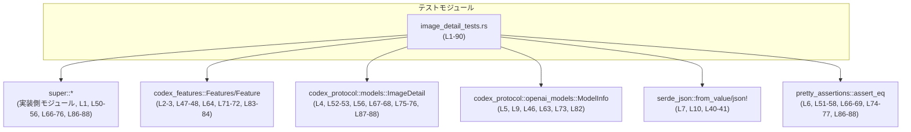
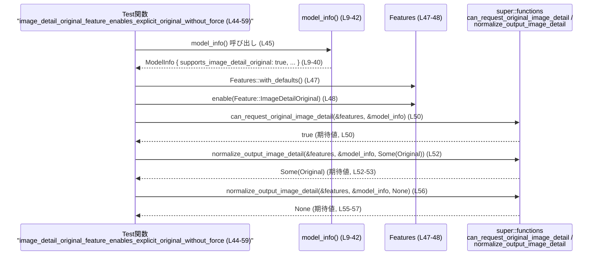

# tools/src/image_detail_tests.rs コード解説

## 0. ざっくり一言

`normalize_output_image_detail` と `can_request_original_image_detail` が、  
**モデルの能力と機能フラグに応じて画像の detail 指定をどう扱うか** を検証するテストモジュールです  
（tools/src/image_detail_tests.rs:L44-90）。

---

## 1. このモジュールの役割

### 1.1 概要

- このモジュールは、画像生成時の `ImageDetail`（解像度・精細さの指定）の扱いについて、
  - モデルが `image_detail_original` をサポートしているかどうか
  - 機能フラグ `Feature::ImageDetailOriginal` が有効かどうか  
  に応じて、**元の指定が保持されるか／破棄されるか** をテストしています  
  （tools/src/image_detail_tests.rs:L44-90）。
- テスト対象の関数は親モジュール（`super::*`）からインポートされる  
  `can_request_original_image_detail` と `normalize_output_image_detail` です  
  （tools/src/image_detail_tests.rs:L1, L50-56, L66-76, L86-88）。

### 1.2 アーキテクチャ内での位置づけ

このテストモジュールは、以下のような依存関係を持っています。



- テストロジックはすべてこのファイル内で完結し、外部依存は **型定義・機能フラグ・テスト対象関数** に限られています。
- 親モジュール（`super`）がどのファイルかは、このチャンクからは判別できません（tools/src/image_detail_tests.rs:L1）。

### 1.3 設計上のポイント

- **共通フィクスチャ生成関数**  
  - `model_info()` でテスト用の `ModelInfo` インスタンスを JSON から生成しており、  
    複数テストで同一条件のモデル情報を共有しています  
    （tools/src/image_detail_tests.rs:L9-42）。
- **機能フラグとモデル能力を独立に制御**  
  - 機能フラグ `Feature::ImageDetailOriginal` を有効/無効にするパターンと  
    `model_info.supports_image_detail_original` フィールドを書き換えるパターンを分けてテストし、  
    それぞれの組み合わせによる挙動を確認しています  
    （tools/src/image_detail_tests.rs:L47-48, L63-64, L71-73, L82-84）。
- **純粋関数的なテスト対象**  
  - テスト対象関数は `&Features` と `&ModelInfo`、および `Option<ImageDetail>` を受け取り、  
    `bool` や `Option<ImageDetail>` を返す形で利用されており、  
    副作用のない判定・正規化関数として扱われています  
    （tools/src/image_detail_tests.rs:L50-56, L66-76, L86-88）。
- **エラーハンドリング**  
  - テスト用の `model_info()` 内では JSON からのデシリアライズが失敗すると `expect` で panic しますが、  
    テスト環境では想定どおりの JSON スキーマであることを前提にしています  
    （tools/src/image_detail_tests.rs:L40-41）。
- **並行性**  
  - すべて同期的なテストであり、スレッドや `async` は使用されていません  
    （tools/src/image_detail_tests.rs:L44-90）。

---

## 2. 主要な機能一覧（コンポーネントインベントリー）

このファイルで定義・利用されている主なコンポーネントを一覧にします。

### 2.1 関数・テスト関数・外部関数

| 名前 | 種別 | 定義/利用 | 役割 / 用途 | 根拠 |
|------|------|-----------|------------|------|
| `model_info()` | 関数 | 定義 | テスト用の `ModelInfo` を JSON から生成するヘルパー | tools/src/image_detail_tests.rs:L9-42 |
| `image_detail_original_feature_enables_explicit_original_without_force` | テスト関数 | 定義 | feature と model が両方 `Original` をサポートする場合、`Original` 指定が保持されることを確認 | tools/src/image_detail_tests.rs:L44-59 |
| `explicit_original_is_dropped_without_feature_or_model_support` | テスト関数 | 定義 | feature 無効または model が `Original` をサポートしない場合、`Original` 指定がドロップされることを確認 | tools/src/image_detail_tests.rs:L61-78 |
| `unsupported_non_original_detail_is_dropped` | テスト関数 | 定義 | `ImageDetail::Low` のような非 `Original` 値がドロップされることを確認 | tools/src/image_detail_tests.rs:L80-89 |
| `can_request_original_image_detail` | 関数 | 利用（実装は `super` 側） | feature と model 情報から、`Original` detail をリクエスト可能かどうかを判定 | tools/src/image_detail_tests.rs:L50 |
| `normalize_output_image_detail` | 関数 | 利用（実装は `super` 側） | 利用者が指定した `Option<ImageDetail>` を、feature と model 能力に応じて正規化する（無効な指定を `None` にする） | tools/src/image_detail_tests.rs:L52-57, L66-68, L74-76, L87-88 |

### 2.2 型（外部定義を含む）

| 名前 | 種別 | 定義/利用 | 役割 / 用途 | 根拠 |
|------|------|-----------|------------|------|
| `Feature` | 列挙体または構造体 | 利用 | 機能フラグの種類を表す型として `Feature::ImageDetailOriginal` が利用されています | tools/src/image_detail_tests.rs:L2, L48, L72, L84 |
| `Features` | 構造体 | 利用 | 複数の `Feature` を保持・操作するコンテナ。`with_defaults` で初期化され、`enable` で個別の機能を有効化しています | tools/src/image_detail_tests.rs:L3, L47, L64, L71, L83 |
| `ImageDetail` | 列挙体 | 利用 | 画像生成時の detail 指定。少なくとも `Original` と `Low` というバリアントが存在します | tools/src/image_detail_tests.rs:L4, L52-53, L67, L75, L87 |
| `ModelInfo` | 構造体 | 利用 | モデルのメタ情報。少なくとも `supports_image_detail_original: bool` フィールドを持ちます | tools/src/image_detail_tests.rs:L5, L9-40, L63, L73, L82 |
| `serde_json::Value` 相当 | 構造体 | 利用 | `json!({ ... })` で生成され、`ModelInfo` にデシリアライズされます | tools/src/image_detail_tests.rs:L7, L10-40 |

---

## 3. 公開 API と詳細解説

ここでは、テストが対象としている **外部 API** と、テスト内で定義されているヘルパー関数を詳しく説明します。

### 3.1 型一覧（補足）

| 名前 | 種別 | 役割 / 用途 | 見えているフィールド / メソッド | 根拠 |
|------|------|-------------|----------------------------------|------|
| `Features` | 構造体 | 機能フラグの集合を表す | `with_defaults() -> Features`（関連関数）、`enable(feature: Feature)`（メソッド） | tools/src/image_detail_tests.rs:L3, L47, L64, L71, L83 |
| `Feature` | 列挙体または構造体 | 個別の機能フラグを表す | バリアント `ImageDetailOriginal` が存在 | tools/src/image_detail_tests.rs:L2, L48, L72, L84 |
| `ImageDetail` | 列挙体 | 画像 detail の種類 | バリアント `Original`, `Low` が存在 | tools/src/image_detail_tests.rs:L4, L52-53, L67, L75, L87 |
| `ModelInfo` | 構造体 | モデルのメタ情報 | フィールド `supports_image_detail_original: bool` が存在 | tools/src/image_detail_tests.rs:L9-40（JSONキー）, L73（フィールド代入） |

> `ModelInfo` の他のフィールド（`slug`, `display_name` など）は JSON に現れていますが、  
> このテストでは `supports_image_detail_original` 以外は挙動に影響していません  
> （tools/src/image_detail_tests.rs:L10-39, L73）。

---

### 3.2 重要関数の詳細（テスト対象 API）

#### `normalize_output_image_detail(features: &Features, model_info: &ModelInfo, detail: Option<ImageDetail>) -> Option<ImageDetail>`

**概要**

- 機能フラグとモデル能力に応じて、呼び出し元が指定した `ImageDetail` を **正規化** する関数としてテストされています。
- テストから読み取れる範囲では、
  - 条件を満たした場合のみ `Some(ImageDetail::Original)` をそのまま返し、
  - それ以外の場合は `None` を返して detail 指定をドロップします  
  （tools/src/image_detail_tests.rs:L51-58, L66-69, L74-77, L86-88）。

**引数**

| 引数名 | 型 | 説明 | 根拠 |
|--------|----|------|------|
| `features` | `&Features` | 機能フラグ集合。`Feature::ImageDetailOriginal` が有効かどうかにより挙動が変わる | tools/src/image_detail_tests.rs:L47-48, L64, L71-72, L83-84 |
| `model_info` | `&ModelInfo` | モデルの能力情報。`supports_image_detail_original` フィールドにより挙動が変わる | tools/src/image_detail_tests.rs:L63, L73, L82 |
| `detail` | `Option<ImageDetail>` | 呼び出し元が希望する画像 detail。`Some(Original)` や `Some(Low)`、`None` が渡される | tools/src/image_detail_tests.rs:L52-53, L56, L67, L75, L87 |

**戻り値**

- 型: `Option<ImageDetail>`  
- 意味: 正規化された detail 指定。
  - `Some(ImageDetail::Original)` のまま残る場合がある（テスト1）  
  - 無効な指定は `None` に正規化される（テスト2, 3）  
  （tools/src/image_detail_tests.rs:L52-53, L66-69, L74-77, L87-88）。

**テストから読み取れる仕様（条件分岐）**

テストコードから読み取れる仕様を条件として整理します。

1. **feature・model ともに Original をサポートする場合**  
   - 前提:
     - `features` に `Feature::ImageDetailOriginal` が有効  
       （tools/src/image_detail_tests.rs:L47-48）
     - `model_info.supports_image_detail_original == true`（デフォルト値）  
       （tools/src/image_detail_tests.rs:L33, L63）
   - 挙動:
     - `detail = Some(ImageDetail::Original)` の場合: 戻り値は `Some(ImageDetail::Original)`  
       （tools/src/image_detail_tests.rs:L51-53）
     - `detail = None` の場合: 戻り値は `None`  
       （tools/src/image_detail_tests.rs:L55-57）

2. **feature 無効で model はサポートしている場合**  
   - 前提:
     - `features` は `with_defaults()` のまま (`ImageDetailOriginal` が有効化されていない)  
       （tools/src/image_detail_tests.rs:L64-65）
     - `model_info.supports_image_detail_original == true`（初期値）  
       （tools/src/image_detail_tests.rs:L33, L63）
   - 挙動:
     - `detail = Some(ImageDetail::Original)` の場合: 戻り値は `None`  
       （tools/src/image_detail_tests.rs:L66-69）

3. **feature 有効だが model が Original をサポートしていない場合**  
   - 前提:
     - `features` に `Feature::ImageDetailOriginal` が有効  
       （tools/src/image_detail_tests.rs:L71-72）
     - `model_info.supports_image_detail_original = false` に書き換え  
       （tools/src/image_detail_tests.rs:L73）
   - 挙動:
     - `detail = Some(ImageDetail::Original)` の場合: 戻り値は `None`  
       （tools/src/image_detail_tests.rs:L74-77）

4. **非 Original の detail（`ImageDetail::Low`）の場合**  
   - 前提:
     - `features` に `Feature::ImageDetailOriginal` が有効  
       （tools/src/image_detail_tests.rs:L83-84）
     - `model_info.supports_image_detail_original == true`（初期値）  
       （tools/src/image_detail_tests.rs:L33, L82）
   - 挙動:
     - `detail = Some(ImageDetail::Low)` の場合: 戻り値は `None`  
       （tools/src/image_detail_tests.rs:L86-88）

**Examples（使用例: テストからの抜粋）**

```rust
// 前提: model と feature が Original をサポート
let model_info = model_info();                                // テスト用 ModelInfo を生成（L45-47）
let mut features = Features::with_defaults();                 // デフォルトの機能フラグ（L47）
features.enable(Feature::ImageDetailOriginal);                // Original detail サポートを有効化（L48）

// 1. 明示的に Original を指定した場合は、そのまま保持される
let result = normalize_output_image_detail(
    &features,
    &model_info,
    Some(ImageDetail::Original),                             // 入力 detail（L52）
);
assert_eq!(result, Some(ImageDetail::Original));              // 戻り値も Some(Original)（L51-53）

// 2. detail を指定しない場合は None のまま
let result_none = normalize_output_image_detail(
    &features,
    &model_info,
    None,                                                     // detail なし（L56）
);
assert_eq!(result_none, None);                                // None が返る（L55-57）
```

**Errors / Panics**

- 関数シグネチャやテストからは、`Result` 型や panic 条件は見えません。
- このテストでは `normalize_output_image_detail` が panic するケースは扱っておらず、  
  エラーハンドリングの詳細は **このチャンクからは不明** です  
  （tools/src/image_detail_tests.rs:L52-57, L66-76, L87-88）。

**Edge cases（エッジケース）**

テストでカバーされている代表的なケース:

- `detail = None` の場合、戻り値も `None` になる（ブラッシュアップやデフォルト付与は行わない）  
  （tools/src/image_detail_tests.rs:L55-57）。
- `detail = Some(ImageDetail::Original)` でも、feature または model がサポートしていない場合は `None` に落とされる  
  （tools/src/image_detail_tests.rs:L66-69, L74-77）。
- `detail = Some(ImageDetail::Low)` のような非 `Original` 値は、サポートされていても `None` に落とされる  
  （tools/src/image_detail_tests.rs:L86-88）。

**使用上の注意点**

- `ImageDetail::Original` を尊重してほしい場合は、
  - ランタイム設定で `Feature::ImageDetailOriginal` を有効にすること、
  - `ModelInfo.supports_image_detail_original` が `true` であるモデルを選ぶこと  
  が前提条件になります（tools/src/image_detail_tests.rs:L48, L33, L73）。
- 上記前提が満たされない場合、`Some(ImageDetail::Original)` を渡しても `None` になる仕様を前提にする必要があります  
  （tools/src/image_detail_tests.rs:L66-69, L74-77）。
- `ImageDetail::Low` など、Original 以外の detail を渡しても `None` にされるため、  
  呼び出し側がそれを期待してよいか（あるいは今後拡張するか）は実装側の仕様に依存し、  
  このテストからは判定できません（tools/src/image_detail_tests.rs:L86-88）。

---

#### `can_request_original_image_detail(features: &Features, model_info: &ModelInfo) -> bool`

**概要**

- モデルと機能フラグの組み合わせで、**そもそも `Original` detail をリクエスト可能かどうか** を判定する関数としてテストされています  
  （tools/src/image_detail_tests.rs:L50）。

**引数**

| 引数名 | 型 | 説明 | 根拠 |
|--------|----|------|------|
| `features` | `&Features` | 機能フラグ集合。`Feature::ImageDetailOriginal` の有効/無効が判定に影響する | tools/src/image_detail_tests.rs:L47-48, L50 |
| `model_info` | `&ModelInfo` | モデルの能力。`supports_image_detail_original` の値が判定に影響する | tools/src/image_detail_tests.rs:L46, L50, L73 |

**戻り値**

- 型: `bool`  
- 意味: `true` の場合、`Original` detail をリクエストしてよい状態であることを示します。  
  - テストでは `true` のケースのみが検証されています  
    （tools/src/image_detail_tests.rs:L50）。

**テストから読み取れる仕様**

- `Features` に `Feature::ImageDetailOriginal` が有効で、かつ `model_info` がデフォルトのまま（`supports_image_detail_original == true`）の場合、`true` を返します  
  （tools/src/image_detail_tests.rs:L46-48, L33, L50）。
- feature 無効や `supports_image_detail_original = false` の場合の戻り値は、  
  このテストファイルでは直接検証されていません（tools/src/image_detail_tests.rs:L61-78）。  
  ただし、`normalize_output_image_detail` の仕様と整合的に考えると、`false` になる可能性が高いですが、  
  これは **推測であり、このチャンクからは断定できません**。

**Examples（使用例: テストからの抜粋）**

```rust
let model_info = model_info();                         // supports_image_detail_original = true を含む ModelInfo（L9-40, L46）
let mut features = Features::with_defaults();          // デフォルト機能フラグ（L47）
features.enable(Feature::ImageDetailOriginal);         // Original detail サポートを有効化（L48）

assert!(can_request_original_image_detail(
    &features,
    &model_info,                                      // テストでは true が期待されている（L50）
));
```

**Errors / Panics**

- 関数シグネチャやテストから、`Result` や panic の存在は読み取れません。
- エラー条件・パニック条件は **このチャンクには現れないため不明** です  
  （tools/src/image_detail_tests.rs:L50）。

**Edge cases / 使用上の注意点**

- この関数は **「リクエスト可能かどうか」を事前に問い合わせるためのゲート関数** として利用されています。  
  実際に `ImageDetail::Original` を渡す前に、この関数で確認するパターンが想定されます（命名と利用からの推測）。
- feature や `ModelInfo` の状態が変わったときに、この関数の戻り値も変わる可能性がある点に注意が必要です。  
  具体的な仕様は実装側（`super`）のコードを確認する必要があります。

---

#### `fn model_info() -> ModelInfo`

**概要**

- テスト用の `ModelInfo` インスタンスを JSON から生成するヘルパー関数です  
  （tools/src/image_detail_tests.rs:L9-42）。
- 各テストで **同一の初期状態のモデル情報** を簡便に利用する目的で定義されています  
  （tools/src/image_detail_tests.rs:L45-47, L63, L82）。

**引数**

- なし。

**戻り値**

- 型: `ModelInfo`  
- 内容:
  - `"supports_image_detail_original": true` を含む JSON からデシリアライズされた `ModelInfo`  
    （tools/src/image_detail_tests.rs:L33, L9-11）。
  - その他にも `slug`, `display_name`, `truncation_policy` など多くのフィールドがセットされていますが、  
    このテストでは挙動に影響しません（tools/src/image_detail_tests.rs:L10-39）。

**内部処理の流れ**

1. `serde_json::json!` マクロで `ModelInfo` の JSON 表現を作成  
   （tools/src/image_detail_tests.rs:L10-39）。
2. `serde_json::from_value` でその JSON を `ModelInfo` にデシリアライズ  
   （tools/src/image_detail_tests.rs:L10, L40）。
3. `expect("deserialize test model")` により、デシリアライズ失敗時は panic させる  
   （tools/src/image_detail_tests.rs:L40-41）。

**Examples（使用例: テストからの抜粋）**

```rust
// テスト内での利用例（L45-47）
#[test]
fn some_test() {
    let model_info = model_info();                     // 毎回同じ初期状態の ModelInfo を取得
    // ... model_info を使ったテスト ...
}
```

**Errors / Panics**

- JSON から `ModelInfo` へのデシリアライズに失敗した場合、`expect("deserialize test model")` により panic します  
  （tools/src/image_detail_tests.rs:L40-41）。
- テスト環境では JSON スキーマと `ModelInfo` の定義が同期していることを前提としており、  
  その前提が崩れた場合にはテスト実行時に明示的な panic として検知されます。

**Edge cases / 使用上の注意点**

- 本関数はテスト専用であり、入力を受け取りません。そのため、
  - `supports_image_detail_original` が `false` のケースをテストしたい場合は、  
    返された `ModelInfo` のフィールドを上書きしています  
    （tools/src/image_detail_tests.rs:L73）。
- 実運用コードで同様のヘルパーを使う場合、panic ではなく `Result` でエラーを返すことが望ましいですが、  
  このファイルはテスト用のため、panic ベースの設計になっています。

---

### 3.3 その他の関数（テスト本体）

| 関数名 | 役割（1 行） | 根拠 |
|--------|--------------|------|
| `image_detail_original_feature_enables_explicit_original_without_force` | feature と model が共に `Original` をサポートする場合に、`Original` detail がそのまま保持されることを確認するテスト | tools/src/image_detail_tests.rs:L44-59 |
| `explicit_original_is_dropped_without_feature_or_model_support` | feature 無効または model 非対応のとき、`Original` detail がドロップされることを確認するテスト | tools/src/image_detail_tests.rs:L61-78 |
| `unsupported_non_original_detail_is_dropped` | 非 `Original` の detail（`Low`）がドロップされることを確認するテスト | tools/src/image_detail_tests.rs:L80-89 |

---

## 4. データフロー

ここでは、最初のテストケース  
`image_detail_original_feature_enables_explicit_original_without_force` を例に、  
データの流れを示します。

### 4.1 処理の要点

- `model_info()` で **初期状態の `ModelInfo`** を生成する（`supports_image_detail_original = true`）  
  （tools/src/image_detail_tests.rs:L45-47, L33）。
- `Features::with_defaults()` + `enable(Feature::ImageDetailOriginal)` で機能フラグを設定する  
  （tools/src/image_detail_tests.rs:L47-48）。
- その状態を `can_request_original_image_detail` と `normalize_output_image_detail` に渡し、  
  `Original` detail がリクエスト可能であり、かつ保持されることを確認する  
  （tools/src/image_detail_tests.rs:L50-56）。

### 4.2 シーケンス図



---

## 5. 使い方（How to Use）

このファイル自体はテストですが、`normalize_output_image_detail` / `can_request_original_image_detail` の  
**典型的な利用パターン** を理解するのに有用です。

### 5.1 基本的な使用方法

以下はテストコードを簡略化した、実際の利用例イメージです。

```rust
// 前提: codex_features::Features, codex_protocol::{ImageDetail, ModelInfo} をインポート済み

// 1. モデル情報を用意する（実際のアプリでは API 等から取得する想定）
// ここではテストと同じ helper を利用
let model_info = model_info();                                // tools/src/image_detail_tests.rs:L9-42

// 2. 機能フラグを設定する
let mut features = Features::with_defaults();                 // デフォルトのフラグ（L47, L64, L71, L83）
features.enable(Feature::ImageDetailOriginal);                // Original detail サポートを有効化（L48, L72, L84)

// 3. Original detail を使えるかどうかを事前に確認する
if can_request_original_image_detail(&features, &model_info) {// L50
    // 4. ユーザー指定の detail を正規化する
    let user_detail = Some(ImageDetail::Original);            // ユーザーの希望する detail（L52-53）
    let normalized = normalize_output_image_detail(
        &features,
        &model_info,
        user_detail,
    );                                                         // L52-53

    // normalized は Some(Original) となることが期待される（L51-53）
    // これを実際の画像生成 API へ渡す
} else {
    // Original が使えない環境では、detail 指定なし（None）で処理する等
}
```

### 5.2 よくある使用パターン

1. **Original がサポートされていない場合**  
   - `Features` に `Feature::ImageDetailOriginal` を有効にしない、または  
     `ModelInfo.supports_image_detail_original` が `false` のモデルを選ぶと、  
     `normalize_output_image_detail` に `Some(ImageDetail::Original)` を渡しても `None` になります  
     （tools/src/image_detail_tests.rs:L66-69, L73-77）。

2. **非 Original detail の扱い**  
   - `Some(ImageDetail::Low)` のような値は、サポートされていても `None` に正規化されます  
     （tools/src/image_detail_tests.rs:L86-88）。  
   - 呼び出し側は、`normalize_output_image_detail` が「無効な detail を消す」役割を持つと考えることができます。

### 5.3 よくある間違い（テストから読み取れる誤用パターン）

```rust
// 誤りの例: feature や model の能力を考慮せずに Original を前提にする
let model_info = model_info();                                 // supports_image_detail_original は true（L33, L63）
let features = Features::with_defaults();                      // Feature::ImageDetailOriginal はまだ無効（L64）

let normalized = normalize_output_image_detail(
    &features,
    &model_info,
    Some(ImageDetail::Original),
);
// ここで normalized が Some(Original) だと期待してしまうのは誤り。
// テストでは None になることが検証されています（L66-69）。

// 正しい例: feature を有効化する
let mut features = Features::with_defaults();                  // L71
features.enable(Feature::ImageDetailOriginal);                 // L72
let normalized_ok = normalize_output_image_detail(
    &features,
    &model_info,
    Some(ImageDetail::Original),
);
// この状態でも、model_info.supports_image_detail_original を false にすると None になる点に注意（L73-77）。
```

### 5.4 使用上の注意点（まとめ）

- **機能フラグとモデル能力の両方を確認すること**  
  - 片方だけで `Original` 利用可否を判断すると、テストと異なる挙動になる可能性があります  
    （tools/src/image_detail_tests.rs:L66-69, L73-77）。
- **非 Original detail は drop されうる**  
  - `ImageDetail::Low` 等の値が、そのまま利用されるとは限らず、`None` になる仕様が存在します  
    （tools/src/image_detail_tests.rs:L86-88）。
- **エラー/パニック**  
  - テスト対象関数のエラー仕様は不明ですが、少なくとも `model_info()` は JSON スキーマ不一致時に panic します  
    （tools/src/image_detail_tests.rs:L40-41）。  
    実運用で類似のコードを書く場合は、`Result` ベースのエラーハンドリングを検討する必要があります。

---

## 6. 変更の仕方（How to Modify）

### 6.1 新しい機能を追加する場合（テスト観点）

- 例: `ImageDetail::High` のような新しい detail バリアントを追加する場合
  1. まず `ImageDetail` 列挙体側に新バリアントを追加（このファイルからは定義場所は不明）。
  2. 本テストファイルに、新しいテスト関数を追加する。
     - `model_info()` と `Features::with_defaults()` をベースに、必要に応じて feature やフィールドを調整する  
       （tools/src/image_detail_tests.rs:L9-42, L47-48, L63-64, L71-73, L83-84）。
     - `normalize_output_image_detail` に `Some(ImageDetail::High)` を渡し、期待する戻り値を `assert_eq!` で検証する  
       （tools/src/image_detail_tests.rs:L86-88 を参考）。

### 6.2 既存の機能を変更する場合（テスト更新のポイント）

- `normalize_output_image_detail` や `can_request_original_image_detail` の仕様を変更する場合は、  
  以下のテストケースへの影響を確認する必要があります。

  - 「feature + model で Original をサポートする」ケース  
    （tools/src/image_detail_tests.rs:L44-59）
  - 「feature 無効または model 非対応」ケース  
    （tools/src/image_detail_tests.rs:L61-78）
  - 「非 Original detail（Low）」ケース  
    （tools/src/image_detail_tests.rs:L80-89）

- 特に、以下の「契約（前提条件・保証）」を意識する必要があります。
  - `Feature::ImageDetailOriginal` が有効でない状態では、`Some(Original)` が保持されない  
    （tools/src/image_detail_tests.rs:L66-69）。
  - モデルが `supports_image_detail_original = false` の場合も、`Some(Original)` が保持されない  
    （tools/src/image_detail_tests.rs:L73-77）。
  - 非 Original detail は `None` に落とされる  
    （tools/src/image_detail_tests.rs:L86-88）。

- 仕様変更に応じてこれらテストの期待値を更新するか、新旧仕様を区別する新しいテストを追加することが必要です。

---

## 7. 関連ファイル

このモジュールと密接に関係するファイル・クレートです（パスが不明なものは、その旨を明記します）。

| パス / クレート | 役割 / 関係 | 根拠 |
|-----------------|-------------|------|
| `super`（具体的なファイルパスは不明） | `can_request_original_image_detail` と `normalize_output_image_detail` の実装を提供するモジュール。 本テストの対象。 | tools/src/image_detail_tests.rs:L1, L50-56, L66-76, L86-88 |
| `codex_features` クレート | `Feature` と `Features` を提供し、機能フラグの管理を行う。 | tools/src/image_detail_tests.rs:L2-3, L47-48, L64, L71-72, L83-84 |
| `codex_protocol::models` | `ImageDetail` 列挙体を提供し、画像 detail 指定の種類を定義する。 | tools/src/image_detail_tests.rs:L4, L52-53, L67, L75, L87 |
| `codex_protocol::openai_models` | `ModelInfo` 構造体を提供し、モデル能力（`supports_image_detail_original` を含む）を表現する。 | tools/src/image_detail_tests.rs:L5, L9-40, L63, L73, L82 |
| `serde_json` クレート | テスト用 `ModelInfo` を JSON からデシリアライズするために利用される。 | tools/src/image_detail_tests.rs:L7, L10-11, L40-41 |
| `pretty_assertions` クレート | `assert_eq!` マクロを色付き diff 付きで提供し、テストの可読性を高める。 | tools/src/image_detail_tests.rs:L6, L51-58, L66-69, L74-77, L86-88 |

> 親モジュール（`super`）がどのファイルか（例: `image_detail.rs` 等）は、  
> このチャンクには現れないため不明です。
