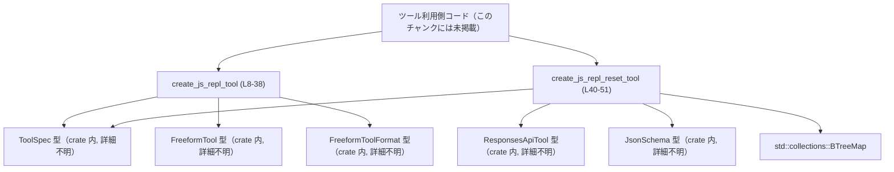
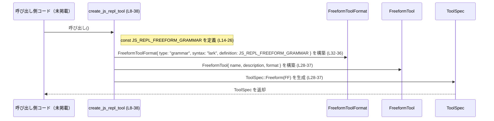

# tools/src/js_repl_tool.rs コード解説

## 0. ざっくり一言

- JavaScript REPL（Node ベース、永続カーネル）の実行ツールと、そのリセット用ツールの `ToolSpec` を組み立てて返すモジュールです（`create_js_repl_tool`, `create_js_repl_reset_tool`）。  
  （根拠: `tools/src/js_repl_tool.rs:L8-38`, `L40-51`）

---

## 1. このモジュールの役割

### 1.1 概要

- このモジュールは、JavaScript を「自由形式（freeform）」で実行する REPL ツールと、その REPL カーネルをリセットするツールの仕様 (`ToolSpec`) を生成します（`create_js_repl_tool`, `create_js_repl_reset_tool`）。  
  （根拠: `tools/src/js_repl_tool.rs:L8-38`, `L40-51`）
- JS REPL ツールでは、Lark 形式の文法文字列を用いて、「JSON ラッパー」「引用文字列」「Markdown フェンス」などの典型的な誤ったペイロード形式を正規表現ベースで弾く設計になっています。  
  （根拠: コメント `L9-13`, 文法定義 `L14-25`）
- リセットツールは、オプションや引数を持たない関数型ツールとして定義されており、永続カーネルとそのトップレベルバインディングをクリアするための API エントリポイントとして振る舞います。  
  （根拠: `tools/src/js_repl_tool.rs:L40-50` の `description` と空の `parameters`）

### 1.2 アーキテクチャ内での位置づけ

このモジュールは、crate 内で定義されている各種ツール関連型（`ToolSpec`, `FreeformTool`, `FreeformToolFormat`, `ResponsesApiTool`, `JsonSchema`）を利用してツール仕様を作る「定義モジュール」です。  
実際にこれらのツール仕様がどこから呼び出され、どのようなランタイムで実行されるかは、このチャンクには現れていません。

- JS REPL ツール:
  - `ToolSpec::Freeform(FreeformTool { ... })` を返します（`L28-37`）。
- リセットツール:
  - `ToolSpec::Function(ResponsesApiTool { ... })` を返します（`L40-50`）。

依存関係を、見えている範囲で図示します（呼び出し元は概念的なノードとしてのみ表示します）。



（根拠: `use` 群 `L1-6`, 関数定義 `L8-38`, `L40-51`）

### 1.3 設計上のポイント

- **Freeform 入力 + 文法ベースバリデーション**  
  - JS ソースを「自由形式」のテキストとして扱いつつ、Lark 文法 (`JS_REPL_FREEFORM_GRAMMAR`) により、先頭トークンが JSON 的な形や Markdown フェンスになっているケースを弾く設計です。  
    （根拠: コメント `L9-13`, 文法 `L14-25`, `format.definition` への設定 `L32-36`）
- **pragma（プラグマ）による 1 行目のオプション指定**  
  - `// codex-js-repl: ...` 形式の 1 行目コメントを「pragma」として許可し、その後に JS ソースを続ける文法を定義しています。  
    （根拠: `start`/`pragma_source` ルール `L15-20`, `PRAGMA_LINE` 定義 `L22`）
- **状態を持たない定義モジュール**  
  - モジュール内で状態（グローバル変数、ミューテーション）は持たず、呼び出されるたびに新しい `ToolSpec` インスタンスを構築する純粋な関数です。  
    （根拠: `const` 文字列以外の `static`/`mut` がないこと `L14` のみが `const`）
- **エラーハンドリングの方針**  
  - どちらの関数も `Result` などで失敗を返さず、構築に失敗しうる処理（`unwrap` や I/O）も含んでいないため、呼び出し側から見ると「失敗しない構成関数」として扱えます。  
    （根拠: 関数シグネチャ `L8`, `L40` と本体内の処理内容 `L14-37`, `L41-50`）
- **同一構造の JSON スキーマ生成**  
  - リセットツールはパラメータを取らない設計であり、`JsonSchema::object` に空の `BTreeMap` を渡すことで「プロパティ定義なしのオブジェクト型」のスキーマを構築しています。  
    （根拠: `L41-49`）

---

## 2. 主要な機能一覧（コンポーネントインベントリー）

### 2.1 関数インベントリー

このファイル内で定義される公開関数とテストモジュールの一覧です。

| 名前 | 種別 | 概要 | 定義位置 |
|------|------|------|----------|
| `create_js_repl_tool` | 関数 (`pub fn`) | JavaScript REPL 実行用の freeform ツール `ToolSpec` を生成する | `tools/src/js_repl_tool.rs:L8-38` |
| `create_js_repl_reset_tool` | 関数 (`pub fn`) | REPL カーネルをリセットする関数型ツール `ToolSpec` を生成する | `tools/src/js_repl_tool.rs:L40-51` |
| `tests` | モジュール（テスト用） | 本モジュール用のテスト（別ファイル `js_repl_tool_tests.rs`） | `tools/src/js_repl_tool.rs:L53-55` |

### 2.2 機能の箇条書き

- JS REPL ツール仕様の生成: `create_js_repl_tool`  
  （根拠: `tools/src/js_repl_tool.rs:L8-38`）
- REPL リセットツール仕様の生成: `create_js_repl_reset_tool`  
  （根拠: `tools/src/js_repl_tool.rs:L40-51`）

---

## 3. 公開 API と詳細解説

### 3.1 型一覧（このモジュールで利用する主な型）

このファイル自身は新しい構造体・列挙体を定義しませんが、公開関数の戻り値や内部で利用する外部型がモジュールの API 形状に関わります。

| 名前 | 種別 | 役割 / 用途 | 使用位置（根拠） |
|------|------|-------------|------------------|
| `ToolSpec` | crate 内の型（詳細不明） | ツール仕様の共通表現。`Freeform` や `Function` などのバリアントを持つ型と推測されますが、定義はこのチャンクにはありません。 | 戻り値型・コンストラクタ呼び出し `L5`, `L8`, `L28`, `L40`, `L41` |
| `FreeformTool` | crate 内の型（詳細不明） | 自由形式ツール（テキスト入力に対するツール）の設定を保持する型として利用されています。 | `ToolSpec::Freeform(FreeformTool { ... })` `L1`, `L28-37` |
| `FreeformToolFormat` | crate 内の型（詳細不明） | Freeform ツールの入力フォーマット（ここでは Lark 文法）の指定に用いられます。 | `use` `L2`, フィールド `format: FreeformToolFormat { ... }` `L32-36` |
| `JsonSchema` | crate 内の型（詳細不明） | ツール引数を表現する JSON Schema を構築するために利用されます。 | `use` `L3`, `JsonSchema::object(...)` `L48` |
| `ResponsesApiTool` | crate 内の型（詳細不明） | 関数型ツールの仕様（名前、説明、パラメータなど）を保持する型として利用されています。 | `use` `L4`, `ResponsesApiTool { ... }` `L41-50` |
| `BTreeMap` | `std::collections::BTreeMap` | JSON Schema のプロパティマップを構築するための連想配列型として使用されています。 | `use` `L6`, `BTreeMap::new()` `L48` |

> `ToolSpec` など crate 内の型が「列挙体か構造体か」は、このチャンクからは判定できないため「型（詳細不明）」と記載しています。

---

### 3.2 関数詳細

#### `create_js_repl_tool() -> ToolSpec`

**概要**

- JavaScript REPL 実行用の freeform ツール仕様 `ToolSpec` を構築して返します。  
  （根拠: 関数シグネチャと本体 `tools/src/js_repl_tool.rs:L8-38`）
- 入力フォーマットとして Lark 文法 `JS_REPL_FREEFORM_GRAMMAR` を設定し、JSON ラッパーや引用文字列、Markdown フェンスを避けた「生の JS ソース」を受け取るよう設計されています。  
  （根拠: コメント `L9-13`, 文法 `L14-25`, `format` フィールド `L32-36`）

**引数**

- 引数はありません。

**戻り値**

- 型: `ToolSpec`（crate 内定義の型、詳細不明）  
- 返される値は `ToolSpec::Freeform(FreeformTool { ... })` であり、少なくとも以下のフィールドがセットされています。  
  （根拠: `tools/src/js_repl_tool.rs:L28-37`）
  - `name: "js_repl".to_string()`
  - `description`: Node カーネルで top-level await に対応した JS 実行ツールであること、先頭行 pragma の形式、JSON/quotes/markdown fences を送らないことを説明する文字列  
    （根拠: `L30-31`）
  - `format: FreeformToolFormat { r#type: "grammar", syntax: "lark", definition: JS_REPL_FREEFORM_GRAMMAR }`  
    （根拠: `L32-36`）

**内部処理の流れ（アルゴリズム）**

1. 関数冒頭で、Lark 文法を表す `const JS_REPL_FREEFORM_GRAMMAR: &str` を定義します。  
   （根拠: `tools/src/js_repl_tool.rs:L14-26`）
2. 文法定義の内容:
   - `start` ルールは `pragma_source` または `plain_source` のいずれか。  
     （`L15`, `L17-18`）
   - `pragma_source` は `PRAGMA_LINE NEWLINE js_source`、つまり 1 行目の pragma コメントの後に JS ソースが続く形式。  
     （`L17`, `L22-23`）
   - `plain_source` は `PLAIN_JS_SOURCE` のみ。  
   - `PRAGMA_LINE`: `/[ \t]*\/\/ codex-js-repl:[^\r\n]*/`  
     - 先頭空白のあとに `// codex-js-repl:` で始まる 1 行コメント。  
     （`L22`）
   - `PLAIN_JS_SOURCE` / `JS_SOURCE` は同一の正規表現:  
     `/ (?:\s*) (?:[^\s{\"`]|`[^`]|``[^`]) [\s\S]*/`  
     - 先頭の空白を読み飛ばした後、最初の意味のあるトークンが「空白・`{`・`"`・バッククォート 1〜2 個だけ」にならないことを保証します。  
     （`L24-25`）
3. その文法を `FreeformToolFormat` の `definition` に設定し、`syntax: "lark"`, `r#type: "grammar"` として構築します。  
   （根拠: `L32-36`）
4. `FreeformTool { name, description, format }` を作り、`ToolSpec::Freeform(...)` バリアントで包んで返します。  
   （根拠: `L28-37`）

**Examples（使用例）**

以下の例は、同じモジュール内あるいは呼び出し側コードからこの関数を利用してツール仕様を取得するイメージです。`register_tool` は仮の関数名です。

```rust
// js_repl_tool.rs と同じクレート内のどこかから呼び出す想定
use crate::js_repl_tool::create_js_repl_tool; // 実際のパスはクレート構成に依存（ここでは例示）

// ツール登録処理の一部というイメージの擬似コード
fn register_all_tools() {
    // JS REPL 用のツール仕様を生成する
    let js_repl_spec = create_js_repl_tool();

    // js_repl_spec をどこかのツールレジストリに登録する（register_tool は例示）
    register_tool(js_repl_spec); // この関数はプロジェクト固有のものとして仮定
}
```

また、このツールに渡される JS ソースは、説明文と文法から次のような形が想定されています（JS 側の例）:

```javascript
// codex-js-repl: timeout_ms=15000   // ← 任意の 1 行目 pragma（なくてもよい）
const res = await fetch("https://example.com");
res.status;
```

- JSON や文字列ラッパーは避けるべきであることが description に明示されています。  
  （根拠: `tools/src/js_repl_tool.rs:L30-31`）

**Errors / Panics**

- この関数は `Result` や `Option` ではなく `ToolSpec` を直接返しており、本体内でもパニックを起こしうる操作（`unwrap`、インデックスアクセスなど）は行っていません。  
  - `to_string()` は通常パニックしません。  
  - `const` 文字列の定義もコンパイル時に固定されます。  
  （根拠: 実装全体 `L8-38`）
- したがって、Rust レベルでは「ほぼ確実に失敗しない構築関数」とみなせます。

**Edge cases（エッジケース）**

主なエッジケースは、関数自体というよりも、*文法がどの入力を許可・拒否するか*という点に現れます。

- **JSON オブジェクト風の入力**  
  - 例: `{ "code": "console.log(1)" }`  
  - 正規表現 `PLAIN_JS_SOURCE` / `JS_SOURCE` は「空白の次に `{` が来る」ケースを許容しないため、このような入力は文法にマッチしないと解釈できます。  
    （根拠: `[^\s{\"`]` という否定クラス `L24-25`）
- **JSON 文字列としての JS コード**  
  - 例: `"console.log(1)"`  
  - 先頭の意味のある文字が `"` であるため、同様にマッチしません。  
    （根拠: 否定クラス `[^\s{\"`]` `L24-25`）
- **Markdown フェンス付きのコードブロック**  
  - 例:  

    ```text
    ```js
    console.log(1);
    ```

    ```  
  - 文法では、先頭の「意味のあるトークン」がバッククォート 1 個、または 2 個 + 非バッククォート 1 文字、という形は許可するものの、典型的な ```（3 つのバッククォート）で始まるフェンスは意図的に避けようとしています。  

    （根拠: `|`[^`]|``[^`]` のオルタナティブ `L24-25`）
  - ただし、正確にどのパターンが弾かれるかは Lark の具体的な動作にも依存するため、「Markdown フェンスを完全に防げるかどうか」はこのチャンクだけでは断定できません。
- **pragma 行の形式**  
  - `PRAGMA_LINE` は `// codex-js-repl:` から始まる 1 行コメントのみを特別扱いします。それ以外のコメントは pragma としては扱われず、`plain_source` として解釈されます。  
    （根拠: `PRAGMA_LINE` 定義 `L22`, `start`/`pragma_source` `L15-20`）

**使用上の注意点**

- **入力形式の契約**  
  - description に「do not send JSON/quotes/markdown fences.」と明示されており、呼び出し側は *生の JS ソース* を送るべきであると読み取れます。  
    （根拠: `tools/src/js_repl_tool.rs:L30-31`）
  - JSON でラップしたり、コードブロック記法を付けたりすると文法で拒否され、ツール呼び出しが失敗する可能性があります。
- **pragma の位置**  
  - pragma コメントは「最初の行」である必要があります。2 行目以降の `// codex-js-repl:` はこの文法では特別扱いされません。  
    （根拠: `pragma_source: PRAGMA_LINE NEWLINE js_source` `L17`）
- **セキュリティ面の補足**  
  - description によると「persistent Node kernel」で JS を実行しますが、このファイルにはカーネルのサンドボックスや権限制御の実装は含まれていません。  
    - JS 実行の安全性や信頼境界については、このチャンクからは判断できません。
- **並行性**  
  - 関数は単に `ToolSpec` を生成するだけで共有状態を持たないため、スレッドセーフであり、どのスレッドから呼んでも同じ値が得られます（Rust の通常の共有参照ルールの範囲内）。  
    （根拠: グローバルな可変状態が存在しないこと `L1-38`）

---

#### `create_js_repl_reset_tool() -> ToolSpec`

**概要**

- JS REPL のカーネルをリスタートし、永続化されたトップレベルのバインディングをすべてクリアするツール仕様 `ToolSpec` を構築して返します。  
  （根拠: `description` の内容 `tools/src/js_repl_tool.rs:L42-45`）
- 引数なし（空のパラメータスキーマ）の関数型ツールとして定義されています。  
  （根拠: `parameters: JsonSchema::object(BTreeMap::new(), /*required*/ None, Some(false.into()))` `L48`）

**引数**

- 引数はありません。

**戻り値**

- 型: `ToolSpec`
- 返される値は `ToolSpec::Function(ResponsesApiTool { ... })` であり、以下のフィールドが設定されています。  
  （根拠: `tools/src/js_repl_tool.rs:L41-50`）
  - `name: "js_repl_reset".to_string()`
  - `description`: 「この run における js_repl カーネルを再起動し、永続トップレベルバインディングをクリアする」と説明する文字列。  
    （`L42-45`）
  - `strict: false`
  - `defer_loading: None`
  - `parameters: JsonSchema::object(BTreeMap::new(), /*required*/ None, Some(false.into()))`
  - `output_schema: None`

`JsonSchema::object` の第 1 引数に空の `BTreeMap` が渡されているため、「プロパティ定義を持たないオブジェクト型」のスキーマであることは読み取れます。第 2 引数・第 3 引数の意味（`/*required*/ None`, `Some(false.into())`）は、このチャンクからは厳密には分かりません。  
（根拠: `L48`）

**内部処理の流れ**

1. `ResponsesApiTool` 構造体（もしくは同等の型）を、フィールド初期化子を用いて構築します。  
   （根拠: `tools/src/js_repl_tool.rs:L41-50`）
2. `parameters` フィールドでは、`BTreeMap::new()` で空のマップを作成し、それを `JsonSchema::object` に渡します。  
   - これにより、プロパティを持たないオブジェクト型スキーマが構築されます。  
   （根拠: `L6`, `L48`）
3. `ToolSpec::Function(ResponsesApiTool { ... })` に包み、呼び出し元に返します。  
   （根拠: `L40-41`, `L50`）

**Examples（使用例）**

同じく擬似的なツール登録コードの例です。

```rust
use crate::js_repl_tool::create_js_repl_reset_tool; // 実際のモジュールパスは例示

fn register_all_tools() {
    let reset_spec = create_js_repl_reset_tool(); // REPL リセット用ツール仕様を生成

    // ツールレジストリへの登録（register_tool は仮の関数）
    register_tool(reset_spec);
}
```

ツール呼び出し側から見たときには、「引数なしのツール」であることがスキーマ定義から読み取れます。

**Errors / Panics**

- この関数も、`Result` 型ではなく `ToolSpec` を直接返し、内部でパニックしうる操作は行っていません。  
  - `BTreeMap::new()` や `to_string()` はパニックしません。  
  （根拠: 実装全体 `L40-51`）
- したがって Rust レベルでの失敗パスは存在しないと見なせます。

**Edge cases（エッジケース）**

- **パラメータなしの契約**  
  - `parameters` に渡される `JsonSchema::object(BTreeMap::new(), ...)` から、「プロパティ定義が空」であることが分かります。  
  - 呼び出し側がパラメータを送信した場合にどう扱われるかは、`JsonSchema`・`ResponsesApiTool` の実装と検証ロジックに依存し、このチャンクからは不明です。
- **strict フラグが false**  
  - `strict: false` が何を意味するかは `ResponsesApiTool` の定義次第であり、このチャンクからは挙動を断定できません。  
  - 例えば「パラメータバリデーションの厳密さ」等に関わる可能性がありますが、あくまで推測です。

**使用上の注意点**

- **引数を取らないツールとして扱う**  
  - 呼び出し側は、原則としてリクエストパラメータなし（空オブジェクト等）でこのツールを呼ぶことが期待されます。  
    （根拠: 空のプロパティマップ `L48`）
- **REPL 状態破壊の性質**  
  - description から、このツールを呼ぶと「永続トップレベルバインディング」が消去されることが読み取れます。  
    - 既存の REPL 状態に依存したコードは、その後の呼び出しで動作が変わる可能性があるため、ツールの選択・順序には注意が必要です。  
    （根拠: `L42-45`）
- **並行性**  
  - この関数自体は状態を持たずスレッドセーフですが、「どの REPL カーネルをリセットするか」「並行実行時の競合」をどう扱うかは、Node カーネル管理側の実装に依存し、このチャンクからは分かりません。

---

### 3.3 その他の関数

- 本ファイルには、上記 2 つ以外の関数は定義されていません。  
  （根拠: 全体構造 `tools/src/js_repl_tool.rs:L1-55`）

---

## 4. データフロー

ここでは、代表的なシナリオとして「呼び出し側が JS REPL ツール仕様を取得する流れ」を示します。

1. 呼び出し側コードが `create_js_repl_tool()` を呼び出す。  
2. `create_js_repl_tool()` 内で Lark 文法 `JS_REPL_FREEFORM_GRAMMAR` が（関数スコープの `const` として）定義される。  
3. 文法文字列を含む `FreeformToolFormat` および `FreeformTool` が構築される。  
4. `ToolSpec::Freeform(...)` に包まれて戻り値として返却される。  
（根拠: `tools/src/js_repl_tool.rs:L8-37`）



リセットツールについても同様に、呼び出し側から `create_js_repl_reset_tool()` を呼び出し、内部で `ResponsesApiTool` → `ToolSpec::Function(...)` が組み立てられて返却される、という単純なフローです。  
（根拠: `tools/src/js_repl_tool.rs:L40-50`）

---

## 5. 使い方（How to Use）

### 5.1 基本的な使用方法

このモジュールの関数は、ツール仕様 (`ToolSpec`) を構築して返すだけなので、「初期化 → ツール登録 → 使用」というフローの中では *初期化フェーズ*で用いられます。

```rust
// js_repl_tool.rs と同じクレート内からの利用例（パスは例示）
use crate::js_repl_tool::{create_js_repl_tool, create_js_repl_reset_tool};

// ツールレジストリに両方のツールを登録する仮の関数
fn register_all_tools() {
    // JS REPL 実行ツール
    let js_repl_spec = create_js_repl_tool();          // JS REPL 用 ToolSpec を取得

    // REPL リセットツール
    let js_repl_reset_spec = create_js_repl_reset_tool(); // リセット用 ToolSpec を取得

    // ここでは仮の register_tool に登録する
    register_tool(js_repl_spec);       // 実行ツールを登録
    register_tool(js_repl_reset_spec); // リセットツールを登録
}
```

- 上記の `register_tool` はこのモジュールには存在せず、クレート固有のツール管理ロジックを仮定したものです。

### 5.2 よくある使用パターン

1. **JS REPL を呼び出すツールとして使う**  
   - モデルや別コンポーネントが `ToolSpec` をもとに JS REPL ツールを呼び出し、JS ソース文字列を渡します。
   - 先頭行にタイムアウトなどの pragma を付けるパターンが description で示唆されています。  
     例: `// codex-js-repl: timeout_ms=15000`（根拠: description `L30-31`）

2. **REPL 状態をリセットする**  
   - 長時間の対話や複数回の JS 実行の後に、`js_repl_reset` ツールを呼び出して Node カーネルの状態をクリアする、というパターンが description から想像できますが、正確な呼び出し方法はこのチャンクにはありません。  
     （根拠: `L42-45`）

### 5.3 よくある間違い（起こりそうな誤用例）

文法と description から、以下のような使い方は誤用になりそうです。

```rust
// 誤りの例: JS コードを JSON 文字列にラップして送る
// （description で禁止されているパターン）
let payload = r#""console.log(1);""#; // JS コードを JSON の文字列として表現
// → 文法的にも description 的にも非推奨
```

```rust
// 正しい例: 素の JavaScript ソースを渡す
let payload = "console.log(1);"; // JSON やクォートでラップしない
```

```rust
// 誤りの例: Markdown のコードブロックを送る
let payload = r#"```js
console.log(1);
```"#;
```

```rust
// 正しい例: コードブロックを除いたソースのみを送る
let payload = "console.log(1);";
```

- これらの誤用は、description の「do not send JSON/quotes/markdown fences.」に反しています。  
  （根拠: `tools/src/js_repl_tool.rs:L30-31`）

### 5.4 使用上の注意点（まとめ）

- **入力フォーマットの遵守**  
  - JS REPL ツールには *生の JS ソース* を送り、JSON ラッパーやコードブロックを避ける必要があります。
- **pragma の形式固定**  
  - 特別扱いされる pragma は `// codex-js-repl:` で始まる 1 行のみです。別のコメント形式に基づくオプション指定は、この文法の範囲外です。
- **リセットツールの副作用**  
  - リセットツールを呼ぶと、永続トップレベルバインディングが消えることが description から読み取れるため、REPL 状態に依存する連続呼び出しの前後関係に注意が必要です。
- **スレッドセーフ**  
  - 両関数とも純粋関数で共有可変状態を持たないため、多数スレッドからの同時呼び出しも安全です（戻り値をどう共有・利用するかは別問題です）。

---

## 6. 変更の仕方（How to Modify）

### 6.1 新しい機能を追加する場合

このモジュールと同様の構造で、別のツールを追加する場合の自然な手順は次のとおりです。

1. **新しいツール仕様生成関数を追加**  
   - `create_xxx_tool() -> ToolSpec` のような `pub fn` を定義し、`ToolSpec` の適切なバリアント（`Freeform`, `Function` など）を返す。  
     - このファイルでは `Freeform` と `Function` の 2 パターンが例として存在します。  
       （根拠: `tools/src/js_repl_tool.rs:L28-37`, `L41-50`）
2. **必要に応じて文法や JSON スキーマを定義**  
   - Freeform ツールなら、`JS_REPL_FREEFORM_GRAMMAR` と同様に Lark 文法や別の形式を `const` 文字列として定義する。  
   - Function ツールなら、`JsonSchema::object` や他のビルダーメソッドを用いてパラメータスキーマを構築する。
3. **テストモジュールに対応するテストを追加**  
   - 既存の `#[cfg(test)] mod tests;` が参照する `js_repl_tool_tests.rs` に、新ツールに対するテストケースを追加するのが自然ですが、このチャンクにはテスト内容がないため、具体的な追加箇所は不明です。  
     （根拠: `L53-55`）

### 6.2 既存の機能を変更する場合

- **JS 文法を変更する場合**  
  - `JS_REPL_FREEFORM_GRAMMAR` の正規表現を変更すると、どの入力が許可・拒否されるかが変わります。  
    - 特に、`PLAIN_JS_SOURCE` / `JS_SOURCE` の先頭トークンに関する制約（[^\s{\"`] など）は、JSON ラッパーや Markdown フェンスを防ぐ目的を持っているため、意図を理解した上で変更する必要があります。  
      （根拠: コメント`L9-13`, 文法`L24-25`）
  - コメントにある「runtime `reject_json_or_quoted_source` validation」との役割分担も考慮する必要がありますが、その実装はこのチャンクには現れていません。  
    （根拠: コメント `L11`）
- **リセットツールのパラメータを追加する場合**  
  - `JsonSchema::object` に渡す `BTreeMap` にプロパティを追加し、必要なら `/*required*/` 引数を `Some(vec![...])` のように変更する（実際の型は不明）ことが想定されますが、`JsonSchema::object` のシグネチャがこのチャンクにはないため、具体的な変更方法はドキュメントや定義元のコードを参照する必要があります。  
    （根拠: `tools/src/js_repl_tool.rs:L48`）
- **契約（Contract）の維持**  
  - `name` フィールド（`"js_repl"`, `"js_repl_reset"`）は呼び出し側がツールを特定するために使っている可能性があります。変更する場合は、呼び出し側の対応が必要になります。  
    （根拠: `L29`, `L42`）

---

## 7. 関連ファイル

| パス | 役割 / 関係 |
|------|------------|
| `tools/src/js_repl_tool_tests.rs` | `#[cfg(test)]` で参照されているテストファイル。`js_repl_tool.rs` の動作を検証するテストが含まれていると考えられますが、内容はこのチャンクには現れません。<br>（根拠: `tools/src/js_repl_tool.rs:L53-55`） |
| `crate` 内の `ToolSpec`, `FreeformTool`, `FreeformToolFormat`, `ResponsesApiTool`, `JsonSchema` の定義ファイル | 本モジュールで利用している型の定義元。具体的なパスはこのチャンクからは分かりませんが、ツールのバリアントや JSON スキーマの仕様を理解するにはこれらの定義を参照する必要があります。<br>（根拠: `use` 群 `L1-5`） |

---

### 付記: Bugs / Security / Performance / Observability に関する補足（このファイルから見える範囲）

- **Bugs**  
  - このチャンクには明らかなロジックバグやコンパイルエラーとなるコードは見当たりません。  
  - 文法の正規表現がすべての望ましくない入力（特に Markdown フェンス）を確実に防げているかどうかは、テストと Lark 実装に依存し、このチャンクだけでは判断できません。
- **Security**  
  - description が示すように、「persistent Node kernel」で任意の JS を実行する点はセキュリティ上の重要な論点ですが、そのサンドボックスや権限管理の実装はこのファイルの外側にあります。  
  - このファイルが担う主な安全性の役割は、「典型的な誤った入力形式（JSON ラッパーや Markdown フェンス）」を事前に制限することに留まります。  
    （根拠: コメント `L9-13`, description `L30-31`）
- **Performance / Scalability**  
  - 関数はいずれも単純な構造体生成のみで、I/O や重い計算は行っていません。性能やスケーラビリティに関する懸念は、このファイル単体からはほぼありません。  
- **Observability**  
  - ロギングやメトリクス出力は一切行っていません。  
  - ツール呼び出し時の観測性（ログなど）は、`ToolSpec` を利用する側（API 実装やランタイム）に委ねられています。
