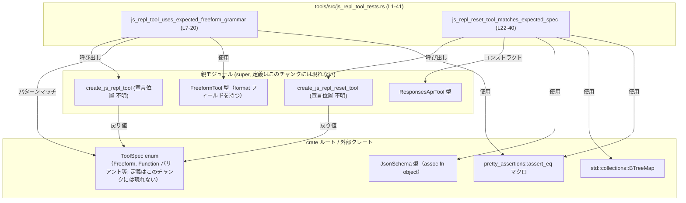

# tools/src/js_repl_tool_tests.rs コード解説

## 0. ざっくり一言

`create_js_repl_tool` と `create_js_repl_reset_tool` という 2 つのツール定義関数について、**期待されるツール仕様（ToolSpec）を検証するためのテスト**を集めたファイルです（tools/src/js_repl_tool_tests.rs:L7-41）。

---

## 1. このモジュールの役割

### 1.1 概要

- このモジュールは、JavaScript REPL 用ツールの仕様が **所定の形式・文法であること** をテストします。
- 具体的には、
  - JS REPL 本体ツールが **Freeform 形式の Lark 文法** を使っていること（L8-20）
  - JS REPL のリセット用ツールが、**パラメータ無しの function 型ツール仕様** であること（L23-40）
  を検証します。

### 1.2 アーキテクチャ内での位置づけ

このテストモジュールは、親モジュールで定義されているツールファクトリ関数に依存し、その戻り値を `ToolSpec` 経由で検証します。



※ `F1`, `F2`, `S1`, `S2`, `ToolSpec`, `JsonSchema` の定義自体はこのファイルには現れません（全て `use super::*` と `use crate::*` によりインポートされています: L1-3）。

### 1.3 設計上のポイント

- **テストのみを含むモジュール**
  - `#[test]` 属性付き関数のみが定義されています（L7, L22）。
- **仕様を文字列レベルで固定**
  - JS REPL 用 Freeform 文法について、`format.syntax` と `format.definition` の内容を具体的な文字列として検証し、仕様の「固定化された期待」を表現しています（L13-19）。
- **ToolSpec の形を厳密に比較**
  - `create_js_repl_reset_tool` の戻り値と、インラインで構築した `ToolSpec::Function(ResponsesApiTool { ... })` を `assert_eq!` で **完全一致** として比較しています（L24-40）。
  - これにより、ツール名・説明文・パラメータ schema 等、全フィールドが期待通りであることが契約になります。
- **エラー処理方針**
  - 異常時はすべて `panic!` を通じてテスト失敗として扱います。
    - `let-else` 構文内の `panic!`（L9-11）
    - `assert_eq!` / `assert!` の失敗（L13-19, L24-40）
- **並行性**
  - このファイル内でスレッドや async/await は使用しておらず、**並行性に関わる状態や副作用はありません**。

### 1.4 コンポーネント一覧（インベントリー）

このチャンク内に現れる主要なコンポーネントを一覧します。

#### 関数（このファイルで定義）

| 名前 | 種別 | 役割 / 用途 | 定義位置 |
|------|------|-------------|----------|
| `js_repl_tool_uses_expected_freeform_grammar` | 関数（テスト） | `create_js_repl_tool` が Freeform ツール仕様を返し、その文法定義が期待通りかを検証する | tools/src/js_repl_tool_tests.rs:L7-20 |
| `js_repl_reset_tool_matches_expected_spec` | 関数（テスト） | `create_js_repl_reset_tool` の戻り値が、決め打ちした `ToolSpec::Function(ResponsesApiTool { ... })` と完全一致することを検証する | tools/src/js_repl_tool_tests.rs:L22-40 |

#### このファイルで利用するが、他所で定義される型・関数等

| 名前 | 種別 | 役割 / 用途 | このチャンクから分かること | 定義位置 |
|------|------|-------------|----------------------------|----------|
| `ToolSpec` | 列挙体と推測 | ツール仕様を表す列挙体。少なくとも `Freeform` と `Function` バリアントを持つ | パターン `ToolSpec::Freeform(..)`（L8-10）、値 `ToolSpec::Function(..)`（L26）として使用されている | 定義はこのチャンクには現れない（`use crate::ToolSpec`; L3） |
| `FreeformTool` | 構造体または struct 形式バリアント | Freeform ツールの詳細を保持する型。少なくとも `format` フィールドを持つ | パターン `FreeformTool { format, .. }` から struct 形式のフィールド `format` が存在することが分かる（L8） | 定義はこのチャンクには現れない（`use super::*`; L1） |
| `ResponsesApiTool` | 構造体または struct 形式バリアント | Function 型ツールのメタ情報（name, description, strict, defer_loading, parameters, output_schema）を保持する | リテラル `ResponsesApiTool { ... }` として全フィールドが初期化されている（L26-38） | 定義はこのチャンクには現れない（`use super::*`; L1） |
| `JsonSchema` | 型（詳細不明） | JSON Schema 風のスキーマ表現を提供する型。`object` 関数を持つ | 関連関数 `JsonSchema::object(...)` が呼ばれている（L33） | 定義はこのチャンクには現れない（`use crate::JsonSchema`; L2） |
| `create_js_repl_tool` | 関数 | JS REPL 本体ツールの `ToolSpec` を構築して返す | 戻り値は `ToolSpec::Freeform(..)` とパターンマッチ可能（L8） | 定義はこのチャンクには現れない（`use super::*`; L1） |
| `create_js_repl_reset_tool` | 関数 | JS REPL のリセット用 `ToolSpec` を構築して返す | 戻り値は `ToolSpec::Function(ResponsesApiTool { ... })` と比較される（L24-26） | 定義はこのチャンクには現れない（`use super::*`; L1） |
| `assert_eq!` | マクロ | 2 つの値が等しいことを検証し、異なる場合に `panic!` する | `pretty_assertions::assert_eq` としてインポートされ、2 箇所で使用（L13, L24） | 外部クレート pretty_assertions 内（L4） |
| `assert!` | マクロ | bool 式が `true` であることを検証し、`false` の場合に `panic!` する | 文法定義文字列の部分一致／不一致を確認するために使用（L14-19） | 標準マクロ（プレリュードから利用可能） |

---

## 2. 主要な機能一覧

このファイル自体はテスト専用ですが、実質的に次の機能を提供します。

- JS REPL Freeform ツールの検証:
  - `create_js_repl_tool` が `ToolSpec::Freeform(FreeformTool { format, .. })` を返すこと
  - `format.syntax` が `"lark"` であること
  - `format.definition` に特定のトークン名やパターンが含まれている／含まれていないこと
- JS REPL リセットツールの検証:
  - `create_js_repl_reset_tool` が `ToolSpec::Function(ResponsesApiTool { ... })` を返すこと
  - ツール名・説明・パラメータ schema・strict フラグなどが完全一致していること

---

## 3. 公開 API と詳細解説

このファイルはテストモジュールのため、外部に直接公開される API は定義していません。ただし、テストが前提としている挙動は、対応する関数・型の **事実上の契約（contract）** として重要です。

### 3.1 型一覧（構造体・列挙体など）

このファイル内で新規に定義される型はありませんが、テストから読み取れる範囲の型情報を参考用にまとめます。

| 名前 | 種別 | 役割 / 用途 | 根拠 |
|------|------|-------------|------|
| `ToolSpec` | 列挙体（と解釈できる） | ツール仕様を表すメイン型。Freeform・Function などのバリアントを持つ | `ToolSpec::Freeform(...)`（L8-10）、`ToolSpec::Function(...)`（L26）という列挙体バリアント形式で使用されている |
| `FreeformTool` | 構造体または struct バリアント | Freeform 形式ツールのメタ情報。少なくとも `format` フィールドを持つ | パターン `FreeformTool { format, .. }`（L8）から struct 形式であることと `format` フィールドの存在が分かる |
| `ResponsesApiTool` | 構造体または struct バリアント | Function 形式ツールのメタ情報（name, description, strict, defer_loading, parameters, output_schema） | リテラル `ResponsesApiTool { ... }`（L26-38）から struct 形式で全フィールド名が分かる |
| `JsonSchema` | 型（構造体または enum など） | JSON Schema ライクなスキーマを表現する型。object 型を構築する `object` 関数を持つ | `JsonSchema::object(…)` の呼び出し（L33）から、関連関数を持つことが分かる |

> `JsonSchema::object` の第 3 引数が `Some(false.into())`（L36）になっている点から、一般的な JSON Schema での `additionalProperties: false` のような設定に対応している可能性がありますが、**このチャンクだけでは意味を断定できません**。

### 3.2 関数詳細（テスト関数 2 件）

#### `js_repl_tool_uses_expected_freeform_grammar()`

**概要**

- JS REPL 用ツール定義が
  - `ToolSpec::Freeform(FreeformTool { format, .. })` であること
  - `format.syntax` が `"lark"` であること
  - `format.definition` に特定のトークン名やパターンが含まれている／含まれていないこと
  を検証するテスト関数です（L8-19）。

**引数**

- なし（標準的な `#[test]` 関数シグネチャ）。

**戻り値**

- `()`（ユニット）。テスト失敗時は `panic!` によって異常終了します。

**内部処理の流れ**

1. `create_js_repl_tool` を呼び出し、その戻り値が `ToolSpec::Freeform(FreeformTool { format, .. })` であることを `let-else` 構文で確認します（L8-10）。
   - パターンにマッチしない場合は、`panic!("js_repl should use a freeform tool spec");` が実行されます（L10）。
2. `format.syntax` が文字列 `"lark"` と等しいことを `assert_eq!` で検証します（L13）。
3. `format.definition` が次の文字列を含むことをそれぞれ `assert!` で検証します（L14-18）。
   - `"PRAGMA_LINE"`
   - `` "`[^`]" ``
   - `"``[^`]"`
   - `"PLAIN_JS_SOURCE"`
   - `"codex-js-repl:"`
4. `format.definition` に `"(?!"` が **含まれない** ことを `assert!(!...)` で検証します（L19）。

```mermaid
flowchart TD
    A["js_repl_tool_uses_expected_freeform_grammar (L7-20)"]
    B["create_js_repl_tool()（定義はこのチャンクには現れない）"]
    C["ToolSpec::Freeform(FreeformTool { format, .. }) にマッチ？"]
    D["panic!(\"js_repl should use a freeform tool spec\")"]
    E["format.syntax == \"lark\" を検証 (L13)"]
    F["format.definition 内の contains(...) を検証 (L14-19)"]

    A --> B --> C
    C -- No --> D
    C -- Yes --> E --> F
```

**Examples（使用例）**

この関数自体はテスト用ですが、`create_js_repl_tool` の利用イメージとして、テストと同様のパターンマッチを用いたコード例を示します。

```rust
use crate::ToolSpec;
use super::{create_js_repl_tool, FreeformTool};

fn inspect_js_repl_tool() {
    // JS REPL ツール定義を取得する
    let spec = create_js_repl_tool(); // tools/src/js_repl_tool_tests.rs:L8 でも同様に無引数で呼び出している

    // Freeform ツールかどうかを確認し、format 情報を取り出す
    let ToolSpec::Freeform(FreeformTool { format, .. }) = spec else {
        // Freeform でない場合のハンドリング（ここでは単純にリターン）
        return;
    };

    // テストと同様、syntax や definition を検査できる
    if format.syntax != "lark" {
        // 仕様から外れている場合の対応（ログ出力など）
    }

    if !format.definition.contains("codex-js-repl:") {
        // 必須トークンが含まれていない場合の対応
    }
}
```

> 上記コードは、**このテストファイルから分かる型・フィールド名だけ** を用いて記述しています。

**Errors / Panics**

- `create_js_repl_tool` が `ToolSpec::Freeform(FreeformTool { .. })` 以外の値を返した場合:
  - `let` パターンにマッチせず、`else` 節の `panic!` が実行されます（L9-10）。
- `format.syntax != "lark"` の場合:
  - `assert_eq!` が `panic!` します（L13）。
- `format.definition` に期待する部分文字列が含まれていない場合:
  - それぞれの `assert!(...)` が `panic!` します（L14-18）。
- `format.definition` に `"(?!"` が含まれている場合:
  - `assert!(!...)` が `panic!` します（L19）。

**Edge cases（エッジケース）**

- `create_js_repl_tool` の返り値のバリアント変更  
  `ToolSpec::Freeform` ではないバリアントに変更された場合、このテストは必ず失敗します（L8-10）。
- `FreeformTool` の構造変更  
  `format` フィールド名が変わったり、存在しなくなった場合、コンパイルエラーになります（L8, L13-19）。
- 文法定義文字列の細かな変更  
  `format.definition` に含まれる文字列が、テストが期待するサブストリングと不一致になると失敗します（L14-19）。
  - 例: `"codex-js-repl:"` から `"codex-js-repl"` に変更するとテストが落ちます（L18）。

**使用上の注意点**

- このテスト関数は、**文法仕様の非常に細かな部分まで固定する契約** として機能します。
  - 文法に仕様変更を加える場合、`format.definition` の変更内容に応じて、このテストの期待値も更新する必要があります。
- `"(?!"` を禁止していること（L19）から、正規表現のネガティブ・ルックアヘッドを避けたいという制約が想定されますが、**理由はこのチャンクだけでは分かりません**。
- テスト関数なので、並行実行・スレッドセーフティに関する特別な配慮は不要です（共有状態や `static` 変数も使用していません）。

---

#### `js_repl_reset_tool_matches_expected_spec()`

**概要**

- `create_js_repl_reset_tool` の戻り値が、決め打ちされた `ToolSpec::Function(ResponsesApiTool { ... })` と**完全に一致**することを検証するテスト関数です（L23-40）。
- ツール名、説明、strict フラグ、パラメータ schema、output_schema が期待通りであることを保証します。

**引数**

- なし（標準的な `#[test]` 関数シグネチャ）。

**戻り値**

- `()`（ユニット）。等値比較が失敗した場合は `panic!` します。

**内部処理の流れ**

1. `create_js_repl_reset_tool()` を呼び出し、戻り値を取得します（L24-25）。
2. インラインで `ToolSpec::Function(ResponsesApiTool { ... })` を構築します（L26-38）。
   - `name`: `"js_repl_reset".to_string()`（L27）
   - `description`: `"Restarts the js_repl kernel for this run and clears persisted top-level bindings." .to_string()`（L28-30）
   - `strict`: `false`（L31）
   - `defer_loading`: `None`（L32）
   - `parameters`: `JsonSchema::object(BTreeMap::new(), None, Some(false.into()))`（L33-37）
   - `output_schema`: `None`（L38）
3. 手順 1 の戻り値と手順 2 の期待値を `assert_eq!` で比較します（L24-26, L39-40）。

```mermaid
sequenceDiagram
    participant R as "テストランナー"
    participant T as "js_repl_reset_tool_matches_expected_spec (L23-40)"
    participant F as "create_js_repl_reset_tool（定義不明; super::*）"

    R->>T: 呼び出し
    T->>F: create_js_repl_reset_tool() (L24-25)
    F-->>T: actual_spec: ToolSpec::Function(...)
    T->>T: expected_spec = ToolSpec::Function(ResponsesApiTool { ... }) 構築 (L26-38)
    T->>T: assert_eq!(actual_spec, expected_spec) (L24-26, L39-40)
    T-->>R: 正常終了 or panic!（不一致時）
```

**Examples（使用例）**

このテストと同様に、実装コードから JS REPL リセットツールの仕様を利用する例を示します。

```rust
use crate::{ToolSpec};
use super::{create_js_repl_reset_tool, ResponsesApiTool};

fn register_js_repl_reset_tool(registry: &mut Vec<ToolSpec>) {
    // ツール仕様を作成
    let reset_tool = create_js_repl_reset_tool(); // tools/src/js_repl_tool_tests.rs:L24 でも同様に無引数で呼び出し

    // Function 型ツールであることを前提に、必要ならマッチングする
    match &reset_tool {
        ToolSpec::Function(ResponsesApiTool { name, parameters, .. }) => {
            // ここで name や parameters を参照して登録処理を行うことができます
            let _ = (name, parameters); // 実際の利用コードに置き換え可能
        }
        _ => {
            // 仕様から外れる場合のハンドリング
        }
    }

    // レジストリに登録
    registry.push(reset_tool);
}
```

> 上記例は、このテストが前提としている「Function 型であり ResponsesApiTool を持つ」という点（L24-26）に基づいた利用イメージです。

**Errors / Panics**

- `create_js_repl_reset_tool()` の戻り値が、期待した `ToolSpec::Function(ResponsesApiTool { ... })` と `PartialEq` 的に一致しない場合:
  - `assert_eq!` が `panic!` します（L24-26, L39-40）。
- `ResponsesApiTool` にフィールドが追加され、`PartialEq` 実装がそれを比較対象に含めている場合:
  - 実装側とテスト側で値が異なればテスト失敗となります（特に、テスト側で新フィールドを初期化していない場合）。

**Edge cases（エッジケース）**

- `create_js_repl_reset_tool` のバリアント変更  
  `ToolSpec::Function` ではなく別のバリアントを返すように変更すると、比較が必ず失敗します（L24-26）。
- `name` や `description` の文言変更  
  説明文の小さな文言変更でも `assert_eq!` が不一致と判断し、テストが失敗します（L27-30）。
- パラメータ schema の変更  
  現状は `JsonSchema::object(BTreeMap::new(), None, Some(false.into()))` と空オブジェクトを期待しています（L33-37）。
  - 引数の仕様を変える（パラメータを追加する等）場合、このテストの期待値も合わせて変更する必要があります。

**使用上の注意点**

- このテストは、**ツール仕様の細部まで固定する強い回帰テスト** になっています。
  - フィールド追加・デフォルト値変更など、仕様の小さな変更でもテストが失敗します。
- 人間が読む説明文（`description`）も文字列として固定されているため（L28-30）、文言の微調整でもテスト修正が必要になります。
- 並行性に関わる状態は持たず、副作用はありません。複数テストが並列実行されても、このテスト同士が競合する要素はありません。

### 3.3 その他の関数

- このファイルには、補助関数やラッパー関数は存在しません。
- すべてのロジックは 2 つの `#[test]` 関数の中に直接記述されています（L7-20, L22-40）。

---

## 4. データフロー

ここでは `js_repl_tool_uses_expected_freeform_grammar` の実行時データフローを例として説明します。

1. テストランナーが `js_repl_tool_uses_expected_freeform_grammar` を呼び出します（L7-8）。
2. 関数内で `create_js_repl_tool()` が呼ばれ、`ToolSpec` 型の値（実際には `Freeform` バリアント）を生成します（L8-9）。
3. `let` パターンを通じて `ToolSpec::Freeform(FreeformTool { format, .. })` に分解され、`format` フィールドだけが取り出されます（L8）。
4. `format.syntax` および `format.definition` に対して、複数の検証が行われます（L13-19）。

```mermaid
sequenceDiagram
    participant R as "テストランナー"
    participant T as "js_repl_tool_uses_expected_freeform_grammar (L7-20)"
    participant F as "create_js_repl_tool（定義不明; super::*）"

    R->>T: 呼び出し
    T->>F: create_js_repl_tool() (L8)
    F-->>T: spec: ToolSpec
    T->>T: let ToolSpec::Freeform(FreeformTool { format, .. }) = spec else panic! (L8-10)
    T->>T: assert_eq!(format.syntax, "lark") (L13)
    T->>T: 含有チェック: format.definition.contains("...") (L14-18)
    T->>T: 非含有チェック: !format.definition.contains("(?!") (L19)
    T-->>R: 正常終了 or panic!（いずれかの検証失敗時）
```

> この図は `tools/src/js_repl_tool_tests.rs:L7-20` に対応します。

---

## 5. 使い方（How to Use）

このファイルはテストモジュールのため、「利用」と言っても主に **テストを実行する** ことになります。

### 5.1 基本的な使用方法

標準的な `cargo test` で、このファイルのテストを実行できます。

```bash
# クレート全体のテストを実行
cargo test

# このファイル内の JS REPL 関連テストだけを名前指定で実行
cargo test js_repl_tool_uses_expected_freeform_grammar
cargo test js_repl_reset_tool_matches_expected_spec
```

テストが成功する条件は次の通りです。

- `create_js_repl_tool` が Freeform ツール仕様を返し、その `format` がテストの期待する文法文字列を持っていること（L8-19）。
- `create_js_repl_reset_tool` が、テストと全く同じ `ToolSpec::Function(ResponsesApiTool { ... })` を返すこと（L24-40）。

### 5.2 よくある使用パターン

このファイルを理解すると、次のようなパターンで自分のテストを追加できます。

1. **新しいツールの仕様テストを追加する**

```rust
#[test]
fn new_tool_matches_expected_spec() {
    use crate::ToolSpec;
    use super::{create_new_tool, ResponsesApiTool}; // 仮の名前。実際は既存のファクトリに合わせる

    let actual = create_new_tool();

    let expected = ToolSpec::Function(ResponsesApiTool {
        name: "new_tool".to_string(),
        description: "説明文".to_string(),
        strict: true,
        defer_loading: None,
        parameters: /* JsonSchema::object(...) など */,
        output_schema: None,
    });

    pretty_assertions::assert_eq!(actual, expected);
}
```

> 上記は、このファイルの `js_repl_reset_tool_matches_expected_spec` と同じスタイルのテストです（L23-40）。

1. **Freeform 文法の部分的な検証**

```rust
#[test]
fn freeform_grammar_contains_custom_token() {
    use crate::ToolSpec;
    use super::{create_js_repl_tool, FreeformTool};

    let ToolSpec::Freeform(FreeformTool { format, .. }) = create_js_repl_tool() else {
        panic!("Expected Freeform tool");
    };

    assert!(format.definition.contains("CUSTOM_TOKEN"));
}
```

> `js_repl_tool_uses_expected_freeform_grammar` のパターン（L8-19）を再利用した形です。

### 5.3 よくある間違い

このファイルのスタイルから考えられる「誤用」パターンと、その修正例です。

```rust
// 誤り例: 戻り値のバリアントを確認せずにフィールドへアクセスしようとする
#[test]
fn wrong_usage_without_variant_check() {
    let spec = create_js_repl_tool();
    // コンパイルエラーになるか、予期しないバリアントの場合にパニックする可能性がある
    // spec.format.syntax など、存在しないパスを直接参照しようとするのは危険
}

// 正しい例: ToolSpec のバリアントを明示的にマッチさせる
#[test]
fn correct_usage_with_variant_match() {
    use crate::ToolSpec;
    use super::FreeformTool;

    let ToolSpec::Freeform(FreeformTool { format, .. }) = create_js_repl_tool() else {
        panic!("Expected Freeform tool");
    };

    assert_eq!(format.syntax, "lark");
}
```

> 実際のファイルでも、`ToolSpec::Freeform(FreeformTool { format, .. })` というパターンマッチを行い、バリアントを明示的に確認しています（L8-10）。

### 5.4 使用上の注意点（まとめ）

- **契約としてのテスト**
  - ここでのテストは、「実装が満たすべき仕様」を文字列レベルで固定する役割を持ちます。
  - 仕様変更時は、実装と同時にテストの期待値も整合を取る必要があります（L13-19, L27-38）。
- **パターンマッチの前提**
  - `ToolSpec` の特定バリアントを前提として `let` パターンを書いているため（L8, L24-26）、バリアント構造が変わるとテストが失敗します。
- **JSON Schema の詳細はこのチャンクからは不明**
  - `JsonSchema::object` の引数が何を意味するかは、このファイルだけでは分かりません（L33-37）。
  - schema の契約を変更する場合は、`JsonSchema` の定義側のドキュメントを参照する必要があります。

---

## 6. 変更の仕方（How to Modify）

### 6.1 新しい機能（テスト）を追加する場合

1. **対象となるツール／関数を特定する**
   - 親モジュール（`super::*`; L1）に実装されている関数（例: `create_xxx_tool`）を対象とします。
2. **期待する `ToolSpec` やフィールドを決める**
   - 既存テストと同様に、`ToolSpec::Function(ResponsesApiTool { ... })` あるいは `ToolSpec::Freeform(FreeformTool { ... })` のような形で期待値を構築します（L8-10, L26-38）。
3. **`#[test]` 関数を追加する**
   - `js_repl_reset_tool_matches_expected_spec` をテンプレートとして、`assert_eq!` または `assert!` を用いたテストを追加します（L23-40）。
4. **必要なインポートを追加する**
   - 新たな型や関数を使う場合は、`use super::*;` か個別の `use` 文を追加します（L1-5 を参考）。

### 6.2 既存の機能（テスト／実装）を変更する場合

- **文法仕様（Freeform）の変更**
  - `create_js_repl_tool` 側で `format.syntax` または `format.definition` を変更した場合、
    - `js_repl_tool_uses_expected_freeform_grammar` 内の `assert_eq!` / `assert!` / `assert!(!...)` の期待値（L13-19）を新仕様に合わせて更新します。
- **リセットツール仕様の変更**
  - ツール名・説明・パラメータ schema・strict フラグなどを変更した場合、
    - `js_repl_reset_tool_matches_expected_spec` 内の `ResponsesApiTool { ... }` 初期化部（L26-38）を合わせて変更します。
- **影響範囲の確認**
  - `create_js_repl_tool` / `create_js_repl_reset_tool` は、他のモジュールからも利用されている可能性があります。このファイルからは分からないため、
    - 変更時には **定義ファイル側** とその参照箇所（`rg create_js_repl_tool` 等）を確認する必要があります。
- **契約（前提条件）の維持**
  - バリアント種別（Freeform / Function）を変えると、このテストが失敗するだけでなく、他のコードも影響を受ける可能性があります。
  - 仕様としてバリアントを変更する場合は、その旨を明確にし、テストもそれに合わせて修正します。

---

## 7. 関連ファイル

このモジュールと密接に関係するファイル・コンポーネントは、コードから次のように推測できます。

| パス / コンポーネント | 役割 / 関係 |
|-----------------------|------------|
| 親モジュール（`super`; 実際のファイル名はこのチャンクには現れない） | `create_js_repl_tool` および `create_js_repl_reset_tool`、`FreeformTool`、`ResponsesApiTool` を定義しているモジュール。テストの直接の対象です（L1, L8, L24, L26）。 |
| `crate::ToolSpec` | ツール仕様を表す列挙体。Freeform / Function などのバリアントを持ち、このファイルのテストでは API 契約の中心となる型です（L3, L8-10, L24-26）。 |
| `crate::JsonSchema` | ツール引数の schema を表現する型。`JsonSchema::object` によりオブジェクト型を構築しています（L2, L33-37）。 |
| 外部クレート `pretty_assertions` | `assert_eq!` マクロの差分表示を拡張するための外部依存です（L4, L13, L24）。 |
| 標準ライブラリ `std::collections::BTreeMap` | `JsonSchema::object` に渡すプロパティマップとして使用されています（L5, L34）。 |

> 実際の定義ファイル（親モジュールの `.rs` ファイル）名や、`ToolSpec` / `JsonSchema` の詳細はこのチャンクには含まれていないため、必要に応じてプロジェクト全体の構成から確認する必要があります。
