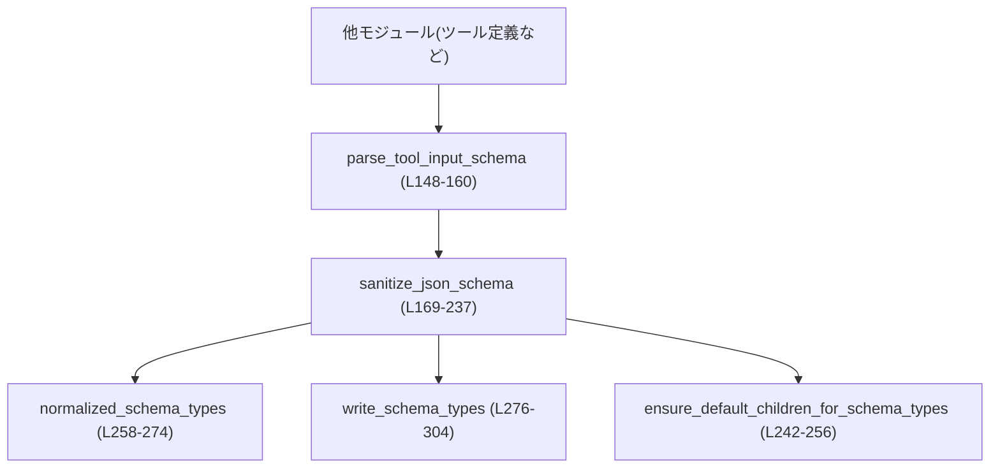
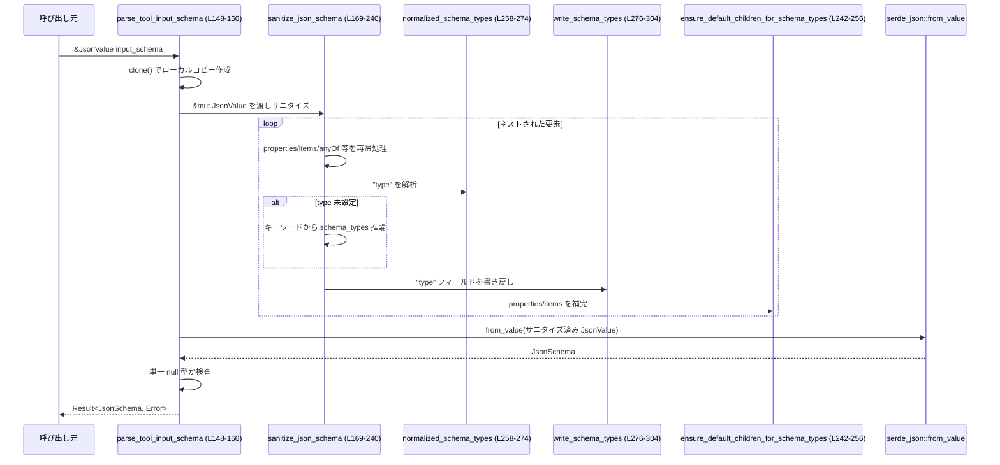

tools/src/json_schema.rs

---

## 0. ざっくり一言

- ツール用に扱う **制限付き JSON Schema サブセット** を表現・構築・パースするためのモジュールです。
- `serde_json::Value` で与えられたスキーマを正規化（sanitize）し、`JsonSchema` 構造体として安全に扱える形に変換します。

---

## 1. このモジュールの役割

### 1.1 概要

- このモジュールは、ツール定義に用いる JSON Schema 入力スキーマを扱うために存在し、次の機能を提供します。
  - JSON Schema のプリミティブ型・複合型を表現する **型定義（構造体・列挙体）**（`JsonSchema*`）  
    （`tools/src/json_schema.rs:L15-55`）
  - JSON Schema `type` や `properties` などを **制限付きの内部表現にマッピング** するサニタイズ処理  
    （`sanitize_json_schema`、`normalized_schema_types` など `L169-237`, `L258-304`）
  - ツールの `input_schema` を受け取り、`JsonSchema` に変換する **公開パーサ**  
    （`parse_tool_input_schema` `L148-160`）

### 1.2 アーキテクチャ内での位置づけ

- このモジュールは「ツール定義」レイヤの内部ユーティリティとして機能し、外部からは主に
  - `parse_tool_input_schema`（JSON → `JsonSchema`）
  - `JsonSchema` / `AdditionalProperties` のコンストラクタ群
  を通じて利用されると考えられます（他モジュールはこのチャンクには現れないため、詳細な呼び出し元は不明です）。

代表的な依存関係は次のとおりです。



### 1.3 設計上のポイント

- **JSON Schema のサブセット表現**
  - OpenAI Structured Outputs でサポートされる `type` 群（string, number, boolean, integer, object, array, null）に対応する列挙体 `JsonSchemaPrimitiveType` を定義しています（`L7-23`）。
  - 複数型の union を扱うため `JsonSchemaType::Multiple(Vec<...>)` を用意しています（`L25-31`）。

- **サニタイズとデフォルト補完**
  - 任意の JSON 値 (`serde_json::Value`) を受け取り、`type` 欠如時に **他のキーワードから型を推論** し、`properties` / `items` などの子要素を **デフォルト補完** します（`sanitize_json_schema` と `ensure_default_children_for_schema_types` `L169-237`, `L242-256`）。
  - `const` → 単一要素 `enum` への変換（`L203-205`）など、より狭いサブセットに収めるための変換も行います。

- **エラー・安全性ポリシー**
  - 最終的な `JsonSchema` への変換は `serde_json::from_value` に任せ、型不一致などは `serde_json::Error` として呼び出し元へ返します（`L152`）。
  - ツールの input schema が `{"type": "null"}` のような **「単一 null 型」** の場合は、独自エラーとして拒否します（`L153-157`, `singleton_null_schema_error` `L331-335`）。

- **状態なし・スレッドセーフ**
  - グローバル可変状態や `unsafe` は一切使用しておらず、すべての関数は引数のみを入力として結果を返す純粋関数に近い構造です。
  - そのため、`JsonSchema` 自体を複数スレッドから共有することも、通常の Rust の同期プリミティブを使えば安全に行えます。

---

## 2. 主要な機能一覧

- ツール入力スキーマのパース: `parse_tool_input_schema` で `serde_json::Value` から `JsonSchema` を構築（`L148-160`）。
- JSON Schema プリミティブ型の表現: `JsonSchemaPrimitiveType` 列挙体で 7 種類のプリミティブ型を表現（`L15-23`）。
- JSON Schema `type` の単一／複数表現: `JsonSchemaType` による `Single` / `Multiple` の表現（`L28-31`）。
- 一般的なスキーマ構造の表現: `JsonSchema` 構造体による `type`, `enum`, `items`, `properties`, `required`, `additionalProperties`, `anyOf` のサポート（`L35-54`）。
- 便利コンストラクタ:
  - `JsonSchema::string`, `number`, `integer`, `boolean`, `null` などの単一型スキーマ生成（`L75-93`）。
  - `JsonSchema::string_enum` による列挙型スキーマ生成（`L95-101`）。
  - `JsonSchema::array`, `JsonSchema::object`, `JsonSchema::any_of` による複合スキーマ生成（`L67-73`, `L104-111`, `L113-125`）。
- 追加プロパティ制御: `AdditionalProperties` による `true/false` またはサブスキーマの表現と `From<bool>`, `From<JsonSchema>` 実装（`L128-146`）。
- JSON Schema のサニタイズ:
  - `sanitize_json_schema` による再帰的正規化（`L169-240`）。
  - `normalized_schema_types` / `write_schema_types` / `ensure_default_children_for_schema_types` による型推論と補完（`L242-256`, `L258-304`）。

---

## 3. 公開 API と詳細解説

### 3.1 型一覧（構造体・列挙体など）

| 名前 | 種別 | 公開 | 定義範囲 | 役割 / 用途 |
|------|------|------|----------|-------------|
| `JsonSchemaPrimitiveType` | 列挙体 | `pub` | `tools/src/json_schema.rs:L15-23` | JSON Schema プリミティブ型（string/number/boolean/integer/object/array/null）を表現します。 |
| `JsonSchemaType` | 列挙体 | `pub` | `tools/src/json_schema.rs:L28-31` | JSON Schema `type` を単一 (`Single`) または複数 (`Multiple`) のプリミティブ型として表現します。 |
| `JsonSchema` | 構造体 | `pub` | `tools/src/json_schema.rs:L35-54` | ツール定義で利用する JSON Schema サブセットを表現します。`type`, `enum`, `items`, `properties`, `required`, `additionalProperties`, `anyOf` を内包します。 |
| `AdditionalProperties` | 列挙体 | `pub` | `tools/src/json_schema.rs:L131-134` | `additionalProperties` キーワードを `bool` またはサブスキーマのどちらかとして表現します。 |

### 3.2 関数詳細（重要なもの）

#### `parse_tool_input_schema(input_schema: &JsonValue) -> Result<JsonSchema, serde_json::Error>`

**定義位置**

- `tools/src/json_schema.rs:L148-160`

**概要**

- ツール定義の `input_schema`（任意の JSON 値）を受け取り、本モジュールの `JsonSchema` 構造体にパースします。
- 内部で JSON Schema を正規化（サニタイズ）した上で `serde_json::from_value` によりデシリアライズし、単一 `null` 型スキーマを禁止します。

**引数**

| 引数名 | 型 | 説明 |
|--------|----|------|
| `input_schema` | `&JsonValue` | 元の JSON Schema（任意の JSON）。`serde_json::Value` として渡されます。 |

**戻り値**

- `Ok(JsonSchema)` : サニタイズ済みかつ `JsonSchema` にマッピング可能な入力スキーマ。
- `Err(serde_json::Error)` : サニタイズ後に `JsonSchema` としてパースできない場合、または単一 `null` 型スキーマの場合のエラー。

**内部処理の流れ**

1. `input_schema` をローカル変数に `clone` します（`L150`）。  
   - 所有権を取らずに &JsonValue を受け取り、サニタイズのためにコピーを作成しています。
2. `sanitize_json_schema(&mut input_schema)` を呼び、スキーマ構造を内部表現に適合するよう再帰的に整形します（`L151`）。
3. サニタイズされた `input_schema` を `serde_json::from_value` で `JsonSchema` にデシリアライズします（`L152`）。
4. 結果の `schema.schema_type` が `Some(JsonSchemaType::Single(JsonSchemaPrimitiveType::Null))` の場合、`singleton_null_schema_error()` を返してエラーにします（`L153-157`）。
5. 上記以外は `Ok(schema)` を返します（`L159`）。

**Examples（使用例）**

ツールの input schema を Rust コードからパースする例です。

```rust
use serde_json::json;
use tools::json_schema::{parse_tool_input_schema, JsonSchema, JsonSchemaType, JsonSchemaPrimitiveType};

// シンプルなオブジェクト型のスキーマを JSON で定義する
let raw_schema = json!({
    "type": "object",
    "properties": {
        "query": { "type": "string", "description": "検索クエリ" }
    },
    "required": ["query"]
});

// JSON Value から JsonSchema にパースする
let schema = parse_tool_input_schema(&raw_schema)?;

// 返ってきた JsonSchema の型を確認する（例: object 型であること）
assert!(matches!(
    schema.schema_type,
    Some(JsonSchemaType::Single(JsonSchemaPrimitiveType::Object))
));
```

**Errors / Panics**

- `serde_json::from_value` 由来のエラー:
  - サニタイズ後の JSON が `JsonSchema` 構造体と整合しない場合（未知の形など）、`Err(serde_json::Error)` になります（`L152`）。
- 単一 `null` 型スキーマ:
  - スキーマの `type` が `null` で他の型を含まない場合、`singleton_null_schema_error()`（`L331-335`）により `InvalidInput` を表す `serde_json::Error` が返ります（`L153-157`）。
- `panic`:
  - この関数で `panic!` は使用されておらず、通常の使用でパニックは発生しません（コード全体に `unwrap` 等もありません）。

**Edge cases（エッジケース）**

- `{"type": "null"}`:
  - サニタイズ後も単一 `null` 型なので、`Err` が返ります（`L153-157`）。
- `{"type": ["null", "string"], "enum": ["a","b"]}`:
  - 複数型（nullable union）は許容され、`JsonSchemaType::Multiple` として通過します（`L28-31`, `L266-271`）。
- 真偽値形式のスキーマ (`true` / `false`):
  - `sanitize_json_schema` が `{"type": "string"}` に変換してからデシリアライズします（`L171-174`）。`false` スキーマは「何も許可しない」のが本来ですが、本実装では「文字列を許可するスキーマ」に緩和される点に注意が必要です。

**使用上の注意点**

- `input_schema` は **任意の JSON** を受け取りますが、最終的に `JsonSchema` に対応しない構造はエラーになります。
- セキュリティ上、`input_schema` を外部から直接受け取る場合は、サイズやネスト深度の制御を上位レイヤで行う必要があります。`sanitize_json_schema` は再帰的に走査するため、極端に深いネストに対してはスタック使用量が増えます。
- `type: "null"` のみを持つスキーマは受け付けない仕様です。nullable を表現したい場合は `["null", "<別の型>"]` のような union を利用する必要があります。

---

#### `JsonSchema::object(properties: BTreeMap<String, JsonSchema>, required: Option<Vec<String>>, additional_properties: Option<AdditionalProperties>) -> Self`

**定義位置**

- `tools/src/json_schema.rs:L113-125`

**概要**

- JSON Schema の `type: "object"` を表す `JsonSchema` を生成します。
- `properties`, `required`, `additionalProperties` を明示的に設定し、そのほかのフィールドはデフォルト値になります。

**引数**

| 引数名 | 型 | 説明 |
|--------|----|------|
| `properties` | `BTreeMap<String, JsonSchema>` | プロパティ名からサブスキーマへのマップ。 |
| `required` | `Option<Vec<String>>` | 必須プロパティ名のリスト。`None` の場合は `required` を省略します。 |
| `additional_properties` | `Option<AdditionalProperties>` | `additionalProperties` の設定。`None` の場合は省略します。 |

**戻り値**

- `JsonSchema` : `schema_type` が `Object` に設定され、`properties`, `required`, `additional_properties` が引数に応じてセットされたスキーマ。

**内部処理の流れ**

1. `schema_type` に `Some(JsonSchemaType::Single(JsonSchemaPrimitiveType::Object))` を設定します（`L119-120`）。
2. `properties` を `Some(properties)` として格納します（`L120`）。
3. `required`, `additional_properties` をそのままの `Option` で格納します（`L121-122`）。
4. 他のフィールド（`description`, `enum_values`, `items`, `any_of`）は `..Default::default()` により `None` になります（`L123`）。

**Examples（使用例）**

```rust
use std::collections::BTreeMap;
use tools::json_schema::{JsonSchema, AdditionalProperties};

let mut props = BTreeMap::new();
props.insert("id".to_string(), JsonSchema::integer(Some("ユーザーID".into())));
props.insert("name".to_string(), JsonSchema::string(Some("ユーザー名".into())));

let schema = JsonSchema::object(
    props,
    Some(vec!["id".to_string()]),      // "id" を必須にする
    Some(AdditionalProperties::from(false)), // 追加プロパティを禁止
);

// schema.schema_type は Object, properties/required/additionalProperties が設定されている
```

**Edge cases / 注意点**

- `properties` に空のマップを渡した場合でも、`type: "object"` のスキーマとして有効です。
- `required` に `properties` に存在しないプロパティ名を入れても、このモジュールは特に検証しません（バリデーションは行っていません）。  
  そのため、この整合性チェックは上位レイヤまたは別の段階で行う必要があります。

---

#### `JsonSchema::array(items: JsonSchema, description: Option<String>) -> Self`

**定義位置**

- `tools/src/json_schema.rs:L104-111`

**概要**

- JSON Schema の `type: "array"` を表す `JsonSchema` を生成します。
- 要素スキーマ `items` を必須引数として受け取ります。

**引数**

| 引数名 | 型 | 説明 |
|--------|----|------|
| `items` | `JsonSchema` | 配列要素のスキーマ。 |
| `description` | `Option<String>` | スキーマの説明文。`None` で省略。 |

**戻り値**

- `JsonSchema` : `schema_type` が `Array` に設定され、`items` が指定されたスキーマ。

**内部処理**

- `schema_type` に `Array` をセットし、`items` に `Box::new(items)` を格納し、`description` をそのまま設定します（`L106-108`）。

**使用上の注意点**

- `items` は `JsonSchema`（内部表現）であり、すでに `string` や `object` などから組み立てたものを渡します。
- `sanitize_json_schema` 側でも `Array` 型に対して `items` を補完する処理がありますが（`L253-255`）、このコンストラクタ経由の場合は必ず `items` が設定されます。

---

#### `JsonSchema::string_enum(values: Vec<JsonValue>, description: Option<String>) -> Self`

**定義位置**

- `tools/src/json_schema.rs:L95-101`

**概要**

- `type: "string"` かつ `enum` で許可される値を制限したスキーマを生成します。

**引数**

| 引数名 | 型 | 説明 |
|--------|----|------|
| `values` | `Vec<JsonValue>` | 列挙される許可値。JSON 文字列が想定されますが、型の制約は設けていません。 |
| `description` | `Option<String>` | 説明文。 |

**戻り値**

- `JsonSchema` : `schema_type` が `String` で、`enum_values` に `values` が格納されたもの。

**内部処理**

- `schema_type` を `String` に設定し、`enum_values` に `Some(values)` を格納します（`L97-100`）。

**Edge cases / 注意点**

- `values` 内の要素型は型チェックされません。JSON 文字列以外（数値など）が混じっていても、そのまま `enum` に入ります。
- 実際のバリデーション実装が存在する場合（このチャンクには現れない）、`enum` に非文字列が混入していると不整合が起こる可能性があります。

---

#### `JsonSchema::any_of(variants: Vec<JsonSchema>, description: Option<String>) -> Self`

**定義位置**

- `tools/src/json_schema.rs:L67-73`

**概要**

- JSON Schema の `anyOf` に対応する複数バリアントのスキーマを生成します。

**引数**

| 引数名 | 型 | 説明 |
|--------|----|------|
| `variants` | `Vec<JsonSchema>` | anyOf に含めるスキーマ群。 |
| `description` | `Option<String>` | 説明文。 |

**戻り値**

- `JsonSchema` : `any_of` に `variants` が設定されたスキーマ。

**内部処理**

- `schema_type` など他のフィールドは `Default::default()` のままで、`description` と `any_of` のみを設定します（`L68-71`）。

**注意点**

- `type` フィールドは明示的には設定されません。`anyOf` の仕様上、ルートに `type` がなくても有効です。

---

#### `sanitize_json_schema(value: &mut JsonValue)`

**定義位置**

- `tools/src/json_schema.rs:L169-240`

**概要**

- 任意の JSON Schema（`serde_json::Value` 表現）を **本モジュールのサブセットに収まる形に整理・補完** します。
- ブール形式スキーマや `const`, `anyOf`, `properties`, `items`, `additionalProperties` などを再帰的に処理します。

**引数**

| 引数名 | 型 | 説明 |
|--------|----|------|
| `value` | `&mut JsonValue` | 正規化対象の JSON 値。関数内で就地（in-place）書き換えされます。 |

**戻り値**

- 戻り値はありませんが、`value` が就地で変更されます。

**内部処理の流れ（要点）**

1. `Bool` の場合:
   - `true` / `false` のいずれでも `{"type": "string"}` に置き換えます（`L171-174`）。
2. `Array` の場合:
   - 各要素に対して再帰的に `sanitize_json_schema` を適用します（`L175-179`）。
3. `Object` の場合:
   - `properties`, `items`, `additionalProperties`（bool 以外）, `prefixItems`, `anyOf` の各フィールドを再帰的にサニタイズします（`L181-201`）。
   - `const` があれば削除し、その値を単一要素の `enum` に変換します（`L203-205`）。
   - `normalized_schema_types` で `type` を解釈し、`schema_types` に格納します（`L207-208`）。
   - `schema_types` が空で、かつ `anyOf` がある場合は、`type` を推論せずに終了します（`L209-211`）。
   - 上記以外で `type` が空の場合、以下のヒューリスティクスで `schema_types` を補完します（`L213-232`）:
     - `properties` / `required` / `additionalProperties` があれば `Object`
     - `items` / `prefixItems` があれば `Array`
     - `enum` / `format` があれば `String`
     - 数値制約 (`minimum`, `maximum`, `exclusiveMinimum`, `exclusiveMaximum`, `multipleOf`) があれば `Number`
     - 上記に当てはまらなければ `String`
   - `write_schema_types` で `type` フィールドを書き戻し、`ensure_default_children_for_schema_types` で `Object`/`Array` に必要な子を補完します（`L235-236`）。
4. その他（`Null` や `Number` など）は変更せずにそのままです（`L238`）。

**Errors / Panics**

- エラーもパニックも返さず、すべてをデータ変換として扱います。  
  非対応の `type` 文字列は黙って無視され、後続のヒューリスティクスで `type` が補完されます（`L265-272`, `L213-232`）。

**Edge cases / 注意点**

- `type: ["string", "unknown"]`:
  - `normalized_schema_types` は `"unknown"` を無視し、`["string"]` のみを保持します（`L265-271`, `L306-316`）。
- `type` が不正な型（数値など）の場合:
  - `normalized_schema_types` は空ベクタを返し（`L272`）、キーワード群から推論された型が採用されます（`L213-232`）。
- `anyOf` を持つオブジェクトで `type` がなければ、`schema_types` が空で `map.contains_key("anyOf")` のため、そのまま `return` し、`type` 推論・子補完は行われません（`L209-211`）。
- 非常に深くネストしたスキーマ:
  - 再帰呼び出しのため、理論上はスタックオーバーフローの可能性があります。現実的なスキーマでは問題にならないサイズで設計されていると考えられますが、外部入力から直接巨大スキーマを受ける場合は注意が必要です。

---

#### `normalized_schema_types(map: &serde_json::Map<String, JsonValue>) -> Vec<JsonSchemaPrimitiveType>`

**定義位置**

- `tools/src/json_schema.rs:L258-274`

**概要**

- JSON オブジェクト内の `"type"` フィールドから、`JsonSchemaPrimitiveType` のリストを抽出・正規化します。

**引数**

| 引数名 | 型 | 説明 |
|--------|----|------|
| `map` | `&serde_json::Map<String, JsonValue>` | `"type"` フィールドを含む可能性のあるオブジェクト。 |

**戻り値**

- `Vec<JsonSchemaPrimitiveType>` : 有効な型名の列挙。`"type"` が存在しない、または解釈できない場合は空ベクタ。

**内部処理**

1. `"type"` キーが存在しない場合は空ベクタを返します（`L261-263`）。
2. `"type"` が文字列なら `schema_type_from_str` で 1 つの列挙値に変換し、`Option::into_iter().collect()` で 0 or 1 要素の Vec にします（`L265-266`）。
3. `"type"` が配列なら、各要素について
   - `as_str()` で文字列に変換
   - `schema_type_from_str` で `Option<JsonSchemaPrimitiveType>` に変換
   - `filter_map` により有効な型だけを Vec に収集します（`L267-271`）。
4. それ以外の型（数値など）の場合は空ベクタを返します（`L272-273`）。

**注意点**

- `"type": "unknown"` のような未対応の型名は黙って無視されます（`schema_type_from_str` `L306-316`）。
- `"type": []` の場合は空ベクタとなり、その後の処理で推論に委ねられます。

---

#### `ensure_default_children_for_schema_types(map: &mut serde_json::Map<String, JsonValue>, schema_types: &[JsonSchemaPrimitiveType])`

**定義位置**

- `tools/src/json_schema.rs:L242-256`

**概要**

- `Object` / `Array` 型スキーマに対して、必須の子フィールド (`properties`, `items`) がなければデフォルト値を補完します。

**引数**

| 引数名 | 型 | 説明 |
|--------|----|------|
| `map` | `&mut serde_json::Map<String, JsonValue>` | 補完対象のスキーマオブジェクト。 |
| `schema_types` | `&[JsonSchemaPrimitiveType]` | 対象オブジェクトの `type`（複数可）。 |

**戻り値**

- 返り値なし。`map` が就地変更されます。

**内部処理**

- `schema_types` に `Object` が含まれ、かつ `"properties"` キーがなければ、空オブジェクト `{}` を挿入します（`L246-251`）。
- `schema_types` に `Array` が含まれ、かつ `"items"` キーがなければ、`{"type": "string"}` を挿入します（`L253-255`）。

**注意点**

- `Object` / `Array` 以外の型には影響しません。
- union 型（例: `["null", "object"]`）でも、`schema_types` に `Object` が含まれていれば補完が行われます。

---

### 3.3 その他の関数・メソッド・実装

| 名前 | 種別 | 定義範囲 | 役割（1 行） |
|------|------|----------|--------------|
| `JsonSchema::typed` | メソッド（`fn`, private） | `tools/src/json_schema.rs:L59-65` | 単一プリミティブ型と任意の説明から `JsonSchema` を生成する共通ヘルパー。 |
| `JsonSchema::boolean` | メソッド（`pub`） | `L75-77` | `type: "boolean"` なスキーマを生成。 |
| `JsonSchema::string` | メソッド（`pub`） | `L79-81` | `type: "string"` なスキーマを生成。 |
| `JsonSchema::number` | メソッド（`pub`） | `L83-85` | `type: "number"` なスキーマを生成。 |
| `JsonSchema::integer` | メソッド（`pub`） | `L87-89` | `type: "integer"` なスキーマを生成。 |
| `JsonSchema::null` | メソッド（`pub`） | `L91-93` | `type: "null"` なスキーマを生成（ただし `parse_tool_input_schema` は単一 null を許可しない点に注意）。 |
| `impl From<bool> for AdditionalProperties` | トレイト実装 | `L136-140` | `true`/`false` から `AdditionalProperties::Boolean` を構築する。 |
| `impl From<JsonSchema> for AdditionalProperties` | トレイト実装 | `L142-145` | サブスキーマから `AdditionalProperties::Schema` を構築する。 |
| `write_schema_types` | 関数（private） | `L276-304` | `schema_types` ベクタから `"type"` フィールドの JSON 表現（文字列または配列）を生成。 |
| `schema_type_from_str` | 関数（private） | `L306-316` | 文字列から `JsonSchemaPrimitiveType` への変換。未対応の文字列は `None`。 |
| `schema_type_name` | 関数（private） | `L319-328` | `JsonSchemaPrimitiveType` から `"string"` などの文字列表現への変換。 |
| `singleton_null_schema_error` | 関数（private） | `L331-335` | 単一 null 型スキーマ専用の `serde_json::Error` を生成。 |

---

## 4. データフロー

ここでは、代表的なシナリオとして **ツールの input schema（JSON）をパースする場合** のデータフローを説明します。

1. 呼び出し元が `serde_json::Value` 型のスキーマを構築するか、外部入力からデコードします。
2. その `&JsonValue` を `parse_tool_input_schema` に渡します（`L148-160`）。
3. 関数内部でスキーマがコピーされ、`sanitize_json_schema` により再帰的に正規化されます（`L169-240`）。
4. 正規化された JSON は `serde_json::from_value` によって `JsonSchema` にデシリアライズされます（`L152`）。
5. 単一 null スキーマでないかをチェックした後、`JsonSchema` が呼び出し元に返されます。

この流れをシーケンス図で表すと次のようになります。



---

## 5. 使い方（How to Use）

### 5.1 基本的な使用方法

**ツールの input schema を JSON で書き、それを `JsonSchema` に変換する例** です。

```rust
use serde_json::json; // JSON リテラルマクロ
use tools::json_schema::{parse_tool_input_schema, JsonSchema};

fn main() -> Result<(), Box<dyn std::error::Error>> {
    // 1. ツールの入力パラメータを JSON Schema で定義する
    let raw_schema = json!({
        "type": "object",                       // オブジェクト型
        "properties": {
            "city":  { "type": "string" },      // city プロパティ
            "limit": { "type": "integer" }      // limit プロパティ
        },
        "required": ["city"]                    // city は必須
    });

    // 2. JsonSchema にパースする（内部でサニタイズが走る）
    let schema: JsonSchema = parse_tool_input_schema(&raw_schema)?; // Result なので ? でエラー伝播

    // 3. 以降は schema を使ってツール定義やバリデーションロジックに渡す
    println!("{:#?}", schema); // Debug 表示が可能（L34 の derive）

    Ok(())
}
```

### 5.2 よくある使用パターン

#### パターン1: Rust 側から JsonSchema を直接構築する

JSON を経由せず、コード上で `JsonSchema` を組み立てる例です。

```rust
use std::collections::BTreeMap;
use tools::json_schema::{JsonSchema, AdditionalProperties};

let mut props = BTreeMap::new();
props.insert("q".into(), JsonSchema::string(Some("検索キーワード".into())));
props.insert("page".into(), JsonSchema::integer(Some("ページ番号".into())));

let object_schema = JsonSchema::object(
    props,
    Some(vec!["q".into()]),               // "q" を必須
    Some(AdditionalProperties::from(true))// 追加プロパティを許可
);
```

#### パターン2: 文字列列挙のパラメータを表現する

```rust
use serde_json::json;
use tools::json_schema::JsonSchema;

// "mode" 引数が "fast" か "accurate" のどちらか
let mode_schema = JsonSchema::string_enum(
    vec![json!("fast"), json!("accurate")],
    Some("実行モード".into())
);
```

### 5.3 よくある間違い

#### 間違い例1: 単一 null 型スキーマを渡す

```rust
use serde_json::json;
use tools::json_schema::parse_tool_input_schema;

let raw_schema = json!({ "type": "null" });

// 間違い: 単一 null 型は parse_tool_input_schema でエラーになる
let result = parse_tool_input_schema(&raw_schema);
assert!(result.is_err()); // L153-157 のチェックにより Err
```

**正しい例**（nullable を許容したい場合）:

```rust
use serde_json::json;
use tools::json_schema::parse_tool_input_schema;

// "null" または "string" を許す nullable string
let raw_schema = json!({
    "type": ["null", "string"]
});

let schema = parse_tool_input_schema(&raw_schema)?; // こちらは OK
```

#### 間違い例2: boolean スキーマ `false` に意味を期待する

```rust
use serde_json::json;
use tools::json_schema::parse_tool_input_schema;

let raw_schema = json!(false);

// 本来 JSON Schema では「何も許可しない」意味だが、
// この実装では sanitize_json_schema により {"type": "string"} に変換される（L171-174）。
let schema = parse_tool_input_schema(&raw_schema)?;
// => 「文字列を許可するスキーマ」として扱われる
```

### 5.4 使用上の注意点（まとめ）

- **仕様上の簡略化に注意**
  - JSON Schema boolean `false` は、「何も許可しない」意味ですが、本実装では `{"type": "string"}` に変換されます（`L171-174`）。  
    厳密な拒否セマンティクスが必要な場合は、この挙動を前提に上位でフィルタする必要があります。
- **型推論ヒューリスティクス**
  - `type` がない場合でも、キーワードから自動で `Object` / `Array` / `String` / `Number` などに推論されます（`L213-232`）。  
    そのため、「type を明示しないことで不定にしたい」という用途には向きません。
- **エラー処理**
  - `parse_tool_input_schema` は `Result` を返します。`?` 演算子などで適切に伝播・処理することが前提です。
- **並行性**
  - このモジュール自体はグローバル状態を持たず、`Send`/`Sync` に関する特別な制約はありません。  
    ただし、巨大で同一の `JsonSchema` を多数のスレッドで共有する場合は、必要に応じて `Arc` などで包む設計が適しています。
- **セキュリティ**
  - スキーマ自体はデータではなくメタデータですが、外部から受け取る JSON をそのまま `sanitize_json_schema` に渡すと、  
    極端なネストやサイズにより CPU / メモリ資源を消費し得ます。上位レイヤで入力サイズを制限するのが安全です。

---

## 6. 変更の仕方（How to Modify）

### 6.1 新しい機能を追加する場合

**例: 新しい JSON Schema キーワードのサポートを追加したい場合**

1. **`JsonSchema` にフィールドを追加する**
   - 例: `pub minimum: Option<f64>` のようなフィールドを追加する（このチャンクでは minimum 等は `sanitize_json_schema` の推論にのみ使われます `L223-228`）。
   - Serde 属性（`#[serde(skip_serializing_if = "Option::is_none")]` など）を付与して挙動をそろえます。
2. **`sanitize_json_schema` に認識ロジックを追加**
   - 新キーワードを持つスキーマに対して、必要であれば型推論や補完ルールを追加します（`L213-232` の条件に加えるなど）。
3. **補助関数の更新**
   - 新しい型やキーワードが `type` 推論に影響する場合は、`normalized_schema_types` / `write_schema_types` の挙動も見直します（`L258-304`）。
4. **テストの追加**
   - `#[path = "json_schema_tests.rs"]` で別ファイルテストが存在するので（`L338-340`）、そこに新ケースを追加するのが自然です。  
     ただし、このチャンクにはテストの具体的内容は現れないため、新規テストのパターンは別途検討が必要です。

### 6.2 既存の機能を変更する場合

- **`type` 推論ロジックの変更**
  - `sanitize_json_schema` 内のヒューリスティクス（`L213-232`）は、スキーマの解釈に直接影響する重要な部分です。
  - 変更する場合は、`normalized_schema_types` / `write_schema_types` / `ensure_default_children_for_schema_types` の連携を考慮する必要があります。
- **null 型の扱い変更**
  - `parse_tool_input_schema` の null 単一型拒否ロジック（`L153-157`）を変える場合は、  
    `singleton_null_schema_error` のメッセージやエラー種別（`L331-335`）も合わせて検証する必要があります。
- **エラー型の変更**
  - 現在は `serde_json::Error` に統一されています。独自エラー型に変更したい場合は、  
    `parse_tool_input_schema` のシグネチャと内部の `serde_json::from_value` / `singleton_null_schema_error` の扱いを全体的に見直す必要があります。

---

## 7. 関連ファイル

| パス | 役割 / 関係 |
|------|------------|
| `tools/src/json_schema.rs` | 本モジュール本体。`JsonSchema` 型定義とサニタイズ・パースロジックを提供します。 |
| `tools/src/json_schema_tests.rs` | `#[cfg(test)]` モジュールとして指定されているテストファイル（`L338-340`）。具体的内容はこのチャンクには現れませんが、本モジュールの挙動を検証するテストが置かれていると考えられます。 |

※ このチャンクには他モジュールからの呼び出し箇所は現れないため、実際に `JsonSchema` がどのようなツール定義フローで利用されるかはコードからは分かりません。
