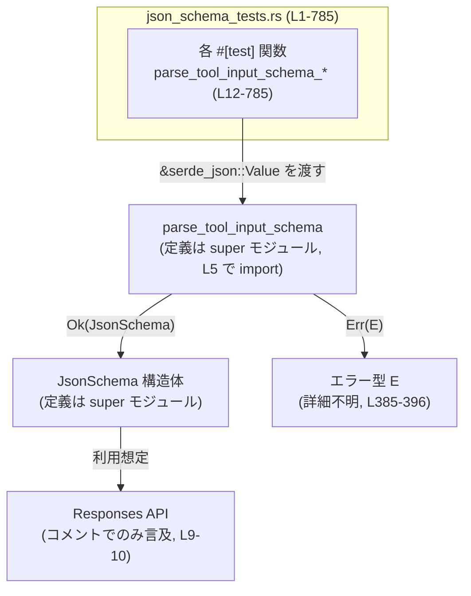
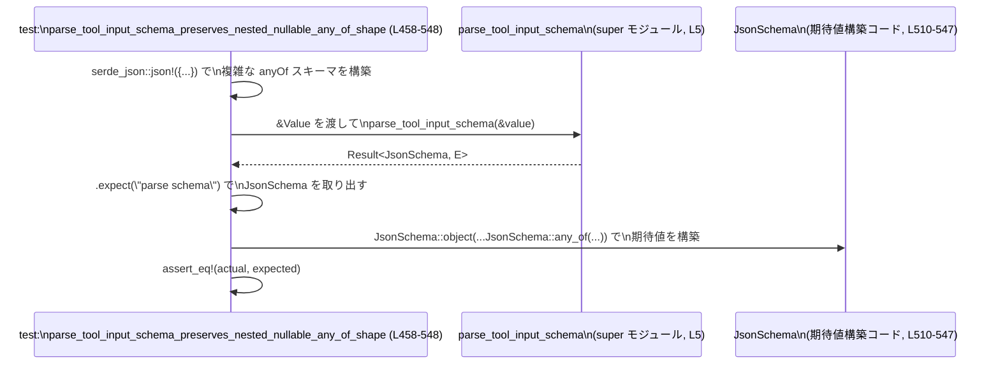

# tools/src/json_schema_tests.rs

## 0. ざっくり一言

Responses API で利用する JSON Schema を、`parse_tool_input_schema` がどのように**正規化・補完・拒否**するかを網羅的に規定しているテストモジュールです（`tools/src/json_schema_tests.rs:L9-10`）。

---

## 1. このモジュールの役割

### 1.1 概要

- このモジュールは、外部から渡される「ツール入力用」の JSON Schema を、内部表現 `JsonSchema` に変換する関数 `parse_tool_input_schema` の**期待仕様をテストで定義**しています（`tools/src/json_schema_tests.rs:L1-7`）。
- 特に、以下のような「ラフな／半端な」スキーマをどのように扱うかを確認しています。
  - boolean スキーマ、`type` 省略スキーマ、`additionalProperties` だけがあるスキーマ
  - `enum` / `const` / legacy `type: "enum"` / `type: "const"`
  - `anyOf` / union 型（`["string", "null"]` など）を含む複雑なネスト
- また、「Responses API との互換性のために**形を変えてはいけないスキーマ**」も明示的にテストしています（`tools/src/json_schema_tests.rs:L455-456`）。

### 1.2 アーキテクチャ内での位置づけ

このファイル自体はテスト専用ですが、依存関係は次のようになります。



- `json_schema_tests.rs` は、親モジュール（`super`）で定義されている `JsonSchema` / `JsonSchemaType` / `JsonSchemaPrimitiveType` / `AdditionalProperties` / `parse_tool_input_schema` に依存しています（`tools/src/json_schema_tests.rs:L1-5`）。
- `parse_tool_input_schema` は `serde_json::Value` を入力として `Result<JsonSchema, E>` を返していることが、`.expect(...)` / `.expect_err(...)` の使用から分かります（`tools/src/json_schema_tests.rs:L21-23`, `L387-390`）。

### 1.3 設計上のポイント

- **振る舞いをテストで仕様化**
  - 1テスト関数 = 1つのスキーマパターンとその期待される正規化結果、という構成です（例: `parse_tool_input_schema_coerces_boolean_schemas`, `tools/src/json_schema_tests.rs:L12-24`）。
  - 「どう変換するか」だけでなく、「どう変換**しない**か」（形を保持する）もテストされています（`tools/src/json_schema_tests.rs:L458-548`, `L551-599` など）。
- **デフォルト補完の明示**
  - `properties` があるが `type` がない → object 推論 & `properties` を `string` にデフォルト（`tools/src/json_schema_tests.rs:L27-56`）。
  - `type: "array"` で `items` がない → `items` に `string` を補う（`tools/src/json_schema_tests.rs:L58-101`）。
  - union 型に含まれる `object` / `array` に対しても `properties` / `items` のデフォルトを付与（`tools/src/json_schema_tests.rs:L399-452`）。
- **安全性・エラー・並行性の観点**
  - このファイル内には `unsafe` ブロックや `async` / スレッド関連 API は登場しません。すべて同期・シングルスレッド前提のテストです（全体）。
  - ツール入力スキーマが **singleton null 型 (`{"type": "null"}`)** のとき、`parse_tool_input_schema` は `Err` を返し、エラーメッセージに `"tool input schema must not be a singleton null type"` を含める契約になっています（`tools/src/json_schema_tests.rs:L385-396`）。
  - テスト側では `.expect(...)` / `.expect_err(...)` を使うため、期待と異なる戻り値が来るとテストが `panic` しますが、これはテスト用の挙動です（例: `tools/src/json_schema_tests.rs:L21-23`, `L387-390`）。
- **Responses API 互換性の重視**
  - ネストした `anyOf` や union 型を「flatten せず、そのままの形で保持する」ことが要求されており、それが Responses API 側の期待するスキーマ形状であることがコメントから読み取れます（`tools/src/json_schema_tests.rs:L455-456`, `L458-548`）。

---

## 2. 主要な機能一覧（テストが規定している仕様）

このモジュール自体はテスト専用ですが、結果として **`parse_tool_input_schema` の主な振る舞い**が次のように定義されています。

- boolean スキーマの取り扱い  
  - `true` だけのスキーマは、`{ "type": "string" }` に正規化される（`tools/src/json_schema_tests.rs:L12-24`）。
- `properties` / `additionalProperties` からの object 推論
  - `type` がなくても `properties` があれば object 扱いになり、各プロパティは `string` にデフォルト（`tools/src/json_schema_tests.rs:L27-56`）。
  - `additionalProperties` だけがある場合も object 推論され、boolean / schema の値に応じて `additional_properties` が設定される（`tools/src/json_schema_tests.rs:L158-177`, `L333-361`）。
- array スキーマの補完
  - `type: "array"` で `items` が欠けている場合、`items` は `string` で補完される（`tools/src/json_schema_tests.rs:L58-101`）。
  - `prefixItems` だけがある場合も array 推論され、`prefixItems` 内の型に応じて `items` が設定される（`tools/src/json_schema_tests.rs:L265-292`）。
- numeric キーワードからの number 推論
  - `minimum` / `maximum` / `multipleOf` のような数値制約キーワードがあると、`type` がなくても number スキーマとして扱われる（`tools/src/json_schema_tests.rs:L179-195`, `L197-213`）。
- string 系の enum / const / format
  - `enum` / `const` は string ベースの enum スキーマ (`JsonSchema::string_enum`) に正規化される（`tools/src/json_schema_tests.rs:L215-250`, `L364-382`, `L682-715`）。
  - `format` キーワードだけがある場合は、プレーンな string スキーマになる（`tools/src/json_schema_tests.rs:L215-250`）。
  - legacy な `type: "enum"` / `type: "const"` も同じ string-enum 形式に正規化される（`tools/src/json_schema_tests.rs:L718-785`）。
- デフォルトフォールバック
  - 完全な空スキーマ `{}` は、構造上のヒントがないため `string` スキーマへフォールバックする（`tools/src/json_schema_tests.rs:L252-263`）。
- `additionalProperties` の正規化
  - schema 値を持つ `additionalProperties` は、再帰的に `JsonSchema::object` / `JsonSchema::any_of` などの現在の内部形式へ正規化される（`tools/src/json_schema_tests.rs:L103-156`）。
  - boolean `additionalProperties: true/false` は boolean のまま保持される（`tools/src/json_schema_tests.rs:L158-177`, `L294-331`）。
- null を含む union / anyOf の取り扱い
  - `["object", "null"]` / `["array", "null"]` の union は `JsonSchemaType::Multiple` としてそのまま保持され、object / array メンバーには `properties` / `items` のデフォルトが付与される（`tools/src/json_schema_tests.rs:L399-452`）。
  - nested な `anyOf` における `null` との union も flatten されず、そのまま保持される（`tools/src/json_schema_tests.rs:L458-548`）。
- 明示的 union の保持
  - `type: ["string", "null"]` （＋ description / enum）のような union は、`anyOf` へ書き換えられず `JsonSchemaType::Multiple` として保持される（`tools/src/json_schema_tests.rs:L652-679`, `L682-715`）。
- singleton null 型の拒否
  - `{"type": "null"}` のような「null だけのスキーマ」はツール入力として禁止され、エラーになる（`tools/src/json_schema_tests.rs:L385-397`）。

---

## 3. 公開 API と詳細解説

### 3.1 型一覧（構造体・列挙体など）

このファイルで **参照されているが、定義は super モジュール側にある主要な型**です。

| 名前 | 種別 | 役割 / 用途 | 定義状況 | 根拠 |
|------|------|-------------|----------|------|
| `JsonSchema` | 構造体 | 正規化された JSON Schema の内部表現。`string` / `number` / `object` / `array` / `anyOf` / enum / union 型などを表現し、テストでは期待結果として構築される。 | 親モジュールに定義。構造体リテラル `{ .. }` と関連関数 `string`, `number`, `object`, `array`, `any_of`, `string_enum`, `integer`, `null` などが存在することが分かるが、このチャンクには本体定義はない。 | 参照: `tools/src/json_schema_tests.rs:L2`, `L23`, `L45-55`, `L81-100`, `L135-155`, `L174-176`, `L194`, ほか多数 |
| `JsonSchemaType` | 列挙体 | `JsonSchema` の `schema_type` フィールド用の型。複数のプリミティブ型の union を `Multiple(Vec<JsonSchemaPrimitiveType>)` として表現する。 | 親モジュールに定義。`JsonSchemaType::Multiple(...)` というバリアントが存在することのみ分かる。 | 参照: `tools/src/json_schema_tests.rs:L4`, `L416-421`, `L443-447`, `L588-590`, `L703-707` |
| `JsonSchemaPrimitiveType` | 列挙体 | `string` / `number` / `object` / `array` / `null` などのプリミティブ型を表す。union 型の要素として使われる。 | 親モジュールに定義。`Object`, `Null`, `Array`, `String` などのバリアントが存在することが分かる。 | 参照: `tools/src/json_schema_tests.rs:L3`, `L417-420`, `L445-447`, `L589-590`, `L704-707` |
| `AdditionalProperties` | 列挙体 | object スキーマの `additionalProperties` を表す。boolean もしくはスキーマを扱える。 | 親モジュールに定義。`AdditionalProperties::Schema(Box<JsonSchema>)` バリアントと、`bool` からの `From<bool>` 実装（`false.into()` / `true.into()`）があることが分かる。 | 参照: `tools/src/json_schema_tests.rs:L1`, `L138-153`, `L173-176`, `L320-327`, `L357-360`, `L535-537` |

> これらの型のフィールド詳細や派生トレイト（`Clone`, `Serialize` など）は、このチャンクには現れません。

### 3.2 関数詳細：`parse_tool_input_schema`

#### `parse_tool_input_schema(value: &serde_json::Value) -> Result<JsonSchema, E>`

※ 戻り値のエラー型 `E` の具体的な型名はこのチャンクには現れません。`Result<_, E>` であることだけが `.expect()` / `.expect_err()` から分かります（`tools/src/json_schema_tests.rs:L21-23`, `L387-390`）。

**概要**

- ツール入力として与えられた JSON Schema (`serde_json::Value`) を、ライブラリ内部で利用する `JsonSchema` に**正規化**して変換する関数です（`tools/src/json_schema_tests.rs:L5`, テスト全体）。
- 不完全なスキーマ（`type` の省略、`items` の省略など）に対しては、**ヒューリスティックに型を推論しつつデフォルトを補完**します。
- 一方で、singleton null 型など、ツール入力として不適切とされるスキーマは **エラーとして拒否**します（`tools/src/json_schema_tests.rs:L385-397`）。

**引数**

| 引数名 | 型 | 説明 | 根拠 |
|--------|----|------|------|
| `value` | `&serde_json::Value` | JSON Schema を表す値への参照。`serde_json::json!(...)` で構築した値が渡されています。 | テストから常に `&serde_json::json!(...)` を渡していることが分かる（`tools/src/json_schema_tests.rs:L21`, `L38-43`, `L72-79` など） |

**戻り値**

- `Result<JsonSchema, E>`  
  - `Ok(JsonSchema)` : 正常に正規化されたスキーマ。テストでは `assert_eq!` で期待値と比較しています（`tools/src/json_schema_tests.rs:L23`, `L45-55` など）。
  - `Err(E)` : 不正なスキーマ（例: singleton null 型）に対するエラー。`.expect_err(...)` で検証されています（`tools/src/json_schema_tests.rs:L385-390`）。

**内部処理の流れ（観測される振る舞いからの高レベルな説明）**

実装本体はこのチャンクにはありませんが、テストが示す振る舞いから、概ね次のような処理を行っていると解釈できます。

1. **スキーマの構造を解析**
   - ルートオブジェクトの `type`, `properties`, `items`, `additionalProperties`, `enum`, `const`, `anyOf`, `prefixItems`, `minimum`, `multipleOf` などのキーワードを読み取っています（例: `tools/src/json_schema_tests.rs:L58-79`, `L103-132`, `L215-236`）。
2. **基底型の推論**
   - `type` が省略されている場合、以下のように推論します。
     - `properties` がある → object（`tools/src/json_schema_tests.rs:L27-56`）
     - `additionalProperties` のみがある → object（`tools/src/json_schema_tests.rs:L158-177`, `L333-361`）
     - `prefixItems` がある → array（`tools/src/json_schema_tests.rs:L265-292`）
     - `minimum` / `multipleOf` などがある → number（`tools/src/json_schema_tests.rs:L179-195`, `L197-213`）
     - いずれもない → string（空スキーマ `{}` のテスト, `tools/src/json_schema_tests.rs:L252-263`）
3. **デフォルト値の補完**
   - object の `properties` が定義されているが、各プロパティに `type` がない場合 → `string` を補完（`tools/src/json_schema_tests.rs:L27-56`）。
   - `type: "array"` で `items` がない場合 → `items` に `string` を補完（`tools/src/json_schema_tests.rs:L58-101`）。
   - union 型 `["array", "null"]` に含まれる array でも `items` を補完（`tools/src/json_schema_tests.rs:L427-452`）。
   - union 型 `["object", "null"]` に含まれる object には空 `properties` を補完（`tools/src/json_schema_tests.rs:L399-425`）。
4. **`additionalProperties` の正規化**
   - schema オブジェクトが指定された場合、再帰的に `JsonSchema` に変換し、`AdditionalProperties::Schema(Box<JsonSchema>)` として格納します（`tools/src/json_schema_tests.rs:L103-156`）。
   - boolean 値の場合はそのまま boolean として保持します（`tools/src/json_schema_tests.rs:L158-177`, `L294-331`）。
5. **`enum` / `const` / legacy 型の扱い**
   - `enum` / `const` を string ベースの enum (`JsonSchema::string_enum`) に変換し、`type` が省略されていても string ベースの enum として扱います（`tools/src/json_schema_tests.rs:L215-250`, `L364-382`）。
   - legacy な `type: "enum"` / `type: "const"` も同様に string enum に正規化します（`tools/src/json_schema_tests.rs:L718-785`）。
6. **union 型 / anyOf の保持**
   - 明示的な union 型（`type: ["string", "null"]` など）は `JsonSchemaType::Multiple` として保持し、`anyOf` に書き換えない（`tools/src/json_schema_tests.rs:L652-679`, `L682-715`）。
   - nested な `anyOf` + `null` の組み合わせも flatten せず、階層構造を維持する（`tools/src/json_schema_tests.rs:L458-548`, `L602-649`）。
7. **禁止パターンのエラー化**
   - `{"type": "null"}` のような singleton null 型はエラーとして拒否し、特定のエラーメッセージを返す（`tools/src/json_schema_tests.rs:L385-397`）。

> 上記はすべてテストで観測される入出力からの解釈であり、実装が内部でどのようなデータ構造・アルゴリズムを使っているかは、このチャンクからは分かりません。

**Examples（使用例）**

テストから簡略化した典型例を 2 つ示します。

1. boolean スキーマを string スキーマに正規化する例（成功パス）

```rust
use serde_json::json;

// ツール入力スキーマ（boolean 形式）
let raw = json!(true);  // `true` は JSON Schema の「常に許可する」意味を持つ

// 正規化
let schema = parse_tool_input_schema(&raw).expect("valid schema");

// 結果は string スキーマ
assert_eq!(schema, JsonSchema::string(/* description */ None));
```

根拠: `tools/src/json_schema_tests.rs:L12-24`

1. singleton null 型をエラーとして拒否する例

```rust
use serde_json::json;

// ツール入力スキーマ（null のみを許可）
let raw = json!({ "type": "null" });

// 正規化を試みるとエラー
let err = parse_tool_input_schema(&raw).expect_err("singleton null should be rejected");

// エラーメッセージは特定の文言を含む
assert!(
    err.to_string().contains("tool input schema must not be a singleton null type")
);
```

根拠: `tools/src/json_schema_tests.rs:L385-397`

**Errors / Panics**

- `Err` になる条件（このチャンクで明示されているもの）
  - ルートスキーマが singleton null 型（`{"type": "null"}`）のとき、`Err` を返します（`tools/src/json_schema_tests.rs:L385-397`）。
- それ以外の入力でどのようなエラーが起こりうるかは、このテストコードからは分かりません。
- `parse_tool_input_schema` 自体が `panic` するかどうかは、このチャンクでは確認されていません。テストは `.expect` / `.expect_err` を通じて戻り値を前提としており、関数内部の `panic` の有無は分かりません。

**Edge cases（エッジケース）**

テストが明示している主なエッジケースとその挙動です。

- `type` が完全に省略された場合
  - `properties` のみ → object `+` プロパティは string デフォルト（`tools/src/json_schema_tests.rs:L27-56`）
  - `additionalProperties` のみ（boolean） → object `+` boolean `additional_properties`（`tools/src/json_schema_tests.rs:L158-177`）
  - `additionalProperties` のみ（schema） → object `+` schema-valued `additional_properties`（`tools/src/json_schema_tests.rs:L333-361`）
  - 何のヒントもない `{}` → string スキーマにフォールバック（`tools/src/json_schema_tests.rs:L252-263`）
- array の `items` が欠落している場合
  - `type: "array"` で `items` なし → `items: string` を付与（`tools/src/json_schema_tests.rs:L58-101`）
  - `type: ["array", "null"]` で `items` なし → union の array メンバーに `items: string` を付与（`tools/src/json_schema_tests.rs:L427-452`）
- enum / const まわり
  - `enum` / `const` だけ指定された場合でも string-enum スキーマに正規化（`tools/src/json_schema_tests.rs:L215-250`）。
  - `type: ["string", "null"]` と `enum` の組み合わせでも、union 型と enum が両方保持される（`tools/src/json_schema_tests.rs:L682-715`）。
- nested anyOf / union
  - `anyOf` 内に `null` を含む複雑なネストを flatten せず、そのまま保持する（`tools/src/json_schema_tests.rs:L458-548`）。

**使用上の注意点**

テストから読み取れる範囲での注意点です。

- ツール入力スキーマとして **singleton null 型はサポートされません**。`{"type": "null"}` を渡すとエラーになります（`tools/src/json_schema_tests.rs:L385-397`）。
- boolean スキーマ `true` は string スキーマに正規化されます。JSON Schema の完全な意味（「どんな値でも許可」）は `JsonSchema::string` と等価とは限りませんが、ツール入力スキーマではこのように扱われています（`tools/src/json_schema_tests.rs:L12-24`）。
- `type` を明示しなくても一定の推論が行われますが、その詳細はテストに現れているパターンに依存します。ここにない形についてどう推論されるかは、このチャンクからは分かりません。
- この関数は `Result` を返すため、ライブラリ利用側ではテストのような `.expect(...)` ではなく、`?` や `match` によるエラー処理を行うのが一般的な使い方になります（エラー型 `E` の内容はこのチャンクからは不明です）。

### 3.3 その他の関数（テスト関数インベントリ）

このファイル内で定義されているすべての `#[test]` 関数と、その役割・行範囲の一覧です。

| 関数名 | 種別 | 役割（1 行） | 行範囲 |
|--------|------|--------------|--------|
| `parse_tool_input_schema_coerces_boolean_schemas` | テスト | boolean スキーマ `true` が string スキーマに正規化されることを検証 | `tools/src/json_schema_tests.rs:L12-24` |
| `parse_tool_input_schema_infers_object_shape_and_defaults_properties` | テスト | `properties` から object を推論し、プロパティ型を string にデフォルトする挙動を検証 | `tools/src/json_schema_tests.rs:L26-56` |
| `parse_tool_input_schema_preserves_integer_and_defaults_array_items` | テスト | `integer` が `number` と区別されることと、`items` 省略 array への string 補完を検証 | `tools/src/json_schema_tests.rs:L58-101` |
| `parse_tool_input_schema_sanitizes_additional_properties_schema` | テスト | schema-valued `additionalProperties` が再帰的に正規化されることを検証 | `tools/src/json_schema_tests.rs:L103-156` |
| `parse_tool_input_schema_infers_object_shape_from_boolean_additional_properties_only` | テスト | boolean `additionalProperties` のみから object を推論し、その boolean を保持することを検証 | `tools/src/json_schema_tests.rs:L158-177` |
| `parse_tool_input_schema_infers_number_from_numeric_keywords` | テスト | `minimum` などの numeric キーワードから number 型を推論することを検証 | `tools/src/json_schema_tests.rs:L179-195` |
| `parse_tool_input_schema_infers_number_from_multiple_of` | テスト | `multipleOf` でも numeric キーワードと同様に number 型を推論することを検証 | `tools/src/json_schema_tests.rs:L197-213` |
| `parse_tool_input_schema_infers_string_from_enum_const_and_format_keywords` | テスト | `enum` / `const` / `format` の扱い（string-enum 化、`format` は plain string）を検証 | `tools/src/json_schema_tests.rs:L215-250` |
| `parse_tool_input_schema_defaults_empty_schema_to_string` | テスト | 空スキーマ `{}` が string スキーマへフォールバックすることを検証 | `tools/src/json_schema_tests.rs:L252-263` |
| `parse_tool_input_schema_infers_array_from_prefix_items` | テスト | `prefixItems` のみから array を推論し、items を string として扱うことを検証 | `tools/src/json_schema_tests.rs:L265-292` |
| `parse_tool_input_schema_preserves_boolean_additional_properties_on_inferred_object` | テスト | ネストした object で boolean `additionalProperties` が保持されることを検証 | `tools/src/json_schema_tests.rs:L294-331` |
| `parse_tool_input_schema_infers_object_shape_from_schema_additional_properties_only` | テスト | schema-valued `additionalProperties` のみから object を推論し、そのスキーマを保持することを検証 | `tools/src/json_schema_tests.rs:L333-361` |
| `parse_tool_input_schema_rewrites_const_to_single_value_enum` | テスト | `const` が単一値の string-enum に書き換えられることを検証 | `tools/src/json_schema_tests.rs:L364-382` |
| `parse_tool_input_schema_rejects_singleton_null_type` | テスト | singleton null 型がエラーで拒否されることと、エラーメッセージ内容を検証 | `tools/src/json_schema_tests.rs:L385-397` |
| `parse_tool_input_schema_fills_default_properties_for_nullable_object_union` | テスト | `["object", "null"]` union において object メンバーに空 `properties` を補完することを検証 | `tools/src/json_schema_tests.rs:L399-425` |
| `parse_tool_input_schema_fills_default_items_for_nullable_array_union` | テスト | `["array", "null"]` union において array メンバーに `items: string` を補完することを検証 | `tools/src/json_schema_tests.rs:L427-452` |
| `parse_tool_input_schema_preserves_nested_nullable_any_of_shape` | テスト | 深くネストした `anyOf` + `null` 構造を形を変えず維持することを検証 | `tools/src/json_schema_tests.rs:L458-548` |
| `parse_tool_input_schema_preserves_nested_nullable_type_union` | テスト | プロパティの `type: ["string", "null"]` と description / required / additionalProperties が保持されることを検証 | `tools/src/json_schema_tests.rs:L551-599` |
| `parse_tool_input_schema_preserves_nested_any_of_property` | テスト | プロパティ内の `anyOf` (string/number) が flatten されず保持されることを検証 | `tools/src/json_schema_tests.rs:L602-649` |
| `parse_tool_input_schema_preserves_type_unions_without_rewriting_to_any_of` | テスト | ルートの `type: ["string", "null"]` が `anyOf` に書き換えられず union のまま保持されることを検証 | `tools/src/json_schema_tests.rs:L652-679` |
| `parse_tool_input_schema_preserves_explicit_enum_type_union` | テスト | union 型と enum の両方が同時に保持されることを検証 | `tools/src/json_schema_tests.rs:L682-715` |
| `parse_tool_input_schema_preserves_string_enum_constraints` | テスト | legacy な `type: "enum"` / `type: "const"` が現行の string-enum 形式に正規化されることを検証 | `tools/src/json_schema_tests.rs:L718-785` |

---

## 4. データフロー

### 4.1 代表的な処理シナリオ

複雑な nested `anyOf` + union 構造を扱うテスト `parse_tool_input_schema_preserves_nested_nullable_any_of_shape`（`tools/src/json_schema_tests.rs:L458-548`）を例に、データの流れを示します。

1. テスト関数内で、深くネストした JSON Schema を `serde_json::json!` を使って構築します（`tools/src/json_schema_tests.rs:L487-507`）。
2. その JSON 値の参照を `parse_tool_input_schema` に渡し、`Result<JsonSchema, E>` を受け取ります（`tools/src/json_schema_tests.rs:L487-508`）。
3. `.expect("parse schema")` により、`Ok(JsonSchema)` であることを前提に `JsonSchema` を取得します（`tools/src/json_schema_tests.rs:L508`）。
4. テスト内で期待される `JsonSchema` 構造（`JsonSchema::object` / `JsonSchema::any_of` / `JsonSchema::array` / nested `any_of`）を手で構築します（`tools/src/json_schema_tests.rs:L510-547`）。
5. `assert_eq!` により、実際の結果と期待値の構造が完全に一致することを検証します（`tools/src/json_schema_tests.rs:L510-547`）。

### 4.2 シーケンス図



このパターンは、他のテストでも同様で、

- JSON を構築 → `parse_tool_input_schema` 呼び出し → `JsonSchema` を取得 → 期待値 `JsonSchema` と比較

という一方向のデータフローになっています。

---

## 5. 使い方（How to Use）

### 5.1 基本的な使用方法

テストを簡略化した、`parse_tool_input_schema` の基本的な利用例です。ここでは `parse_tool_input_schema` がスコープにあることを前提とします。

```rust
use serde_json::json;

// ツール入力用の JSON Schema を構築する
let raw_schema = json!({
    "type": "object",
    "properties": {
        "query": { "description": "search query" },  // type は省略
        "page": { "type": "integer" },              // 明示的な integer
        "tags": { "type": "array" }                 // items は省略
    }
});

// 正規化された JsonSchema に変換する
let schema: JsonSchema = parse_tool_input_schema(&raw_schema)?;

// 以降、Responses API などで `schema` を利用する想定
// （Responses API 自体はこのチャンクには現れません）
```

根拠となる振る舞いは、`parse_tool_input_schema_infers_object_shape_and_defaults_properties`（`tools/src/json_schema_tests.rs:L27-56`）および `parse_tool_input_schema_preserves_integer_and_defaults_array_items`（`tools/src/json_schema_tests.rs:L58-101`）で確認できます。

### 5.2 よくある使用パターン

- **nullable object / array を扱う union スキーマ**

```rust
use serde_json::json;

let raw_object_union = json!({ "type": ["object", "null"] });
let object_union = parse_tool_input_schema(&raw_object_union)?;
// object_union.schema_type は Object/Null の union
// object_union.properties は Some(空の BTreeMap) に補完される

let raw_array_union = json!({ "type": ["array", "null"] });
let array_union = parse_tool_input_schema(&raw_array_union)?;
// array_union.schema_type は Array/Null の union
// array_union.items は Some(JsonSchema::string(None)) に補完される
```

根拠: `tools/src/json_schema_tests.rs:L399-425`, `L427-452`

- **string enum / legacy enum/const を扱う**

```rust
use serde_json::json;

let raw = json!({
    "type": "object",
    "properties": {
        "response_length": { "type": "enum", "enum": ["short", "medium", "long"] },
        "kind": { "type": "const", "const": "tagged" },
    }
});

let schema = parse_tool_input_schema(&raw)?;
// properties["response_length"] / ["kind"] はどちらも
// JsonSchema::string_enum(...) に正規化されている
```

根拠: `tools/src/json_schema_tests.rs:L718-785`

### 5.3 よくある間違い（テストから読み取れるもの）

- **singleton null 型を許可しようとしてしまう**

```rust
use serde_json::json;

// 間違い例: ツール入力として singleton null 型を渡している
let raw = json!({ "type": "null" });
// let schema = parse_tool_input_schema(&raw)?; // 実際には Err になる

// 正しい扱い: エラーになることを前提にハンドリングする
match parse_tool_input_schema(&raw) {
    Ok(_) => {
        // ツール入力仕様上、この状況は想定外
    }
    Err(e) => {
        eprintln!("invalid tool input schema: {e}");
    }
}
```

根拠: `tools/src/json_schema_tests.rs:L385-397`

- **`type` を書かない前提でスキーマを書くが、推論結果を理解していない**

  - 例えば、`{ "enum": ["fast", "safe"] }` は string ベースの enum として扱われます（`tools/src/json_schema_tests.rs:L215-250`）。
  - `{}` は string スキーマとして扱われます（`tools/src/json_schema_tests.rs:L252-263`）。
  - これらの推論はテストで規定されていますが、他のパターンがどう扱われるかは、このチャンクからは分かりません。

### 5.4 使用上の注意点（まとめ）

- **ツール入力仕様に固有の制約がある**
  - singleton null 型は禁止（`tools/src/json_schema_tests.rs:L385-397`）。
  - boolean スキーマや空スキーマなどが string にフォールバックするなど、一般的な JSON Schema とは異なる扱いをする場合があります（`tools/src/json_schema_tests.rs:L12-24`, `L252-263`）。
- **型推論に依存する部分がある**
  - `type` を省略してもある程度は推論されますが、その挙動はテストでカバーされているパターンに限定して理解できます（`tools/src/json_schema_tests.rs:L27-56`, `L179-195` など）。
- **エラー処理を明示的に行うこと**
  - 関数は `Result` を返すため、本番コードでは `?` や `match` で `Err` を適切に処理する必要があります。テストのような `.expect(...)` は本番コードでは通常用いません。

---

## 6. 変更の仕方（How to Modify）

### 6.1 新しい機能を追加する場合（テスト側）

`parse_tool_input_schema` に新しい正規化ルールを追加したい場合、このテストファイルに対しては次のような変更が自然です。

1. **対象となるスキーマパターンを決める**
   - 例: 新しいキーワードを見て型を推論する、既存のキーワードの組み合わせに対応する、など。
2. **対応する `#[test]` 関数を追加する**
   - 既存のテストと同様に、コメントで「Example schema shape」と「Expected normalization behavior」を記述する（`tools/src/json_schema_tests.rs:L14-21`, `L35-37` などを参考）。
   - `serde_json::json!` で入力スキーマを構築し、`parse_tool_input_schema` を呼んで、期待される `JsonSchema` を `assert_eq!` で比較する。
3. **Responses API 互換性上「形を変えないべき」ケースであれば、その旨をコメントに明示する**
   - 既存のコメント（`tools/src/json_schema_tests.rs:L455-456`）と同じスタイルに合わせる。

### 6.2 既存の機能を変更する場合

`parse_tool_input_schema` の挙動を変更するときに、このテストファイルで注意すべき点です。

- **影響範囲の確認**
  - どのテストが失敗するかを見ることで、変更がどのパターンに影響するか把握できます（テスト名にパターンが明示されているため、追跡しやすい構造です）。
- **契約の確認**
  - singleton null 型の拒否（`tools/src/json_schema_tests.rs:L385-397`）や、union 型・`anyOf` を flatten しないこと（`tools/src/json_schema_tests.rs:L458-548`, `L652-679`）など、動作が明確に仕様として固定されている箇所があります。
  - これらを変更する場合は、Responses API 側の期待と整合しているか別途確認する必要があります（Responses API 自体はこのチャンクには現れません）。
- **テストの更新**
  - 挙動を変える場合、該当テストの期待値 `JsonSchema` を新しい仕様に合わせて変更します。
  - 仕様として不要になった変換ルールの場合、テストを削除するのではなく「互換性維持のために残すべきか」を検討する必要があります（ただし、その判断材料はこのチャンクにはありません）。

---

## 7. 関連ファイル

このモジュールと密接に関連するが、このチャンクには定義が現れない要素です。

| パス / モジュール | 役割 / 関係 |
|-------------------|------------|
| `super` モジュール（ファイル名不明） | `JsonSchema`, `JsonSchemaType`, `JsonSchemaPrimitiveType`, `AdditionalProperties`, `parse_tool_input_schema` の定義を持つ親モジュールです。`use super::...` によりインポートされています（`tools/src/json_schema_tests.rs:L1-5`）。具体的なファイル名（`json_schema.rs` など）はこのチャンクからは分かりません。 |
| Responses API（モジュール名不明） | コメント中でのみ言及されており、このテストで検証している正規化済み `JsonSchema` を消費する側とされています（`tools/src/json_schema_tests.rs:L9-10`, `L455-456`）。実装やファイルパスはこのチャンクには現れません。 |

> その他の関連モジュール（例えばツール呼び出し全体を扱うモジュールなど）が存在する可能性はありますが、このチャンクには現れないため、詳細は不明です。
