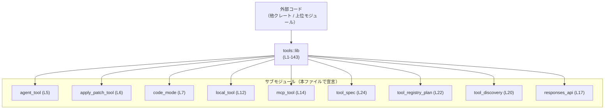
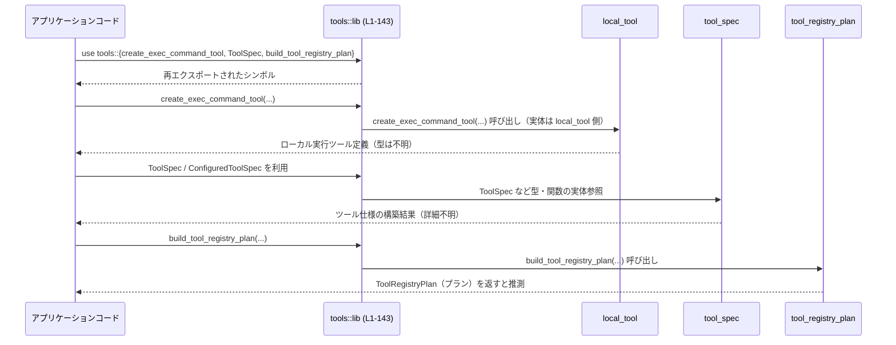

# tools/src/lib.rs コード解説

## 0. ざっくり一言

このファイルは、さまざまな「ツール」関連モジュールを `mod` 宣言で束ね、その中の関数・型・定数を `pub use` で再エクスポートする **エントリポイント／プレリュード** です（tools/src/lib.rs:L1-27, L29-143）。  
実際のロジックはすべて各サブモジュール側にあり、このファイル自身は公開 API の窓口のみを提供します。

---

## 1. このモジュールの役割

### 1.1 概要

- このモジュールは、**エージェント操作・パッチ適用・ローカルコマンド実行・MCP・Web 検索・画像閲覧などのツール群**を一箇所から利用できるようにするための集約ポイントです（tools/src/lib.rs:L4-27, L29-143）。
- 外部利用者は `tools` クレートのこのモジュールだけを `use` すれば、個々のサブモジュールを意識せずに各ツール用の関数・型にアクセスできます。

### 1.2 アーキテクチャ内での位置づけ

Rust のモジュール構造としては次のような関係になります。



- `mod xxx;` によりサブモジュールが宣言されています（例: `mod agent_tool;`（tools/src/lib.rs:L5））。
- その後、各サブモジュール内のシンボルが `pub use xxx::YYY;` で再エクスポートされています（tools/src/lib.rs:L29-143）。
- `mod` に `pub` が付いていないため、外部コードは `tools::agent_tool::...` のようにモジュールを直接参照できず、**再エクスポートされたシンボル経由**でのみアクセスする構造です。

### 1.3 設計上のポイント

このファイルから読み取れる設計上の特徴は次のとおりです。

- **単一の公開窓口**  
  - 多数のサブモジュールを持ちながら、外部には `tools` ルートモジュールからの再エクスポートだけを見せる設計になっています（tools/src/lib.rs:L4-27, L29-143）。
- **責務のモジュール分割**  
  - 機能ごとにサブモジュールが分かれています（例: `agent_tool` はエージェント関連、`local_tool` はローカルコマンド関連、`tool_spec` はツール仕様関連と推測されますが、詳細はこのチャンクにはありません）（tools/src/lib.rs:L4-27）。
- **エラーハンドリング・並行性はサブモジュール側**  
  - 本ファイルには関数本体やロジックが存在しないため、エラー処理や並行実行に関する方針は各サブモジュール側に委ねられており、このチャンクからは読み取れません（tools/src/lib.rs:L29-143）。

---

## 2. 主要なコンポーネント一覧（インベントリー）

このセクションでは、**モジュール**と**再エクスポートされるシンボル**の一覧を示します。概要は「どのモジュールの何を公開しているか」に留め、具体的な挙動はこのファイルからは分からないことを明示します。

### 2.1 サブモジュール一覧

`mod` 宣言されているサブモジュールです（実体は `tools/src/<module>.rs` または同名ディレクトリ配下にあるはずです）。

| モジュール名 | 定義位置 | 役割（このファイルから分かる範囲） |
|-------------|----------|-------------------------------------|
| `agent_job_tool` | tools/src/lib.rs:L4 | エージェントジョブ関連ツールを提供するモジュール（名称からの推測。実体はこのチャンクには未掲載） |
| `agent_tool` | tools/src/lib.rs:L5 | エージェント操作関連ツールを提供するモジュール |
| `apply_patch_tool` | tools/src/lib.rs:L6 | パッチ適用関連ツールを提供するモジュール |
| `code_mode` | tools/src/lib.rs:L7 | 「コードモード」関連ツール・変換を提供するモジュール |
| `dynamic_tool` | tools/src/lib.rs:L8 | 動的なツール定義のパースなどを扱うモジュール |
| `image_detail` | tools/src/lib.rs:L9 | 画像ディテール（解像度など）の正規化を扱うモジュール |
| `js_repl_tool` | tools/src/lib.rs:L10 | JavaScript REPL 関連ツールを提供するモジュール |
| `json_schema` | tools/src/lib.rs:L11 | JSON Schema 関連の型・パーサを提供するモジュール |
| `local_tool` | tools/src/lib.rs:L12 | ローカルコマンド・シェル実行ツール関連モジュール |
| `mcp_resource_tool` | tools/src/lib.rs:L13 | MCP リソース関連ツールを提供するモジュール |
| `mcp_tool` | tools/src/lib.rs:L14 | MCP ツールのパース・出力スキーマ関連モジュール |
| `plan_tool` | tools/src/lib.rs:L15 | プラン更新ツール関連モジュール |
| `request_user_input_tool` | tools/src/lib.rs:L16 | ユーザー入力要求ツール関連モジュール |
| `responses_api` | tools/src/lib.rs:L17 | Responses API 向けのツール表現を扱うモジュール |
| `tool_config` | tools/src/lib.rs:L18 | ツール実行に関する設定値を扱うモジュール |
| `tool_definition` | tools/src/lib.rs:L19 | ツール定義（Definition）関連型を提供するモジュール |
| `tool_discovery` | tools/src/lib.rs:L20 | ツール発見・検索関連の型や関数を提供するモジュール |
| `tool_name` | tools/src/lib.rs:L21 | ツール名を表す型を提供するモジュール |
| `tool_registry_plan` | tools/src/lib.rs:L22 | ツールレジストリ用のプラン構築関数を提供するモジュール |
| `tool_registry_plan_types` | tools/src/lib.rs:L23 | 上記プランに関連する型群を提供するモジュール |
| `tool_spec` | tools/src/lib.rs:L24 | ツール仕様（Spec）と各種ツール生成関数を提供するモジュール |
| `tool_suggest` | tools/src/lib.rs:L25 | ツール提案（suggest）関連の型・関数を提供するモジュール |
| `utility_tool` | tools/src/lib.rs:L26 | 汎用的なユーティリティツール（ディレクトリ一覧など）を提供するモジュール |
| `view_image` | tools/src/lib.rs:L27 | 画像閲覧ツール関連の型・関数を提供するモジュール |

> 備考: 役割の説明はモジュール名に基づく推測であり、実装詳細はこのファイルには現れていません。

### 2.2 再エクスポートされる関数・定数一覧（モジュール別）

ここでは、再エクスポートされている **関数・定数など値レベルのシンボル**をモジュールごとに整理します。

#### agent_job_tool 由来

| 名前 | 種別 | 定義位置 | 役割（このファイルから分かる範囲） |
|------|------|----------|-------------------------------------|
| `create_report_agent_job_result_tool` | 関数 | tools/src/lib.rs:L29 | `agent_job_tool` モジュール内の同名関数を再エクスポート |
| `create_spawn_agents_on_csv_tool` | 関数 | tools/src/lib.rs:L30 | 同上 |

#### agent_tool 由来（エージェント操作関連）

| 名前 | 種別 | 定義位置 | 役割 |
|------|------|----------|------|
| `create_close_agent_tool_v1` | 関数 | tools/src/lib.rs:L33 | `agent_tool` 内の関数を再エクスポート |
| `create_close_agent_tool_v2` | 関数 | tools/src/lib.rs:L34 | 同上（v2 バージョン） |
| `create_followup_task_tool` | 関数 | tools/src/lib.rs:L35 | 同上 |
| `create_list_agents_tool` | 関数 | tools/src/lib.rs:L36 | 同上 |
| `create_resume_agent_tool` | 関数 | tools/src/lib.rs:L37 | 同上 |
| `create_send_input_tool_v1` | 関数 | tools/src/lib.rs:L38 | 同上 |
| `create_send_message_tool` | 関数 | tools/src/lib.rs:L39 | 同上 |
| `create_spawn_agent_tool_v1` | 関数 | tools/src/lib.rs:L40 | 同上 |
| `create_spawn_agent_tool_v2` | 関数 | tools/src/lib.rs:L41 | 同上 |
| `create_wait_agent_tool_v1` | 関数 | tools/src/lib.rs:L42 | 同上 |
| `create_wait_agent_tool_v2` | 関数 | tools/src/lib.rs:L43 | 同上 |
| `SpawnAgentToolOptions` | 型 | tools/src/lib.rs:L31 | `agent_tool` 内の公開型を再エクスポート |
| `WaitAgentTimeoutOptions` | 型 | tools/src/lib.rs:L32 | 同上 |

以降も同様の形式で列挙します（一部代表のみ抜粋し、それ以外はまとめて記載します）。

#### apply_patch_tool 由来

| 名前 | 種別 | 定義位置 | 役割 |
|------|------|----------|------|
| `create_apply_patch_freeform_tool` | 関数 | tools/src/lib.rs:L45 | `apply_patch_tool` 内の関数を再エクスポート |
| `create_apply_patch_json_tool` | 関数 | tools/src/lib.rs:L46 | 同上 |
| `ApplyPatchToolArgs` | 型 | tools/src/lib.rs:L44 | 同モジュール内の引数用型 |

#### code_mode 由来

| 名前 | 種別 | 定義位置 | 役割 |
|------|------|----------|------|
| `augment_tool_spec_for_code_mode` | 関数 | tools/src/lib.rs:L47 | `code_mode` 内の関数を再エクスポート |
| `collect_code_mode_exec_prompt_tool_definitions` | 関数 | tools/src/lib.rs:L48 | 同上 |
| `collect_code_mode_tool_definitions` | 関数 | tools/src/lib.rs:L49 | 同上 |
| `create_code_mode_tool` | 関数 | tools/src/lib.rs:L50 | 同上 |
| `create_wait_tool` | 関数 | tools/src/lib.rs:L51 | 同上 |
| `tool_spec_to_code_mode_tool_definition` | 関数 | tools/src/lib.rs:L52 | 同上 |

#### dynamic_tool / image_detail / js_repl_tool / json_schema 由来

| 名前 | 元モジュール | 種別 | 定義位置 |
|------|--------------|------|----------|
| `parse_dynamic_tool` | `dynamic_tool` | 関数 | tools/src/lib.rs:L53 |
| `can_request_original_image_detail` | `image_detail` | 関数 | tools/src/lib.rs:L54 |
| `normalize_output_image_detail` | `image_detail` | 関数 | tools/src/lib.rs:L55 |
| `create_js_repl_reset_tool` | `js_repl_tool` | 関数 | tools/src/lib.rs:L56 |
| `create_js_repl_tool` | `js_repl_tool` | 関数 | tools/src/lib.rs:L57 |
| `parse_tool_input_schema` | `json_schema` | 関数 | tools/src/lib.rs:L62 |

#### local_tool 由来（ローカルコマンド・シェル）

| 名前 | 種別 | 定義位置 |
|------|------|----------|
| `create_exec_command_tool` | 関数 | tools/src/lib.rs:L65 |
| `create_request_permissions_tool` | 関数 | tools/src/lib.rs:L66 |
| `create_shell_command_tool` | 関数 | tools/src/lib.rs:L67 |
| `create_shell_tool` | 関数 | tools/src/lib.rs:L68 |
| `create_write_stdin_tool` | 関数 | tools/src/lib.rs:L69 |
| `request_permissions_tool_description` | 関数/定数 | tools/src/lib.rs:L70 |

#### MCP 関連（mcp_resource_tool, mcp_tool）

| 名前 | 元モジュール | 種別 | 定義位置 |
|------|--------------|------|----------|
| `create_list_mcp_resource_templates_tool` | `mcp_resource_tool` | 関数 | tools/src/lib.rs:L71 |
| `create_list_mcp_resources_tool` | `mcp_resource_tool` | 関数 | tools/src/lib.rs:L72 |
| `create_read_mcp_resource_tool` | `mcp_resource_tool` | 関数 | tools/src/lib.rs:L73 |
| `mcp_call_tool_result_output_schema` | `mcp_tool` | 関数/定数 | tools/src/lib.rs:L74 |
| `parse_mcp_tool` | `mcp_tool` | 関数 | tools/src/lib.rs:L75 |

#### plan_tool / request_user_input_tool 由来

| 名前 | 元モジュール | 種別 | 定義位置 |
|------|--------------|------|----------|
| `create_update_plan_tool` | `plan_tool` | 関数 | tools/src/lib.rs:L76 |
| `REQUEST_USER_INPUT_TOOL_NAME` | `request_user_input_tool` | 定数 | tools/src/lib.rs:L77 |
| `create_request_user_input_tool` | 〃 | 関数 | tools/src/lib.rs:L78 |
| `normalize_request_user_input_args` | 〃 | 関数 | tools/src/lib.rs:L79 |
| `request_user_input_tool_description` | 〃 | 関数/定数 | tools/src/lib.rs:L80 |
| `request_user_input_unavailable_message` | 〃 | 関数/定数 | tools/src/lib.rs:L81 |

#### responses_api 由来（Responses API 表現）

| 名前 | 種別 | 定義位置 |
|------|------|----------|
| `dynamic_tool_to_responses_api_tool` | 関数 | tools/src/lib.rs:L88 |
| `mcp_tool_to_deferred_responses_api_tool` | 関数 | tools/src/lib.rs:L89 |
| `mcp_tool_to_responses_api_tool` | 関数 | tools/src/lib.rs:L90 |
| `tool_definition_to_responses_api_tool` | 関数 | tools/src/lib.rs:L91 |
| `FreeformTool` | 型 | tools/src/lib.rs:L82 |
| `FreeformToolFormat` | 型 | tools/src/lib.rs:L83 |
| `ResponsesApiNamespace` | 型 | tools/src/lib.rs:L84 |
| `ResponsesApiNamespaceTool` | 型 | tools/src/lib.rs:L85 |
| `ResponsesApiTool` | 型 | tools/src/lib.rs:L86 |
| `ToolSearchOutputTool` | 型 | tools/src/lib.rs:L87 |

#### discovery / registry / spec / suggest / utility 他

「発見」「レジストリプラン」「ツール仕様」「サジェスト」「ユーティリティ」「画像ビュー」などに関する関数・型も同様に再エクスポートされています。

代表例のみ挙げると:

| 名前 | 元モジュール | 種別 | 定義位置 |
|------|--------------|------|----------|
| `create_tool_search_tool` | `tool_discovery` | 関数 | tools/src/lib.rs:L113 |
| `create_tool_suggest_tool` | `tool_discovery` | 関数 | tools/src/lib.rs:L114 |
| `filter_tool_suggest_discoverable_tools_for_client` | `tool_discovery` | 関数 | tools/src/lib.rs:L115 |
| `build_tool_registry_plan` | `tool_registry_plan` | 関数 | tools/src/lib.rs:L117 |
| `create_image_generation_tool` | `tool_spec` | 関数 | tools/src/lib.rs:L129 |
| `create_web_search_tool` | `tool_spec` | 関数 | tools/src/lib.rs:L132 |
| `create_tools_json_for_responses_api` | `tool_spec` | 関数 | tools/src/lib.rs:L131 |
| `all_suggested_connectors_picked_up` | `tool_suggest` | 関数 | tools/src/lib.rs:L137 |
| `build_tool_suggestion_elicitation_request` | `tool_suggest` | 関数 | tools/src/lib.rs:L138 |
| `verified_connector_suggestion_completed` | `tool_suggest` | 関数 | tools/src/lib.rs:L139 |
| `create_list_dir_tool` | `utility_tool` | 関数 | tools/src/lib.rs:L140 |
| `create_test_sync_tool` | `utility_tool` | 関数 | tools/src/lib.rs:L141 |
| `create_view_image_tool` | `view_image` | 関数 | tools/src/lib.rs:L143 |

### 2.3 再エクスポートされる主な型一覧

型レベルの主要な公開 API（代表）です。種別は Rust の命名規約（型は CamelCase）から「型」であることのみ分かりますが、構造体か列挙体かなどはこのファイルからは不明です。

| 名前 | 元モジュール | 種別 | 定義位置 | 役割（推測を含む） |
|------|--------------|------|----------|--------------------|
| `SpawnAgentToolOptions` | `agent_tool` | 型 | tools/src/lib.rs:L31 | エージェント生成ツールのオプションを表す型と推測されます |
| `WaitAgentTimeoutOptions` | `agent_tool` | 型 | tools/src/lib.rs:L32 | エージェント待機タイムアウト設定用の型と推測 |
| `ApplyPatchToolArgs` | `apply_patch_tool` | 型 | tools/src/lib.rs:L44 | パッチ適用ツールの入力引数型と推測 |
| `JsonSchema` / `JsonSchemaType` など | `json_schema` | 型 | tools/src/lib.rs:L59-61 | ツール入力スキーマ表現と推測 |
| `CommandToolOptions` / `ShellToolOptions` | `local_tool` | 型 | tools/src/lib.rs:L63-64 | ローカルコマンド・シェル実行オプション |
| `FreeformTool` / `FreeformToolFormat` | `responses_api` | 型 | tools/src/lib.rs:L82-83 | 自由形式ツールとそのフォーマットの表現 |
| `ShellCommandBackendConfig` / `ToolsConfig` | `tool_config` | 型 | tools/src/lib.rs:L92-95 | ツール実行環境の設定 |
| `ToolDefinition` | `tool_definition` | 型 | tools/src/lib.rs:L98 | ツールの論理的な定義 |
| `DiscoverableTool` / `ToolSuggestEntry` | `tool_discovery` | 型 | tools/src/lib.rs:L100,109 | 発見可能なツールとサジェスト候補 |
| `ToolName` | `tool_name` | 型 | tools/src/lib.rs:L116 | ツール名の表現 |
| `ToolRegistryPlan` / 関連型 | `tool_registry_plan_types` | 型 | tools/src/lib.rs:L118-123 | ツールレジストリのプラン表現 |
| `ToolSpec` / `ConfiguredToolSpec` | `tool_spec` | 型 | tools/src/lib.rs:L124,127 | ツール仕様と設定済み仕様 |
| `ToolSuggestArgs` / `ToolSuggestResult` | `tool_suggest` | 型 | tools/src/lib.rs:L134,136 | ツールサジェスト用の入力・出力型 |
| `ViewImageToolOptions` | `view_image` | 型 | tools/src/lib.rs:L142 | 画像閲覧ツールのオプションと推測 |

> 「推測」と記載した部分は命名からの推量であり、実装コードがこのファイルには存在しないため断定はできません。

---

## 3. 公開 API と詳細解説

このファイルでは関数本体が一切定義されておらず、すべて再エクスポートだけです。そのため、**実際のシグネチャや内部ロジックはサブモジュール側を参照しないと分かりません**。  
ここでは代表的な 7 つの関数について、「このファイルから確実に言えること」と「名称から推測できる用途（推測と明記）」をテンプレートに沿って記述します。

### 3.1 型一覧（代表）

上記 2.3 の表を参照ください。このファイルでは型定義そのものは確認できないため、ここでは再掲しません。

### 3.2 関数詳細（代表 7 件）

#### `create_spawn_agent_tool_v2(...) -> ?`

**概要**

- `agent_tool` モジュール内の `create_spawn_agent_tool_v2` を再エクスポートしています（tools/src/lib.rs:L41）。
- 名称からは、「エージェントを生成するツール」を表す何らかの定義（例: ツール定義やツールスペック）を作る関数の第 2 世代版と推測されますが、シグネチャや戻り値の型はこのファイルにはありません。

**引数**

- このチャンクには関数定義がないため、引数名・型は不明です。

**戻り値**

- 戻り値の型も不明です（`tool_spec` や `tool_definition` 関連の型である可能性はありますが、推測の域を出ません）。

**内部処理の流れ**

- 本ファイルには実装がないため不明です。

**Examples（使用例・概念）**

```rust
use tools::create_spawn_agent_tool_v2;

fn register_tools() {
    // ※ 実際の引数や戻り値の型は agent_tool モジュールの定義を確認する必要があります。
    let spawn_agent_tool = create_spawn_agent_tool_v2(/* 引数は不明 */);
    // ここで spawn_agent_tool をツールレジストリなどに登録すると想定されます。
}
```

> この例は **インポートの方法** を示すのみで、シグネチャや実行結果はこのファイルからは保証できません。

**Errors / Panics・エッジケース・使用上の注意点**

- エラー条件やパニック条件は関数本体が別ファイルにあるため不明です。
- このファイルレベルでは、「agent_tool モジュールの変更によりシグネチャが変わると、この re-export の型も変わる」という点のみが注意点として挙げられます。

---

#### `create_apply_patch_json_tool(...) -> ?`

**概要**

- `apply_patch_tool` モジュールから再エクスポートされる関数です（tools/src/lib.rs:L46）。
- 名称から、JSON ベースのパッチ適用ツールを表す定義を生成する関数と推測されます。

**引数 / 戻り値 / 内部処理**

- いずれもこのチャンクには定義がなく、不明です。

**使用例（インポート例）**

```rust
use tools::create_apply_patch_json_tool;

fn setup_patch_tool() {
    let patch_tool = create_apply_patch_json_tool(/* 引数は apply_patch_tool の定義を参照 */);
    // patch_tool をツールセットに組み込むなどの利用が想定されます。
}
```

---

#### `create_code_mode_tool(...) -> ?`

**概要**

- `code_mode` モジュール由来の関数です（tools/src/lib.rs:L50）。
- コード編集・実行に特化した「コードモード」ツールを生成する関数と推測されます。

**その他項目**

- シグネチャや内部処理はこのファイルからは不明です（code_mode モジュール側を参照する必要があります）。

---

#### `parse_dynamic_tool(...) -> ?`

**概要**

- `dynamic_tool` モジュールの `parse_dynamic_tool` を再エクスポートします（tools/src/lib.rs:L53）。
- 名称から、外部から与えられるダイナミックなツール定義（例: JSON）をパースして内部表現に変換する関数と推測されます。

**引数 / 戻り値 / 内部処理**

- このファイルからは一切分かりません。

---

#### `create_exec_command_tool(...) -> ?`

**概要**

- `local_tool` モジュールの関数を再エクスポートしています（tools/src/lib.rs:L65）。
- ローカル環境で任意のコマンドを実行するツールを生成すると推測されます。

**使用例（インポート例）**

```rust
use tools::create_exec_command_tool;

fn register_local_tools() {
    let exec_tool = create_exec_command_tool(/* local_tool 側の引数定義に依存 */);
    // exec_tool をツール一覧に登録して利用する想定です。
}
```

---

#### `parse_mcp_tool(...) -> ?`

**概要**

- `mcp_tool` モジュールから再エクスポートされています（tools/src/lib.rs:L75）。
- MCP（プロトコル）関連のツール定義を解析する関数と推測されます。

**その他**

- シグネチャ・エラー型・内部処理はこのチャンクには存在せず不明です。

---

#### `build_tool_registry_plan(...) -> ?`

**概要**

- `tool_registry_plan` モジュール内の `build_tool_registry_plan` を再エクスポートしています（tools/src/lib.rs:L117）。
- 名称と関連型（`ToolRegistryPlan`, `ToolRegistryPlanParams` など）の存在（tools/src/lib.rs:L118-123）から、ツールのレジストリ（カタログ）構築のための「プラン」を組み立てる関数と推測されます。

**使用例（概念）**

```rust
use tools::{build_tool_registry_plan, ToolsConfig /* など */};

fn setup_registry() {
    // 実際には ToolRegistryPlanParams 等を構築して渡すと考えられますが、
    // 本ファイルだけでは具体的な API は不明です。
    let plan = build_tool_registry_plan(/* params 不明 */);
    // plan を基にツールハンドラ群を構築する処理が別途存在すると考えられます。
}
```

---

### 3.3 その他の関数

上記で挙げた代表以外にも、多数の `create_*_tool` 系関数・`collect_*` 系関数・`normalize_*` 系関数が `pub use` されています（tools/src/lib.rs:L29-143）。  
このファイルから確実に言えるのは次の点です。

- **全て「サブモジュール内の関数や定数を、tools クレートのトップレベルから見えるようにしている」という役割**であること。
- **エラー型・非同期かどうか・並行性制御などの言語特有の詳細は、このファイルだけでは判断できない**こと。

---

## 4. データフロー / 呼び出し構造（このファイルから分かる範囲）

このファイル単体には実行時処理は存在しないため、厳密な「データフロー」は読み取れません。  
ただし、**公開 API を経由した利用の流れ**は、次のようにモデル化できます。



- `App`（利用側）は `tools` クレートのトップレベルから必要な関数・型をインポートします（tools/src/lib.rs:L29-143）。
- 呼び出し自体は `tools::lib` ではなく、各サブモジュールに実体があります。
- データ型の詳細・変換ロジック・エラー処理などは、このファイルからは見えません。

---

## 5. 使い方（How to Use）

### 5.1 基本的な使用方法（インポートパターン）

このファイルの主な利用法は、「tools クレートの公開 API をまとめてインポートすること」です。

```rust
// tools クレートを Cargo.toml に依存として追加している前提
use tools::{
    // ツール仕様関連
    ToolSpec,
    ConfiguredToolSpec,
    // レジストリプラン関連
    ToolRegistryPlan,
    ToolRegistryPlanParams,
    build_tool_registry_plan,
    // 具体的なツール生成関数（例）
    create_exec_command_tool,
    create_web_search_tool,
    create_view_image_tool,
};

fn setup_tools() {
    // ここで各ツールを生成し、ToolSpec や ToolRegistryPlan と組み合わせて
    // 実際のツールレジストリを構築するといった使い方が想定されます。
    // ただし、その具体的な API は各サブモジュールの定義を確認する必要があります。
}
```

- ポイントは、**サブモジュール名を意識せず、`tools` のトップレベルから必要なものだけを `use` する**点です（tools/src/lib.rs:L29-143）。

### 5.2 よくある使用パターン（推測レベル）

※ 以下はモジュール・関数名から推測できる典型パターンであり、実際のコードはサブモジュールの定義に依存します。

- エージェントベースのワークフロー構築  
  - `create_spawn_agent_tool_v2`, `create_send_message_tool`, `create_wait_agent_tool_v2` などを組み合わせて、エージェントの生成・メッセージ送信・結果待ちを行うツール群を構成する（tools/src/lib.rs:L33-43）。
- ローカル実行 / Web 検索 / 画像ビューなど異種ツールの統合  
  - `create_exec_command_tool`（L65）、`create_web_search_tool`（L132）、`create_view_image_tool`（L143）などを `ToolSpec` / `ToolRegistryPlan` と組み合わせて一つのツールレジストリを構築する。

### 5.3 よくある間違い（起こりうる誤用）

このファイル構造から推測される典型的な誤用例は次のとおりです。

```rust
// 誤りの可能性が高い例:
// mod agent_tool; は tools/src/lib.rs 内部にあり pub ではないため、
// 外部クレートからは tools::agent_tool::create_spawn_agent_tool_v2 とは書けません。
use tools::agent_tool::create_spawn_agent_tool_v2; // コンパイルエラーになる可能性が高い
```

正しくは、再エクスポートされたシンボルを直接インポートします。

```rust
// 正しいパターン（このファイルから確実に分かる）
use tools::create_spawn_agent_tool_v2;

fn main() {
    let tool = create_spawn_agent_tool_v2(/* 引数は agent_tool モジュールを参照 */);
}
```

- 理由: `mod agent_tool;` には `pub` が付いておらず、`tools` クレート外から `agent_tool` モジュール名は見えません（tools/src/lib.rs:L5）。

### 5.4 使用上の注意点（このファイルに関するもの）

- **API の入口であり、ロジックは持たない**  
  - このファイルを読んでも、エラー条件・並行性などの詳細は分かりません。仕様理解には必ず該当サブモジュールを確認する必要があります。
- **再エクスポートの変更が影響範囲になる**  
  - あるツールを非公開にしたり、別のモジュールに移動した場合は、この `pub use` 宣言の変更が必要です（tools/src/lib.rs:L29-143）。
- **安全性・エラー・並行性**  
  - このファイル自体は単なる宣言のみであり、メモリ安全性や並行アクセスの問題は生じません。  
    実際の安全性・エラー処理は、各サブモジュールの設計に依存します。

---

## 6. 変更の仕方（How to Modify）

### 6.1 新しいツール機能を追加する場合

このファイルのパターンから、新しいツール機能を追加する手順は次のようになります。

1. **サブモジュールを追加**  
   - 例: `tools/src/new_tool.rs` を作成し、その中に新しいツールの関数・型を定義する。
2. **`mod` 宣言を追加**  
   - `tools/src/lib.rs` に `mod new_tool;` を追加（tools/src/lib.rs:L4-27 付近）。
3. **再エクスポートを追加**  
   - 外部からアクセスさせたいシンボルについて、`pub use new_tool::create_new_tool;` のような `pub use` を追加（tools/src/lib.rs:L29-143 のパターンに倣う）。
4. **API の一貫性を確認**  
   - 他の `create_*_tool` 系関数との命名・戻り値の一貫性を、`tool_spec` や `tool_definition` などの型を参照して確認する（これはこのファイル外で行う作業です）。

### 6.2 既存の機能を変更する場合

- **影響範囲の確認**
  - あるツール関数のシグネチャや型を変更する場合、その関数の実装が存在するサブモジュール（例: `agent_tool`）だけでなく、ここでの `pub use` 宣言（tools/src/lib.rs:L29-143）も確認する必要があります。
- **契約（前提条件）**
  - このファイルには契約や前提条件は書かれていません。各関数の契約は定義元のモジュール内ドキュメント・実装に依存します。
- **テスト**
  - このファイル自体にはテストコードは含まれていません。ツール追加・変更に伴うテストは各モジュールまたは上位レイヤーの統合テスト側で用意する必要があります。

---

## 7. 関連ファイル

このモジュールと密接に関係するファイルは、`mod` で宣言されているサブモジュールです。

| パス（想定） | 役割 / 関係 |
|-------------|------------|
| `tools/src/agent_tool.rs` または `tools/src/agent_tool/mod.rs` | エージェント操作ツールの実装と公開 API を提供し、本ファイルから `pub use` されています（tools/src/lib.rs:L5, L31-43）。 |
| `tools/src/local_tool.rs` | ローカルコマンド・シェル関連ツールの実装（tools/src/lib.rs:L12, L63-70）。 |
| `tools/src/tool_spec.rs` | ツール仕様とツール生成関数の実装（tools/src/lib.rs:L24, L124-132）。 |
| `tools/src/tool_registry_plan.rs` / `tool_registry_plan_types.rs` | ツールレジストリプラン関連の関数と型（tools/src/lib.rs:L22-23, L117-123）。 |
| `tools/src/tool_discovery.rs` | ツール検索・サジェスト関連の型・関数（tools/src/lib.rs:L20, L99-115）。 |
| `tools/src/responses_api.rs` | Responses API 向けツール表現の型・変換関数（tools/src/lib.rs:L17, L82-91）。 |
| `tools/src/utility_tool.rs` | 汎用ツール（ディレクトリ一覧など）の実装（tools/src/lib.rs:L26, L140-141）。 |
| `tools/src/view_image.rs` | 画像閲覧ツールの実装（tools/src/lib.rs:L27, L142-143）。 |

> これらのファイルに実際のコアロジック・エラーハンドリング・並行性制御が含まれていると考えられますが、このチャンクには内容がないため、詳細は不明です。
