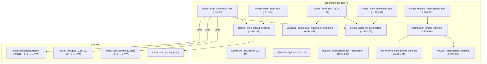
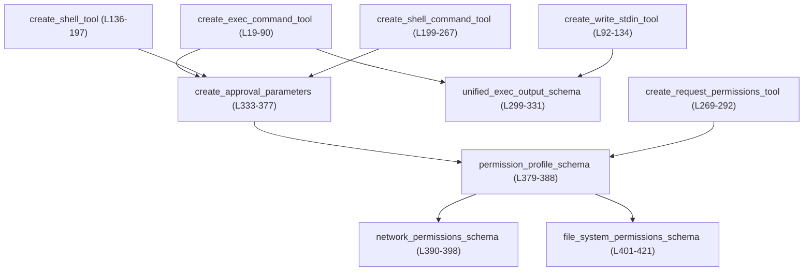

# tools/src/local_tool.rs コード解説

## 0. ざっくり一言

- 各種ローカル実行ツール（コマンド実行・シェル実行・対話セッション・権限要求）の **ToolSpec と JSON Schema** を組み立てるモジュールです。  
  (local_tool.rs:L19-292, L299-388)
- 実際のコマンド実行やサンドボックス制御は別コンポーネントに任せ、このモジュールは **パラメータ仕様と出力スキーマ** を定義する役割を持ちます。  
  (local_tool.rs:L19-89, L92-134, L136-197, L199-267, L269-292, L299-331, L333-377)

---

## 1. このモジュールの役割

### 1.1 概要

- このモジュールは、エージェント／クライアントが呼び出す「ツール」の **仕様 (ToolSpec)** を構築するためのヘルパ関数群を提供します。  
  (local_tool.rs:L19-89, L92-134, L136-197, L199-267, L269-292)
- 各ツールに対して、受け取るパラメータの JSON Schema と、必要に応じてレスポンスの JSON Schema を定義します。  
  (local_tool.rs:L70-89, L120-133, L185-196, L255-266, L280-291, L299-331)
- サンドボックス権限・追加権限・権限要求などの **権限関連パラメータ** の共通スキーマをまとめて生成します。  
  (local_tool.rs:L333-377, L379-388, L390-398, L401-421)

### 1.2 アーキテクチャ内での位置づけ

このモジュールは、`ToolSpec`／`ResponsesApiTool`／`JsonSchema` を使ってツール定義を返す「定義モジュール」です。実行エンジンやクライアントとの接続は他のモジュール側の責務です（このチャンクには現れません）。



- `ToolSpec` / `ResponsesApiTool` / `JsonSchema` 自体の定義は他ファイルで行われており、このチャンクには現れません。
- `serde_json::Value` と `serde_json::json!` を用いて、出力スキーマ (`unified_exec_output_schema`) を直接 JSON 値として構築します。  
  (local_tool.rs:L4-5, L299-331)

### 1.3 設計上のポイント

- **責務分離**  
  - コマンド実行・シェル実行・権限要求など、用途ごとに `create_*_tool` 関数を分けて ToolSpec を構築しています。  
    (local_tool.rs:L19-90, L92-134, L136-197, L199-267, L269-292)
  - 権限関連のパラメータ構築は `create_approval_parameters` と `permission_profile_schema` 以下に共通化されています。  
    (local_tool.rs:L333-377, L379-388)
- **状態を持たない構造**  
  - すべての関数は `ToolSpec` や `JsonSchema` を組み立てて返すだけで、モジュール内にミュータブルなグローバル状態はありません。  
    (local_tool.rs:L19-90, L92-134, L136-197, L199-267, L269-292, L299-331, L333-377, L379-421)
- **エラーハンドリング**  
  - すべての関数は `Result` ではなく直接値を返し、内部でエラーを返したり panic するコードは含まれていません（`json!` マクロもコンパイル時に型が合わなければエラーになります）。  
    (local_tool.rs:L19-90, L92-134, L136-197, L199-267, L269-292, L299-331)
- **プラットフォーム依存の説明文**  
  - Windows の場合のみ、PowerShell とファイル操作の安全ガイドラインを説明文に埋め込む設計になっています。  
    (local_tool.rs:L72-79, L162-183, L233-253, L424-428)

---

## 2. 主要な機能一覧（コンポーネントインベントリー概観）

このモジュールが提供する主な機能は次のとおりです。

- `create_exec_command_tool`:
  - PTY 上でコマンドを実行し、出力またはセッション ID を返す **`exec_command` ツール** の ToolSpec を構築します。  
    (local_tool.rs:L19-90)
- `create_write_stdin_tool`:
  - 既存の unified exec セッションに対して stdin を書き込みつつ、出力を取得する **`write_stdin` ツール** を定義します。  
    (local_tool.rs:L92-134)
- `create_shell_tool`:
  - 引数配列形式でコマンドを指定する **`shell` ツール**（execvp / CreateProcessW ベース）の ToolSpec を構築します。  
    (local_tool.rs:L136-197)
- `create_shell_command_tool`:
  - シェルスクリプト文字列をデフォルトシェルで実行する **`shell_command` ツール**を定義します。  
    (local_tool.rs:L199-267)
- `create_request_permissions_tool`:
  - ファイルシステム／ネットワーク権限の追加付与をユーザーに要求する **`request_permissions` ツール** を定義します。  
    (local_tool.rs:L269-292)
- `request_permissions_tool_description`:
  - 上記権限要求ツールの標準的な説明文を返します。  
    (local_tool.rs:L294-297)
- `unified_exec_output_schema`:
  - `exec_command` と `write_stdin` の共通レスポンス形式（セッション ID・終了コード・出力など）の JSON Schema を返します。  
    (local_tool.rs:L299-331)
- 権限スキーマ関連 (`create_approval_parameters`, `permission_profile_schema`, `network_permissions_schema`, `file_system_permissions_schema`):
  - サンドボックス権限や追加権限のプロファイルを JSON Schema として定義します。  
    (local_tool.rs:L333-377, L379-388, L390-398, L401-421)

---

## 3. 公開 API と詳細解説

### 3.1 型一覧（構造体）＋関数インベントリー

#### 構造体（公開）

| 名前 | 種別 | 役割 / 用途 | 定義位置 |
|------|------|-------------|----------|
| `CommandToolOptions` | 構造体 | `exec_command` / `shell_command` ツールのオプション。ログインシェルを許可するかと、実行権限承認機能の有効/無効を指定します。 | `local_tool.rs:L8-12` |
| `ShellToolOptions` | 構造体 | `shell` ツール用のオプション。実行権限承認機能の有効/無効のみを持ちます。 | `local_tool.rs:L14-17` |

#### 関数インベントリー（公開・非公開）

| 関数名 | 可視性 | 役割 / 用途 | 主な呼び出し元（このチャンク内） | 定義位置 |
|--------|--------|-------------|-----------------------------------|----------|
| `create_exec_command_tool` | `pub` | `exec_command` ツールの `ToolSpec` を構築する。PTY 実行＋ unified exec 出力スキーマを使用。 | 外部利用想定のみ（このチャンク内からの呼び出しなし） | `local_tool.rs:L19-90` |
| `create_write_stdin_tool` | `pub` | 既存 unified exec セッションへ stdin を書き込む `write_stdin` ツールの `ToolSpec` を構築。 | 外部利用想定のみ | `local_tool.rs:L92-134` |
| `create_shell_tool` | `pub` | 引数配列形式のコマンドを実行する `shell` ツールの `ToolSpec` を構築。権限パラメータを付与可能。 | 外部利用想定のみ | `local_tool.rs:L136-197` |
| `create_shell_command_tool` | `pub` | シェルスクリプト文字列を実行する `shell_command` ツールの `ToolSpec` を構築。権限パラメータを付与可能。 | 外部利用想定のみ | `local_tool.rs:L199-267` |
| `create_request_permissions_tool` | `pub` | 権限プロファイルの追加付与をユーザーにリクエストする `request_permissions` ツールを定義。 | 外部利用想定のみ | `local_tool.rs:L269-292` |
| `request_permissions_tool_description` | `pub` | 権限要求ツールの標準説明文を返す。 | 外部利用想定のみ | `local_tool.rs:L294-297` |
| `unified_exec_output_schema` | `fn` | unified exec 系ツールの共通出力 JSON Schema を構築。 | `create_exec_command_tool`, `create_write_stdin_tool` | `local_tool.rs:L299-331` |
| `create_approval_parameters` | `fn` | サンドボックス／追加権限／ justification 等のパラメータスキーマを共通生成。 | `create_exec_command_tool`, `create_shell_tool`, `create_shell_command_tool` | `local_tool.rs:L333-377` |
| `permission_profile_schema` | `fn` | `network` と `file_system` からなる権限プロファイルの JSON Schema を生成。 | `create_request_permissions_tool`, `create_approval_parameters` | `local_tool.rs:L379-388` |
| `network_permissions_schema` | `fn` | `enabled` フラグのみを持つネットワーク権限スキーマ。 | `permission_profile_schema` | `local_tool.rs:L390-398` |
| `file_system_permissions_schema` | `fn` | 読み取り/書き込みパス配列からなるファイルシステム権限スキーマ。 | `permission_profile_schema` | `local_tool.rs:L401-421` |
| `windows_destructive_filesystem_guidance` | `fn` | Windows における破壊的ファイル操作の安全ガイドライン文字列を返す。 | Windows 分岐内の説明文 (`create_exec_command_tool`, `create_shell_tool`, `create_shell_command_tool`) | `local_tool.rs:L424-428` |

---

### 3.2 関数詳細（7件）

#### `create_exec_command_tool(options: CommandToolOptions) -> ToolSpec`

**概要**

- PTY 上でコマンドを実行する `exec_command` ツールの `ToolSpec` を構築します。  
  (local_tool.rs:L70-71, L78-79)
- 入力パラメータスキーマと、unified exec 出力スキーマを設定します。  
  (local_tool.rs:L20-57, L66-68, L83-88, L88-89, L299-331)

**引数**

| 引数名 | 型 | 説明 |
|--------|----|------|
| `options` | `CommandToolOptions` | ログインシェルを許可するか (`allow_login_shell`)、実行権限承認を有効にするか (`exec_permission_approvals_enabled`) を指定します。 (local_tool.rs:L8-12, L19-19) |

**戻り値**

- `ToolSpec`  
  - 名前 `exec_command` の `ResponsesApiTool` を内包した `ToolSpec::Function`。  
    (local_tool.rs:L70-71)
  - `parameters` にパラメータの JSON Schema を、`output_schema` に `unified_exec_output_schema()` を設定しています。  
    (local_tool.rs:L83-88)

**内部処理の流れ**

1. `cmd`, `workdir`, `shell`, `tty`, `yield_time_ms`, `max_output_tokens` の各プロパティを持つ `properties` マップを `BTreeMap::from` で作成します。  
   (local_tool.rs:L20-57)
2. `options.allow_login_shell` が `true` の場合のみ、`login` という boolean プロパティを追加します。  
   (local_tool.rs:L58-65)
3. `create_approval_parameters(options.exec_permission_approvals_enabled)` を呼び出し、権限関連の追加プロパティをマージします。  
   (local_tool.rs:L66-68, L333-377)
4. `cfg!(windows)` によって Windows／非 Windows で説明文を切り替え、Windows では `windows_destructive_filesystem_guidance()` の内容を末尾に付加します。  
   (local_tool.rs:L72-79, L74-76, L424-428)
5. `ResponsesApiTool` 構造体を作成し、`ToolSpec::Function` でラップして返します。`parameters` には `JsonSchema::object(properties, Some(["cmd"]), Some(false.into()))` を与え、`cmd` が必須でその他は任意になります。  
   (local_tool.rs:L70-89)

**Examples（使用例）**

この例では、ログインシェルを許可し、権限承認も有効にした `exec_command` ツールの仕様を生成して、仮のツール登録関数に渡しています。

```rust
use crate::tools::local_tool::{CommandToolOptions, create_exec_command_tool}; // モジュールのパスは実際の構成に依存
use crate::ToolSpec; // ToolSpec の定義はこのチャンクには現れません

fn register_tool(_tool: ToolSpec) {
    // 実際にはツールレジストリに登録する処理が入る想定（このチャンクには実装がありません）
}

fn setup_exec_command_tool() {
    let options = CommandToolOptions {
        allow_login_shell: true,                   // login パラメータを schema に含める
        exec_permission_approvals_enabled: true,   // 追加権限関連パラメータを含める
    };

    let exec_tool_spec = create_exec_command_tool(options); // ToolSpec を生成
    register_tool(exec_tool_spec);                          // レジストリに登録する想定
}
```

**Errors / Panics**

- この関数自体は `Result` を返さず、内部で明示的な panic やエラー生成は行っていません。  
  (local_tool.rs:L19-90)
- `json!` のようなマクロも使用していないため、型不整合に起因するコンパイル時エラーを除けば、実行時エラーは発生しない設計です。

**Edge cases（エッジケース）**

- `options.allow_login_shell == false` の場合、入力スキーマに `login` プロパティは含まれません。クライアントがこのフィールドを送る前提にはなりません。  
  (local_tool.rs:L58-65)
- `options.exec_permission_approvals_enabled == false` の場合、`create_approval_parameters` からの戻り値に `additional_permissions` は含まれなくなり、説明文も「with_additional_permissions」を前提としないものに変わります。  
  (local_tool.rs:L340-344, L369-373)
- Windows / 非 Windows の違いは **説明文のみ** に影響し、実際のパラメータスキーマは同一です。  
  (local_tool.rs:L72-79)

**使用上の注意点**

- 実行されるコマンド自体はこのモジュールでは一切検証されず、単に文字列として `cmd` に渡される設計です。実際の安全性・妥当性チェックはツール実行側に依存します。  
  (local_tool.rs:L21-24)
- `sandbox_permissions` や `additional_permissions` の値の意味・許容値（`use_default` / `with_additional_permissions` / `require_escalated` など）は説明文にのみ記述されており、型レベルの制約は `string` に留まります。  
  (local_tool.rs:L338-345)
- セキュリティ上、`require_escalated` を必要以上に用いるとサンドボックス外でのコマンド実行を許す設計になりますが、その実際の影響評価はこのファイルからは読み取れません（別コンポーネント依存）。  
  (local_tool.rs:L351-355)

---

#### `create_write_stdin_tool() -> ToolSpec`

**概要**

- 既存の unified exec セッションに文字列を stdin として書き込み、その結果の出力を返す `write_stdin` ツールの `ToolSpec` を構築します。  
  (local_tool.rs:L92-134, L121-124)
- 出力フォーマットは `unified_exec_output_schema` と共通です。  
  (local_tool.rs:L132-133, L299-331)

**引数**

- なし。

**戻り値**

- `ToolSpec`  
  - 名前 `write_stdin` の `ResponsesApiTool` を内包した `ToolSpec::Function`。  
    (local_tool.rs:L120-122)
  - `parameters` に `session_id` を必須とする JSON Schema を設定し、`output_schema` に unified exec 出力スキーマを設定します。  
    (local_tool.rs:L93-118, L127-133)

**内部処理の流れ**

1. `session_id`, `chars`, `yield_time_ms`, `max_output_tokens` の 4 プロパティを持つ `properties` マップを作成します。  
   (local_tool.rs:L93-118)
2. `JsonSchema::object(properties, Some(["session_id"]), Some(false.into()))` でオブジェクトスキーマを生成し、`session_id` を必須とします。  
   (local_tool.rs:L127-130)
3. `ResponsesApiTool` を構築し、`ToolSpec::Function` に包んで返します。出力スキーマには `unified_exec_output_schema()` を指定します。  
   (local_tool.rs:L120-133, L299-331)

**Examples（使用例）**

```rust
use crate::tools::local_tool::create_write_stdin_tool;
use crate::ToolSpec;

fn register_tool(_tool: ToolSpec) {
    // 実際の登録処理はこのチャンク外
}

fn setup_write_stdin_tool() {
    let write_stdin_spec = create_write_stdin_tool(); // unified exec セッション向けツール定義
    register_tool(write_stdin_spec);
}
```

**Errors / Panics**

- 関数自体はエラーを返しません。  
  (local_tool.rs:L92-134)
- `session_id` の妥当性（存在するセッションかどうかなど）はこのモジュールでは扱われず、実行エンジン側に依存します（このチャンクには現れない）。

**Edge cases（エッジケース）**

- `chars` プロパティの説明に「may be empty to poll」とあり、空文字列を送ることで stdin 書き込みなしに出力だけを取得する用途が想定されています。  
  (local_tool.rs:L101-105)
- `yield_time_ms` と `max_output_tokens` は任意であり、指定しない場合のデフォルト挙動はこのファイルには記述がなく、「不明」です。  
  (local_tool.rs:L107-117)

**使用上の注意点**

- unified exec セッションを識別する `session_id` のスキーマは `number` となっており、文字列などは受け付けない設計です。  
  (local_tool.rs:L95-99)
- 実際のセッションライフサイクル（いつ `session_id` が無効になるか）は、このファイルには記述がありません。

---

#### `create_shell_tool(options: ShellToolOptions) -> ToolSpec`

**概要**

- 引数配列 (`["bash", "-lc", "ls"]` など) でコマンドを指定する `shell` ツールの `ToolSpec` を構築します。  
  (local_tool.rs:L136-197, L139-144, L179-183)
- Windows では PowerShell／CreateProcessW ベースの説明文、非 Windows では `execvp()`・`bash -lc` 推奨の説明文を付与します。  
  (local_tool.rs:L162-183)

**引数**

| 引数名 | 型 | 説明 |
|--------|----|------|
| `options` | `ShellToolOptions` | 実行権限承認機能 (`exec_permission_approvals_enabled`) を有効化するかどうか。権限関連プロパティの有無に影響します。 (local_tool.rs:L14-17, L136-136) |

**戻り値**

- `ToolSpec`  
  - 名前 `shell` の `ResponsesApiTool` を内包した `ToolSpec::Function`。  
    (local_tool.rs:L185-187)
  - `parameters` に `command` を必須とする JSON Schema を持ち、権限関連プロパティは `create_approval_parameters` で拡張されます。  
    (local_tool.rs:L137-157, L158-160, L190-193, L333-377)

**内部処理の流れ**

1. `command` (string 配列), `workdir` (string), `timeout_ms` (number) を含む `properties` マップを構築します。  
   (local_tool.rs:L137-157)
2. `create_approval_parameters(options.exec_permission_approvals_enabled)` を呼び出し、サンドボックス関連プロパティを追加します。  
   (local_tool.rs:L158-160, L333-377)
3. `cfg!(windows)` で説明文を切り替えます。Windows では PowerShell の具体例と `windows_destructive_filesystem_guidance()` を含んだ詳細な説明になります。  
   (local_tool.rs:L162-177, L164-175, L424-428)
4. `JsonSchema::object` で `command` を必須とするパラメータスキーマを生成し、`ResponsesApiTool` に設定して返します。  
   (local_tool.rs:L190-193)

**Examples（使用例）**

```rust
use crate::tools::local_tool::{ShellToolOptions, create_shell_tool};
use crate::ToolSpec;

fn register_tool(_tool: ToolSpec) {}

fn setup_shell_tool() {
    let options = ShellToolOptions {
        exec_permission_approvals_enabled: true, // sandbox_permissions / additional_permissions を含める
    };
    let shell_spec = create_shell_tool(options);

    register_tool(shell_spec);
    // 実行側では "command": ["bash", "-lc", "ls -la"] などを渡す想定
}
```

**Errors / Panics**

- 関数自体にエラー処理や panic はありません。  
  (local_tool.rs:L136-197)
- `command` の内容（存在しないコマンドなど）に関する検証は行っていません。

**Edge cases（エッジケース）**

- `workdir` を指定しない場合のデフォルト作業ディレクトリは説明されておらず、このチャンクからは分かりません。  
  (local_tool.rs:L146-149)
- Windows 向け説明文には「CreateProcessW() にそのまま渡す」とありますが、実際の呼び出し実装はこのファイルには存在せず、「不明」です。  
  (local_tool.rs:L164-170)

**使用上の注意点**

- 説明文には「`workdir` を常に設定し、`cd` は極力使わない」と明示されており、ツール利用者は `workdir` パラメータで作業ディレクトリを制御する前提になっています。  
  (local_tool.rs:L179-181)
- PowerShell での破壊的ファイル操作に関するガイドライン（シェルを跨いで削除しない、絶対パスを検証する）が説明文に含まれており、ユーザーがその指針に従うことが安全性の前提となっています。  
  (local_tool.rs:L164-175, L424-428)

---

#### `create_shell_command_tool(options: CommandToolOptions) -> ToolSpec`

**概要**

- シェルスクリプト文字列をユーザーのデフォルトシェルで実行する `shell_command` ツールを定義します。  
  (local_tool.rs:L199-267, L202-205, L250-252)
- `create_shell_tool` との差異は、コマンド指定が「文字列ひとつ」か「文字列配列」か、および `login` パラメータの有無です。  
  (local_tool.rs:L200-207, L220-227)

**引数**

| 引数名 | 型 | 説明 |
|--------|----|------|
| `options` | `CommandToolOptions` | ログインシェル許可 (`allow_login_shell`) と実行権限承認の有効化 (`exec_permission_approvals_enabled`) を指定します。 (local_tool.rs:L8-12, L199-199) |

**戻り値**

- `ToolSpec`  
  - 名前 `shell_command` の `ResponsesApiTool` を内包した `ToolSpec::Function`。  
    (local_tool.rs:L255-257)
  - `parameters` に `command`（string）を必須とする JSON Schema を設定し、`allow_login_shell` が `true` の場合に `login` パラメータを含みます。  
    (local_tool.rs:L200-219, L220-227, L260-263)

**内部処理の流れ**

1. `command` (string), `workdir` (string), `timeout_ms` (number) を持つ `properties` を構築します。  
   (local_tool.rs:L200-218)
2. `options.allow_login_shell` が `true` の場合、`login` (boolean) プロパティを追加します。  
   (local_tool.rs:L220-227)
3. `create_approval_parameters(options.exec_permission_approvals_enabled)` を呼び出し、権限関連プロパティを追加します。  
   (local_tool.rs:L229-231, L333-377)
4. Windows / 非 Windows で説明文を切り替えます（Windows では PowerShell の例・ガイドライン付）。  
   (local_tool.rs:L233-253, L234-247, L424-428)
5. `JsonSchema::object` で `command` を必須とするスキーマを設定し、`ToolSpec::Function` を返します。  
   (local_tool.rs:L255-265)

**Examples（使用例）**

```rust
use crate::tools::local_tool::{CommandToolOptions, create_shell_command_tool};
use crate::ToolSpec;

fn setup_shell_command_tool() {
    let options = CommandToolOptions {
        allow_login_shell: false,                  // login オプションを schema に含めない
        exec_permission_approvals_enabled: true,
    };

    let spec = create_shell_command_tool(options);
    // 実行時には {"command": "echo hello", "workdir": "..."} のような入力を想定
}
```

**Errors / Panics**

- この関数自体はエラーや panic を発生させません。  
  (local_tool.rs:L199-267)

**Edge cases（エッジケース）**

- `allow_login_shell == false` の場合は `login` プロパティが存在しないため、クライアント UI などは `login` の設定を提供できません。  
  (local_tool.rs:L220-227)
- 説明文には `workdir` の設定推奨がありますが、未指定時の挙動はこのファイルには明示されていません。  
  (local_tool.rs:L250-252)

**使用上の注意点**

- `shell` ツールと違い、コマンドの分割は実行側のシェルに依存するため、クォートや変数展開の挙動がシェル実装に左右されます。このファイルはその詳細を規定していません。  
  (local_tool.rs:L202-205)
- PowerShell 用の説明には破壊的操作の注意点が含まれており、このガイドに従うことが安全性の前提です。  
  (local_tool.rs:L234-247, L424-428)

---

#### `create_request_permissions_tool(description: String) -> ToolSpec`

**概要**

- 追加のファイルシステム／ネットワーク権限をユーザーに要求する `request_permissions` ツールを定義します。  
  (local_tool.rs:L269-292, L281-282)
- 実際に要求する権限の内容は `permission_profile_schema()` で定義されたプロファイルで指定します。  
  (local_tool.rs:L269-278, L379-388)

**引数**

| 引数名 | 型 | 説明 |
|--------|----|------|
| `description` | `String` | ツールの説明文。`request_permissions_tool_description()` が返す標準文言などを渡すことが想定されます。 (local_tool.rs:L269-269, L294-297) |

**戻り値**

- `ToolSpec`  
  - 名前 `request_permissions` の `ResponsesApiTool` を内包した `ToolSpec::Function`。  
    (local_tool.rs:L280-282)
  - `parameters` に `reason`（任意）と `permissions`（権限プロファイル、必須）の JSON Schema を設定します。  
    (local_tool.rs:L270-278, L285-288)

**内部処理の流れ**

1. `reason`（string）と `permissions`（`permission_profile_schema()`）を含む `properties` マップを作成します。  
   (local_tool.rs:L270-278, L379-388)
2. `JsonSchema::object` で `permissions` を必須とするオブジェクトスキーマを構築します。  
   (local_tool.rs:L285-288)
3. 渡された `description` とともに `ResponsesApiTool` を作成し、`ToolSpec::Function` で返します。  
   (local_tool.rs:L280-291)

**Examples（使用例）**

```rust
use crate::tools::local_tool::{
    create_request_permissions_tool,
    request_permissions_tool_description,
};
use crate::ToolSpec;

fn setup_request_permissions_tool() {
    let desc = request_permissions_tool_description(); // 標準説明文
    let spec: ToolSpec = create_request_permissions_tool(desc);

    // 実行時には permissions: { network: { enabled: true }, file_system: { read: [...], write: [...] } }
    // のようなプロファイルを渡す想定
}
```

**Errors / Panics**

- エラーや panic は発生しません。  
  (local_tool.rs:L269-292)
- 実際にどの権限が付与されるか・拒否された場合の挙動は、このモジュールでは規定していません。

**Edge cases（エッジケース）**

- `reason` を省略（未指定）した場合でも、`permissions` があればスキーマ上は有効です。  
  (local_tool.rs:L272-276, L285-288)
- `permission_profile_schema()` の `required` は `None` であり、`network` と `file_system` の両方を省略したプロファイルが有効かどうかは、このファイルだけでは判断できません。  
  (local_tool.rs:L381-386)

**使用上の注意点**

- `permission_profile_schema()` では `additionalProperties: false` が設定されているため、`network` / `file_system` 以外のキーは許容されません。  
  (local_tool.rs:L379-387)
- このツールで付与された権限が「後続の shell 系コマンドに自動適用される」旨が説明文に記載されており、権限の持続スコープはクライアント側の実装に依存します。  
  (local_tool.rs:L294-297)

---

#### `request_permissions_tool_description() -> String`

**概要**

- `create_request_permissions_tool` 用の標準説明文を返します。  
  (local_tool.rs:L294-297)
- 権限がどのように後続コマンドへ適用されるかの概要も文中で説明されています。  
  (local_tool.rs:L294-297)

**引数**

- なし。

**戻り値**

- `String`  
  - 固定の英語説明文を `to_string()` したもの。  
    (local_tool.rs:L294-297)

**内部処理の流れ**

1. 定数文字列リテラルを `to_string()` して返すだけです。  
   (local_tool.rs:L294-297)

**Examples（使用例）**

上の `create_request_permissions_tool` の例を参照してください。

**Errors / Panics**

- エラー・panic の要因はありません。  
  (local_tool.rs:L294-297)

**Edge cases / 使用上の注意点**

- 説明文の内容にロジック上の依存はなく、単に UI などでユーザーに表示される文面として使う想定のため、アプリケーションのポリシーに応じて別の説明文を渡すことも可能です。  
  (local_tool.rs:L269-292, L294-297)

---

#### `create_approval_parameters(exec_permission_approvals_enabled: bool) -> BTreeMap<String, JsonSchema>`

**概要**

- コマンド実行ツールに付与する、サンドボックス／権限関係の共通パラメータスキーマを生成します。  
  (local_tool.rs:L333-377)
- `exec_permission_approvals_enabled` に応じて説明文と `additional_permissions` プロパティの有無が変わります。  
  (local_tool.rs:L338-345, L369-373)

**引数**

| 引数名 | 型 | 説明 |
|--------|----|------|
| `exec_permission_approvals_enabled` | `bool` | 追加権限プロファイル (`additional_permissions`) を許可するかどうか。`true` の場合追加され、説明文もそれを前提にしたものになります。 (local_tool.rs:L333-335, L338-345, L369-373) |

**戻り値**

- `BTreeMap<String, JsonSchema>`  
  - 次のキーを持つマップを返します：  
    - 共通: `sandbox_permissions` (string), `justification` (string), `prefix_rule` (string 配列)  
    - 追加: `additional_permissions` (`permission_profile_schema()`) ※`exec_permission_approvals_enabled == true` のときのみ  
      (local_tool.rs:L336-367, L369-373)

**内部処理の流れ**

1. `sandbox_permissions`（string）プロパティを追加。説明文は引数に応じて 2 パターンに切り替わります。  
   (local_tool.rs:L336-345)
2. `justification`（string）プロパティを追加。`sandbox_permissions` が `require_escalated` のときにユーザーへの質問文を指定する用途として説明されています。  
   (local_tool.rs:L349-357)
3. `prefix_rule`（string 配列）プロパティを追加。将来類似コマンドの承認を簡略化するため、プレフィックスパターンを登録するためのフィールドとして説明されています。  
   (local_tool.rs:L359-365)
4. `exec_permission_approvals_enabled` が `true` のときだけ、`additional_permissions` プロパティを追加し、そのスキーマには `permission_profile_schema()` を用います。  
   (local_tool.rs:L369-373, L379-388)

**Examples（使用例）**

`create_exec_command_tool` などで使用されるため、通常は直接呼び出しませんが、単独で使うこともできます。

```rust
use crate::tools::local_tool::create_approval_parameters;
use crate::JsonSchema;
use std::collections::BTreeMap;

fn debug_approval_schema() -> BTreeMap<String, JsonSchema> {
    // 追加権限もリクエスト可能な設定
    create_approval_parameters(true)
}
```

**Errors / Panics**

- エラー・panic を発生させる処理はありません。  
  (local_tool.rs:L333-377)

**Edge cases（エッジケース）**

- `exec_permission_approvals_enabled == false` の場合、`additional_permissions` プロパティは存在せず、説明文も「`with_additional_permissions`」への言及がないバージョンになります。  
  (local_tool.rs:L340-344, L369-373)
- `justification` と `prefix_rule` は説明文中で「Only set if ...」と条件付きでの利用が示されていますが、スキーマ上は常に存在する任意プロパティです。実際にその条件を強制するのはアプリケーション側の責務です。  
  (local_tool.rs:L351-355, L362-364)

**使用上の注意点**

- この関数で生成されるプロパティはすべて任意フィールドであり、「必須かどうか」は呼び出し元の `JsonSchema::object` 側の `required` 指定で制御されます。  
  (local_tool.rs:L333-377)
- セキュリティ的には、`sandbox_permissions` によってサンドボックス外での実行がリクエストされうるため、実行エンジン側で必ずユーザー承認を確認する設計が前提とされています（説明文の内容から読み取れる範囲）。  
  (local_tool.rs:L351-355)

---

### 3.3 その他の関数

| 関数名 | 役割（1 行） | 定義位置 |
|--------|--------------|----------|
| `unified_exec_output_schema` | unified exec 系ツールの共通レスポンス JSON Schema を返す。`wall_time_seconds` / `output` を必須とし、`exit_code` / `session_id` / `original_token_count` を任意とする。 | `local_tool.rs:L299-331` |
| `permission_profile_schema` | `network` / `file_system` の 2 つのサブスキーマからなる権限プロファイルの JSON Schema を構築する。 | `local_tool.rs:L379-388` |
| `network_permissions_schema` | `enabled: bool` プロパティのみを持つネットワーク権限スキーマを定義する。 | `local_tool.rs:L390-398` |
| `file_system_permissions_schema` | `read` / `write` のパス配列を持つファイルシステム権限スキーマを定義する。 | `local_tool.rs:L401-421` |
| `windows_destructive_filesystem_guidance` | Windows における破壊的ファイル操作の安全ガイドラインを英語テキストで返す。 | `local_tool.rs:L424-428` |

---

## 4. データフロー

代表的なシナリオとして、「`exec_command` でセッションを開始し、`write_stdin` で対話的にやりとりする」場合のデータフローを、定義レベルで示します。

1. アプリケーションが起動時に `create_exec_command_tool` と `create_write_stdin_tool` を呼び、ツールレジストリに登録します。  
   (local_tool.rs:L19-90, L92-134)
2. クライアント／エージェントが `exec_command` を呼び出し、必要なら `session_id` を含むレスポンスを受け取ります。出力形式は `unified_exec_output_schema` に従います。  
   (local_tool.rs:L88-89, L299-331)
3. クライアントが `write_stdin` を `session_id` と `chars` を指定して呼び出し、同様の出力スキーマで結果を受け取ります。  
   (local_tool.rs:L92-134, L299-331)

### ツール定義間のデータフロー（関数呼び出し）



- unified exec の出力スキーマ (`UO`) は `exec_command` と `write_stdin` で共有されます。これにより、セッション開始と追加入力で同一のレスポンス形式を使用できます。  
  (local_tool.rs:L88-89, L132-133, L299-331)
- 権限関連スキーマ (`CAP` → `PPS` → `NPS` / `FPS`) は shell 系ツールと権限要求ツールで共用され、一貫した権限表現を提供します。  
  (local_tool.rs:L158-160, L229-231, L270-278, L333-377, L379-388, L390-398, L401-421)

---

## 5. 使い方（How to Use）

### 5.1 基本的な使用方法

典型的なフローは「アプリケーション起動時に ToolSpec を生成・登録し、実行時にはクライアントからの入力に従ってツールを呼び出す」という形になります。このファイルは **定義側** のみを提供し、実際の登録・呼び出しロジックは別モジュールです（このチャンクには現れません）。

```rust
use crate::tools::local_tool::{
    CommandToolOptions,
    ShellToolOptions,
    create_exec_command_tool,
    create_write_stdin_tool,
    create_shell_tool,
    create_shell_command_tool,
    create_request_permissions_tool,
    request_permissions_tool_description,
};
use crate::ToolSpec;

fn register_tool(_tool: ToolSpec) {
    // 実際のツールレジストリ実装はこのチャンクの外側に存在する想定
}

fn setup_tools() {
    // exec_command
    let exec_tool = create_exec_command_tool(CommandToolOptions {
        allow_login_shell: false,
        exec_permission_approvals_enabled: true,
    });
    register_tool(exec_tool);

    // write_stdin
    let write_stdin_tool = create_write_stdin_tool();
    register_tool(write_stdin_tool);

    // shell (配列形式)
    let shell_tool = create_shell_tool(ShellToolOptions {
        exec_permission_approvals_enabled: true,
    });
    register_tool(shell_tool);

    // shell_command (文字列形式)
    let shell_command_tool = create_shell_command_tool(CommandToolOptions {
        allow_login_shell: false,
        exec_permission_approvals_enabled: true,
    });
    register_tool(shell_command_tool);

    // request_permissions
    let desc = request_permissions_tool_description();
    let request_permissions_tool = create_request_permissions_tool(desc);
    register_tool(request_permissions_tool);
}
```

### 5.2 よくある使用パターン

1. **対話的コマンド実行 (exec_command + write_stdin)**  
   - `exec_command` で長時間実行するプログラムを開始し、`session_id` を受け取る。  
     (local_tool.rs:L70-79, L299-331)
   - `write_stdin` で同じ `session_id` を使いながら stdin に入力を送り、出力をポーリングする。  
     (local_tool.rs:L93-105, L120-133, L299-331)

2. **サンドボックス付きの shell 実行**  
   - `shell` または `shell_command` のパラメータに `sandbox_permissions` や `additional_permissions` を指定し、必要に応じて `justification` / `prefix_rule` でユーザー承認ワークフローをサポートします。  
     (local_tool.rs:L136-160, L199-231, L333-377)

3. **事前権限取得**  
   - 一連の処理の前に `request_permissions` ツールを呼び出し、ネットワークや特定のパスへのアクセス権限をまとめて取得する。  
     (local_tool.rs:L269-292, L379-388, L390-398, L401-421)

### 5.3 よくある間違い（推測可能な範囲）

コードから読み取れる範囲で、起こり得る誤用例と正しい形式を対比します。

```rust
// 誤り例: shell コマンドを文字列で渡してしまう（配列ではない）
/*
{
    "command": "ls -la",  // schema 上は string[] が期待されている
    "workdir": "/workspace"
}
*/

// 正しい例: 配列として渡す
/*
{
    "command": ["bash", "-lc", "ls -la"],
    "workdir": "/workspace"
}
*/
```

- `shell` ツールの `command` は `JsonSchema::array(JsonSchema::string(...))` になっており、配列形式を前提としています。  
  (local_tool.rs:L139-143)

```rust
// 誤り例: exec_permission_approvals_enabled = false なのに additional_permissions を期待する側
let options = ShellToolOptions {
    exec_permission_approvals_enabled: false,
};
let spec = create_shell_tool(options);
// -> schema 上に "additional_permissions" プロパティは含まれない

// 正しい例: additional_permissions を使いたい場合は true にする
let options = ShellToolOptions {
    exec_permission_approvals_enabled: true,
};
let spec = create_shell_tool(options);
```

- `additional_permissions` は `exec_permission_approvals_enabled == true` のときにだけ追加されます。  
  (local_tool.rs:L369-373)

### 5.4 使用上の注意点（まとめ）

- **安全性・セキュリティ**
  - `sandbox_permissions` の値や `require_escalated` を指定した場合の挙動は実行エンジン側に依存します。このモジュールは「許可をリクエストするためのパラメータ」を定義するのみです。  
    (local_tool.rs:L338-345, L351-355)
  - Windows では破壊的ファイル操作に関するガイドライン文字列をあえて説明文に含めており、ユーザー／エージェントがそれを遵守することが前提になっています。  
    (local_tool.rs:L72-76, L164-175, L234-247, L424-428)
- **エラー・境界条件**
  - すべての関数はエラー型を返さないため、スキーマの組み立てに失敗することは想定されていません。入力パラメータの検証やエラー応答は、別のレイヤ（クライアント・実行エンジン）が担います。  
    (local_tool.rs:L19-90, L92-134, L136-197, L199-267, L269-292)
- **並行性**
  - このモジュールにはスレッド生成や async/await は登場せず、純粋なデータ構築のみを行います。`session_id` ベースの並行セッション管理は unified exec の実装側に依存します。  
    (local_tool.rs:L95-99, L315-318)

---

## 6. 変更の仕方（How to Modify）

### 6.1 新しい機能を追加する場合

1. **新ツールの定義関数を追加する**
   - 例: `pub fn create_new_tool(...) -> ToolSpec { ... }` をこのファイルに追加し、`ResponsesApiTool` と `JsonSchema` を用いてパラメータスキーマを構築します。  
     (既存例: local_tool.rs:L19-90, L136-197)
2. **共通の権限ロジックを再利用する**
   - サンドボックスや追加権限が関わる場合は `create_approval_parameters` を再利用すると、既存ツールと同じパラメータ名・構造を維持できます。  
     (local_tool.rs:L333-377)
3. **レスポンススキーマを定義する**
   - unified exec 系に近い出力形式を使う場合は `unified_exec_output_schema()` を使い回し、それ以外の場合は新たな JSON `Value` を `json!` で定義します。  
     (local_tool.rs:L299-331)
4. **Windows / 非 Windows の説明を分岐させる**
   - プラットフォーム固有の注意事項が必要であれば、`cfg!(windows)` を使って説明文を切り替え、必要に応じて `windows_destructive_filesystem_guidance()` を再利用します。  
     (local_tool.rs:L72-79, L162-183, L233-253, L424-428)

### 6.2 既存の機能を変更する場合

- **影響範囲の確認**
  - パラメータ名の変更や削除は、クライアント／エージェント側のコードや UI に直接影響します。`required` に指定しているフィールド (`cmd`, `session_id`, `command`, `permissions` など) を変更する場合は特に注意が必要です。  
    (local_tool.rs:L85-86, L129-129, L192-193, L262-262, L287-287)
- **契約（前提条件・返り値）の維持**
  - `unified_exec_output_schema()` の `required: ["wall_time_seconds", "output"]` と `additionalProperties: false` は、レスポンス構造の契約です。ここを変えると、レスポンスをパースする側に影響します。  
    (local_tool.rs:L327-329)
  - `permission_profile_schema()` も `additionalProperties: false` を指定しているため、キーの追加には対応するクライアント側修正が必要になります。  
    (local_tool.rs:L379-387)
- **テストの確認**
  - このファイル末尾で `#[path = "local_tool_tests.rs"] mod tests;` が指定されているため、変更時には `local_tool_tests.rs` にあるテスト（このチャンクには内容が現れません）を実行して挙動の変化を確認する必要があります。  
    (local_tool.rs:L430-432)

---

## 7. 関連ファイル

| パス | 役割 / 関係 |
|------|------------|
| `tools/src/local_tool_tests.rs` | `#[path = "local_tool_tests.rs"]` で読み込まれるテストモジュール。`create_*_tool` やスキーマ構築ロジックのテストが存在すると推測されますが、内容はこのチャンクには現れません。 (local_tool.rs:L430-432) |
| `crate::JsonSchema` | このファイルで使用される JSON スキーマ表現型。具体的な定義場所はこのチャンクには現れませんが、すべてのツールパラメータ・権限プロファイルの定義に用いられています。 (local_tool.rs:L1-3, L20-57, L83-88, L93-118, L127-130, L137-157, L190-193, L200-218, L260-263, L270-278, L285-288, L333-377, L379-388, L390-398, L401-421) |
| `crate::ToolSpec` | エージェント／クライアントに公開されるツール仕様の型。`create_*_tool` 系関数の返り値として用いられています。定義自体はこのチャンクには現れません。 (local_tool.rs:L3-3, L19-19, L92-92, L136-136, L199-199, L269-269) |
| `crate::ResponsesApiTool` | 実際のツール実装をラップする構造体。`ToolSpec::Function` の内部に格納されます。定義場所はこのチャンクには現れません。 (local_tool.rs:L2-2, L70-89, L120-133, L185-196, L255-266, L280-291) |
| `serde_json` | `Value` と `json!` マクロを提供し、`unified_exec_output_schema()` 内で JSON スキーマを直接構築するために使用されています。 (local_tool.rs:L4-5, L299-331) |
| `std::collections::BTreeMap` | パラメータ名から `JsonSchema` へのマップを構築するために使用されます。オブジェクトのプロパティ定義に一貫して利用されています。 (local_tool.rs:L6-6, L20-57, L93-118, L137-157, L200-218, L270-278, L333-377, L379-388, L390-398, L401-421) |

このモジュールは、実行エンジンやクライアントとの境界に立つ **ツール定義レイヤ** として設計されており、安全性・エラー処理・並行性の実装はすべて外側のコンポーネントに委ねられています。そのため、このファイルを変更する際は、外部の契約（スキーマ・フィールド名・必須/任意）に対する影響を重点的に確認する必要があります。
