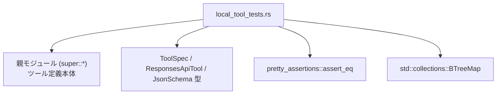
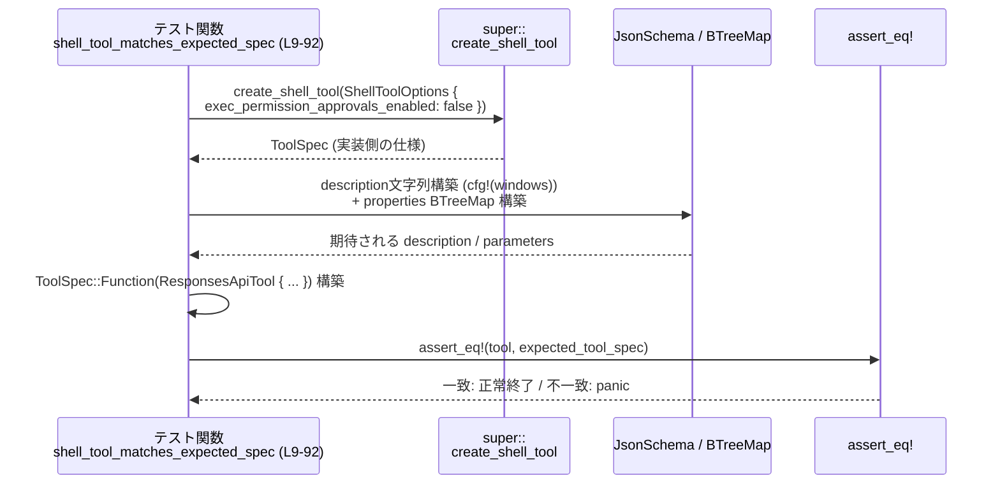

# tools/src/local_tool_tests.rs

## 0. ざっくり一言

- ローカル環境向けツール（`shell`, `exec_command`, `write_stdin`, `request_permissions`, `shell_command`）の **ToolSpec と JSON スキーマが仕様どおりかを検証するテスト群**です。  
- Windows / 非 Windows で変わる説明文や、権限承認用パラメータの有無など、外部公開 API の仕様をテストとして固定しています。

---

## 1. このモジュールの役割

### 1.1 概要

- このモジュールは **ローカル実行ツールのメタデータ（名前・説明・JSON スキーマ）** が期待どおりであることを検証するために存在し、`create_*_tool` 系関数の返す `ToolSpec` を `assert_eq!` で比較します。  
  （`shell`, `exec_command`, `write_stdin`, `request_permissions`, `shell_command` など）  
  根拠: `shell_tool_matches_expected_spec` などの各テストで `ToolSpec::Function(ResponsesApiTool { ... })` と比較しているため  
  （tools/src/local_tool_tests.rs:L10-13, L77-91 ほか）

- Windows / 非 Windows で説明文が変わるツールについては `cfg!(windows)` を利用し、プラットフォーム依存の仕様もテストで固定しています  
  （tools/src/local_tool_tests.rs:L15-33, L101-109, L258-279, L337-354）。

- 「権限承認フロー」が有効／無効のケースで、パラメータスキーマにどのフィールドが含まれるべきかを BTreeMap で構築し、期待値として検証します  
  （tools/src/local_tool_tests.rs:L35-75, L111-155, L233-253, L356-382）。

### 1.2 アーキテクチャ内での位置づけ

このファイルはテストモジュールであり、親モジュール（`super::*`）から以下のツール生成関数や型をインポートして利用しています（親モジュールの正確なファイルパス名はこのチャンクからは不明です）。

- `create_shell_tool`, `create_exec_command_tool`, `create_write_stdin_tool`,
  `create_request_permissions_tool`, `create_shell_command_tool`
- `ShellToolOptions`, `CommandToolOptions`
- `ToolSpec`, `ResponsesApiTool`, `JsonSchema`
- `create_approval_parameters`, `unified_exec_output_schema`,
  `permission_profile_schema`, `windows_destructive_filesystem_guidance`

依存関係を簡略図にすると次のようになります。



- A は本ファイルのテストモジュール  
  （tools/src/local_tool_tests.rs:L1-3, L9, L94, L177, L227, L298, L330）
- B はツール生成ロジックを提供（`create_*_tool` など）  
  （tools/src/local_tool_tests.rs:L11, L96, L179, L229-230, L300-301, L332-335）
- C はツール仕様を表現する型群  
  （tools/src/local_tool_tests.rs:L79-90, L162-173, L210-223, L283-294, L315-326, L389-400）
- D はテスト用の等価性アサーション  
  （tools/src/local_tool_tests.rs:L2, L77, L160, L208, L281, L313, L387）
- E は JSON プロパティを順序付きで保持するためのマップ  
  （tools/src/local_tool_tests.rs:L3, L35, L111, L181, L233, L303, L356）

### 1.3 設計上のポイント

- **仕様をテストで固定**  
  各ツールの `name`, `description`, `parameters`, `output_schema` などのメタデータを、テスト内で明示的に構築し、`assert_eq!` で比較する設計です  
  （例: tools/src/local_tool_tests.rs:L77-91）。

- **BTreeMap による決定的な順序**  
  JSON スキーマの `properties` は `BTreeMap` で構築されており、キー順序が安定するため、`assert_eq!` による構造比較がしやすくなっています  
  （tools/src/local_tool_tests.rs:L35, L111, L181, L233, L303, L356）。

- **プラットフォーム依存の説明文**  
  `cfg!(windows)` を用いて Windows／非 Windows で異なる説明文を構成し、両方のケースの仕様をテストでカバーしています  
  （tools/src/local_tool_tests.rs:L15-33, L101-109, L258-279, L337-354）。

- **権限承認オプションの分離テスト**  
  `exec_permission_approvals_enabled` が `true` / `false` の違いに応じて、  
  - shell ツールの基本仕様（false）  
    （tools/src/local_tool_tests.rs:L10-92）  
  - 追加の許可パラメータが含まれる仕様（true）  
    （tools/src/local_tool_tests.rs:L228-296）  
  を別テストで検証しています。

- **エラーハンドリング**  
  このファイル内では明示的なエラー型や `Result` は使われておらず、仕様違反は `assert_eq!` のパニックとして検出されます。並行性制御も行っておらず、各テストは通常の単一スレッド関数として記述されています。

---

## 2. 主要な機能一覧

- `shell_tool_matches_expected_spec`: `shell` ツールの ToolSpec（説明文とパラメータスキーマ）が期待どおりかを検証するテストです（tools/src/local_tool_tests.rs:L9-92）。
- `exec_command_tool_matches_expected_spec`: `exec_command` ツール（PTY ベースのコマンド実行）の ToolSpec を検証します（tools/src/local_tool_tests.rs:L95-175）。
- `write_stdin_tool_matches_expected_spec`: `write_stdin` ツール（既存 exec セッションへの標準入力書き込み）の ToolSpec を検証します（tools/src/local_tool_tests.rs:L177-225）。
- `shell_tool_with_request_permission_includes_additional_permissions`: `exec_permission_approvals_enabled = true` 時の `shell` ツールの追加パーミッションパラメータを検証します（tools/src/local_tool_tests.rs:L228-296）。
- `request_permissions_tool_includes_full_permission_schema`: `request_permissions` ツールのパラメータスキーマが期待どおり（特に `permissions` フィールド）か検証します（tools/src/local_tool_tests.rs:L299-328）。
- `shell_command_tool_matches_expected_spec`: `shell_command` ツール（シェルスクリプト文字列を実行）の ToolSpec を検証します（tools/src/local_tool_tests.rs:L331-402）。
- `windows_shell_safety_description`: Windows 用説明文に「破壊的なファイルシステム操作に関するガイダンス」を追加するヘルパー関数です（具体的なガイダンス内容はこのチャンクには現れません）（tools/src/local_tool_tests.rs:L5-7）。

---

## 3. 公開 API と詳細解説

このファイル自身は公開 API を定義していませんが、**テストに現れるツール仕様**が実質的な公開 API 仕様として重要です。

### 3.1 関数・テスト一覧（コンポーネントインベントリー）

| 名前 | 種別 | 役割 / 用途 | 定義位置 |
|------|------|------------|----------|
| `windows_shell_safety_description()` | 非公開関数 | Windows 向け説明文の末尾に `windows_destructive_filesystem_guidance()` を2つの改行付きで付加するヘルパー | tools/src/local_tool_tests.rs:L5-7 |
| `shell_tool_matches_expected_spec()` | `#[test]` 関数 | `create_shell_tool(ShellToolOptions { exec_permission_approvals_enabled: false })` が期待どおりの `ToolSpec` (`name = "shell"`) を返すか検証 | tools/src/local_tool_tests.rs:L9-92 |
| `exec_command_tool_matches_expected_spec()` | `#[test]` 関数 | `create_exec_command_tool(CommandToolOptions { allow_login_shell: true, exec_permission_approvals_enabled: false })` の `ToolSpec` (`name = "exec_command"`) を検証 | tools/src/local_tool_tests.rs:L95-175 |
| `write_stdin_tool_matches_expected_spec()` | `#[test]` 関数 | `create_write_stdin_tool()` の `ToolSpec` (`name = "write_stdin"`) を検証 | tools/src/local_tool_tests.rs:L177-225 |
| `shell_tool_with_request_permission_includes_additional_permissions()` | `#[test]` 関数 | `create_shell_tool(ShellToolOptions { exec_permission_approvals_enabled: true })` により、追加の承認関連パラメータが含まれていることを検証 | tools/src/local_tool_tests.rs:L227-296 |
| `request_permissions_tool_includes_full_permission_schema()` | `#[test]` 関数 | `create_request_permissions_tool(..)` のパラメータに `permissions` スキーマが含まれ必須であることなどを検証 | tools/src/local_tool_tests.rs:L298-328 |
| `shell_command_tool_matches_expected_spec()` | `#[test]` 関数 | `create_shell_command_tool(CommandToolOptions { .. })` の `ToolSpec` (`name = "shell_command"`) を検証 | tools/src/local_tool_tests.rs:L330-402 |

### 3.2 関数詳細（テスト関数）

以下では、主要 6 テストについて詳細を記載します。

---

#### `shell_tool_matches_expected_spec()`

**概要**

- ローカル `shell` ツールの ToolSpec が期待どおりであることを検証します。  
- Windows かどうかで `description` の内容が変わる点もテストに含まれます。  
  根拠: `cfg!(windows)` 分岐と `ToolSpec::Function(ResponsesApiTool { name: "shell", ... })` への比較  
  （tools/src/local_tool_tests.rs:L15-33, L77-91）

**引数**

- なし（`#[test]` 関数のため、テストランナーから直接呼び出されます）。

**戻り値**

- `()`（ユニット型）。  
  成功時は何も返さず、仕様不一致の場合は `assert_eq!` によりパニックします  
  （tools/src/local_tool_tests.rs:L77-91）。

**内部処理の流れ**

1. `create_shell_tool` を `ShellToolOptions { exec_permission_approvals_enabled: false }` で呼び、実際の `tool` を取得  
   （tools/src/local_tool_tests.rs:L11-13）。
2. `cfg!(windows)` に応じて `description` 文字列を構築:
   - Windows: Powershell 用説明＋具体例＋ `windows_shell_safety_description()` を付加  
     （tools/src/local_tool_tests.rs:L15-27）。
   - 非 Windows: 汎用シェル説明＋ `execvp()`・`bash -lc`・`workdir` 推奨などの注意書き  
     （tools/src/local_tool_tests.rs:L29-32）。
3. BTreeMap で `parameters` の `properties` を構築（キーと JsonSchema）：  
   - `"command"`: `array<string>`、説明 `"The command to execute"`  
   - `"workdir"`: `string`  
   - `"timeout_ms"`: `number`  
   - `"sandbox_permissions"`: `string`  
   - `"justification"`: `string`（sandbox を外す場合の理由説明）  
   - `"prefix_rule"`: `array<string>`（将来の同種コマンド許可用のプレフィックス）  
   （tools/src/local_tool_tests.rs:L35-75）。
4. 期待される `ToolSpec::Function(ResponsesApiTool { ... })` を構築し、`assert_eq!(tool, expected)` を実行  
   （tools/src/local_tool_tests.rs:L77-91）。

**Examples（使用例 / 仕様の読み取り）**

- テストから読み取れる `shell` ツールのパラメータ仕様（プラットフォーム非依存部分）:

```rust
// parameters.properties（テスト内で期待されている形）
{
    "command": array<string>,        // 実行するコマンド。例: ["bash", "-lc", "ls -la"]
    "workdir": string,               // 実行する作業ディレクトリ
    "timeout_ms": number,            // タイムアウト（ミリ秒）
    "sandbox_permissions": string,   // "require_escalated" などのサンドボックス設定
    "justification": string,         // sandbox解除を求める際の理由
    "prefix_rule": array<string>,    // 将来の同種コマンドをまとめて許可するプレフィックス
}
```

- 必須パラメータは `"command"` だけで、それ以外は任意と解釈できます（`JsonSchema::object` に `Some(vec!["command".to_string()])` が渡されているため）  
  （tools/src/local_tool_tests.rs:L85-87）。  
  ただし `JsonSchema::object` の定義がこのチャンクにはないため、実際の必須フィールドの扱いはその実装に依存します。

**Errors / Panics**

- `create_shell_tool` がパニックする／異常な `ToolSpec` を返す場合は、このテストもパニックします。  
- 期待値との不一致は `assert_eq!` のパニックとして検出されます  
  （tools/src/local_tool_tests.rs:L77-91）。

**Edge cases（エッジケース）**

- このテストは `exec_permission_approvals_enabled: false` のケースのみをカバーしています。  
  `true` のケースは別テスト `shell_tool_with_request_permission_includes_additional_permissions` で検証されます  
  （tools/src/local_tool_tests.rs:L228-231）。
- Windows / 非 Windows の両方の説明文がソースに現れており、コンパイルターゲットに応じてどちらか一方が実行時に選択されます。

**使用上の注意点**

- `shell` ツールの仕様を変更（説明文やパラメータ）した場合、このテストの期待値も更新しないとテストが失敗します。  
- BTreeMap のキー順序は比較対象に影響するため、新しいプロパティを追加する際は同じ方法（`BTreeMap::from` など）でキーを追加することが前提になっています。

---

#### `exec_command_tool_matches_expected_spec()`

**概要**

- PTY 上でコマンドを実行する `exec_command` ツールの ToolSpec が期待どおりか検証するテストです  
  （tools/src/local_tool_tests.rs:L95-175）。  
- Windows では説明文に Windows 用安全ガイダンスが連結される仕様も含まれます  
  （tools/src/local_tool_tests.rs:L101-105）。

**引数**

- なし。

**戻り値**

- `()`（テスト成否のみを表します）。

**内部処理の流れ**

1. `create_exec_command_tool(CommandToolOptions { allow_login_shell: true, exec_permission_approvals_enabled: false })` を呼び、`tool` を取得  
   （tools/src/local_tool_tests.rs:L96-99）。
2. `cfg!(windows)` に応じた説明文を構築:
   - Windows: `"Runs a command in a PTY, ...{}"` に `windows_shell_safety_description()` を挿入  
     （tools/src/local_tool_tests.rs:L101-105）。
   - 非 Windows: 同文言だがガイダンスなし  
     （tools/src/local_tool_tests.rs:L107-109）。
3. BTreeMap でパラメータプロパティを構築:  
   - `"cmd"`: `string` – 実行するシェルコマンド  
   - `"workdir"`: `string` – 作業ディレクトリ（省略時はターンのカレントディレクトリ）  
   - `"shell"`: `string` – 使用するシェルバイナリ（省略時はユーザーのデフォルト）  
   - `"tty"`: `boolean` – TTY を割り当てるか  
   - `"yield_time_ms"`: `number` – 出力を待つ時間  
   - `"max_output_tokens"`: `number` – 返す最大トークン数  
   - `"login"`: `boolean` – `-l/-i` など login shell 的に実行するか  
   （tools/src/local_tool_tests.rs:L111-155）。
4. さらに `create_approval_parameters(false)` で返される追加プロパティを `properties` に `extend` します  
   （tools/src/local_tool_tests.rs:L156-158）。  
   `create_approval_parameters` がどのキーを追加するかはこのチャンクには現れません。
5. `ToolSpec::Function(ResponsesApiTool { name: "exec_command", ... , output_schema: Some(unified_exec_output_schema()) })` を構築し、`assert_eq!` で比較  
   （tools/src/local_tool_tests.rs:L160-173）。

**Errors / Panics**

- 仕様不一致は `assert_eq!` のパニックとして検出されます。  
- `unified_exec_output_schema()` の内容が変わった場合も、このテストが失敗することで検出されます（関数定義自体は別ファイル）。

**Edge cases**

- `allow_login_shell` は `true` のケースのみをカバーしており、`false` の場合の仕様はこのファイルからは分かりません。  
- `exec_permission_approvals_enabled: false` の場合のみテストしており、承認フローが有効な場合の仕様はこのチャンクからは読み取れません。

**使用上の注意点**

- `exec_command` のパラメータに新しいフィールドを追加する際は、ここで構築している `properties` と `create_approval_parameters` の呼び出し順・内容も更新する必要があります。  
- `output_schema` は `write_stdin` と共通の `unified_exec_output_schema()` を使用しており、exec セッションとのやりとりの結果フォーマットを共有していることがテストから確認できます  
  （tools/src/local_tool_tests.rs:L172, L222）。

---

#### `write_stdin_tool_matches_expected_spec()`

**概要**

- 既存の unified exec セッションへ標準入力を書き込み、その結果を取得する `write_stdin` ツールの ToolSpec を検証します  
  （tools/src/local_tool_tests.rs:L177-225）。

**引数**

- なし。

**戻り値**

- `()`。

**内部処理の流れ**

1. `create_write_stdin_tool()` を呼び、`tool` を取得  
   （tools/src/local_tool_tests.rs:L179）。
2. BTreeMap でパラメータプロパティを構築:  
   - `"session_id"`: `number` – 実行中の unified exec セッションの識別子  
     （tools/src/local_tool_tests.rs:L183-186）。  
   - `"chars"`: `string` – stdin に書き込むバイト列。空文字でポーリングのみと説明されている  
     （tools/src/local_tool_tests.rs:L189-192）。  
   - `"yield_time_ms"`: `number` – 出力を待つ時間  
   - `"max_output_tokens"`: `number` – 最大トークン数  
     （tools/src/local_tool_tests.rs:L195-205）。
3. `ToolSpec::Function(ResponsesApiTool { name: "write_stdin", ... , output_schema: Some(unified_exec_output_schema()) })` を構築し、`assert_eq!` で比較  
   （tools/src/local_tool_tests.rs:L208-223）。

**Edge cases / 契約の読み取り**

- 説明文 `"may be empty to poll"` から、`"chars"` が空文字の場合は入力せずに出力のポーリングのみを行う仕様が意図されていると読み取れます  
  （tools/src/local_tool_tests.rs:L189-192）。  
  ただし、実際の挙動は `write_stdin` 実装側に依存し、このチャンクには現れません。
- `session_id` が JSON Schema 上 `number` である点は、整数も浮動小数も受け入れうる仕様に見えますが、ここからは実際の型制約までは分かりません。

**使用上の注意点**

- `exec_command` と同じ `unified_exec_output_schema` を使っているため、「セッション生成」と「セッションへの書き込み」が同じレスポンス形式を共有する設計になっていることがテストから分かります  
  （tools/src/local_tool_tests.rs:L172, L222）。

---

#### `shell_tool_with_request_permission_includes_additional_permissions()`

**概要**

- `ShellToolOptions { exec_permission_approvals_enabled: true }` で `create_shell_tool` を呼んだ場合に、追加の承認関連パラメータが `parameters.properties` に含まれていることを検証するテストです  
  （tools/src/local_tool_tests.rs:L228-256, L281-295）。

**引数 / 戻り値**

- なし / `()`。

**内部処理の流れ**

1. `create_shell_tool(ShellToolOptions { exec_permission_approvals_enabled: true })` を呼び、`tool` を取得  
   （tools/src/local_tool_tests.rs:L229-231）。
2. BTreeMap で基本的なプロパティ `"command"`, `"workdir"`, `"timeout_ms"` を定義  
   （tools/src/local_tool_tests.rs:L233-252）。
3. `create_approval_parameters(true)` を用いて、承認関連プロパティを `properties` に追加  
   （tools/src/local_tool_tests.rs:L254-256）。  
   実際にどのキーが追加されるかはこのチャンクからは分かりませんが、`exec_permission_approvals_enabled = true` の場合にのみ含まれることが前提になっています。
4. Windows / 非 Windows に応じて説明文を構築し、Windows の場合は `windows_destructive_filesystem_guidance()` からのガイダンス文を `format!` で挿入  
   （tools/src/local_tool_tests.rs:L258-273, L275-279）。
5. `ToolSpec::Function(ResponsesApiTool { name: "shell", ... })` と比較  
   （tools/src/local_tool_tests.rs:L281-295）。

**Edge cases**

- `exec_permission_approvals_enabled: true` の場合にのみ、`create_approval_parameters(true)` が呼ばれることがテストで固定されています。  
- これにより、`shell_tool_matches_expected_spec`（false ケース）と組み合わせることで、両方のパスが間接的にカバーされています。

**使用上の注意点**

- 新しい承認関連フィールドを追加する場合は、`create_approval_parameters(true)` の実装とともに、このテストの期待値（特に `properties` や `description`）を調整する必要があります。

---

#### `request_permissions_tool_includes_full_permission_schema()`

**概要**

- `request_permissions` ツールの ToolSpec が期待どおりかを検証するテストで、`permissions` フィールドに `permission_profile_schema()` が使われ、必須フィールドになっていることを確認します  
  （tools/src/local_tool_tests.rs:L299-327）。

**引数 / 戻り値**

- なし / `()`。

**内部処理の流れ**

1. `create_request_permissions_tool("Request extra permissions for this turn.".to_string())` を呼び、`tool` を取得  
   （tools/src/local_tool_tests.rs:L300-301）。
2. BTreeMap でパラメータプロパティを定義:  
   - `"reason"`: `string` – 追加権限が必要な理由の短い説明（任意）  
   - `"permissions"`: `permission_profile_schema()` – 実際の権限プロファイルスキーマ（詳細は別ファイル）  
     （tools/src/local_tool_tests.rs:L303-311）。
3. `ToolSpec::Function(ResponsesApiTool { name: "request_permissions", ... })` を構築し、  
   `parameters` の必須フィールドに `"permissions"` を指定した上で `assert_eq!` で比較  
   （tools/src/local_tool_tests.rs:L313-325）。

**Contracts / Edge cases**

- `"permissions"` が必須フィールドであることがテストで固定されているため、このツールを呼ぶ側は最低限 `permissions` を指定する契約になっていると解釈できます  
  （tools/src/local_tool_tests.rs:L321-323）。
- `"reason"` は任意（必須リストに含まれない）と見なされます。

**使用上の注意点**

- `permission_profile_schema()` の具体的な内容（どのような権限が指定できるか）はこのチャンクには現れないため、別定義を参照する必要があります。  
- このツールの説明文 `"Request extra permissions for this turn."` を変更した場合もテストの期待値を更新する必要があります。

---

#### `shell_command_tool_matches_expected_spec()`

**概要**

- `shell_command` ツール（シェルスクリプト文字列をデフォルトシェルで実行するツール）の ToolSpec を検証するテストです  
  （tools/src/local_tool_tests.rs:L331-402）。  
- `shell` ツールと異なり、`"command"` が **文字列** スクリプトとして定義されている点が重要です  
  （tools/src/local_tool_tests.rs:L358-361）。

**引数 / 戻り値**

- なし / `()`。

**内部処理の流れ**

1. `create_shell_command_tool(CommandToolOptions { allow_login_shell: true, exec_permission_approvals_enabled: false })` を呼び、`tool` を取得  
   （tools/src/local_tool_tests.rs:L332-335）。
2. `cfg!(windows)` に応じた説明文を構築:
   - Windows: Powershell での使用例を複数行記載し、`windows_shell_safety_description()` を末尾に連結  
     （tools/src/local_tool_tests.rs:L337-349）。
   - 非 Windows: 「`workdir` を必ず指定し、`cd` の使用を避けるべき」という注意付き説明  
     （tools/src/local_tool_tests.rs:L351-353）。
3. BTreeMap でパラメータプロパティを構築:  
   - `"command"`: `string` – デフォルトシェルで実行されるスクリプト文字列  
   - `"workdir"`: `string`  
   - `"timeout_ms"`: `number`  
   - `"login"`: `boolean` – ログインシェルとして実行するか  
     （tools/src/local_tool_tests.rs:L356-381）。
4. さらに `create_approval_parameters(false)` を用いて追加プロパティを付加  
   （tools/src/local_tool_tests.rs:L383-385）。
5. `ToolSpec::Function(ResponsesApiTool { name: "shell_command", ... })` と `assert_eq!` で比較  
   （tools/src/local_tool_tests.rs:L387-400）。

**Edge cases / 契約**

- `shell` ツールとの対比から、  
  - `shell` : `"command"` が `array<string>`（プロセス引数ベース）  
  - `shell_command` : `"command"` が `string`（シェルスクリプト）  
  という仕様差がテストで明確に区別されています  
  （tools/src/local_tool_tests.rs:L37-38, L235-239, L358-361）。
- `allow_login_shell` は `true` 固定でテストされていますが、このオプションを変えた場合の挙動はこのチャンクからは分かりません。

**使用上の注意点**

- `shell` と `shell_command` のどちらを使うべきかは、  
  - **引数配列としてコマンドを扱うか**  
  - **シェルスクリプト文字列として扱うか**  
  によって変わることがテストから読み取れます。実際の利用側はこの仕様差を前提に設計する必要があります。

---

### 3.3 その他の関数

| 関数名 | 役割（1 行） | 定義位置 |
|--------|--------------|----------|
| `windows_shell_safety_description()` | `windows_destructive_filesystem_guidance()` の出力に 2 つの改行を付けて返すヘルパー。Windows 向け説明文の末尾に安全ガイダンスを付加する用途で使われます。具体的なガイダンス内容は別定義で、このチャンクには現れません。 | tools/src/local_tool_tests.rs:L5-7 |

---

## 4. データフロー

ここでは代表として `shell_tool_matches_expected_spec` の処理フローを示します。

### 4.1 テキストによる流れ

1. テストランナーが `shell_tool_matches_expected_spec()` を呼び出す（`cargo test` 等）。  
2. 関数内で `create_shell_tool(..)` を呼び、実装側が構築した `ToolSpec` を取得します。  
3. 同じ関数内で、テスト側が期待する `description`（Windows/非 Windows）と `parameters`（`properties`, `required`）を BTreeMap と `JsonSchema` から組み立てます。  
4. `ToolSpec::Function(ResponsesApiTool { ... })` をテスト側で構築し、2. で取得した `tool` と `assert_eq!` で比較します。  
5. 等価ならテスト成功、差異があればパニックしてテスト失敗となります。

### 4.2 シーケンス図（`shell_tool_matches_expected_spec` L9-92）



この図から分かる通り、このモジュールは **実行時のコマンド実行やプロセス管理ではなく、メタデータの形が正しいか** だけを検証しています。並列実行や I/O はこのファイル内では行われません。

---

## 5. 使い方（How to Use）

### 5.1 基本的な使用方法（テストとして）

このファイルはテストモジュールなので、基本的な使い方は `cargo test` で実行することです。

```bash
# プロジェクトルートで
cargo test --test local_tool_tests        # テストターゲット名は構成によって異なります（このチャンクからは不明）
# またはモジュール単位 / 関数名でフィルタ
cargo test shell_tool_matches_expected_spec
```

テストが通ることにより、次のことが保証されます（このファイルから読み取れる範囲で）:

- `create_*_tool` が返す `ToolSpec` の  
  - `name`  
  - `description`（Windows/非 Windows 分岐を含む）  
  - `parameters`（`properties` と必須フィールド）  
  - `output_schema`  
  が期待どおりである。

### 5.2 よくある使用パターン（テスト追加の観点）

**新しいローカルツールの ToolSpec をテストしたい場合のパターン**

```rust
use super::*;
use std::collections::BTreeMap;
use pretty_assertions::assert_eq;

#[test]
fn new_tool_matches_expected_spec() {
    // 1. 実装側のツールを生成
    let tool = create_new_tool(/* options */);  // 実際の関数・オプション名は実装側に依存

    // 2. 期待される description / properties を構築
    let description = "説明文 ...".to_string();
    let properties = BTreeMap::from([
        ("param1".to_string(), JsonSchema::string(Some("パラメータ説明".to_string()))),
        // 必要なだけ追加
    ]);

    // 3. 期待される ToolSpec を構築
    let expected = ToolSpec::Function(ResponsesApiTool {
        name: "new_tool".to_string(),
        description,
        strict: false,
        defer_loading: None,
        parameters: JsonSchema::object(
            properties,
            Some(vec!["param1".to_string()]), // 必須パラメータ
            Some(false.into()),               // additionalProperties 等（実装に依存）
        ),
        output_schema: None, // or Some(...)
    });

    // 4. 実装と期待値を比較
    assert_eq!(tool, expected);
}
```

このパターンは、既存テスト (`shell_tool_matches_expected_spec` など) と同様の構造になっています。

### 5.3 よくある間違い（想定されるもの）

このチャンクから推測できる、テスト実装時に起こりうる誤り例です。

```rust
// 間違い例: HashMap を使う
let mut properties = std::collections::HashMap::new(); // 順序が安定しない
// ...

// 正しい例: BTreeMap を使う（このモジュールの方針）
let properties = std::collections::BTreeMap::from([
    ("command".to_string(), JsonSchema::string(None)),
    // ...
]);
```

- `HashMap` を使うとキー順序が不定で、`assert_eq!` の比較結果が安定しない可能性があります。ここでは `BTreeMap` を一貫して使用しています  
  （tools/src/local_tool_tests.rs:L35, L111, L181, L233, L303, L356）。

```rust
// 間違い例: 追加パーミッションを手動で書かない
let properties = BTreeMap::from([ /* ベースフィールドのみ */ ]);

// 正しい例: create_approval_parameters を追加で利用
let mut properties = BTreeMap::from([ /* ベースフィールド */ ]);
properties.extend(create_approval_parameters(/* exec_permission_approvals_enabled */ false));
```

- `exec_command` や `shell_command` では、承認関連フィールドを `create_approval_parameters` で追加する設計になっているため、それを忘れるとテストの期待値と実装が同期しません  
  （tools/src/local_tool_tests.rs:L156-158, L383-385）。

### 5.4 使用上の注意点（まとめ）

- このモジュールは **メタデータの仕様をテストで固定する** 役割を持つため、実装側ツール仕様を変更したら、テストも同時に更新する必要があります。  
- Windows / 非 Windows の説明文差分を `cfg!(windows)` で処理しているため、新しいプラットフォーム固有分岐を追加する場合はテスト側の分岐も増やす必要があります。  
- セキュリティ関連の仕様（`sandbox_permissions`, `justification`, `prefix_rule`, `permissions` など）は、ここでは **文字列説明とスキーマ形状** までしか分かりません。実際の権限チェックやサンドボックスの挙動は別実装に依存しています。

---

## 6. 変更の仕方（How to Modify）

### 6.1 新しい機能を追加する場合（新ツール／新パラメータ）

1. **親モジュール（super）側で新しいツール生成関数を追加**  
   - 例: `fn create_new_tool(...) -> ToolSpec { ... }`  
   - ここではその定義は見えませんが、既存の `create_shell_tool` 等を参照するのが自然です。

2. **このテストファイルに対応するテスト関数を追加**  
   - `#[test]` 関数として、`create_new_tool` の返す `ToolSpec` に対する期待値を `BTreeMap` と `JsonSchema` で構築します。  
   - 既存の `*_matches_expected_spec` 系テストをコピーして書き換えるのが分かりやすいです。

3. **必要ならプラットフォーム分岐を追加**  
   - Windows とその他で説明文が異なるなら、`cfg!(windows)` で分岐し、両分岐の文字列をテスト内に明示します。

4. **実装を変更したときにテストが壊れた場合**  
   - テスト結果を見て、どのフィールド（`description`, `parameters`, `output_schema` など）が変わったかを比較し、仕様変更なのか単なる実装バグなのかを判断します。

### 6.2 既存の機能を変更する場合

- **影響範囲の確認方法**
  - `shell` ツールの仕様を変えたい場合:  
    - `shell_tool_matches_expected_spec` と  
      `shell_tool_with_request_permission_includes_additional_permissions` の両方を見る必要があります  
      （tools/src/local_tool_tests.rs:L9-92, L227-296）。
  - `exec_command` / `write_stdin` のレスポンス形式を変えたい場合:  
    - どちらも `unified_exec_output_schema()` を前提にしているため、両テストを確認します  
      （tools/src/local_tool_tests.rs:L172, L222）。

- **契約（前提条件）の維持**
  - 必須パラメータ（`command`, `cmd`, `permissions`, `session_id` など）を変更・削除する場合は、呼び出し側コードにも影響する契約変更になります。  
  - テスト中の `required` リスト（`JsonSchema::object` の第 2 引数）を変更した場合は、それに依存しているクライアント実装も合わせて見直す必要があります。

- **テストの更新**
  - 説明文の微修正（文言のみ）でも、このファイルでは文字列を完全一致比較しているためテストが失敗します。  
  - 仕様として文言まで固定したくない場合は、将来的に部分一致（`contains` など）に変更することも考えられますが、そのような変更はこのチャンクには含まれていません。

---

## 7. 関連ファイル

このチャンクから直接参照できる他ファイルの情報は限定的です。パスが明示されていないものについては「パス不明」としています。

| パス / モジュール | 役割 / 関係 |
|------------------|------------|
| 親モジュール（`super::*`、パス不明） | `create_shell_tool`, `create_exec_command_tool`, `create_write_stdin_tool`, `create_request_permissions_tool`, `create_shell_command_tool`, `ShellToolOptions`, `CommandToolOptions`, `ToolSpec`, `ResponsesApiTool`, `JsonSchema`, `create_approval_parameters`, `unified_exec_output_schema`, `permission_profile_schema`, `windows_destructive_filesystem_guidance` などを定義していると見られます（tools/src/local_tool_tests.rs:L1, L5-7, L11, L96, L179, L229-230, L300-301, L332-335）。 |
| `pretty_assertions` クレート | `assert_eq` を拡張し、差分表示などを提供するテスト用クレートです。このモジュールでは ToolSpec の期待値比較に利用されています（tools/src/local_tool_tests.rs:L2, L77, L160, L208, L281, L313, L387）。 |
| `std::collections::BTreeMap` | JSON スキーマの `properties` を順序付きマップとして保持するために使用されます（tools/src/local_tool_tests.rs:L3, L35, L111, L181, L233, L303, L356）。 |

---

### バグ・セキュリティ観点（このファイルに限ったまとめ）

- このファイルはテストのみを含み、実際のコマンド実行や権限管理ロジックは含みません。そのため、直接的なセキュリティ脆弱性は見当たりません。
- ただし、テキストとして埋め込まれている説明文から次のようなセキュリティ上の意図が読み取れ、それがテストで固定されています。
  - シェル利用時は `workdir` を必ず指定し、`cd` を多用しないことを推奨  
    （tools/src/local_tool_tests.rs:L29-31, L275-277, L351-353）。
  - `sandbox_permissions`, `justification`, `prefix_rule`, `permissions` などのパラメータを通じて権限昇格・サンドボックス解除をユーザー承認に紐づける設計  
    （tools/src/local_tool_tests.rs:L49-73, L303-311）。
- これらは**仕様として文字列レベルで固定**されていますが、実際の安全性は親モジュールの実装（サンドボックス実装・権限チェック）側に依存します。このチャンクからはその詳細は分かりません。
