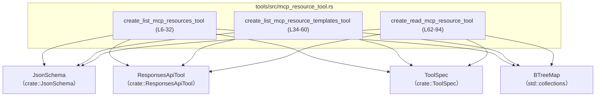
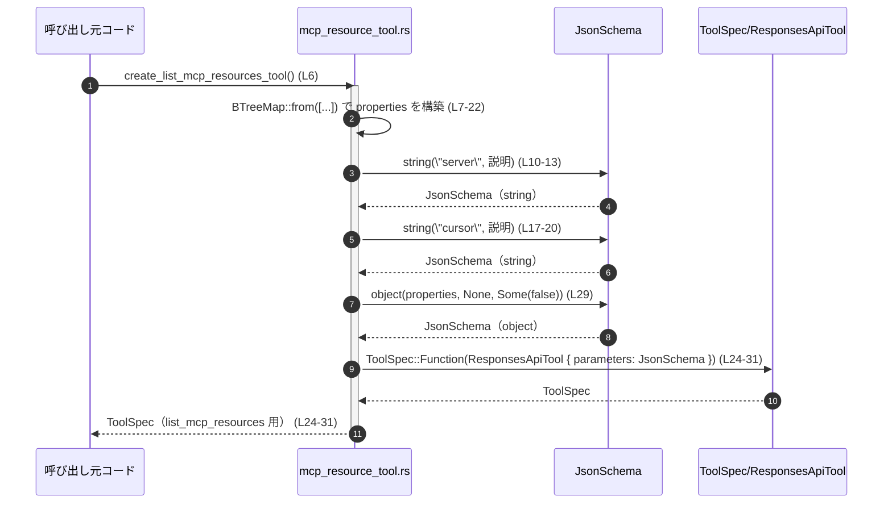

# tools/src/mcp_resource_tool.rs コード解説

## 0. ざっくり一言

MCP（Model Context Protocol）サーバが提供する「リソース」および「リソーステンプレート」を列挙・読み取りするための **ToolSpec を生成するヘルパ関数群**を定義しているモジュールです（根拠: `tools/src/mcp_resource_tool.rs:L6-94`）。

---

## 1. このモジュールの役割

### 1.1 概要

- このモジュールは、MCP サーバに関する 3 種類のツール
  - リソース一覧
  - リソーステンプレート一覧
  - リソース読み取り
  の **ToolSpec（ツール仕様）オブジェクトを構築して返す**役割を持ちます（根拠: 関数名と戻り値 `ToolSpec`: `L6-32`, `L34-60`, `L62-94`）。
- 各関数は、`JsonSchema` を用いてパラメータの JSON スキーマを定義し、そのスキーマを持つ `ToolSpec::Function(ResponsesApiTool { ... })` を生成します（根拠: `L7-22`, `L24-31`, `L35-50`, `L52-59`, `L63-78`, `L80-93`）。

### 1.2 アーキテクチャ内での位置づけ

このモジュールは **ToolSpec ビルダー**として機能し、他のモジュールから呼び出されることによって ToolSpec を提供する側です。自分からは以下の型に依存しています（根拠: `L1-4`）。

- `crate::JsonSchema`
- `crate::ResponsesApiTool`
- `crate::ToolSpec`
- `std::collections::BTreeMap`

依存関係を簡単な図で示します。



※ これらの ToolSpec がどこから利用されるか（ツールレジストリ等）は、このチャンクには現れないため不明です。

### 1.3 設計上のポイント

- **純粋関数スタイル**  
  各関数は引数を持たず、内部で `BTreeMap` や `JsonSchema` を組み立てて `ToolSpec` を返すだけの純粋関数です。外部状態の変更や I/O は見られません（根拠: `L6-32`, `L34-60`, `L62-94`）。
- **パラメータスキーマの明示**  
  ツールの引数はすべて JSON スキーマとして `JsonSchema::string` / `JsonSchema::object` で定義されており、説明文（description）も文字列として埋め込まれています（根拠: `L7-22`, `L24-31`, `L35-50`, `L52-59`, `L63-78`, `L80-93`）。
- **必須パラメータの区別**  
  「一覧」系 2 つのツールは必須フィールドなし（`required: None`）、読み取りツールは `"server"` と `"uri"` を必須としています（根拠: `JsonSchema::object(..., /*required*/ None, ...)` `L29`, `L57`, および `Some(vec!["server".to_string(), "uri".to_string()])` `L88-89`）。
- **スレッド・並行性**  
  `async` やスレッド関連の API、`unsafe` は一切使われておらず、関数は引数なしで毎回新しい値を返すだけなので、どのスレッドから同時に呼んでもデータ競合は発生しない構造です（根拠: 全体の実装 `L1-94`）。

---

## 2. コンポーネントインベントリーと主要機能一覧

### 2.1 コンポーネントインベントリー

このチャンクに現れる関数・モジュールの一覧です。

| 名前 | 種別 | 公開性 | 役割 / 用途 | 定義位置 |
|------|------|--------|-------------|----------|
| `create_list_mcp_resources_tool` | 関数 | `pub` | MCP リソース一覧取得用の ToolSpec を構築して返す | `tools/src/mcp_resource_tool.rs:L6-32` |
| `create_list_mcp_resource_templates_tool` | 関数 | `pub` | MCP リソーステンプレート一覧取得用の ToolSpec を構築して返す | `tools/src/mcp_resource_tool.rs:L34-60` |
| `create_read_mcp_resource_tool` | 関数 | `pub` | 指定リソースを読み取るための ToolSpec を構築して返す | `tools/src/mcp_resource_tool.rs:L62-94` |
| `tests` | モジュール | （テスト時のみ） | このモジュール向けのテストを含む | `tools/src/mcp_resource_tool.rs:L96-98` |

関連する外部型（このチャンクには定義が現れないもの）:

| 名前 | 種別 | 役割 / 用途 | このファイル内の使用箇所 |
|------|------|-------------|--------------------------|
| `JsonSchema` | 型（詳細不明） | JSON スキーマの構築に使用 | `L1`, `L10-13`, `L17-20`, `L24`, `L29`, `L38-41`, `L45-48`, `L52`, `L57`, `L66-69`, `L73-76`, `L80`, `L87-91` |
| `ResponsesApiTool` | 構造体（詳細不明） | `ToolSpec::Function` に渡されるツール定義 | `L2`, `L24-31`, `L52-59`, `L80-93` |
| `ToolSpec` | 列挙体と思われる型 | ツール仕様のトップレベル表現 | `L3`, `L6`, `L24`, `L34`, `L52`, `L62`, `L80` |

※ `JsonSchema`, `ResponsesApiTool`, `ToolSpec` の定義場所（ファイルパス）はこのチャンクには現れないため不明です。

### 2.2 主要な機能一覧

- MCP リソース一覧ツールの定義: `list_mcp_resources` 用 `ToolSpec` の生成（`L6-32`）
- MCP リソーステンプレート一覧ツールの定義: `list_mcp_resource_templates` 用 `ToolSpec` の生成（`L34-60`）
- MCP リソース読み取りツールの定義: `read_mcp_resource` 用 `ToolSpec` の生成（`L62-94`）

---

## 3. 公開 API と詳細解説

### 3.1 型一覧（構造体・列挙体など）

このモジュール自身は新しい構造体・列挙体を定義していません（根拠: 定義が関数と `mod tests` のみ `L6-32`, `L34-60`, `L62-94`, `L96-98`）。

外部型の利用概要:

| 名前 | 種別 | 役割 / 用途 |
|------|------|-------------|
| `JsonSchema` | 型（関連関数 `string`, `object` を持つ） | ツールの引数を JSON スキーマとして表現するために使用（文字列型・オブジェクト型） |
| `ResponsesApiTool` | 構造体 | `name`, `description`, `strict`, `defer_loading`, `parameters`, `output_schema` フィールドを持つツール定義オブジェクト |
| `ToolSpec` | 列挙体と推測される | `ToolSpec::Function(ResponsesApiTool { ... })` という形で、実際のツール仕様をラップする |

これらの詳細実装はこのチャンクには現れないため、「どのように実行されるか」や「シリアライズ形式」などは不明です。

---

### 3.2 関数詳細

#### `create_list_mcp_resources_tool() -> ToolSpec`

**概要**

- MCP サーバが提供するリソースの一覧を取得するためのツール `"list_mcp_resources"` の `ToolSpec` を構築して返します（根拠: `ResponsesApiTool { name: "list_mcp_resources", ... }` `L24-26`）。
- パラメータとして `"server"` と `"cursor"` の 2 つの文字列プロパティを持つオブジェクトスキーマを定義します（根拠: `BTreeMap::from([...])` `L7-22`, `JsonSchema::object(properties, /*required*/ None, ...)` `L29`）。

**引数**

- 引数はありません。

**戻り値**

- `ToolSpec`  
  - `ToolSpec::Function(ResponsesApiTool { ... })` 形式の値で、`name = "list_mcp_resources"`、`strict = false`、`parameters` に JSON オブジェクトスキーマを持ちます（根拠: `L24-31`）。

**内部処理の流れ（アルゴリズム）**

1. `BTreeMap::from([...])` で `"server"` と `"cursor"` の 2 つのエントリを持つマップ `properties` を作成（根拠: `L7-22`）。
   - `"server"` は説明付きの `JsonSchema::string`。
   - `"cursor"` も説明付きの `JsonSchema::string`。
2. `JsonSchema::object(properties, /*required*/ None, Some(false.into()))` を使って、必須フィールドなし・`additionalProperties` に `false` を渡した（と読める）オブジェクトスキーマを生成（根拠: `L29`）。
3. そのスキーマを `ResponsesApiTool { ... }` の `parameters` フィールドに設定し、`ToolSpec::Function(...)` としてラップして返却（根拠: `L24-31`）。

**Examples（使用例）**

この例では、単に ToolSpec を生成して、別の仮の関数に渡しています。`use_tool_spec` はモジュール外でどのように利用されるかを抽象化したダミー関数です。

```rust
use crate::tools::mcp_resource_tool::create_list_mcp_resources_tool; // 実際のパスは crate 構成に依存（不明）

// ToolSpec を受け取る仮の関数
fn use_tool_spec(spec: crate::ToolSpec) {
    // ここで spec を登録・実行などする想定の処理を書く
    let _ = spec; // 未使用警告を避けるためのダミー
}

fn main() {
    // MCP リソース一覧ツールの ToolSpec を構築する
    let spec = create_list_mcp_resources_tool();
    // 構築した ToolSpec を何らかの処理に渡す
    use_tool_spec(spec);
}
```

**Errors / Panics**

- この関数は `Result` などのエラー型を返さず、明示的な `panic!` もありません（根拠: 関数本体 `L6-32`）。
- 内部で行っているのは
  - `BTreeMap` と `String` の生成
  - `JsonSchema` / `ResponsesApiTool` / `ToolSpec` の構築  
 だけであり、通常の Rust のメモリ確保以外の失敗経路は見えません。

**Edge cases（エッジケース）**

- **パラメータ未指定**  
  `required` が `None` なので、スキーマ上は `"server"` も `"cursor"` も必須ではありません（根拠: `L29`）。
- **余分なプロパティ**  
  第 3 引数に `Some(false.into())` を渡しているため、追加プロパティを禁止する意味合いがある可能性がありますが、`JsonSchema::object` の仕様はこのチャンクには現れないため断定できません（根拠: `L29`）。

**使用上の注意点**

- `"server"` が「Optional MCP server name」と説明されているため、クライアント側は省略も許容される設計と読めます（根拠: 説明文 `L10-13`）。
- `"cursor"` も「previous list_mcp_resources call」の戻り値とあるだけで、必須ではないと説明されています（根拠: `L17-20`）。
- 実際にどのようにバリデーションされるかは `JsonSchema` / 実行基盤側の仕様次第であり、このチャンクには現れません。

---

#### `create_list_mcp_resource_templates_tool() -> ToolSpec`

**概要**

- MCP サーバが提供する **リソーステンプレート**を一覧するツール `"list_mcp_resource_templates"` の `ToolSpec` を構築して返します（根拠: `name: "list_mcp_resource_templates"` `L53`）。
- パラメータとして `"server"` と `"cursor"` を持つオブジェクトスキーマを定義します（根拠: `L35-50`, `L57`）。

**引数**

- 引数はありません。

**戻り値**

- `ToolSpec::Function(ResponsesApiTool { ... })` 形式の値で、`name = "list_mcp_resource_templates"`, `strict = false` です（根拠: `L52-59`）。

**内部処理の流れ**

1. `"server"` と `"cursor"` の 2 つのプロパティを持つ `BTreeMap` を構築（根拠: `L35-50`）。
2. それを `JsonSchema::object(properties, /*required*/ None, Some(false.into()))` に渡して、オブジェクトスキーマを作成（根拠: `L57`）。
3. スキーマを `ResponsesApiTool` の `parameters` に設定し、`ToolSpec::Function` として返す（根拠: `L52-59`）。

**Examples（使用例）**

```rust
use crate::tools::mcp_resource_tool::create_list_mcp_resource_templates_tool;

// ToolSpec を Vec に集める簡単な例
fn collect_tool_specs() -> Vec<crate::ToolSpec> {
    let mut specs = Vec::new();
    specs.push(create_list_mcp_resource_templates_tool()); // テンプレート一覧ツールを追加
    specs
}
```

**Errors / Panics**

- `create_list_mcp_resources_tool` と同様、エラー戻り値や `panic!` はありません（根拠: `L34-60`）。

**Edge cases**

- `"server"` と `"cursor"` は必須ではなく、オプションとして扱われる設計です（根拠: `required: None` `L57`）。
- 説明文により `"server"` を省略すると「全てのサーバのテンプレート」と読めるため、実行時には省略が許容されることが期待されますが、その挙動はこのチャンクには現れません（根拠: `L38-41`）。

**使用上の注意点**

- `"cursor"` の説明から、ページングのために前回の呼び出しで返されたカーソルを再利用する想定であると読めます（根拠: `L45-48`）。
- 実際のカーソル値のフォーマットや有効期限はこのチャンクには現れません。

---

#### `create_read_mcp_resource_tool() -> ToolSpec`

**概要**

- MCP サーバから **特定のリソースを読み取る**ためのツール `"read_mcp_resource"` の `ToolSpec` を構築して返します（根拠: `name: "read_mcp_resource"` `L81`）。
- `"server"` と `"uri"` の 2 つの文字列プロパティを持ち、両方を必須とするパラメータスキーマを定義します（根拠: `L63-78`, `L87-90`）。

**引数**

- 引数はありません。

**戻り値**

- `ToolSpec::Function(ResponsesApiTool { ... })`  
  - `name = "read_mcp_resource"`、`parameters` に `"server"` と `"uri"` を必須とするオブジェクトスキーマを持つ ToolSpec です（根拠: `L80-93`）。

**内部処理の流れ**

1. `"server"` と `"uri"` の 2 つのエントリを持つ `BTreeMap` を作成（根拠: `L63-78`）。
2. `JsonSchema::object(properties, Some(vec!["server".to_string(), "uri".to_string()]), Some(false.into()))` を呼び出し、`"server"` と `"uri"` を必須フィールドとしたオブジェクトスキーマを生成（根拠: `L87-90`）。
3. そのスキーマを `ResponsesApiTool` の `parameters` に設定し、`ToolSpec::Function` として返却（根拠: `L80-93`）。

**Examples（使用例）**

```rust
use crate::tools::mcp_resource_tool::create_read_mcp_resource_tool;

// 複数の MCP 関連ツールをまとめて取得する例
fn mcp_tool_specs() -> Vec<crate::ToolSpec> {
    vec![
        create_read_mcp_resource_tool(), // リソース読み取りツール
        // 他の MCP 関連 ToolSpec をここに追加していく想定
    ]
}
```

**Errors / Panics**

- 他の 2 関数と同様、関数本体内にエラー戻り値や `panic!` はありません（根拠: `L62-94`）。
- `"server"` や `"uri"` の内容が不正であった場合にどう扱われるかは、ToolSpec を解釈する側のロジックに依存し、このチャンクには現れません。

**Edge cases（エッジケース）**

- `"server"` と `"uri"` は `required` に含まれているため、省略した入力はスキーマ上は不正扱いとなるはずです（根拠: `Some(vec!["server".to_string(), "uri".to_string()])` `L88-89`）。
- 説明文には
  - `"server"` は list_mcp_resources で返された `'server'` フィールドと正確に一致しなければならない（根拠: `L66-69`）
  - `"uri"` は list_mcp_resources で返された URI の一つでなければならない（根拠: `L73-76`）
  と書かれており、**他のツールからの出力を再利用することが前提**の契約になっています。

**使用上の注意点**

- `"server"` と `"uri"` の組み合わせは、`list_mcp_resources` の出力をそのまま利用する形で指定するのが想定されている契約です（説明文からの読み取り `L66-69`, `L73-76`）。
- スキーマ上は追加プロパティが無効化されている可能性があり、無関係なフィールドを渡すクライアント実装は避けるのが無難です（根拠: `Some(false.into())` `L90`）。

---

### 3.3 その他の関数

- このモジュールには、補助的なプライベート関数や単純なラッパー関数は定義されていません（根拠: 全関数定義 `L6-32`, `L34-60`, `L62-94`）。

---

## 4. データフロー

ここでは代表的なシナリオとして、`create_list_mcp_resources_tool` が呼ばれた場合のデータフローを示します。

1. 呼び出し元が `create_list_mcp_resources_tool()` を呼ぶ（`L6`）。
2. 関数内で `BTreeMap` と 2 つの `JsonSchema::string` が生成され、`properties` に格納される（`L7-22`）。
3. `JsonSchema::object` によりオブジェクトスキーマが構築される（`L29`）。
4. `ResponsesApiTool { ... }` が生成され、`ToolSpec::Function(...)` に包まれて呼び出し元に返る（`L24-31`）。



同様のパターンで、テンプレート一覧（`L34-60`）とリソース読み取り（`L62-94`）のツールも構築されます。

---

## 5. 使い方（How to Use）

### 5.1 基本的な使用方法

このモジュールの関数は全て「ToolSpec を 1 つ返すファクトリ関数」です。典型的な利用フローは「必要な ToolSpec をまとめて収集する」形になります。

```rust
use crate::tools::mcp_resource_tool::{
    create_list_mcp_resources_tool,
    create_list_mcp_resource_templates_tool,
    create_read_mcp_resource_tool,
};

// MCP 関連の ToolSpec をまとめて取得する
fn mcp_tool_specs() -> Vec<crate::ToolSpec> {
    vec![
        create_list_mcp_resources_tool(),           // リソース一覧 (L6-32)
        create_list_mcp_resource_templates_tool(),  // テンプレート一覧 (L34-60)
        create_read_mcp_resource_tool(),            // リソース読み取り (L62-94)
    ]
}
```

この例では、ToolSpec を単に `Vec` に格納しているだけなので、このファイル外の未定義 API には依存していません。

### 5.2 よくある使用パターン

- **ツールセットの構築時にまとめて呼び出す**  
  初期化コードで 3 つ全ての関数を呼び出し、ToolSpec の一覧をツールレジストリ等に渡すパターンが自然です。
- **用途ごとに選択して使用する**  
  例えば「一覧系ツールだけを提供したい」場合は、`create_list_mcp_resources_tool` と `create_list_mcp_resource_templates_tool` のみを利用するなどの選択も可能です（3 関数は互いに依存していません）。

### 5.3 よくある間違い（起こり得る誤用例）

このファイルから読み取れる契約に反すると想定される誤用例と、より望ましい使い方を対比します。

```rust
// （望ましくない例）read_mcp_resource の ToolSpec で "server" を任意扱いしてしまう
// スキーマ上は "server" と "uri" は必須フィールドになっている（L87-89）ため、
// クライアント実装で省略を許すと、バリデーション段階でエラーになる可能性が高い。
//
// 正しい前提: "server" と "uri" は必須であり、list_mcp_resources の返り値から採る契約になっている。
```

### 5.4 使用上の注意点（まとめ）

- **契約の遵守**  
  `"server"` や `"uri"` の説明文に書かれた契約（リスト API の出力と一致させること）を前提としてツールが設計されています（根拠: `L66-69`, `L73-76`）。
- **スキーマに従ったクライアント実装**  
  必須フラグ (`required`) や追加プロパティの扱い（`Some(false.into())`）を尊重してクライアント側のリクエストを組み立てる必要があります（根拠: `L29`, `L57`, `L87-90`）。
- **並行性・安全性**  
  関数はどれも引数なしで毎回新しい `ToolSpec` を生成するだけであり、共有ミュータブル状態はありません。マルチスレッド環境から同時に呼び出しても、このモジュールが原因でデータ競合が起こることはありません（根拠: 全体 `L1-94`）。

---

## 6. 変更の仕方（How to Modify）

### 6.1 新しい機能を追加する場合

例えば、MCP リソースの「削除」ツールを追加したい場合の大まかなステップです。

1. **新しい関数を追加**  
   既存の 3 関数と同様に、`pub fn create_xxx_tool() -> ToolSpec` という関数を `tools/src/mcp_resource_tool.rs` に追加する（構造は `L6-32`, `L34-60`, `L62-94` を参考）。
2. **プロパティ定義を行う**  
   `BTreeMap::from([...])` と `JsonSchema::string` / `JsonSchema::object` を用いてパラメータスキーマを定義する。
3. **ResponsesApiTool を構築**  
   `name`, `description`, `strict`, `defer_loading`, `parameters`, `output_schema` を適切に設定し、`ToolSpec::Function(...)` でラップする（既存コード `L24-31`, `L52-59`, `L80-93` を参照）。
4. **テストを追加**  
   `#[path = "mcp_resource_tool_tests.rs"] mod tests;` があるため、`mcp_resource_tool_tests.rs` 内に新ツール用のテストを追加する必要があります（根拠: `L96-98`）。

### 6.2 既存の機能を変更する場合

- **影響範囲の確認**
  - 関数のシグネチャ（戻り値の `ToolSpec`）は変えずに、中身のスキーマや説明文のみを変更する方が安全です。
  - `name` フィールド（例: `"list_mcp_resources"` `L25`, `"read_mcp_resource"` `L81`）を変更すると、既存クライアントとの互換性に影響する可能性があります。
- **契約（前提条件）の維持**
  - `"server"` や `"uri"` の説明文に書かれている契約（他ツールとの整合性）を意図的に変える場合は、関連するツール・ドキュメント全体の整合性も確認する必要があります（根拠: `L66-69`, `L73-76`）。
- **テストの更新**
  - `mcp_resource_tool_tests.rs` の内容はこのチャンクには現れませんが、ToolSpec の構造が変わった場合にはテストも更新が必要になります（根拠: `mod tests;` `L98`）。

---

## 7. 関連ファイル

| パス | 役割 / 関係 |
|------|------------|
| `tools/src/mcp_resource_tool.rs` | 本レポート対象。MCP リソース関連ツールの `ToolSpec` を構築する関数を提供する。 |
| `tools/src/mcp_resource_tool_tests.rs` | `#[path = "mcp_resource_tool_tests.rs"]` により参照されるテストモジュール。`create_*_tool` 関数の挙動検証を行っていると推測されるが、内容はこのチャンクには現れない（根拠: `L96-98`）。 |
| `crate::JsonSchema` 定義ファイル | JSON スキーマの型とコンストラクタ (`string`, `object`) を提供するファイル。パスはこのチャンクには現れないため不明。 |
| `crate::ResponsesApiTool` 定義ファイル | `ToolSpec::Function` の中身となるツール仕様構造体を定義するファイル。パスは不明。 |
| `crate::ToolSpec` 定義ファイル | ツール仕様のトップレベル表現（列挙体など）を定義するファイル。パスは不明。 |

---

### Bugs / Security / Performance（このモジュール単体の観点）

- **Bugs（バグ）**  
  - このモジュールはデータ構築のみを行い、ロジック分岐や外部 I/O がないため、コード上から明確に読み取れるバグは特に見当たりません（根拠: 単純な構造 `L6-32`, `L34-60`, `L62-94`）。
- **Security（セキュリティ）**  
  - 外部からの未検証入力を直接扱っておらず、あくまでスキーマと説明文を定義しているだけです。このモジュール単体でのセキュリティ上のリスクは低いと考えられます。
  - 実際の入力検証は `JsonSchema` およびツール実行基盤側に委ねられており、このチャンクには現れません。
- **Performance / Scalability**  
  - 各関数は呼び出しごとに少量の文字列と `BTreeMap` を生成するだけで、計算量は定数時間です。
  - そのため、アプリケーション起動時などに数回呼び出す用途であれば、パフォーマンス上の懸念は特にありません。長時間・高頻度で繰り返し呼び出す場合は、結果のキャッシュも検討できますが、その必要性はこのチャンクからは読み取れません。
