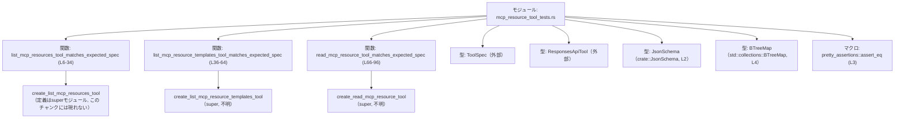
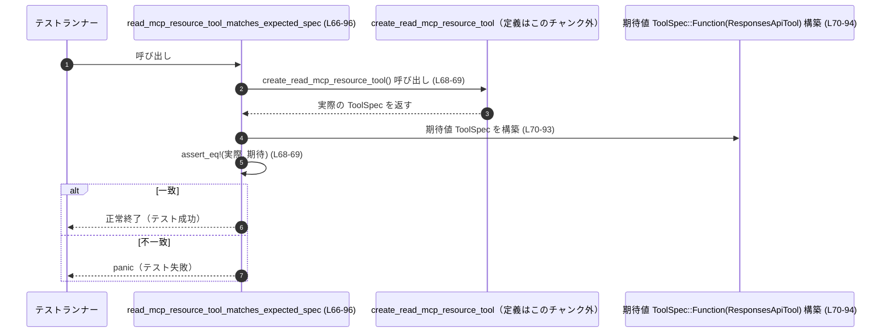

# tools/src/mcp_resource_tool_tests.rs コード解説

## 0. ざっくり一言

`create_list_mcp_resources_tool` / `create_list_mcp_resource_templates_tool` / `create_read_mcp_resource_tool` が生成するツール仕様（`ToolSpec`）が、期待どおりの JSON Schema になっているかを検証するユニットテスト集です（`tools/src/mcp_resource_tool_tests.rs:L6-96`）。

---

## 1. このモジュールの役割

### 1.1 概要

- このモジュールは、MCP（Model Context Protocol）関連の 3 つのツール生成関数が、**正しいツール名・説明文・パラメータスキーマ**を持つ `ToolSpec` を返しているかを検証します（`tools/src/mcp_resource_tool_tests.rs:L7-34,L37-64,L67-96`）。
- 具体的には、テストごとに期待する `ToolSpec::Function(ResponsesApiTool { ... })` を構築し、実際の戻り値と `assert_eq!` で比較します（`tools/src/mcp_resource_tool_tests.rs:L8-15,L38-45,L68-77`）。

### 1.2 アーキテクチャ内での位置づけ

このファイルは「テスト専用モジュール」であり、実装本体は `use super::*;` でインポートして使用しています（`tools/src/mcp_resource_tool_tests.rs:L1`）。

- 依存関係（このチャンクから分かる範囲）  



> `create_*` 関数・`ToolSpec`・`ResponsesApiTool` の定義場所は `use super::*;` から「親モジュール」であることまでは分かりますが、具体的なファイルパスはこのチャンクには現れません。

### 1.3 設計上のポイント

コードから読み取れる設計上の特徴は次のとおりです。

- **ゴールデンスペック比較**  
  - テスト側で期待される `ToolSpec::Function(ResponsesApiTool { ... })` を完全に構築し、それと実装の戻り値を `assert_eq!` で比較する方式になっています（`tools/src/mcp_resource_tool_tests.rs:L8-15,L38-45,L68-77`）。
- **JSON Schema ベースの検証**  
  - パラメータ定義には `JsonSchema::object(BTreeMap::from([...]), ...)` を使用しており、引数名（`server`, `cursor`, `uri`）や説明文、required の有無などをテストで明示しています（`tools/src/mcp_resource_tool_tests.rs:L15-31,L45-61,L77-93`）。
- **副作用や状態を持たないテスト**  
  - テストは純粋に関数の戻り値を比較しており、ファイル I/O やネットワーク、グローバル状態は使用していません。
- **エラーハンドリング**  
  - ランタイムのエラー処理はなく、失敗条件はすべて `assert_eq!` の不一致による panic（テスト失敗）です（`tools/src/mcp_resource_tool_tests.rs:L8,L38,L68`）。

---

## 2. 主要な機能一覧（コンポーネントインベントリー）

### 2.1 機能の概要

- `list_mcp_resources_tool_matches_expected_spec`: `create_list_mcp_resources_tool` が「MCPリソース一覧ツール」の正しい仕様を返すことを検証する（`tools/src/mcp_resource_tool_tests.rs:L6-34`）。
- `list_mcp_resource_templates_tool_matches_expected_spec`: `create_list_mcp_resource_templates_tool` が「MCPリソーステンプレート一覧ツール」の仕様を検証する（`tools/src/mcp_resource_tool_tests.rs:L36-64`）。
- `read_mcp_resource_tool_matches_expected_spec`: `create_read_mcp_resource_tool` が「MCPリソース読み取りツール」の仕様を検証する（`tools/src/mcp_resource_tool_tests.rs:L66-96`）。

### 2.2 コンポーネントインベントリー（関数・構造体一覧）

このチャンクに **定義されている** 関数のみを列挙します。

| 名前 | 種別 | 役割 / 用途 | 行範囲（根拠） |
|------|------|------------|----------------|
| `list_mcp_resources_tool_matches_expected_spec` | 関数（#[test]） | `create_list_mcp_resources_tool` が返す `ToolSpec` が、`list_mcp_resources` ツールの期待仕様と一致するか検証する | `tools/src/mcp_resource_tool_tests.rs:L6-34` |
| `list_mcp_resource_templates_tool_matches_expected_spec` | 関数（#[test]） | `create_list_mcp_resource_templates_tool` の `ToolSpec` が、`list_mcp_resource_templates` ツールの期待仕様と一致するか検証する | `tools/src/mcp_resource_tool_tests.rs:L36-64` |
| `read_mcp_resource_tool_matches_expected_spec` | 関数（#[test]） | `create_read_mcp_resource_tool` の `ToolSpec` が、`read_mcp_resource` ツールの期待仕様と一致するか検証する | `tools/src/mcp_resource_tool_tests.rs:L66-96` |

このファイル内で新たに定義される構造体や列挙体はありません。

---

## 3. 公開 API と詳細解説

このモジュールはテスト専用であり、ライブラリとして公開される API は定義していません。  
ただし、テスト関数自体の挙動は、親モジュールが満たすべき「契約（Contract）」をよく表しているため、詳細を整理します。

### 3.1 型一覧（構造体・列挙体など）

このファイル内で定義される新規型はありません。  
参考として、**このチャンクから観測できる外部型** を示します（定義自体は他ファイルで行われています）。

| 名前 | 種別 | 役割 / 用途 | 根拠 |
|------|------|-------------|------|
| `ToolSpec` | 列挙体と推定（`Function` というバリアントあり） | ツールの仕様を表現するトップレベル型。ここでは `ToolSpec::Function(ResponsesApiTool)` として使用されている | `tools/src/mcp_resource_tool_tests.rs:L10,L40,L70` |
| `ResponsesApiTool` | 構造体 | `name`, `description`, `strict`, `defer_loading`, `parameters`, `output_schema` を持つツール仕様。MCPツールのメタデータとパラメータスキーマを保持する | `tools/src/mcp_resource_tool_tests.rs:L10-15,L40-45,L70-77` |
| `JsonSchema` | 列挙体または構造体 | JSON Schema を表現する型。ここでは `JsonSchema::object(...)` や `JsonSchema::string(Some("説明"))` として使用されている | `tools/src/mcp_resource_tool_tests.rs:L2,L15-31,L45-61,L77-93` |
| `BTreeMap` | 標準ライブラリのマップ型 | パラメータ名（`server`, `cursor`, `uri`）から `JsonSchema` へのマッピングを保持する | `tools/src/mcp_resource_tool_tests.rs:L4,L15,L45,L77` |

> `ToolSpec`・`ResponsesApiTool`・`JsonSchema` の正確な定義やフィールド型は、このチャンクには現れません。そのため、上記はインスタンス生成コードから読み取れる範囲での説明にとどめています。

### 3.2 関数詳細

#### `list_mcp_resources_tool_matches_expected_spec()`

**概要**

- `create_list_mcp_resources_tool()` 関数の戻り値が、`list_mcp_resources` という名前のツール仕様と完全一致することを検証するテストです（`tools/src/mcp_resource_tool_tests.rs:L6-34`）。

**引数**

- なし（`#[test]` 関数であり、テストランナーから直接呼び出されます）。

**戻り値**

- 返り値型は `()` です。`assert_eq!` が失敗した場合は panic し、テストが失敗します（`tools/src/mcp_resource_tool_tests.rs:L8-9`）。

**内部処理の流れ（アルゴリズム）**

1. `create_list_mcp_resources_tool()` を呼び出し、実際の `ToolSpec` を取得する（`tools/src/mcp_resource_tool_tests.rs:L8-9`）。
2. 期待する `ToolSpec::Function(ResponsesApiTool { ... })` をインラインで構築する（`tools/src/mcp_resource_tool_tests.rs:L10-32`）。
   - `name`: `"list_mcp_resources"`（L11）
   - `description`: リソースの用途と「Web 検索よりリソースを優先」する旨を含む長い説明文（L12）。
   - `strict`: `false`（L13）
   - `defer_loading`: `None`（L14）
   - `parameters`: `JsonSchema::object(...)` で `server` / `cursor` を任意パラメータとして定義（L15-30）
   - `output_schema`: `None`（L31）
3. `pretty_assertions::assert_eq!` を使って、実際の `ToolSpec` と期待値を比較する（L8-9）。
   - 不一致の場合、差分が見やすい形式で表示され、panic します。

**Examples（使用例）**

この関数はテストとしてのみ使用されます。実行例は `cargo test` の一部です。

```rust
// コマンドラインから全テストを実行する例
// （このファイルを含む crate のルートで実行）
$ cargo test list_mcp_resources_tool_matches_expected_spec
```

**Errors / Panics**

- `assert_eq!` が不一致を検出した場合に panic します（`tools/src/mcp_resource_tool_tests.rs:L8`）。
  - これはテストとして想定された挙動であり、テスト失敗を表します。
- それ以外の明示的なエラー処理・panic はこの関数内にはありません。

**Edge cases（エッジケース）**

- パラメータ `server` / `cursor` の有無や型は、`JsonSchema::object` の第 1 引数の `BTreeMap` と、第 2 引数の `required` 引数で決まります。
  - このテストでは `required` に `None` を渡しており、どのパラメータも必須ではない前提です（`tools/src/mcp_resource_tool_tests.rs:L30`）。
- ツール名や説明文が 1 文字でも異なるとテストが失敗します。小さな仕様変更にも敏感です。

**使用上の注意点**

- 仕様変更（たとえば説明文やパラメータの説明を変更）を行った場合、**実装だけでなくこのテストの期待値も更新する必要があります**。
- `JsonSchema::object` のシグネチャ（引数の意味）はこのチャンクには現れないため、required や additionalProperties 相当の挙動を変えたい場合は、`JsonSchema` 側の定義を別途確認する必要があります。

---

#### `list_mcp_resource_templates_tool_matches_expected_spec()`

**概要**

- `create_list_mcp_resource_templates_tool()` の戻り値が、`list_mcp_resource_templates` という名前のツール仕様と一致することを検証するテストです（`tools/src/mcp_resource_tool_tests.rs:L36-64`）。

**引数**

- なし。

**戻り値**

- `()`。`assert_eq!` による比較のみを行います（`tools/src/mcp_resource_tool_tests.rs:L38-39`）。

**内部処理の流れ**

1. `create_list_mcp_resource_templates_tool()` を呼び出し、実際の `ToolSpec` を取得する（L38-39）。
2. `ToolSpec::Function(ResponsesApiTool { ... })` として期待値を構築する（L40-62）。
   - `name`: `"list_mcp_resource_templates"`（L41）
   - `description`: パラメータ付きリソーステンプレートの説明文（L42）。
   - `strict`: `false`（L43）
   - `defer_loading`: `None`（L44）
   - `parameters`: `server` / `cursor` を任意パラメータとして `JsonSchema::object(...)` で定義（L45-60）
     - `server`: 「省略時は全サーバーのテンプレートを一覧」する旨（L47-51）
     - `cursor`: 前回の `list_mcp_resource_templates` 呼び出しで返されたカーソルであることを説明（L55-58）
   - `output_schema`: `None`（L61）
3. `assert_eq!` で実際値と期待値を比較する（L38-39）。

**Examples（使用例）**

```bash
cargo test list_mcp_resource_templates_tool_matches_expected_spec
```

**Errors / Panics**

- 比較対象の `ToolSpec` が一致しない場合に panic（テスト失敗）します（`tools/src/mcp_resource_tool_tests.rs:L38`）。

**Edge cases（エッジケース）**

- `server` と `cursor` の両方とも optional である前提をテストしています（`required` は `None`、L60）。
- 説明文に「web search より resource templates を優先」という方針が含まれているため、この文言を変更するとテストが失敗する可能性があります（`tools/src/mcp_resource_tool_tests.rs:L42`）。

**使用上の注意点**

- 新たなパラメータを `list_mcp_resource_templates` ツールに追加した場合、テストの `JsonSchema::object` にも対応するエントリを追加しないと、実装変更がテストに拾われません。
- cursor の扱い（ページネーションなど）の仕様を変更した場合も、説明文やパラメータ名の変更が必要かどうかを検討し、このテストを更新する必要があります。

---

#### `read_mcp_resource_tool_matches_expected_spec()`

**概要**

- `create_read_mcp_resource_tool()` が、`server` と `uri` を必須パラメータとする `read_mcp_resource` ツール仕様を返すことを検証します（`tools/src/mcp_resource_tool_tests.rs:L66-96`）。

**引数**

- なし。

**戻り値**

- `()`。`assert_eq!` による検証のみです（`tools/src/mcp_resource_tool_tests.rs:L68-69`）。

**内部処理の流れ**

1. `create_read_mcp_resource_tool()` を呼び出し、実際の `ToolSpec` を取得する（L68-69）。
2. 期待する `ToolSpec::Function(ResponsesApiTool { ... })` を構築する（L70-94）。
   - `name`: `"read_mcp_resource"`（L71）
   - `description`: サーバー名とリソース URI を受け取ってリソースを読むツールであることを説明（L72-74）。
   - `strict`: `false`（L75）
   - `defer_loading`: `None`（L76）
   - `parameters`: `JsonSchema::object(...)` で `server` / `uri` を定義（L77-92）
     - `server`: list API から返された `server` フィールドと一致する必要があることを説明（L79-83）。
     - `uri`: `list_mcp_resources` から返された URI のうちの一つである必要があることを説明（L86-90）。
   - `required`: `Some(vec!["server".to_string(), "uri".to_string()])` として、2 つのパラメータが必須であることを明示（L92）。
   - `output_schema`: `None`（L93）。
3. `assert_eq!` で実際値と期待値を比較する（L68-69）。

**Examples（使用例）**

```bash
cargo test read_mcp_resource_tool_matches_expected_spec
```

**Errors / Panics**

- 実装側の `create_read_mcp_resource_tool()` が期待仕様と異なる `ToolSpec` を返した場合、`assert_eq!` が panic します（L68）。
- テストコード内に他のエラー処理や panic の記述はありません。

**Edge cases（エッジケース）**

- `required` に `["server", "uri"]` が明示されているため、実装側がどちらかを optional に変更するとテストが失敗します（L92）。
- 説明文は list API との関係（`list_mcp_resources` が返す `server` / `uri`）を前提としているため、list API の仕様変更に追従していないとテキストレベルで不整合が発生します（L79-83,L86-90）。

**使用上の注意点**

- `read_mcp_resource` ツールの仕様を変更する際には、`list_mcp_resources` ツールとの整合性（説明文に書かれている前提）にも注意を払う必要があります。
- `required` の位置や引数（`Some(vec![...])`）を誤ると、実装は正しくてもテスト側の期待値が誤っているためにテストが失敗する可能性があります。

---

### 3.3 その他の関数

このチャンクには、補助的な関数や単純なラッパー関数は定義されていません。

---

## 4. データフロー

ここでは代表的なシナリオとして、`read_mcp_resource_tool_matches_expected_spec` 実行時のデータフローを説明します。

1. テストランナー（`cargo test`）が `read_mcp_resource_tool_matches_expected_spec`（L66-96）を呼び出します。
2. テスト関数は `create_read_mcp_resource_tool()` を呼び出し、実装側から `ToolSpec` を取得します（L68-69）。
3. テスト関数内で、期待される `ToolSpec::Function(ResponsesApiTool { ... })` を構築します（L70-93）。
4. `assert_eq!` によって「実際の `ToolSpec`」と「期待値 `ToolSpec`」を比較し、一致しなければ panic（テスト失敗）します（L68-69）。



他の 2 つのテスト関数も、同様に「`create_*` → 期待値構築 → `assert_eq!`」というデータフローになっています。

---

## 5. 使い方（How to Use）

このモジュールはライブラリ利用者のためではなく、**MCP リソース関連ツールの仕様を固定するためのテスト**として利用されます。

### 5.1 基本的な使用方法

プロジェクトのルートで `cargo test` を実行すると、このファイル内の 3 つのテストが自動的に実行されます。

```bash
# 全テストを実行
$ cargo test

# このファイルのテストだけを絞り込む例
$ cargo test mcp_resource_tool_tests
```

MCP ツール仕様を変更する場合の典型的なフローは次のようになります。

1. 親モジュール（`create_list_mcp_resources_tool` などの実装）を変更する（このチャンクには実装は現れません）。
2. このテストファイルで、対応するテストの `ToolSpec::Function(ResponsesApiTool { ... })` も新しい仕様にあわせて変更する。
3. `cargo test` を実行して、テストがすべて通ることを確認する。

### 5.2 よくある使用パターン

#### パターン1: 新しいパラメータを追加したとき

1. 実装側の `create_*` 関数で `JsonSchema::object` に新しいエントリを追加。
2. 対応するテスト関数内の `BTreeMap::from([...])` にも同じキー・説明文で `JsonSchema` エントリを追加。
3. 必須パラメータにしたい場合は、`required` ベクタにもパラメータ名を追加。

```rust
// テスト側（例: list_mcp_resources の parameters に "filter" を追加する）
parameters: JsonSchema::object(
    BTreeMap::from([
        // 既存の "server", "cursor" ...
        (
            "filter".to_string(),
            JsonSchema::string(Some("Optional filter expression.".to_string())),
        ),
    ]),
    /*required*/ None,
    Some(false.into()),
),
```

### 5.3 よくある間違い

```rust
// 間違い例: 実装だけ変更してテストを更新していない
// 実装: create_list_mcp_resources_tool に新しいパラメータ "filter" を追加
// テスト: 依然として "server" と "cursor" のみを期待

// → 実装が正しくても assert_eq! が不一致となり、テストが失敗する
```

```rust
// 正しい例: 実装とテストの両方で新仕様を反映させる
// 実装: "filter" パラメータを追加
// テスト: BTreeMap と required ベクタを更新し、説明文も必要なら修正
```

### 5.4 使用上の注意点（まとめ）

- このファイルは **仕様書の一部のような役割** を持ちます。  
  実装を変更したときはテストの期待値も整合させる必要があります。
- `pretty_assertions::assert_eq` を使っているため、差分が詳細に表示されますが、そのぶんテストの期待値が長文になりやすく、変更漏れを起こしやすい点に注意が必要です。
- 並行性・スレッドセーフティ・パフォーマンスに関する懸念は、このファイル内には存在しません（純粋な値比較のみのテストのため）。

---

## 6. 変更の仕方（How to Modify）

### 6.1 新しい機能を追加する場合

ここでいう「新しい機能」とは、新しい MCP ツールや既存ツールへのパラメータ追加などを指します。

1. **親モジュールに新しいツール生成関数を追加**  
   - 例: `create_delete_mcp_resource_tool()`（実装ファイルはこのチャンクからは不明）。
2. **このテストモジュールに新しいテスト関数を追加**  
   - `#[test]` を付けて、他の 3 関数と同様に `ToolSpec::Function(ResponsesApiTool { ... })` を構築し、`assert_eq!` で比較します。
3. **既存の list / read ツールと整合性を保つ**  
   - 説明文で既存 API との関係を書く場合、他のテストの説明文との一貫性に注意します。

### 6.2 既存の機能を変更する場合

- **影響範囲の確認**
  - 変更するのが `create_list_mcp_resources_tool` か `create_list_mcp_resource_templates_tool` か `create_read_mcp_resource_tool` かを特定し、対応するテスト関数（L6-34, L36-64, L66-96）を確認します。
- **契約（Contract）の確認**
  - ツール名（`name`）、説明文（`description`）、パラメータ名、必須パラメータ、`strict`/`defer_loading`/`output_schema` の意味が変わっていないかを確認します。
- **テスト更新のポイント**
  - `BTreeMap::from([...])` の中身と `required` ベクタを実装に合わせて更新します。
  - 説明文の仕様や文言が API の実際の振る舞いとずれていないかを確認します。
- **再テスト**
  - 変更後に `cargo test` を実行し、3 つのテストがすべて通ることを確認します。

---

## 7. 関連ファイル

このチャンクから分かる範囲で、密接に関連するファイル・モジュールを整理します。

| パス / モジュール名（推定含む） | 役割 / 関係 |
|--------------------------------|------------|
| `super` モジュール（具体的なファイルパスはこのチャンクには現れない） | `create_list_mcp_resources_tool`, `create_list_mcp_resource_templates_tool`, `create_read_mcp_resource_tool`, `ToolSpec`, `ResponsesApiTool` などを定義していると考えられます（`use super::*;` より、`tools/src/mcp_resource_tool_tests.rs:L1`）。 |
| `crate::JsonSchema` | JSON Schema 表現を提供する型。ここではツールのパラメータ定義に使用されています（`tools/src/mcp_resource_tool_tests.rs:L2,L15-31,L45-61,L77-93`）。 |
| `std::collections::BTreeMap` | パラメータ名から `JsonSchema` へのマッピングを格納するマップとして使用されています（`tools/src/mcp_resource_tool_tests.rs:L4,L15,L45,L77`）。 |
| `pretty_assertions::assert_eq` | 通常の `assert_eq!` よりも読みやすい差分表示を提供するテスト用マクロで、`ToolSpec` の比較に使用されています（`tools/src/mcp_resource_tool_tests.rs:L3,L8,L38,L68`）。 |

> `super` モジュールの具体的なファイルパス（例: `tools/src/mcp_resource_tool.rs` など）は、このチャンクには現れないため特定できません。
