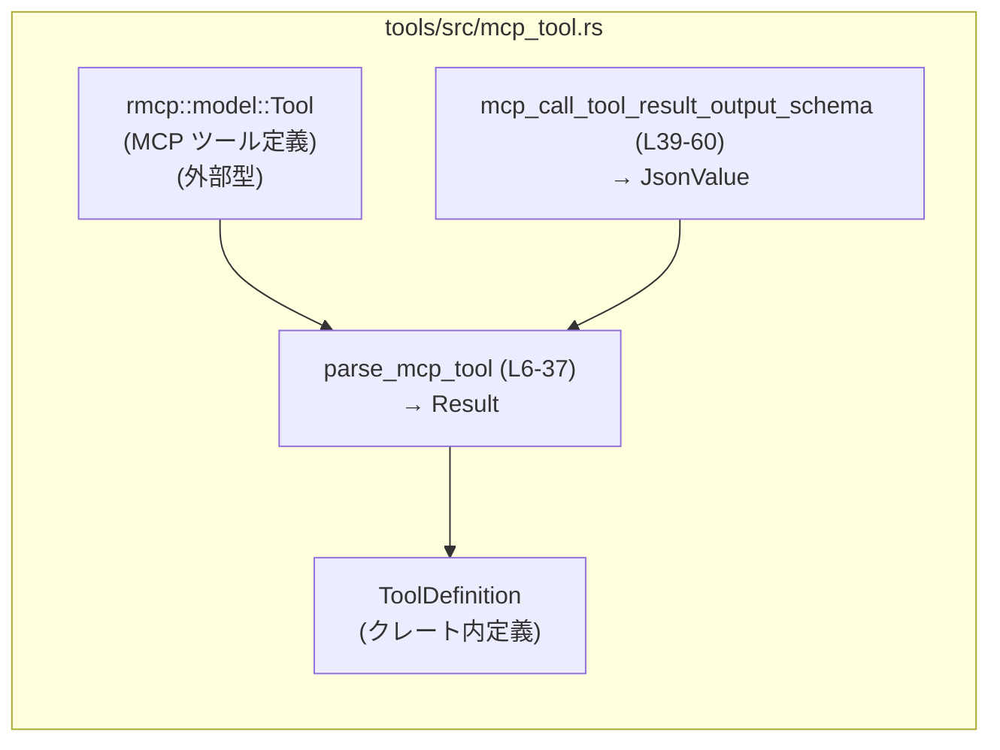
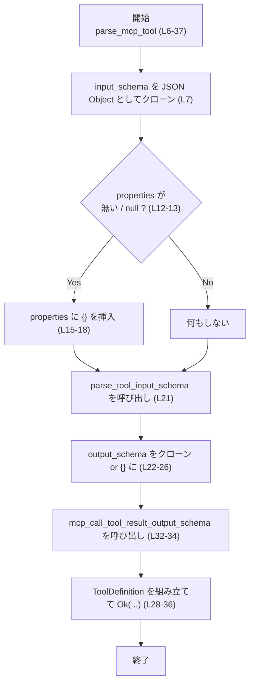
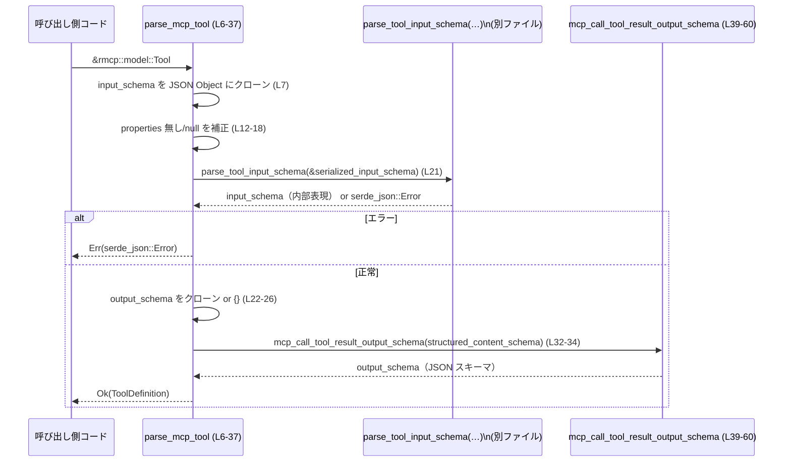

# tools/src/mcp_tool.rs コード解説

## 0. ざっくり一言

- MCP サーバーから取得したツール定義（`rmcp::model::Tool`）を、アプリケーション内部で使う `ToolDefinition` に変換し、出力スキーマをラップするユーティリティです（`tools/src/mcp_tool.rs:L6-37`）。
- 併せて、MCP ツール呼び出しの結果を表す JSON スキーマを構築する関数を提供します（`tools/src/mcp_tool.rs:L39-60`）。

---

## 1. このモジュールの役割

### 1.1 概要

- このモジュールは、**MCP サーバーが返すツール情報**を、内部で利用する統一的な `ToolDefinition` 構造に変換するために存在します（`tools/src/mcp_tool.rs:L6-37`）。
- また、ツール呼び出しのレスポンスをどのような JSON 形式で受け取るかを定義する、**出力スキーマ生成関数**を提供します（`tools/src/mcp_tool.rs:L39-60`）。

### 1.2 アーキテクチャ内での位置づけ

このモジュールは、外部の MCP ツール定義と、アプリケーション内部のツール定義表現の橋渡しをします。



- `parse_mcp_tool` は `rmcp::model::Tool`（外部型）から `ToolDefinition`（クレート内）を生成します。
- `mcp_call_tool_result_output_schema` は、`ToolDefinition.output_schema` に格納される JSON スキーマを構築します。

`ToolDefinition` と `parse_tool_input_schema` の具体的な定義は、このチャンクには現れません（`tools/src/mcp_tool.rs:L1-4` からは参照のみ）。

### 1.3 設計上のポイント

- **純粋関数のみ**  
  - モジュール内には状態を持つ構造体やグローバル変数はなく、すべて純粋関数です（`tools/src/mcp_tool.rs:L6-60`）。
- **JSON スキーマの整形と補正**  
  - MCP サーバーのスキーマから `"properties"` が欠けている／`null` の場合に、空オブジェクトを挿入して OpenAI モデルの仕様に合わせる処理があります（`tools/src/mcp_tool.rs:L9-19`）。
- **明示的なエラー処理**  
  - スキーマのパースエラーは `Result<ToolDefinition, serde_json::Error>` として返し、`?` 演算子で呼び出し元に伝播します（`tools/src/mcp_tool.rs:L21`）。
- **並行性への配慮**  
  - 関数は引数から新しい JSON 値を生成するだけで共有可変状態に触れないため、スレッド間で再利用してもデータ競合は発生しにくい構造になっています。

---

## 2. 主要な機能一覧

- MCP ツール定義のパースと補正: `parse_mcp_tool`
- MCP ツール呼び出し結果の JSON スキーマ生成: `mcp_call_tool_result_output_schema`
- テストモジュールのエクスポート: `mod tests`（中身はこのチャンクには現れません）

### 2.1 コンポーネント一覧（関数・モジュール）

| 名前 | 種別 | 公開 | 定義場所 | 役割 / 用途 |
|------|------|------|----------|-------------|
| `parse_mcp_tool` | 関数 | `pub` | `tools/src/mcp_tool.rs:L6-37` | `rmcp::model::Tool` から `ToolDefinition` を生成し、入力スキーマの補正と出力スキーマのラップを行う |
| `mcp_call_tool_result_output_schema` | 関数 | `pub` | `tools/src/mcp_tool.rs:L39-60` | MCP ツール呼び出し結果の JSON スキーマ（`content` / `structuredContent` / `isError` / `_meta`）を構築する |
| `tests` | モジュール | (テスト時のみ) | `tools/src/mcp_tool.rs:L62-64` | `mcp_tool_tests.rs` にあるテストコードを読み込む。内容はこのチャンクには現れません |

---

## 3. 公開 API と詳細解説

### 3.1 型一覧（構造体・列挙体など）

このファイル内で新たに定義されている構造体・列挙体はありません。

- `ToolDefinition` はクレート内の別ファイルで定義されており、本ファイルではそれを利用するのみです（`tools/src/mcp_tool.rs:L1`）。
- `rmcp::model::Tool` は外部クレート（`rmcp`）から提供される型で、詳細はこのチャンクには現れません（`tools/src/mcp_tool.rs:L6`）。

### 3.2 関数詳細

#### `parse_mcp_tool(tool: &rmcp::model::Tool) -> Result<ToolDefinition, serde_json::Error>`

**概要**

- MCP サーバーから取得した `rmcp::model::Tool` を、内部表現 `ToolDefinition` に変換します（`tools/src/mcp_tool.rs:L6-37`）。
- 入力スキーマに `"properties"` フィールドが無い／`null` の場合、OpenAI モデルの制約に合わせて空オブジェクトを挿入します（`tools/src/mcp_tool.rs:L9-19`）。
- 出力スキーマは `mcp_call_tool_result_output_schema` でラップされた JSON スキーマとして設定します（`tools/src/mcp_tool.rs:L21-35`）。

**引数**

| 引数名 | 型 | 説明 |
|--------|----|------|
| `tool` | `&rmcp::model::Tool` | MCP サーバーから取得したツール定義。`input_schema` と `output_schema` を含む外部型です（詳細はこのチャンクには現れません）。 |

**戻り値**

- `Result<ToolDefinition, serde_json::Error>`  
  - `Ok(ToolDefinition)` : 正常に変換できた場合のツール定義。  
  - `Err(serde_json::Error)` : 入力スキーマのパースに失敗した場合（`parse_tool_input_schema` からのエラー）を返します（`tools/src/mcp_tool.rs:L21`）。

**内部処理の流れ**

1. MCP ツールの `input_schema` をクローンし、`serde_json::Value::Object` として `serialized_input_schema` に格納します（`tools/src/mcp_tool.rs:L7`）。
2. `serialized_input_schema` が JSON オブジェクトで、かつ `"properties"` フィールドが存在しないか `null` の場合、空オブジェクト `{}` を `"properties"` に挿入します（`tools/src/mcp_tool.rs:L12-18`）。
3. `parse_tool_input_schema(&serialized_input_schema)` を呼び出して、内部で利用する入力スキーマ表現（型はこのチャンクには現れません）に変換します（`tools/src/mcp_tool.rs:L21`）。
4. MCP ツールの `output_schema` があればそれをクローンして JSON オブジェクトとして `structured_content_schema` に格納し、なければ空オブジェクト `{}` を設定します（`tools/src/mcp_tool.rs:L22-26`）。
5. `mcp_call_tool_result_output_schema(structured_content_schema)` を呼び出し、ツール呼び出し結果全体の JSON スキーマを生成します（`tools/src/mcp_tool.rs:L32-34`）。
6. `ToolDefinition` を構築し、`name`, `description`, `input_schema`, `output_schema`, `defer_loading` を設定して `Ok(...)` で返します（`tools/src/mcp_tool.rs:L28-36`）。

**簡易フローチャート**



**Examples（使用例）**

`rmcp::model::Tool` の作り方はこのチャンクには現れないため、仮のコードとして使用例を示します。

```rust
use crate::mcp_tool::parse_mcp_tool;                 // このモジュールの関数をインポートする
use rmcp::model::Tool;                               // 外部クレートの型（詳細は別ファイル）

fn convert_tool(tool: &Tool) -> Result<crate::ToolDefinition, serde_json::Error> {
    // MCP ツール定義から内部用の ToolDefinition を生成する
    let internal_def = parse_mcp_tool(tool)?;        // 失敗時は serde_json::Error が返る

    // ここで internal_def を登録・保存などに利用できる
    Ok(internal_def)
}
```

**Errors / Panics**

- **`Err(serde_json::Error)` となる条件**
  - `parse_tool_input_schema(&serialized_input_schema)` がエラーを返した場合（`tools/src/mcp_tool.rs:L21`）。
  - 具体的なエラー条件（どのような JSON が不正か）は `parse_tool_input_schema` の実装に依存しており、このチャンクには現れません。
- **panic の可能性**
  - この関数自体で明示的に `panic!` を呼び出したり、`unwrap` などのパニックを起こしうる関数を使用していません（`?` によるエラー伝播のみ）。  
  - JSON 操作はいずれも `clone` や安全なメソッドを用いています（`tools/src/mcp_tool.rs:L7-26`）。

**Edge cases（エッジケース）**

- `tool.input_schema` が `"properties"` を持たない / `null`  
  - `"properties"` に空オブジェクト `{}` が挿入されます（`tools/src/mcp_tool.rs:L12-18`）。
- `tool.output_schema` が `None`  
  - `structured_content_schema` は空オブジェクト `{}` になり（`tools/src/mcp_tool.rs:L22-26`）、  
    `mcp_call_tool_result_output_schema` を通じて `"structuredContent": {}` というスキーマになります。
- `tool.description` が `None`  
  - `description` は `unwrap_or_default()` により空文字列になります（`tools/src/mcp_tool.rs:L30`）。

**使用上の注意点**

- `tool.input_schema` は JSON オブジェクトであることが前提です（`serde_json::Value::Object` として扱っています：`tools/src/mcp_tool.rs:L7`）。  
  それ以外の形で入ってくるケースは、このチャンクからは想定されていないように見えます。
- この関数は純粋関数であり、副作用（I/O、グローバル状態の変更）はありません。複数スレッドから並行に呼び出しても、関数自身によるデータ競合は発生しない構造です。
- エラー型は `serde_json::Error` に固定されているため、呼び出し側で他のエラー型と統合する場合はラップや変換が必要になる可能性があります。

---

#### `mcp_call_tool_result_output_schema(structured_content_schema: JsonValue) -> JsonValue`

**概要**

- MCP ツール呼び出しの結果を表す JSON スキーマを構築します（`tools/src/mcp_tool.rs:L39-60`）。
- 返されるスキーマは、少なくとも `content` 配列を必須とし、任意の `structuredContent`, `isError`, `_meta` プロパティを許可し、それ以外のプロパティは許可しません。

**引数**

| 引数名 | 型 | 説明 |
|--------|----|------|
| `structured_content_schema` | `serde_json::Value` (`JsonValue`) | `structuredContent` フィールドに対応する JSON スキーマ。外部から渡されます。 |

**戻り値**

- `JsonValue`（`serde_json::Value`）  
  MCP ツール呼び出し結果全体の JSON スキーマ。構造は次のようになります（`tools/src/mcp_tool.rs:L40-58`）:

```json
{
  "type": "object",
  "properties": {
    "content": {
      "type": "array",
      "items": { "type": "object" }
    },
    "structuredContent": /* 引数 structured_content_schema */,
    "isError": { "type": "boolean" },
    "_meta": { "type": "object" }
  },
  "required": ["content"],
  "additionalProperties": false
}
```

**内部処理の流れ**

1. `serde_json::json!` マクロを用いて固定的なオブジェクトスキーマを構築します（`tools/src/mcp_tool.rs:L40-58`）。
2. `structuredContent` プロパティに、引数 `structured_content_schema` をそのまま埋め込みます（`tools/src/mcp_tool.rs:L49`）。
3. 上記オブジェクトを `JsonValue` として返します（`tools/src/mcp_tool.rs:L39-60`）。

**Examples（使用例）**

```rust
use serde_json::json;
use tools::mcp_tool::mcp_call_tool_result_output_schema;    // 関数をインポートする

fn build_schema() {
    // structuredContent のスキーマ例（ここでは単純なオブジェクトと仮定）
    let structured = json!({
        "type": "object",
        "properties": {
            "summary": { "type": "string" }
        },
        "required": ["summary"]
    });

    // MCP ツール呼び出し結果全体のスキーマを生成
    let result_schema = mcp_call_tool_result_output_schema(structured);

    // result_schema を validation や OpenAI へのツール登録などに利用できる
    println!("{}", result_schema);
}
```

**Errors / Panics**

- この関数自体はエラーを返さず、`serde_json::json!` マクロに与える式も型が確定しているため、通常の使用ではエラー / panic は発生しません。
- ただし、`structured_content_schema` に循環参照などの特殊な値が渡された場合の挙動は、このチャンクからは分かりません（一般的な JSON では想定されません）。

**Edge cases（エッジケース）**

- `structured_content_schema` が空オブジェクト `{}`  
  - `"structuredContent": {}` としてスキーマに埋め込まれます（`tools/src/mcp_tool.rs:L49`）。
- `structured_content_schema` が `null`  
  - `"structuredContent": null` としてそのまま入ります。スキーマとして妥当かどうかは呼び出し側の設計に依存します。
- `structured_content_schema` がオブジェクト以外（例: 文字列、配列）  
  - そのままの値が `"structuredContent"` に入るだけで、この関数はチェックを行いません。

**使用上の注意点**

- この関数は `structured_content_schema` の妥当性を検証しません。引数は「すでに JSON スキーマとして正しい形である」という前提で利用されていると考えられます。
- `"required": ["content"]` と `"additionalProperties": false` が固定されているため、呼び出し側で別の必須プロパティや追加プロパティを許可したい場合には、この関数の仕様に合わせて検討する必要があります。

### 3.3 その他の関数

- このファイルには、補助的な非公開関数は存在しません。

---

## 4. データフロー

代表的なシナリオとして、`rmcp::model::Tool` から `ToolDefinition` が生成される流れを示します。



要点:

- 入力スキーマは JSON として一度正規化され、`parse_tool_input_schema` に渡されます。
- 出力スキーマは、元の `tool.output_schema` を `structuredContent` として保持しつつ、`content` / `isError` / `_meta` を含むラッパー構造に変換されます。

---

## 5. 使い方（How to Use）

### 5.1 基本的な使用方法

MCP サーバーから取得したツール定義を内部表現に変換する基本パターンです。

```rust
use rmcp::model::Tool;                         // MCP ツール定義（外部型）
use crate::{ToolDefinition};                   // 内部のツール定義型（別ファイル）
use crate::mcp_tool::parse_mcp_tool;           // 本モジュールの関数

fn register_mcp_tool(tool: &Tool) -> Result<(), serde_json::Error> {
    // MCP ツール定義を内部表現に変換する
    let tool_def: ToolDefinition = parse_mcp_tool(tool)?;   // 失敗時は serde_json::Error が返る

    // ここで tool_def をツールレジストリなどに登録して利用する
    // register_tool(tool_def);

    Ok(())
}
```

### 5.2 よくある使用パターン

1. **`ToolDefinition` の出力スキーマを上書き・拡張する**

```rust
use crate::mcp_tool::parse_mcp_tool;

fn convert_and_adjust(tool: &rmcp::model::Tool) -> Result<crate::ToolDefinition, serde_json::Error> {
    let mut def = parse_mcp_tool(tool)?;           // 基本変換

    // 必要に応じて def.output_schema を別の schema で差し替えるなど
    // def.output_schema = Some(custom_schema);

    Ok(def)
}
```

1. **`mcp_call_tool_result_output_schema` を単独利用する**

```rust
use serde_json::json;
use crate::mcp_tool::mcp_call_tool_result_output_schema;

fn standalone_schema() {
    let structured = json!({ "type": "object" });  // 簡略な structuredContent のスキーマ
    let schema = mcp_call_tool_result_output_schema(structured);

    // schema を OpenAI ツール登録など他用途に利用できる
}
```

### 5.3 よくある間違い

```rust
use crate::mcp_tool::parse_mcp_tool;

// 誤り例: parse_mcp_tool のエラーを無視してしまう
fn bad(tool: &rmcp::model::Tool) {
    let tool_def = parse_mcp_tool(tool).unwrap();  // スキーマ不正時に panic する可能性
}

// 正しい例: Result を適切に処理する
fn good(tool: &rmcp::model::Tool) -> Result<(), serde_json::Error> {
    let tool_def = parse_mcp_tool(tool)?;          // エラーは呼び出し元に伝播
    // tool_def を利用する処理
    Ok(())
}
```

### 5.4 使用上の注意点（まとめ）

- `parse_mcp_tool` は **入力スキーマの構造が不正** な場合に `serde_json::Error` を返す可能性があります。呼び出し側でエラー処理を必ず行う必要があります。
- `mcp_call_tool_result_output_schema` に渡す `structured_content_schema` は、適切な JSON スキーマであることを前提としています。内部で検証は行っていません。
- 並行利用について:
  - 両関数とも引数のクローンと新しい JSON 値の生成のみで、副作用が無いため、マルチスレッド環境で同時に呼び出しても、関数内部でのデータ競合は発生しにくい構造です。

---

## 6. 変更の仕方（How to Modify）

### 6.1 新しい機能を追加する場合

例: MCP ツール定義に追加メタ情報を付与する機能を追加したい場合。

1. **ツール定義の拡張**
   - `ToolDefinition` に新しいフィールド（例: `tags`, `category` など）を追加する（別ファイル）。
2. **変換ロジックの拡張**
   - `parse_mcp_tool` 内で `tool` から必要な情報を読み取り、新しいフィールドを埋めるロジックを追加する（`tools/src/mcp_tool.rs:L28-36` 付近）。
3. **出力スキーマの調整が必要な場合**
   - 追加情報をレスポンスにも含めたい場合は、`mcp_call_tool_result_output_schema` の返す JSON スキーマに新しいプロパティを追加する（`tools/src/mcp_tool.rs:L40-58`）。

### 6.2 既存の機能を変更する場合

- **`properties` 補正の仕様を変更したい場合**
  - `"properties"` が `null` のときだけ補正したい／逆にまったく補正したくないなどの変更は、`if let` 条件部（`tools/src/mcp_tool.rs:L12-13`）のロジックを変更することで実現できます。
  - 変更後は、`parse_tool_input_schema` が期待するスキーマ形式と矛盾しないか確認が必要です。
- **レスポンススキーマの構造を変えたい場合**
  - 例: `"isError"` を必須にしたい場合は、`"required"` 配列に `"isError"` を追加し、必要に応じて `ToolDefinition` や呼び出し側の実装も合わせて変更します（`tools/src/mcp_tool.rs:L57` 付近）。
- 変更時の確認事項:
  - `mcp_tool_tests.rs`（`tools/src/mcp_tool.rs:L62-64`）にあるテストを実行・更新し、期待されるスキーマ構造と一致しているかを確認する必要があります（テスト内容はこのチャンクには現れません）。

---

## 7. 関連ファイル

| パス | 役割 / 関係 |
|------|------------|
| `tools/src/mcp_tool.rs` | 本ファイル。MCP ツール定義から `ToolDefinition` への変換と、結果スキーマ構築を行う。 |
| `tools/src/mcp_tool_tests.rs` | `mod tests;` で参照されるテストコード（`tools/src/mcp_tool.rs:L62-64`）。内容はこのチャンクには現れません。 |
| `crate::ToolDefinition` 定義ファイル | `ToolDefinition` 構造体の定義場所。`parse_mcp_tool` の返り値として利用されます（`tools/src/mcp_tool.rs:L1`）。 |
| `crate::parse_tool_input_schema` 定義ファイル | 入力スキーマ JSON を内部表現に変換する関数の定義場所（`tools/src/mcp_tool.rs:L2`）。 |
| `rmcp` クレート | `rmcp::model::Tool` 型を提供する外部クレート（`tools/src/mcp_tool.rs:L6`）。 |

---

### Bugs / Security / Observability（補足）

- **潜在的なバグ要因**
  - `structured_content_schema` にどのような値でも受け入れるため、意図しない型（文字列など）が入っても検出されません。これは設計かもしれませんが、バリデーションが必要な場合は呼び出し側で対応する必要があります。
- **セキュリティ観点**
  - 本モジュールは JSON スキーマの変換のみを行っており、外部入力を直接実行したりファイル・ネットワーク I/O を行っていません。このチャンクからは、明確なセキュリティ上の危険な処理は読み取れません。
- **観測性**
  - ログ出力やメトリクス収集は行っていません（`tools/src/mcp_tool.rs:L1-64`）。スキーマ変換エラーの詳細は `serde_json::Error` に含まれますが、どこにも自動で記録されません。必要に応じて呼び出し側でログ出力を行う設計になります。
