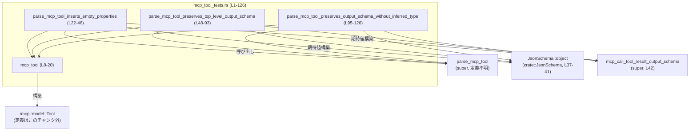
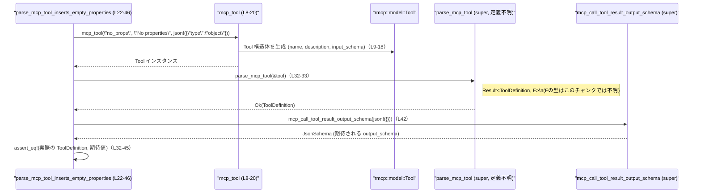

# tools\src\mcp_tool_tests.rs

## 0. ざっくり一言

`parse_mcp_tool` と `mcp_call_tool_result_output_schema` の挙動を検証するためのテストモジュールで、`rmcp::model::Tool` から `ToolDefinition` への変換におけるスキーマ処理（特に input/output schema 周り）を確認しています（tools\src\mcp_tool_tests.rs:L1-126）。

---

## 1. このモジュールの役割

### 1.1 概要

- このモジュールは、MCP ツール定義（`rmcp::model::Tool`）を内部表現（`ToolDefinition`）に変換する関数 `parse_mcp_tool` のテストを提供します（L22-46, 48-93, 95-126）。
- 特に次の点を検証しています。
  - 入力スキーマが `{"type": "object"}` のみの場合に、空の `properties` などが補完されること（L22-46）。
  - `Tool` が持つ `output_schema` の JSON スキーマが、トップレベルのオブジェクト／列挙として正しく保持されること（L48-93, 95-126）。
  - `ToolDefinition` の各フィールド（`name`, `description`, `input_schema`, `output_schema`, `defer_loading`）が期待どおりに構築されること（L34-44, 72-91, 112-124）。

### 1.2 アーキテクチャ内での位置づけ

このファイルはテスト専用モジュールであり、親モジュール（`super`）に定義された関数・型に依存しています。

- 依存先（定義はこのチャンク外）
  - `super::parse_mcp_tool`（L2, 32, 71, 111）
  - `super::mcp_call_tool_result_output_schema`（L1, 42, 80, 120）
  - `crate::JsonSchema`（L3, 37, 75, 115）
  - `crate::ToolDefinition`（L4, 34, 72, 112）
  - `rmcp::model::Tool` および `rmcp::model::object`（L8, 13, 57-58, 104-105）



### 1.3 設計上のポイント

- テストヘルパー関数 `mcp_tool` を定義し、`rmcp::model::Tool` の生成を一箇所にまとめています（L8-20）。
- `rmcp::model::Tool` の `input_schema`／`output_schema` は `Arc` でラップされた `rmcp::model::object(...)` により構築されています（L13, 57-58, 104-105）。
  - `Arc` はスレッドセーフな参照カウント型であり、共有所有権を表しますが、このチャンクからは実際に並行に共有されているかどうかは分かりません。
- エラーハンドリングはテスト内で `parse_mcp_tool(&tool).expect("parse MCP tool")` という形で行われており、`Result` が `Err` の場合は panic する前提でテスト失敗を検出します（L32, 71, 111）。
- `pretty_assertions::assert_eq` を用いて、期待値と実際の `ToolDefinition` の差分を視覚的に比較可能にしています（L5, 32-45, 70-92, 110-125）。

---

## 2. 主要な機能一覧（コンポーネントインベントリー）

このファイルで「定義されている」コンポーネントはすべてテスト用です。

| 名前 | 種別 | 役割 / 機能 | 定義位置 |
|------|------|-------------|----------|
| `mcp_tool` | 関数 | 指定された `name` / `description` / `input_schema` から `rmcp::model::Tool` を組み立てるテスト用ヘルパー | tools\src\mcp_tool_tests.rs:L8-20 |
| `parse_mcp_tool_inserts_empty_properties` | テスト関数 | input schema が単に `{"type": "object"}` の場合に、`JsonSchema::object` の `properties` が空マップとして補完されることを検証する | tools\src\mcp_tool_tests.rs:L22-46 |
| `parse_mcp_tool_preserves_top_level_output_schema` | テスト関数 | `Tool.output_schema` がプロパティを持つオブジェクトである場合に、その構造が変換後も保持されることを検証する | tools\src\mcp_tool_tests.rs:L48-93 |
| `parse_mcp_tool_preserves_output_schema_without_inferred_type` | テスト関数 | `Tool.output_schema` が `{"enum": [...]}` のような列挙だけを持つ場合にも、その列挙が保持されることを検証する | tools\src\mcp_tool_tests.rs:L95-126 |

---

## 3. 公開 API と詳細解説

### 3.1 型一覧

このファイル内で新しく型定義は行っていませんが、テストで利用されている外部型は以下のとおりです。

| 名前 | 種別 | 役割 / 用途 | 根拠 |
|------|------|-------------|------|
| `rmcp::model::Tool` | 構造体（と推定） | テスト内のヘルパー関数が構造体リテラルで初期化している。MCP ツール定義を表す型として利用されている（`name`, `title`, `description`, `input_schema`, `output_schema`, `annotations`, `execution`, `icons`, `meta` フィールドを持つ） | 構造体リテラルによる初期化（L9-18） |
| `crate::JsonSchema` | 列挙体または構造体（詳細不明） | `JsonSchema::object(...)` という関連関数／バリアントコンストラクタを通じて、入力スキーマの内部表現として使用されている | 呼び出し箇所（L3, 37-41, 75-79, 115-119） |
| `crate::ToolDefinition` | 構造体 | `parse_mcp_tool` の期待される戻り値として使用される。フィールド `name`, `description`, `input_schema`, `output_schema`, `defer_loading` を持つ | 構造体リテラル使用箇所（L34-44, 72-91, 112-124） |
| `serde_json::Value` | 列挙体（標準ライブラリクレート） | `mcp_tool` の `input_schema` 引数として JSON スキーマ表現に利用される | 関数シグネチャ（L8） |
| `std::sync::Arc<T>` | スマートポインタ | `rmcp::model::Tool` の `input_schema` / `output_schema` を所有するための共有ポインタとして利用されている | 初期化箇所（L13, 57, 104） |

> `parse_mcp_tool` や `mcp_call_tool_result_output_schema` 自体の型・実装はこのチャンクには現れないため、詳細は不明です（L1-2, 32, 42, 71, 80, 111, 120）。

---

### 3.2 関数詳細

#### `mcp_tool(name: &str, description: &str, input_schema: serde_json::Value) -> rmcp::model::Tool`

**定義位置**

- tools\src\mcp_tool_tests.rs:L8-20

**概要**

- 渡された `name`・`description`・`input_schema` を用いて、`rmcp::model::Tool` インスタンスを生成するテスト用ヘルパーです（L8-19）。

**引数**

| 引数名 | 型 | 説明 | 根拠 |
|--------|----|------|------|
| `name` | `&str` | ツール名。`Tool.name` に格納されます | フィールド `name: name.to_string().into()`（L10） |
| `description` | `&str` | ツールの説明。`Tool.description` に `Some` で格納されます | フィールド `description: Some(description.to_string().into())`（L12） |
| `input_schema` | `serde_json::Value` | 入力 JSON スキーマ。`rmcp::model::object` を通して `Tool.input_schema` に設定されます | フィールド `input_schema: Arc::new(rmcp::model::object(input_schema))`（L13） |

**戻り値**

- `rmcp::model::Tool`  
  渡された値を元に、`name`・`description`・`input_schema` が設定された `Tool` インスタンスを返します。その他のフィールド（`title`, `output_schema`, `annotations`, `execution`, `icons`, `meta`）は `None` に設定されています（L11, 14-18）。

**内部処理の流れ**

- `name` と `description` を `String` に変換し、さらに `.into()` で `Tool` が要求する型に変換します（L10, L12）。
- `input_schema` を `rmcp::model::object` でラップし、その結果を `Arc` で包んで `Tool.input_schema` に設定します（L13）。
- その他のフィールドはすべて `None` として初期化し、`rmcp::model::Tool` 構造体リテラルとして返します（L11, 14-18）。

**Examples（使用例）**

テスト内での使用例（`parse_mcp_tool_inserts_empty_properties` 内）です（L24-30）。

```rust
// テスト用の rmcp::model::Tool を構築する
let tool = mcp_tool(
    "no_props",                         // name
    "No properties",                    // description
    serde_json::json!({                // input_schema
        "type": "object"
    }),
);
```

**Errors / Panics**

- `mcp_tool` 自身には明示的なエラーハンドリングや panic 呼び出しはありません（L8-20）。
- ただし内部で呼ばれている `rmcp::model::object(input_schema)` がどのような入力でエラーや panic を起こすかは、このチャンクからは分かりません（L13）。

**Edge cases（エッジケース）**

- `name` や `description` が空文字でも、そのまま `String` に変換されて格納されます（コード上で特別扱いはされていません）（L10, L12）。
- `input_schema` の内容（型・構造）がどうであっても、そのまま `rmcp::model::object` に渡されます（L13）。その結果が妥当かどうかは `rmcp::model::object` の仕様に依存し、このチャンクからは分かりません。

**使用上の注意点**

- このファイルでは `mcp_tool` はテスト用にのみ使用されており、本番コードからの利用は想定されていません（全使用箇所が `#[test]` 関数内、L24, 50, 97）。
- 並行性に関しては、`Arc` でラップしているためスレッド間共有が可能な設計であると考えられますが、この関数内で並行に使用している箇所はありません（L13）。

---

#### `parse_mcp_tool_inserts_empty_properties()`

**定義位置**

- tools\src\mcp_tool_tests.rs:L22-46

**概要**

- `input_schema` が `{"type": "object"}` のみを持つ場合に、`parse_mcp_tool` が `JsonSchema::object` の `properties` を空の `BTreeMap` として補完することを検証するテストです（L24-30, 37-41）。

**引数 / 戻り値**

- テスト関数であり、引数・戻り値はありません（標準的な `#[test]` 関数、L22-23）。

**内部処理の流れ**

- `mcp_tool` を用いて、`input_schema` が `{"type": "object"}` の `Tool` を生成します（L24-30）。
- `parse_mcp_tool(&tool)` を呼び出し、`expect("parse MCP tool")` で `Result` が `Ok` であることを前提とした変換を実行します（L32-33）。
- 期待値として、以下のフィールドを持つ `ToolDefinition` を構築します（L34-44）。
  - `name`: `"no_props"`
  - `description`: `"No properties"`
  - `input_schema`: `JsonSchema::object(BTreeMap::new(), None, None)`
  - `output_schema`: `Some(mcp_call_tool_result_output_schema(json!({})))`
  - `defer_loading`: `false`
- `pretty_assertions::assert_eq!` で、実際の変換結果と期待値が等しいことを検証します（L32-45）。

**Examples（使用例）**

`parse_mcp_tool` の最小限の使用例として参考になります（L24-33）。

```rust
let tool = mcp_tool(
    "no_props",
    "No properties",
    serde_json::json!({ "type": "object" }),
);

// parse_mcp_tool は Result を返す（型はこのチャンクからは不明）
let def = parse_mcp_tool(&tool).expect("parse MCP tool"); // Err の場合は panic

// def を期待される ToolDefinition と比較する
```

**Errors / Panics**

- `parse_mcp_tool` が `Err` を返した場合、`expect("parse MCP tool")` によりテストは panic します（L32-33）。
  - これはテストにおいて変換が成功する前提を明示するためのものです。
- `parse_mcp_tool` がどのような条件で `Err` を返すかは、このチャンクには現れません。

**Edge cases（エッジケース）**

このテストがカバーする契約は次のとおりです。

- **入力スキーマがプロパティ未定義のオブジェクト型の場合**  
  - 入力: `{"type": "object"}`（L27-29）
  - 期待される内部表現:  
    `JsonSchema::object(BTreeMap::new(), None, None)`（L37-41）  
    → `properties` が空の `BTreeMap` として補完され、`required`・`additional_properties` は `None` のままであること。
- **出力スキーマが未設定の場合**  
  - `Tool.output_schema` は `None`（`mcp_tool` のデフォルト、L14）。  
  - それにもかかわらず、`ToolDefinition.output_schema` は  
    `Some(mcp_call_tool_result_output_schema(json!({})))` となる（L42）。  
    → `parse_mcp_tool` または `mcp_call_tool_result_output_schema` が、デフォルトの出力スキーマを補完していると解釈できますが、どちらが行っているかはこのチャンクからは断定できません。

**使用上の注意点**

- テストとしては、`parse_mcp_tool` が「空プロパティを明示的に挿入する」契約を持っていることを前提にしています（L37-41）。
- 本番コードで `parse_mcp_tool` を使用する場合、同様に入力スキーマがオブジェクトであれば `properties` が空でも正しく扱われることが期待されますが、詳細な仕様はこのチャンクからは分かりません。

---

#### `parse_mcp_tool_preserves_top_level_output_schema()`

**定義位置**

- tools\src\mcp_tool_tests.rs:L48-93

**概要**

- `Tool.output_schema` にトップレベルのオブジェクト型スキーマが設定されている場合、その `properties` と `required` が変換後も保持されることを検証するテストです（L50-68, 80-89）。

**内部処理の流れ**

- `mcp_tool` で `input_schema: {"type": "object"}` の `Tool` を生成します（L50-56）。
- 生成した `Tool` の `output_schema` に、以下の JSON スキーマを持つ `rmcp::model::object` を設定します（L57-68）。
  - `properties.result.properties.nested = {}`
  - `required = ["result"]`
- `parse_mcp_tool(&tool).expect("parse MCP tool")` で変換を行います（L70-71）。
- 期待値として、`ToolDefinition` を構築します（L72-91）。
  - `input_schema` は空プロパティオブジェクト（前テストと同様、L75-79）。
  - `output_schema` は  
    `Some(mcp_call_tool_result_output_schema(json!({ ... }))` で、上記と同じ `properties` / `required` を保持している JSON を渡しています（L80-89）。
- `assert_eq!` で実際と期待値を比較します（L70-92）。

**Errors / Panics**

- `parse_mcp_tool` が `Err` の場合、`expect` により panic（L70-71）。
- `mcp_call_tool_result_output_schema` がどのような入力で失敗するかは不明です（L80）。

**Edge cases（エッジケース）**

このテストが前提としている契約は次のとおりです。

- **出力スキーマを持つ場合の保持**  
  - `Tool.output_schema` に含まれる `properties`／`required` の情報が、`ToolDefinition.output_schema` 側で失われないこと（L57-68 と L80-89 の JSON 構造が一致）。
- **ネストしたプロパティ**  
  - `result.properties.nested` のようなネストした構造も保持されること（L59-63, 82-85）。

**使用上の注意点**

- このテストは「schema が変換プロセスを通じて構造的に変わらない」ことを前提にしています。  
  もし将来 `parse_mcp_tool` や `mcp_call_tool_result_output_schema` がスキーマを書き換える仕様に変更される場合、このテストは更新が必要になります。

---

#### `parse_mcp_tool_preserves_output_schema_without_inferred_type()`

**定義位置**

- tools\src\mcp_tool_tests.rs:L95-126

**概要**

- `Tool.output_schema` が `{"enum": ["ok", "error"]}` のように `type` 指定を持たない列挙スキーマであっても、その `enum` が保持されることを検証するテストです（L97-108, 120-122）。

**内部処理の流れ**

- `mcp_tool` で `input_schema: {"type": "object"}` の `Tool` を生成します（L97-103）。
- `Tool.output_schema` に、`{"enum": ["ok", "error"]}` をラップした `rmcp::model::object` を設定します（L104-108）。
- `parse_mcp_tool(&tool).expect("parse MCP tool")` を実行して変換します（L110-111）。
- 期待値の `ToolDefinition` を構築し、`output_schema` に  
  `Some(mcp_call_tool_result_output_schema(json!({"enum": ["ok", "error"]})))` を設定します（L112-123）。
- `assert_eq!` により、実際の変換結果と期待値を比較します（L110-125）。

**Errors / Panics**

- `parse_mcp_tool` が `Err` を返した場合、`expect` により panic します（L110-111）。
- 列挙スキーマを `rmcp::model::object` に渡したときの制約やエラー条件は、このチャンクからは分かりません（L104-108）。

**Edge cases（エッジケース）**

- **`type` を持たない列挙スキーマ**  
  - 入力: `{"enum": ["ok", "error"]}`（L105-107）  
  - 出力: 同じ JSON を `mcp_call_tool_result_output_schema` に渡した結果が `ToolDefinition.output_schema` に入ること（L120-122）。
- つまり、このテストは「`parse_mcp_tool` が `enum` だけのスキーマに対して、自動的に `type` などを補完・変更しない」ことを前提にしています。

**使用上の注意点**

- 将来的に `parse_mcp_tool` が「型推論」により `enum` スキーマに `type` を付与するような仕様に変わる場合、このテストは意図的に失敗するようになります。  
  その際は、仕様変更に合わせて期待値を更新する必要があります。

---

### 3.3 その他の関数

- このファイルには、上記 4 つ以外の関数定義はありません。

---

## 4. データフロー

`parse_mcp_tool_inserts_empty_properties` を例に、テスト内のデータフローを示します。

### 4.1 処理の要点

- テスト関数が `mcp_tool` を呼び、`rmcp::model::Tool` インスタンスを構築します（L24-30）。
- その `Tool` が `parse_mcp_tool` に渡され、`ToolDefinition` に変換されます（L32-33）。
- 期待値は `JsonSchema::object` および `mcp_call_tool_result_output_schema` を使って構築されます（L37-42）。
- 最後に `assert_eq!` で、変換結果と期待値が等しいか確認します（L32-45）。

### 4.2 シーケンス図



---

## 5. 使い方（How to Use）

### 5.1 基本的な使用方法

このファイルはテスト専用ですが、`parse_mcp_tool` の典型的な呼び出しパターンを示しています。

```rust
// 1. rmcp::model::Tool を組み立てる（ヘルパー関数を利用）
let tool = mcp_tool(
    "example",
    "Example tool",
    serde_json::json!({ "type": "object" }),
);

// 2. parse_mcp_tool で内部表現 ToolDefinition に変換する
let def = parse_mcp_tool(&tool).expect("parse MCP tool");

// 3. ToolDefinition の内容を検査する（テストでは assert_eq! を利用）
assert_eq!(def.name, "example".to_string());
```

- エラー処理は `expect` に任せており、`Result` が `Err` の場合は panic となります（L32, 71, 111）。  
  本番コードでは `match` や `?` 演算子などで明示的に処理することが一般的です。

### 5.2 よくある使用パターン

このファイルが示すパターンは二つです。

1. **入力スキーマだけを指定して変換するパターン**（L24-30, 32-45）
   - `Tool.output_schema` を設定せず、`parse_mcp_tool` に渡す。
   - 出力スキーマは `mcp_call_tool_result_output_schema` が生成するデフォルトを期待する。

2. **あらかじめ出力スキーマを設定してから変換するパターン**（L50-68, 70-92, 97-108, 110-125）
   - `Tool.output_schema` に JSON スキーマ（オブジェクト／enum）を設定してから `parse_mcp_tool` を呼ぶ。
   - 変換後の `ToolDefinition.output_schema` で、その構造（properties, required, enum）が保持されることを確認する。

### 5.3 よくある間違い

- このチャンク単体から、「よくある誤用」と言える具体的なパターンは読み取れません。
- 一般論としては、テスト以外のコードで `Result` に対して無条件に `expect` を呼ぶと、エラー時にアプリケーション全体が panic する可能性がありますが、そのような使用例はこのファイルにはありません（`expect` はテスト内のみで使用、L32, 71, 111）。

### 5.4 使用上の注意点（まとめ）

- `parse_mcp_tool` は `Result` を返す関数であり、テストでは `expect` 経由で panic に変換しています（L32, 71, 111）。  
  非テストコードでは、エラーを適切に処理する必要があります。
- `rmcp::model::Tool` の `input_schema`／`output_schema` は `Arc` でラップされており、共有所有権が前提の設計ですが、このファイルでは単一スレッドのテストでのみ使用されています（L13, 57, 104）。
- スキーマ JSON は `serde_json::json!` マクロで構築されており、そのまま `rmcp::model::object` および `mcp_call_tool_result_output_schema` に渡されています（L27-29, 53-55, 100-102, 58-67, 105-107, 80-89, 120-122）。

---

## 6. 変更の仕方（How to Modify）

### 6.1 新しい機能を追加する場合（新しいテストケース）

`parse_mcp_tool` に新しい仕様やケースを追加したい場合、このモジュールにテストを追加するのが自然です。

1. **新しい #[test] 関数を追加**
   - 例: `#[test] fn parse_mcp_tool_handles_xxx()` のような名前で関数を追加します（既存テストと同じスタイル、L22, 48, 95 を参照）。

2. **`mcp_tool` を使って入力 `Tool` を構築**
   - 共通の初期値は `mcp_tool` で用意されているため、重複を避けられます（L24-30, 50-56, 97-103）。

3. **必要であれば `output_schema` を上書き**
   - 既存テストのように、`tool.output_schema = Some(Arc::new(rmcp::model::object(json!(...))))` という形で設定します（L57-68, 104-108）。

4. **`parse_mcp_tool` を呼び出して期待値と比較**
   - `parse_mcp_tool(&tool).expect("parse MCP tool")` で変換し（L32, 71, 111）、期待される `ToolDefinition` を構築して `assert_eq!` します（L34-45, 72-92, 112-125）。

### 6.2 既存の機能を変更する場合

`parse_mcp_tool` や関連スキーマの仕様変更に伴い、このテストファイルを修正する場合の注意点です。

- **影響範囲の確認**
  - `ToolDefinition` のフィールド構造が変わった場合、全テストの期待値（構造体リテラル部分）を確認する必要があります（L34-44, 72-91, 112-124）。
  - `mcp_call_tool_result_output_schema` の戻り値の形が変わると、`output_schema` の期待値 JSON を更新する必要があります（L42, 80-89, 120-122）。

- **契約の確認**
  - 「input schema がオブジェクト型なら空 `properties` を補完する」契約を変更する場合、`parse_mcp_tool_inserts_empty_properties` の期待値（`BTreeMap::new()` 部分）を見直す必要があります（L37-41）。
  - 「output schema の構造を保持する」契約を変更する場合、2 つの output schema 関連テスト（L48-93, 95-126）の JSON 構造と整合性をとる必要があります。

- **テストの更新**
  - 仕様変更により意図的に挙動が変わる場合、テストが失敗するのは自然な挙動です。その場合は、期待値を新しい仕様に合わせて更新します。

---

## 7. 関連ファイル

このモジュールと密接に関連するファイル・モジュールは、インポートや使用から次のように読み取れます。

| パス / モジュール | 役割 / 関係 | 根拠 |
|------------------|------------|------|
| `super`（親モジュール、具体的ファイルパスは不明） | `parse_mcp_tool` および `mcp_call_tool_result_output_schema` の定義を提供するモジュール。このテストの対象となるコアロジックが含まれていると考えられます | `use super::parse_mcp_tool;`、`use super::mcp_call_tool_result_output_schema;`（L1-2） |
| `crate`（具体的モジュールパスは不明） | `JsonSchema` と `ToolDefinition` 型を提供するモジュール。`parse_mcp_tool` の変換結果として期待される内部表現を定義していると考えられます | `use crate::JsonSchema;`、`use crate::ToolDefinition;`（L3-4） |
| 外部クレート `rmcp`（ファイルパス不明） | `rmcp::model::Tool` および `rmcp::model::object` を提供する外部クレート。MCP ツール定義の元となるデータモデルを表していると考えられます | 型および関数の使用箇所（L8-19, 57-58, 104-105） |
| クレート `serde_json` | JSON 値や `json!` マクロを提供。スキーマ定義を JSON として構築するために利用されています | `serde_json::Value` 型（L8）、`serde_json::json!` マクロ（L27-29, 53-55, 100-102, 58-67, 105-107, 80-89, 120-122） |
| クレート `pretty_assertions` | `assert_eq` の拡張版を提供し、テスト失敗時の差分を分かりやすく表示します | `use pretty_assertions::assert_eq;`（L5） |

> これら関連モジュールの具体的なファイルパスや実装内容は、このチャンクには現れないため「不明」としています。
