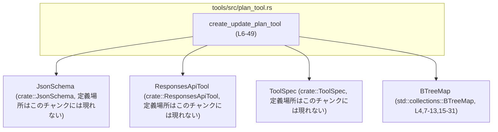
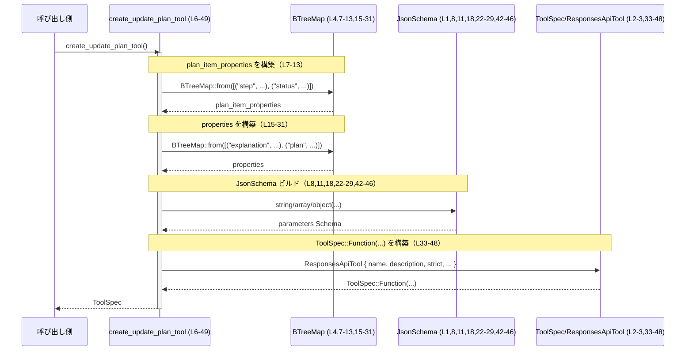

# tools/src/plan_tool.rs コード解説

## 0. ざっくり一言

`update_plan` というツールのパラメータ仕様（JSON Schema 相当）を組み立てて返すための `ToolSpec` を生成するヘルパ関数だけを定義したモジュールです（`plan_tool.rs:L6-49`）。

---

## 1. このモジュールの役割

### 1.1 概要

- このモジュールは、タスクの「計画（plan）」を更新するためのツール `update_plan` の **仕様情報 (`ToolSpec`) を構築する** 役割を持ちます（`plan_tool.rs:L33-48`）。
- 具体的には、`explanation` と `plan` という 2 つのパラメータから構成される JSON 風のスキーマを `JsonSchema` 型で定義し、それを `ToolSpec::Function(ResponsesApiTool { ... })` として返します（`plan_tool.rs:L7-8,L15-31,L33-48`）。

### 1.2 アーキテクチャ内での位置づけ

このモジュール自体は 1 つの公開関数だけを持ち、以下の 3 つの型に依存しています（`plan_tool.rs:L1-3`）。

- `JsonSchema`（`crate::JsonSchema`）
- `ResponsesApiTool`（`crate::ResponsesApiTool`）
- `ToolSpec`（`crate::ToolSpec`）

依存関係を簡略化して図示すると次のようになります。



この図は、**本チャンク（`plan_tool.rs:L1-49`）に現れる範囲** だけを示しています。  
`JsonSchema` や `ToolSpec` の具体的な定義場所・中身は、このチャンクには現れません。

### 1.3 設計上のポイント

コードから読み取れる設計上の特徴は次の通りです。

- **関数 1 つのみ・ステートレス**
  - `pub fn create_update_plan_tool() -> ToolSpec` だけを公開し、モジュール内に状態は保持していません（`plan_tool.rs:L6`）。
  - 関数内で `BTreeMap` や `JsonSchema` インスタンスを新規生成して返すだけで、副作用を持ちません（`plan_tool.rs:L7-13,L15-31,L33-48`）。

- **JSON Schema 風の仕様定義**
  - パラメータは `JsonSchema::object` や `JsonSchema::array` などのヘルパを使って宣言的に定義されています（`plan_tool.rs:L8,L11,L18,L22-29,L42-46`）。
  - `plan` 配列要素は `step` と `status` を必須プロパティとするオブジェクトとして定義されています（`plan_tool.rs:L24-27`）。

- **追加プロパティの扱い**
  - `JsonSchema::object` の第 3 引数に `Some(false.into())` を渡しています（`plan_tool.rs:L26-27`）。
    - 命名と一般的な JSON Schema の慣例から、「追加プロパティを禁止する設定」である可能性が高いですが、このチャンクだけでは意味を断定できません。

- **ビジネスルールは説明文にのみ記述**
  - 「At most one step can be in_progress at a time.」という制約は description 文字列に書かれているだけで、スキーマレベルでは強制されていません（`plan_tool.rs:L35-38`）。
  - このルールの実際の検証は、呼び出し側や別コンポーネントに委ねられていると解釈できますが、コードからは詳細は分かりません。

---

## 2. 主要な機能一覧

このファイルで提供される機能は 1 つです。

- `create_update_plan_tool`: `update_plan` ツールの `ToolSpec` を生成する（`plan_tool.rs:L6-49`）

### 関数・型インベントリ（本チャンク）

**関数**

| 名前 | 種別 | 公開性 | 定義位置 | 概要 |
|------|------|--------|----------|------|
| `create_update_plan_tool` | 関数 | `pub` | `plan_tool.rs:L6-49` | `update_plan` ツールのパラメータスキーマを組み立てて `ToolSpec` として返す |

**このファイル内で新規に定義される型**

- 構造体・列挙体・型エイリアスなどは **定義されていません**（`plan_tool.rs:L1-49`）。

**このファイルが利用する外部の主な型**

| 名前 | 種別 | 定義位置（推定） | このチャンクでの役割 | 根拠 |
|------|------|------------------|----------------------|------|
| `JsonSchema` | 型（詳細不明） | `crate::JsonSchema`（定義はこのチャンクには現れない） | パラメータ仕様を定義するためのスキーマビルダ | `use crate::JsonSchema;`（`plan_tool.rs:L1`）および `JsonSchema::string/array/object` 呼び出し（`plan_tool.rs:L8,L11,L18,L22-29,L42-46`） |
| `ResponsesApiTool` | 型（おそらく構造体） | `crate::ResponsesApiTool`（定義不明） | `ToolSpec::Function` の中身としてツールのメタ情報を保持 | `use crate::ResponsesApiTool;`（`plan_tool.rs:L2`）、`ResponsesApiTool { ... }`（`plan_tool.rs:L33-48`） |
| `ToolSpec` | 型（おそらく enum） | `crate::ToolSpec`（定義不明） | ツール仕様全体を表すコンテナ | `use crate::ToolSpec;`（`plan_tool.rs:L3`）、`ToolSpec::Function(...)`（`plan_tool.rs:L33-48`） |

---

## 3. 公開 API と詳細解説

### 3.1 型一覧（構造体・列挙体など）

このファイル内に **新しく定義されている公開型はありません**（`plan_tool.rs:L1-49`）。

利用している外部型については、上記インベントリの通り `JsonSchema`・`ResponsesApiTool`・`ToolSpec` がありますが、その定義は他ファイルにあります（このチャンクには現れません）。

### 3.2 関数詳細

#### `create_update_plan_tool() -> ToolSpec`

**概要**

- `update_plan` という名前のツールの `ToolSpec` を生成して返します（`plan_tool.rs:L33-35`）。
- ツールは、任意の `explanation`（説明文）と、`plan` という配列パラメータを取り、`plan` の各要素は `step` と `status` を持つ必要がある、という仕様になっています（`plan_tool.rs:L7-13,L15-31,L35-37`）。

**引数**

- 引数はありません（`plan_tool.rs:L6`）。

| 引数名 | 型 | 説明 |
|--------|----|------|
| なし | - | 常に同じ `ToolSpec` を返す定義関数です |

**戻り値**

- 型: `ToolSpec`（`crate::ToolSpec`）（`plan_tool.rs:L6,L33`）
- 内容:
  - `ToolSpec::Function(ResponsesApiTool { ... })` という形で、`update_plan` ツールの仕様が格納されています（`plan_tool.rs:L33-48`）。
  - `parameters` フィールドには、以下のような `JsonSchema::object` が設定されています（`plan_tool.rs:L42-46`）。
    - プロパティ:
      - `explanation`: 文字列（任意）（`plan_tool.rs:L16-19`）
      - `plan`: オブジェクト配列（必須）（`plan_tool.rs:L20-31,L43-44`）

**内部処理の流れ（アルゴリズム）**

おおまかな処理手順は次の通りです。

1. **plan の要素オブジェクトのプロパティ定義を作成**
   - `plan_item_properties` という `BTreeMap<String, JsonSchema>` を生成し、以下の 2 つの項目を定義します（`plan_tool.rs:L7-13`）。
     - `"step"`: `JsonSchema::string(None)` — 説明無しの文字列（`plan_tool.rs:L7-8`）
     - `"status"`: `JsonSchema::string(Some("One of: pending, in_progress, completed"))` — 許可される状態を説明に記述した文字列（`plan_tool.rs:L9-12`）

2. **ルートパラメータオブジェクトのプロパティ定義を作成**
   - `properties` という `BTreeMap<String, JsonSchema>` を生成し、次を登録します（`plan_tool.rs:L15-31`）。
     - `"explanation"`: `JsonSchema::string(None)` — 任意の説明テキスト（`plan_tool.rs:L16-19`）
     - `"plan"`:
       - `JsonSchema::array(...)` により、「`plan_item_properties` に基づくオブジェクトの配列」として定義（`plan_tool.rs:L21-29`）。
       - 要素オブジェクトは `JsonSchema::object(plan_item_properties, Some(vec!["step", "status"]), Some(false.into()))` で定義（`plan_tool.rs:L22-27`）。
         - `required = ["step", "status"]`（`plan_tool.rs:L24-25`）
         - 第 3 引数 `Some(false.into())` の意味は、このチャンクだけでは不明です（`plan_tool.rs:L26-27`）。
       - 配列全体には `"The list of steps"` という説明が付与されます（`plan_tool.rs:L28-29`）。

3. **ResponsesApiTool を構築して ToolSpec::Function に包む**
   - `ToolSpec::Function(ResponsesApiTool { ... })` を生成し、その中身を次のように設定します（`plan_tool.rs:L33-48`）。
     - `name`: `"update_plan"`（`plan_tool.rs:L34`）
     - `description`: 複数行の文字列（`plan_tool.rs:L35-38`）
       - 「Updates the task plan.」
       - 「Provide an optional explanation and a list of plan items, each with a step and status.」
       - 「At most one step can be in_progress at a time.」
     - `strict`: `false`（`plan_tool.rs:L40`） — 意味は `ToolSpec`/`ResponsesApiTool` 側の仕様に依存し、このチャンクからは分かりません。
     - `defer_loading`: `None`（`plan_tool.rs:L41`）
     - `parameters`: 上で構築した `JsonSchema::object(properties, Some(vec!["plan"]), Some(false.into()))`（`plan_tool.rs:L42-46`）
       - ここで `"plan"` が必須プロパティとして指定されています（`plan_tool.rs:L43-44`）。
     - `output_schema`: `None`（`plan_tool.rs:L47`）

**Examples（使用例）**

> 注意: 以下のモジュールパスや利用側 API は、コード全体が見えていないため **仮定** を含みます。  
> 実際のパス・関数名はプロジェクトの他ファイルを確認する必要があります。

```rust
// 仮に、このファイルが `crate::plan_tool` モジュールとして公開されている場合の例です。
use crate::plan_tool::create_update_plan_tool; // モジュールパスはプロジェクト構成に依存

fn main() {
    // update_plan ツールの ToolSpec を生成する（plan_tool.rs:L6-49）
    let tool_spec = create_update_plan_tool();

    // ここで tool_spec をツール実行基盤の登録処理に渡すイメージ
    // register_tool(tool_spec);
    // ↑ register_tool などの具体的な API はこのチャンクには現れません。
}
```

この例では、`create_update_plan_tool` を呼び出して `ToolSpec` を 1 つ取得し、  
それをどこかの「ツール登録処理」に渡す、という典型的な使い方を示しています。

**Errors / Panics**

- この関数は `Result` でも `Option` でもなく、生の `ToolSpec` を返しているため、呼び出し側から見て **エラーは発生しません**（`plan_tool.rs:L6`）。
- 関数内で行っているのは以下の通りです（`plan_tool.rs:L7-31`）。
  - `BTreeMap::from([...])` によるマップ構築
  - `String::from` / `.to_string()` による文字列生成
  - `JsonSchema::string` / `JsonSchema::array` / `JsonSchema::object` の呼び出し
- これらは通常の使用では panic を伴わない処理であり、考えられるのはメモリ不足などシステムレベルの例外的状況のみです。
  - ただし、`JsonSchema` および `ToolSpec` のコンストラクタ内部の実装はこのチャンクには現れず、理論上はそこで panic する可能性もゼロとは言い切れません。その有無を判断するには、それらの定義を確認する必要があります。

**Edge cases（エッジケース）**

この関数自体は引数を取らず、常に同じ構造の `ToolSpec` を返します。そのため「入力値に対するエッジケース」はありません。  
代わりに、この関数が定義する **スキーマ上のエッジケース・契約** を整理します。

- ルートオブジェクトの必須性
  - `"plan"` プロパティは必須です（`plan_tool.rs:L43-44`）。
  - `"explanation"` は必須指定されておらず、省略可能です（`plan_tool.rs:L16-19`）。

- `plan` 配列要素の必須フィールド
  - 各要素オブジェクトは `"step"` と `"status"` の 2 フィールドを **必須** として要求します（`plan_tool.rs:L24-25`）。
  - それ以外のフィールドを許可するかどうかは `Some(false.into())` の意味に依存しますが、このチャンクだけでは判定できません（`plan_tool.rs:L26-27`）。

- `status` の値の制約
  - `status` は単なる `JsonSchema::string(...)` で表現されており（`plan_tool.rs:L11`）、値の制約は description に `"One of: pending, in_progress, completed"` と記述されているだけです（`plan_tool.rs:L11`）。
  - JSON Schema として `enum` 等で厳密に制約しているわけではない可能性があります。この点は `JsonSchema::string` の仕様に依存し、このチャンクからは判定できません。

- 「同時に 1 つだけ in_progress」という制約
  - 説明文に「At most one step can be in_progress at a time.」と記述されています（`plan_tool.rs:L35-37`）。
  - しかし、この制約を自動的に検証するロジックはこの関数内には存在しません（`plan_tool.rs:L6-49`）。
  - 実際の検証は、ツール実行時の別コンポーネントの責務と考えられますが、このチャンクには現れません。

**使用上の注意点**

- **ツール名・意味論の固定**
  - `name` が `"update_plan"` にハードコードされているため（`plan_tool.rs:L34`）、この関数はこのツール専用です。
  - 別のツール仕様を作る場合には新しい関数を別途用意するのが自然です。

- **スキーマに従った呼び出しデータの構築が必要**
  - 呼び出し側は、`plan` プロパティを必ず提供し（`plan_tool.rs:L43-44`）、その要素として `step` と `status` を必ず含むオブジェクトを渡す必要があります（`plan_tool.rs:L24-25`）。
  - `status` は説明文のルール（pending / in_progress / completed）と「同時に 1 つだけ in_progress」というビジネスルールに従う必要がありますが（`plan_tool.rs:L11,L35-37`）、スキーマ自体はそれを強制しない可能性があります。そのため、呼び出し側や検証ロジック側でのチェックが重要です。

- **スレッド安全性**
  - 関数は呼び出しごとに新しいローカルな `BTreeMap` と `JsonSchema` オブジェクトを生成するだけで、共有状態を一切利用していません（`plan_tool.rs:L7-13,L15-31,L33-48`）。
  - このため、`JsonSchema` と `ToolSpec` の実装がスレッドセーフである限り、複数スレッドから同時に呼び出しても競合状態は発生しない構造になっています。

### 3.3 その他の関数

このファイルには `create_update_plan_tool` 以外の関数は存在しません（`plan_tool.rs:L1-49`）。

---

## 4. データフロー

ここでは、「呼び出し元が `create_update_plan_tool` を呼んで `ToolSpec` を取得する」までのデータフローを示します。

1. 呼び出し側が `create_update_plan_tool()` を呼び出す（`plan_tool.rs:L6`）。
2. 関数内部で `BTreeMap` を用いてプロパティ定義が構築される（`plan_tool.rs:L7-13,L15-31`）。
3. それらを使って `JsonSchema` オブジェクト（パラメータスキーマ）が構築される（`plan_tool.rs:L8,L11,L18,L22-29,L42-46`）。
4. 最後に `ResponsesApiTool` 構造体を組み立て、それを `ToolSpec::Function` で包んで返す（`plan_tool.rs:L33-48`）。

これを sequence diagram で表すと以下の通りです。



この図も、**本チャンク内の処理のみ** を対象にしています。  
`ToolSpec` がどのように使われるか（ツール実行基盤との連携など）は、このチャンクには現れません。

---

## 5. 使い方（How to Use）

### 5.1 基本的な使用方法

> モジュールパスはプロジェクト構成によって変わります。ここでは一般的な例として `crate::plan_tool` を仮定します。

```rust
// 仮: plan_tool.rs が `crate::plan_tool` モジュールとして公開されている場合
use crate::plan_tool::create_update_plan_tool; // 実際のパスはプロジェクトの lib.rs / mod 構成による

fn main() {
    // update_plan ツールの仕様を生成する（plan_tool.rs:L6-49）
    let update_plan_spec = create_update_plan_tool();

    // ここで update_plan_spec をツール実行基盤に登録するイメージ
    // 例: tool_registry.add(update_plan_spec);
    // ※ tool_registry や add メソッドはこのチャンクには現れないため、仮の記述です。
}
```

このように、**アプリケーション起動時などに `ToolSpec` を一度生成し、  
ツール一覧に登録する** といった使い方が想定されます（コードから推測できる範囲で）。

### 5.2 よくある使用パターン

1. **複数ツールの `ToolSpec` をまとめて登録**

   他のツール用の `create_xxx_tool` 関数がある場合、以下のようなパターンが考えられます（このチャンクには定義されていませんが、一般的な利用イメージです）。

   ```rust
   fn register_all_tools() {
       let update_plan = create_update_plan_tool(); // plan_tool.rs:L6-49
       // let another_tool = create_another_tool(); // 仮の関数

       // ツール登録処理にまとめて渡す
       // tool_registry.add(update_plan);
       // tool_registry.add(another_tool);
   }
   ```

2. **テストコードからスキーマを検査する**

   `ToolSpec` / `JsonSchema` の API にアクセスできる場合、スキーマ構造をテストで検証することも考えられます。

   ```rust
   #[test]
   fn update_plan_schema_has_required_plan() {
       let spec = create_update_plan_tool(); // plan_tool.rs:L6-49

       // 以下は JsonSchema / ToolSpec にそうした API が存在すると仮定した擬似コードです。
       // let params = spec.parameters_schema();
       // assert!(params.is_required("plan"));
   }
   ```

   ※ 実際のメソッド名・API はこのチャンクには現れません。

### 5.3 よくある間違い（想定）

コード自体は単純ですが、スキーマの契約面で起こりそうな誤りを挙げます。

```rust
// 誤り例: plan を省略して呼び出しデータを構築してしまう
// { "explanation": "..." }
// -> "plan" は必須プロパティのため、バリデーションでエラーになる可能性があります（plan_tool.rs:L43-44）。

// 正しい例: plan に少なくとも 1 つの要素を含める
// {
//   "explanation": "New plan",
//   "plan": [
//     { "step": "Do something", "status": "pending" }
//   ]
// }
```

```rust
// 誤り例: status に説明文と異なる値を使う
// { "step": "Do something", "status": "done" }
// -> 説明文では pending/in_progress/completed の 3 種類を期待している（plan_tool.rs:L11）。

// 正しい例:
{ "step": "Do something", "status": "completed" }
```

```rust
// 誤り例: 複数の step を in_progress にする
// plan_tool.rs:L35-37 では「At most one step can be in_progress」と記述されている。
// ただし、このチェックはツール側ロジックに依存し、この関数では強制されません。
```

### 5.4 使用上の注意点（まとめ）

- `plan` は必須、`explanation` は任意である点に注意する必要があります（`plan_tool.rs:L16-19,L43-44`）。
- `status` の値および `in_progress` の同時数に関する制約は、現時点では **説明文による契約** であり、型やスキーマでの強制は確認できません（`plan_tool.rs:L11,L35-37`）。
- 関数自体はステートレスなので、必要に応じて何度呼び出しても問題ない構造です（`plan_tool.rs:L6-49`）。

---

## 6. 変更の仕方（How to Modify）

### 6.1 新しい機能を追加する場合

ここでは、「plan の各要素に `id` フィールドを追加する」ような変更を行いたい場合を例に説明します。

1. **plan 要素のプロパティ定義を変更**
   - `plan_item_properties` に新しいキーを追加します（`plan_tool.rs:L7-13`）。

   ```rust
   let plan_item_properties = BTreeMap::from([
       ("step".to_string(), JsonSchema::string(/*description*/ None)),
       (
           "status".to_string(),
           JsonSchema::string(Some("One of: pending, in_progress, completed".to_string())),
       ),
       // 新規: id フィールドを追加（例）
       ("id".to_string(), JsonSchema::string(/*description*/ None)),
   ]);
   ```

2. **必須フィールドの定義を更新**
   - `JsonSchema::object` の第 2 引数 `Some(vec!["step".to_string(), "status".to_string()])` に `"id"` を含めるかどうかを検討します（`plan_tool.rs:L24-25`）。

   ```rust
   JsonSchema::object(
       plan_item_properties,
       Some(vec!["step".to_string(), "status".to_string(), "id".to_string()]),
       Some(false.into()),
   )
   ```

3. **説明文の更新**
   - `description` 文字列に新しいフィールドやルールを反映させる必要があります（`plan_tool.rs:L35-37`）。

4. **呼び出し側・テストの修正**
   - 実際のツール入力データを構築している箇所、あるいはテストでスキーマを検証している箇所があれば、そこも新フィールドに合わせて更新する必要があります。
   - これらはこのチャンクには現れないため、別ファイルを検索して確認する必要があります。

### 6.2 既存の機能を変更する場合

例えば、`status` に新しい状態 `"blocked"` を追加したい場合の注意点です。

- **説明文の変更**
  - `status` の説明 `"One of: pending, in_progress, completed"` を `"One of: pending, in_progress, completed, blocked"` のように更新します（`plan_tool.rs:L11`）。

- **スキーマでの制約があるかの確認**
  - 現状のコードでは `JsonSchema::string(...)` だけなので、値制約が description のみである可能性が高いですが、`JsonSchema::string` が内部で enum 制約を付けている場合もあります（このチャンクからは不明）。
  - `JsonSchema` の定義を確認し、必要であれば enum の候補値に `"blocked"` を追加する必要があります。

- **ビジネスルールの修正**
  - 「At most one step can be in_progress at a time.」というルールに変更が必要であれば、`description` の該当部分を更新します（`plan_tool.rs:L35-37`）。

- **影響範囲の確認**
  - 実際に `status` を解釈するロジック（UI 表示、状態遷移、バリデーションなど）がどこかに存在するはずですが、このチャンクには現れません。
  - プロジェクト全体で `"pending"` / `"in_progress"` / `"completed"` を検索して、影響範囲を把握する必要があります。

---

## 7. 関連ファイル

このモジュールと密接に関係する型は、すべて `crate` ルートからインポートされています（`plan_tool.rs:L1-3`）。

| パス（推定） | 役割 / 関係 |
|-------------|------------|
| `crate::JsonSchema` | ツールパラメータを表現するための JSON Schema 風の型。`create_update_plan_tool` 内でパラメータスキーマの構築に使用されます（`plan_tool.rs:L1,L8,L11,L18,L22-29,L42-46`）。具体的な定義ファイルはこのチャンクには現れません。 |
| `crate::ResponsesApiTool` | `ToolSpec::Function` で使用されるツールメタ情報コンテナ。`name`、`description`、`strict`、`parameters` などのフィールドを持つ構造体と推測されますが、定義はこのチャンクには現れません（`plan_tool.rs:L2,L33-48`）。 |
| `crate::ToolSpec` | ツール仕様全体を表す型（おそらく enum）で、`Function(ResponsesApiTool)` などのバリアントを持つと推測されます。`create_update_plan_tool` の戻り値として利用されています（`plan_tool.rs:L3,L6,L33-48`）。 |

このファイルからは、テストコードや他のツール定義ファイル（例: 他の `*_tool.rs`）の存在は読み取れません。  
同様のパターンのツール定義が存在する場合は、`tools/src` ディレクトリ配下に類似ファイルがある可能性がありますが、このチャンクだけでは断定できません。
