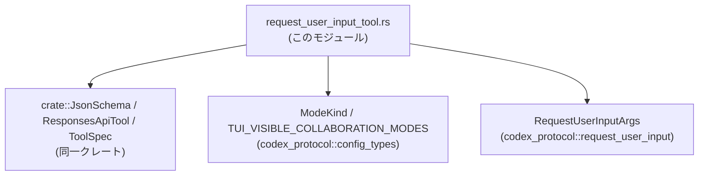
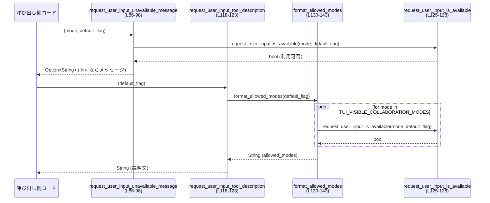

# tools/src/request_user_input_tool.rs コード解説

## 0. ざっくり一言

- `request_user_input` というツールの **JSON Schemaベースの定義** と、
  そのツールの **利用可否判定・説明文生成・引数バリデーション／正規化** を行うユーティリティ関数群のモジュールです  
  （tools/src/request_user_input_tool.rs:L9-123）。

---

## 1. このモジュールの役割

### 1.1 概要

- このモジュールは、外部システム（おそらく「ツール呼び出し」用の API）に対して  
  「ユーザーに 1〜3 個の質問を投げて回答を待つ」ための **request_user_input ツールの仕様** を提供します  
  （`create_request_user_input_tool`、tools/src/request_user_input_tool.rs:L11-84）。
- あわせて、どの **モード** でこのツールが利用可能かを判定し、  
  ツールの利用可否メッセージや説明文を生成します  
  （`request_user_input_unavailable_message`, `request_user_input_tool_description`, tools/src/request_user_input_tool.rs:L86-98, L118-123）。
- さらに、`RequestUserInputArgs` の `questions` の各質問に必須な `options` をチェックし、  
  `is_other` フラグを設定することで、**ツール引数の整形とエラー検出** を行います  
  （`normalize_request_user_input_args`, tools/src/request_user_input_tool.rs:L100-115）。

### 1.2 アーキテクチャ内での位置づけ

このモジュールは、同一クレート内のツール定義系と、`codex_protocol` クレートの設定・引数型の間に位置します。

- 依存関係（imports）  
  - 自クレート:
    - `JsonSchema`（JSON Schema ビルダー）  
      （tools/src/request_user_input_tool.rs:L1）
    - `ResponsesApiTool`（ツール実体の構造体）  
      （tools/src/request_user_input_tool.rs:L2）
    - `ToolSpec`（ツール仕様の enum/型）  
      （tools/src/request_user_input_tool.rs:L3）
  - 外部クレート `codex_protocol`:
    - `ModeKind`, `TUI_VISIBLE_COLLABORATION_MODES`（モード種別・表示用モード一覧）  
      （tools/src/request_user_input_tool.rs:L4-5）
    - `RequestUserInputArgs`（このツールの引数型）  
      （tools/src/request_user_input_tool.rs:L6）

これを簡略な依存関係図で表すと次のようになります。



> この図は tools/src/request_user_input_tool.rs:L1-7 に基づきます。  
> このチャンクには、このモジュールを呼び出す側のコードは現れないため、呼び出し元は不明です。

### 1.3 設計上のポイント

- **純粋関数による構成**  
  - すべての関数は引数のみを入力とし、グローバルな可変状態を一切持ちません  
    （tools/src/request_user_input_tool.rs:L11-143）。
  - `unsafe` ブロックやスレッド／I/O 操作はなく、**関数型に近いスタイル**で設計されています。
- **JSON Schema のプログラム生成**  
  - `BTreeMap` と `JsonSchema` ビルダーを使って、  
    options/questions/properties のスキーマを組み立てています  
    （tools/src/request_user_input_tool.rs:L11-83）。
- **利用可否ロジックの分離**  
  - `request_user_input_is_available` をプライベート関数として定義し、  
    利用不可メッセージ生成と「どのモードで利用可能か」の文字列生成の両方から再利用しています  
    （tools/src/request_user_input_tool.rs:L86-98, L118-143）。
- **引数のバリデーションと正規化**  
  - `normalize_request_user_input_args` で
    - 「全ての質問に非空の `options` が存在するか」を検証し、  
    - 全質問の `is_other` フラグを `true` に強制  
    することで、クライアントへの前提条件を揃えています  
    （tools/src/request_user_input_tool.rs:L100-115）。

---

## 2. 主要な機能一覧

このモジュールが提供する主な機能は次の通りです。

- `REQUEST_USER_INPUT_TOOL_NAME`: ツール名 `"request_user_input"` の定数定義  
  （tools/src/request_user_input_tool.rs:L9）。
- `create_request_user_input_tool`: `request_user_input` ツールの `ToolSpec` 定義を JSON Schema とともに生成する  
  （tools/src/request_user_input_tool.rs:L11-84）。
- `request_user_input_unavailable_message`: 指定モードでツールが利用不可の場合のメッセージを返す  
  （tools/src/request_user_input_tool.rs:L86-98）。
- `normalize_request_user_input_args`: `RequestUserInputArgs` を検証し、`is_other` を設定したうえで返す  
  （tools/src/request_user_input_tool.rs:L100-115）。
- `request_user_input_tool_description`: 利用可能なモード一覧を埋め込んだツールの説明文を返す  
  （tools/src/request_user_input_tool.rs:L118-123）。

内部的な補助機能:

- `request_user_input_is_available`（非公開）: モードと設定に基づき、このツールの利用可否を真偽値で返す  
  （tools/src/request_user_input_tool.rs:L125-128）。
- `format_allowed_modes`（非公開）: ツールが利用可能なモードを人間可読な文字列に整形する  
  （tools/src/request_user_input_tool.rs:L130-143）。

---

## 3. 公開 API と詳細解説

### 3.1 型一覧（構造体・列挙体など）

このファイル内で新たに定義される型はありませんが、重要な定数があります。

| 名前 | 種別 | 役割 / 用途 | 定義位置 |
|------|------|-------------|----------|
| `REQUEST_USER_INPUT_TOOL_NAME` | 定数 `&'static str` | ツール名 `"request_user_input"` を一元管理するための名前定数です。`ToolSpec` 生成時に利用されます。 | tools/src/request_user_input_tool.rs:L9 |

外部型（このファイル内では定義されないが、APIで重要なもの）:

| 名前 | 種別 | 役割 / 用途 | 定義位置（使用箇所） |
|------|------|-------------|-----------------------|
| `ToolSpec` | enum/構造体（詳細不明） | ツールの仕様定義を表す型。ここでは `ToolSpec::Function(ResponsesApiTool { ... })` として構築されます。 | 使用: tools/src/request_user_input_tool.rs:L11, L72-83 |
| `ResponsesApiTool` | 構造体（詳細不明） | `ToolSpec` の `Function` バリアントに格納されるツール定義。`name`, `description`, `parameters` などを持ちます。 | 使用: tools/src/request_user_input_tool.rs:L72-83 |
| `JsonSchema` | 構造体/enum（詳細不明） | JSON Schema を組み立てるためのビルダー。`string`, `array`, `object` などの関連関数を持ちます。 | 使用: tools/src/request_user_input_tool.rs:L11-83 |
| `ModeKind` | enum（詳細不明） | アプリの「モード」種別。`allows_request_user_input()` と `display_name()` を持ちます。 | 使用: tools/src/request_user_input_tool.rs:L4, L86-98, L125-128, L130-135 |
| `TUI_VISIBLE_COLLABORATION_MODES` | コレクション（おそらく配列/スライス） | UI 上に表示する協調モード一覧。どのモードがユーザーに見えるかを定義します。 | 使用: tools/src/request_user_input_tool.rs:L5, L131-135 |
| `RequestUserInputArgs` | 構造体（詳細不明） | `request_user_input` ツールに渡される引数。`questions` フィールドと、その要素が `options` と `is_other` を持つことがコードからわかります。 | 使用: tools/src/request_user_input_tool.rs:L6, L100-115 |

> 外部型の正確な定義はこのチャンクには現れないため、ここでは用途のみを記載しています。

---

### 3.2 関数詳細

#### `create_request_user_input_tool(description: String) -> ToolSpec`

**概要**

- `request_user_input` ツールの JSON Schema とメタ情報を含む `ToolSpec` を組み立てて返します  
  （tools/src/request_user_input_tool.rs:L11-84）。
- 質問配列 `questions` のスキーマと、各質問内の `options`（選択肢）のスキーマを定義します。

**引数**

| 引数名 | 型 | 説明 |
|--------|----|------|
| `description` | `String` | このツール全体の説明文。`ResponsesApiTool` の `description` フィールドにそのまま格納されます（tools/src/request_user_input_tool.rs:L72-75）。 |

**戻り値**

- `ToolSpec`:  
  - `ToolSpec::Function(ResponsesApiTool { ... })` 形式のツール仕様を返します（tools/src/request_user_input_tool.rs:L72-83）。
  - パラメータ schema (`parameters`) に、トップレベルの `questions` プロパティを持つ JSON Schema が設定されます。

**内部処理の流れ**

1. **options のプロパティ定義**  
   - `"label"` と `"description"` の 2 つの文字列プロパティを持つオブジェクトスキーマを作成します  
     （tools/src/request_user_input_tool.rs:L12-23）。
   - それぞれのプロパティには説明文（`User-facing label (1-5 words).` など）が付与されます。

2. **`options` 配列スキーマ生成**  
   - 上記オブジェクトスキーマを要素とする配列スキーマ `options_schema` を作成し、  
     「2〜3 個の排他的な選択肢を提供すること」「推奨オプションには `(Recommended)` サフィックスをつけること」「`Other` 選択肢は含めないこと」などの説明を付けます  
     （tools/src/request_user_input_tool.rs:L25-32）。

3. **question のプロパティ定義**  
   - 各質問オブジェクトのスキーマ `question_props` を作成し、  
     `"id"`, `"header"`, `"question"`, `"options"` の 4 プロパティとその説明文を定義します  
     （tools/src/request_user_input_tool.rs:L34-54）。

4. **`questions` 配列スキーマ生成**  
   - 上記 `question_props` を要素とするオブジェクト配列スキーマ `questions_schema` を作り、  
     「質問は 1〜3 個が望ましい」という説明を付けます  
     （tools/src/request_user_input_tool.rs:L56-68）。

5. **トップレベル properties の定義**  
   - トップレベルの JSON Schema で `questions` プロパティを持つように `properties` を作成します  
     （tools/src/request_user_input_tool.rs:L70）。

6. **`ResponsesApiTool` と `ToolSpec` の組み立て**  
   - `name` に `REQUEST_USER_INPUT_TOOL_NAME` (`"request_user_input"`) を設定し（tools/src/request_user_input_tool.rs:L72-73）、  
   - `description` に引数で受け取った説明文を設定、`strict` は `false`、`defer_loading` は `None`、  
     `parameters` に先ほど作成した JSON Schema を設定して `ResponsesApiTool` を生成し、  
   - それを `ToolSpec::Function` でラップして返します  
     （tools/src/request_user_input_tool.rs:L72-83）。

**Examples（使用例）**

> ここでは、このモジュールと同一クレート内での利用を想定した簡略例です。  
> `ToolSpec` や `ResponsesApiTool` の定義はこのチャンクにはないため、擬似コード的な例になります。

```rust
use crate::tools::request_user_input_tool::{
    create_request_user_input_tool,
    REQUEST_USER_INPUT_TOOL_NAME,
}; // パスは実際のモジュール構成に応じて変更

fn register_tools(registry: &mut Vec<ToolSpec>) {
    // ツールの説明文を定義する
    let description = String::from(
        "Ask the user a small number of multiple-choice questions and wait for the response.",
    );

    // request_user_input ツールの仕様を生成する
    let tool_spec = create_request_user_input_tool(description);

    // レジストリに登録する（具体的な登録方法はこのチャンクからは不明）
    registry.push(tool_spec);

    // ツール名は定数から参照できる
    assert_eq!(REQUEST_USER_INPUT_TOOL_NAME, "request_user_input");
}
```

**Errors / Panics**

- この関数は `Result` ではなく `ToolSpec` を直接返すため、**エラー型は返しません**。
- 内部で想定されるパニック要因は以下のみで、通常の利用ではほぼ問題になりません。
  - メモリ不足によるアロケーション失敗（`to_string`, `BTreeMap::from`, `Vec` の生成など）。
- 文字列フォーマットや BTreeMap の操作で明示的な `panic!` は行われていません。

**Edge cases（エッジケース）**

- 引数 `description` が空文字列でも、そのまま `ResponsesApiTool.description` に使用されます  
  （tools/src/request_user_input_tool.rs:L72-75）。空を禁止するロジックはありません。
- `questions` の最大数「3」は JSON Schema の説明文としてのみ記述されており、  
  **この関数では数値的な制約を強制していません**（tools/src/request_user_input_tool.rs:L67）。

**使用上の注意点**

- 実際の「質問数 <= 3」を保証したい場合は、別途ランタイム側（例: `normalize_request_user_input_args` の呼び出し前後）でチェックする必要があります。
- `"Other"` オプションを `options` に含めないことが説明文で指定されています  
  （tools/src/request_user_input_tool.rs:L25-32）。  
  実際に禁止しているのは仕様（文字列の説明）だけであり、値レベルの検査はこの関数内では行っていません。

---

#### `request_user_input_unavailable_message(mode: ModeKind, default_mode_request_user_input: bool) -> Option<String>`

**概要**

- 与えられた `mode` と設定 `default_mode_request_user_input` に対して、  
  `request_user_input` ツールが利用可能かを判定し、  
  **利用不可のときだけ** その理由メッセージを `Some(String)` として返します  
  （tools/src/request_user_input_tool.rs:L86-98）。

**引数**

| 引数名 | 型 | 説明 |
|--------|----|------|
| `mode` | `ModeKind` | 現在のモード。`display_name()` と `allows_request_user_input()` を持つ enum です（tools/src/request_user_input_tool.rs:L4, L93, L125-127）。 |
| `default_mode_request_user_input` | `bool` | `ModeKind::Default` モードでツールを利用可能とみなすかどうかの設定フラグです（tools/src/request_user_input_tool.rs:L87-89, L125-127）。 |

**戻り値**

- `Option<String>`:
  - 利用可能な場合: `None`
  - 利用不可の場合: `Some("request_user_input is unavailable in {mode_name} mode")`  
    （`mode_name` は `mode.display_name()` の結果です、tools/src/request_user_input_tool.rs:L93-96）。

**内部処理の流れ**

1. `request_user_input_is_available(mode, default_mode_request_user_input)` を呼び出し、利用可否を判定します  
   （tools/src/request_user_input_tool.rs:L90, L125-128）。
2. 利用可能 (`true`) の場合は `None` を返します（tools/src/request_user_input_tool.rs:L90-91）。
3. 利用不可 (`false`) の場合は:
   - `mode.display_name()` からモード名文字列を取得し（tools/src/request_user_input_tool.rs:L93）、  
   - `"request_user_input is unavailable in {mode_name} mode"` というメッセージを `Some` で返します  
     （tools/src/request_user_input_tool.rs:L94-96）。

**Examples（使用例）**

```rust
use codex_protocol::config_types::ModeKind;
use crate::tools::request_user_input_tool::request_user_input_unavailable_message;

fn check_tool(mode: ModeKind) {
    let default_mode_request_user_input = true; // Default モードでも許可する設定にする

    if let Some(msg) = request_user_input_unavailable_message(mode, default_mode_request_user_input) {
        // 利用不可: ユーザーやログにメッセージを出す
        eprintln!("{msg}");
    } else {
        // 利用可能: 実際に request_user_input ツールを使う処理につなげる
        // （呼び出し方法はこのチャンクには現れません）
    }
}
```

**Errors / Panics**

- `Option<String>` を返すのみで、`Result` のようなエラーは発生しません。
- 内部で `format!` を利用しているだけであり、通常はパニック要因はありません（tools/src/request_user_input_tool.rs:L94-96）。

**Edge cases（エッジケース）**

- `default_mode_request_user_input` が `false` で、`ModeKind::Default` が `allows_request_user_input()` を返さない場合、  
  `Default` モードでは常に利用不可メッセージが返ります（tools/src/request_user_input_tool.rs:L125-128）。
- `display_name()` がどのような文字列を返すかはこのチャンクからは分かりませんが、  
  そのままメッセージに埋め込まれます（tools/src/request_user_input_tool.rs:L93-96）。

**使用上の注意点**

- 「利用不可かどうか」だけを知りたい場合に `Option::is_some` で判定できますが、  
  メッセージテキストが仕様の一部であれば文字列の変化に注意する必要があります。
- `mode` の enum に新しいバリアントが追加された場合、  
  `ModeKind::allows_request_user_input()` の実装に依存するため、この関数自体の変更は不要な設計になっています。

---

#### `normalize_request_user_input_args(mut args: RequestUserInputArgs) -> Result<RequestUserInputArgs, String>`

**概要**

- `RequestUserInputArgs` の `questions` を走査し、  
  **すべての質問に非空の `options` がセットされているかを検証** します  
  （tools/src/request_user_input_tool.rs:L103-108）。
- バリデーションが通った場合、各質問の `is_other` フラグを `true` に設定し直し、  
  正規化された `RequestUserInputArgs` を返します（tools/src/request_user_input_tool.rs:L111-115）。

**引数**

| 引数名 | 型 | 説明 |
|--------|----|------|
| `args` | `RequestUserInputArgs` | `request_user_input` ツールに渡される引数。ここでは `questions` フィールドを持ち、その各要素が `options` と `is_other` を持つことが前提になっています（tools/src/request_user_input_tool.rs:L103-112）。 |

**戻り値**

- `Result<RequestUserInputArgs, String>`:
  - `Ok(args)`:
    - 全ての質問に非空の `options` が存在し、`is_other` が `true` に設定された `args` を返します（tools/src/request_user_input_tool.rs:L111-115）。
  - `Err(String)`:
    - 少なくとも一つの質問に `options` が設定されていない、または空である場合、  
      `"request_user_input requires non-empty options for every question"` というエラーメッセージを返します（tools/src/request_user_input_tool.rs:L103-109）。

**内部処理の流れ**

1. **`options` の存在と非空チェック**  
   - `args.questions.iter().any(...)` で、  
     `options` が `None` か、`Some(vec)` だが空 (`Vec::is_empty`) の質問が存在するかどうかを判定します  
     （tools/src/request_user_input_tool.rs:L103-106）。
   - `question.options.as_ref().is_none_or(Vec::is_empty)` という条件により、
     - `None` -> `true`
     - `Some(vec)` かつ `vec.is_empty()` -> `true`
     を検出します（tools/src/request_user_input_tool.rs:L103-106）。

2. **不足があればエラーを返して早期リターン**  
   - `missing_options` が `true` の場合、`Err("request_user_input requires non-empty options for every question".to_string())` を返します  
     （tools/src/request_user_input_tool.rs:L107-109）。

3. **全質問の `is_other` を `true` に設定**  
   - バリデーションが通った場合、`for question in &mut args.questions { question.is_other = true; }` で  
     すべての質問の `is_other` フラグを `true` に上書きします  
     （tools/src/request_user_input_tool.rs:L111-113）。

4. **正規化済みの引数を返す**  
   - 最後に `Ok(args)` を返します（tools/src/request_user_input_tool.rs:L115）。

**Examples（使用例）**

> `RequestUserInputArgs` の具体的な構造体定義はこのチャンクには現れないため、  
> フィールド名のみが分かる範囲で擬似的な例を示します。

```rust
use codex_protocol::request_user_input::RequestUserInputArgs;
use crate::tools::request_user_input_tool::normalize_request_user_input_args;

fn prepare_args(raw_args: RequestUserInputArgs) -> Result<RequestUserInputArgs, String> {
    // バリデーションと正規化を行う
    let normalized = normalize_request_user_input_args(raw_args)?;

    // ここに到達した時点で:
    // - 全ての質問に少なくとも1つの options が入っている
    // - 各質問の is_other が true にセットされている
    Ok(normalized)
}
```

**Errors / Panics**

- `Err(String)` が返る条件:
  - `args.questions` の任意の要素 `question` について、
    - `question.options` が `None`、または
    - `Some(vec)` だが `vec.is_empty()` の場合  
    （tools/src/request_user_input_tool.rs:L103-109）。
- この関数内に `panic!` や `unwrap` は存在しないため、入力がどのようなものであっても（型安全性が守られる限り）**パニックはしません**。

**Edge cases（エッジケース）**

- `args.questions` が空のとき:
  - `.iter().any(...)` は `false` を返すため `missing_options` は `false` になり、  
    エラーにはなりません（tools/src/request_user_input_tool.rs:L103-106）。
  - `for question in &mut args.questions` のループも 0 回で終了し、そのまま `Ok(args)` が返されます（tools/src/request_user_input_tool.rs:L111-115）。
  - つまり、「質問が 0 件であること」はこの関数では許容されています。
- すでに `is_other` が `false` になっている質問があっても、**必ず `true` に上書き**されます  
  （tools/src/request_user_input_tool.rs:L111-113）。  
  入力側での `is_other` 設定は無視される点に注意が必要です。

**使用上の注意点**

- この関数は `is_other` を一括で `true` にするため、「特定の質問だけ `Other` を許可したくない」という要件には対応していません。
- `questions` が 4 個以上であってもエラーにはなりません。  
  「1〜3 個が望ましい」という制約は JSON Schema の説明文にのみ書かれており、この関数ではチェックしていません（tools/src/request_user_input_tool.rs:L67）。
- 並行性の観点では、引数 `args` を所有権ごと受け取り（`mut args: RequestUserInputArgs`）、  
  返り値として新たな所有者に渡すだけなので、共有可変状態は存在せずスレッドセーフな設計になっています。

---

#### `request_user_input_tool_description(default_mode_request_user_input: bool) -> String`

**概要**

- ユーザー向けのツール説明文を生成します。  
- 特に、「このツールがどのモードでのみ利用可能か」を含む説明文を返します  
  （tools/src/request_user_input_tool.rs:L118-123）。

**引数**

| 引数名 | 型 | 説明 |
|--------|----|------|
| `default_mode_request_user_input` | `bool` | `ModeKind::Default` モードで `request_user_input` を利用可能とみなすかどうか。このフラグに応じて「利用可能なモード」の文字列が変わります（tools/src/request_user_input_tool.rs:L118-119, L130-143）。 |

**戻り値**

- `String`:
  - `"Request user input for one to three short questions and wait for the response. This tool is only available in {allowed_modes}."`  
    という固定フォーマットの説明文を返します（tools/src/request_user_input_tool.rs:L120-122）。
  - `{allowed_modes}` の部分は `format_allowed_modes(default_mode_request_user_input)` の返り値で置き換えられます（tools/src/request_user_input_tool.rs:L118-121）。

**内部処理の流れ**

1. `format_allowed_modes(default_mode_request_user_input)` を呼び出して、  
   このツールが利用可能なモードを表す文字列 `allowed_modes` を取得します  
   （tools/src/request_user_input_tool.rs:L118-119, L130-143）。
2. 固定のテンプレート文に `allowed_modes` を埋め込み、`String` を生成して返します  
   （tools/src/request_user_input_tool.rs:L120-122）。

**Examples（使用例）**

```rust
use crate::tools::request_user_input_tool::request_user_input_tool_description;

fn print_description() {
    let desc = request_user_input_tool_description(true);
    println!("{desc}");
    // 例: "Request user input for one to three short questions and wait for the response.
    //       This tool is only available in modes: Pair or Review."
    // 実際のモード名は ModeKind.display_name() 実装に依存し、このチャンクからは不明です。
}
```

**Errors / Panics**

- エラーは返さず、常に `String` を生成します。
- 内部では `format!` のみを利用しており、通常利用においてパニックの可能性はほぼありません。

**Edge cases（エッジケース）**

`format_allowed_modes` の実装により、以下のような文字列になります（tools/src/request_user_input_tool.rs:L137-142）。

- 利用可能モードが 0 個の場合: `"no modes"`  
  → `"This tool is only available in no modes."`
- 1 個だけの場合: `"{mode} mode"`  
- 2 個の場合: `"{first} or {second} mode"`  
- 3 個以上の場合: `"modes: {mode1},{mode2},..."`

**使用上の注意点**

- 利用可能モードが 0 個のケース（何らかの設定ミスなど）は、この説明文だけ見るとユーザーにとって違和感があるため、  
  実際の設定には注意が必要です。  
  ただし、そうした設定が行われるかどうかは、このチャンクからは分かりません。

---

### 3.3 その他の関数

公開 API から呼び出される補助関数です。

| 関数名 | シグネチャ | 役割（1 行） | 定義位置 |
|--------|------------|--------------|----------|
| `request_user_input_is_available` | `fn request_user_input_is_available(mode: ModeKind, default_mode_request_user_input: bool) -> bool` | `ModeKind::allows_request_user_input()` と `default_mode_request_user_input` を組み合わせ、このツールが利用可能かどうかを判定します。 | tools/src/request_user_input_tool.rs:L125-128 |
| `format_allowed_modes` | `fn format_allowed_modes(default_mode_request_user_input: bool) -> String` | `TUI_VISIBLE_COLLABORATION_MODES` を走査し、`request_user_input_is_available` を用いて「利用可能モード」の一覧文字列を整形します。 | tools/src/request_user_input_tool.rs:L130-143 |

---

## 4. データフロー

ここでは、「モードに応じた利用可否チェックと説明文生成」の流れを例に、関数間の呼び出し関係を示します。

### 4.1 処理の要点

- 呼び出し側（外部コード）は、
  - 利用可否メッセージが必要なときは `request_user_input_unavailable_message` を呼び出します（tools/src/request_user_input_tool.rs:L86-98）。
  - ツール説明文が必要なときは `request_user_input_tool_description` を呼び出します（tools/src/request_user_input_tool.rs:L118-123）。
- どちらの経路でも、内部では `request_user_input_is_available` が再利用され、  
  一貫した可否判定ロジックを共有しています（tools/src/request_user_input_tool.rs:L125-128, L130-135）。

### 4.2 関数間呼び出しシーケンス図



> 引数の準備や `RequestUserInputArgs` の生成・利用フローはこのチャンクには現れないため、  
> ここではモード判定と説明文生成に絞って図示しています。

---

## 5. 使い方（How to Use）

### 5.1 基本的な使用方法

1. **ツール仕様の登録フェーズ**（アプリケーション起動時など）で  
   `create_request_user_input_tool` を使って `ToolSpec` を生成し、ツールレジストリに登録します（tools/src/request_user_input_tool.rs:L11-84）。
2. 実行時に `request_user_input` を利用したくなったときは、
   - 現在の `ModeKind` と設定 `default_mode_request_user_input` を元に  
     `request_user_input_unavailable_message` で利用可否を確認します（tools/src/request_user_input_tool.rs:L86-98）。
3. ユーザーに実際の質問を提示する前に、  
   `normalize_request_user_input_args` で `RequestUserInputArgs` を検証・正規化します（tools/src/request_user_input_tool.rs:L100-115）。

概略コード例:

```rust
use codex_protocol::config_types::ModeKind;
use codex_protocol::request_user_input::RequestUserInputArgs;
use crate::tools::request_user_input_tool::{
    create_request_user_input_tool,
    request_user_input_unavailable_message,
    normalize_request_user_input_args,
    request_user_input_tool_description,
};

// 設定や依存オブジェクトを用意する
fn init_tools(registry: &mut Vec<ToolSpec>) {
    let desc = request_user_input_tool_description(true); // 説明文を生成
    let spec = create_request_user_input_tool(desc);      // ツール仕様を生成
    registry.push(spec);                                  // レジストリに登録（実装は仮）
}

// 実行時にユーザー入力ツールを使う例
fn maybe_ask_user(mode: ModeKind, args: RequestUserInputArgs) -> Result<(), String> {
    // モードにより利用可能かチェック
    if let Some(msg) = request_user_input_unavailable_message(mode, true) {
        // 利用不可: エラーとして扱う
        return Err(msg);
    }

    // 引数をバリデーション＆正規化
    let normalized_args = normalize_request_user_input_args(args)?;

    // ここで normalized_args を使って実際にユーザーに質問する処理につなぐ
    // （その処理はこのチャンクには含まれません）

    Ok(())
}
```

### 5.2 よくある使用パターン

- **Default モードでの挙動を切り替える**

```rust
let desc_strict = request_user_input_tool_description(false); // Default モードでは利用不可として説明
let desc_relaxed = request_user_input_tool_description(true); // Default モードを含めて説明
```

- **UI でのエラーメッセージ表示**

```rust
if let Some(msg) = request_user_input_unavailable_message(current_mode, true) {
    // UI 上に「このモードでは request_user_input が使えない」旨を表示する
    show_warning(msg);
}
```

- **引数の事前検証**

```rust
match normalize_request_user_input_args(raw_args) {
    Ok(args) => {
        // バリデーション済みの args を安全に利用
    }
    Err(e) => {
        // 質問ごとに options が不足していたため、設定ミスとして扱う
        log_error(e);
    }
}
```

### 5.3 よくある間違い

```rust
// 間違い例: options を設定せずに RequestUserInputArgs を作成してしまう
//
// これに対して normalize_request_user_input_args を呼ぶと Err を返します。
let args_without_options = RequestUserInputArgs {
    // questions の各要素の options が None または空ベクタになっている
    // ...
};

let normalized = normalize_request_user_input_args(args_without_options);
// => Err("request_user_input requires non-empty options for every question")

// 正しい例: 各質問に少なくとも1つの選択肢を設定する
let args_with_options = RequestUserInputArgs {
    // questions の各要素に、非空の options を付与
    // ...
};
let normalized = normalize_request_user_input_args(args_with_options)?;
// => Ok(...) となり、各質問の is_other は true に統一される
```

### 5.4 使用上の注意点（まとめ）

- **options の必須性**  
  - `normalize_request_user_input_args` を通す前提であれば、各質問に必ず非空の `options` を設定する必要があります  
    （tools/src/request_user_input_tool.rs:L103-109）。
- **is_other の強制**  
  - 入力側で `is_other` を `false` にしていても上書きされるため、「Other なしの質問」を設計したい場合はこの仕様と整合を取る必要があります  
    （tools/src/request_user_input_tool.rs:L111-113）。
- **モードと設定の整合性**  
  - `default_mode_request_user_input` フラグと `ModeKind::allows_request_user_input()` の組み合わせにより、  
    実際に「どのモードで利用可能か」が決まります（tools/src/request_user_input_tool.rs:L125-128）。  
    説明文 (`request_user_input_tool_description`) と実際の許可ロジックを別々に変えないよう注意が必要です。

---

## 6. 変更の仕方（How to Modify）

### 6.1 新しい機能を追加する場合

- **質問項目のフィールドを増やしたい場合**
  1. `question_props` に新しいプロパティを追加し、`JsonSchema::string` や他の型でスキーマを定義します  
     （tools/src/request_user_input_tool.rs:L34-54）。
  2. 必須項目にしたい場合は、`Some(vec![...])` で指定している必須フィールドリストに新しいキーを追加します  
     （tools/src/request_user_input_tool.rs:L59-64）。
  3. `RequestUserInputArgs` 側の構造体（`codex_protocol` クレート内）にも同じフィールドを追加する必要がありますが、  
     その定義はこのチャンクには現れません。

- **利用可能モードの表現方法を変えたい場合**
  1. `format_allowed_modes` の `match mode_names.as_slice()` 部分を変更し、  
     モード一覧の文字列フォーマットを調整します（tools/src/request_user_input_tool.rs:L137-142）。
  2. 利用可否ロジック自体を変える場合は `request_user_input_is_available` を編集します  
     （tools/src/request_user_input_tool.rs:L125-128）。

### 6.2 既存の機能を変更する場合

- **バリデーション条件の変更**
  - 「少なくとも1つの options」が必要、という条件を変更したい場合は  
    `normalize_request_user_input_args` 内の `is_none_or(Vec::is_empty)` 判定を修正します  
    （tools/src/request_user_input_tool.rs:L103-106）。
  - 例えば、「2 個以上の選択肢必須」とするなら、`Vec::len` をチェックするなどの変更が必要です。

- **エラーメッセージの変更**
  - エラーメッセージ文字列や利用不可メッセージを変更する場合、  
    呼び出し元のテストや UI 文言と整合するかを確認する必要があります  
    （tools/src/request_user_input_tool.rs:L94-96, L107-109）。

- **影響範囲の確認方法**
  - `request_user_input_is_available` を変更すると、
    - `request_user_input_unavailable_message`
    - `format_allowed_modes`（ひいては `request_user_input_tool_description`）  
    に影響が及びます（tools/src/request_user_input_tool.rs:L86-98, L118-143）。
  - 振る舞いの変更後は、`#[cfg(test)]` で参照されているテストモジュール  
    `request_user_input_tool_tests.rs` を含め、関連テストを実行する必要があります  
    （tools/src/request_user_input_tool.rs:L145-147）。

---

## 7. 関連ファイル

| パス / モジュール | 役割 / 関係 |
|-------------------|------------|
| `crate::JsonSchema` | JSON Schema のビルダー型。`request_user_input` ツールのパラメータスキーマ定義に利用されています（tools/src/request_user_input_tool.rs:L1, L11-83）。 |
| `crate::ResponsesApiTool` | `ToolSpec::Function` に格納されるツール定義。`name`, `description`, `parameters` などを保持します（tools/src/request_user_input_tool.rs:L2, L72-83）。 |
| `crate::ToolSpec` | ツール仕様全体を表す型。`create_request_user_input_tool` の戻り値として利用されます（tools/src/request_user_input_tool.rs:L3, L11, L72-83）。 |
| `codex_protocol::config_types::ModeKind` | モード種別 enum。ツールの利用可否判定とメッセージ／説明文生成に使用されます（tools/src/request_user_input_tool.rs:L4, L86-98, L125-128, L130-135）。 |
| `codex_protocol::config_types::TUI_VISIBLE_COLLABORATION_MODES` | UI 上に表示される協調モード一覧。`format_allowed_modes` で走査され、「利用可能モード一覧」の元となります（tools/src/request_user_input_tool.rs:L5, L131-135）。 |
| `codex_protocol::request_user_input::RequestUserInputArgs` | `request_user_input` ツールに渡される引数型。`normalize_request_user_input_args` の対象です（tools/src/request_user_input_tool.rs:L6, L100-115）。 |
| `tools/src/request_user_input_tool_tests.rs` | このモジュールのテストコード。`#[cfg(test)] mod tests;` から参照されます（tools/src/request_user_input_tool.rs:L145-147）。 |

> 外部型やテストファイルの詳細な実装はこのチャンクには現れないため、ここでは関係性のみを記載しています。
