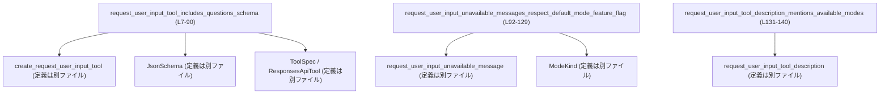
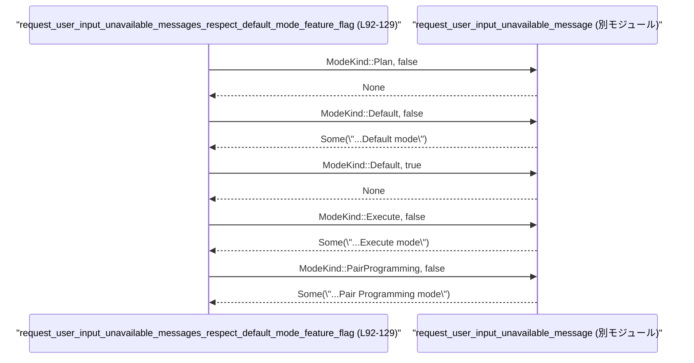

# tools/src/request_user_input_tool_tests.rs

## 0. ざっくり一言

`request_user_input` というツールの **JSON スキーマ仕様** と、  
そのツールが **どのモードで利用可能か** に関する関数の挙動をテストするモジュールです  
（`create_request_user_input_tool` / `request_user_input_unavailable_message` / `request_user_input_tool_description` の期待仕様を確認しています）。  
（tools/src/request_user_input_tool_tests.rs:L7-140）

---

## 1. このモジュールの役割

### 1.1 概要

このテストモジュールは次の問題を扱います。

- `request_user_input` ツールの **parameters JSON Schema** が、UI で表示する質問・選択肢の構造を正しく表現しているか検証する  
  （tools/src/request_user_input_tool_tests.rs:L8-90）
- 実行モード (`ModeKind`) とフラグ `default_mode_request_user_input` に応じて、  
  「このツールは利用できない」というメッセージが正しく返ることを検証する  
  （tools/src/request_user_input_tool_tests.rs:L93-129）
- 同じフラグに応じて、ツールの **説明文** に「どのモードで使用可能か」が正しく反映されているか検証する  
  （tools/src/request_user_input_tool_tests.rs:L132-140）

これにより、UI と連携するツール仕様と、モード制御ロジックの契約（仕様）が壊れていないことを確認します。

### 1.2 アーキテクチャ内での位置づけ

このファイルは **テスト層** に属し、上位モジュールで定義されたツール構築関数／説明関数に対して期待値を与える形で依存しています。

主な依存関係は以下です。

- `super::*` からインポートされる API  
  - `create_request_user_input_tool`  
  - `request_user_input_unavailable_message`  
  - `request_user_input_tool_description`  
  - `ToolSpec`, `ResponsesApiTool`  
  （呼び出しのみが現れ、定義はこのチャンクにはありません。tools/src/request_user_input_tool_tests.rs:L10-88,L95-127,L134-139）
- `crate::JsonSchema` — ツールの `parameters` 用 JSON スキーマを構築するために使用  
  （tools/src/request_user_input_tool_tests.rs:L16-88）
- `codex_protocol::config_types::ModeKind` — 実行モード（Plan / Default / Execute / PairProgramming）を表す型  
  （tools/src/request_user_input_tool_tests.rs:L3,L96,L103,L110,L117,L124）

依存関係のイメージ図です。



### 1.3 設計上のポイント

- **テスト駆動で契約を記述**  
  - JSON スキーマの構造（必須フィールド・説明文・追加プロパティ禁止など）を、`assert_eq!` で厳密に比較しています。  
    （tools/src/request_user_input_tool_tests.rs:L16-88）
- **モードごとのメッセージ仕様を列挙テスト**  
  - `ModeKind` とフラグの組み合わせごとに戻り値を明示し、仕様をテーブル状に固定しています。  
    （tools/src/request_user_input_tool_tests.rs:L94-128）
- **説明文の一貫性チェック**  
  - 説明文の本体テキスト（「one to three short questions ...」）を共有しつつ、  
    利用可能なモード部分だけが変化することをテストしています。  
    （tools/src/request_user_input_tool_tests.rs:L134-139）
- **エラーやパニックを明示的に扱うコードは登場しない**  
  - このファイルには `Result` や `panic!` の呼び出しはなく、`assert_eq!` によるテスト失敗のみが検証手段です。  
    （tools/src/request_user_input_tool_tests.rs:L7-140）
- **並行性は使用していない**  
  - `async` やスレッド、共有状態などは登場しません。  
    （tools/src/request_user_input_tool_tests.rs:L1-140）

---

## 2. コンポーネント一覧（インベントリー）

### 2.1 関数（このファイル内で定義）

| 名前 | 種別 | 役割 / 用途 | 行範囲 |
|------|------|-------------|--------|
| `request_user_input_tool_includes_questions_schema` | テスト関数 | `create_request_user_input_tool` が返す `ToolSpec` に、期待どおりの `questions` スキーマが含まれていることを検証する | tools/src/request_user_input_tool_tests.rs:L7-90 |
| `request_user_input_unavailable_messages_respect_default_mode_feature_flag` | テスト関数 | 実行モードとフラグに応じて `request_user_input_unavailable_message` が返す `Option<String>` が期待どおりか検証する | tools/src/request_user_input_tool_tests.rs:L92-129 |
| `request_user_input_tool_description_mentions_available_modes` | テスト関数 | フラグに応じて `request_user_input_tool_description` が返す説明文が正しいか検証する | tools/src/request_user_input_tool_tests.rs:L131-140 |

### 2.2 関数（このファイルから呼び出されるが定義は別）

> 型情報は、**テストコードから推論できる範囲のみ** を記載し、それ以上は「不明」としています。

| 名前 | 役割 / 用途 | このファイルでの使用行 | 推論されるシグネチャ（テストから） |
|------|------------|------------------------|------------------------------------|
| `create_request_user_input_tool` | `request_user_input` ツールの `ToolSpec` を構築する | tools/src/request_user_input_tool_tests.rs:L10 | 第1引数として `String` を受け取り（厳密な型は不明）、`ToolSpec` を返す関数と推論できます（右辺が `ToolSpec::Function(...)` であるため）。 |
| `request_user_input_unavailable_message` | モードとフラグに応じて「利用不可メッセージ」を返す | tools/src/request_user_input_tool_tests.rs:L95-127 | `fn(ModeKind, bool) -> Option<String>` と推論できます。左辺が右辺 `None` / `Some("...".to_string())` と比較されているためです。 |
| `request_user_input_tool_description` | ツールの説明文（どのモードで利用可能かを含む）を返す | tools/src/request_user_input_tool_tests.rs:L134-139 | `fn(bool) -> String` と推論できます。戻り値が `"..." .to_string()` と比較されているためです。 |

### 2.3 型（このファイルで使用）

| 名前 | 種別（このファイルから判明する範囲） | 役割 / 用途 | 行範囲 |
|------|-------------------------------------|-------------|--------|
| `JsonSchema` | 不明（定義は別ファイル） | ツールの `parameters` に対する JSON スキーマを構築するために使用 | tools/src/request_user_input_tool_tests.rs:L2,L16-88 |
| `ModeKind` | 不明（定義は別ファイル） | 実行モード（Plan, Default, Execute, PairProgramming）を表す列挙的な型と考えられますが、構造はこのチャンクには現れません | tools/src/request_user_input_tool_tests.rs:L3,L96,L103,L110,L117,L124 |
| `ToolSpec` | 不明（定義は別ファイル） | `ToolSpec::Function(ResponsesApiTool { ... })` というバリアントを持つ型で、ツール仕様を表すことが分かります | tools/src/request_user_input_tool_tests.rs:L11 |
| `ResponsesApiTool` | 不明（定義は別ファイル） | `ToolSpec::Function(...)` に格納される構造体で、`name`, `description`, `strict`, `defer_loading`, `parameters`, `output_schema` フィールドを持つことが分かります | tools/src/request_user_input_tool_tests.rs:L11-88 |

---

## 3. 公開 API と詳細解説

> ここでは「テスト対象となっている関数」の仕様を、**テストから読み取れる契約** として整理します。  
> 実装は他ファイルにあり、このチャンクには現れません。

### 3.1 型一覧（補足）

このモジュール自体は新しい公開型を定義していませんが、テストを通じて外部 API の型構造の一部が分かります。

| 名前 | 種別 | 役割 / 用途 | 根拠 |
|------|------|-------------|------|
| `ToolSpec` | 不明（列挙体らしきもの） | 少なくとも `Function(ResponsesApiTool)` というバリアントを持ち、ツール仕様を表現するために使用されます。 | `ToolSpec::Function(ResponsesApiTool { ... })` のパターンから（tools/src/request_user_input_tool_tests.rs:L11-88） |
| `ResponsesApiTool` | 構造体（フィールド初期化から推定） | `name`, `description`, `strict`, `defer_loading`, `parameters`, `output_schema` を持つツール定義オブジェクトです。 | 構造体リテラル `ResponsesApiTool { ... }` から（tools/src/request_user_input_tool_tests.rs:L11-88） |
| `JsonSchema` | 不明 | `object`, `array`, `string` メソッド（または関連関数）を持ち、JSON Schema を組み立てるために使用されます。 | `JsonSchema::object(...)`, `JsonSchema::array(...)`, `JsonSchema::string(...)` から（tools/src/request_user_input_tool_tests.rs:L16-88） |
| `ModeKind` | 不明 | `Plan`, `Default`, `Execute`, `PairProgramming` というバリアントを持つことが分かります。実際の定義は別ファイルです。 | `ModeKind::Plan` などの使用から（tools/src/request_user_input_tool_tests.rs:L96,L103,L110,L117,L124） |

### 3.2 関数詳細（テスト対象のコア API）

#### `create_request_user_input_tool(prompt: /*文字列系型*/ ) -> ToolSpec`（定義は別ファイル）

**概要**

- `request_user_input` という名前のツールの `ToolSpec` を生成します。  
- このテストから、生成される `ToolSpec` の `parameters` が、ユーザーに提示する質問のリスト用スキーマになっていることが分かります。  
  （tools/src/request_user_input_tool_tests.rs:L10-88）

**引数**

| 引数名 | 型 | 説明 |
|--------|----|------|
| `prompt` | テストでは `String` を渡しているが、厳密な型はこのチャンクからは不明 | ツールの `description` に入る文言として使用されます（`"Ask the user to choose."`）。（tools/src/request_user_input_tool_tests.rs:L10-13） |

**戻り値**

- `ToolSpec` 型。少なくとも `ToolSpec::Function(ResponsesApiTool { ... })` という形の値が返ることがテストから分かります。  
  （tools/src/request_user_input_tool_tests.rs:L11-88）

**内部仕様（テストから読み取れる契約）**

テストの期待値から、生成される `ToolSpec` の構造は次のようになります。  
（すべて **「こうなるべき」という仕様** であり、実装はこのチャンクには現れません。）

1. `name` は固定で `"request_user_input"`。  
   （tools/src/request_user_input_tool_tests.rs:L12）
2. `description` は引数で渡した文字列と一致します（ここでは `"Ask the user to choose."`）。  
   （tools/src/request_user_input_tool_tests.rs:L13）
3. `strict` は `false`。  
   （tools/src/request_user_input_tool_tests.rs:L14）
4. `defer_loading` は `None`。  
   （tools/src/request_user_input_tool_tests.rs:L15）
5. `parameters` は次のような JSON スキーマです（`JsonSchema` 利用）。  
   （tools/src/request_user_input_tool_tests.rs:L16-86）

   - ルートは `object` で、プロパティ `"questions"` を持つ。必須プロパティは `"questions"` のみ。追加プロパティは禁止（`Some(false.into())`）。  
     （tools/src/request_user_input_tool_tests.rs:L16-18,L85-86）
   - `"questions"` プロパティは **配列** で、その各要素は「質問オブジェクト」です。  
     - `"Questions to show the user. Prefer 1 and do not exceed 3"` という説明付き。  
       （tools/src/request_user_input_tool_tests.rs:L82-84）
   - 質問オブジェクトは `object` で、以下のプロパティを持ち、すべて必須です。  
     （tools/src/request_user_input_tool_tests.rs:L20-80）
     - `id` — `"Stable identifier for mapping answers (snake_case)."`  
       （tools/src/request_user_input_tool_tests.rs:L28-34,75）
     - `header` — `"Short header label shown in the UI (12 or fewer chars)."`  
       （tools/src/request_user_input_tool_tests.rs:L21-27,76）
     - `question` — `"Single-sentence prompt shown to the user."`  
       （tools/src/request_user_input_tool_tests.rs:L67-71,77）
     - `options` — 選択肢の配列（下記参照）。  
       （tools/src/request_user_input_tool_tests.rs:L35-66,78）
     - 追加プロパティは禁止（`Some(false.into())`）。  
       （tools/src/request_user_input_tool_tests.rs:L73-81）
   - `options` プロパティは **配列** で、各要素は「選択肢オブジェクト」です。  
     （tools/src/request_user_input_tool_tests.rs:L36-65）
     - 説明文:  
       `"Provide 2-3 mutually exclusive choices. Put the recommended option first and suffix its label with \"(Recommended)\". Do not include an \"Other\" option in this list; the client will add a free-form \"Other\" option automatically."`  
       （tools/src/request_user_input_tool_tests.rs:L61-64）
     - オブジェクトのプロパティ:  
       - `label` — `"User-facing label (1-5 words)."`  
         （tools/src/request_user_input_tool_tests.rs:L47-53,56）
       - `description` — `"One short sentence explaining impact/tradeoff if selected."`  
         （tools/src/request_user_input_tool_tests.rs:L40-46,57）
       - 両方が必須 (`"label"`, `"description"`)。追加プロパティは禁止。  
         （tools/src/request_user_input_tool_tests.rs:L55-60）

6. `output_schema` は `None`。ツールの戻り値スキーマはテストからは指定されていません。  
   （tools/src/request_user_input_tool_tests.rs:L87-88）

**Examples（使用例）**

テストと同様の利用例です。

```rust
// ツールの説明文を用意する
let description = "Ask the user to choose.".to_string(); // tools/src/request_user_input_tool_tests.rs:L10

// ツール仕様を生成する
let tool_spec = create_request_user_input_tool(description);

// 期待される ToolSpec と比較（テストでは assert_eq! で厳密比較）
assert!(matches!(tool_spec, ToolSpec::Function(_)));
```

**Errors / Panics**

- テストコードには `Result` や `panic!` は現れず、`create_request_user_input_tool` がエラーを返すかどうかは分かりません。  
  （tools/src/request_user_input_tool_tests.rs:L8-90）
- 少なくともこのテストケースでは、`create_request_user_input_tool` がパニックせずに `ToolSpec` を返すことが前提となっています。

**Edge cases（エッジケース）**

- 質問数が 0 や 3 を超える場合の挙動などは、このテストからは分かりません。説明文として「Prefer 1 and do not exceed 3」とあるのみです。  
  （tools/src/request_user_input_tool_tests.rs:L82-84）
- `options` の個数（2〜3 の制約）も説明文にのみ書かれており、実際にバリデーションされるかは、このチャンクには現れません。  
  （tools/src/request_user_input_tool_tests.rs:L61-64）

**使用上の注意点**

- `parameters` のスキーマに従わないペイロードをこのツールに渡した場合の挙動（エラー応答など）は、このファイルだけからは判別できません。
- `JsonSchema` によるスキーマ定義は固定文字列が多いため、メッセージ変更時はこのテストも合わせて更新する必要があります。  
  （tools/src/request_user_input_tool_tests.rs:L21-24,L28-31,L40-43,L47-50,L67-70,L82-84,L61-64）

---

#### `request_user_input_unavailable_message(mode: ModeKind, default_mode_request_user_input: bool) -> Option<String>`

**概要**

- 実行モードとフラグに応じて、「`request_user_input` が利用できない」場合にのみメッセージ文字列を返し、それ以外のときは `None` を返す関数です。  
  （tools/src/request_user_input_tool_tests.rs:L93-129）

**引数**

| 引数名 | 型 | 説明 |
|--------|----|------|
| `mode` | `ModeKind` | 実行モード。テストでは `Plan`, `Default`, `Execute`, `PairProgramming` の 4 パターンが使用されています。（tools/src/request_user_input_tool_tests.rs:L96,L103,L110,L117,L124） |
| `default_mode_request_user_input` | `bool` | Default モードで `request_user_input` ツールを利用可能にするかどうかを示すフラグと解釈できます（テストコメントから）。 （tools/src/request_user_input_tool_tests.rs:L97,L104,L111,L118,L125） |

**戻り値**

- `Option<String>` と推論できます。
  - `None` の場合: そのモードでは `request_user_input` ツールが利用可能（少なくとも「利用不可メッセージ」は不要）であることを示すと解釈できます。
  - `Some(msg)` の場合: 指定モードではツールが利用不可であり、その理由（モード名）を含むメッセージ `msg` が返ります。  
  （tools/src/request_user_input_tool_tests.rs:L94-128）

**内部処理の仕様（テストから読み取れる）**

テストから読み取れる組み合わせと戻り値は次の通りです。  
（tools/src/request_user_input_tool_tests.rs:L94-128）

- `mode = ModeKind::Plan`, `default_mode_request_user_input = false` → `None`  
- `mode = ModeKind::Default`, `default_mode_request_user_input = false` →  
  `Some("request_user_input is unavailable in Default mode")`
- `mode = ModeKind::Default`, `default_mode_request_user_input = true` → `None`
- `mode = ModeKind::Execute`, `default_mode_request_user_input = false` →  
  `Some("request_user_input is unavailable in Execute mode")`
- `mode = ModeKind::PairProgramming`, `default_mode_request_user_input = false` →  
  `Some("request_user_input is unavailable in Pair Programming mode")`

これらから、少なくとも以下の契約が読み取れます。

- **Plan モード**ではメッセージは返らない（このテストケースでは常に利用可能と扱われています）。  
  （tools/src/request_user_input_tool_tests.rs:L95-100）
- **Default モード**の挙動は、フラグ `default_mode_request_user_input` によって変化します。  
  （tools/src/request_user_input_tool_tests.rs:L101-114）
- **Execute / PairProgramming モード**は、このテストケースでは常に「利用不可」とされ、メッセージを返します（`default_mode_request_user_input` は `false` に固定）。  
  （tools/src/request_user_input_tool_tests.rs:L115-128）

**Examples（使用例）**

```rust
// Default モードでフラグが無効の場合: 利用不可メッセージが返る
let msg = request_user_input_unavailable_message(ModeKind::Default, false);
// Some("request_user_input is unavailable in Default mode")
assert_eq!(
    msg,
    Some("request_user_input is unavailable in Default mode".to_string())
);

// Plan モードではメッセージは None（利用可能）
let msg = request_user_input_unavailable_message(ModeKind::Plan, false);
assert_eq!(msg, None);
```

（tools/src/request_user_input_tool_tests.rs:L101-107,L95-100 を簡略化）

**Errors / Panics**

- 戻り値は `Option<String>` であり、`Result` 型やパニック条件はテストには現れていません。  
- 不正な `ModeKind` などのケースは存在せず（列挙型のため）、エラー処理は特に必要ない設計と考えられますが、実装はこのチャンクには現れません。

**Edge cases（エッジケース）**

- `default_mode_request_user_input = true` のときの `Execute` や `PairProgramming` の挙動はテストされていません。  
  → それらのモードでフラグが影響するかは不明です。  
  （tools/src/request_user_input_tool_tests.rs:L115-128）
- `ModeKind` に他のバリアントが存在するかどうかも、このファイルからは分かりません。

**使用上の注意点**

- 呼び出し側は「`None` → 利用可能」「`Some(msg)` → 利用不可」という解釈を前提とした UI・ロジックを書く必要があります。
- メッセージ文字列はテストで固定されているため、文言変更時はこのテストも更新する必要があります。  
  （tools/src/request_user_input_tool_tests.rs:L106,L120,L127）

---

#### `request_user_input_tool_description(default_mode_request_user_input: bool) -> String`

**概要**

- `request_user_input` ツールの説明文を返す関数で、  
  「どのモードで利用可能か」の部分がフラグによって変わります。  
  （tools/src/request_user_input_tool_tests.rs:L132-140）

**引数**

| 引数名 | 型 | 説明 |
|--------|----|------|
| `default_mode_request_user_input` | `bool` | Default モードでツールを有効化するかを表すフラグと解釈できます。 （tools/src/request_user_input_tool_tests.rs:L134,L138） |

**戻り値**

- `String`。`"..." .to_string()` との比較により推論できます。  
  （tools/src/request_user_input_tool_tests.rs:L135,L139）

**内部処理の仕様（テストから読み取れる）**

テストから、戻り値は次の 2 パターンであることが分かります。  
（tools/src/request_user_input_tool_tests.rs:L134-139）

- フラグが `false` の場合:

  > Request user input for one to three short questions and wait for the response.  
  > This tool is only available in Plan mode.

- フラグが `true` の場合:

  > Request user input for one to three short questions and wait for the response.  
  > This tool is only available in Default or Plan mode.

最初の文（質問を 1〜3 件受け付ける説明）は共通で、後半の「利用可能なモード」の記述だけが変化しています。

**Examples（使用例）**

```rust
// Default モードで無効（Plan のみ有効）な場合
let desc = request_user_input_tool_description(false);
assert_eq!(
    desc,
    "Request user input for one to three short questions and wait for the response. \
This tool is only available in Plan mode."
        .to_string()
);

// Default モードでも有効にした場合
let desc = request_user_input_tool_description(true);
assert_eq!(
    desc,
    "Request user input for one to three short questions and wait for the response. \
This tool is only available in Default or Plan mode."
        .to_string()
);
```

（tools/src/request_user_input_tool_tests.rs:L134-139 を整形）

**Errors / Panics**

- 常に `String` を返す関数であり、エラーやパニック条件はテストからは読み取れません。

**Edge cases（エッジケース）**

- 他のモード（Execute, PairProgramming）に関する説明文への反映は、この関数では行っていないように見えます（テストからは Plan / Default にしか言及されていません）。  
  （tools/src/request_user_input_tool_tests.rs:L135,L139）

**使用上の注意点**

- ユーザー向けドキュメントや UI にこの説明文をそのまま表示する場合、モード仕様を変更したときにはこの関数とテストの両方を更新する必要があります。
- `request_user_input_unavailable_message` の実際の挙動とここで説明しているモードが食い違わないよう、整合性が重要です。

---

### 3.3 その他の関数（テスト関数）

| 関数名 | 役割（1 行） | 行範囲 |
|--------|--------------|--------|
| `request_user_input_tool_includes_questions_schema` | `create_request_user_input_tool` によって生成される JSON スキーマが期待どおりかを `assert_eq!` で検証します。 | tools/src/request_user_input_tool_tests.rs:L7-90 |
| `request_user_input_unavailable_messages_respect_default_mode_feature_flag` | モードとフラグの組み合わせごとの `Option<String>` 戻り値を検証し、利用可能モードの仕様を固定します。 | tools/src/request_user_input_tool_tests.rs:L92-129 |
| `request_user_input_tool_description_mentions_available_modes` | ツール説明文に「Plan のみ」または「Default または Plan」の記述が含まれることを検証します。 | tools/src/request_user_input_tool_tests.rs:L131-140 |

---

## 4. データフロー（代表的シナリオ）

ここでは、`request_user_input_unavailable_messages_respect_default_mode_feature_flag` テストを例に、  
**テスト → 関数呼び出し → 戻り値検証** の流れを示します。  
（tools/src/request_user_input_tool_tests.rs:L92-129）



このフローから分かるポイント:

- テスト関数は `ModeKind` とフラグの組み合わせを列挙し、`request_user_input_unavailable_message` を呼び出しています。  
  （tools/src/request_user_input_tool_tests.rs:L95-127）
- 戻り値の `Option<String>` を `assert_eq!` で期待値と比較することで、各モードの仕様が固定されています。  
  （tools/src/request_user_input_tool_tests.rs:L94-128）

---

## 5. 使い方（How to Use）

### 5.1 基本的な使用方法（ツール仕様の生成）

`create_request_user_input_tool` の典型的な利用フローは、テストから次のように整理できます。  
（tools/src/request_user_input_tool_tests.rs:L10-13）

```rust
// 1. ツールの説明文を用意する
let description = "Ask the user to choose.".to_string();

// 2. ツール仕様を生成する
let tool_spec = create_request_user_input_tool(description);

// 3. 必要であれば、内部の JSON スキーマを確認したり、そのままクライアントへ渡す
//   - tool_spec が ToolSpec::Function(ResponsesApiTool { parameters, .. }) であることが期待される
```

### 5.2 よくある使用パターン

1. **モードによる利用可否チェック**

   ```rust
   let mode = ModeKind::Default;
   let default_mode_enabled = false;

   if let Some(msg) =
       request_user_input_unavailable_message(mode, default_mode_enabled)
   {
       // 利用不可: msg をログや UI に表示する
       eprintln!("{}", msg);
   } else {
       // 利用可能: request_user_input ツールを呼び出す
   }
   ```

   （ロジック自体はテストからの推定です。戻り値の型・意味は tools/src/request_user_input_tool_tests.rs:L94-128 から推論）

2. **説明文の表示**

   ```rust
   let default_mode_enabled = true;
   let description = request_user_input_tool_description(default_mode_enabled);
   println!("Tool description: {}", description);
   ```

   （tools/src/request_user_input_tool_tests.rs:L134-139）

### 5.3 よくある間違い（推測できる範囲）

テストから想定される誤用の例と正しい使い方を示します。

```rust
// 誤りそうな例: 利用可否を無視して常にツールを呼び出す
// request_user_input_unavailable_message(mode, flag); // 戻り値を無視

// より安全な例: Option<String> を確認してから実行
if request_user_input_unavailable_message(mode, flag).is_none() {
    // request_user_input ツールを利用してよい
} else {
    // メッセージをユーザーに表示するなど
}
```

### 5.4 使用上の注意点（まとめ）

- **文言変更の影響範囲**  
  - JSON スキーマの description やエラーメッセージ、説明文はテストで文字列比較されているため、文言変更時にはテストの更新が必須です。  
    （tools/src/request_user_input_tool_tests.rs:L21-24,L28-31,L40-43,L47-50,L61-64,L67-70,L106,L120,L127,L135,L139）
- **モード仕様の整合性**  
  - `request_user_input_unavailable_message` と `request_user_input_tool_description` で言及される「利用可能モード」が食い違わないようにする必要があります。
- **並行性**  
  - この API 群は状態を持たない純粋関数風に見え、スレッドセーフかどうかはこのチャンクからは分かりませんが、少なくともテストでは単一スレッド前提です。

---

## 6. 変更の仕方（How to Modify）

### 6.1 新しい機能を追加する場合

このファイルは **テストコード** なので、新機能追加時の変更ポイントは次のようになります。

1. `request_user_input` ツールに新しいフィールドやモード依存ロジックを追加した場合:
   - 対応する関数（`create_request_user_input_tool` / `request_user_input_unavailable_message` / `request_user_input_tool_description`）を定義しているファイルを修正する（このチャンクには現れません）。
   - その仕様を反映するテストを、このファイルに追加する。  
     例: 新しい `ModeKind` バリアントが増えたら、その挙動を `request_user_input_unavailable_messages_respect_default_mode_feature_flag` に追記するか、新しいテスト関数を作成する。

2. 質問スキーマに新しいプロパティを追加したい場合:
   - `JsonSchema` によるスキーマ定義を変更し、  
   - 必須項目や説明文をこのテストの期待値にも追加する（tools/src/request_user_input_tool_tests.rs:L20-80）。

### 6.2 既存の機能を変更する場合

- **影響範囲の確認**
  - モード別の利用可否仕様を変更する場合は:
    - `request_user_input_unavailable_message` の実装ファイル
    - ここでのテスト `request_user_input_unavailable_messages_respect_default_mode_feature_flag`  
      （tools/src/request_user_input_tool_tests.rs:L92-129）
    - `request_user_input_tool_description` の実装とそのテスト  
      （tools/src/request_user_input_tool_tests.rs:L131-140）
    を合わせて確認する必要があります。
- **契約の注意点**
  - `Option<String>` の意味（`None` → 利用可能）はテストから読み取れる暗黙の契約なので、変更すると呼び出し側にも影響します。
- **テストの再確認**
  - JSON スキーマの変更では、クライアント側（UI 等）がそのスキーマに依存している可能性が高いため、  
    スキーマをパースして利用しているコードとこのテストの両方を見直す必要があります。

---

## 7. 関連ファイル

このモジュールから参照されているが、このチャンクには定義が現れないファイル／モジュールは次のとおりです（正確なパスはこのチャンクからは分かりません）。

| パス（推定） | 役割 / 関係 |
|--------------|------------|
| `super` モジュール（具体的なファイル名は不明） | `create_request_user_input_tool`, `request_user_input_unavailable_message`, `request_user_input_tool_description`, `ToolSpec`, `ResponsesApiTool` の定義を提供していると考えられます。`use super::*;` から。（tools/src/request_user_input_tool_tests.rs:L1,L10-88,L95-127,L134-139） |
| `crate::JsonSchema` を定義するモジュール | JSON スキーマ構築用のユーティリティ型 `JsonSchema` を提供します。（tools/src/request_user_input_tool_tests.rs:L2,L16-88） |
| `codex_protocol::config_types` | `ModeKind` 型を提供するモジュールです。（tools/src/request_user_input_tool_tests.rs:L3,L96-124） |

このファイルはあくまで **テスト** であり、ビジネスロジックや公開 API の本体は上記モジュール側に存在します。
