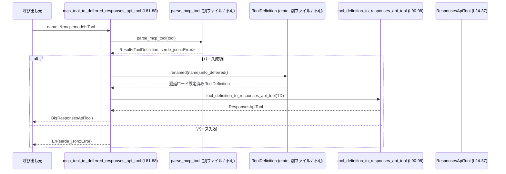

# tools/src/responses_api.rs

## 0. ざっくり一言

Dynamic/MCP ツール定義を「Responses API」用の JSON 表現にマッピングするためのデータ構造と変換関数を定義するモジュールです（responses_api.rs:L10-98）。

---

## 1. このモジュールの役割

### 1.1 概要

- このモジュールは、  
  - 内部表現や外部ライブラリが提供するツール定義（`DynamicToolSpec`, `rmcp::model::Tool`, `ToolDefinition`）を  
  - Responses API 形式の `ResponsesApiTool`／名前空間付きツール表現に変換する  
  役割を持ちます（responses_api.rs:L24-37, L64-90）。
- また、自由形式ツール `FreeformTool` と、ツール検索結果のための列挙型 `ToolSearchOutputTool` などのデータコンテナも提供します（responses_api.rs:L10-22, L39-62）。

### 1.2 アーキテクチャ内での位置づけ

このモジュールは「パーサ」から受け取った汎用 `ToolDefinition` を「Responses API 用の出力構造」に変換する中間レイヤとして位置づけられます（responses_api.rs:L2-4, L64-88, L90-98）。

```mermaid
graph TD
  A["DynamicToolSpec<br/>(codex_protocol)"] -->|parse_dynamic_tool<br/>(crate, 別ファイル / 不明)| B["ToolDefinition<br/>(crate, 別ファイル / 不明)"]
  C["rmcp::model::Tool"] -->|parse_mcp_tool<br/>(crate, 別ファイル / 不明)| B

  subgraph "本ファイル: responses_api.rs"
    B --> D["tool_definition_to_responses_api_tool (L90-98)"]
    D --> E["ResponsesApiTool (L24-37)"]

    E --> F["ToolSearchOutputTool::Function (L42-47)"]
    E --> G["ResponsesApiNamespaceTool::Function (L57-62)"]
    G --> H["ResponsesApiNamespace (L51-55)"]
  end
```

※ `parse_dynamic_tool`, `parse_mcp_tool`, `ToolDefinition`, `JsonSchema` の定義位置はこのチャンクには現れないため不明です（responses_api.rs:L1-4, L24, L34, L90）。

### 1.3 設計上のポイント

- **データコンテナ中心**  
  - すべての主要型が `Debug`, `Clone`, `Serialize`, `Deserialize` または `Serialize` を実装し、シリアライズ可能なデータコンテナとして設計されています（responses_api.rs:L10, L17, L24, L39-40, L50, L57-58）。
- **Serde を用いた JSON 互換設計**  
  - `ToolSearchOutputTool` と `ResponsesApiNamespaceTool` は `#[serde(tag = "type")]` によるタグ付き enum であり、JSON 上で `"type": "function"` / `"namespace"` などのフィールドを持つ表現になります（responses_api.rs:L40, L44-47, L58-61）。
  - `ResponsesApiTool.defer_loading` は `Option<bool>` で、`None` の場合は JSON に出力されず（`skip_serializing_if`）、`true` の場合のみ `"defer_loading": true` が出力されます（responses_api.rs:L31-34）。
  - `output_schema` は `#[serde(skip)]` によりシリアライズ／デシリアライズの対象から除外され、実行時のみ利用される内部情報です（responses_api.rs:L35-36）。
- **エラー処理方針**  
  - 変換関数は `Result<ResponsesApiTool, serde_json::Error>` を返し、パースエラーなどを `serde_json::Error` として呼び出し元に伝播します（responses_api.rs:L64-66, L72-75, L81-84）。
  - このファイル内には明示的な `panic!` や `unwrap` は存在しません（responses_api.rs:L1-103）。
- **状態と並行性**  
  - すべての型はイミュータブルなフィールドのみを持ち、グローバルな可変状態やスレッド同期プリミティブは使用していません（responses_api.rs:L11-22, L25-37, L51-55）。
  - 並行性に特化したロジックはこのファイルには現れません。

---

## 2. 主要な機能一覧

- Responses API 用のツール定義 `ResponsesApiTool` の提供（responses_api.rs:L24-37）
- ツール検索結果表現 `ToolSearchOutputTool`（関数 / 名前空間）の定義（responses_api.rs:L39-48）
- 名前空間付きツール群 `ResponsesApiNamespace` / `ResponsesApiNamespaceTool` の定義（responses_api.rs:L50-62）
- 自由形式ツール `FreeformTool` およびそのフォーマット `FreeformToolFormat` の定義（responses_api.rs:L10-22）
- 以下の入力を `ResponsesApiTool` に変換するユーティリティ関数群  
  - `DynamicToolSpec` → `ResponsesApiTool`（responses_api.rs:L64-70）  
  - `rmcp::model::Tool` ＋ 任意の名前 → `ResponsesApiTool`（即時ロード版／遅延ロード版）（responses_api.rs:L72-79, L81-88）  
  - 内部表現 `ToolDefinition` → `ResponsesApiTool`（responses_api.rs:L90-98）

---

## 3. 公開 API と詳細解説

### 3.1 型一覧（構造体・列挙体など）【コンポーネントインベントリー】

#### 構造体・列挙体

| 名前 | 種別 | 役割 / 用途 | 定義位置 |
|------|------|-------------|----------|
| `FreeformTool` | 構造体 | 自由形式のツール定義。`name`・`description`・フォーマット情報を保持します。 | responses_api.rs:L11-15 |
| `FreeformToolFormat` | 構造体 | 自由形式ツールのフォーマット詳細。`type`（種類）、`syntax`、`definition` を表現します。 | responses_api.rs:L18-22 |
| `ResponsesApiTool` | 構造体 | Responses API で利用される 1 つのツールを表現します。名前・説明・入力パラメータスキーマ・出力スキーマなどを保持します。 | responses_api.rs:L25-37 |
| `ToolSearchOutputTool` | enum | ツール検索結果の 1 要素を表し、単一の関数ツールか、名前空間付きツール集合かを区別します。`type` フィールドでタグ付きシリアライズされます。 | responses_api.rs:L42-48 |
| `ResponsesApiNamespace` | 構造体 | 名前空間のメタ情報（名前・説明）と、その下に属するツール一覧を保持します。 | responses_api.rs:L51-55 |
| `ResponsesApiNamespaceTool` | enum | 名前空間配下のツールを表す enum。現状は `Function(ResponsesApiTool)` のみを持ちますが、拡張の余地があります。 | responses_api.rs:L59-62 |

#### 外部依存型（このチャンクでは定義不明）

| 名前 | 出典 | 用途 | 備考 |
|------|------|------|------|
| `JsonSchema` | `crate` | `ResponsesApiTool.parameters` に使用される JSON スキーマ表現。詳細な構造はこのチャンクには現れません。 | responses_api.rs:L1, L34 |
| `ToolDefinition` | `crate` | 内部的なツール定義表現。Responses API 形式への変換元として利用されます。構造はこのチャンクには現れません。 | responses_api.rs:L2, L90 |
| `DynamicToolSpec` | `codex_protocol::dynamic_tools` | 動的ツール仕様。`dynamic_tool_to_responses_api_tool` の入力として使用されます。 | responses_api.rs:L5, L64-66 |
| `rmcp::model::Tool` | 外部クレート `rmcp` | MCP ツールの仕様。`mcp_tool_to_*` 関数の入力として使用されます。 | responses_api.rs:L74, L83 |
| `serde_json::Value` | `serde_json` | 出力スキーマ `output_schema` を表現する JSON 値。シリアライズからは除外されます。 | responses_api.rs:L8, L36 |

### 3.2 関数詳細（4件）

#### `dynamic_tool_to_responses_api_tool(tool: &DynamicToolSpec) -> Result<ResponsesApiTool, serde_json::Error>`

**概要**

- `DynamicToolSpec` を内部表現 `ToolDefinition` に変換し、それをさらに `ResponsesApiTool` に変換するラッパー関数です（responses_api.rs:L64-70）。
- Dynamic Tools API 由来のツール仕様を Responses API 形式に統一する入り口となります。

**引数**

| 引数名 | 型 | 説明 |
|--------|----|------|
| `tool` | `&DynamicToolSpec` | codex_protocol 由来の動的ツール仕様。詳細な構造はこのチャンクでは不明です（responses_api.rs:L5, L64-66）。 |

**戻り値**

- `Result<ResponsesApiTool, serde_json::Error>`  
  - `Ok`: 変換に成功した `ResponsesApiTool`（responses_api.rs:L64-70）。  
  - `Err`: `parse_dynamic_tool` 内で発生した JSON 関連エラー（`serde_json::Error`）。内容はこのチャンクには現れません。

**内部処理の流れ**

1. `parse_dynamic_tool(tool)` を呼び出し、`DynamicToolSpec` から `ToolDefinition` を生成します（responses_api.rs:L67-69）。  
   - `parse_dynamic_tool` 自体の実装はこのチャンクには現れません。
2. `?` 演算子により、パースに失敗した場合は即座に `Err(serde_json::Error)` を呼び出し元に返します（responses_api.rs:L67-69）。
3. 正常に `ToolDefinition` が得られた場合、それを `tool_definition_to_responses_api_tool` に渡し、`ResponsesApiTool` に変換します（responses_api.rs:L67-69）。
4. 変換結果を `Ok(...)` で包んで返します（responses_api.rs:L67-70）。

**Examples（使用例）**

Dynamic Tools の仕様から `ResponsesApiTool` を得る最小限の例です。`DynamicToolSpec` の具体的な構築方法はこのチャンクからは分からないため、コメントで省略しています。

```rust
use codex_protocol::dynamic_tools::DynamicToolSpec;
use tools::responses_api::dynamic_tool_to_responses_api_tool;

// どこかから DynamicToolSpec を取得する（詳細不明）
fn convert_dynamic(spec: &DynamicToolSpec) -> Result<tools::responses_api::ResponsesApiTool, serde_json::Error> {
    // DynamicToolSpec → ResponsesApiTool への変換
    dynamic_tool_to_responses_api_tool(spec) // 変換結果または serde_json::Error を返す
}
```

**Errors / Panics**

- **Errors**
  - `parse_dynamic_tool(tool)` が `Err(serde_json::Error)` を返した場合、そのエラーをそのまま返します（responses_api.rs:L67-69）。
- **Panics**
  - この関数内には `panic!`, `unwrap`, `expect` は存在せず、パニック条件はコードからは読み取れません（responses_api.rs:L64-70）。

**Edge cases（エッジケース）**

- `tool` が `parse_dynamic_tool` で解釈できない内容を持つ場合  
  → `Err(serde_json::Error)` が返される可能性があります（responses_api.rs:L67-69）。  
  具体的にどのような値が不正かは、このチャンクには現れません。
- `tool` が `null` になることは Rust の型システム上発生しません（参照型 `&DynamicToolSpec` のため）。

**使用上の注意点**

- エラー処理を行うため、`?` 演算子や `match` を用いて `Result` をハンドリングする必要があります。
- 変換後の `ResponsesApiTool.strict` は、後述の通り常に `false` に設定される点に注意が必要です（responses_api.rs:L94）。

---

#### `mcp_tool_to_responses_api_tool(name: String, tool: &rmcp::model::Tool) -> Result<ResponsesApiTool, serde_json::Error>`

**概要**

- MCP（Model Context Protocol）由来の `rmcp::model::Tool` を、指定された `name` でリネームした上で `ResponsesApiTool` に変換する関数です（responses_api.rs:L72-79）。

**引数**

| 引数名 | 型 | 説明 |
|--------|----|------|
| `name` | `String` | 変換後ツールに付与する名前。`ToolDefinition::renamed` に渡されます（responses_api.rs:L77）。 |
| `tool` | `&rmcp::model::Tool` | MCP ツール定義。詳細なフィールドはこのチャンクからは不明です（responses_api.rs:L74）。 |

**戻り値**

- `Result<ResponsesApiTool, serde_json::Error>`  
  - `Ok`: 変換済み `ResponsesApiTool`。  
  - `Err`: MCP ツールのパースや変換で発生した JSON 関連エラー。

**内部処理の流れ**

1. `parse_mcp_tool(tool)` を呼び出し、`rmcp::model::Tool` から `ToolDefinition` を生成します（responses_api.rs:L76-78）。
2. `?` 演算子により、失敗時は `Err(serde_json::Error)` を返します（responses_api.rs:L76-78）。
3. 成功時、得られた `ToolDefinition` に対して `.renamed(name)` を呼び出し、ツール名を引数 `name` に変更します（responses_api.rs:L77）。
   - `renamed` メソッドの詳細はこのチャンクには現れません。
4. その結果を `tool_definition_to_responses_api_tool` に渡し、`ResponsesApiTool` を構築します（responses_api.rs:L76-78）。
5. `Ok(...)` でラップして返却します（responses_api.rs:L76-79）。

**Examples（使用例）**

```rust
use rmcp::model::Tool as McpTool;
use tools::responses_api::{mcp_tool_to_responses_api_tool, ResponsesApiTool};

fn convert_mcp(mcp_tool: &McpTool) -> Result<ResponsesApiTool, serde_json::Error> {
    // "my_tool" という名前で MCP ツールを ResponsesApiTool に変換する
    mcp_tool_to_responses_api_tool("my_tool".to_string(), mcp_tool)
}
```

**Errors / Panics**

- **Errors**
  - `parse_mcp_tool(tool)` 内で発生した JSON 関連エラーが `Err` として返されます（responses_api.rs:L76-78）。
- **Panics**
  - この関数内にはパニックを起こすコードは見られません（responses_api.rs:L72-79）。

**Edge cases（エッジケース）**

- `name` が空文字列や重複名であっても、この関数内では特に検証を行っていません（responses_api.rs:L72-79）。  
  そのような値が許容されるかは、`ToolDefinition::renamed` の実装に依存し、このチャンクからは不明です。
- `tool` の内容が `parse_mcp_tool` で扱えない場合は `Err` が返ります。

**使用上の注意点**

- 名前上書きは常に行われるため、元の MCP ツール名を保持したい場合は、`name` に元の名前を渡すなど、呼び出し側で制御する必要があります（responses_api.rs:L77）。
- `name` の値が Responses API の仕様上有効かどうかの検証は本関数では行われておらず、呼び出し側で配慮する必要があります。

---

#### `mcp_tool_to_deferred_responses_api_tool(name: String, tool: &rmcp::model::Tool) -> Result<ResponsesApiTool, serde_json::Error>`

**概要**

- `mcp_tool_to_responses_api_tool` と同様に MCP ツールを変換しますが、`into_deferred()` を通すことで「遅延ロード（deferred）」なツールとしてマークするバリアントです（responses_api.rs:L81-88）。

**引数**

| 引数名 | 型 | 説明 |
|--------|----|------|
| `name` | `String` | リネーム後のツール名（responses_api.rs:L82）。 |
| `tool` | `&rmcp::model::Tool` | MCP ツール定義（responses_api.rs:L83）。 |

**戻り値**

- `Result<ResponsesApiTool, serde_json::Error>`（通常版と同様）。

**内部処理の流れ**

1. `parse_mcp_tool(tool)?` で MCP ツールを `ToolDefinition` に変換（responses_api.rs:L85-87）。
2. `.renamed(name)` でツール名を指定された `name` に変更（responses_api.rs:L86）。
3. `.into_deferred()` で遅延ロードを示すフラグなどを持つ内部表現に変換（responses_api.rs:L86）。  
   - `into_deferred` の詳細はこのチャンクには現れません。
4. その結果の `ToolDefinition` を `tool_definition_to_responses_api_tool` に渡し、`ResponsesApiTool` を生成（responses_api.rs:L85-87）。
5. `Ok(...)` で返却（responses_api.rs:L85-88）。

**Examples（使用例）**

```rust
use rmcp::model::Tool as McpTool;
use tools::responses_api::{mcp_tool_to_deferred_responses_api_tool, ResponsesApiTool};

fn convert_mcp_deferred(mcp_tool: &McpTool) -> Result<ResponsesApiTool, serde_json::Error> {
    // 遅延ロードフラグ付きの ResponsesApiTool を生成する
    mcp_tool_to_deferred_responses_api_tool("heavy_tool".to_string(), mcp_tool)
}
```

**Errors / Panics**

- エラー条件は `mcp_tool_to_responses_api_tool` と同様で、`parse_mcp_tool` 由来の `serde_json::Error` が返される可能性があります（responses_api.rs:L85-87）。
- パニックを誘発するコードは見当たりません。

**Edge cases（エッジケース）**

- 遅延ロードの具体的な意味（例えば、どのフィールドがどのように扱われるか）は `into_deferred` の実装に依存し、このチャンクには現れません（responses_api.rs:L86）。
- 生成される `ResponsesApiTool.defer_loading` は `Some(true)` になると考えられますが、その根拠は `ToolDefinition.defer_loading` の設定と `tool_definition_to_responses_api_tool` の挙動に依存し、このチャンク単体からは厳密には断定できません。

**使用上の注意点**

- 遅延ロードツールをどのように解決・ロードするかは、このモジュールでは扱われておらず、呼び出し側や他モジュールの設計に依存します。
- 通常版との違いは `ToolDefinition` 側の `into_deferred` を通している点のみであり、この関数自体は単純なラッパーです（responses_api.rs:L85-87）。

---

#### `tool_definition_to_responses_api_tool(tool_definition: ToolDefinition) -> ResponsesApiTool`

**概要**

- 内部表現 `ToolDefinition` を `ResponsesApiTool` に変換するコア関数です（responses_api.rs:L90-98）。
- 他の 3 つの公開関数はすべてこの関数を最終的に呼び出しており、Responses API 形式への変換ロジックの中核を担います（responses_api.rs:L67-69, L76-78, L85-87, L90-98）。

**引数**

| 引数名 | 型 | 説明 |
|--------|----|------|
| `tool_definition` | `ToolDefinition` | 内部ツール定義。`name`, `description`, `defer_loading`, `input_schema`, `output_schema` などのフィールドを持つことが暗示されています（responses_api.rs:L92-97）。詳細な構造はこのチャンクからは不明です。 |

**戻り値**

- `ResponsesApiTool`  
  - `name`, `description`, `parameters`, `output_schema` が `tool_definition` の対応するフィールドからコピーされます（responses_api.rs:L92-93, L96-97）。
  - `strict` は常に `false` で初期化されます（responses_api.rs:L94）。
  - `defer_loading` は `tool_definition.defer_loading.then_some(true)` で設定され、`true` のときだけ `Some(true)` になり、それ以外は `None` になります（responses_api.rs:L95）。

**内部処理の流れ**

1. `ResponsesApiTool` リテラルを構築し、そのフィールドに `tool_definition` の値を代入します（responses_api.rs:L91-97）。
   - `name`: `tool_definition.name` をそのままコピー（所有権移動）（responses_api.rs:L92）。
   - `description`: 同上（responses_api.rs:L93）。
   - `strict`: `false` 固定（responses_api.rs:L94）。
   - `defer_loading`: `tool_definition.defer_loading.then_some(true)`  
     → `defer_loading` が `true` の場合に `Some(true)`、`false` の場合に `None`（responses_api.rs:L95）。
   - `parameters`: `tool_definition.input_schema`（responses_api.rs:L96）。
   - `output_schema`: `tool_definition.output_schema`（responses_api.rs:L97）。
2. 構築した `ResponsesApiTool` を返します（responses_api.rs:L91-98）。

**Examples（使用例）**

`ToolDefinition` の具体的な構造は不明なため、抽象的な例になりますが、変換パターンは以下のようになります。

```rust
use tools::responses_api::{tool_definition_to_responses_api_tool, ResponsesApiTool};
use crate::ToolDefinition; // 実際のパスはこのチャンクには現れない

fn from_internal(def: ToolDefinition) -> ResponsesApiTool {
    // 内部の ToolDefinition から ResponsesApiTool を構築
    tool_definition_to_responses_api_tool(def)
}
```

**Errors / Panics**

- この関数は `Result` ではなく `ResponsesApiTool` を直接返し、内部でエラーを返す処理は持ちません（responses_api.rs:L90-98）。
- パニックを引き起こすコードも見当たりません。

**Edge cases（エッジケース）**

- `tool_definition.defer_loading` が `false` の場合  
  → `defer_loading` は `None` となり、シリアライズ時に `"defer_loading"` フィールドは出力されません（responses_api.rs:L31-34, L95）。
- `tool_definition.defer_loading` が `true` の場合  
  → `defer_loading` は `Some(true)` となり、シリアライズ時に `"defer_loading": true` が含まれます（responses_api.rs:L31-34, L95）。
- `strict` が常に `false` であるため、コメントにある「strict が true の場合の厳格なスキーマ検証」は、このファイル内ではまだ実装されていません（responses_api.rs:L28-31, L94）。

**使用上の注意点**

- `strict` フラグは現状固定値であり、`ToolDefinition` から伝播していません。そのため、「strict なツール」を扱いたい場合は、この関数または `ToolDefinition` 側を拡張する必要があります（responses_api.rs:L28-31, L94）。
- `output_schema` は `#[serde(skip)]` 付きのため、シリアライズされません（responses_api.rs:L35-36）。  
  外部クライアントに出力スキーマを渡したい場合は別の経路を用意する必要があります。

### 3.3 その他の関数

- このファイルには、上記 4 つ以外の公開関数・補助関数は存在しません（responses_api.rs:L64-90）。

---

## 4. データフロー

ここでは、MCP ツールから遅延ロード付き `ResponsesApiTool` を生成するフローを例に、関数呼び出しの流れを示します。

### MCP ツール → 遅延 ResponsesApiTool のフロー



この図から分かる要点（コードに基づく事実）:

- `mcp_tool_to_deferred_responses_api_tool` は、パースと名前変更・遅延化の 3 ステップを 1 つの `Result` にまとめて返すラッパーであることが分かります（responses_api.rs:L85-87）。
- 実際に `ResponsesApiTool` のフィールドを埋める処理は、すべて `tool_definition_to_responses_api_tool` に集中しています（responses_api.rs:L90-98）。
- エラーはすべて `parse_mcp_tool` 起点の `serde_json::Error` として扱われ、このファイル内で独自のエラー型は定義されていません（responses_api.rs:L64-66, L72-75, L81-84）。

---

## 5. 使い方（How to Use）

### 5.1 基本的な使用方法

DynamicToolSpec から Responses API ツール一覧を生成するシンプルな例です。

```rust
use codex_protocol::dynamic_tools::DynamicToolSpec;
use tools::responses_api::{
    dynamic_tool_to_responses_api_tool,
    ResponsesApiTool,
    ResponsesApiNamespace,
    ResponsesApiNamespaceTool,
};

fn build_namespace_from_dynamic(tools: &[DynamicToolSpec]) -> Result<ResponsesApiNamespace, serde_json::Error> {
    // 各 DynamicToolSpec を ResponsesApiTool に変換する
    let mut converted_tools: Vec<ResponsesApiNamespaceTool> = Vec::new(); // ベクタを準備

    for spec in tools {
        // 個々の DynamicToolSpec を変換
        let tool: ResponsesApiTool = dynamic_tool_to_responses_api_tool(spec)?; // 失敗時は早期 return
        // 名前空間配下の Function としてラップ
        converted_tools.push(ResponsesApiNamespaceTool::Function(tool));
    }

    // 名前空間を構築
    Ok(ResponsesApiNamespace {
        name: "dynamic".to_string(),           // 名前空間名
        description: "dynamic tools".to_string(), // 説明
        tools: converted_tools,                // 変換済みツール群
    })
}
```

この例では、以下の点が確認できます。

- `ResponsesApiNamespace` と `ResponsesApiNamespaceTool::Function` を組み合わせることで、名前空間付きのツール一覧を構築できること（responses_api.rs:L51-55, L59-61）。
- エラーは関数シグネチャで `Result<_, serde_json::Error>` として呼び出し元に伝播させています（responses_api.rs:L64-66）。

### 5.2 よくある使用パターン

- **MCP ツールを Responses API 形式にラップする**
  - 即時ロード版では `mcp_tool_to_responses_api_tool`（responses_api.rs:L72-79）。
  - 遅延ロード版では `mcp_tool_to_deferred_responses_api_tool`（responses_api.rs:L81-88）。
- **内部表現から直接変換する**
  - 既に `ToolDefinition` を持っている場合は、`tool_definition_to_responses_api_tool` を直接呼び出すことで、余分なパース処理を省略できます（responses_api.rs:L90-98）。

### 5.3 よくある間違い（想定されるもの）

コードから推測される、起こりうる誤用と正しい使い方の対比です。

```rust
use tools::responses_api::{ResponsesApiTool, tool_definition_to_responses_api_tool};
use crate::ToolDefinition;

// 誤りの例: strict を true に手動で設定しても、検証は行われない
fn wrong_strict_usage(def: ToolDefinition) -> ResponsesApiTool {
    let mut tool = tool_definition_to_responses_api_tool(def); // strict は false で初期化される
    tool.strict = true;                                       // コメントにある検証ロジックは未実装
    tool
}

// 推奨される扱い: strict を利用する前に、必要な検証を別途実装する
fn careful_strict_usage(def: ToolDefinition) -> ResponsesApiTool {
    let tool = tool_definition_to_responses_api_tool(def);
    // strict に関する仕様を満たす検証を呼び出し側で行う（ここでは擬似コード）
    // validate_strict_schema(&tool.parameters, &tool.output_schema);
    tool
}
```

※ `strict` が true の場合の仕様はコメントとして存在しますが（responses_api.rs:L28-31）、実際の検証ロジックは実装されていません。このため、単に `strict = true` にするだけでは期待する安全性は得られません。

### 5.4 使用上の注意点（まとめ）

- すべての変換関数は `serde_json::Error` を返す可能性があるため、エラー処理が必須です（responses_api.rs:L64-66, L72-75, L81-84）。
- `ResponsesApiTool.output_schema` はシリアライズ対象外であり（responses_api.rs:L35-36）、外部に送られる JSON には含まれません。
- `ResponsesApiTool.defer_loading` は `Some(true)` または `None` しか取り得ない実装になっており、`false` が明示的に出力されることはありません（responses_api.rs:L31-34, L95）。
- 並行性に関する特殊な考慮（スレッドセーフでない共有など）は、このファイルでは現れません。すべての型は単純なデータ構造です（responses_api.rs:L11-22, L25-37, L51-55）。

---

## 6. 変更の仕方（How to Modify）

### 6.1 新しい機能を追加する場合

- **新しいツール種別を名前空間に追加したい場合**
  1. `ResponsesApiNamespaceTool` enum に新しいバリアント（例: `Namespace(ResponsesApiNamespace)`）を追加します（responses_api.rs:L59-62）。
  2. 必要に応じて `ToolSearchOutputTool` に対応するバリアントを追加し、`#[serde(rename = "...")]` で JSON 表現を定義します（responses_api.rs:L42-47）。
  3. 追加した型を利用するコード（ツール検索や一覧生成処理）側を更新します。これらはこのチャンクには現れません。

- **strict モードをサポートしたい場合**
  1. `ToolDefinition` に strict 情報がある場合は、それを `tool_definition_to_responses_api_tool` で `ResponsesApiTool.strict` に反映する処理を追加します（responses_api.rs:L90-98）。
  2. コメントに示されている制約（`required` や `additional_properties` など）を検証する関数を実装し、`strict = true` の場合に呼び出します（responses_api.rs:L28-31）。

### 6.2 既存の機能を変更する場合

- **`defer_loading` の挙動を変えたい場合**
  - 現在は `tool_definition.defer_loading.then_some(true)` によって `true` のときのみフィールドがセットされています（responses_api.rs:L95）。
  - `false` を明示したい場合は `Option<bool>` をやめて `bool` に変更し、`#[serde(skip_serializing_if)]` を除去するなどの変更が考えられますが、既存の JSON との互換性に注意が必要です。

- **エラー型を詳細化したい場合**
  - 現在のシグネチャはすべて `serde_json::Error` 固定です（responses_api.rs:L64-66, L72-75, L81-84）。
  - 独自のエラー型を導入する場合は、各変換関数の戻り値型を変更し、`parse_*` 系関数のエラー型との整合性を取る必要があります。この詳細はこのチャンクには現れません。

- 変更時は、`responses_api_tests.rs`（テストコード）を更新し、想定する JSON との互換性が保たれているかを確認することが重要です（responses_api.rs:L101-103）。

---

## 7. 関連ファイル

| パス / 要素 | 役割 / 関係 |
|------------|------------|
| `tools/src/responses_api_tests.rs` | `#[cfg(test)]` でインポートされるテストモジュールです。`ResponsesApiTool` および変換関数の挙動を検証していると考えられますが、内容はこのチャンクには現れません（responses_api.rs:L101-103）。 |
| `crate::JsonSchema` | `ResponsesApiTool.parameters` に使用される JSON スキーマ型です。定義ファイルのパスはこのチャンクには現れません（responses_api.rs:L1, L34）。 |
| `crate::ToolDefinition` | 内部ツール定義。`tool_definition_to_responses_api_tool` の入力型であり、`parse_dynamic_tool` / `parse_mcp_tool` から生成されます（responses_api.rs:L2, L64-69, L72-79, L81-88, L90-98）。定義場所は不明です。 |
| `crate::parse_dynamic_tool` | `DynamicToolSpec` を `ToolDefinition` に変換する関数です（responses_api.rs:L3, L67-69）。実装はこのチャンクには現れません。 |
| `crate::parse_mcp_tool` | `rmcp::model::Tool` を `ToolDefinition` に変換する関数です（responses_api.rs:L4, L76-78, L85-87）。実装はこのチャンクには現れません。 |
| `codex_protocol::dynamic_tools::DynamicToolSpec` | Dynamic Tools API 由来のツール定義型で、`dynamic_tool_to_responses_api_tool` の入力として利用されます（responses_api.rs:L5, L64-66）。 |
| `rmcp::model::Tool` | MCP ツール定義。`mcp_tool_to_responses_api_tool` および `mcp_tool_to_deferred_responses_api_tool` の入力となります（responses_api.rs:L74, L83）。 |

---

## Bugs / Security（観点のみ）

- **strict フラグと未実装の検証ロジック**
  - コメントでは strict モード時のスキーマ要件が示されていますが（responses_api.rs:L28-31）、実際には `strict` が常に `false` に設定されており（responses_api.rs:L94）、検証ロジックも存在しません。
  - 将来 `strict = true` を許容するよう変更した場合、コメントに書かれた制約を守らないツール定義が通ってしまうと、想定外のスキーマが Responses API に露出する可能性があります。
- **シリアライズされない `output_schema`**
  - `#[serde(skip)]` により、`output_schema` は外部クライアントに送信されません（responses_api.rs:L35-36）。
  - 「スキーマは外部に見せない」という設計意図であれば安全性の向上に寄与しますが、外部側がスキーマを前提にバリデーションを行う設計と矛盾する可能性があります。この点は仕様と合わせて確認が必要です。

---

## Contracts / Edge Cases（まとめ）

- **契約（Contract）**
  - 変換関数は、入力ツール仕様が `parse_dynamic_tool` / `parse_mcp_tool` の想定するフォーマットに従っていることを前提とします（responses_api.rs:L67-69, L76-78, L85-87）。
  - `ResponsesApiTool` の `parameters` は有効な `JsonSchema` であることが期待されますが、ここでは検証していません（responses_api.rs:L34, L96）。
- **エッジケース**
  - 無効なツール仕様 → `serde_json::Error` を伴う `Err`（どのケースが無効かはこのチャンクには現れません）。
  - `defer_loading` が `false` → フィールド非出力（responses_api.rs:L31-34, L95）。
  - strict = true → 仕様上の制約はコメントのみに存在し、現実装では利用されていません（responses_api.rs:L28-31, L94）。

以上が、このファイルに基づいて確認できる公開 API・コアロジック・データフロー・契約条件の整理です。
