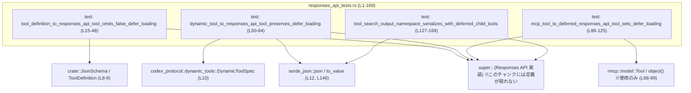
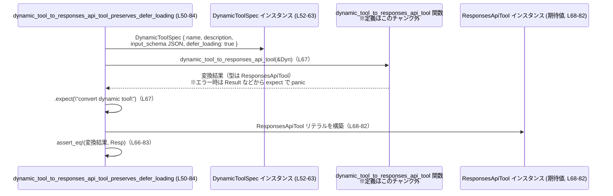

# tools/src/responses_api_tests.rs

## 0. ざっくり一言

`ResponsesApiTool` や `ResponsesApiNamespace` まわりの **変換ロジックとシリアライズ結果を検証するテスト集**です。  
特に `defer_loading` フラグの扱いと JSON Schema の変換・シリアライズの挙動を確認しています。

---

## 1. このモジュールの役割

### 1.1 概要

このモジュールは、次のような問題を検証しています（テストのみを含みます）。

- 各種ツール定義（`ToolDefinition` / `DynamicToolSpec` / `rmcp::model::Tool`）から `ResponsesApiTool` への変換時に、`defer_loading` や JSON Schema が期待通りにマッピングされるかを確認すること  
- `ToolSearchOutputTool::Namespace` と `ResponsesApiNamespace` / `ResponsesApiNamespaceTool` の **JSON シリアライズ結果**が期待どおりの形になるかを確認すること  

コアロジックはすべて `super` 側のモジュールにあり、このファイルはその **契約（Contract）を固定するテスト**として機能します。

### 1.2 アーキテクチャ内での位置づけ

このファイルはテストモジュールとして、上位モジュールの変換関数・型に依存しています。



※ `SuperMod` 側（`tool_definition_to_responses_api_tool` などの本体）の定義はこのチャンクには現れません。

### 1.3 設計上のポイント

コードから読み取れる設計上の特徴は次のとおりです。

- **契約ベースのテスト**  
  - `defer_loading` の値が `false` のときは **Option を `None` にしてシリアライズから省略**する（L15-48）  
  - `defer_loading` が `true` のときは **`Some(true)` として保持・シリアライズ**する（L50-84, L86-125, L127-169）
- **JSON Schema の一貫した変換**  
  - 入力側の JSON / スキーマ構造から `JsonSchema::object` に変換することを前提とした比較を行っています（L21-27, L37-43, L73-79, L118-121, L137-141）。
- **エラーハンドリングの姿勢**  
  - 変換関数は `expect(...)` を通じて呼ばれており、テストでは **エラーが決して発生しないこと**を前提とします（L67, L112, L146）。
- **状態を持たない検証**  
  - すべてのテストはローカルな値のみを生成し、副作用や共有状態は持ちません。並行性に関する懸念はありません。

---

## 2. 主要な機能一覧（テストケース）

このファイル内の主な関数（すべてテスト）です。

- `tool_definition_to_responses_api_tool_omits_false_defer_loading`:  
  `ToolDefinition.defer_loading == false` が `ResponsesApiTool.defer_loading == None` として扱われることを検証します（L15-48）。
- `dynamic_tool_to_responses_api_tool_preserves_defer_loading`:  
  `DynamicToolSpec.defer_loading == true` が `ResponsesApiTool.defer_loading == Some(true)` に変換されることを検証します（L50-84）。
- `mcp_tool_to_deferred_responses_api_tool_sets_defer_loading`:  
  MCP ツールを変換する際、`ResponsesApiTool.defer_loading` が `Some(true)` に強制されることを検証します（L86-125）。
- `tool_search_output_namespace_serializes_with_deferred_child_tools`:  
  `ToolSearchOutputTool::Namespace` シリアライズ結果に、子ツールの `defer_loading: true` が含まれることを検証します（L127-169）。

---

## 3. 公開 API と詳細解説

### 3.1 型一覧（このファイルで使用している主な型）

このファイル自身は新しい型を定義していませんが、テストで利用される型を整理します。

| 名前 | 種別 | 役割 / 用途 | 定義位置の情報 |
|------|------|-------------|----------------|
| `ResponsesApiTool` | 構造体 | Responses API で使用されるツール定義。`name` / `description` / `strict` / `defer_loading` / `parameters` / `output_schema` を持つことが、初期化式から読み取れます（L32-45, L68-82, L113-123, L132-143）。 | 定義は `super` モジュール側（このチャンクには現れません） |
| `ResponsesApiNamespace` | 構造体 | ツールの名前空間（namespace）を表現。`name` / `description` / `tools` フィールドがあることがわかります（L129-144）。 | 同上 |
| `ResponsesApiNamespaceTool` | 列挙体 | 名前空間内の要素。少なくとも `Function(ResponsesApiTool)` バリアントを持ちます（L132-143）。 | 同上 |
| `ToolSearchOutputTool` | 列挙体 | 検索結果として返されるツール。少なくとも `Namespace(ResponsesApiNamespace)` バリアントを持ちます（L129-144）。 | 同上 |
| `JsonSchema` | 列挙体/構造体 | JSON Schema を表す型。`JsonSchema::object` コンストラクタを持ち、プロパティ群・required 配列・additionalProperties 相当を受け取ることがわかります（L21-27, L37-43, L73-79, L118-121, L137-141）。 | `crate::JsonSchema`（定義はこのチャンク外） |
| `ToolDefinition` | 構造体 | 内部的なツール定義。`name` / `description` / `input_schema` / `output_schema` / `defer_loading` フィールドを持ちます（L18-30）。 | `crate::ToolDefinition`（定義はこのチャンク外） |
| `DynamicToolSpec` | 構造体 | 動的ツール仕様。`name` / `description` / `input_schema` / `defer_loading` を持ちます（L52-63）。 | `codex_protocol::dynamic_tools::DynamicToolSpec`（L10） |
| `rmcp::model::Tool` | 構造体 | MCP プロトコルのツール定義。`name` / `title` / `description` / `input_schema` / `output_schema` / `annotations` / `execution` / `icons` / `meta` が存在します（L88-105）。 | `rmcp` クレート内（このチャンクには定義が現れません） |

### 3.2 関数詳細

#### `tool_definition_to_responses_api_tool_omits_false_defer_loading()`

**概要**

`ToolDefinition` から `ResponsesApiTool` への変換において、`defer_loading: false` が **`None` として扱われる（=シリアライズ上は省略される）**ことを検証するテストです（L15-48）。

**引数**

なし（テスト関数なので、すべて関数内で値を生成します）。

**戻り値**

- 戻り値型: `()`（テスト用関数）
- 役割: アサーションにすべて成功すれば何も返さず終了し、失敗すれば panic します。

**内部処理の流れ**

1. `ToolDefinition` を構築  
   - `name`, `description`, `input_schema`, `output_schema`, `defer_loading: false` を設定します（L18-30）。
   - `input_schema` は `JsonSchema::object` で `order_id: string` プロパティと required、`additionalProperties: false` 相当を指定します（L21-27）。
2. `tool_definition_to_responses_api_tool` を呼び出し  
   - `ToolDefinition` を引数として `tool_definition_to_responses_api_tool(...)` を呼びます（L17-31）。
3. 期待される `ResponsesApiTool` を構築  
   - 同じ `name` / `description` / `parameters` / `output_schema` を持ち、`strict: false`, `defer_loading: None` を持つ構造体リテラルを作成します（L32-45）。
4. `assert_eq!` により両者を比較  
   - 実際の変換結果と期待値が完全一致することを検証します（L17-47）。

**Examples（使用例 / 契約の読み取り）**

このテストから、変換関数の契約を次のように読み取ることができます。

```rust
// ToolDefinition から ResponsesApiTool への変換例（L18-31, L32-45 を要約）
let tool_def = ToolDefinition {
    name: "lookup_order".to_string(),
    description: "Look up an order".to_string(),
    input_schema: /* JsonSchema::object(...) */,
    output_schema: Some(json!({"type": "object"})),
    defer_loading: false,
};

let responses_tool = tool_definition_to_responses_api_tool(tool_def);

// 契約（テストから読み取れる仕様）:
assert_eq!(responses_tool.defer_loading, None); // false は保持されず、None として扱われる
```

**Errors / Panics**

- このテスト関数内では明示的な `expect` や `unwrap` は呼ばれていません。  
- `tool_definition_to_responses_api_tool` 内で panic する可能性はありますが、その内部実装はこのチャンクには現れていません。  
- `assert_eq!` が失敗した場合にはテストが panic します（L17-47）。

**Edge cases（エッジケース）**

- `defer_loading: false` のときの挙動のみを検証しており、`true` や `None` のケースはこのテストでは扱っていません。
- `input_schema` のプロパティ構成（必須項目、additionalProperties）は期待値と一致する必要があります（L21-27 と L37-43）。

**使用上の注意点（契約としての意味）**

- 呼び出し側から見て、`ToolDefinition.defer_loading == false` は **「特別な意味を持たないデフォルト値」であり、結果の `ResponsesApiTool` では `None` として扱われる**ことが前提になります。
- `defer_loading` を明示的に `false` として残したいといった仕様は、このテストからは確認できません（許容されるかどうかは不明です）。

---

#### `dynamic_tool_to_responses_api_tool_preserves_defer_loading()`

**概要**

`DynamicToolSpec` から `ResponsesApiTool` への変換において、`defer_loading: true` が **`Some(true)` として保持されること**と、JSON Schema が `JsonSchema` に正しくマップされることを検証します（L50-84）。

**引数**

なし。

**戻り値**

- 型: `()`（テスト用）
- 役割: アサーションが通れば成功、失敗または `.expect` 失敗時に panic します。

**内部処理の流れ**

1. `DynamicToolSpec` の構築（L52-64）  
   - `name`, `description`, `input_schema`（raw JSON）、`defer_loading: true` を設定。
2. `dynamic_tool_to_responses_api_tool` を呼び出し（L67）  
   - 引数は `&tool` 参照です。
   - 戻り値に対して `.expect("convert dynamic tool")` を呼び出し、変換失敗時に panic することを明示します。
3. 期待される `ResponsesApiTool` を構築（L68-82）  
   - `name`, `description` をコピーし、`strict: false`、`defer_loading: Some(true)`、`parameters` に `JsonSchema::object` を使用、`output_schema: None` を設定。
4. `assert_eq!` で比較（L66-83）。

**Examples（使用例 / 契約の読み取り）**

```rust
// DynamicToolSpec から ResponsesApiTool への変換パターン（L52-63, L67-82 を要約）
let dyn_tool = DynamicToolSpec {
    name: "lookup_order".to_string(),
    description: "Look up an order".to_string(),
    input_schema: json!({
        "type": "object",
        "properties": { "order_id": { "type": "string" } },
        "required": ["order_id"],
        "additionalProperties": false,
    }),
    defer_loading: true,
};

let responses_tool = dynamic_tool_to_responses_api_tool(&dyn_tool)
    .expect("convert dynamic tool");

// テストから読み取れる契約:
assert_eq!(responses_tool.defer_loading, Some(true)); // true は保持される
```

**Errors / Panics**

- `dynamic_tool_to_responses_api_tool(&tool).expect("...")`  
  - 変換に失敗すると `expect` により panic します（L67）。
  - このことから、通常運用では **変換エラーが起こりうるが、ここではそれが起こらないことを前提**にしていると解釈できます。
- `assert_eq!` の失敗も panic になります（L66-83）。

**Edge cases**

- `defer_loading: true` のケースのみカバーしており、`false` や `None` 相当の入力はこのテストだけでは確認できません。
- `input_schema` の JSON に `additionalProperties: false` が含まれており、`JsonSchema::object(..., Some(false.into()))` に正しく変換されていることを前提としています（L55-62, L73-79）。

**使用上の注意点**

- 呼び出し側は、`DynamicToolSpec.defer_loading` を設定することで、`ResponsesApiTool.defer_loading` が **同じ真偽値で保持される**ことを期待できます。
- 変換結果をすぐに利用するコードでは `expect` ではなく、エラー内容を扱うロジックが必要になる可能性がありますが、その詳細はこのチャンクからは分かりません。

---

#### `mcp_tool_to_deferred_responses_api_tool_sets_defer_loading()`

**概要**

MCP ツール (`rmcp::model::Tool`) を Responses API 用ツール (`ResponsesApiTool`) に変換する関数が、**`defer_loading` を強制的に `Some(true)` に設定する**ことを検証します（L86-125）。

**引数**

なし。

**戻り値**

- 型: `()`（テスト用）

**内部処理の流れ**

1. `rmcp::model::Tool` の構築（L88-105）  
   - `name`, `description`, `input_schema`（Arc + `rmcp::model::object(json!(...))`）、その他のフィールドは `None` を指定。
2. `mcp_tool_to_deferred_responses_api_tool` の呼び出し（L107-112）  
   - 第 1 引数: `"mcp__codex_apps__lookup_order".to_string()`（最終的な `ResponsesApiTool.name` に使われます）（L108-110, L114）。
   - 第 2 引数: `&tool` 参照。
   - 戻り値に `.expect("convert deferred tool")` を適用し、変換失敗時に panic。
3. 期待される `ResponsesApiTool` の構築（L113-123）  
   - `name` は第 1 引数の文字列を採用。
   - `description` は MCP ツールの `description` を採用。
   - `strict: false`, `defer_loading: Some(true)`、`parameters` に `JsonSchema::object(...)`、`output_schema: None`。
4. `assert_eq!` による比較（L107-124）。

**Examples（使用例 / 契約の読み取り）**

```rust
// MCP ツールから ResponsesApiTool への変換例（L88-105, L107-123 を要約）
let mcp_tool = rmcp::model::Tool {
    name: "lookup_order".to_string().into(),
    title: None,
    description: Some("Look up an order".to_string().into()),
    input_schema: /* rmcp::model::object(json!(...)) */,
    output_schema: None,
    annotations: None,
    execution: None,
    icons: None,
    meta: None,
};

let responses_tool = mcp_tool_to_deferred_responses_api_tool(
    "mcp__codex_apps__lookup_order".to_string(), // 表示名・識別子として使われる
    &mcp_tool,
).expect("convert deferred tool");

// テストから読み取れる契約:
assert_eq!(responses_tool.name, "mcp__codex_apps__lookup_order");
assert_eq!(responses_tool.defer_loading, Some(true)); // MCP ツールは常に deferred として扱う前提
```

**Errors / Panics**

- 変換失敗時に `.expect("convert deferred tool")` が panic します（L112）。
- `assert_eq!` が失敗しても panic します（L107-124）。

**Edge cases**

- `rmcp::model::Tool` の `defer_loading` 相当の情報はこの構造体には見えません。テストでは **常に `Some(true)` に設定されることのみ**を確認しており、入力側に応じて変わるかどうかは不明です。
- `name` が明示的に別引数で上書きされる（元の `Tool.name` ではなく第 1 引数の文字列が使われる）ことを前提としています（L108-110, L114）。

**使用上の注意点**

- MCP 経由のツールは常に「遅延ロードされるもの」として扱われる前提になっていると解釈できます（ただし実装の詳細はこのチャンクにはありません）。
- 呼び出し側が、`ResponsesApiTool.name` にどの文字列を使うかは第 1 引数で制御します。

---

#### `tool_search_output_namespace_serializes_with_deferred_child_tools()`

**概要**

`ToolSearchOutputTool::Namespace` に `defer_loading: Some(true)` な子ツールを含めた場合の **JSON シリアライズ結果**を検証します（L127-169）。  
子ツールの `defer_loading` が `true` として出力され、不要なフィールドは省略されることを確認します。

**引数**

なし。

**戻り値**

- 型: `()`（テスト用）

**内部処理の流れ**

1. `ResponsesApiNamespace` を `ToolSearchOutputTool::Namespace` でラップして構築（L129-144）  
   - `name`: `"mcp__codex_apps__calendar"`（L130）。  
   - `description`: `"Plan events"`（L131）。  
   - `tools`: ベクタに 1 要素、`ResponsesApiNamespaceTool::Function(ResponsesApiTool { ... })` を格納（L132-143）。
   - 子の `ResponsesApiTool` では `defer_loading: Some(true)`、`parameters` に空オブジェクトの `JsonSchema::object(Default::default(), None, None)` を設定（L136-141）。
2. `serde_json::to_value(namespace)` を実行し、`Value` に変換（L146）。
3. 期待される JSON 値を `json!({ ... })` で構築（L150-167）。
4. `assert_eq!` で JSON 全体が一致することを検証（L148-168）。

**Examples（使用例 / 契約の読み取り）**

```rust
// Namespace の構築とシリアライズ例（L129-146, L150-167 を要約）
let namespace = ToolSearchOutputTool::Namespace(ResponsesApiNamespace {
    name: "mcp__codex_apps__calendar".to_string(),
    description: "Plan events".to_string(),
    tools: vec![
        ResponsesApiNamespaceTool::Function(ResponsesApiTool {
            name: "create_event".to_string(),
            description: "Create a calendar event.".to_string(),
            strict: false,
            defer_loading: Some(true),
            parameters: JsonSchema::object(
                Default::default(), // 空の properties
                None,               // required なし
                None,               // additionalProperties は省略
            ),
            output_schema: None,
        })
    ],
});

let value = serde_json::to_value(namespace).expect("serialize namespace");

// テストから読み取れるシリアライズ仕様:
assert_eq!(value, json!({
    "type": "namespace",
    "name": "mcp__codex_apps__calendar",
    "description": "Plan events",
    "tools": [
        {
            "type": "function",
            "name": "create_event",
            "description": "Create a calendar event.",
            "strict": false,
            "defer_loading": true,
            "parameters": {
                "type": "object",
                "properties": {}
            }
        }
    ]
}));
```

**Errors / Panics**

- `serde_json::to_value` の失敗時に `.expect("serialize namespace")` が panic します（L146）。
- `assert_eq!` の失敗も panic します（L148-168）。

**Edge cases**

- `output_schema: None` が JSON に現れないこと（省略されること）を前提としています（期待値 JSON に `output_schema` キーはありません、L150-167）。
- `JsonSchema::object(..., None, None)` の場合に、`required` や `additionalProperties` が JSON に現れないことを前提としています（L137-141, L160-163）。
- 子ツールが 1 つだけのケースのみを検証しています。複数ツールや別のバリアント (`Namespace` 以外) の挙動はこのテストからは分かりません。

**使用上の注意点**

- クライアント側は `defer_loading` が `true` のツールが JSON に `defer_loading: true` として明示されることを前提にできます。
- オプションフィールド（`output_schema` など）が `None` の場合は JSON に含まれないため、クライアントは「キーが存在しない＝未指定・デフォルト」を意味すると解釈する必要があります。

---

### 3.3 その他の関数

このファイルには、上記 4 つ以外の関数定義はありません。

| 関数名 | 役割（1 行） | 定義位置 |
|--------|--------------|----------|
| （なし） | – | – |

---

## 4. データフロー

代表的なシナリオとして、`DynamicToolSpec` から `ResponsesApiTool` への変換テスト（`dynamic_tool_to_responses_api_tool_preserves_defer_loading`）のデータフローを図示します。



このフローから分かる要点:

- テストは **入力構造体 → 変換関数 → 変換結果** という 1 方向のデータフローのみを扱い、副作用はありません。
- `expect` の利用により、「正常に変換されること自体」も契約の一部として検証しています。

---

## 5. 使い方（How to Use）

このファイルはテスト専用ですが、テストコードは **公開 API（変換関数・型）の使い方や契約**を示す実例としても利用できます。

### 5.1 基本的な使用方法（変換関数の呼び出し）

#### `ToolDefinition` → `ResponsesApiTool`

```rust
// ToolDefinition を作成する（L18-31 を簡略化）
let tool_def = ToolDefinition {
    name: "lookup_order".to_string(),
    description: "Look up an order".to_string(),
    input_schema: JsonSchema::object(
        BTreeMap::from([(
            "order_id".to_string(),
            JsonSchema::string(None),
        )]),
        Some(vec!["order_id".to_string()]),
        Some(false.into()),
    ),
    output_schema: Some(json!({ "type": "object" })),
    defer_loading: false, // false → None として扱われる想定
};

// 変換関数を呼び出す（L17-31 と同じ）
let responses_tool = tool_definition_to_responses_api_tool(tool_def);

// responses_tool は ResponsesApiTool であり、defer_loading は None になる想定です。
```

#### `DynamicToolSpec` → `ResponsesApiTool`

```rust
let dynamic_spec = DynamicToolSpec {
    name: "lookup_order".to_string(),
    description: "Look up an order".to_string(),
    input_schema: json!({
        "type": "object",
        "properties": { "order_id": { "type": "string" } },
        "required": ["order_id"],
        "additionalProperties": false,
    }),
    defer_loading: true,
};

let responses_tool = dynamic_tool_to_responses_api_tool(&dynamic_spec)
    .expect("convert dynamic tool"); // テストでは expect を前提（L67）

// defer_loading は Some(true) であることが期待されます（L72-72）。
```

#### `rmcp::model::Tool` → `ResponsesApiTool`（MCP ツール）

```rust
let mcp_tool = rmcp::model::Tool { /* L88-105 と同様に構築 */ };

let responses_tool = mcp_tool_to_deferred_responses_api_tool(
    "mcp__codex_apps__lookup_order".to_string(),
    &mcp_tool,
).expect("convert deferred tool"); // L108-112

// responses_tool.name は第 1 引数の文字列、defer_loading は Some(true) になる想定です（L114-118）。
```

### 5.2 よくある使用パターン

このテストから読み取れる使用パターン:

- **JSON スキーマをそのまま JSON で持つ型からの変換**  
  - `DynamicToolSpec.input_schema: serde_json::Value` → `JsonSchema::object(...)`  
  - `rmcp::model::Tool.input_schema` → `JsonSchema::object(...)`
- **「デフォルト値は省略する」パターン**  
  - `defer_loading: false` → `None`（省略）、`true` → `Some(true)`（明示）  
  - `JsonSchema::object(..., None, None)` → シリアライズ時に `required` / `additionalProperties` を省略（L137-141, L160-163）。

### 5.3 よくある間違い（このテストから推測できるもの）

コードから推測される注意点を挙げます（あくまでテストから読み取れる範囲に限ります）。

```rust
// 誤りそうな例: defer_loading = false をそのまま保持する実装
// （テスト L15-48 からは、false を None に変換することが前提）
let responses_tool = ResponsesApiTool {
    // ...
    defer_loading: Some(false), // ← テストの期待とは異なる可能性が高い
};

// 正しいパターン（テストの期待値と一致）
let responses_tool = ResponsesApiTool {
    // ...
    defer_loading: None, // false はデフォルト値として省略
};
```

### 5.4 使用上の注意点（まとめ）

- `defer_loading` の意味
  - `false` は「特別な指定なし」と同義であり、`ResponsesApiTool` 側では `None` として扱われることがテストから読み取れます（L15-48）。
  - `true` の場合は `Some(true)` として保持・シリアライズされます（L50-84, L127-169）。
- JSON シリアライズの仕様
  - オプションフィールドが `None` の場合、JSON にはキー自体が出力されません（特に `output_schema`、`required`、`additionalProperties`）（L150-167）。
- エラーハンドリング
  - 変換関数は `.expect(...)` を通じて利用されていますが、実運用コードでは `Result` / `Option` のまま扱い、エラーを適切に処理する必要があります（テストでは「常に成功する」前提を検証しています）。

---

## 6. 変更の仕方（How to Modify）

### 6.1 新しい機能を追加する場合（このテストファイルの観点）

新しい変換ロジックやフィールドを Responses API に追加する場合、このファイルにテストを追加することで契約を固定できます。

1. **変換関数を追加する**  
   - `super` 側に新しい変換関数を実装します（このチャンクにはそのコードはありません）。
2. **典型ケースのテストを追加**  
   - 新関数の入力となる構造体をテスト関数内で構築し、期待される `ResponsesApiTool` や JSON を `assert_eq!` で比較します。
3. **エッジケースのテストを追加**  
   - `defer_loading` やオプションフィールドが `None` / `true` / `false` / 未設定など、境界値ごとにテストを追加することが考えられます。

### 6.2 既存の機能を変更する場合

`tool_definition_to_responses_api_tool` などの既存変換ロジックを変更する場合に、このテストファイルをどう見るかを整理します。

- **影響範囲の確認**
  - 変換関数の返却値（`defer_loading` の扱い、JSON Schema の変換など）を変えると、対応するテストが失敗します（例: L15-48, L50-84, L86-125）。
- **前提条件・契約の再定義**
  - `false` を `None` に変換する契約を変更する場合は、その旨に沿ってテストの期待値も更新する必要があります。
- **関連するテストの見直し**
  - JSON シリアライズ仕様を変更した場合（たとえば、`additionalProperties` を常に出力するように変更した場合など）、L150-167 の期待値 JSON を合わせて修正する必要があります。

---

## 7. 関連ファイル

このモジュールと密接に関係する型・関数は、すべて他モジュールに定義されています。ファイルパスはこのチャンクからは分かりませんが、モジュールパスとして列挙します。

| パス / モジュール | 役割 / 関係 |
|------------------|------------|
| `super::tool_definition_to_responses_api_tool` | `ToolDefinition` → `ResponsesApiTool` の変換ロジック。本ファイルの `tool_definition_to_responses_api_tool_omits_false_defer_loading` で契約をテストしています（L15-48）。 |
| `super::dynamic_tool_to_responses_api_tool` | `DynamicToolSpec` → `ResponsesApiTool` の変換ロジック。`defer_loading: true` の保存と JSON Schema の変換がテストされています（L50-84）。 |
| `super::mcp_tool_to_deferred_responses_api_tool` | `rmcp::model::Tool` → `ResponsesApiTool` の変換ロジック。MCP ツールを常に遅延ロード (`defer_loading: Some(true)`) として扱うことをテストしています（L86-125）。 |
| `super::ResponsesApiTool` | Responses API で利用されるツール定義構造体。本ファイルの全テストで期待値として使用されます（L32-45, L68-82, L113-123, L132-143）。 |
| `super::ResponsesApiNamespace` | ツール名前空間の構造体。`ToolSearchOutputTool::Namespace` の内部として使われています（L129-144）。 |
| `super::ResponsesApiNamespaceTool` | 名前空間内のツールや要素を表す列挙体。少なくとも `Function(ResponsesApiTool)` バリアントを持つことがテストから分かります（L132-143）。 |
| `super::ToolSearchOutputTool` | ツール検索結果の列挙体。`Namespace` バリアントを通じて名前空間を返せることがテストされています（L129-144）。 |
| `crate::JsonSchema` | JSON Schema 抽象化。入力スキーマ変換とシリアライズ仕様（特に `required` や `additionalProperties` の省略）を確認するために使用されています（L21-27, L37-43, L73-79, L118-121, L137-141）。 |
| `crate::ToolDefinition` | 内部ツール定義。Responses API への変換元として使用されます（L18-30）。 |
| `codex_protocol::dynamic_tools::DynamicToolSpec` | 外部プロトコルの動的ツール仕様。変換元として利用されます（L52-63）。 |
| `rmcp::model::Tool` | MCP プロトコルのツール定義。MCP ツール → Responses API ツール変換の入力として利用されます（L88-105）。 |

このように、このファイルは Responses API 変換ロジックの **契約と JSON 表現を固定するテスト集**として位置づけられています。
