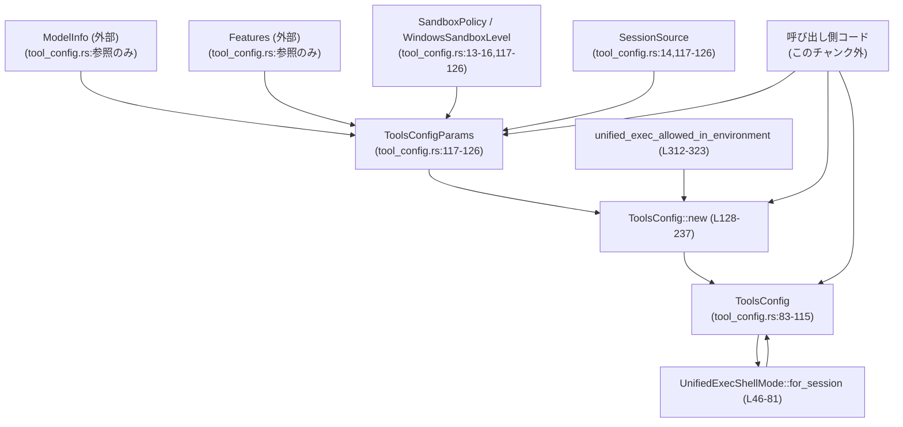
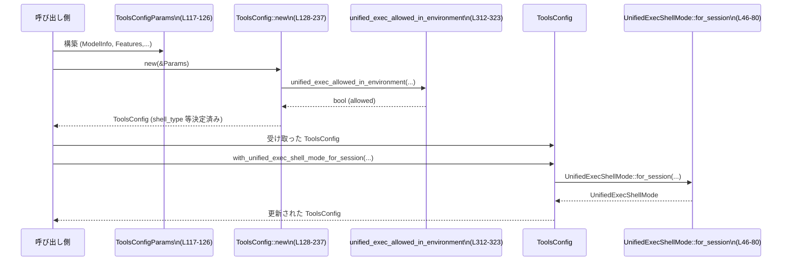

# tools/src/tool_config.rs コード解説

## 0. ざっくり一言

このモジュールは、**モデル・機能フラグ・実行環境** に基づいて「どのツール（シェル、Web検索、画像生成、コラボ、マルチエージェント等）をどの形で有効化するか」をまとめた `ToolsConfig` を構築するための設定ロジックを提供します（`tool_config.rs:L83-115`, `L128-237`）。

---

## 1. このモジュールの役割

### 1.1 概要

- このモジュールは、**1 セッションごとのツール利用方針** を決めるために存在し、`ToolsConfig` 構造体としてそれを表現します（`tool_config.rs:L83-115`）。
- 入力として `ModelInfo`, `Features`, サンドボックス設定などを受け取り（`ToolsConfigParams`, `tool_config.rs:L117-126`）、どのツールを有効化するか、どのシェル実行モードを使うかを決定します（`ToolsConfig::new`, `tool_config.rs:L128-237`）。
- シェル実行については `UnifiedExecShellMode` と `ShellCommandBackendConfig` により、「通常のシェル」「Zsh フォーク方式」などのモードを切り替えます（`tool_config.rs:L19-23`, `L34-38`, `L46-81`）。

### 1.2 アーキテクチャ内での位置づけ

主に「モデル情報・機能フラグ → ツール設定」という一方向の依存関係を持ちます。



> `UnifiedExecShellMode::for_session (L46-81)` は別途 `ToolsConfig::with_unified_exec_shell_mode_for_session (L280-293)` から利用されるパターンです。

### 1.3 設計上のポイント

- **純粋な設定オブジェクト**  
  - `ToolsConfig` はフィールドのみから成る設定用の構造体で、`#[derive(Debug, Clone)]` により値のコピーが容易になっています（`tool_config.rs:L83-83`）。
  - 内部に `Cell` / `RefCell` / `Mutex` などの内部可変性・同期プリミティブは見当たらず、このファイル内では単なる値オブジェクトとして扱われています。

- **ビルダー的 API**  
  - `ToolsConfig::new` で基礎設定を計算し、`with_...` 系メソッドでオプション的な上書きや追加設定を行うビルダーパターンになっています（`tool_config.rs:L239-305`）。

- **機能フラグ駆動の判定**  
  - 各ツールの有効/無効は `Features::enabled(Feature::...)` によって制御されます（例: `include_code_mode`, `tool_config.rs:L141-142`）。
  - モデル側の能力（`supports_search_tool`, `input_modalities` など）とも組み合わせて最終的な可否を決めています（`tool_config.rs:L151-152`, `L308-310`）。

- **環境・サンドボックスを考慮したシェルモード**  
  - Windows / Unix か、サンドボックスレベル、`SandboxPolicy` に応じて Unified Exec が許可されるかを別関数で判定しています（`unified_exec_allowed_in_environment`, `tool_config.rs:L312-323`）。
  - Zsh フォークモードは Unix かつ Zsh 利用時のみ、かつ指定パスが `AbsolutePathBuf` へ変換できた場合に限って有効化されます（`tool_config.rs:L53-76`）。

- **エラーハンドリング**  
  - このファイル内では `Result` 型は直接返さず、`AbsolutePathBuf::try_from` のエラーを `inspect_err` でログ警告を出しつつ無視し、フォールバックとして `UnifiedExecShellMode::Direct` を選択しています（`tool_config.rs:L58-70`, `L72-79`）。
  - それ以外は主にブール値・`Option` を用いた分岐で、「利用不可ならフラグを false / None にする」という方針です。

- **並行性**  
  - このファイル内にはスレッド生成や非同期 (`async`) などの並行処理はなく、すべて同期的・副作用の少ない判定ロジックに留まっています（I/O は `tracing::warn!` ログのみ、`tool_config.rs:L59-61`, `L64-68`）。

---

## 2. 主要な機能一覧

このモジュールが提供する主な機能を列挙します。

- シェルバックエンド選択: `ShellCommandBackendConfig` により、クラシックか Zsh フォークかを指定（`tool_config.rs:L19-23`, `L164-169`）。
- 統一シェル実行モード選択: `UnifiedExecShellMode` と `for_session` で Direct / Zsh フォークを判定（`tool_config.rs:L34-38`, `L46-81`）。
- ツール利用設定オブジェクト構築: `ToolsConfig::new` により、モデル・機能フラグ・環境から包括的なツール設定を構築（`tool_config.rs:L128-237`）。
- ツール設定の後からのカスタマイズ: `with_...` 系メソッドで、エージェント種別説明や Web 検索設定、Unified Exec モードなどを上書き（`tool_config.rs:L239-305`）。
- Code モード内ネスト用設定生成: `for_code_mode_nested_tools` で、コードモード内から他ツールを安全に呼び出すために `code_mode_*` を無効化したサブ設定を生成（`tool_config.rs:L300-305`）。
- 画像生成サポート判定: `supports_image_generation` で、モデルが画像入力モダリティを持つかどうかから画像生成ツール可否を判定（`tool_config.rs:L308-310`）。
- Unified Exec 許可判定: `unified_exec_allowed_in_environment` で、OS とサンドボックス設定から Unified Exec を許可するかを判定（`tool_config.rs:L312-323`）。

---

## 3. 公開 API と詳細解説

### 3.1 型一覧（構造体・列挙体など）

#### コンポーネントインベントリー（型）

| 名前 | 種別 | 役割 / 用途 | 定義位置 |
|------|------|-------------|----------|
| `ShellCommandBackendConfig` | enum | シェルコマンドの実行バックエンド（Classic / ZshFork）を表現します。 | `tool_config.rs:L19-23` |
| `ToolUserShellType` | enum | ユーザーのシェルタイプ（Zsh, Bash, PowerShell, Sh, Cmd）を表現します。`UnifiedExecShellMode::for_session` の分岐に利用されます。 | `tool_config.rs:L25-32` |
| `UnifiedExecShellMode` | enum | 実際にどのシェル実行モードを使うか（直接実行 / Zsh フォーク）を表現します。 | `tool_config.rs:L34-38` |
| `ZshForkConfig` | struct | Zsh フォークモードで必要な zsh バイナリとラッパー exe の絶対パスを保持します。 | `tool_config.rs:L40-44` |
| `ToolsConfig` | struct | あるセッションで利用可能なツール群と各種フラグ（シェルモード、Web 検索、画像生成、コラボ、マルチエージェント等）をまとめた設定オブジェクトです。 | `tool_config.rs:L83-115` |
| `ToolsConfigParams<'a>` | struct | `ToolsConfig::new` に渡す入力一式（モデル情報、利用可能モデル一覧、機能フラグ、環境情報）をまとめた構造体です。 | `tool_config.rs:L117-126` |

#### コンポーネントインベントリー（関数・メソッド）

| 名前 | 種別 | 役割 / 用途 | 定義位置 |
|------|------|-------------|----------|
| `UnifiedExecShellMode::for_session` | 関連関数 | バックエンド種別・ユーザーシェル種別・パス情報から、`UnifiedExecShellMode` を決定します。 | `tool_config.rs:L46-80` |
| `ToolsConfig::new` | 関連関数 | `ToolsConfigParams` をもとに `ToolsConfig` を構築するメインエントリです。 | `tool_config.rs:L128-237` |
| `ToolsConfig::with_agent_type_description` | メソッド | エージェントタイプの説明文を設定した新しい `ToolsConfig` を返します。 | `tool_config.rs:L239-242` |
| `ToolsConfig::with_spawn_agent_usage_hint` | メソッド | エージェント生成の利用ヒント表示フラグを上書きします。 | `tool_config.rs:L244-247` |
| `ToolsConfig::with_spawn_agent_usage_hint_text` | メソッド | エージェント生成の利用ヒントテキストを設定します。 | `tool_config.rs:L249-255` |
| `ToolsConfig::with_hide_spawn_agent_metadata` | メソッド | 子エージェントのメタデータを隠すかどうかのフラグを上書きします。 | `tool_config.rs:L257-260` |
| `ToolsConfig::with_allow_login_shell` | メソッド | ログインシェルの利用を許可するかどうかを上書きします。 | `tool_config.rs:L262-265` |
| `ToolsConfig::with_has_environment` | メソッド | 環境（ファイルシステムなど）が利用可能かどうかのフラグを上書きします。 | `tool_config.rs:L267-270` |
| `ToolsConfig::with_unified_exec_shell_mode` | メソッド | `UnifiedExecShellMode` を直接指定して上書きします。 | `tool_config.rs:L272-278` |
| `ToolsConfig::with_unified_exec_shell_mode_for_session` | メソッド | ユーザーシェル・パス情報から `UnifiedExecShellMode::for_session` を呼び出し、その結果で上書きします。 | `tool_config.rs:L280-293` |
| `ToolsConfig::with_web_search_config` | メソッド | Web 検索の詳細設定 (`WebSearchConfig`) を設定します。 | `tool_config.rs:L295-297` |
| `ToolsConfig::for_code_mode_nested_tools` | メソッド | コードモードからネストされたツール呼び出し用に、`code_mode_enabled` 系フラグを無効化した `ToolsConfig` を生成します。 | `tool_config.rs:L300-305` |
| `supports_image_generation` | 関数 | モデルが画像モダリティをサポートしているかを判定します。 | `tool_config.rs:L308-310` |
| `unified_exec_allowed_in_environment` | 関数 | OS・サンドボックス設定に基づいて Unified Exec を許可するか判定します。 | `tool_config.rs:L312-323` |

> `can_request_original_image_detail` や `codex_utils_pty::conpty_supported` などは外部シンボルであり、このチャンクには実装が現れません。

---

### 3.2 関数詳細（主要 6 件）

#### `UnifiedExecShellMode::for_session(...) -> Self`

```rust
pub fn for_session(
    shell_command_backend: ShellCommandBackendConfig,
    user_shell_type: ToolUserShellType,
    shell_zsh_path: Option<&PathBuf>,
    main_execve_wrapper_exe: Option<&PathBuf>,
) -> Self
```

**概要**

- シェルコマンドバックエンド・ユーザーのシェル種別・Zsh 関連パス情報から、  
  実行モード `UnifiedExecShellMode::{Direct,ZshFork}` を決定します（`tool_config.rs:L46-80`）。
- 条件を満たさない場合やパス変換に失敗した場合は、安全側に倒して `Direct` を返します。

**引数**

| 引数名 | 型 | 説明 |
|--------|----|------|
| `shell_command_backend` | `ShellCommandBackendConfig` | シェルコマンドバックエンドの構成（`Classic` / `ZshFork`）。`ToolsConfig::new` で決定されて渡される想定です（`tool_config.rs:L164-169`）。 |
| `user_shell_type` | `ToolUserShellType` | 実際のユーザーシェル種別。ここでは Zsh フォークを許可するかの判定に使われます（`tool_config.rs:L55`）。 |
| `shell_zsh_path` | `Option<&PathBuf>` | zsh バイナリのパス。`Some` なら Zsh フォーク候補、`None` なら Zsh フォーク不可です（`tool_config.rs:L50-51`, `L56-57`）。 |
| `main_execve_wrapper_exe` | `Option<&PathBuf>` | execve ラッパー exe のパス。同上で `Some` の場合のみ Zsh フォーク候補です。 |

**戻り値**

- `UnifiedExecShellMode::ZshFork(ZshForkConfig)` か `UnifiedExecShellMode::Direct`。
- Zsh フォーク条件を満たす場合のみ `ZshFork` を返し、それ以外は `Direct` です（`tool_config.rs:L72-79`）。

**内部処理の流れ**

1. コンパイル時の `cfg!(unix)` が true かをチェックします（`tool_config.rs:L53`）。
2. `shell_command_backend` が `ZshFork` であることを確認します（`tool_config.rs:L54`）。
3. `user_shell_type` が `ToolUserShellType::Zsh` であることを `matches!` で確認します（`tool_config.rs:L55`）。
4. `shell_zsh_path` と `main_execve_wrapper_exe` がともに `Some` であることを `let (Some(...), Some(...))` で確認します（`tool_config.rs:L56-57`）。
5. 各パスを `AbsolutePathBuf::try_from` で絶対パス型に変換します。変換エラー時は `tracing::warn!` で警告を出しつつ `Err` を保持し、if 条件は満たされなくなります（`tool_config.rs:L58-70`）。
6. すべての条件が満たされた場合のみ `ZshFork(ZshForkConfig { ... })` を返し（`tool_config.rs:L72-76`）、そうでなければ `Direct` を返します（`tool_config.rs:L77-79`）。

**Examples（使用例）**

```rust
use std::path::PathBuf;
use tools::tool_config::{
    ShellCommandBackendConfig, ToolUserShellType, UnifiedExecShellMode,
};

// 例: Unix 環境で Zsh フォークを有効にするケース
fn build_shell_mode_for_zsh() -> UnifiedExecShellMode {
    let backend = ShellCommandBackendConfig::ZshFork;           // Zsh フォークバックエンドを指定
    let user_shell = ToolUserShellType::Zsh;                    // ユーザーシェルは Zsh と判定済み

    let zsh_path = PathBuf::from("/usr/bin/zsh");               // zsh のパス（例）
    let wrapper_exe = PathBuf::from("/usr/local/bin/execve");   // ラッパー exe（例）

    UnifiedExecShellMode::for_session(
        backend,
        user_shell,
        Some(&zsh_path),
        Some(&wrapper_exe),
    )                                                            // 条件を満たせば ZshFork(...)
}
```

**Errors / Panics**

- 関数自体は `Result` ではなく `Self` を直接返します。
- `AbsolutePathBuf::try_from` のエラーは `inspect_err` でログに出されるのみで、パニックもエラー伝播も行いません（`tool_config.rs:L58-70`）。
- この関数内には `unwrap` や `panic!` は存在せず、パニックの可能性はコードからは読み取れません。

**Edge cases（エッジケース）**

- **非 Unix 環境** (`cfg!(unix)` が false): 常に `Direct` を返します（`tool_config.rs:L53` 条件が満たされないため）。
- `shell_command_backend != ZshFork`: たとえ Zsh かつパスが渡されていても `Direct` になります（`tool_config.rs:L54`）。
- `user_shell_type` が `Zsh` 以外: `Direct` が返されます（`tool_config.rs:L55`）。
- どちらか一方のパスが `None`: `let (Some(...), Some(...))` が失敗し、`Direct` になります（`tool_config.rs:L56-57`）。
- パス変換失敗 (`AbsolutePathBuf::try_from` が `Err`): ログ警告後、if 条件が崩れるため `Direct` を返します（`tool_config.rs:L58-71`）。

**使用上の注意点**

- この関数だけでは `shell_command_backend` は決まりません。通常は `ToolsConfig::new` が決めた値を渡す想定です（`tool_config.rs:L164-169`）。
- Zsh フォークモードにしたい場合は、**Unix 環境・Zsh シェル・両パス指定済み・絶対パス化成功** のすべてを満たす必要があります。
- パス変換に失敗すると静かに `Direct` にフォールバックするため、Zsh フォークを期待している場合は `tracing` ログ監視が重要です。

---

#### `ToolsConfig::new(params: &ToolsConfigParams<'_>) -> Self`

**概要**

- モデル・機能フラグ・セッションソース・サンドボックス設定などから、**そのセッションで有効なツール群を総合的に決定**し `ToolsConfig` を構築します（`tool_config.rs:L128-237`）。

**引数**

| 引数名 | 型 | 説明 |
|--------|----|------|
| `params` | `&ToolsConfigParams<'_>` | モデル情報・利用可能モデル一覧・機能フラグ・画像生成認可・Web 検索モード・セッションソース・サンドボックス情報をまとめた構造体です（`tool_config.rs:L117-126`,`L130-138`）。 |

**戻り値**

- そのセッションで利用可能と判定されたツールやフラグを含む `ToolsConfig` インスタンスを返します（`tool_config.rs:L205-236`）。

**内部処理の流れ**

1. `ToolsConfigParams` を分解してローカル変数に束縛（`tool_config.rs:L130-139`）。
2. 各種 `Feature` フラグに基づき、機能ごとの include フラグを計算（`include_code_mode`, `include_js_repl` など、`tool_config.rs:L140-150`）。
3. モデルがサーチツールをサポートし、かつ `Feature::ToolSearch` が有効な場合に `include_search_tool` を true とする（`tool_config.rs:L151-152`）。
4. ツールサジェストは `ToolSuggest`・`Apps`・`Plugins` の全てが有効な場合に true（`tool_config.rs:L153-155`）。
5. 画像生成ツール可否は、(1) `image_generation_tool_auth_allowed` が true、(2) `Feature::ImageGeneration` が有効、(3) モデルが画像モダリティを持つ、の AND で判定（`tool_config.rs:L159-161`, `L308-310`）。
6. シェルバックエンドは `Feature::ShellTool` と `Feature::ShellZshFork` から `ShellCommandBackendConfig::{Classic,ZshFork}` を決定（`tool_config.rs:L164-169`）。
7. `unified_exec_allowed_in_environment` を呼び出し、環境的に Unified Exec が許可されるか判定（`tool_config.rs:L170-174`, `L312-323`）。
8. `shell_type` は以下の優先度で決定（`tool_config.rs:L175-190`）:
   - ShellTool 無効 → `Disabled`
   - ShellZshFork 有効 → `ShellCommand`
   - UnifiedExec 有効かつ `unified_exec_allowed` → `UnifiedExec` or `ShellCommand` (conpty の可否で分岐, `tool_config.rs:L180-184`)
   - モデル指定が `UnifiedExec` だが環境で不可 → `ShellCommand`
   - 上記以外 → `model_info.shell_type` を採用
9. `model_info.apply_patch_tool_type` と `Feature::ApplyPatchFreeform` から `apply_patch_tool_type` を決定（`tool_config.rs:L192-196`）。
10. `SessionSource` が特定の SubAgent で、ラベルが `"agent_job:"` プレフィックス付きなら `agent_jobs_worker_tools` を有効化（`tool_config.rs:L198-203`）。
11. 上記で計算した値をすべて含めて `ToolsConfig` を構築して返却（`tool_config.rs:L205-236`）。

**Examples（使用例）**

```rust
use codex_features::{Features, Feature};
use codex_protocol::openai_models::{ModelInfo, ModelPreset, ConfigShellToolType};
use codex_protocol::config_types::{WebSearchMode, WebSearchConfig, WindowsSandboxLevel};
use codex_protocol::protocol::{SandboxPolicy, SessionSource};
use tools::tool_config::{ToolsConfig, ToolsConfigParams};

// 実際のプロジェクトでは ModelInfo / Features は別モジュールで構築される前提
fn build_tools_config(
    model_info: ModelInfo,          // モデル情報
    features: Features,             // 有効な機能フラグセット
) -> ToolsConfig {
    let available_models: Vec<ModelPreset> = vec![];    // 簡略化のため空配列
    let web_search_mode = Some(WebSearchMode::Default); // 例: デフォルトモード
    let sandbox_policy = SandboxPolicy::DangerFullAccess;
    let params = ToolsConfigParams {
        model_info: &model_info,
        available_models: &available_models,
        features: &features,
        image_generation_tool_auth_allowed: true,       // 認可済みとする
        web_search_mode,
        session_source: SessionSource::Client,          // 例: クライアント起点
        sandbox_policy: &sandbox_policy,
        windows_sandbox_level: WindowsSandboxLevel::Disabled,
    };

    ToolsConfig::new(&params)                           // 設定を構築
}
```

**Errors / Panics**

- この関数自体は `Result` ではなく `Self` を直接返します。
- 内部での分岐はすべてブールロジックと `matches!` であり、`unwrap` / `expect` / `panic!` は使われていません。
- `unified_exec_allowed_in_environment` も純粋なブール式であり、パニックの可能性はコードからは確認できません（`tool_config.rs:L312-323`）。
- したがって、この関数はエラーを返さず、入力に応じて最善と思われるフラグ構成を返す設計になっています。

**Edge cases（エッジケース）**

- **Shell 関連機能が全て無効** (`Feature::ShellTool` 無効): `shell_type` は `Disabled` になります（`tool_config.rs:L175-177`）。
- **モデルが `UnifiedExec` 指定だが環境で禁止**: `shell_type` は `ShellCommand` にフォールバックします（`tool_config.rs:L185-187`）。
- **画像生成認可フラグが false**: モデルや機能フラグが許可していても `image_gen_tool` は false のままです（`tool_config.rs:L159-161`）。
- **`web_search_mode` が `None`**: `ToolsConfig` の `web_search_mode` も `None` になり、`web_search_config` も `None` で初期化されます（`tool_config.rs:L213-214`）。
- **SubAgent だがラベルが `agent_job:` で始まらない**: `agent_jobs_worker_tools` は false のままです（`tool_config.rs:L198-203`）。

**使用上の注意点**

- `ToolsConfig` のフィールドはすべて `pub` なので、呼び出し後に直接書き換えることも可能ですが、  
  一貫性維持の観点からは `with_...` メソッドを通じて変更する方が意図が明確になります。
- ここでの決定ロジックは **Feature フラグとモデル情報に強く依存**しているため、新しいツールやフラグを追加する場合は、この関数に分岐を追加する必要があります。
- セキュリティ上重要な Unified Exec や Shell ツールの有効化条件を変更する場合は、`unified_exec_allowed_in_environment` と `shell_type` 決定ロジックをセットで確認する必要があります。

---

#### `ToolsConfig::with_unified_exec_shell_mode_for_session(...) -> Self`

```rust
pub fn with_unified_exec_shell_mode_for_session(
    mut self,
    user_shell_type: ToolUserShellType,
    shell_zsh_path: Option<&PathBuf>,
    main_execve_wrapper_exe: Option<&PathBuf>,
) -> Self
```

**概要**

- 既存の `ToolsConfig` に対し、ユーザーシェル情報とパス情報を元に `UnifiedExecShellMode::for_session` を呼び出し、`unified_exec_shell_mode` フィールドを上書きします（`tool_config.rs:L280-293`）。

**引数**

| 引数名 | 型 | 説明 |
|--------|----|------|
| `self` | `self` (所有権) | 変更元となる `ToolsConfig` インスタンス。所有権がムーブされます。 |
| `user_shell_type` | `ToolUserShellType` | ユーザーシェルの種別。Zsh かどうか等で分岐します。 |
| `shell_zsh_path` | `Option<&PathBuf>` | zsh バイナリのパス。 |
| `main_execve_wrapper_exe` | `Option<&PathBuf>` | execve ラッパー exe のパス。 |

**戻り値**

- `unified_exec_shell_mode` を更新した新しい `ToolsConfig` を返します（`tool_config.rs:L286-292`）。

**内部処理**

1. `UnifiedExecShellMode::for_session` を呼び出し、`self.shell_command_backend` と引数からモードを計算（`tool_config.rs:L286-291`）。
2. その結果を `self.unified_exec_shell_mode` に代入（`tool_config.rs:L286-291`）。
3. 更新した `self` を返す（`tool_config.rs:L292`）。

**使用例**

```rust
use std::path::PathBuf;
use tools::tool_config::{ToolsConfig, ToolUserShellType};

fn configure_shell_mode(mut cfg: ToolsConfig) -> ToolsConfig {
    let user_shell = ToolUserShellType::Zsh;                 // Zsh ユーザー
    let zsh_path = PathBuf::from("/usr/bin/zsh");
    let wrapper = PathBuf::from("/usr/local/bin/execve_wrapper");

    cfg.with_unified_exec_shell_mode_for_session(
        user_shell,
        Some(&zsh_path),
        Some(&wrapper),
    )                                                        // unified_exec_shell_mode を更新
}
```

**Errors / Panics**

- 内部で `UnifiedExecShellMode::for_session` を呼ぶのみであり、その関数にパニックは確認されていません（前節参照）。
- 本メソッド自体もパニックするようなコードは含みません（`tool_config.rs:L280-293`）。

**Edge cases**

- `self.shell_command_backend` が `Classic` の場合、`UnifiedExecShellMode::for_session` は常に `Direct` を返すため、何を渡しても Unified Exec / Zsh フォークにはなりません。
- パスが渡されていなかったり変換に失敗した場合も、結果は `Direct` になります（前述の `for_session` の挙動）。

**使用上の注意点**

- `ToolsConfig::new` では `unified_exec_shell_mode` は常に `Direct` で初期化されています（`tool_config.rs:L209`）。  
  したがって Zsh フォークモードを実際に使いたい場合、呼び出し側でこのメソッドまたは `with_unified_exec_shell_mode` を使って上書きする必要があります。
- `self` をムーブして返す型なので、**メソッドチェーンでの利用**が想定されています（例: `ToolsConfig::new(...).with_unified_exec_shell_mode_for_session(...)`）。

---

#### `ToolsConfig::for_code_mode_nested_tools(&self) -> Self`

```rust
pub fn for_code_mode_nested_tools(&self) -> Self
```

**概要**

- 既存の `ToolsConfig` をクローンし、**コードモード内からネストされたツールを使う**ために `code_mode_enabled` と `code_mode_only_enabled` を無効化した設定を返します（`tool_config.rs:L300-305`）。

**引数**

| 引数名 | 型 | 説明 |
|--------|----|------|
| `&self` | `&ToolsConfig` | 元となる設定。クローン元として使用され、変更はされません。 |

**戻り値**

- `self` のクローンに対して `code_mode_enabled` と `code_mode_only_enabled` を false にした新しい `ToolsConfig`（`tool_config.rs:L301-304`）。

**内部処理**

1. `self.clone()` で `ToolsConfig` をコピー（`tool_config.rs:L301`）。
2. クローン側の `code_mode_enabled` と `code_mode_only_enabled` を false に設定（`tool_config.rs:L302-303`）。
3. クローンを返す（`tool_config.rs:L304`）。

**使用例**

```rust
use tools::tool_config::ToolsConfig;

// 例: コードモードのメイン設定から、ツール呼び出し専用の設定を作る
fn nested_tools_config(cfg: &ToolsConfig) -> ToolsConfig {
    cfg.for_code_mode_nested_tools()                 // code_mode_* が false になった設定
}
```

**Errors / Panics**

- `clone` は `#[derive(Clone)]` による実装であり、パニックの可能性はコードからは確認できません（`tool_config.rs:L83`）。
- その他にパニックにつながる処理はありません。

**Edge cases**

- 元の `code_mode_enabled` / `code_mode_only_enabled` の値にかかわらず、戻り値では必ず false になります。
- 他のフィールドはすべて `self` と同一で、変更されません。

**使用上の注意点**

- 元の `ToolsConfig` は変更されないため、安全に何度でも呼び出すことができます。
- このメソッドは `code_mode_*` のみを変更するので、ネストされたツールが他の制限（例えば `has_environment` や `shell_type`）を引き継ぐ点に注意が必要です。

---

#### `supports_image_generation(model_info: &ModelInfo) -> bool`

**概要**

- モデル情報の `input_modalities` に `InputModality::Image` が含まれるかどうかで、**画像生成ツールをサポートしているか**を判定します（`tool_config.rs:L308-310`）。

**引数**

| 引数名 | 型 | 説明 |
|--------|----|------|
| `model_info` | `&ModelInfo` | モデルの能力を表す外部構造体。ここでは `input_modalities` のみ参照されます。 |

**戻り値**

- `true` なら画像モダリティをサポートしている（画像生成ツール可）、`false` ならサポートしていないと解釈されます。

**内部処理**

- `model_info.input_modalities.contains(&InputModality::Image)` をそのまま返すのみ（`tool_config.rs:L309`）。

**使用例**

```rust
use codex_protocol::openai_models::{ModelInfo, InputModality};

fn can_use_image_tool(info: &ModelInfo) -> bool {
    // この関数と同じロジックを直接使う例
    info.input_modalities.contains(&InputModality::Image)
}
```

**Errors / Panics**

- `contains` はコレクションのメソッドであり、通常パニックしません。
- `model_info` が `None` になる可能性はなく、参照として渡されるため、ヌルポインタの問題もありません。

**Edge cases**

- `input_modalities` が空: 常に `false` になります。
- `Image` 以外のモダリティのみ: `false`。
- 複数モダリティ（例: `Text` + `Image`）: `true`。

**使用上の注意点**

- この関数単体では、認可（`image_generation_tool_auth_allowed`）や `Feature::ImageGeneration` を考慮していません。実際にツールを有効化する判断は `ToolsConfig::new` 内で行われます（`tool_config.rs:L159-161`）。

---

#### `unified_exec_allowed_in_environment(...) -> bool`

```rust
fn unified_exec_allowed_in_environment(
    is_windows: bool,
    sandbox_policy: &SandboxPolicy,
    windows_sandbox_level: WindowsSandboxLevel,
) -> bool
```

**概要**

- OS が Windows かどうか・Windows サンドボックスレベル・`SandboxPolicy` に基づき、**Unified Exec 機能を許可するかどうか**を判定します（`tool_config.rs:L312-323`）。

**引数**

| 引数名 | 型 | 説明 |
|--------|----|------|
| `is_windows` | `bool` | 実行環境が Windows かどうか。`ToolsConfig::new` では `cfg!(target_os = "windows")` が渡されています（`tool_config.rs:L171`）。 |
| `sandbox_policy` | `&SandboxPolicy` | サンドボックス方針（DangerFullAccess / ExternalSandbox など）。 |
| `windows_sandbox_level` | `WindowsSandboxLevel` | Windows サンドボックスの詳細レベル。ここでは Disabled かどうかのみが参照されます（`tool_config.rs:L318`）。 |

**戻り値**

- Unified Exec を許可するなら `true`、そうでなければ `false`。

**内部処理**

- 条件式は次の否定です（`tool_config.rs:L317-322`）:

  ```rust
  !(is_windows
    && windows_sandbox_level != WindowsSandboxLevel::Disabled
    && !matches!(
        sandbox_policy,
        SandboxPolicy::DangerFullAccess | SandboxPolicy::ExternalSandbox { .. }
    ))
  ```

- つまり、「Windows かつ サンドボックスレベルが有効 かつ ポリシーが DangerFullAccess / ExternalSandbox 以外」の場合だけ **禁止**（false）で、それ以外は許可（true）という意味になります。

**使用例**

```rust
use codex_protocol::config_types::WindowsSandboxLevel;
use codex_protocol::protocol::SandboxPolicy;
use tools::tool_config::unified_exec_allowed_in_environment;

fn example() {
    let is_windows = cfg!(target_os = "windows");    // コンパイル時判定
    let policy = SandboxPolicy::DangerFullAccess;    // 例: フルアクセス
    let level = WindowsSandboxLevel::Disabled;       // サンドボックス無効

    let allowed = unified_exec_allowed_in_environment(is_windows, &policy, level);
    // この例では allowed == true
}
```

**Errors / Panics**

- 純粋なブール計算のみで、パニックにつながる処理はありません。

**Edge cases**

- `is_windows == false`: サンドボックス設定に関わらず常に `true`（許可）になります。
- `windows_sandbox_level == Disabled`: サンドボックスが無効なので常に `true`。
- `is_windows == true` かつ `windows_sandbox_level != Disabled` かつ `sandbox_policy` が  
  `DangerFullAccess` または `ExternalSandbox { .. }` の場合: `true`（許可）。
- Windows かつ サンドボックスレベル有効 かつ `DangerFullAccess/ExternalSandbox` 以外のポリシー: `false`（不許可）。

**使用上の注意点**

- Windows 以外では常に許可されるため、必要に応じて他 OS 用の制限を追加する場合はこの関数の条件式を変更する必要があります。
- セキュリティ上、`SandboxPolicy` の新しいバリアントを追加する場合には、この関数の `matches!` にも反映させる必要があります。

---

### 3.3 その他の関数・メソッド

`ToolsConfig` の `with_...` メソッドはすべて「`self` を受け取って特定フィールドを変更し、`self` を返す」という共通パターンです（`tool_config.rs:L239-297`）。

| 関数名 | 役割（1 行） | 定義位置 |
|--------|--------------|----------|
| `ToolsConfig::with_agent_type_description` | `agent_type_description` を指定した文字列に上書きします。 | `tool_config.rs:L239-242` |
| `ToolsConfig::with_spawn_agent_usage_hint` | エージェント生成の利用ヒントを表示するかどうかを上書きします。 | `tool_config.rs:L244-247` |
| `ToolsConfig::with_spawn_agent_usage_hint_text` | 利用ヒントとして表示するテキスト (`Option<String>`) を設定します。 | `tool_config.rs:L249-255` |
| `ToolsConfig::with_hide_spawn_agent_metadata` | Spawn されたエージェントのメタデータを非表示にするかどうかを上書きします。 | `tool_config.rs:L257-260` |
| `ToolsConfig::with_allow_login_shell` | ログインシェル利用許可フラグを上書きします。 | `tool_config.rs:L262-265` |
| `ToolsConfig::with_has_environment` | 「環境（ファイルシステム等）があるかどうか」を表すフラグを上書きします。 | `tool_config.rs:L267-270` |
| `ToolsConfig::with_unified_exec_shell_mode` | `UnifiedExecShellMode` を直接指定して上書きします。 | `tool_config.rs:L272-278` |
| `ToolsConfig::with_web_search_config` | `web_search_config` を `Option<WebSearchConfig>` で設定します。 | `tool_config.rs:L295-297` |

これらはすべて同じパターンで、パニックやエラーは発生せず、単にフィールドを差し替えて `self` を返します。

---

## 4. データフロー

ここでは代表的なシナリオとして、「セッション開始時に `ToolsConfig` を構築し、その後シェルモードをユーザーごとに調整する」データフローを説明します。

1. 呼び出し側が `ModelInfo`, `Features`, `SandboxPolicy` などから `ToolsConfigParams` を構成（`tool_config.rs:L117-126`）。
2. `ToolsConfig::new` が呼ばれ、各 Feature とモデル能力・環境情報からツールフラグと `shell_type`, `shell_command_backend` を計算（`tool_config.rs:L128-190`）。
3. 返された `ToolsConfig` に対して、ユーザーシェルタイプと実際の zsh / ラッパー exe のパス情報に基づき、`with_unified_exec_shell_mode_for_session` を呼び出す（`tool_config.rs:L280-293`）。
4. その結果得られた `ToolsConfig` を、実際のツール実行ロジックが参照してどのツールを出すか決定します（このチャンクには実装は現れません）。



---

## 5. 使い方（How to Use）

### 5.1 基本的な使用方法

セッション開始時に `ToolsConfig` を構築し、一部設定を上書きする最小限の例です。

```rust
use std::path::PathBuf;
use codex_features::{Features, Feature};
use codex_protocol::openai_models::{ModelInfo, ModelPreset};
use codex_protocol::config_types::{WebSearchMode, WindowsSandboxLevel};
use codex_protocol::protocol::{SandboxPolicy, SessionSource};
use tools::tool_config::{
    ToolsConfig, ToolsConfigParams, ToolUserShellType,
};

fn setup_tools_config(
    model_info: ModelInfo,               // モデル情報
    available_models: Vec<ModelPreset>,  // 利用可能モデル一覧
    features: Features,                  // 有効な機能フラグセット
) -> ToolsConfig {
    let sandbox_policy = SandboxPolicy::DangerFullAccess;      // 例: 制限なしポリシー
    let params = ToolsConfigParams {
        model_info: &model_info,
        available_models: &available_models,
        features: &features,
        image_generation_tool_auth_allowed: true,              // 画像生成認可
        web_search_mode: Some(WebSearchMode::Default),         // Web 検索モード
        session_source: SessionSource::Client,                 // クライアント起点
        sandbox_policy: &sandbox_policy,
        windows_sandbox_level: WindowsSandboxLevel::Disabled,  // Windows サンドボックス無効
    };

    let base_cfg = ToolsConfig::new(&params);                  // 基本設定を構築

    // 例: Unix + Zsh ユーザーなら Zsh フォークモードを設定
    let user_shell = ToolUserShellType::Zsh;
    let zsh_path = PathBuf::from("/usr/bin/zsh");
    let wrapper_exe = PathBuf::from("/usr/local/bin/execve_wrapper");

    base_cfg
        .with_agent_type_description("default agent".to_string())    // 追加メタ情報
        .with_unified_exec_shell_mode_for_session(
            user_shell,
            Some(&zsh_path),
            Some(&wrapper_exe),
        )
}
```

### 5.2 よくある使用パターン

1. **Code モード内からのネスト呼び出し**

   コードモードで動作するツールから、さらにツールを呼びたい場合に `for_code_mode_nested_tools` を使用します。

   ```rust
   fn nested_tools(cfg: &ToolsConfig) {
       let nested_cfg = cfg.for_code_mode_nested_tools();   // code_mode_* が false になった設定
       // nested_cfg を使って別のツールを呼び出す…
   }
   ```

2. **Web 検索設定の上書き**

   同じセッション内で Web 検索の設定を変更したい場合に `with_web_search_config` を使用します。

   ```rust
   use codex_protocol::config_types::WebSearchConfig;

   fn with_custom_web_search(cfg: ToolsConfig, custom: WebSearchConfig) -> ToolsConfig {
       cfg.with_web_search_config(Some(custom))             // Web 検索設定を差し替え
   }
   ```

### 5.3 よくある間違いと正しい例

**間違い例: `unified_exec_shell_mode` を設定し忘れる**

```rust
// 間違い例: ToolsConfig::new の結果をそのまま使っている
let cfg = ToolsConfig::new(&params);
// cfg.unified_exec_shell_mode は常に Direct のまま (tool_config.rs:L209)
```

**正しい例: セッションごとにモードを設定**

```rust
use tools::tool_config::ToolUserShellType;

let cfg = ToolsConfig::new(&params);

let cfg = cfg.with_unified_exec_shell_mode_for_session(
    ToolUserShellType::Zsh,
    Some(&PathBuf::from("/usr/bin/zsh")),
    Some(&PathBuf::from("/usr/local/bin/execve_wrapper")),
);
```

### 5.4 使用上の注意点（まとめ）

- **安全性（Rust 特有）**
  - このファイル内には `unsafe` ブロックはなく、所有権・借用に関する危険な操作は行われていません。
  - `ToolsConfig` は `Clone` 可能で、`for_code_mode_nested_tools` などではクローンを使って元の設定を汚さないようにしています（`tool_config.rs:L83`, `L300-305`）。

- **エラーハンドリング**
  - パスの変換失敗時などのエラーは `Result` で表現されますが、`UnifiedExecShellMode::for_session` ではそれをログに出すのみで呼び出し側に伝播しません（`tool_config.rs:L58-70`）。  
    その結果として、Zsh フォークモードが期待通り有効化されない可能性があるため、ログ監視が重要です。
  - それ以外の分岐では「利用不可ならフラグを false / None にする」方針で、パニックするようなパスは用意されていません。

- **並行性**
  - このモジュール内ではスレッド・非同期タスクなどの並行処理は行われていません。
  - `ToolsConfig` が `Send` / `Sync` かどうかはこのチャンクからは分かりませんが、少なくとも内部に同期プリミティブは含まれていません。

- **セキュリティ観点**
  - Unified Exec の許可・不許可判定は `unified_exec_allowed_in_environment` と `shell_type` 決定ロジックに集中しているため（`tool_config.rs:L170-190`, `L312-323`）、ここを変更するとセキュリティ境界が変わる可能性があります。
  - Windows でサンドボックスが有効かつ特定のポリシーでない場合に Unified Exec を禁止するロジックが入っており（`tool_config.rs:L317-322`）、これを緩める際は環境側の制約との整合性に注意が必要です。

---

## 6. 変更の仕方（How to Modify）

### 6.1 新しい機能を追加する場合

新しいツールや機能フラグを追加したい場合の典型的な手順は以下のとおりです。

1. **フィールドの追加**
   - `ToolsConfig` に対応するフィールドを追加します（例: `pub new_tool_enabled: bool`）（`tool_config.rs:L83-115` 付近）。
2. **Feature フラグの定義（このチャンク外）**
   - `codex_features::Feature` に新しいフラグを追加し、このモジュールで `use` する（`tool_config.rs:L2-3` は既存の import の例）。
3. **`ToolsConfig::new` に分岐を追加**
   - `features.enabled(Feature::NewTool)` のような形で include フラグを計算し（`tool_config.rs:L140-155` を参考）、  
     最終的な `Self { ... }` 初期化時に新フィールドにセットします（`tool_config.rs:L205-236`）。
4. **テストの追加**
   - `tool_config_tests.rs` に新しい機能用のテストケースを追加します（`tool_config.rs:L325-327` でリンクされています）。

### 6.2 既存の機能を変更する場合

- **影響範囲の確認**
  - `ToolsConfig` のフィールド定義（`tool_config.rs:L83-115`）と、それを使っている他モジュール（このチャンクには出現しません）を検索し、どこから参照されているか確認します。
- **契約（前提条件・返り値の意味）の確認**
  - たとえば `image_gen_tool` は「画像生成ツールが利用可能かどうか」を表し、`include_image_gen_tool` のロジックに依存しています（`tool_config.rs:L159-161`, `L205-216`）。  
    判定条件を変える場合、呼び出し元がこの意味に依存していないか確認する必要があります。
- **Unified Exec / Shell ロジック**
  - `shell_type` の決定は複数の Feature・環境条件に依存しているため（`tool_config.rs:L175-190`）、変更時には  
    - ShellTool が無効な場合
    - モデル指定が UnifiedExec だが環境が禁止の場合  
    などのパターンが破綻しないか注意します。
- **テストの更新**
  - 挙動変更に伴い、`tool_config_tests.rs` の期待値を更新します（ファイル内容はこのチャンクには現れないため詳細不明）。

---

## 7. 関連ファイル

| パス / モジュール | 役割 / 関係 |
|-------------------|------------|
| `tools/src/tool_config_tests.rs` | 本モジュールのテストコード。`#[cfg(test)]` 付きで `mod tests;` としてインクルードされています（`tool_config.rs:L325-327`）。内容はこのチャンクには現れません。 |
| `codex_features` クレート | `Feature`, `Features` を提供し、どの機能が有効かを判定する基盤です（`tool_config.rs:L2-3`）。 |
| `codex_protocol::openai_models` | `ModelInfo`, `ModelPreset`, `ConfigShellToolType`, `ApplyPatchToolType`, `WebSearchToolType` 等のモデル関連型を提供します（`tool_config.rs:L7-12`, `L10-11`）。 |
| `codex_protocol::config_types` | `WebSearchConfig`, `WebSearchMode`, `WindowsSandboxLevel` など設定系の型を提供します（`tool_config.rs:L4-6`）。 |
| `codex_protocol::protocol` | `SandboxPolicy`, `SessionSource`, `SubAgentSource` といったセッション起点やサンドボックス情報を提供します（`tool_config.rs:L13-15`）。 |
| `codex_utils_absolute_path::AbsolutePathBuf` | パスを絶対パスとして扱うための型変換と検証を提供し、Zsh フォークモードの安全なパス管理に利用されています（`tool_config.rs:L16`, `L58-70`）。 |
| `codex_utils_pty::conpty_supported` | Windows の ConPTY サポート可否を判定し、Unified Exec が使えるかどうかに影響します（`tool_config.rs:L180-184` にて呼び出し。実装はこのチャンクには現れません）。 |
| `crate::can_request_original_image_detail` | オリジナル画像詳細を要求可能かどうかを判定する関数。`ToolsConfig::new` 内で `include_original_image_detail` の算出に利用されています（`tool_config.rs:L1`, `L156`, 実装はこのチャンクには現れません）。 |

以上が `tools/src/tool_config.rs` の公開 API とコアロジックの整理です。
